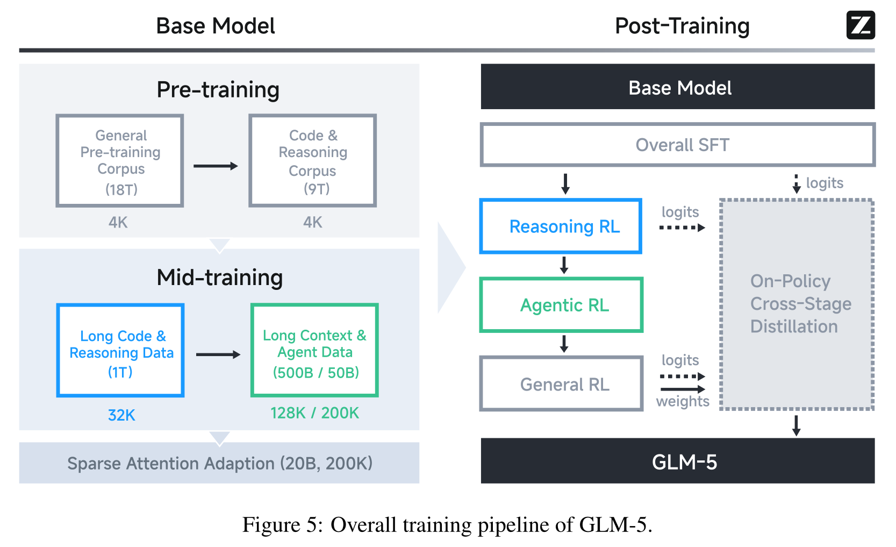

# 训练系统

Agentic RL 把推理服务、交互环境和分布式训练绑成一个系统。GPU 利用率只是局部指标；真正目标是在可控 policy lag 下持续产生有效、可验证的轨迹。

## 数据流

```text
task queue
  -> rollout scheduler
  -> inference workers
  -> environment workers
  -> verifier
  -> trajectory buffer
  -> learner
  -> checkpoint registry
  -> inference refresh
```

每条轨迹应携带 policy、tokenizer、prompt template、tool schema、environment 和 verifier 版本。缺少任何一项都可能使奖励无法解释。

<div markdown="block">
<figure class="paper-figure paper-figure--wide" id="glm-5-figure-05" data-paper-source="glm-5" data-paper-asset="glm-5-figure-05" markdown="1">
[{ width="1667" height="1017" loading="lazy" decoding="async" }](../assets/papers/glm-5/figure-05-training-pipeline.png)
<figcaption><strong>Figure 5 提醒我们，Agentic RL 并不是一个可以单独替换的末端 loss。</strong>它接收经过长上下文与 Agent 数据 mid-training 的 base model，又与 Reasoning RL、General RL 和在策略跨阶段蒸馏共享 logits、weights 与学生轨迹；任何阶段的 tokenizer、模板或 policy 版本漂移都会沿这条链传播。<span class="paper-figure__source">图源：<a href="https://arxiv.org/pdf/2602.15763v2#page=4">GLM-5: from Vibe Coding to Agentic Engineering, Figure 5, p. 4</a>；Copyright © 2026 GLM-5 Team，<a href="https://creativecommons.org/licenses/by/4.0/">CC BY 4.0</a>。</span></figcaption>
</figure>
</div>

<div markdown="block">
<figure class="paper-figure paper-figure--wide" id="k25-figure-10" data-paper-source="kimi-k2-5" data-paper-asset="k25-figure-10" markdown="1">
[{ width="1454" height="617" loading="lazy" decoding="async" }](../assets/papers/kimi-k2-5/figure-10-agentic-rl-runtime.png)
<figcaption><strong>Figure 10 把 Agentic RL 的运行面拆成 rollout 管理、单任务 agent loop、环境、推理服务与训练服务。</strong>黑盒环境通过 LLM gateway 返回观察，白盒环境可暴露受控状态，训练服务还要处理推理与训练引擎之间的权重不一致；这张图说明系统边界，不表示所有环境都应开放内部状态。<span class="paper-figure__source">图源：<a href="https://raw.githubusercontent.com/MoonshotAI/Kimi-K2.5/3e60763b943e93c443287c383e0468ffe05b188f/tech_report.pdf#page=23">Kimi K2.5: Visual Agentic Intelligence, Figure 10, p. 23</a>；Copyright (c) 2026 Moonshot AI，<a href="https://github.com/MoonshotAI/Kimi-K2.5/blob/3e60763b943e93c443287c383e0468ffe05b188f/LICENSE">Modified MIT License</a>。</span></figcaption>
</figure>
</div>

## Rollout 与训练的资源冲突

Rollout 偏好大量解码实例和高显存 KV cache；训练偏好大 batch、反向计算和高带宽通信。常见部署方式：

| 方式 | 优点 | 风险 |
| --- | --- | --- |
| colocated | 复用 GPU，减少空闲 | 权重切换、显存碎片与抖动 |
| disaggregated | 推理与训练独立扩缩 | 参数同步、网络与调度复杂 |
| time-shared | 阶段清晰，易实现 | GPU 等待，周期长 |
| elastic pool | 适配动态任务长度 | 资源管理和容错最复杂 |

端到端吞吐更接近

$$
\text{throughput}=
\frac{\text{valid training tokens}}
{\max(T_{\text{rollout}},T_{\text{verify}},T_{\text{learn}},T_{\text{sync}})}
$$

而不是单个 kernel 的峰值。

<div markdown="block">
<figure class="paper-figure paper-figure--wide" id="k2-figure-13" data-paper-source="kimi-k2" data-paper-asset="k2-figure-13" markdown="1">
[{ width="1558" height="1288" loading="lazy" decoding="async" }](../assets/papers/kimi-k2/figure-13-engine-switching.png)
<figcaption><strong>Figure 13 展示一种同池部署的权重切换协议：训练权重按 stage 广播到推理侧，并通过固定或 PCIe-bound 调度隐藏部分转换开销。</strong>它把“复用 GPU”具体化为带同步点的状态迁移；若权重版本、广播完成边界或 KV 生命周期没有进入协议，表面上的资源共享会变成不可解释的 policy lag。<span class="paper-figure__source">图源：<a href="https://raw.githubusercontent.com/MoonshotAI/Kimi-K2/1b4022bbb7187cf4011a8bdf0b4cd10e2daa26c4/tech_report.pdf#page=32">Kimi K2: Open Agentic Intelligence, Figure 13, p. 32</a>；Copyright (c) 2025 Moonshot AI，<a href="https://github.com/MoonshotAI/Kimi-K2/blob/1b4022bbb7187cf4011a8bdf0b4cd10e2daa26c4/LICENSE">Modified MIT License</a>。</span></figcaption>
</figure>
</div>

## 长度不均衡

agent 轨迹长度重尾：简单任务几步结束，困难任务可能运行很久。固定 batch 会产生 straggler。可采用：

- 按估计长度或环境类型分桶；
- continuous batching；
- 超时与阶段性检查点；
- 动态补充短 episode；
- 将验证与环境 I/O 异步化。

不能简单截断所有长轨迹，因为尾部可能包含最终奖励和恢复行为。需要区分预算终止、环境故障和策略主动终止。

部分 rollout 可以在一批轨迹达到预设完成比例后解除 barrier，把其余 episode 连同环境与采样状态暂停并在后续 iteration 恢复。这条路线降低 straggler 等待，却把 length-dependent selection 与跨版本 policy lag 带入训练；状态字段和校正边界见[在线 RL](../training/online-rl.md#partial-rollout)。[Kimi K3](../landscape/works/kimi-k3.md) 提供了这一组合的完整实例。

<div markdown="block">
<figure class="paper-figure paper-figure--wide" id="k15-figure-03" data-paper-source="kimi-k1-5" data-paper-asset="k15-figure-03" markdown="1">
[{ width="1650" height="808" loading="lazy" decoding="async" }](../assets/papers/kimi-k1-5/figure-03-rl-system-partial-rollout.png)
<figcaption><strong>Figure 3 同时画出学习数据流和 partial rollout：未完成轨迹可以保存环境与采样状态，在后续 iteration 继续。</strong>解除 batch barrier 能减少长尾等待，但恢复样本可能跨越 policy 版本；因此完成比例、暂停状态、behavior log-probability 与重新入队规则必须一起记录。<span class="paper-figure__source">图源：<a href="https://raw.githubusercontent.com/MoonshotAI/Kimi-k1.5/cf9a8785730c7e59d788956e1e40dc9fc31ebf08/Kimi_k1.5.pdf#page=8">Kimi k1.5: Scaling Reinforcement Learning with LLMs, Figure 3, p. 8</a>；Kimi Team，<a href="https://creativecommons.org/licenses/by-nc-nd/4.0/">Creative Commons Attribution-NonCommercial-NoDerivatives 4.0 International</a>。</span></figcaption>
</figure>
</div>

## Policy lag

设轨迹由版本 $v_b$ 生成，learner 当前版本为 $v_l$，则 lag 可按更新步、KL 或 wall-clock 表示。只记录“最新模型”不足以审计。

控制手段包括：

- 限制 buffer 最大年龄；
- 每次 learner 更新后逐步刷新 inference worker；
- 对过旧轨迹降低权重或丢弃；
- 监控 behavior/current policy 的 token-level KL；
- 在 checkpoint registry 中使用不可变版本。

参数热更新必须保证一个 episode 内模型版本是否允许变化；若允许，轨迹概率就不再来自单一 policy。

[SAO](../landscape/works/sao-compactionrl.md#sao) 进一步把 prompt 内的多 rollout 等待视为异步 barrier：单条轨迹完成后即可进入训练队列，但 learner 仍须保存真实 behavior log-probability、限制 policy lag，并审计 DIS 丢弃了哪些 token。

<div markdown="block">
<figure class="paper-figure paper-figure--wide" id="k3-figure-11" data-paper-source="kimi-k3" data-paper-asset="k3-figure-11" markdown="1">
[{ width="1933" height="600" loading="lazy" decoding="async" }](../assets/papers/kimi-k3/figure-11-training-pipeline.png)
<figcaption><strong>Figure 11 展示 free-stage pipeline 的核心变化：设备不必在同一逻辑 stage 上齐步等待，而可把前向、反向、reduce 与 broadcast 错开。</strong>减少 bubble 的代价是更多在途版本和依赖；调度器必须知道每个 microbatch 使用哪份权重、梯度何时可见，以及故障恢复应回到哪个一致性边界。<span class="paper-figure__source">图源：<a href="https://raw.githubusercontent.com/MoonshotAI/Kimi-K3/521359a5cae5e79d02e5a2102c2cea9ce3b9b79a/k3_tech_report.pdf#page=19">Kimi K3 Technical Report, Figure 11, p. 19</a>；Copyright (c) 2026 Moonshot AI，<a href="https://github.com/MoonshotAI/Kimi-K3/blob/521359a5cae5e79d02e5a2102c2cea9ce3b9b79a/LICENSE">Kimi K3 License</a>。</span></figcaption>
</figure>
</div>

## Token WAL 与抢占恢复

百万 token trajectory 若在中途抢占后从头重采，长样本经历故障的概率更高，训练数据会产生 length-dependent selection bias；固定 seed 也只有在 batch-invariant、deterministic kernel 下才可能重放相同 token。

[DeepSeek-V4](../landscape/works/deepseek-v4.md#rollout-resilience) 为每个已提交 token 写 write-ahead log（WAL），抢占时同时保存外部 KV。正常恢复从最后一个 committed token 继续；KV 遭遇致命丢失时，才从已持久化 token 做 prefill 重建。提交边界必须发生在把 token 或工具动作暴露给环境之前，否则非幂等副作用可能执行成功却没有日志。

V4 还把超长 trajectory 分成轻 metadata 与重 token fields：全局 shuffle、packing 和 dynamic minibatch 只搬 metadata，worker 临执行时再从 shared memory 取 token、mask、log-prob 等大字段，并在 minibatch 后释放。完整状态机见 [V4 系统闭环](../landscape/works/tilelang-mega-moe.md#rollout-wal)。

## 可暂停的微虚拟机

长时工具轨迹不仅要保存 token，还要保存进程、文件、网络模拟器和外部应用状态。[AgentENV](https://github.com/kvcache-ai/AgentENV) 使用 Firecracker microVM、dirty-page 增量 checkpoint 与 pause/resume/fork，为这类环境提供了一个公开实现入口；Firecracker 的隔离和启动机制可从其 [NSDI 论文](https://www.usenix.org/conference/nsdi20/presentation/agache)核对。

[Kimi K3 技术报告](https://github.com/MoonshotAI/Kimi-K3/blob/main/k3_tech_report.pdf)报告 AgentENV 的最低 checkpoint/resume 延迟为 133/49 ms、约 $6.5\times$ memory overcommit，并累计运行 51,219,741 个 sandbox、1,505,678 个 image。这些是特定基础设施上的团队测量，不能替代目标集群基准。迁移时应重点验收：

- snapshot 是否包含磁盘、内存、虚拟时钟、随机源与网络状态；
- fork 后父子环境的写入是否 copy-on-write 隔离；
- verifier、隐藏测试和凭据是否始终在 guest 权限之外；
- 被暂停 episode 的 GPU KV、policy revision 与 microVM snapshot 是否原子绑定。

## 超长上下文的共置资源池

训练、rollout 与环境共置时，百万级上下文会同时挤压 KV、optimizer state、gradient buffer 和 checkpoint I/O。K3 报告披露的处理方式包括：把 rollout KV 写回 CPU，训练状态按需卸载到 NVMe，用自动节流避免 I/O 反压，并复用梯度 buffer；其目标是在数百张 GPU 规模内维持 1M-context RL。

这是一个分层内存控制问题，不是一套可直接复用的固定参数。调度器应分别测 GPU/CPU/NVMe 的 byte-seconds、传输带宽、stall 与恢复开销；只有当预取能覆盖传输且不会拖垮环境 I/O 时，offload 才增加端到端有效吞吐。

## Reward 与 Verifier 服务

可验证奖励经常包含编译、测试、浏览器或远程 API，吞吐与 GPU 推理不同。Verifier 集群需要：

- sandbox 与资源配额；
- 依赖缓存和镜像版本；
- 确定性 seed 与时间控制；
- 测试隔离，防止轨迹篡改；
- 对 timeout、infra error、wrong answer 分别编码；
- 重试的幂等性与成本记录。

把基础设施错误记为零奖励会训练模型回避特定任务，而不是提高能力。

## 检查点

除了模型权重，还应保存：

- optimizer、scheduler 与随机数状态；
- rollout/learner 全局步；
- tokenizer、模板和 tool schema；
- reward/verifier 版本；
- 已消费任务与 replay buffer 游标；
- 数据混合与 curriculum 状态；
- 分布式拓扑和关键依赖版本。

恢复后先做小规模 canary：固定任务、固定 seed、比较 logits/奖励/工具协议，再恢复全量生产。

## 观测指标

### 学习

- reward 分布与各分量；
- KL、entropy、clip fraction、优势均值与方差；
- 训练/验证任务成功率；
- 长度、终止类型和工具错误率。

### 系统

- rollout tokens/s、有效轨迹/s；
- TTFT、decode throughput、KV cache 命中；
- 环境 reset/step/verifier 延迟；
- learner MFU、通信和 checkpoint 时间；
- policy lag、队列年龄与失败重试。

只看平均值会隐藏长尾；至少同时报告 p50、p95、p99。

## 开源系统入口

[veRL](https://github.com/volcengine/verl) 提供面向大语言模型 RL 的训练与 rollout 组织，可用于理解 actor、critic、reference、reward 和推理引擎如何分离。阅读框架时，优先追踪数据对象与版本边界，而非只记命令行参数。

behavior version、old log-prob 与异步 batch 字段见[轨迹与策略契约](trajectory-contract.md)，分布式基础见[集合通信与状态分片](../systems/collectives-sharding.md)、[模型并行](../systems/model-parallelism.md)和[检查点与容错](../systems/checkpointing.md)。

## GLM-5 / slime 的连续流水线 {#glm-slime}

GLM-5 把训练与推理引擎放在不同 GPU 设备上，由推理端持续产生轨迹，达到阈值后送入 learner，每 $K$ 个梯度更新再同步权重。报告没有进一步限定二者是否属于独立集群。中央 Multi-Task Rollout Orchestrator 把不同工具与 reward 服务标准化为 message list，并报告支持超过千条并发 rollout。

稳定性依赖四个互相配合的机制：

- TITO Gateway 保存真实 token IDs、behavior log-prob 与边界；
- direct double-sided IS 对 ratio 越界 token 做 hard mask；
- weight revision 过滤陈旧轨迹；
- consistent hashing 让同一 rollout 固定到同一 DP rank，保持 KV locality。

这种系统的吞吐分母应包含被 gate 掉的 token 与环境失败；只报 actor 生成速度会高估有效训练率。完整数据流、公式与最小实现见 [slime 与异步 Agentic RL](../landscape/works/slime-async-agentic-rl.md)。

## Reference {#reference}

- [veRL](https://github.com/volcengine/verl)
- [AReaL: A Large-Scale Asynchronous Reinforcement Learning System](https://arxiv.org/abs/2505.24298)
- [THUDM/slime](https://github.com/THUDM/slime)
- [AgentENV](https://github.com/kvcache-ai/AgentENV)
- [Firecracker: Lightweight Virtualization for Serverless Applications](https://www.usenix.org/conference/nsdi20/presentation/agache)
- [Kimi K3 Technical Report](https://github.com/MoonshotAI/Kimi-K3/blob/main/k3_tech_report.pdf)
- [DeepSeek-V4: Towards Highly Efficient Million-Token Context Intelligence](https://arxiv.org/abs/2606.19348)
- [GLM-5: from Vibe Coding to Agentic Engineering](https://arxiv.org/abs/2602.15763)
