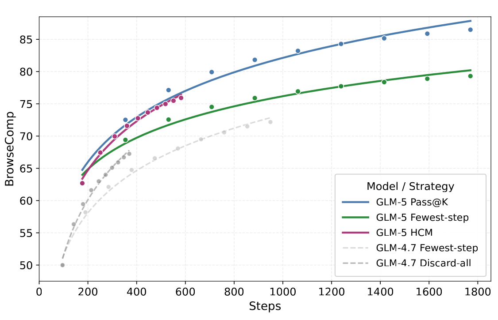

# Coding Agent

Coding Agent 不是“会生成代码的聊天模型”，而是围绕仓库状态反复观察、计划、操作、验证和恢复的闭环系统。模型能力决定上限，harness 决定能力能否稳定落地。

## 基本闭环

$$
s_{t+1}=T(s_t,a_t,o_t),\qquad
a_t\sim \pi_\theta(\cdot\mid s_t,o_{\le t}),
$$

其中 $s_t$ 包含仓库、任务、工具权限和历史状态，$a_t$ 是读文件、搜索、编辑、执行测试或请求输入等动作，$o_t$ 是工具输出。系统直到满足验收条件、达到预算或进入需要外部决策的状态才终止。

## 六层架构

| 层 | 职责 | 典型失效 |
| --- | --- | --- |
| 任务层 | 目标、范围、完成条件 | 把模糊愿望当成可验证任务 |
| 上下文层 | 代码搜索、规则、历史与压缩 | 关键约束被截断或污染 |
| 推理层 | 分解、决策、反思与预算 | 计划漂移、重复探索 |
| 工具层 | 文件、终端、浏览器、API | 参数错误、权限扩大 |
| 执行层 | sandbox、worktree、进程与并发 | 覆盖用户改动、相互踩写 |
| 验证层 | test、lint、render、diff、CI | 用命令成功代替结果正确 |

具体产品实现会合并或拆分这些层；评估时应按职责比较，而不是只看界面形态。

## 上下文工程

好的上下文不是越长越好。它要保留：

- 当前目标与明确的非目标；
- 最近的有效观察与尚未验证的假设；
- 仓库级规则、修改范围和用户已有改动；
- 关键接口、调用链与测试证据；
- 下一步行动所需的最小材料。

上下文压缩必须区分事实、推断和待办。若把失败尝试压缩成“已解决”，后续代理会在错误状态上继续行动；若保留所有工具输出，注意力又会被噪声占满。

<div markdown="block">
<figure class="paper-figure paper-figure--wide" id="glm-5-figure-08" data-paper-source="glm-5" data-paper-asset="glm-5-figure-08" markdown="1">
[{ width="1125" height="725" loading="lazy" decoding="async" }](../assets/papers/glm-5/figure-08-context-management.png)
<figcaption><strong>Figure 8 说明长任务的 context manager 实际上在分配“可继续行动的步数”。</strong>保留全部历史可能过早耗尽窗口，过度删除又会丢失证据；图中的 HCM 只是在特定搜索任务上给出一个折中实例。Coding Agent 还需要把仓库状态、测试结果、未提交改动和恢复点存到可重新读取的外部状态，而不是只压缩聊天文本。<span class="paper-figure__source">图源：<a href="https://arxiv.org/pdf/2602.15763v2#page=19">GLM-5: from Vibe Coding to Agentic Engineering, Figure 8, p. 19</a>；Copyright © 2026 GLM-5 Team，<a href="https://creativecommons.org/licenses/by/4.0/">CC BY 4.0</a>；已裁去原始 caption 与周围正文。</span></figcaption>
</figure>
</div>

## 工具契约

工具接口应满足：

1. 参数具有明确类型和作用域；
2. 读操作与写操作可区分；
3. 输出包含可验证的对象标识；
4. 失败可诊断，重试不会制造额外副作用；
5. 高风险动作需要更强权限或确认；
6. 日志足以重建状态，但不泄露凭据。

工具调用成功只说明接口返回成功，不说明任务完成。例如 `git push` 成功不代表 CI 和线上部署成功；HTML 返回 200 也不代表公式与交互正确渲染。

## 外部模型接入：不要混淆六个层次

把一个 Coding Agent 切到第三方模型，并不是“改一个模型名”这么简单。至少有六个彼此独立的层次：

| 层次 | 回答的问题 | Codex 接入 DeepSeek 的实例 |
| --- | --- | --- |
| harness | 谁维护任务循环、工具执行、权限和上下文 | Codex CLI / IDE / Desktop |
| model | 谁生成下一步推理或动作 | `deepseek-v4-flash` |
| wire API | 客户端按什么请求与事件协议通信 | Responses API |
| provider | 请求发到哪里、如何认证 | `https://api.deepseek.com/` 与 Bearer token |
| model catalog | 客户端如何得知窗口、推理档位、工具和指令模板 | 单独的 `models.json` |
| config scope | 变更影响一次运行、一个 profile，还是所有客户端 | 命令行覆盖、`deepseek.config.toml` 或全局 `config.toml` |

因此，“接口能返回文本”只验证了 model、provider 与 wire API 的最短链路；它没有证明工具循环、上下文压缩、图片、搜索、MCP、审批和恢复都兼容。反过来，`models.json` 也不是模型实现：它只是客户端侧的能力声明，不能让服务端凭空支持一个协议字段或工具。

以 Codex 的隔离 profile 为例，provider 配置可以保持很小：

```toml
# ~/.codex/deepseek.config.toml
model = "deepseek-v4-flash"
model_provider = "deepseek"
model_reasoning_effort = "high"
model_catalog_json = "~/.codex/models.deepseek.json"

[model_providers.deepseek]
name = "DeepSeek"
base_url = "https://api.deepseek.com/"
wire_api = "responses"
env_key = "DEEPSEEK_API_KEY"
```

随后以 `codex --profile deepseek` 启动。profile 把 provider 与模型目录限制在显式选择的 CLI 会话中，普通 `codex` 仍使用原有默认配置；如果目标是让所有客户端都默认切换，则需要修改用户级 `~/.codex/config.toml`。provider 和认证字段不能放在项目级 `.codex/config.toml` 中，因为 Codex 会忽略这些机器级设置。

凭据与 provider 配置也应分离。Codex 支持用 `env_key` 读取环境变量，或用 `[model_providers.<id>.auth]` 调用外部凭据助手；把长期 API Key 直接写进可复制的 TOML 虽然方便，却扩大了备份、日志、截图和误提交的泄露面。一个可靠的切换流程还应保留原配置、验证 TOML/JSON、检查凭据来源、做最小 API 调用，再做一次完整 agent 回合。

### 能力取交集，而不是取并集

截至 2026-07-31，DeepSeek 的 Responses API 只列出 `deepseek-v4-flash`；`deepseek-v4-pro` 尚不支持该协议。当前兼容层支持文本、function tool、服务端 web search 和 Codex 使用的 `apply_patch` custom tool，但不支持图片或文件输入，也不支持 `previous_response_id`、`conversation`、`store`、background mode 等服务端状态能力。超出交集的字段有些会被忽略，而不是显式报错。

这意味着 Codex 仍可在本地保存任务历史、执行 shell 和回传工具结果，但每轮模型请求必须服从 DeepSeek 的实际协议边界。服务端无状态并不等于 agent 无状态：状态可以由 harness 保存在本地，并在后续请求中重新发送；代价是更高的输入 token、上下文压缩压力和对自动 prefix cache 的依赖。公开的 1M context 也不等于任意 1M token 工作流都稳定可用，仍需为系统指令、工具 schema、历史和输出预留空间。

## 规划与执行

短任务适合隐式一步计划；跨文件或长时任务需要显式状态机：

```text
discover -> design -> edit -> local_verify -> publish -> remote_verify
                   \-> recover / request_decision
```

每个阶段都要有退出条件。计划不是固定剧本：新的仓库事实可以让后续步骤重排，但不能悄悄改变目标或扩大权限。

## 长时任务

长时任务最常见的问题不是模型不会写代码，而是状态逐渐腐烂：

- 任务列表与真实仓库不同步；
- 工具输出截断，错误被后续摘要掩盖；
- 子任务完成但集成边界未验证；
- 进程或外部服务在等待期间发生变化；
- 为绕过局部失败而积累临时补丁。

稳定做法是使用可恢复检查点：每个里程碑保存目标、变更集合、验证结果、剩余风险和下一动作。长时能力还应按“在固定成功率下可独立完成的任务时长”评估，而不是按单次最长演示。参考 [METR 的 time-horizon 方法](https://metr.org/time-horizons/)。

## 验证金字塔

1. **静态检查**：格式、类型、依赖和秘密扫描；
2. **局部测试**：修改模块的单元或属性测试；
3. **集成测试**：真实接口、数据库、浏览器或构建链；
4. **变更审计**：diff 范围、无关文件和用户改动；
5. **远端验证**：CI、部署状态与实际线上行为。

越靠上成本越高，但不能由下层完全替代。视觉界面、文档公式和交互尤其需要浏览器级检查。

## 评测 Coding Agent

[SWE-bench](https://arxiv.org/abs/2310.06770) 把真实 issue 与仓库修复连接起来，但单一通过率仍不够。还应记录：

| 维度 | 问题 |
| --- | --- |
| 正确性 | 是否通过隐藏测试并满足原始需求 |
| 范围控制 | 是否修改无关文件或破坏兼容性 |
| 效率 | token、工具调用、时间与算力 |
| 恢复能力 | 面对失败、冲突和截断能否继续 |
| 可审计性 | 结论是否指向可复查证据 |
| 安全性 | 权限、秘密、外部副作用是否受控 |

## 开源实现的阅读入口

- [OpenAI Codex](https://github.com/openai/codex)：终端代理、工具执行与任务状态；
- [Claude Code 文档](https://docs.anthropic.com/en/docs/claude-code/overview)：上下文、工具与权限模型；
- [OpenCode](https://github.com/anomalyco/opencode)：客户端与 provider 组合；
- [Pi](https://github.com/badlogic/pi-mono)：轻量代理循环与可扩展工具。

这些项目变化很快，具体命令与能力应以各自版本化文档为准。通用工具调用见[工具与智能体](agents.md)，强化学习视角见 [Agentic RL](../agentic-rl/index.md)。

## 从 coding benchmark 到环境生产线 {#glm-agentic-engineering}

GLM-5 的 Agentic Engineering 路线把 coding task 视为环境生产问题：从 issue–PR 对恢复仓库与依赖，用 F2P 测新增行为、P2P 防止回归，再记录工具、token、policy revision 与终止原因。报告称构建超过 10K 个九语言环境；另以 Harbor 合成 terminal tasks。

它提示 Coding Agent 评测至少有三个分母：原始任务、可成功构建的环境、实际得到有效 verdict 的运行。只对第三个分母报 pass rate 会把环境腐烂和超时静默删除。详见 [GLM Agentic Engineering](../landscape/works/glm-agentic-engineering.md) 与[数据与环境](../agentic-rl/data-environments.md#glm-environments)。

## Reference {#reference}

- [METR 的 time-horizon 方法](https://metr.org/time-horizons/)
- [SWE-bench](https://arxiv.org/abs/2310.06770)
- [OpenAI Codex](https://github.com/openai/codex)
- [Claude Code 文档](https://docs.anthropic.com/en/docs/claude-code/overview)
- [OpenCode](https://github.com/anomalyco/opencode)
- [badlogic/pi-mono agent framework](https://github.com/badlogic/pi-mono)
- [RepoLaunch](https://arxiv.org/abs/2505.23419)
- [GLM-5: from Vibe Coding to Agentic Engineering](https://arxiv.org/abs/2602.15763)
- [DeepSeek：Integrate with Codex](https://api-docs.deepseek.com/quick_start/agent_integrations/codex/)
- [DeepSeek：Using the Responses API](https://api-docs.deepseek.com/guides/responses_api/)
- [DeepSeek：Models & Pricing](https://api-docs.deepseek.com/quick_start/pricing/)
- [OpenAI Codex：Custom model providers](https://learn.chatgpt.com/docs/config-file/config-advanced#custom-model-providers)
- [OpenAI Codex：Configuration Reference](https://learn.chatgpt.com/docs/config-file/config-reference#configtoml)
