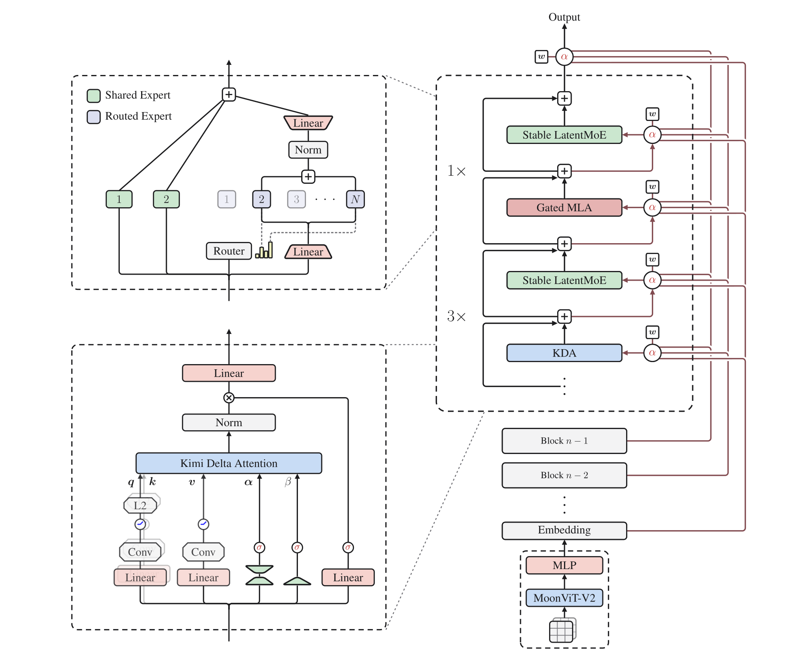

# 稀疏与替代架构

Dense Transformer 同时沿两个方向增长：更多层和通道提高参数容量，更长序列提高注意力计算与缓存成本。MoE、状态空间模型、线性注意力、记忆和混合架构分别尝试解耦其中一部分成本。

本页保留为稳定比较入口：

- [Mixture of Experts](moe.md)：让每个 token 只激活部分参数；
- [状态空间与线性注意力](state-space-linear-attention.md)：用有限状态递推降低长序列成本；
- [记忆架构](memory-architectures.md)：在窗口、段、外部存储与可塑参数之间保存历史；
- [长上下文](long-context.md)：位置扩展、稀疏可见性、分布式 attention 与有效长度；
- [推理时计算](../reasoning/test-time-compute.md)：保持模型结构不变，在回答阶段分配更多采样与搜索。

## 先区分优化对象

| 路线 | 主要解耦对象 | 不会自动解决 |
| --- | --- | --- |
| 稀疏 MoE | 总参数容量与每 token 激活计算 | 序列长度、通信、KV Cache |
| MQA/GQA/MLA | KV Cache 与 query head 数 | attention 的全局二次 score |
| Window/sparse attention | 可见边数量与序列长度 | 窗口外精确内容寻址 |
| SSM/线性注意力 | 历史长度与递推状态大小 | 有限状态的信息容量 |
| 外部检索 | 参数记忆与可更新知识 | 检索错误、额外延迟、证据利用 |
| 测试时搜索 | 单次前向能力与回答计算预算 | 基础模型、verifier 与样本相关性 |

因此“更高效”必须附带明确分母：训练 FLOPs、decode FLOPs、峰值显存、KV bytes、通信量、端到端吞吐、延迟或质量约束。

还要区分两种完全不同的稀疏：

- <strong>参数稀疏</strong>决定一次前向激活多少权重，例如 top-$k$ expert；
- <strong>关系稀疏</strong>决定一个 token 能读取多少历史位置，例如 sliding window。

前者主要改变 channel mixing，后者主要改变 token mixing。将二者都写成“稀疏模型”会掩盖路由通信、状态容量和可见性语义的差别。

## 混合架构

不同 token mixer 可以按层或分支组合。常见分工是：

- local/full attention 保留精确内容寻址；
- SSM 或线性注意力压缩大部分历史；
- MoE 增加通道容量；
- 外部检索提供可更新、可引用的非参数信息。

混合比例不是越复杂越好。实现需要回答：

1. 哪些层拥有精确 KV；
2. 哪些层只有固定大小 recurrent state；
3. 状态能否 chunkwise 训练并逐 token 推理；
4. 不同 mixer 的 norm、残差和位置接口是否一致；
5. runtime 是否真正支持相应 kernel 与 cache；
6. 质量收益来自架构还是参数量、数据和训练预算差异。

以每层状态为中心，可以把 hybrid decode 的接口写成

$$
(y_t,s_t^{\text{rec}},K_t,V_t)
=F(x_t,s_{t-1}^{\text{rec}},K_{<t},V_{<t}),
$$

其中 recurrent state 是固定大小，attention KV 随可见历史增长。模型若每隔若干层保留 full attention，就同时拥有两类生命周期不同的状态：prefix 复用、beam fork、speculative rollback 和跨设备迁移都必须同时更新，不能只复制 KV。对应推理边界见[缓存复用](../inference/cache-reuse.md)和[推测解码](../inference/speculative-decoding.md)。

<figure class="paper-figure paper-figure--wide" id="k3-figure-02" data-paper-source="kimi-k3" data-paper-asset="k3-figure-02" markdown="1">
[{ width="1967" height="1617" loading="lazy" decoding="async" }](../assets/papers/kimi-k3/figure-02-architecture.png)
<figcaption><strong>Figure 2 给出一个混合架构的具体实例：token mixing、条件计算和跨层残差分别由不同子结构承担。</strong>图中 KDA、Gated MLA 与 Stable LatentMoE 的交替说明“线性时间”“稀疏参数”和“精确注意力”可以同时存在；它只证明 K3 的组合方式，不能把这一层比率当成其他工作负载的默认最优解。图源：<a href="https://raw.githubusercontent.com/MoonshotAI/Kimi-K3/521359a5cae5e79d02e5a2102c2cea9ce3b9b79a/k3_tech_report.pdf#page=3">Kimi K3 Technical Report, Figure 2, p. 3</a>；Copyright (c) 2026 Moonshot AI，<a href="https://github.com/MoonshotAI/Kimi-K3/blob/521359a5cae5e79d02e5a2102c2cea9ce3b9b79a/LICENSE">Kimi K3 License</a>。</figcaption>
</figure>

## 先固定工作负载，再比较

公平比较至少固定：

- tokenizer、训练数据与 token 数；
- 总参数、激活参数和每 token FLOPs；
- hidden size、状态大小、层数与优化器；
- 训练硬件、kernel、batch 和 sequence length；
- prefill、decode、短上下文与长上下文四类速度；
- perplexity、关联回忆、复制、长程检索与真实任务；
- checkpoint、量化、并行和服务栈成熟度。

只比较渐近复杂度或单一 benchmark 容易把架构收益、工程成熟度和规模差异混在一起。

不同目标通常导向不同选择：

| 工作负载 | 首要问题 | 应优先测量 |
| --- | --- | --- |
| 短 prompt、高并发 decode | 权重与状态读取是否带宽受限 | TPOT、batch scaling、bytes/token |
| 超长 prefill | token mixer 是否物化平方关系 | TTFT、峰值显存、有效 TFLOP/s |
| 长程精确检索 | 有限状态是否丢失稀有细节 | needle/关联回忆及位置切片 |
| 大容量知识与技能 | 参数容量能否低成本扩大 | 激活 FLOPs、expert load、all-to-all |
| 高频更新知识 | 权重重训是否必要 | 检索召回、证据利用、更新延迟 |

这张表不是模型排名。一个 hybrid 可以在长 prefill 上省计算，却因 kernel 不成熟在小 batch decode 更慢；也可能在平均 benchmark 持平，但在精确复制或状态重置时出现结构性失败。

## 对“替代”的最低证据要求

稳定正文优先描述可复现的计算图、复杂度和已公开实现。新模型在自有配方上的结果适合作为案例，不应直接推出“已取代 attention”或“能无限记忆”。涉及前沿方案时，应同时写出公开 checkpoint、kernel、独立复现、测试规模和未验证外推。

至少要同时存在：同数据同预算的训练比较、短长序列的端到端性能、状态重置与 chunk/step 等价测试、关键压力任务、公开实现和可检查 checkpoint。系统层的 MoE 通信见 [MoE 系统](../systems/moe-systems.md)，序列模型的最小递推与等价性实验见[序列模型手撕实现](../practice/sequence-models.md)，历史路线见[线性注意力与状态空间谱系](../landscape/lineages/linear-time-sequence-models.md)。

## Reference {#reference}

- [Switch Transformers: Scaling to Trillion Parameter Models with Simple and Efficient Sparsity](https://arxiv.org/abs/2101.03961)
- [Mamba: Linear-Time Sequence Modeling with Selective State Spaces](https://arxiv.org/abs/2312.00752)
- [Jamba: A Hybrid Transformer-Mamba Language Model](https://arxiv.org/abs/2403.19887)
- [Retrieval-Augmented Generation for Knowledge-Intensive NLP Tasks](https://arxiv.org/abs/2005.11401)
