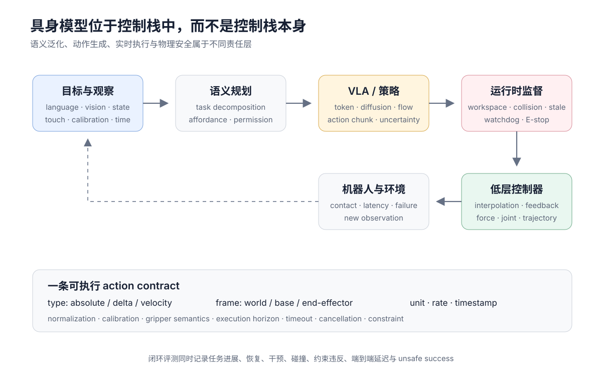

# 具身智能：让感知进入真实闭环

具身智能不是给多模态模型增加一个“动作输出”按钮。它研究的是一个持续闭环：

$$
o_t
\longrightarrow
a_t
\longrightarrow
s_{t+1}
\longrightarrow
o_{t+1}.
$$

模型的输出会改变下一次输入。一个很小的抓取偏差可能让相机看到训练中从未出现的状态；一句语义正确的计划也可能因为坐标、接触或延迟错误而失败。具身系统因此同时属于感知、决策、控制、系统工程和安全。

<figure class="concept-figure" id="embodied-control-stack" markdown="1">



<figcaption>VLA 只占控制栈的一层。语义规划决定做什么，policy 产生动作分布，运行时监督检查时效与约束，低层控制器负责稳定执行；这些责任不能由一个端到端标签合并。</figcaption>

</figure>

## 部分可观测才是常态

环境真实状态为 $s_t$，机器人只能得到相机、语言、本体感知与触觉组成的观察：

$$
o_t
=
\left(
I_t^{1:n},
\ell_t,
q_t,
\tau_t,
\ldots
\right),
\qquad
o_t\sim\mathcal O(o\mid s_t).
$$

策略依赖历史或 belief：

$$
a_t
\sim
\pi_\theta
\left(
a\mid o_{\le t},a_{<t},g
\right).
$$

$q_t$ 可以包含关节、末端执行器、底盘和夹爪状态，$\tau_t$ 是触觉或力矩，$g$ 是任务目标。单帧 RGB 通常无法唯一确定速度、深度、接触、被遮挡对象和执行器内部状态。

## 一条从识别到行动的完整链

```text
vision / audio / language / proprioception
                    ↓
       representation and grounding
                    ↓
         task state / world model
                    ↓
       policy or trajectory planner
                    ↓
         action representation
                    ↓
 runtime guard and low-level controller
                    ↓
                  robot
                    ↓
           new timestamped observation
```

任何一层的输出都需要契约：

- 感知必须保留证据、坐标和时间；
- 状态必须包含决策所需信息；
- 策略必须说明动作分布与 horizon；
- 动作必须说明单位、坐标系和控制语义；
- runtime 必须处理延迟、过期动作、通信失败和急停；
- 评测必须在真实闭环中观察成功、恢复与安全。

视觉 grounding 的入口见[图像理解](../multimodal/vision/representation-grounding.md)，预测动作后果见[世界模型](../world-models/index.md)。

## 历史不是“模型越来越大”

具身学习的主线一直围绕四个瓶颈变化：怎样获得动作数据、怎样抵抗闭环分布漂移、怎样复用语义知识、怎样保持实时和安全。

| 阶段 | 当时的核心问题 | 代表工作 |
| --- | --- | --- |
| 1988–2010s | 能否从传感器直接预测控制 | [ALVINN](https://proceedings.neurips.cc/paper_files/paper/1988/file/812b4ba287f5ee0bc9d43bbf5bbe87fb-Paper.pdf)、end-to-end visuomotor policy |
| 2011–2018 | 模仿学习为何离线准确、上线漂移 | [DAgger](https://proceedings.mlr.press/v15/ross11a.html)、guided policy search、QT-Opt |
| 2021–2022 | 能否先学通用视觉与多任务接口 | R3M、Gato、SayCan |
| 2022–2023 | 能否把机器人控制写成序列建模 | RT-1、RT-2、Open X-Embodiment |
| 2024 | 能否开放跨机器人策略与适配 | Octo、OpenVLA、Diffusion Policy、ACT |
| 2024–2026 | 能否融合互联网语义与高频连续控制 | π0/π0.5、FAST、GR00T、Gemini Robotics |
| 当前前沿 | 能否用视频/世界模型扩数据并支持长程恢复 | latent action、human video、world-action model、hierarchical VLA |

“foundation model”在这里至少需要拆成三层：

- 互联网视觉语言预训练提供语义与常识；
- 跨任务、跨场景或跨机器人轨迹提供 action grounding；
- 目标机器人的后训练、标定和安全控制提供可执行性。

第一层强，不会自动补齐后两层。

## VLM、VLA、世界模型与控制器

这些组件的职责不同：

| 组件 | 输入与输出 | 最适合承担 | 不应默认承担 |
| --- | --- | --- | --- |
| VLM | 图像/视频/文本 → 文本或表示 | 语义、对象、任务分解、检查 | 高频连续控制 |
| VLA | 观察/语言 → 动作或动作块 | 端到端 visuomotor policy | 精确环境模拟 |
| 世界模型 | 状态/动作 → 后继状态、reward/value | 反事实、MPC、想象训练 | 经认证的底层安全 |
| Task planner | 目标/技能/状态 → 子目标 | 长程分解、权限和资源 | 接触级轨迹 |
| Low-level controller | 轨迹/目标位姿 → 电机命令 | 稳定、限位、反馈控制 | 开放语义理解 |

[PaLM-E](https://arxiv.org/abs/2303.03378)展示了把连续传感器表示注入语言模型，[RT-2](https://proceedings.mlr.press/v229/zitkovich23a.html)把动作编码进 VLM 输出空间。它们建立了 VLM 到 VLA 的接口，却没有消除低层控制、标定与运行时约束。

## 具身系统最容易忽略的时间

设观察时间为 $t_o$、policy 完成推理的时间为 $t_p$、动作预计执行时间为 $t_a$。真正被控制的是未来状态，而不是观察发生时的状态：

$$
\Delta_{\mathrm{e2e}}
=
t_a-t_o
=
\Delta_{\mathrm{capture}}
+
\Delta_{\mathrm{encode}}
+
\Delta_{\mathrm{policy}}
+
\Delta_{\mathrm{network}}
+
\Delta_{\mathrm{queue}}.
$$

模型离线动作误差很小，仍可能因 $\Delta_{\mathrm{e2e}}$ 过大而不断追赶旧画面。每个 action chunk 都要带 observation timestamp、生成时间、执行周期和取消语义。相关最小 guard 见[规划、评测与安全](planning-evaluation-safety.md#runtime-guard)。

## 数据与动作必须一起读

一条机器人轨迹不仅是图像和 action array。至少需要：

$$
\mathcal T
=
\left\{
(o_t,a_t,r_t,d_t,\text{timestamp}_t,\text{metadata})
\right\}_{t=0}^{T}.
$$

metadata 应固定：

- robot embodiment、末端执行器与相机；
- absolute、delta 还是 velocity action；
- world/base/end-effector/camera frame；
- 单位、控制率、观测与动作对齐；
- task、success、failure、intervention 与 reset；
- 语言标注来源；
- 许可证、个人信息与采集环境。

没有这些字段，跨数据集训练可能只是在同一个 tensor 名下混合不同物理语义。[VLA 与数据谱系](vla-data-lineage.md)详细解释 Open X、DROID、人类视频、仿真和生成轨迹各自提供什么。

## 开放环只是第一道检查

开放环评测比较预测动作与 demonstration：

$$
\mathcal E_{\mathrm{open}}
=
\frac1T\sum_t d(\hat a_t,a_t).
$$

但多个动作可能同样正确；反过来，接触任务里很小的误差也可能失败。闭环需要执行策略并测：

- task success 与 progress；
- failure recovery 与 human intervention；
- collision、constraint violation 与 unsafe success；
- 新对象、指令、场景、任务和 embodiment；
- latency、jitter、control rate 与资源；
- 任务失败发生在哪一层。

详细协议见[规划、评测与安全](planning-evaluation-safety.md)；动作分布和 imitation learning 见[状态、动作与策略](state-action-policies.md)。

## 证据边界

具身模型的展示往往比可复现实验丰富。阅读时应分开：

- **论文作者报告**：只覆盖论文列出的机器人、任务、trial 数和 reset 条件；
- **开放代码**：能检查软件接口，但未必包含原始训练数据与机器人硬件；
- **开放权重**：还要核查基础模型许可证、action schema 和适配范围；
- **private preview/partner access**：只确认发布方公开的能力与限制；
- **真实部署安全**：不能由仿真 benchmark、语言安全测试或成功视频替代。

截至 2026-07-28，开放与闭源 VLA 都没有消除 embodiment adaptation、长程恢复、低延迟和安全验证这些系统问题。

## 阅读路线

1. [状态、动作与策略](state-action-policies.md)：BC、DAgger、离散动作、ACT、diffusion、flow 与 FAST；
2. [VLA 与数据谱系](vla-data-lineage.md)：RT、Open X、Octo、OpenVLA、π、GR00T 与 Gemini Robotics；
3. [规划、评测与安全](planning-evaluation-safety.md)：层级规划、异步 runtime、benchmark 与防护栈；
4. [世界模型](../world-models/index.md)：动作条件预测、MPC 与交互式环境；
5. [强化学习中的离线与模仿](../reinforcement-learning/offline-imitation.md)：分布偏移和离线目标的形式基础。

## Reference {#reference}

- [Pomerleau, ALVINN: An Autonomous Land Vehicle in a Neural Network](https://proceedings.neurips.cc/paper_files/paper/1988/file/812b4ba287f5ee0bc9d43bbf5bbe87fb-Paper.pdf)
- [Ross et al., A Reduction of Imitation Learning and Structured Prediction to No-Regret Online Learning](https://proceedings.mlr.press/v15/ross11a.html)
- [Levine et al., End-to-End Training of Deep Visuomotor Policies](https://www.jmlr.org/papers/v17/15-522.html)
- [Reed et al., A Generalist Agent](https://arxiv.org/abs/2205.06175)
- [Driess et al., PaLM-E: An Embodied Multimodal Language Model](https://arxiv.org/abs/2303.03378)
- [Zitkovich et al., RT-2: Vision-Language-Action Models Transfer Web Knowledge to Robotic Control](https://proceedings.mlr.press/v229/zitkovich23a.html)
