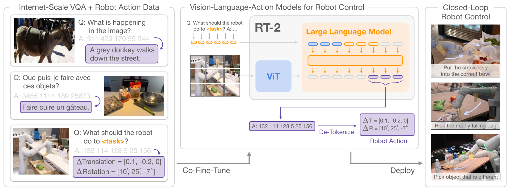

# VLA 与数据谱系

Vision-Language-Action（VLA）模型把视觉观察、语言目标和机器人状态映射到动作。它真正改变的不是给 VLM 多接一个 head，而是把互联网语义、机器人示范和实时控制放进同一个训练与推理接口：

$$
\pi_\theta
\left(
A_t\mid I_t^{1:n},\ell_t,q_t,h_t
\right).
$$

这条路线的历史由数据与动作表示共同推动。模型容量增大若没有更广的状态覆盖，只会更准确地拟合狭窄示范；数据规模增大若没有统一 action contract，又会把不同物理语义混进同一个 tensor。

## VLA 之前：端到端控制并不新

[ALVINN](https://proceedings.neurips.cc/paper_files/paper/1988/file/812b4ba287f5ee0bc9d43bbf5bbe87fb-Paper.pdf) 已经用神经网络从道路传感输入预测车辆转向。[End-to-End Deep Visuomotor Policies](https://www.jmlr.org/papers/v17/15-522.html) 通过 guided policy search 把视觉感知接到电机控制；[QT-Opt](https://arxiv.org/abs/1806.10293) 则用超过 58 万次真实抓取尝试训练闭环 Q-function，论文报告了其抓取协议中的规模收益。

这些工作已经面对今天仍存在的问题：

- 真实交互数据昂贵；
- 训练状态与部署状态不同；
- 相机、机器人和环境一变，分布就改变；
- 离线 action loss 不能替代闭环成功。

后来的基础模型主要增加了语义迁移、跨任务数据和统一序列接口，并没有使这些问题消失。

## 先学表示，再学动作

[R3M](https://arxiv.org/abs/2203.12601) 从 Ego4D 视频中用时间对比、视频语言对齐与表示正则预训练视觉 encoder，再冻结或适配到机器人任务。它说明人类视频可以提供对象、运动和 affordance 先验；但人手与机器人夹爪、第一视角与外部相机、人体运动与机器人 action space 之间仍有 embodiment gap。

[Gato](https://arxiv.org/abs/2205.06175) 把文本、图像、游戏动作和机器人轨迹都编码为序列，由一个 Transformer 跨任务建模。它的重要历史意义是通用 sequence interface，而不是证明同一套 action semantics 已经跨 embodiment 统一。

[PaLM-E](https://arxiv.org/abs/2303.03378) 把视觉和连续传感器 embedding 注入语言模型，展示 embodied reasoning 与语言知识的结合。它主要建立多模态语义接口，并非一个通用高频低层控制器。

## RT-1：机器人控制成为 token prediction

[RT-1](https://arxiv.org/abs/2212.06817) 使用自然语言调制的视觉 encoder、TokenLearner 与 decoder-only Transformer，把动作各维离散成 256 个 bin。论文数据来自 13 台 Everyday Robots 平台，覆盖 13 万余 episode 和 700 多项任务。

其目标可写为

$$
\mathcal L_{\mathrm{RT1}}
=
-
\sum_{t,d}
\log
p_\theta(q_{t,d}\mid I_{\le t},\ell,q_{<t}),
$$

其中 $q_{t,d}$ 是第 $d$ 个动作维的离散 token。这个接口简单、推理相对直接，也把连续控制精度、action range 和 robot-specific semantics 压进 tokenizer。

RT-1 的成功率和泛化数字是论文作者在该机器人、任务、背景扰动与 reset 协议中的报告，不能与另一机器人或仿真 benchmark 的百分比直接比较。

## RT-2：把 Web 语义带进动作空间

[RT-2](https://proceedings.mlr.press/v229/zitkovich23a.html) 把机器人动作表示为 VLM 可以输出的文本 token，并在 Web 视觉语言任务与机器人轨迹上 co-finetune：

$$
\mathcal L
=
\lambda_{\mathrm{web}}\mathcal L_{\mathrm{VLM}}
+
\lambda_{\mathrm{robot}}\mathcal L_{\mathrm{action}}.
$$

关键不是动作“真的变成语言”，而是它与自然语言输出共享自回归接口和部分预训练表示。co-finetuning 保留视觉语言能力，同时让 Web 中的对象、符号和语义关系帮助新指令泛化。

论文报告约 6000 次机器人评测，并展示了未在机器人数据中直接示范的对象语义和简单推理迁移。这些是作者报告；动作精度、接触控制和新 embodiment 仍依赖机器人数据。

<div markdown="block">
<figure class="paper-figure paper-figure--wide" id="rt2-figure-01" data-paper-source="rt-2" data-paper-asset="rt2-figure-01" markdown="1">
[{ width="1663" height="629" loading="lazy" decoding="async" }](../assets/papers/rt-2/figure-01-vla-cofinetuning.png)
<figcaption><strong>Figure 1 展示了 RT-2 的关键接口转折：机器人动作被序列化为 VLM 可预测的 token，并与互联网视觉语言数据共同微调。</strong>图中共享 token 接口解释了语义迁移从哪里进入，但不表示低层动力学来自 Web 数据；动作范围、机器人形态和闭环恢复仍由机器人轨迹与执行系统约束。<span class="paper-figure__source">图源：<a href="https://proceedings.mlr.press/v229/zitkovich23a/zitkovich23a.pdf#page=2">RT-2, Figure 1, p. 2</a>；Copyright © 2023 the authors，PMLR 229，<a href="https://creativecommons.org/licenses/by/4.0/">CC BY 4.0</a>。</span></figcaption>
</figure>
</div>

## Open X-Embodiment：先统一数据入口

[Open X-Embodiment](https://arxiv.org/abs/2310.08864) 联合 21 个机构、22 种 robot embodiment，把 60 个数据集整理到统一格式。论文口径为 527 个 skills、160,266 个 tasks，并展示跨机器人联合训练的正迁移。

统一 RLDS/数据字段解决的是“怎样读进来”，没有自动解决：

- 不同 action 维度与控制语义；
- 不同相机、频率和时间对齐；
- language label 的粒度；
- 成功、失败与中止定义；
- 某 embodiment 在 mixture 中占比过高；
- 跨机器人 normalization。

跨 embodiment 模型必须显式保留 embodiment id、state/action mask、坐标变换与 normalization statistics。否则“共享动作空间”可能只是 padding 后 shape 相同。

## Octo：模块化的开放 generalist policy

[Octo](https://arxiv.org/abs/2405.12213) 在约 80 万条 Open X 机器人轨迹上训练 93M 参数的 Transformer policy，支持语言或目标图像条件、多相机输入和 diffusion action head。模块化 attention 与 readout 让新传感器、动作空间和形态可以用小规模目标数据适配。

[官方仓库](https://github.com/octo-models/octo)为 MIT 代码，提供 93M/27M checkpoint、训练与 finetuning 示例。仓库说明预训练 action chunk 长度为 4；执行整块还是只执行第一步仍由 runtime 决定。

Octo 的开放性提高了可检查性，但跨新机器人依然通常需要 finetune、正确 observation mapping 与 action normalization。

## OpenVLA：开放 7B VLM 到机器人策略

[OpenVLA](https://proceedings.mlr.press/v270/kim25c.html) 以 Prismatic VLM 为基础，融合 DINOv2 与 SigLIP 视觉特征、Llama-2 语言主干，并在 970K Open X 轨迹上训练 7B VLA。它继续使用离散动作 token，把大规模 VLM 表示接到机器人控制。

许可必须分层写：

- [代码仓库](https://github.com/openvla/openvla)为 MIT；
- 原始 `openvla-7b` 与 `openvla-v01-7b` 权重继承 Llama 2 Community License；
- 论文的 PMLR 版本适用 PMLR 的 CC BY 4.0 发表协议。

“open-source VLA”不能省略基础模型和权重的附加条款。

## π0：语义前缀与连续动作专家

[$\pi_0$](https://arxiv.org/abs/2410.24164)使用约 3B 的 PaliGemma VLM 与约 300M action expert。图像与语言组成可缓存前缀，本体状态和长度 50 的连续 action chunk 进入 action expert；block-wise attention 允许动作 token 内双向交互。

动作不再量化为逐维 token，而用 flow matching：

$$
A^\tau=\tau A+(1-\tau)\epsilon,
\qquad
\mathcal L_{\mathrm{FM}}
=
\mathbb E
\|v_\theta(A^\tau,o,\tau)-(A-\epsilon)\|^2.
$$

这让高频连续控制不受固定 bin 精度限制，也引入 iterative integration、action expert latency 和 chunk freshness 问题。公式与最小实现见[状态、动作与策略](state-action-policies.md#flow-matching-action)。

[$\pi_{0.5}$](https://arxiv.org/abs/2504.16054)进一步联合异构机器人数据、high-level subtask prediction、视觉语言数据等，论文重点是 open-world generalization 与 knowledge insulation：既让 Web 知识进入策略，也减少机器人训练对通用语义的破坏。

截至 2026-07-28，[openpi](https://github.com/Physical-Intelligence/openpi) 公开 π0、π0-FAST 与 π0.5 的代码、基础 checkpoint 和若干机器人 finetune 示例。仓库称基础模型在 10K+ 小时机器人数据上预训练；这是当前仓库说明，不应倒写成 2024 年 π0 原论文已经披露的固定数据总量。代码为 Apache-2.0，并另有 Gemma 许可文件。

## FAST：让自回归动作重新适合高频控制

[FAST](https://arxiv.org/abs/2501.09747) 先以 DCT 把动作块变到频域，再量化并用 BPE 压缩。论文报告它使 autoregressive VLA 能处理逐时间步 binning 难以建模的高频灵巧任务；FAST+ 是在一百万条真实机器人动作序列上训练的通用 tokenizer。

它与 π0 的 flow head 形成两种取舍：

| 接口 | 优势 | 代价 |
| --- | --- | --- |
| FAST 自回归 token | 复用 next-token、可变长度、训练接口统一 | tokenizer 误差、串行解码 |
| Flow action expert | 连续多峰动作、整块并行表示 | 多步积分、独立 action head |

二者不能只按“token vs continuous”判断；要在相同机器人、control rate、推理预算和训练数据上比较。

## GR00T：VLM 与高频动作系统分工

[GR00T N1](https://arxiv.org/abs/2503.14734) 使用双系统结构：

- System 2 VLM 编码语言和视觉语义；
- System 1 diffusion Transformer 通过 flow matching 生成连续动作块；
- per-embodiment MLP 对齐 state/action；
- 数据混合包括真实机器人、人类视频、仿真与 neural trajectory。

原论文 action horizon 为 16。它还用 inverse dynamics model 从当前/未来人类视频帧预测 latent/neural action，试图把 action-free 视频接到机器人预训练。

当前 [Isaac-GR00T 仓库](https://github.com/NVIDIA/Isaac-GR00T)的最新公开 release 是 2026-04-18 的 N1.7 Early Access。官方说明包括：

- 3B base model；
- Cosmos-Reason2-2B / Qwen3-VL 架构的 VLM backbone；
- relative end-effector action space；
- 发布方称使用 20K 小时 EgoScale human video；
- 代码 Apache-2.0，模型权重为 NVIDIA Open Model License；
- Early Access 阶段支持、稳定性和完整 benchmark 保证有限。

因此 N1 论文、N1.7 仓库能力和未来 GA 承诺必须分开写。

## Gemini Robotics：闭源双层路线

[Gemini Robotics 1.5](https://deepmind.google/en/models/gemini-robotics/gemini-robotics/) 是 Google DeepMind 的 VLA，官方页面强调语义泛化、interactivity、dexterity 与多 embodiment；截至核验日期状态为 private preview，公开分数属于发布方在其协议中的报告。

[Gemini Robotics On-Device](https://deepmind.google/models/gemini-robotics/gemini-robotics-on-device/) 面向本地低延迟运行和开发者 finetune，但状态仍是 private preview/trusted tester。

[Gemini Robotics-ER 1.6](https://deepmind.google/models/model-cards/gemini-robotics-er-1-6/) 于 2026-04-20 发布模型卡，是基于 Gemini 3 Flash 的 embodied-reasoning VLM，接受文本、图像、音频和视频并可做工具调用与高层推理。它不是直接输出低层动作的 VLA。将 ER 作为高层 planner、VLA 作为低层 policy，是当前官方展示的双模型路线。

闭源 preview 可以说明产品边界和发布方评测，不能承担训练数据、实现细节或独立复现结论。

## 数据决定模型学到哪一种“世界”

| 数据来源 | 提供 | 缺口与风险 |
| --- | --- | --- |
| Web 图文/视频 | 语义、对象、常识、运动先验 | 无可执行动作、版权与偏差 |
| 人类第一/第三视角视频 | affordance、手物交互、长尾活动 | embodiment gap、相机运动、动作不可见 |
| Teleoperation | 高质量可执行示范 | 昂贵、operator/style bias |
| Autonomous rollout | learner 实际状态与失败 | policy-biased、需要安全接管 |
| 仿真 | 便宜、完整 state/action、可重置 | sim-to-real、脚本偏差 |
| 生成/neural trajectory | 扩大稀缺场景和动作标签 | 物理错误、错误伪标签放大 |
| Failure/intervention | 恢复与安全边界 | 采集危险、需要原因与纠正标签 |

典型公开数据各自覆盖不同切片：

- [BridgeData V2](https://arxiv.org/abs/2308.12952)：60,096 条轨迹、24 个环境，使用低成本可复现机器人；
- [DROID](https://arxiv.org/abs/2403.12945)：论文报告 76K 轨迹、350 小时、564 个场景与 84 类任务；
- [Open X-Embodiment](https://arxiv.org/abs/2310.08864)：跨机构和机器人聚合；
- Ego4D/Ego-Exo4D：人类活动和手物交互，而非直接机器人 action；
- LIBERO、CALVIN、RoboCasa、SimplerEnv：分别提供不同仿真/评测协议，分数不可脱离版本和 reset 条件比较。

### 一个最小轨迹契约 {#trajectory-contract}

下面用最常见的 $T+1$ 个 observation 与 $T$ 个 action 检查 shape、时钟和 schema。真实 RLDS/LeRobot 数据可使用别的打包方式，但必须保留同样的不变量。

```python
import numpy as np
def validate_episode(episode):
    obs, action = episode["observation"], episode["action"]
    ot, at, meta = episode["observation_time"], episode["action_time"], episode["meta"]
    required = {"embodiment", "action_type", "frame", "rate_hz", "units"}
    if required - meta.keys():
        raise ValueError(f"missing metadata: {sorted(required - meta.keys())}")
    if len(obs) != len(action) + 1 or len(ot) != len(obs) or len(at) != len(action):
        raise ValueError("expected T+1 observations and T actions")
    if np.any(np.diff(ot) <= 0) or np.any(np.diff(at) <= 0):
        raise ValueError("timestamps must be strictly increasing")
    if action.ndim != 2 or len(meta["units"]) != action.shape[-1]:
        raise ValueError("action dimension and units disagree")
    if meta["rate_hz"] <= 0:
        raise ValueError("invalid control rate")
episode = {
    "observation": np.zeros((3, 4)),
    "action": np.zeros((2, 2)),
    "observation_time": np.array([0., .1, .2]),
    "action_time": np.array([.05, .15]),
    "meta": {"embodiment": "demo", "action_type": "delta",
             "frame": "base", "rate_hz": 10, "units": ["m", "rad"]},
}
validate_episode(episode)
assert episode["action"].shape == (2, 2)
```

这段代码不会验证相机与机器人时钟是否真的同步，也不会判断坐标变换正确；这些需要 calibration trajectory、command/feedback 对齐和人工可视化。

## Mixture 不只是采样比例

多源训练可写成

$$
\mathcal L
=
\sum_{m\in\mathcal M}
\lambda_m
\mathbb E_{x\sim D_m}
\left[
\frac{1}{Z_m}
\mathcal L_m(x)
\right].
$$

$\lambda_m$ 是 mixture 权重，$Z_m$ 控制不同序列长度、动作维度和 token 数的归一。若直接按 token 平均，长视频或高维机器人可能获得更大梯度；若按数据集平均，小数据集又可能被过采样到记忆。

训练日志至少要能回答：

- 每种 modality/embodiment 的有效样本和 token；
- action loss 是按步、维度、chunk 还是 episode 归一；
- missing modality 的 mask；
- Web loss 与 robot loss 是否互相遗忘；
- 数据重复、同场景泄漏与 benchmark contamination；
- 数据和模型许可证是否兼容。

## 失效与评测

| 失效 | 原因 | 必要评测 |
| --- | --- | --- |
| 语义强、几何弱 | Web VLM 缺精确动作监督 | 小物体、姿态、接触和遮挡 |
| 跨机器人负迁移 | action/schema 不一致 | per-embodiment 与 leave-one-robot-out |
| 数据量假象 | 相邻帧/重复轨迹很多 | 去重后有效 episode、场景和技能 |
| 语言捷径 | instruction 与场景强共现 | 改写、冲突指令、视觉反事实 |
| 成功轨迹偏差 | 无失败和恢复 | 扰动、intervention、recovery |
| 仿真过拟合 | 视觉与动力学域差异 | matched protocol sim-to-real |
| 预训练遗忘 | robot finetune 破坏语义 | Web/VQA 与 robot 双向回归测试 |
| checkpoint 不可迁移 | action bounds/相机不同 | 明确 adapter、finetune 与 zero-shot |

一项 VLA 结果必须同时说明 robot、任务、训练数据重叠、action schema、control rate、trial 数、reset、是否人工选择 checkpoint，以及开放环还是闭环。模型大小和“训练小时数”本身不能替代这些协议。

视觉 token、轨迹与动作协议的组合测试见[多模态手撕实现](../practice/multimodal.md)。

## Reference {#reference}

- [Pomerleau, ALVINN: An Autonomous Land Vehicle in a Neural Network](https://proceedings.neurips.cc/paper_files/paper/1988/file/812b4ba287f5ee0bc9d43bbf5bbe87fb-Paper.pdf)
- [Levine et al., End-to-End Training of Deep Visuomotor Policies](https://www.jmlr.org/papers/v17/15-522.html)
- [Kalashnikov et al., QT-Opt: Scalable Deep Reinforcement Learning for Vision-Based Robotic Manipulation](https://arxiv.org/abs/1806.10293)
- [Nair et al., R3M: A Universal Visual Representation for Robot Manipulation](https://arxiv.org/abs/2203.12601)
- [Reed et al., A Generalist Agent](https://arxiv.org/abs/2205.06175)
- [Driess et al., PaLM-E: An Embodied Multimodal Language Model](https://arxiv.org/abs/2303.03378)
- [Brohan et al., RT-1: Robotics Transformer for Real-World Control at Scale](https://arxiv.org/abs/2212.06817)
- [Zitkovich et al., RT-2: Vision-Language-Action Models Transfer Web Knowledge to Robotic Control](https://proceedings.mlr.press/v229/zitkovich23a.html)
- [Open X-Embodiment Collaboration, Open X-Embodiment: Robotic Learning Datasets and RT-X Models](https://arxiv.org/abs/2310.08864)
- [Octo Model Team et al., Octo: An Open-Source Generalist Robot Policy](https://arxiv.org/abs/2405.12213)
- [Kim et al., OpenVLA: An Open-Source Vision-Language-Action Model](https://proceedings.mlr.press/v270/kim25c.html)
- [Black et al., $\pi_0$: A Vision-Language-Action Flow Model for General Robot Control](https://arxiv.org/abs/2410.24164)
- [Physical Intelligence et al., $\pi_{0.5}$: A Vision-Language-Action Model with Open-World Generalization](https://arxiv.org/abs/2504.16054)
- [Pertsch et al., FAST: Efficient Action Tokenization for Vision-Language-Action Models](https://arxiv.org/abs/2501.09747)
- [NVIDIA et al., GR00T N1: An Open Foundation Model for Generalist Humanoid Robots](https://arxiv.org/abs/2503.14734)
- [NVIDIA, Isaac GR00T N1.7 Repository](https://github.com/NVIDIA/Isaac-GR00T)
- [Google DeepMind, Gemini Robotics 1.5](https://deepmind.google/en/models/gemini-robotics/gemini-robotics/)
- [Google DeepMind, Gemini Robotics-ER 1.6 Model Card](https://deepmind.google/models/model-cards/gemini-robotics-er-1-6/)
- [Walke et al., BridgeData V2: A Dataset for Robot Learning at Scale](https://arxiv.org/abs/2308.12952)
- [Khazatsky et al., DROID: A Large-Scale In-the-Wild Robot Manipulation Dataset](https://arxiv.org/abs/2403.12945)
