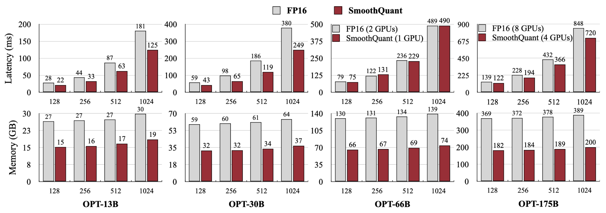

# 推理加速：从瓶颈到端到端收益

推理加速不是方法清单。相同优化可能让长 prompt prefill 变快，却使短 batch decode 变慢；kernel 微基准提升也可能被排队、KV 搬运或网络完全淹没。正确顺序是先建立成本模型，再选择减少关键路径的杠杆，并用相同输出契约验证端到端收益。

量化与 speculative decoding 已分别展开在[量化](quantization.md)和[推测解码](speculative-decoding.md)；本页关注怎样判断它们是否值得采用。

## 先定位瓶颈

端到端时间近似为

$$
T_{\mathrm{request}}
=T_{\mathrm{queue}}
+T_{\mathrm{prefill}}
+T_{\mathrm{decode}}
+T_{\mathrm{transfer}}
+T_{\mathrm{runtime}}
+T_{\mathrm{network}}.
$$

对优化前占比为 $f$ 的部分，若局部加速 $s$ 倍，Amdahl 上界为

$$
S_{\mathrm{total}}
\le
\frac{1}{(1-f)+f/s}.
$$

因此一个只占端到端时间 $5\%$ 的 kernel 即使快一倍，整体上限也只有约 $1.026$ 倍。优化前必须用 trace 确认关键路径，而不是从“理论 FLOPs 很大”推断瓶颈。

算术强度

$$
I=\frac{\mathrm{FLOPs}}{\mathrm{bytes}}
$$

把路径粗分为：

| 路径 | 常见约束 | 首选杠杆 |
| --- | --- | --- |
| 长 prompt prefill | GEMM、attention、HBM traffic | 高效 GEMM、FlashAttention、序列切分 |
| 小 batch decode | 权重与 KV 读取、launch | 批处理、量化、融合、graph |
| 长上下文 decode | KV 带宽与容量 | GQA、分页、KV 量化、复用 |
| 高并发在线服务 | 队列、显存、stage interference | admission、chunked prefill、P/D 分离 |
| 多模型 / adapter | 权重驻留、切换和路由 | 共享、分组、放置和 cache-aware routing |

这是诊断起点，不是跨硬件定律。真实边界由 tensor shape、dtype、并行切分和实现决定。

## 优化层级

### 1. 减少无效工作

- prefix cache 跳过完全相同且兼容的 prefill；
- prompt 去重或在上游移除确实无用的上下文；
- grammar 提前排除非法 token；
- 按业务允许的输出上限避免无界生成；
- routing 或 cascade 只在质量契约允许时选择较小模型。

其中 prompt 压缩、early exit 和模型路由会改变输入或模型，必须单独验证质量；它们不是纯系统优化。

### 2. 减少数据搬运

- [FlashAttention](https://arxiv.org/abs/2205.14135) 用 tiling 与 online softmax 减少 attention 的 HBM 往返；
- fused norm、activation、dequant 和 sampling 减少中间 tensor；
- PagedAttention 降低预留与复制；
- weight-only / activation / KV 量化减少不同路径上的字节；
- P/D 共置或分离应按 KV 传输是否可隐藏来选择。

融合越大不一定越快：register spill、动态 shape、编译时间和 graph break 都可能抵消收益。kernel 细节见 [Kernel 与性能](../systems/kernels-performance.md)。

IO-aware exact attention 的转折见 [FlashAttention 深读](../landscape/works/flashattention.md)；分页 KV 与 block table 的执行语义见 [vLLM / PagedAttention 深读](../landscape/works/vllm-pagedattention.md)。

<div markdown="block">
<figure class="paper-figure paper-figure--wide" id="smoothquant-latency-memory" data-paper-source="smoothquant-benchmark" data-paper-asset="smoothquant-latency-memory" markdown="1">
[{ width="2730" height="962" loading="lazy" decoding="async" }](../assets/papers/smoothquant-benchmark/smoothquant-latency-memory.png)
<figcaption><strong>减少搬运往往先稳定地降低显存，能否降低延迟还取决于执行路径。</strong>图中 W8A8 在固定 A100 与 FasterTransformer 配置下获得不同幅度的 latency 改善；模型规模、序列长度和 GPU 数变化都会移动算力—带宽边界。<span class="paper-figure__source">图源：<a href="https://raw.githubusercontent.com/mit-han-lab/smoothquant/c61476d728e42ae0d8a35e7e78494edcac3237b5/figures/ft_latency_mem.png">SmoothQuant FasterTransformer latency and memory benchmark, standalone benchmark figure</a>；MIT HAN Lab，<a href="https://github.com/mit-han-lab/smoothquant/blob/c61476d728e42ae0d8a35e7e78494edcac3237b5/LICENSE">MIT License</a>。</span></figcaption>
</figure>
</div>

### 3. 增加有效并行

- continuous batching 提高 decode 的有效 batch；
- chunked prefill 控制大 GEMM 效率与 TPOT 干扰；
- tensor parallel 聚合多个设备的带宽，但每层增加 collective；
- data-parallel replica 提高请求吞吐，但复制权重且拆散 prefix locality；
- speculative decoding 把多个串行 target step 变成一次并行验证；
- prefill / decode 独立扩缩，使不同阶段使用不同并行布局。

“更多 GPU”只有在单卡工作粒度和通信比例仍合理时才加速。skinny GEMM 与跨节点 collective 可能让扩展效率下降。

### 4. 降低控制面开销

CUDA Graph 可以复用稳定 launch 序列，但在线 batch 需要 shape bucket、稳定地址和预分配 buffer。编译器和 JIT 可以融合算子，却会引入 warmup、cache key 与版本失效问题。基准必须分别报告：

$$
T_{\mathrm{cold}},
\qquad
T_{\mathrm{warm}},
\qquad
T_{\mathrm{steady}}.
$$

把 compile time 排除在外是允许的，但必须明确；自动扩容和模型冷启动场景还要单独计入。

## 选择矩阵

| 观察 | 更可能有效 | 先排除 |
| --- | --- | --- |
| decode HBM 饱和 | weight / KV quant、增大有效 batch | host scheduler starvation |
| GPU kernel 间隙多 | graph、fusion、减少 host sync | 网络 streaming 阻塞调度线程 |
| prefill 大而 TPOT 抖动 | chunked prefill、P/D 分离 | queue policy 和 token budget 错误 |
| KV 水位高 | GQA、分页、prefix reuse、KV quant | orphan block、碎片和过度预留 |
| 单卡快、多卡慢 | topology-aware parallelism | collective count / dtype 不匹配 |
| cache 命中高但 TTFT 不降 | locality routing、降低安装成本 | 命中统计口径和版本兼容 |
| speculative 接受率高但无收益 | 优化 verify / state path | draft 占用 target 关键资源 |

## 正确性契约

把优化分成三类：

1. **语义精确**：分页、COW、布局重排、等价融合；
2. **分布精确**：满足接受规则的 speculative sampling；
3. **近似**：量化、KV 淘汰、模型路由、prompt 压缩。

语义精确路径应与 reference 在声明容差内对齐；分布精确路径要验证采样分布和状态回滚；近似路径必须给出任务质量、长上下文、结构化输出和安全回归。所有路径还应固定：

```text
model, tokenizer and prompt template
sampling and logit-processor order
dtype, quantization and KV schema
parallel layout and kernel versions
request distribution and cache state
```

性能比较必须使用相同输入流和相同成功条件。若优化改变最大输出、拒绝率或质量，就不能把更少工作直接称为同质量加速。

## 常见失效

- **低比特 checkpoint 更小，运行却不快**：执行时反量化回高精度，没有低比特 GEMM；
- **graph 命中率低**：bucket 太细、地址不稳定或 adapter / grammar 造成图分裂；
- **融合后变慢**：寄存器压力、recompile 或小 batch 下占用率下降；
- **TP 提高理论带宽却恶化 TPOT**：collective 延迟超过局部 GEMM 收益；
- **prefix cache 节省 FLOPs，却增加排队**：热点集中或多层加载太慢；
- **P/D 分离后 TTFT 上升**：KV transfer 与目标端 install 未被隐藏；
- **微基准提升显著，goodput 无变化**：真正瓶颈在 admission、队列或网络。

## 何时不使用某项优化

- 稳定 shape 很少时，不应为每种组合维护 CUDA Graph；
- 低并发、短输出时，draft 开销可能超过 speculative 收益；
- 小模型或短 prompt 下，P/D 分离的固定成本通常不划算；
- 缺少代表性校准和质量集时，不应上线激进量化；
- 前缀重复率低时，不应建设复杂分布式 cache；
- 单卡已满足 SLO 时，多卡并行可能只增加故障面。

## 验证闭环

1. 用 profiler 建立端到端 critical path；
2. 固定 workload、质量契约和未优化基线；
3. 单独验证算子数值或状态等价；
4. 测量 cold、warm 和 steady state；
5. 扩展到真实长度、并发、prefix 冷热和到达过程；
6. 报告 TTFT、TPOT、E2E、goodput、显存、功耗与成本；
7. 注入取消、OOM、版本变化、worker failure 和编译缓存失效；
8. 只保留端到端收益大于维护与可靠性成本的优化。

完整测试口径见[基准与可靠性](benchmarking-reliability.md)。

## Reference {#reference}

- [FlashAttention](https://arxiv.org/abs/2205.14135)
- [Efficient Memory Management for Large Language Model Serving with PagedAttention](https://arxiv.org/abs/2309.06180)
- [Fast Inference from Transformers via Speculative Decoding](https://arxiv.org/abs/2211.17192)
