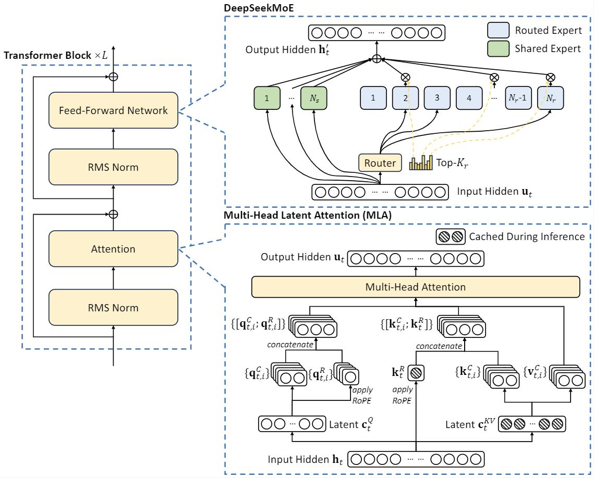

# KV Cache：容量、布局与生命周期

自回归 decode 在第 $t$ 步只产生少量新 query，却要访问此前所有 token 的 key 与 value。缓存历史 K/V 可以避免重复执行 projection，也把推理的主要约束从计算转向显存容量、读带宽和状态管理。长上下文服务中，KV 往往比单个请求的 activation 大得多；如果只计算“每 token 字节数”而忽略分页、所有权和临时 buffer，容量规划仍会失真。

连续张量为何在动态请求下产生外部碎片、PagedAttention 怎样借用虚拟内存式间接寻址，见 [vLLM / PagedAttention](../landscape/works/vllm-pagedattention.md)；它在完整服务演进中的位置见[推理运行时与服务](../landscape/lineages/inference-serving.md)。

## 容量模型

设模型有 $L$ 层，batch 中共有 $B$ 条等长序列，每条缓存 $T$ 个 token；query head 数为 $H_q$，K/V head 数为 $H_{kv}$，head dimension 为 $d_h$，每个缓存元素占 $s$ 字节。未压缩 KV 的主体大小为

$$
M_{\mathrm{KV}}
=2LBTH_{kv}d_hs.
$$

系数 $2$ 对应 K 和 V。单 token、单请求的增量为

$$
m_{\mathrm{token}}
=2LH_{kv}d_hs.
$$

对 MHA，$H_{kv}=H_q$；GQA 与 MQA 通过减小 $H_{kv}$ 降低缓存和读取量。这个收益不等于 attention FLOPs 按同一比例下降，因为每个 query head 仍要计算自己的 score 和 value 加权。

真实峰值应写成显存账本：

$$
M_{\mathrm{peak}}
=M_{\mathrm{weights}}
+M_{\mathrm{KV\ pool}}
+M_{\mathrm{workspace}}
+M_{\mathrm{graph}}
+M_{\mathrm{allocator}}
+M_{\mathrm{transient}}.
$$

只有 cache 确实按 head 或其他维度分片时，才能把 $M_{\mathrm{KV}}$ 除以 tensor-parallel size；复制式布局不能这样估算。量化 scale、block table、对齐、copy-on-write 和通信 staging 也必须计入。

<div markdown="block">
<figure class="paper-figure paper-figure--wide" id="deepseek-v2-architecture" data-paper-source="deepseek-v2-architecture" data-paper-asset="deepseek-v2-architecture" markdown="1">
[{ width="1139" height="918" loading="lazy" decoding="async" }](../assets/papers/deepseek-v2-architecture/deepseek-v2-architecture.png)
<figcaption><strong>standalone architecture diagram 解释 MLA 为什么改变 KV Cache 的“每 token 字节数”：持久对象变成压缩 latent 与位置分支，而不是完整 per-head K/V。</strong>这只解决单 token 状态宽度；分页、block ownership、prefix sharing、beam fork 和回收仍是独立的物理内存问题。<span class="paper-figure__source">图源：<a href="https://raw.githubusercontent.com/deepseek-ai/DeepSeek-V2/ec98ee3cbffc32104cd55dba8af884b3d772602a/figures/architecture.png">DeepSeek-V2 architecture diagram, standalone architecture diagram</a>；Copyright (c) 2023 DeepSeek，<a href="https://github.com/deepseek-ai/DeepSeek-V2/blob/ec98ee3cbffc32104cd55dba8af884b3d772602a/LICENSE-CODE">MIT License</a>。</span></figcaption>
</figure>
</div>

<div markdown="block">
<figure class="paper-figure paper-figure--wide" id="deepseek-v4-figure-06" data-paper-source="deepseek-v4" data-paper-asset="deepseek-v4-figure-06" markdown="1">
[{ width="1875" height="583" loading="lazy" decoding="async" }](../assets/papers/deepseek-v4/figure-06-hybrid-kv-cache-layout.png)
<figcaption><strong>Figure 6 展示压缩注意力为什么不再只有一个“每 token K/V”公式。</strong>最近窗口与未闭合 tail 是随请求推进的 state，完整 CSA/HCA entry 才适合进入 block pool；不同 layer 还需要 indexer 与主 KV 的独立布局。容量模型因而必须同时记录状态种类、闭合粒度、分页单位与回收条件。<span class="paper-figure__source">图源：<a href="https://huggingface.co/deepseek-ai/DeepSeek-V4-Pro/resolve/653b8ce97de7ed21df99e5f6bd49bacb3840df2b/DeepSeek_V4.pdf#page=22">DeepSeek-V4 Technical Report, Figure 6, p. 22</a>；Copyright (c) 2023 DeepSeek，<a href="https://huggingface.co/deepseek-ai/DeepSeek-V4-Pro/blob/653b8ce97de7ed21df99e5f6bd49bacb3840df2b/LICENSE">MIT License</a>。</span></figcaption>
</figure>
</div>

## 连续布局为什么会失效

若为每条请求一次性预留最大长度 $T_{\max}$，长度为 $T_i$ 的请求会浪费 $T_{\max}-T_i$ 个 slot；请求增长、取消和不同长度混排还会造成外部碎片。[PagedAttention](https://arxiv.org/abs/2309.06180) 把逻辑 token 区间映射到固定大小物理 block，使逻辑连续与物理连续解耦：

$$
\text{logical block }j
\longrightarrow
\text{physical block }b_j.
$$

若一个 block 容纳 $q$ 个 token，$n$ 条活跃序列的尾块内部碎片上界为

$$
F_{\max}=n(q-1).
$$

当尾部余数近似均匀时，期望浪费约为

$$
\mathbb E[F]\approx\frac{n(q-1)}{2}.
$$

小 block 降低尾部浪费，却增加 block table、分配频率和 kernel 查表；大 block 的访问更规整，却让短请求和频繁抢占更昂贵。应使用真实长度分布比较“有效 KV 字节 / 已分配 KV 字节”，而不是只比较理论容量。

[vAttention](https://arxiv.org/abs/2405.04437) 展示了另一条精确路线：利用虚拟内存让逻辑 KV 保持连续，并按需映射物理页。分页张量和虚拟内存都不改变模型语义，但依赖不同的 allocator、kernel 和运行时边界；不能只凭论文中的单机结果断言某种布局对所有 GPU、页大小和负载更优。

## 物理布局

逻辑上常写成

$$
K,V\in
\mathbb R^{L\times B\times H_{kv}\times T\times d_h},
$$

生产实现却可能按 layer、block、head、token 或 vector width 重排。布局设计需要同时回答：

- decode kernel 沿哪个维度连续读取；
- GQA 中多个 query head 如何映射到一个 KV head；
- TP / CP 是否分片 cache，跨 rank attention 怎样获得全局上下文；
- block size、vector width 与量化 group 是否对齐；
- P/D 分离时怎样描述 shard、dtype、scale 和字节序；
- CUDA Graph 捕获后物理地址能否稳定复用。

布局 schema 是持久状态的一部分。仅凭 tensor shape 相同，不能认定两个 cache 可互换。

### Page-table 寻址 {#physical-slot-reference}

`block_table[j]` 给出逻辑块 $j$ 对应的物理块号；输入 token 位置后，reference 返回线性 KV pool 中唯一的 `physical_slot`。逻辑位置连续并不要求物理块连续。

```python
def physical_slot(block_table, block_size, token_pos):
    if block_size <= 0 or token_pos < 0:
        raise ValueError("invalid block size or token position")
    logical_block, offset = divmod(token_pos, block_size)
    if logical_block >= len(block_table):
        raise IndexError("logical block is not allocated")
    physical_block = block_table[logical_block]
    if physical_block < 0:
        raise ValueError("physical block id must be non-negative")
    return physical_block * block_size + offset

table = [9, 2, 17]
assert physical_slot(table, 4, 0) == 36
assert physical_slot(table, 4, 5) == 9
assert physical_slot(table, 4, 11) == 71
```

映射的不变量是每个已分配逻辑位置恰好落到 table 指定 block 的同一 offset，越过已分配范围必须失败。生产 kernel 还需把 layer、K/V、head、vector lane、dtype 和 shard stride 纳入地址计算，并在读取前验证 computed-token count；page table 与分配器的组合实验见[手撕：推理引擎 · Page table](../practice/inference-engine.md#page-table-reference)。

<div markdown="block">
<figure class="paper-figure paper-figure--wide" id="k3-figure-12" data-paper-source="kimi-k3" data-paper-asset="k3-figure-12" markdown="1">
[{ width="1521" height="525" loading="lazy" decoding="async" }](../assets/papers/kimi-k3/figure-12-prefix-cache.png)
<figcaption><strong>Figure 12 展示混合模型前缀命中为何需要两种粒度：MLA 使用物理 cache block，KDA 在更细的 hash 边界保存递推 checkpoint。</strong>命中落在物理块内部时，需要恢复对应 KDA 状态并对 MLA 尾块 copy-on-write；只复用一侧会让输出状态与前缀 token 不一致。<span class="paper-figure__source">图源：<a href="https://raw.githubusercontent.com/MoonshotAI/Kimi-K3/521359a5cae5e79d02e5a2102c2cea9ce3b9b79a/k3_tech_report.pdf#page=23">Kimi K3 Technical Report, Figure 12, p. 23</a>；Copyright (c) 2026 Moonshot AI，<a href="https://github.com/MoonshotAI/Kimi-K3/blob/521359a5cae5e79d02e5a2102c2cea9ce3b9b79a/LICENSE">Kimi K3 License</a>。</span></figcaption>
</figure>
</div>

## 生命周期与所有权

物理 block 至少有三种状态：

```text
free
exclusive
shared-read-only
```

最小不变量是：

1. `refcount` 等于仍持有该 block 的逻辑序列数；
2. shared block 被部分续写前必须 copy-on-write；
3. 最后一次 GPU 读写完成前不得进入 free list；
4. cancel、finish、抢占和错误回滚只能释放一次；
5. block table 更新与 computed-token count 同步提交；
6. 未初始化 slot 永远不能被 attention 读取。

最后一块尤其危险：两个请求可能共享完整前缀，却各自继续写入同一个未填满 block。若没有 copy-on-write，错误通常只在并发或特定长度下出现，很难由单请求 logits 回归发现。

### 引用计数与尾块 COW {#kv-tail-copy-on-write-reference}

下面只建模 block table 的所有权：`logical_length` 是已经提交的 token 数，返回值是下一 token 应写入的物理 block 与 block 内 offset。分叉会增加共享 block 的引用计数；若共享尾块尚未填满，续写前必须分配新 block。

```python
def fork_blocks(block_table, refcount):
    child = block_table.copy()
    for block in child:
        refcount[block] += 1
    return child

def writable_tail(block_table, refcount, free_blocks, logical_length, block_size):
    logical_block, offset = divmod(logical_length, block_size)
    if offset == 0:
        block = free_blocks.pop()
        refcount[block] = 1
        block_table.append(block)
    elif refcount[block_table[logical_block]] > 1:
        old = block_table[logical_block]
        block = free_blocks.pop()
        refcount[old] -= 1
        refcount[block] = 1
        block_table[logical_block] = block
    return block_table[logical_block], offset

parent, refs, free = [7], {7: 1, 9: 0}, [9]
child = fork_blocks(parent, refs)
block, offset = writable_tail(child, refs, free, 3, 4)
assert (block, offset) == (9, 3)
assert parent == [7] and child == [9]
assert refs == {7: 1, 9: 1}
```

真实 COW 必须在发布新 block table 前复制旧尾块中已经提交的 K/V 与量化 scale；这个 reference 只展示所有权转换。GPU event、并发 allocator、OOM 回滚和取消幂等仍属于生产边界，不能仅靠 Python 引用计数保证。

运行时状态机、block table 与抢占见[推理运行时](runtime.md)；跨 worker 的布局转换与安装见 [Prefill–Decode 分离](disaggregation.md)。

## 精确节省与有损压缩

需要把不同方法分开评价：

| 方法 | 是否保持原模型语义 | 主要收益 | 主要代价 |
| --- | --- | --- | --- |
| MQA / GQA | 架构定义内精确 | 减少 KV head | 需模型原生支持或重新训练 |
| 分页、虚拟内存、COW | 精确 | 降低预留与复制 | 元数据和 kernel 复杂度 |
| Prefix reuse | 命中条件满足时精确 | 跳过重复 prefill | 查找、隔离与一致性 |
| KV 量化 | 通常近似 | 减少容量和带宽 | 误差、scale 与反量化开销 |
| Window / eviction | 近似 | 将容量限制在窗口内 | 丢失历史可见性 |
| 摘要、低秩、token merge | 近似 | 更激进压缩 | 改变信息和模型行为 |

[KIVI](https://arxiv.org/abs/2402.02750) 按 key 和 value 的不同统计特征设计非对称低比特量化；[KVQuant](https://arxiv.org/abs/2401.18079) 研究逐通道量化、pre-RoPE key 等设计。它们是质量—容量权衡，不能与精确分页混称为“无损 KV 优化”。[StreamingLLM](https://arxiv.org/abs/2309.17453)、[H2O](https://arxiv.org/abs/2306.14048) 与 [PyramidKV](https://arxiv.org/abs/2406.02069) 进一步改变保留 token 的集合，必须以任务和长上下文质量验证。

量化格式、scale 粒度和真实 kernel 路径见[量化](quantization.md)；前缀复用、缓存键和多层缓存见[缓存复用](cache-reuse.md)。

## DeepSeek-V4 的异构 Cache

[DeepSeek-V4](../landscape/works/deepseek-v4.md#heterogeneous-kv) 的 CSA / HCA 让“每层一组同构 KV page”不再成立。同一请求同时包含：

- 最近 128 token 的 SWA KV；
- 尚未凑满 $m=4$ 或 $m'=128$ 的未压缩 tail；
- 已闭合的 CSA / HCA compressed entries；
- 与 CSA 压缩块对齐、供 Lightning Indexer 评分的 compressed indexer keys；
- partial RoPE 的 BF16 坐标和其余 FP8 坐标。

报告把 SWA 与 tail 放进 state cache，把完整 compressed entries 放进 classical block cache，并按 $\operatorname{lcm}(m,m')$对齐物理块。query 对 CSA 先经过 indexer 间接寻址，对 HCA 则遍历全部重压缩项；普通 PagedAttention 的同形 layer、固定 token/block 关系和直接 KV 寻址假设都需要扩展。

因果完成条件是 cache schema 的一部分：当前未闭合压缩块不能提前发布成全局 entry，局部 token 由 SWA 路径承接。完整 layout 与磁盘恢复见 [V4 系统闭环](../landscape/works/tilelang-mega-moe.md#hybrid-kv-layout)。

## 正确性契约

cache descriptor 至少绑定：

```text
exact token ids and computed-token count
model and weight version
tokenizer and prompt-template version
adapter and multimodal-input identity
RoPE and position configuration
layer, head, block and shard layout
storage dtype, quantization schema and scales
tenant and permission boundary
```

读取 cache 前要验证 descriptor；版本不兼容应明确 miss 或拒绝，不能“尽力解释”。量化 cache 还要定义 scale 的轴、group、更新时机和 accumulator dtype。跨设备传输必须在校验、DMA 完成和目标端 block 安装后才能让 decode 可见。

## 何时不应复杂化

- 单请求、短上下文、显存充足时，连续 cache 可能更简单且更快；
- block table 查找或 page fault 已进入关键路径时，应先测 layout 和页粒度；
- prefix 重复率低时，维护索引与逐出策略可能得不偿失；
- 质量敏感且缺少代表性长上下文评测时，不应贸然量化或淘汰 KV；
- 网络不足以隐藏 cache 迁移时，不应仅为资源解耦而引入远程层。

## 验证

功能回归至少覆盖：

1. 连续 reference 与分页 / 虚拟内存路径的 logits 对齐；
2. block 边界、空序列、最大长度和非整除 head；
3. prefix hit / miss、共享尾块与 copy-on-write；
4. cancel、beam 分叉、speculative 拒绝、抢占和 OOM 回滚；
5. TP / CP 分片与 P/D 布局转换；
6. 量化 cache 的逐层误差和端到端任务质量；
7. 版本切换、租户隔离与过期 block 回收。

性能报告至少包含有效 KV 容量、碎片率、读带宽、分配延迟、page / block 大小、命中率、TTFT、TPOT、goodput 和 p99。只报告“最大上下文长度”无法说明系统在并发服务中的可用性。

block table、引用计数、copy-on-write 与调度预算的可审计实现见[手撕：推理引擎](../practice/inference-engine.md)。

## Reference {#reference}

- [Efficient Memory Management for Large Language Model Serving with PagedAttention](https://arxiv.org/abs/2309.06180)
- [vAttention](https://arxiv.org/abs/2405.04437)
- [KIVI](https://arxiv.org/abs/2402.02750)
- [KVQuant](https://arxiv.org/abs/2401.18079)
- [StreamingLLM](https://arxiv.org/abs/2309.17453)
- [H2O: Heavy-Hitter Oracle for Efficient Generative Inference of Large Language Models](https://arxiv.org/abs/2306.14048)
- [PyramidKV](https://arxiv.org/abs/2406.02069)
- [Jenga: Effective Memory Management for Serving LLM with Heterogeneity](https://doi.org/10.1145/3731569.3764823)
- [DeepSeek-V4: Towards Highly Efficient Million-Token Context Intelligence](https://arxiv.org/abs/2606.19348)
