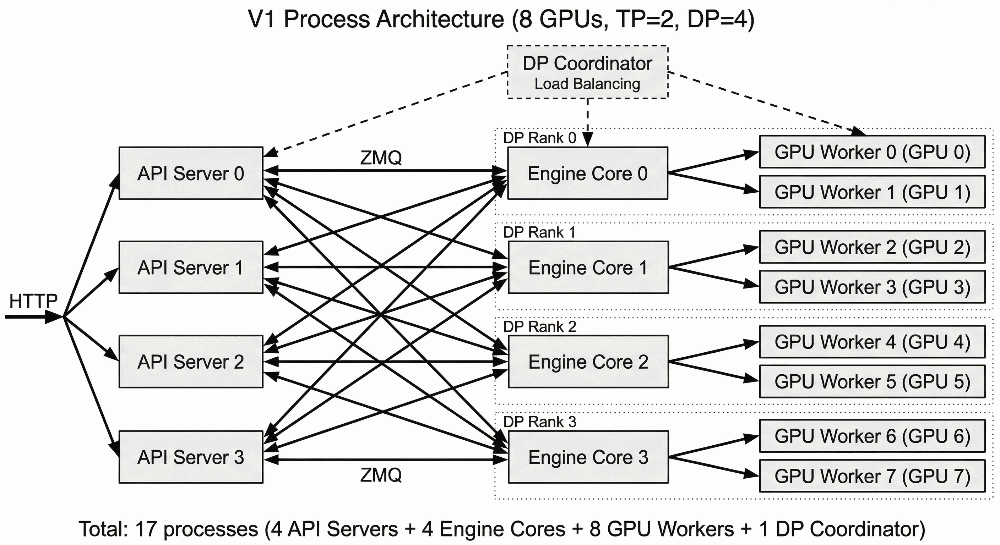

# 调度与 Goodput

LLM 请求同时消耗 prompt 计算、逐 token decode、持续增长的 KV 和流式连接。调度器必须在每一轮决定“谁现在运行、运行多少 token、为未来保留多少显存”。追求设备不空闲很容易，但设备满载并不代表请求按时完成。

<div markdown="block">
<figure class="paper-figure paper-figure--wide" id="vllm-v1-process-architecture" data-paper-source="vllm-process-architecture" data-paper-asset="vllm-v1-process-architecture" markdown="1">
[{ width="2816" height="1536" loading="lazy" decoding="async" }](../assets/papers/vllm-process-architecture/vllm-v1-process-architecture.png)
<figcaption><strong>调度不是一个全局队列就结束了。</strong>请求先跨 API server 和 DP rank 分配，再由各 engine core 维护批次、KV 与执行状态，最后映射到 TP worker；goodput 的尾延迟与公平性必须沿这条状态路径逐层归因。<span class="paper-figure__source">图源：<a href="https://raw.githubusercontent.com/vllm-project/vllm/b6cbba8bc893c61e412a205533aafbee1ae6be31/docs/assets/design/arch_overview/v1_process_architecture_tp2_dp4.png">vLLM V1 process architecture for TP=2 and DP=4, standalone process architecture diagram</a>；vLLM project contributors，<a href="https://github.com/vllm-project/vllm/blob/b6cbba8bc893c61e412a205533aafbee1ae6be31/LICENSE">Apache License 2.0</a>。</span></figcaption>
</figure>
</div>

## 工作负载模型

对请求 $i$，至少记录：

$$
r_i=
\left(
a_i,\,
P_i,\,
\widehat O_i,\,
d_i,\,
w_i,\,
v_i,\,
m_i
\right),
$$

其中 $a_i$ 是到达时间，$P_i$ 是 prompt tokens，$\widehat O_i$ 是输出长度估计，$d_i$ 是 deadline，$w_i$ 是优先级或公平权重，$v_i$ 是模型 / adapter / tokenizer 版本，$m_i$ 是当前 KV 与采样状态。

输出长度估计会错，因此 admission 必须同时有：

- 明确的最大输出策略；
- KV 高水位保护；
- 有界抢占或拒绝；
- 预测偏差的在线校准。

请求数不足以描述负载。一个 32k-token prefill 与一个单步 decode 都是一个请求，却有完全不同的资源成本。

## 从吞吐到 Goodput

对到达率 $\lambda$、平均在途请求数 $L_q$、平均停留时间 $W$：

$$
L_q=\lambda W.
$$

这一定律不要求 Poisson 到达，但要求长期稳定统计。接近饱和时，小幅服务时间波动也会放大队列和尾延迟，因此生产容量必须留出 headroom。

定义满足全部服务约束的指示量

$$
I_i=
\mathbf 1
\left[
T_i^{\mathrm{TTFT}}\le D_i^{\mathrm{TTFT}},
\quad
T_i^{\mathrm{TPOT}}\le D_i^{\mathrm{TPOT}},
\quad
T_i^{\mathrm{E2E}}\le D_i^{\mathrm{E2E}}
\right].
$$

测量窗口 $\Delta t$ 内：

$$
\mathrm{goodput}
=\frac{\sum_i I_i}{\Delta t}.
$$

若请求有不同等级，可以同时报告按请求、按输出 token 和按权重的 goodput，避免大量短请求掩盖长请求饥饿。[Goodput-oriented LLM serving analysis](https://arxiv.org/abs/2410.14257) 进一步讨论了传统吞吐指标的局限。

## 每轮预算

continuous batching 在模型迭代边界重组 batch。[Orca](https://www.usenix.org/conference/osdi22/presentation/yu) 给出了迭代级调度和选择性 batching 的代表性设计。对某一轮，可以写成

$$
N_{\mathrm{scheduled}}
=N_{\mathrm{decode}}
+N_{\mathrm{prefill}}.
$$

调度器受多个预算共同约束：

$$
N_{\mathrm{scheduled}}\le N_{\mathrm{token\ budget}},
$$

$$
M_{\mathrm{KV,new}}+M_{\mathrm{workspace}}
\le M_{\mathrm{free,reserved}},
$$

$$
T_{\mathrm{step}}
\le D_{\mathrm{decode\ stall}}.
$$

token budget 只限制工作量，不能替代 KV、workspace 和 graph shape 约束。

### 推测验证也需要每轮预算 {#speculative-verify-budget}

固定验证最长 speculative block 会把低置信候选也塞进 target batch。低负载时这可能
几乎免费；高并发时，每个无效 verify token 都会占用原本可以服务其他请求的容量。
[DSpark](../landscape/works/dspark.md#scheduler) 把请求 $r$ 的 prefix survival 写成

$$
a_{r,j}
=
\prod_{i=1}^{j}c_{r,i},
$$

选择每请求验证长度 $\ell_r$ 后，总 target token 数和期望产出分别为

$$
B
=
\sum_r(1+\ell_r),
\qquad
\tau
=
\sum_r\left(1+\sum_{j=1}^{\ell_r}a_{r,j}\right).
$$

若引擎已在当前模型、硬件、并行度和 graph 配置上 profile
$\operatorname{SPS}(B)$，就可以比较

$$
\Theta
=
\tau\cdot\operatorname{SPS}(B).
$$

因为同一请求的 $a_{r,j}$ 单调不增，所有 prefix extensions 可以按存活概率全局排序，
再沿这条可行路径选择 verify budget。调度对象不再只是“本轮最多多少 token”，而是
“哪一个请求的下一个候选最值得占用一格 target batch”。

正确性约束与容量目标同等重要：若下一位置 confidence 依赖当前采样 token，就不能
看完未来再回头决定是否提交当前 token，否则会产生 selection bias。同步算法可在
收益首次不升时 early stop；异步生产实现也可以用滞后的历史容量预测形成因果屏障。
不具备这类 non-anticipating 机制的静态阈值或 retrospective top-$K$，不能直接沿用
精确 speculative sampling 的无损结论。

## Prefill 与 Decode 的冲突

大 prefill 更容易形成高效 GEMM，却会拉长正在流式输出请求的 ITL。chunked prefill 把长 prompt 分为多个片段，与 decode 交错：

$$
P_i=\sum_{c=1}^{C_i}P_{i,c}.
$$

chunk 大时 prefill 效率高，chunk 小时 decode stall 更短，但 launch、调度和 partial-state 管理增加。[Sarathi-Serve](https://www.usenix.org/conference/osdi24/presentation/agrawal) 研究了以 chunked prefill 构造 stall-free batching 的路线。

选择 chunk 需要同时测：

- GEMM 与 attention 的 shape 效率；
- 单轮 p95 / p99 时长；
- KV 增长和临时 workspace；
- prompt deadline；
- decode TPOT；
- prefix hit 后剩余未计算 token。

若两阶段长期争夺资源且负载足够大，可进一步考虑 [Prefill–Decode 分离](disaggregation.md)；分离会新增 KV 传输和全局 reservation，不是免费的调度修复。

## Admission Control

admission 的职责是阻止系统接受无法兑现的工作。一个保守检查可写为

$$
\widehat M_{\mathrm{future}}
=
M_{\mathrm{active}}
+\sum_{i\in\mathrm{admitted}}
\widehat O_i\,m_{\mathrm{token},i}
+M_{\mathrm{headroom}}.
$$

只有

$$
\widehat M_{\mathrm{future}}\le M_{\mathrm{KV\ pool}}
$$

时才允许继续入场。因为 $\widehat O_i$ 有误差，还需要 max tokens、动态水位和显式过载行为。P/D 系统中，prefill admission 还必须得到 decode slot 或 KV quota 的承诺。

### 保守 KV reservation {#kv-admission-reference}

下面按优先级和 deadline 遍历候选请求。每个候选声明尚未计算的 prompt、`max_output` 与单 token KV 字节数；函数只在最坏情况 reservation 不越过 `capacity - headroom` 时接纳，并返回被接纳的请求 ID 与新的已预留字节数。

```python
def admit_by_reservation(active_bytes, candidates, capacity, headroom):
    if min(active_bytes, capacity, headroom) < 0 or active_bytes + headroom > capacity:
        raise ValueError("active usage and headroom must fit non-negative capacity")
    limit = capacity - headroom
    reserved = active_bytes
    admitted = []
    order = sorted(candidates, key=lambda r: (-r["priority"], r["deadline"]))
    for request in order:
        terms = request["prompt_remaining"], request["max_output"], request["kv_bytes_per_token"]
        if any(value < 0 for value in terms):
            raise ValueError("token counts and per-token KV bytes must be non-negative")
        future_tokens = request["prompt_remaining"] + request["max_output"]
        required = future_tokens * request["kv_bytes_per_token"]
        if reserved + required <= limit:
            admitted.append(request["id"])
            reserved += required
    return admitted, reserved

requests = [
    {"id": "a", "priority": 1, "deadline": 10, "prompt_remaining": 2,
     "max_output": 4, "kv_bytes_per_token": 100},
    {"id": "b", "priority": 2, "deadline": 5, "prompt_remaining": 1,
     "max_output": 3, "kv_bytes_per_token": 100},
    {"id": "c", "priority": 1, "deadline": 20, "prompt_remaining": 8,
     "max_output": 1, "kv_bytes_per_token": 100},
]
accepted, reserved = admit_by_reservation(200, requests, 1300, 100)
assert accepted == ["b", "a"]
assert reserved == 1200
assert reserved <= 1300 - 100
try:
    admit_by_reservation(0, [{**requests[0], "max_output": -1}], 1300, 100)
except ValueError:
    pass
else:
    raise AssertionError("negative reservations must be rejected")
```

核心不变量是接纳、reservation 与队列入场共享同一个容量边界，任何失败都不能留下幽灵配额。reference 是保守 admission policy，不是完整调度器；生产实现还需加入 block 对齐、workspace、预测误差校准、并发原子更新和显式拒绝原因。continuous batching、状态推进与 goodput 计算的组合实验见[手撕：推理引擎](../practice/inference-engine.md)。

## 公平与优先级

FIFO 简单，但长 prefill 会阻塞短交互；最短作业优先改善平均延迟，却可能饿死长请求；deadline 优先在预测准确时有效，但会压缩无 deadline 流量。

多租户公平应按资源成本而非请求数记账。候选单位包括：

| 记账单位 | 优点 | 缺点 |
| --- | --- | --- |
| input + output tokens | 简单、可解释 | 不反映 prefill / decode 成本差异 |
| GPU time | 接近真实占用 | 依赖 profiler 与并行布局 |
| KV byte-seconds | 反映长驻留成本 | 忽略计算与网络 |
| 货币成本 | 适合配额 | 会随硬件和部署变化 |

[Virtual Token Counter](https://arxiv.org/abs/2401.00588) 提供了将 LLM 服务成本纳入公平调度的一种方法。任何策略都应再加最大等待时间或 ageing，避免低权重请求永久饥饿。

## Cache-aware Routing 与迁移

前缀命中可以节省 prefill，但也会形成热点。worker 选择应比较统一成本：

$$
\mathrm{score}_j
=T_{\mathrm{saved},j}
-T_{\mathrm{queue},j}
-T_{\mathrm{transfer},j}
-T_{\mathrm{risk},j}.
$$

[Preble](https://arxiv.org/abs/2407.00023) 研究了 prefix-aware distributed scheduling；[Llumnix](https://arxiv.org/abs/2406.03243) 研究了请求迁移和负载重平衡。迁移只在剩余排队 / 执行收益超过 KV 传输、暂停和安装成本时值得：

$$
T_{\mathrm{migration}}
<
T_{\mathrm{wait,saved}}.
$$

近期的 SLO-aware 研究如 [SCORPIO（2025）](https://arxiv.org/abs/2505.23022)尝试联合预测和调度。它们应作为研究路线呈现；生产策略仍要对预测偏差、负载漂移和故障恢复做独立验证。

### Fleet 级 affinity 与故障回退

单 worker 的 cache-aware score 还需要 fleet 级 ownership。可以用 consistent hash 为同一 cache identity 选择 primary 与 secondary worker：正常请求优先命中 primary，热点或故障时转向 secondary。hash ring 必须纳入模型、adapter、cache schema 和安全域；成员变化要限制 remap 范围。

secondary 不等于拥有可用缓存。若目标 worker 没有完整前缀或联合状态校验失败，正确回退是重新 prefill，而不是拼接部分 KV。请求 metadata、sampler 和 stream owner 的迁移也必须原子化。[Kimi K3 技术报告](https://github.com/MoonshotAI/Kimi-K3/blob/main/k3_tech_report.pdf)披露了 primary/secondary consistent hashing 与故障后 re-prefill 的 fleet 方案，完整设计见 [Kimi K3](../landscape/works/kimi-k3.md)。

不同请求类别的成本可跨三个数量级：短对话、长上下文 agent、视觉输入和高 effort 推理不能共享一个“并发数”配额。admission 应按类别同时预算 prefill FLOPs、预计 decode tokens、KV byte-seconds、工具/环境 slot 和 deadline，并保留独立 headroom。这样拒绝的是当前系统无法兑现的资源契约，而不是事后依赖大量抢占维持表面吞吐。

## 抢占选择

显存不足时常见两条路线：

- **recompute**：释放 KV，恢复时重新 prefill；
- **swap / migrate**：保留 KV 语义，把数据移到更低层存储或其他 worker。

粗略比较：

$$
T_{\mathrm{recompute}}
\quad\text{vs.}\quad
T_{\mathrm{swap\ out}}
+T_{\mathrm{wait}}
+T_{\mathrm{swap\ in}}.
$$

短上下文或拥塞链路更偏向 recompute；长前缀且高速链路可偏向 swap。无论哪种方式，sampling、grammar、position、RNG 和 computed-token count 都必须随请求恢复。

## 正确性契约

1. 每个请求只存在于一个可枚举状态和一个执行 owner；
2. admission 预留、KV 分配和队列入场要么全部成功，要么全部回滚；
3. token index、stream sequence 和 RNG counter 单调；
4. scheduler 只能读取已完成并可见的 KV；
5. 抢占保存完整 sampler / grammar / position 状态；
6. cancel、timeout、finish 和重试幂等；
7. 公平记账单位稳定、可审计，优先级不能绕过租户配额；
8. 有界队列、最大等待和拒绝原因对上层可见。

## 常见失效与何时不用

- 长 prefill 让 TPOT 抖动：限制 chunk，而不是盲目减小所有 batch；
- 大量 preemption：admission 太乐观，抢占不是常态容量方案；
- cache-aware routing 形成热点：score 缺少队列和失败风险；
- 输出长度预测偏小导致 OOM：加入上限、分位数 headroom 和在线校准；
- 公平策略降低总体 goodput：检查记账粒度与每轮排序开销；
- 低负载时调度收益很小：FIFO + continuous batching 可能已经足够；
- 单租户且成本相近时：不必引入复杂虚拟时间算法；
- 迁移链路慢或 KV 很大时：原地等待可能比 live migration 更好。

## 验证

调度验证需要 trace replay 和合成边界共同覆盖：

1. 短 / 长 prompt 与短 / 长 output 的联合分布；
2. 平稳、突发和热点迁移到达；
3. cache 冷 / 热、adapter 冷 / 热；
4. 多租户权重、deadline 和最大等待；
5. 输出长度系统性低估与高估；
6. KV 高水位、抢占、OOM 和 worker failure；
7. 低载延迟、饱和点、过载与恢复；
8. FIFO、简单 continuous batching 和目标策略的同流量比较。

至少报告 offered load、accepted load、rejected load、goodput、TTFT / TPOT / E2E 分位数、队列时间、KV 水位、抢占次数、cache 命中收益和各租户服务份额。

## Reference {#reference}

- [Goodput-oriented LLM serving analysis](https://arxiv.org/abs/2410.14257)
- [Orca: A Distributed Serving System for Transformer-Based Generative Models](https://www.usenix.org/conference/osdi22/presentation/yu)
- [DSpark hardware-aware prefix scheduling](https://arxiv.org/abs/2607.05147)
- [SGLang DSpark serving implementation](https://www.lmsys.org/blog/2026-07-06-dspark-sglang)
- [Sarathi-Serve](https://www.usenix.org/conference/osdi24/presentation/agrawal)
- [Virtual Token Counter](https://arxiv.org/abs/2401.00588)
- [Preble](https://arxiv.org/abs/2407.00023)
- [Llumnix](https://arxiv.org/abs/2406.03243)
- [SCORPIO（2025）](https://arxiv.org/abs/2505.23022)
- [Kimi K3 Technical Report](https://github.com/MoonshotAI/Kimi-K3/blob/main/k3_tech_report.pdf)
