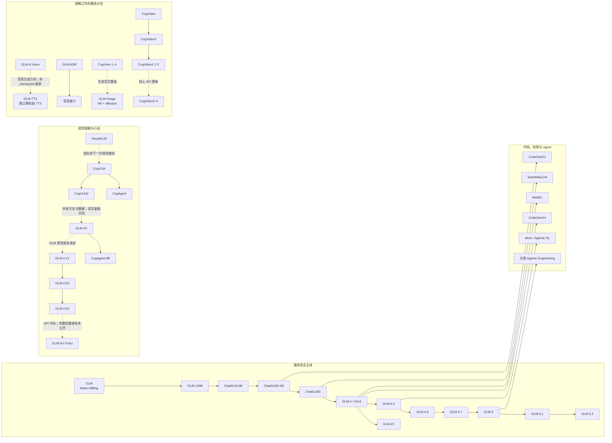

# GLM 家族

GLM 最初指一种把理解与生成放进同一模型的预训练目标；五年后，它又可以指通用语言模型、推理模型、视觉模型、语音模型、图像生成器、代码模型、Agent 运行栈或线上 API。名字延续，并不保证目标函数、tokenizer、主干架构、训练数据或许可证延续。理解这条谱系的关键，因而不是背版本号，而是持续追问三件事：

1. 这次公开的是论文、权重、代码、API，还是只有产品能力说明？
2. 新模型从哪个 checkpoint 或哪条方法线出发，哪些继承关系有直接证据？
3. 一项局部技术怎样重新接回表示学习、后训练、系统和 Agent 闭环？

本页给出家族级入口；精确事件顺序见 [GLM 演化时间线](../glm-timeline.md)，GLM-5 的逐章证据见[总深读](../works/glm-5.md)与[引用图谱](../glm-5-reference-map.md)。内容截至 2026 年 7 月 28 日，只登记能够由论文、官方仓库、模型卡或官方发布台账确认的公开对象。

## 家族地图 {#family-map}

先把边界画清楚，许多看似矛盾的命名便会自然消失。

图中的实线只表示官方材料能够支持的直接演化、继续训练或明确基座关系；虚线表示同一产品方向上的后续发布，不能据名称断言内部 checkpoint 直接继承。还有三类对象必须单列：

- **GLM 核心主线**：从 GLM 目标、GLM-130B、ChatGLM 到 GLM-4.x / 5.x，存在连续的家族报告或官方版本记录。
- **有明确连接的派生线**：例如 CodeGeeX2 基于 ChatGLM2、CodeGeeX4 从 GLM-4-9B 继续训练、VisualGLM 使用 ChatGLM-6B、GLM-4.5V 基于 GLM-4.5-Air。这些关系可落到仓库或论文。
- **同一研究与产品生态中的相邻谱系**：CogView、CogVideo、CogVLM 的部分代际，以及 ImageReward、SCAIL、Kaleido 等工作与 GLM 共享团队、基础设施或应用方向，却不能仅凭组织归属并入 GLM checkpoint 主线。

### 两个最容易混淆的名字

**GLM-Zero Preview<strong> 是 2024 年 12 月上线过的推理模型服务；官方公司时间线确认了产品事件，但截至本页截面没有相应公开权重、代码或完整技术报告。</strong>GLM-Z1** 则是 2025 年 4 月随 GLM-4-0414 开放的 9B / 32B 推理 checkpoint，其中 Rumination 版本带固定搜索协议。二者不是同一个公开对象，也没有足够材料证明简单的 checkpoint 继承关系。[官方里程碑](https://www.zhipuai.cn/en/about)与 [GLM-4 仓库](https://github.com/zai-org/GLM-4)分别固定了这两层证据。

**CogVLM 与 GLM-V** 也不能写成一条无条件直线。CogVLM 以 visual expert 改造语言主干；CogVLM2 的公开主模型基于 Llama 3，而同期 GLM-4V 使用相同数据与训练方法、换成 GLM-4 语言基座。后来的 GLM-4.1V 才在官方论文中形成更清晰的 GLM-V 线。[CogVLM2 仓库](https://github.com/zai-org/CogVLM2)明确给出了这种“方法与数据相近、语言基座不同”的边界。

## 一条历史主线：目标、协议、系统

### 从填空目标开始

2021 年 GLM 想消解 BERT 式双向理解与 GPT 式自回归生成之间的分工。给定被若干 blank 破坏的序列 $x_{\mathrm{corrupt}}$，模型按随机顺序恢复各个 span：

$$
\mathcal L_{\mathrm{GLM}}
=-\sum_{i=1}^{m}\log p_\theta
\left(s_{\pi(i)}\mid x_{\mathrm{corrupt}},s_{\pi(<i)}\right).
$$

二维位置编码一维指向原文位置，另一维标记 span 内部位置；配合 attention mask，同一套参数可以在理解任务中使用双向上下文，也可以自回归生成缺失块。原始[论文](https://arxiv.org/abs/2103.10360)与[参考实现](https://github.com/THUDM/GLM)支持的是这个方法结论，而不是“后续所有 GLM 都继续使用完全相同的目标”。

### 规模化把模型问题变成系统问题

[GLM-130B](https://arxiv.org/abs/2210.02414) 把双语模型推进到 130B 参数，并少见地同时公开权重、训练日志、并行工具和 loss spike 经验。这里的历史转折是：模型质量不再只由目标函数解释，初始化、数值精度、数据混合、3D parallelism、回滚和量化共同成为模型定义的一部分。它建立了工程经验谱系，却不意味着 ChatGLM-6B 是 130B checkpoint 的等比例缩小。

### ChatGLM 把序列变成协议

ChatGLM-6B、ChatGLM2-6B 与 ChatGLM3 逐步加入对话模板、更长上下文、指令与偏好对齐，以及 function call / code interpreter 等工具接口。到了 GLM-4 All Tools，模型面对的不再只是 token 序列，而是

$$
\text{user intent}
\rightarrow \text{tool choice}
\rightarrow \text{structured arguments}
\rightarrow \text{environment observation}
\rightarrow \text{next action}.
$$

因此“模型会不会用工具”无法只从权重判断：schema、chat template、runtime、错误恢复和工具返回格式都属于行为契约。[ChatGLM 家族报告](https://arxiv.org/abs/2406.12793)适合解释这次从对话到工具闭环的迁移。

### 推理并没有另起炉灶

GLM-Zero Preview 先以服务形式试验推理；GLM-Z1 再把 cold start、长程 RL、数学/代码/逻辑任务和搜索式 rumination 放到可下载 checkpoint 上。随后 GLM-4.5 不再维护“普通模型”和“推理模型”两个完全分离的接口，而是在同一 MoE 模型中支持 thinking / non-thinking。4.6 与 4.7 沿着上下文、coding、tool use、interleaved thinking 和 preserved thinking 继续迭代。

这条线说明，test-time compute 不是多输出一段隐藏文本那么简单。它同时改变训练数据、奖励、上下文协议、缓存成本与多轮状态，通用原理应回到[推理后训练](../../training/reasoning-posttraining.md)、[测试时计算](../../reasoning/test-time-compute.md)和[工具使用](../../applications/tool-use.md)理解。

### GLM-5 把模型与 Agent 系统共同扩展

GLM-4.5 的 355B-A32B MoE 建立稀疏主干，GLM-5 再扩到约 744B-A40B，并把 MLA、DeepSeek Sparse Attention、Shared MTP、Muon Split、28.5T token 课程、slime 异步 RL、可执行环境和异构芯片部署放进一份报告。这里的核心不只是更大，而是四个循环闭合：

1. 数据与架构共同决定长上下文能否训练；
2. MTP 同时服务训练信号与推测解码；
3. rollout engine、learner、reward 与环境共同决定 RL 数据分布；
4. 稀疏 attention、量化、kernel 与并行布局共同决定理论节省能否变成服务收益。

完整证据见 [GLM-5 总深读](../works/glm-5.md)，架构部分见 [MLA-256、DSA、Muon Split 与 Shared MTP](../works/glm-5-architecture.md)，环境与运行系统见 [GLM Agentic Engineering](../works/glm-agentic-engineering.md)。

## 公开产物账本 {#release-ledger}

下表中的缩写只描述可核对的公开对象：`P` 为论文或技术报告，`W` 为权重与模型卡，`C` 为代码，`A` 为 API / 产品说明，`D` 为数据或评测工件。某格缺失表示本页没有找到相应一手公开材料，不代表内部不存在。

### 通用语言与推理主线

| 时间 | 对象 | 公开产物 | 可以确认的关系 | 必须保留的边界 |
| --- | --- | --- | --- | --- |
| 2021-03 | GLM | [P](https://arxiv.org/abs/2103.10360) · [C/W](https://github.com/THUDM/GLM) | autoregressive blank infilling 方法起点 | 不能把目标函数自动外推到 4.x / 5.x |
| 2022-10 | GLM-130B | [P](https://arxiv.org/abs/2210.02414) · [C/W/log](https://github.com/zai-org/GLM-130B) | 130B 双语规模化与训练稳定性 | 代码为 Apache-2.0；权重采用单独许可 |
| 2023-03 | ChatGLM-6B | [C/W](https://github.com/zai-org/ChatGLM-6B) · [后续家族报告](https://arxiv.org/abs/2406.12793) | 6B 双语对话与本地部署 | 代码、权重与在线 ChatGLM 产品不是同一对象 |
| 2023-06 | ChatGLM2-6B | [C/W](https://github.com/zai-org/ChatGLM2-6B) · [P](https://arxiv.org/abs/2406.12793) | 对话质量、上下文与推理效率更新 | 参数许可独立于仓库代码 |
| 2023-10 | ChatGLM3 | [C/W](https://github.com/zai-org/ChatGLM3) · [P](https://arxiv.org/abs/2406.12793) | Base / Chat 与 Agent 工具协议合流 | 工具能力依赖 runtime 与 template |
| 2024-01 / 06 | GLM-4 / GLM-4-9B | [P](https://arxiv.org/abs/2406.12793) · [C/W](https://github.com/zai-org/GLM-4) · [A / 产品里程碑](https://www.zhipuai.cn/en/about) | 10T token 家族训练、128K / 1M 开放版本与 All Tools | 旗舰 API、Air、9B 权重和 4V 不能互代 |
| 2024-12 | GLM-Zero Preview | [A / 公司里程碑](https://www.zhipuai.cn/en/about) | 服务端推理模型事件 | 未见同名公开权重、代码或完整报告；不等于 GLM-Z1 |
| 2025-04 | GLM-4-0414 / GLM-Z1 | [C/W](https://github.com/zai-org/GLM-4) | 9B / 32B chat、Z1 reasoning 与 Rumination 分支 | Rumination 有固定搜索协议；不是通用自定义工具模型 |
| 2025-07 / 08 | GLM-4.5 / Air | [P](https://arxiv.org/abs/2508.06471) · [C/W](https://github.com/zai-org/GLM-4.5) · [A](https://z.ai/blog/glm-4.5) | 355B-A32B 与 106B-A12B MoE，hybrid reasoning、coding、Agent | 公开 base/chat/FP8 是不同 checkpoint；报告值仍是团队测量 |
| 2025-09 | GLM-4.6 | [W/C](https://github.com/zai-org/GLM-4.5) · [A](https://z.ai/blog/glm-4.6) | 在 4.5 公布架构上继续增强 200K、coding 与 tool use | 没有同粒度新总报告，不能补写未知配方 |
| 2025-12 | GLM-4.7 / Flash | [W/C](https://github.com/zai-org/GLM-4.5) · [A](https://z.ai/blog/glm-4.7) | interleaved / preserved / turn-level thinking；30B-A3B Flash | 多轮 thinking 还依赖客户端保存协议 |
| 2026-02 | GLM-5 | [P](https://arxiv.org/abs/2602.15763) · [C/W](https://github.com/zai-org/GLM-5) · [A](https://z.ai/blog/glm-5) | 744B-A40B、DSA、Shared MTP 与 Agentic Engineering | 正文 80 层和公开配置 78 层存在冲突 |
| 2026-03 | GLM-5-Turbo | [A](https://docs.z.ai/release-notes/new-released) | 面向高吞吐长链 Agent 的服务版本 | 未见同名开放权重与独立训练报告 |
| 2026-04 | GLM-5.1 | [W/C](https://github.com/zai-org/GLM-5) · [A](https://docs.z.ai/release-notes/new-released) | 更长时间的工程执行与多轮后训练更新 | 仍引用 GLM-5 报告，不能倒填 5.1 配方 |
| 2026-06 | GLM-5.2 | [W/C](https://github.com/zai-org/GLM-5) · [A](https://z.ai/blog/glm-5.2) | 1M context、IndexShare、MTP 更新与 effort control | 博客披露不是一份完整新训练报告 |

更细的 paper / weights / API / license 日期见[演化时间线](../glm-timeline.md)。尤其是“同一仓库托管多代模型”时，仓库更新时间不能代替 checkpoint 发布日。

### 代码、检索、Agent 与训练系统

| 时间 | 对象 | 连接方式 | 公开入口 | 谱系判断 |
| --- | --- | --- | --- | --- |
| 2022-09 | CodeGeeX | 独立 13B code Transformer，23 种语言，训练累计通过约 850B token | [P](https://arxiv.org/abs/2303.17568) · [C/W/D](https://github.com/zai-org/CodeGeeX) | 与 GLM 团队同源，但第一代不是某个 ChatGLM checkpoint 的代码微调 |
| 2023-07 | CodeGeeX2 | 从 ChatGLM2 架构继续代码预训练 | [C/W](https://github.com/zai-org/CodeGeeX2) | 6B 权重有专用模型许可 |
| 2024-07 | CodeGeeX4 | 从 GLM-4-9B 继续训练，统一 completion、interpreter、search、function call 与 repo QA | [C/W](https://github.com/zai-org/CodeGeeX4) | “ALL”描述任务接口，不表示训练配方全部公开 |
| 2023-06 | WebGLM | GLM-10B 加检索器、生成器与偏好 scorer | [P](https://arxiv.org/abs/2306.07906) · [C/D](https://github.com/THUDM/WebGLM) | 它是检索增强系统，不是单一端到端权重的代际名称 |
| 2023-10 | AgentTuning | agent instruction tuning 与 AgentInstruct 数据 | [P/C/D](https://github.com/THUDM/AgentTuning) | 是通用训练方法与数据线，不应伪装成 GLM 核心版本 |
| 2024-04 | AutoWebGLM | 从 ChatGLM3-6B 出发，HTML 压缩、课程数据、拒绝采样与 RL | [P](https://arxiv.org/abs/2404.03648) · [C/W/D](https://github.com/THUDM/AutoWebGLM) | 浏览器环境与动作空间属于模型表现的一部分 |
| 2024-11 | WebRL | self-evolving curriculum、outcome reward model 与在线 RL，应用于 GLM-4-9B / Llama | [P](https://arxiv.org/abs/2411.02337) · [C](https://github.com/THUDM/WebRL) | 是跨基座训练方法，不是 WebGLM 的简单下一 checkpoint |
| 2023–2024 | CogAgent | CogVLM visual expert 路线扩展到高分辨率 GUI grounding；后续 9B 版基于 GLM-4V | [P](https://arxiv.org/abs/2312.08914) · [C/W](https://github.com/zai-org/CogAgent) | 18B 初代与 9B-20241220 的语言基座不同 |
| 2025–2026 | AutoGLM / Open-AutoGLM | 屏幕理解、动作生成与 ADB/HDC 执行闭环 | [C/W](https://github.com/zai-org/Open-AutoGLM) · [A](https://docs.z.ai/release-notes/new-released) | 手机 Agent 成功率依赖设备、应用版本、权限与执行器 |
| 2025–2026 | slime | Megatron learner、SGLang rollout、reward / verifier 与 data buffer 解耦 | [C](https://github.com/THUDM/slime) · [站内深读](../works/slime-async-agentic-rl.md) | 基础设施支持多模型，不等于只属于 GLM checkpoint |
| 2026 | GLM-skills | 把 grounding、prompt generation、OCR 等能力包装成可调用任务接口 | [C](https://github.com/zai-org/GLM-skills) | skill 是提示、工具和运行时层，不应计作新基础模型 |

这条支线反复出现同一个主题：能力单位从“模型输出”扩大成“模型 + 协议 + 环境”。它应与[检索增强](../../applications/rag.md)、[Agent runtime](../../applications/agent-runtime.md)、[coding agents](../../applications/coding-agents.md)、[Agentic RL 数据与环境](../../agentic-rl/data-environments.md)一起阅读。

### 明确派生的专门研究模型

还有一些名称里带 GLM、或直接从 GLM checkpoint 出发的研究模型。它们对某个问题很重要，却不应占据通用主线的版本号：

| 对象 | 直接关系 | 公开入口 | 应怎样归类 |
| --- | --- | --- | --- |
| Multilingual-GLM | 在原始 blank-infilling GLM 上扩展多语训练，公开 1B checkpoint | [C/W](https://github.com/THUDM/Multilingual-GLM) | 原始预训练目标的语言覆盖实验，不是 ChatGLM 的前一代 |
| GLM-iPrompt | 在 GLM-10B 上应用 inverse prompting，覆盖 QA 与诗歌生成 | [C](https://github.com/THUDM/GLM-iprompt) | decoding / controllable-generation 方法，不是新的基础模型主干 |
| MathGLM | 独立训练算术模型，并从 GLM-10B、ChatGLM-6B、ChatGLM2-6B 派生数学文字题版本 | [P](https://arxiv.org/abs/2309.03241) · [C/W/D](https://github.com/THUDM/MathGLM) | 专门数学能力与数据实验；不同 backbone 的 MathGLM 不能合成一个 checkpoint |
| SciGLM | 从 ChatGLM3-6B-Base 微调，配合 self-reflective annotation 构造 SciInstruct | [P](https://arxiv.org/abs/2401.07950) · [C/W/D](https://github.com/THUDM/SciGLM) | 科学指令数据与领域微调支线 |
| ChatGLM-Math | 在 ChatGLM3-32B 上训练 Math-Critique，经 rejection fine-tuning 与 DPO 改善数学对齐 | [P](https://arxiv.org/abs/2404.02893) · [C/D](https://github.com/THUDM/ChatGLM-Math) | 公开的是方法、评测与数据管线，仓库没有提供完整模型部署 |
| LongWriter-GLM4-9B | 从 GLM-4-9B 训练长输出模型，引入 AgentWrite 与 LongWriter-6k | [P](https://arxiv.org/abs/2408.07055) · [C/W/D](https://github.com/THUDM/LongWriter) | GLM-4 派生的长输出研究；后续 LongWriter-Zero 是更广的方法线，不等于 GLM-4.x 产品更新 |

这些工作揭示了“领域模型”的三种不同来源：改预训练语言分布、在通用 checkpoint 上继续训练、或只改变生成与反馈过程。比较它们时，必须把 backbone、数据和优化阶段分开，而不能只看最终名称。

### 评测、数据与工具工件

模型账本回答“发布了什么”，评测账本还要回答“分数是怎样产生的”。一个名称背后可能同时有题集、生成脚本、judge、容器化环境、轨迹和排行榜；它们的版本、许可和可复现性并不相同。尤其是 Agent 评测，模型只是系统的一部分，工具协议、环境镜像、超时、失败恢复和人工裁决都会改变结果。

下面先登记与 GLM 发布、用户分布或明确派生研究直接相连的工件：

| 工件 | 公开对象与用途 | 与 GLM 的直接联系 | 谱系与复现边界 |
| --- | --- | --- | --- |
| GLM-Simple-Evals | [C](https://github.com/zai-org/glm-simple-evals) · [D](https://huggingface.co/datasets/zai-org/glm-simple-evals-dataset)；运行 HLE、LiveCodeBench、AIME、GPQA、MATH500、SciCode 与 MMLU-Pro | 官方用于复现 GLM-4.5 / 4.6 发布评测的 harness | 它从 `simple-evals` 适配而来，不是训练代码；checker / judge endpoint、数据 revision、采样参数与 prompt 必须一同冻结 |
| CC-Bench trajectories | [D](https://huggingface.co/datasets/zai-org/CC-Bench-trajectories) · [A](https://z.ai/blog/glm-4.6)；公开隔离容器内多轮 coding-agent 任务的模型轨迹 | GLM-4.6 发布页用它补充真实工程任务比较，并公开 GLM-4.5 等模型的交互记录 | 轨迹能审计过程，不能单独复建隐藏环境、人工偏好协议或服务 revision；不同任务集版本的胜率不可横向拼接 |
| Terminal-Bench 2 verified | [D](https://huggingface.co/datasets/zai-org/terminal-bench-2-verified)；修复部分环境，并对少量指令—测试不一致做最小改写 | 与 [GLM-5 报告](https://arxiv.org/abs/2602.15763)共同登记，解释终端 Agent 分数对环境缺陷的敏感性 | “environment fixes only”“instruction + environment fixes”和原始 Terminal-Bench 2.0 是三个条件；只有同 revision、资源与超时才可比较 |
| AlignBench | [C/D](https://github.com/THUDM/AlignBench)；683 条中文对齐题，主要由 ChatGLM 在线服务的真实问题分布整理 | 直接连接 ChatGLM 产品使用分布与多维度 judge 评测 | 公开题集不是在线服务快照；judge 模型、参考答案与评分 rubric 的版本同样属于结果 |
| MathUserEval | [C/D](https://github.com/THUDM/ChatGLM-Math#mathusereval测试集mathusereval-test-set)；面向真实使用场景的数学题与参考答案 | 在 ChatGLM3-32B 的 Math-Critique、拒绝采样微调与 DPO 研究中提出 | 它是该研究的领域评测集，不是 ChatGLM3 通用能力认证；原流程还依赖固定 GPT-4 judge |
| HumanEval-X | [C/D](https://github.com/zai-org/CodeGeeX/tree/main/codegeex/benchmark)；把 code generation 扩展到多种编程语言 | 与第一代 CodeGeeX 共同发布，承担多语代码能力比较 | benchmark 与 CodeGeeX checkpoint 是两个对象；后续 CodeGeeX2 / 4 的报告值需按各自模板、语言和运行沙箱重跑 |

另一类工件来自同一研究生态，覆盖函数调用、长上下文、论文理解、代码、Agent 与多模态能力。它们提供了重要坐标系，却不自动构成 GLM checkpoint 的版本箭头：

| 工件 | 官方入口 | 测量什么 | 与家族的关系和边界 |
| --- | --- | --- | --- |
| ComplexFuncBench / ComplexEval | [P](https://arxiv.org/abs/2501.10132) · [C](https://github.com/zai-org/ComplexFuncBench) · [D](https://huggingface.co/datasets/THUDM/ComplexFuncBench) | 1,000 个复杂 function-calling 样本，覆盖单轮多步、用户约束、隐式参数推断、长参数值与 128K 上下文；同时评估调用与最终回复 | 与 All Tools / tool use 问题高度相关，但它是通用 benchmark 与 evaluator，不是某代 GLM 的训练集或权重证明 |
| AgentBench | [P](https://arxiv.org/abs/2308.03688) · [C / environments](https://github.com/THUDM/AgentBench) | 在知识图谱、操作系统、数据库、网页购物等交互环境中评估 LLM-as-Agent；新版还承载 function calling 任务 | 同实验室的通用 Agent 基础设施；task server、container 和 controller 是系统变量，不能把成绩只归因于模型 |
| AutoWebBench | [P/C/D/environment](https://github.com/THUDM/AutoWebGLM/tree/main/autowebbench) | 中英双语真实网页导航，并配套修改后的 WebArena、MiniWoB++ 与评分脚本 | 与 AutoWebGLM 方法直接绑定，不是 GLM 主线评测；环境改动后不能直接复用原始 WebArena 分数 |
| LongBench / LongBench v2 | [P/C/D](https://github.com/THUDM/LongBench) | 从多任务长文本理解扩展到 503 道、8K 至 2M words 的深层长上下文推理题 | 是同实验室的通用长上下文基准；一次高分既不证明服务端窗口等价，也不能替代 needle、检索和长程 Agent 分解测试 |
| NaturalCodeBench | [P](https://arxiv.org/abs/2405.04520) · [C/D](https://github.com/THUDM/NaturalCodeBench) | 402 道 Python / Java 应用驱动代码合成题，覆盖六类工程领域 | 与 GLM / CodeGeeX 的代码能力相邻，但不是某个 checkpoint 的专属测试或训练数据 |
| RPC-Bench | [P](https://arxiv.org/abs/2601.14289) · [C](https://github.com/zai-org/RPC-Bench) · [D](https://huggingface.co/datasets/zai-org/RPC-Bench) | 从 review–rebuttal 交换构造细粒度论文理解 QA；同一论文可输入结构化文本或渲染页图，分别评估 LLM / VLM | 是同组织的学术理解 benchmark；文本解析器、页面渲染与视觉分辨率都会改变任务，不代表 GLM 或 GLM-V 的继承关系 |
| AlignMMBench / CritiqueVLM | [P](https://arxiv.org/abs/2406.09295) · [C/D/evaluator](https://github.com/THUDM/AlignMMBench) | 4,978 组中文多模态单轮 / 多轮问答，覆盖三类、十三项能力，并以规则校准的 CritiqueVLM 评分 | CritiqueVLM 基于 ChatGLM3-6B，不等于被测 GLM-V checkpoint；judge 的校准集和误差也应报告 |
| LVBench | [P](https://arxiv.org/abs/2406.08035) · [C](https://github.com/zai-org/LVBench) · [D](https://huggingface.co/datasets/THUDM/LVBench) | 最长约两小时视频的信息提取、时间定位与长程理解 | 为 GLM-V 等视频理解模型提供坐标，但不是其训练集声明或权重版本；视频抽帧、token budget 与字幕使用必须对齐 |
| MotionBench | [P](https://arxiv.org/abs/2501.02955) · [C](https://github.com/zai-org/MotionBench) · [D](https://huggingface.co/datasets/THUDM/MotionBench) | 六类细粒度运动理解，数据来自公开网络、已有数据集与 Unity3D 合成视频，并公开 5,000 条人工 motion caption | 测的是 VLM 对运动的辨别与描述，不是视频生成质量，也不是 GLM-V 的 checkpoint 名称 |
| VisualAgentBench | [P](https://arxiv.org/abs/2408.06327) · [C/environment/D](https://github.com/THUDM/VisualAgentBench) | 在 embodied、GUI 与 visual design 三类、五个环境中评估视觉 Agent，并提供行为克隆轨迹 | 复用 AgentBench 框架的同实验室基准；模型、controller、环境和轨迹数据必须分别登记 |
| Vision2Web | [P](https://arxiv.org/abs/2603.26648) · [C](https://github.com/zai-org/Vision2Web) · [D](https://huggingface.co/datasets/zai-org/Vision2Web) · [leaderboard](https://huggingface.co/datasets/zai-org/Vision2Web-Leaderboard) | 从静态页面、交互前端到全栈网站的视觉开发，以 GUI-agent 功能验证和 VLM judge 组合评分 | 与 GLM-5V / coding agent 的能力交叉，但本身是跨模型 benchmark；功能正确率与视觉相似度不可压成没有权重说明的单一结论 |
| ZClawBench | [D](https://huggingface.co/datasets/zai-org/ZClawBench) | 面向 OpenClaw 风格的多步工具使用和真实工作流，公开跨模型轨迹 | 属同组织最新的通用 Agent 评测；当前数据卡说明代码仍在解耦准备，故不能把数据集当作已完整开放的可执行环境 |
| ImageReward / VisionReward | [C/W](https://github.com/zai-org/ImageReward) · [C/W](https://github.com/zai-org/VisionReward) | 学习图像以及图像 / 视频的多维人类偏好，用于排序、评估或生成模型优化 | reward / evaluator 与生成器是不同模型；若既用于调优又用于汇报分数，应说明潜在的 evaluator overfitting |

工具也要避免与模型、benchmark 混称。[GLM-skills](https://github.com/zai-org/GLM-skills) 封装任务接口，[CogKit](https://github.com/THUDM/CogKit) 服务 CogView4 / CogVideoX 微调与推理，[OpenWebAgent](https://github.com/THUDM/OpenWebAgent) 提供网页 Agent 开发框架，[Z.AI Python SDK](https://github.com/zai-org/z-ai-sdk-python)、[Java SDK](https://github.com/zai-org/z-ai-sdk-java) 和 [coding plugins](https://github.com/zai-org/zai-coding-plugins) 负责接入与运行。它们可以改变可用性和系统表现，却既不是新 checkpoint，也不能凭自身产出模型能力分数。

`THUDM` 还公开了 [BattleAgentBench](https://github.com/THUDM/BattleAgentBench)、[DataSciBench](https://github.com/THUDM/DataSciBench)、[SWE-Dev](https://github.com/THUDM/SWE-Dev)、[SCALE-CUA](https://github.com/THUDM/SCALE-CUA) 与 [CodeRM-NT](https://github.com/THUDM/CodeRM-NT) 等通用研究工件。它们与 Agent、coding、RL 主题相关；在一手材料没有给出 GLM checkpoint、训练数据或发布评测的直接关系时，应留在同组织相邻层，而不是写进家族版本表。

### 视觉理解、文档、语音与端侧

| 时间 | 对象 | 公开结构或能力 | 公开入口 | 边界 |
| --- | --- | --- | --- | --- |
| 2023-04 | VisualGLM-6B | ChatGLM-6B + BLIP-2 Q-Former，约 7.8B 总参数 | [C/W](https://github.com/zai-org/VisualGLM-6B) | 明确属于 ChatGLM 派生线 |
| 2023-10 | CogVLM | 语言层保留文本路径，为视觉输入加入 visual expert | [P](https://arxiv.org/abs/2311.03079) · [C/W](https://github.com/zai-org/CogVLM) | 初代公开语言基座并非 GLM 主线 checkpoint |
| 2024-05 / 08 | CogVLM2 / Video | Llama-3-8B 基座，图像与视频理解、较长视觉序列 | [P](https://arxiv.org/abs/2408.16500) · [C/W](https://github.com/zai-org/CogVLM2) | Meta Llama 许可与 CogVLM2 模型许可共同适用 |
| 2024-06 | GLM-4V-9B | 复用 CogVLM2 数据与方法、改用 GLM-4-9B 语言基座 | [C/W](https://github.com/zai-org/GLM-4) | 与 CogVLM2 相邻，但不是同一权重 |
| 2025-07 | GLM-4.1V-9B | CogViT、任意分辨率 / 4K、64K context 与 RLCS 视觉推理 | [P](https://arxiv.org/abs/2507.01006) · [C/W](https://github.com/zai-org/GLM-V) | Base 与 Thinking checkpoint 分开 |
| 2025-08 | GLM-4.5V | 基于 GLM-4.5-Air 的 106B MoE 视觉推理，覆盖图像、视频、文档、GUI 与 grounding | [P/C/W](https://github.com/zai-org/GLM-V) | thinking switch 与 chat template 属于接口 |
| 2025-12 | GLM-4.6V / Flash | 106B 与 9B；128K、多模态 function calling、视觉编码与 GUI | [C/W](https://github.com/zai-org/GLM-V) · [A](https://z.ai/blog/glm-4.6v) | 主要新增披露来自博客与模型卡 |
| 2026-04 | GLM-5V-Turbo | 图像、视频、文件到文本；视觉 coding 与工具执行 | [A](https://docs.z.ai/guides/vlm/glm-5v-turbo) | 当前是服务对象；没有同名开放权重和完整报告可供逐层核对 |
| 2026-02 / 03 | GLM-OCR | CogViT + connector + GLM-0.5B decoder，MTP 与 full-task RL；0.9B | [P](https://arxiv.org/abs/2603.10910) · [C/W](https://github.com/zai-org/GLM-OCR) | OCR 还依赖 layout detector 与并行页面流水线 |
| 2024-11 | GLM-Edge | 1.5B / 4B 文本与 2B / 5B 视觉模型，面向手机、车机和 PC | [C/W](https://github.com/zai-org/GLM-Edge) | 仓库明确说部分芯片优化方案未公开；实测不能外推到任意设备 |
| 2024-10 / 12 | GLM-4-Voice | 从 GLM-4-9B 继续 speech–text 预训练，端到端 spoken dialogue | [P](https://arxiv.org/abs/2412.02612) · [C/W](https://github.com/zai-org/GLM-4-Voice) | 语音 tokenizer、流式延迟与对话模型共同定义体验 |
| 2025-12 | GLM-TTS | LLM 生成 speech token，flow matching 转 mel，再由 vocoder 合成；多奖励 RL 调整表现力 | [P](https://arxiv.org/abs/2512.14291) · [C/W](https://github.com/zai-org/GLM-TTS) | TTS 使用独立两阶段结构，不能仅凭名称视为 GLM-4-Voice 后继 checkpoint |
| 2025-12 | GLM-ASR-Nano-2512 | 1.5B speech-to-text，面向多语、方言与低音量语音 | [C/W](https://github.com/zai-org/GLM-ASR) · [A](https://docs.z.ai/guides/audio/glm-asr-2512) | API `GLM-ASR-2512` 与开放权重 `GLM-ASR-Nano-2512` 名称不同，应分别固定版本 |

多模态家族的完整谱系、结构与证据边界见 [GLM 多模态家族](../../multimodal/glm.md)；机制层再进入[视觉—语言模型](../../multimodal/vision-language.md)、[表示与 grounding](../../multimodal/vision/representation-grounding.md)、[文档、GUI 与 grounding](../../multimodal/document-gui-grounding.md) 和[音频语言模型](../../multimodal/audio-language-models.md)。模型卡中的“支持视频”只说明输入接口与训练覆盖，不能自动证明长视频时间定位、跨段推理和流式处理都已解决。

### 图像与视频生成：相关，但不是一条 GLM 权重直线

| 时间 | 对象 | 方法转折 | 公开入口 | 谱系边界 |
| --- | --- | --- | --- | --- |
| 2021 | CogView | 离散图像 token 上的大规模 autoregressive Transformer | [P](https://arxiv.org/abs/2105.13290) · [C](https://github.com/zai-org/CogView) | Cog 名称与团队联系不等于语言 GLM checkpoint |
| 2022 | CogView2 | hierarchical Transformer，把粗生成与局部 super-resolution 分层 | [P](https://arxiv.org/abs/2204.14217) · [C](https://github.com/zai-org/CogView2) | 与扩散路线尚未合流 |
| 2024 | CogView3 / 3-Plus | relay diffusion，在分辨率之间组织扩散过程 | [P](https://arxiv.org/abs/2403.05121) · [C/W](https://github.com/zai-org/CogView4) | 论文、3-Plus checkpoint 与后续 CogView4 分开 |
| 2025 | CogView4 | 6B text-to-image diffusion Transformer，配套 CogKit | [C/W](https://github.com/zai-org/CogView4) · [tooling](https://github.com/THUDM/CogKit) | 没有同粒度独立总报告时，以模型卡和实现为准 |
| 2026-01 | GLM-Image | 9B GLM-4-9B-0414 初始化的 AR 模型先生成离散视觉语义，再由 7B DiT 与 Glyph Encoder 解码 | [C/W](https://github.com/zai-org/GLM-Image) · [A](https://docs.z.ai/guides/image/glm-image) | 这是明确连接语言 GLM 与图像生成的混合线；公开 benchmark 仍是团队报告值 |
| 2022 | CogVideo | autoregressive Transformer 做 text-to-video | [P](https://arxiv.org/abs/2205.15868) · [C](https://github.com/zai-org/CogVideo) | 与后来的 diffusion CogVideoX 架构不同 |
| 2024-08 | CogVideoX 2B / 5B | 3D causal VAE + expert Transformer diffusion，文本与视频专家化处理 | [P](https://arxiv.org/abs/2408.06072) · [C/W](https://github.com/zai-org/CogVideo) | 2B、5B、I2V 权重许可与能力接口分别核对 |
| 2024-11 | CogVideoX 1.5 | 分辨率、时长与 image-to-video 更新 | [C/W](https://github.com/zai-org/CogVideo) | 属 checkpoint 更新，不是新论文自动覆盖全部细节 |
| 2025-07 | CogVideoX-3 | 起止帧、清晰度与服务侧生成接口更新 | [A](https://docs.z.ai/guides/video/cogvideox-3) | 当前公开证据是 API 文档；不能假定与 1.5 开放权重逐层相同 |

[ImageReward](https://github.com/zai-org/ImageReward) 与 [VisionReward](https://github.com/zai-org/VisionReward) 提供图像 / 视频偏好建模，[Kaleido](https://github.com/zai-org/Kaleido)、[SCAIL](https://github.com/zai-org/SCAIL)、[SCAIL-2](https://github.com/zai-org/SCAIL-2) 和 [RealVideo](https://github.com/zai-org/RealVideo) 继续探索参考主体、角色动画与流式生成。它们是同一组织的相邻生成研究，不因共同托管在 `zai-org` 就自动成为 CogVideoX 或 GLM-Image 的正式版本。

从方法史看，这条线走过三次摆动：

1. CogView / CogVideo 用离散 token 与自回归建模获得全局语义顺序；
2. CogView3 / CogVideoX 借 diffusion / DiT 提高连续视觉细节与时空建模；
3. GLM-Image 又把自回归语义规划与 diffusion 解码组合，使语言知识、版式和字形细节分工。

这不是“哪种范式最终胜出”，而是不同误差被分配给不同模块。通用推导可沿[图像生成史](../../multimodal/image-generation/history-autoregressive-gan.md)、[diffusion 与 score](../../multimodal/image-generation/diffusion-score.md)、[latent DiT 与 flow](../../multimodal/image-generation/latent-dit-flow.md)、[视频生成](../../multimodal/video/generation.md)继续阅读。

## 机制怎样回到主干

家族页回答“某项设计为何在这里出现”，canonical 页面回答“它一般怎样工作”。下面是最短的双向索引：

| GLM 案例 | 一般问题 | Canonical 入口 |
| --- | --- | --- |
| blank infilling、二维位置与 mask | 目标函数如何决定可见信息与生成顺序 | [概率与目标](../../foundations/probability-objectives.md) · [语言建模](../../foundations/language-modeling.md) |
| GLM-130B 的 spike、3D parallelism 与 INT4 | 规模化为何同时是数值、并行与恢复问题 | [模型并行](../../systems/model-parallelism.md) · [精度与数值](../../systems/precision-numerics.md) · [量化](../../inference/quantization.md) |
| ChatGLM3 / All Tools | tool schema 与 observation 怎样进入上下文 | [工具使用](../../applications/tool-use.md) · [Agent runtime](../../applications/agent-runtime.md) |
| GLM-4.5 的 MoE 与 loss-free balance | 容量、激活计算、路由与通信如何权衡 | [MoE](../../architecture/moe.md) · [MoE 系统](../../systems/moe-systems.md) |
| GLM-5 的 MLA / DSA / IndexShare | KV 状态与稀疏历史访问如何改变成本 | [注意力变体](../../architecture/attention-variants.md) · [KV Cache](../../inference/kv-cache.md) · [IndexCache](../works/indexcache.md) |
| Shared MTP | 辅助训练目标何时可以成为 draft model | [推测解码](../../inference/speculative-decoding.md) |
| GLM-5 的 cross-stage OPD | 学生怎样在自身轨迹上向多个阶段教师恢复能力 | [On-Policy Distillation](../works/on-policy-distillation.md) · [蒸馏](../../training/distillation.md) |
| Z1、4.5–5.2 的 reasoning / agentic RL | 可验证奖励、异步 rollout 与长轨迹怎样结合 | [RLVR](../../reinforcement-learning/rlvr.md) · [训练—推理偏差](../../reinforcement-learning/training-inference-discrepancy.md) · [长程 Agent](../../agentic-rl/long-horizon.md) |
| GLM-V、CogAgent 与 AutoGLM | perception、grounding、action 是否共享坐标与状态 | [GLM 多模态家族](../../multimodal/glm.md) · [文档与 GUI](../../multimodal/document-gui-grounding.md) · [具身状态与动作](../../embodied/state-action-policies.md) |
| GLM-OCR | 视觉压缩、文字识别、layout 与 MTP 怎样分工 | [视觉 token 化](../../multimodal/foundations/signals-tokenization.md) · [多模态训练系统](../../multimodal/foundations/data-training-systems.md) |
| GLM-4-Voice、ASR 与 TTS | 音频 token、流式生成与声学解码如何连接 | [音频表示与理解](../../multimodal/audio/representations-understanding.md) · [生成与流式](../../multimodal/audio/generation-streaming.md) |
| CogView / CogVideoX / GLM-Image | AR、diffusion、flow 与混合生成怎样取舍 | [多模态生成](../../multimodal/generative-modeling.md) · [理解与生成统一](../../multimodal/unified-understanding-generation.md) |

## 站内阅读路径 {#site-map}

### 想先建立版本感

从 [GLM 演化时间线](../glm-timeline.md)开始。它把 paper、weights、code、API 与 license 拆成独立事件，也解释 GLM-5.1 / 5.2 为什么不能倒灌进 GLM-5 报告。

### 想完整拆一份现代技术报告

按以下顺序阅读：

1. [GLM-5 总深读](../works/glm-5.md)：模型、数据、训练、RL、环境、部署与评测总账；
2. [GLM-5 架构](../works/glm-5-architecture.md)：MLA-256、Muon Split、Shared MTP 与 DSA；
3. [GLM Agentic Engineering](../works/glm-agentic-engineering.md)：TITO、direct IS、环境扩展、上下文管理与异构部署；
4. [GLM-5 引用图谱](../glm-5-reference-map.md)：逐项核对报告最终使用的 63 条来源；
5. [IndexCache 与 IndexShare](../works/indexcache.md)：区分论文方法、5.2 发布命名与 production-scale 证据；
6. [slime 与异步 Agentic RL](../works/slime-async-agentic-rl.md)：训练—rollout 管线与版本偏差；
7. [On-Policy Distillation](../works/on-policy-distillation.md)：学生轨迹、教师分布与 cross-stage 能力恢复；
8. [SAO 与 CompactionRL](../works/sao-compactionrl.md)：5.2 之后的长程 rollout 与 context compaction。

### 想沿能力分支进入

- 通用语言与推理：从本页主线进入[预训练](../../training/pretraining.md)、[后训练](../../training/post-training.md)与[推理系统](../../inference/index.md)。
- 代码与 Agent：沿 CodeGeeX、AutoWebGLM、slime 进入 [coding agents](../../applications/coding-agents.md) 和 [Agentic RL](../../agentic-rl/index.md)。
- 视觉理解与 GUI：先沿 [GLM 多模态家族](../../multimodal/glm.md)厘清 VisualGLM、CogVLM、GLM-V、AutoGLM 的继承关系，再进入[视觉—语言](../../multimodal/vision-language.md)和[具身智能](../../embodied/index.md)。
- 图像、视频与语音：沿 [GLM 多模态家族](../../multimodal/glm.md)定位 CogView、CogVideoX、GLM-Image、GLM-TTS，再进入[多模态知识树](../../multimodal/index.md)中的通用机制页面。
- 评测与发布比较：先固定模型 revision、模板、thinking budget、工具、judge 与日期，再进入[评测注册表](../../evaluation/benchmark-registry.md)。

## 仍然未知 {#known-gaps}

公开材料足以重建方向，却不足以复刻整个家族。下面这些空白应长期保留为空白，不能由相邻版本补齐：

1. <strong>GLM-Zero Preview 的技术账本。</strong>官方能确认上线事件，不能确认训练数据、参数规模、权重继承、RL 配方或它与 GLM-Z1 的确切关系。
2. <strong>旗舰 GLM-4 服务与开放 9B checkpoint 的等价性。</strong>家族报告同时讨论产品模型和开放模型，但没有证明二者只是尺寸不同的同配方训练。
3. <strong>4.6 / 4.7 / 5.1 / 5.2 的完整训练增量。</strong>权重与能力更新已公开，数据混合、算力、完整超参数与逐项消融没有同等粒度披露。
4. <strong>GLM-5 报告内部冲突。</strong>正文 80 层与附录 / 配置 78 层不能自行裁决；Agentic RL 的简化开场目标也不足以直接实现训练器。
5. <strong>API 与开放权重的 revision 对齐。</strong>GLM-5-Turbo、GLM-5V-Turbo、CogVideoX-3 等服务对象不能被默认当作某个公开 checkpoint 的逐位副本。
6. <strong>多模态家族的完整数据谱系。</strong>CogVLM2 与 GLM-4V 的共同数据关系有官方说明，但 GLM-V、OCR、图像和视频各阶段的数据来源、去重、合成比例与安全过滤并未全部公开。
7. <strong>生成模型的可比评测。</strong>文本渲染、图像偏好、视频物理一致性与审美指标经常依赖私有 prompt、reward model 或人工协议；官方表格不能替代同条件独立复现。
8. <strong>端侧和国产硬件的可移植性能。</strong>量化格式、kernel、驱动、batch、上下文和 SLO 任一变化都会改变结果；单设备案例不是普遍吞吐定律。
9. <strong>许可证的跨工件一致性。</strong>仓库代码常为 Apache-2.0，历史权重可能使用单独研究 / 商业许可，较新权重也可能标注 MIT；每个 checkpoint 必须以当时模型卡为准。
10. <strong>同组织研究的继承关系。</strong>ImageReward、VisionReward、SCAIL、Kaleido、RealVideo、AgentTuning、WebRL 与 GLM 产品线互相提供方法背景，但除非论文或仓库明确说明，不能制造 checkpoint 箭头。

## Reference {#reference}

### 家族总报告与版本入口

- [GLM: General Language Model Pretraining with Autoregressive Blank Infilling](https://arxiv.org/abs/2103.10360)
- [GLM official implementation](https://github.com/THUDM/GLM)
- [GLM-130B: An Open Bilingual Pre-trained Model](https://arxiv.org/abs/2210.02414)
- [ChatGLM: A Family of Large Language Models from GLM-130B to GLM-4 All Tools](https://arxiv.org/abs/2406.12793)
- [GLM-4 official repository](https://github.com/zai-org/GLM-4)
- [GLM-4.5: Agentic, Reasoning, and Coding Foundation Models](https://arxiv.org/abs/2508.06471)
- [GLM-4.5 / 4.6 / 4.7 official repository](https://github.com/zai-org/GLM-4.5)
- [GLM-5: From Vibe Coding to Agentic Engineering](https://arxiv.org/abs/2602.15763)
- [GLM-5 / 5.1 / 5.2 official repository](https://github.com/zai-org/GLM-5)
- [Z.AI official release ledger](https://docs.z.ai/release-notes/new-released)
- [Z.AI official model collection](https://huggingface.co/zai-org)

### 代码、检索与 Agent

- [CodeGeeX: A Pre-Trained Model for Code Generation with Multilingual Benchmarking on HumanEval-X](https://arxiv.org/abs/2303.17568)
- [CodeGeeX2 official repository](https://github.com/zai-org/CodeGeeX2)
- [CodeGeeX4 official repository](https://github.com/zai-org/CodeGeeX4)
- [WebGLM: Towards an Efficient Web-Enhanced Question Answering System with Human Preferences](https://arxiv.org/abs/2306.07906)
- [AgentTuning: Enabling Generalized Agent Abilities for LLMs](https://github.com/THUDM/AgentTuning)
- [AutoWebGLM: A Large Language Model-based Web Navigating Agent](https://arxiv.org/abs/2404.03648)
- [WebRL: Training LLM Web Agents via Self-Evolving Online Curriculum Reinforcement Learning](https://arxiv.org/abs/2411.02337)
- [CogAgent official repository](https://github.com/zai-org/CogAgent)
- [Open-AutoGLM official repository](https://github.com/zai-org/Open-AutoGLM)
- [slime: LLM post-training framework for RL scaling](https://github.com/THUDM/slime)
- [Multilingual-GLM official repository](https://github.com/THUDM/Multilingual-GLM)
- [MathGLM: GPT Can Solve Mathematical Problems Without a Calculator](https://arxiv.org/abs/2309.03241)
- [SciGLM: Training Scientific Language Models with Self-Reflective Instruction Annotation and Tuning](https://arxiv.org/abs/2401.07950)
- [ChatGLM-Math: Improving Math Problem-Solving with a Self-Critique Pipeline](https://arxiv.org/abs/2404.02893)
- [LongWriter: Unleashing 10,000+ Word Generation from Long Context LLMs](https://arxiv.org/abs/2408.07055)

### 评测、数据与工具

- [GLM-Simple-Evals official evaluation toolkit](https://github.com/zai-org/glm-simple-evals)
- [CC-Bench public model trajectories](https://huggingface.co/datasets/zai-org/CC-Bench-trajectories)
- [Terminal-Bench 2 verified tasks and change ledger](https://huggingface.co/datasets/zai-org/terminal-bench-2-verified)
- [ComplexFuncBench: Exploring Multi-Step and Constrained Function Calling under Long-Context Scenarios](https://arxiv.org/abs/2501.10132)
- [AlignBench: Benchmarking Chinese Alignment of Large Language Models](https://github.com/THUDM/AlignBench)
- [AgentBench: Evaluating LLMs as Agents](https://arxiv.org/abs/2308.03688)
- [LongBench and LongBench v2 official repository](https://github.com/THUDM/LongBench)
- [NaturalCodeBench: A Challenging Application-Driven Dataset for Code Synthesis Evaluation](https://arxiv.org/abs/2405.04520)
- [RPC-Bench: A Fine-grained Benchmark for Research Paper Comprehension](https://arxiv.org/abs/2601.14289)
- [AlignMMBench: Evaluating Chinese Multimodal Alignment in Large Vision-Language Models](https://arxiv.org/abs/2406.09295)
- [LVBench: An Extreme Long Video Understanding Benchmark](https://arxiv.org/abs/2406.08035)
- [MotionBench: Benchmarking and Improving Fine-grained Video Motion Understanding for Vision Language Models](https://arxiv.org/abs/2501.02955)
- [VisualAgentBench: Towards Large Multimodal Models as Visual Foundation Agents](https://arxiv.org/abs/2408.06327)
- [Vision2Web: A Hierarchical Benchmark for Visual Website Development with Agent Verification](https://arxiv.org/abs/2603.26648)
- [ZClawBench public trajectory dataset](https://huggingface.co/datasets/zai-org/ZClawBench)
- [ImageReward: Learning and Evaluating Human Preferences for Text-to-Image Generation](https://github.com/zai-org/ImageReward)
- [VisionReward: Fine-Grained Multi-Dimensional Human Preference Learning for Image and Video Generation](https://github.com/zai-org/VisionReward)

### 多模态理解、生成与语音

- [VisualGLM-6B official repository](https://github.com/zai-org/VisualGLM-6B)
- [CogVLM: Visual Expert for Pretrained Language Models](https://arxiv.org/abs/2311.03079)
- [CogVLM2: Visual Language Models for Image and Video Understanding](https://arxiv.org/abs/2408.16500)
- [GLM-4.5V and GLM-4.1V-Thinking](https://arxiv.org/abs/2507.01006)
- [GLM-V official repository](https://github.com/zai-org/GLM-V)
- [GLM-5V-Turbo official API guide](https://docs.z.ai/guides/vlm/glm-5v-turbo)
- [GLM-OCR technical report](https://arxiv.org/abs/2603.10910)
- [GLM-Edge official repository](https://github.com/zai-org/GLM-Edge)
- [GLM-4-Voice: Towards Intelligent and Human-Like End-to-End Spoken Chatbot](https://arxiv.org/abs/2412.02612)
- [GLM-TTS technical report](https://arxiv.org/abs/2512.14291)
- [GLM-ASR official repository](https://github.com/zai-org/GLM-ASR)
- [CogView: Mastering Text-to-Image Generation via Transformers](https://arxiv.org/abs/2105.13290)
- [CogView2: Faster and Better Text-to-Image Generation via Hierarchical Transformers](https://arxiv.org/abs/2204.14217)
- [CogView3: Finer and Faster Text-to-Image Generation via Relay Diffusion](https://arxiv.org/abs/2403.05121)
- [CogView4 official repository](https://github.com/zai-org/CogView4)
- [GLM-Image official repository](https://github.com/zai-org/GLM-Image)
- [CogVideo: Large-scale Pretraining for Text-to-Video Generation via Transformers](https://arxiv.org/abs/2205.15868)
- [CogVideoX: Text-to-Video Diffusion Models with an Expert Transformer](https://arxiv.org/abs/2408.06072)
- [CogVideo / CogVideoX official repository](https://github.com/zai-org/CogVideo)
