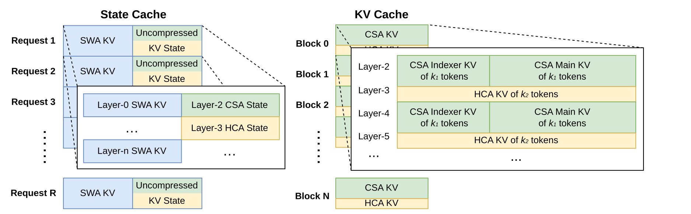

# DeepSeek-V4：把百万 token 变成一套系统能力

[DeepSeek-V4 技术报告](https://arxiv.org/abs/2606.19348)讨论的并不只是一个更大的 MoE。它试图回答一个更难的问题：当上下文从十万量级继续走向一百万 token，怎样让模型仍然能够训练、推理、保存状态、恢复 rollout，并把新增的测试时计算真正转化为推理与 Agent 能力？

DeepSeek-V4 给出的答案由四层共同构成：

- **模型层**：用 Compressed Sparse Attention（CSA）与 Heavily Compressed Attention（HCA）同时压缩序列维度，再以 Manifold-Constrained Hyper-Connections（mHC）扩展深度方向的信息通路；
- **优化层**：以 Muon 处理大多数矩阵参数，并用两阶段 Newton–Schulz、RMSNorm、Anticipatory Routing 与 SwiGLU Clamping 控制数值风险；
- **系统层**：把 MoE 通信、长上下文并行、异构 KV cache、磁盘前缀缓存、可抢占 rollout 和沙箱恢复接成闭环；
- **后训练层**：先分别培养领域 specialist，再以 full-vocabulary On-Policy Distillation（OPD）把十余个教师合并回一个学生。

所以，百万 token 不是配置文件中的一个上限。CSA/HCA 决定每层保留什么，KV 管理决定这些状态怎样复用，训练课程决定模型是否学会使用远距离信息，rollout 与沙箱决定长轨迹能否完成，评测协议才决定“1M”究竟测到了检索、推理还是工具使用。

本页重建整份报告的因果链。[DeepSeek 家族总览](../families/deepseek.md)负责它与通用、代码、数学、多模态及开放系统分支的边界；[压缩注意力专题](deepseek-compressed-attention.md)、[mHC 专题](manifold-hyper-connections.md)、[On-Policy Distillation 专题](on-policy-distillation.md)和 [TileLang 与 MegaMoE 专题](tilelang-mega-moe.md)继续展开可复用机制；[DeepSeek-V4 引用图谱](../deepseek-v4-reference-map.md)逐项梳理报告正文真正使用的 103 项来源。相关机制也分别进入[长上下文](../../architecture/long-context.md)、[注意力变体](../../architecture/attention-variants.md)、[Mixture of Experts](../../architecture/moe.md)、[预训练](../../training/pretraining.md)、[蒸馏](../../training/distillation.md)、[量化](../../inference/quantization.md)、[MoE 系统](../../systems/moe-systems.md)与 [Agent 评测](../../evaluation/agent-tool-evaluation.md)等主干页面。

## 一张地图：四条约束怎样闭合 {#causal-chain}

| 约束 | 局部设计 | 系统接点 | 如果只复制局部设计 |
| --- | --- | --- | --- |
| 1M token 的注意力 FLOPs | CSA 先按 $m=4$ 压缩再做 top-$k$；HCA 按 $m'=128$ 重压缩后做 dense attention | FP4 indexer、分块 sparse kernel、两阶段 context parallelism | 公式成立，kernel 与通信仍可能成为瓶颈 |
| 1M token 的状态体积 | compressed KV + SWA state，RoPE 维 BF16、其余 FP8 | 异构 cache layout、磁盘缓存、尾块重算 | 只把 `max_position_embeddings` 改大，会先耗尽显存或存储带宽 |
| 千亿至万亿级 MoE | 细粒度 expert、top-6、aux-loss-free routing | wave-based MegaMoE、DeepGEMM、batch-invariant kernels | all-to-all 长尾会吞掉稀疏计算收益 |
| 长轨迹后训练 | specialist RL、三档 effort、full-vocabulary OPD | token WAL、teacher offload、共享内存数据流、DSec 恢复 | 轨迹中断、教师 logits 与环境状态会压垮训练循环 |

这张表也解释了报告的核心取舍：DeepSeek-V4 没有押注单一的“线性注意力”，而是用不同强度的压缩、稀疏选择和局部窗口共同保留内容寻址能力；代价是模型、kernel 与 cache 的接口明显复杂化。作者在结论中也把这种复杂度列为后续需要重新提炼的问题，而不是把当前结构描述成唯一终局。

## 模型账本与发布边界 {#model-ledger}

报告称这一代为 **preview version**，包括两个纯文本 MoE：

| 字段 | DeepSeek-V4-Flash | DeepSeek-V4-Pro |
| --- | ---: | ---: |
| 总参数 | 284B | 1.6T |
| 每 token 激活参数 | 13B | 49B |
| Transformer layers | 43 | 61 |
| hidden size | 4096 | 7168 |
| 首两层 | pure SWA | HCA |
| 后续 attention | CSA / HCA 交错 | CSA / HCA 交错 |
| CSA compression / top-$k$ | $m=4$ / 512 | $m=4$ / 1024 |
| HCA compression | $m'=128$ | $m'=128$ |
| indexer heads / dimension | 64 / 128 | 64 / 128 |
| core query heads / head dimension | 64 / 512 | 128 / 512 |
| query latent dimension $d_c$ | 1024 | 1536 |
| output groups / group output dimension | 8 / 1024 | 16 / 1024 |
| SWA window | 128 | 128 |
| routed / shared experts | 256 / 1 | 384 / 1 |
| active routed experts | 6 | 6 |
| expert intermediate size | 2048 | 3072 |
| Hash-routed MoE layers | 前 3 层 | 前 3 层 |
| mHC width / Sinkhorn iterations | 4 / 20 | 4 / 20 |
| MTP depth | 1 | 1 |
| pre-training tokens | 32T | 33T |
| context limit | 1,048,576 | 1,048,576 |

[Pro config](https://huggingface.co/deepseek-ai/DeepSeek-V4-Pro/blob/main/config.json) 与 [Flash config](https://huggingface.co/deepseek-ai/DeepSeek-V4-Flash/blob/main/config.json) 还给出论文近似口径之外的机器契约：

- vocabulary 的精确值是 129,280，正文将其记作 128K；
- `max_position_embeddings=1048576`，YaRN factor 为 16，原始窗口为 65,536，普通与 compressed RoPE 的 $\theta$ 分别是 10,000 与 160,000；
- `num_key_value_heads=1`，部分 RoPE 维度为 64，RMSNorm $\epsilon=10^{-6}$；
- routed scaling factor 在 Flash / Pro 中分别为 1.5 / 2.5；
- layer pattern 明确为 Flash 的 `[0,0,4,128,\ldots,0]` 与 Pro 的 `[128,128,4,128,\ldots,0]`；这里的 0、4、128 分别对应无压缩、CSA 与 HCA 路径，末尾还包含预测模块的配置位置；
- post-trained checkpoint 将 expert 权重标为 FP4，其余主体采用动态 E4M3 FP8，block size 为 $128\times128$。

四个官方 checkpoint——Flash/Pro 的 Base 与 post-trained 版本——均在[官方模型集合](https://huggingface.co/collections/deepseek-ai/deepseek-v4)发布。Base 以 FP8 mixed precision 为主，post-trained 版本为 FP4 expert + FP8 mixed；模型卡与权重采用 MIT License。这里的“开放”应具体理解为报告、配置、推理实现与权重均可检查，而不是训练数据、训练集群和完整后训练流水线已经可复现。

报告中的成本数字也要保留比较基准：

- 在 1M token 处，Pro 的 single-token inference FLOPs 是 DeepSeek-V3.2 的 27%，KV cache 约为 10%；
- Flash 分别约为 V3.2 的 10% 与 7%；
- 图 1 用倒数表示同一件事：Pro 为 3.7 倍更低 FLOPs、9.5 倍更小 KV，Flash 为 9.8 倍与 13.7 倍；
- 相对常见的 BF16 GQA8、head dimension 128 基准，报告估计 V4 在 1M 处的 KV cache 约为 2%；
- 这些 FLOPs 以 equivalent FP8 FLOPs 计。按报告的硬件口径，当前 FP4$\times$FP8 与 FP8$\times$FP8 的峰值相同；未来硬件还能获得约三分之一效率改善的说法属于前瞻估计，不是当前实测吞吐。

<span id="architecture"></span>

## 架构：先压缩，再决定看哪里 {#csa-hca}

<div markdown="block">
<figure class="paper-figure paper-figure--portrait" id="deepseek-v4-figure-02" data-paper-source="deepseek-v4" data-paper-asset="deepseek-v4-figure-02" markdown="1">
[{ width="1938" height="1488" loading="lazy" decoding="async" }](../../assets/papers/deepseek-v4/figure-02-overall-architecture.png)
<figcaption><strong>Figure 2 把 V4 的三项变化放回同一个 block：CSA/HCA 改变注意力状态，DeepSeekMoE 保持稀疏容量，mHC 则在两个子层前后重写 residual stream 的读写。</strong>MTP 位于主干输出之后，因此它既是训练辅助目标，也是可服务化的 draft 路径；任何单独机制都不能代表整套架构。<span class="paper-figure__source">图源：<a href="https://huggingface.co/deepseek-ai/DeepSeek-V4-Pro/resolve/653b8ce97de7ed21df99e5f6bd49bacb3840df2b/DeepSeek_V4.pdf#page=6">DeepSeek-V4 Technical Report, Figure 2, p. 6</a>；Copyright (c) 2023 DeepSeek，<a href="https://huggingface.co/deepseek-ai/DeepSeek-V4-Pro/blob/653b8ce97de7ed21df99e5f6bd49bacb3840df2b/LICENSE">MIT License</a>。</span></figcaption>
</figure>
</div>

### 继承的 DeepSeekMoE 与 MTP

DeepSeek-V4 沿用 [DeepSeekMoE](https://arxiv.org/abs/2401.06066) 的 fine-grained routed experts、shared expert 与辅助损失自由的均衡策略，也保留 [DeepSeek-V3](https://arxiv.org/abs/2412.19437) 的一层 Multi-Token Prediction。真正变化发生在路由入口与最前面的 block：

1. affinity activation 从 $\operatorname{Sigmoid}$ 改成
   $\sqrt{\operatorname{Softplus}(x)}$；
2. aux-loss-free bias 之外再加一个很轻的 sequence-wise balance loss，防止单条序列内部出现极端失衡；
3. 不再限制一次路由所覆盖的目标节点数，而由新的并行策略吸收更自由的 expert placement；
4. 初始三层不再使用 dense FFN，而以 token ID 的预定义 hash 直接决定 expert。

Hash routing 的意义不是“早期层学会了更好的语义路由”，恰恰相反：它在浅层暂时绕过一个容易出现动态反馈的路由器。报告没有给出 Hash 层数、普通 learned routing 和稳定性之间的独立消融，因此只能把它视作整个稳定配方的一部分。

### mHC：把残差宽度变成受约束的动态混合 {#mhc}

普通 residual stream 只有一条路径。Hyper-Connections（HC）把它扩展成 $n_{\mathrm{hc}}$ 条：

$$
X_l=[x_{l,1};\ldots;x_{l,n_{\mathrm{hc}}}]^\top
\in\mathbb R^{n_{\mathrm{hc}}\times d},
$$

报告式 (1) 写成

$$
X_{l+1}=B_lX_l+C_l\mathcal F_l(A_lX_l).
\tag{1}
$$

$A_l$ 决定当前 layer 从哪些 residual stream 读取，$C_l$ 决定新输出写回哪里，$B_l$ 则负责旧状态之间的传播。额外宽度为网络提供了与 hidden size 不同的扩展轴，但未经约束的 $B_l$ 在深层相乘时可能放大信号。

[mHC](https://arxiv.org/abs/2512.24880) 把 $B_l$ 投影到 Birkhoff polytope，即非负的 doubly stochastic matrices：

$$
B_l\in\mathcal M
=\left\{
M\in\mathbb R^{n\times n}
\mid
M\mathbf 1=\mathbf 1,\quad
\mathbf 1^\top M=\mathbf 1^\top,\quad
M\ge 0
\right\}.
\tag{2}
$$

行列和都为 1 使 $\lVert B_l\rVert_2\le 1$，而 $\mathcal M$ 对矩阵乘法封闭；这使深层 residual transformation 保持 non-expansive。它并不意味着整个网络都是 1-Lipschitz，因为 $\mathcal F_l$、$A_l$ 与 $C_l$ 仍会改变尺度。

三个 raw mapping 由 normalized residual state 动态生成：

$$
\widehat X_l=\operatorname{RMSNorm}(\operatorname{vec}(X_l)),
$$

$$
\widetilde A_l
=\alpha_l^{\mathrm{pre}}\widehat X_lW_l^{\mathrm{pre}}
+S_l^{\mathrm{pre}},
\tag{3}
$$

$$
\widetilde B_l
=\alpha_l^{\mathrm{res}}
\operatorname{Mat}(\widehat X_lW_l^{\mathrm{res}})
+S_l^{\mathrm{res}},
\tag{4}
$$

$$
\widetilde C_l
=\alpha_l^{\mathrm{post}}
(\widehat X_lW_l^{\mathrm{post}})^\top
+S_l^{\mathrm{post}}.
\tag{5}
$$

小值初始化的 $\alpha$ 控制输入相关部分，$S$ 提供静态基线。输入与输出 mapping 分别受

$$
A_l=\sigma(\widetilde A_l),
\tag{6}
$$

$$
C_l=2\sigma(\widetilde C_l)
\tag{7}
$$

约束；残差 mapping 则先取 $M^{(0)}=\exp(\widetilde B_l)$，再交替做列、行归一化：

$$
M^{(t)}
=\mathcal T_r\!\left(\mathcal T_c(M^{(t-1)})\right),
\qquad
B_l=M^{(20)}.
\tag{8}
$$

V4 的 $n_{\mathrm{hc}}=4$。这会把 layer 间状态扩为四路，但不会把 attention 或 expert 的实际 hidden size 也乘四；系统代价主要来自 activation、pipeline communication 和额外的小矩阵。通过 fused kernel、选择性重算与修改后的 DualPipe 1F1B，报告把 mHC 的 wall-time overhead 控制在 overlapped pipeline stage 的 6.7%。更完整的信号传播与实现讨论见 [mHC 专题](manifold-hyper-connections.md)。

### CSA：压缩块，再稀疏选择 {#compressed-sparse-attention}

令输入 hidden state 为 $H\in\mathbb R^{n\times d}$。CSA 为每个 token 产生两套 candidate entry 与 compression logit：

$$
C^a=HW^{aKV},\qquad C^b=HW^{bKV},
\tag{9}
$$

$$
Z^a=HW^{aZ},\qquad Z^b=HW^{bZ}.
\tag{10}
$$

第 $i$ 个 compressed entry 同时吸收当前块的 $C^a$ 与上一块的 $C^b$。先对 $2m$ 个位置逐 channel 归一化：

$$
\begin{aligned}
[S^a_{mi:m(i+1)-1};S^b_{m(i-1):mi-1}]
=\operatorname{Softmax}_{\mathrm{row}}\big(
&[Z^a_{mi:m(i+1)-1}+B^a;\\
&Z^b_{m(i-1):mi-1}+B^b]
\big),
\end{aligned}
\tag{11}
$$

再求加权和：

$$
C_i^{\mathrm{Comp}}
=
\sum_{j=mi}^{m(i+1)-1}S_j^a\odot C_j^a
+
\sum_{j=m(i-1)}^{mi-1}S_j^b\odot C_j^b.
\tag{12}
$$

单个 entry 看到了 $2m$ 个输入，但相邻 entry 的窗口重叠、stride 仍是 $m$，因此序列长度只缩为 $n/m$，不是 $n/(2m)$。首块缺失的上一块以 $-\infty$ logit 和零 value 填充。

压缩之后，lightning indexer 才决定当前 query 应看哪些块。query 先通过共享低秩路径：

$$
c_t^Q=h_tW^{DQ},
\tag{13}
$$

$$
[q_{t,1}^I;\ldots;q_{t,n_h^I}^I]
=q_t^I=c_t^QW^{IUQ}.
\tag{14}
$$

每个 indexer head 还有由当前 hidden state 生成的权重：

$$
[w_{t,1}^I;\ldots;w_{t,n_h^I}^I]
=w_t^I=h_tW^w,
\tag{15}
$$

$$
I_{t,s}
=\sum_{h=1}^{n_h^I}
w_{t,h}^I
\operatorname{ReLU}
\left(q_{t,h}^I\cdot K_s^{I\mathrm{Comp}}\right).
\tag{16}
$$

只有严格早于当前 compression block 的候选可以进入 top-$k$：

$$
\mathcal C_t^{\mathrm{SprsComp}}
=
\left\{
C_s^{\mathrm{Comp}}
\mid
I_{t,s}\in\operatorname{TopK}(I_{t,:})
\right\}.
\tag{17}
$$

core attention 复用同一个 $c_t^Q$ 产生更多、更宽的 query：

$$
[q_{t,1};\ldots;q_{t,n_h}]
=q_t=c_t^QW^{UQ},
\tag{18}
$$

$$
o_{t,i}
=\operatorname{CoreAttn}
\left(
q_{t,i},
\mathcal C_t^{\mathrm{SprsComp}},
\mathcal C_t^{\mathrm{SprsComp}}
\right).
\tag{19}
$$

同一个 compressed vector 同时充当 key 与 value，所以这是 shared-KV MQA。由于 $cn_h$ 很大，所有 head 不直接一次投回 $d$：先分成 $g$ 组、各自降到 $d_g$，再把 $gd_g$ 投回 hidden size。它把 output projection 的代价纳入了 attention 设计本身，而不是把长上下文省下的 FLOPs 又花在输出矩阵上。

### HCA：更重的压缩，保留 dense 寻址 {#heavily-compressed-attention}

HCA 不再训练稀疏 selector，而以更大的 $m'=128$ 把每个不重叠块压成一个 entry：

$$
C=HW^{KV},
\tag{20}
$$

$$
Z=HW^Z,
\tag{21}
$$

$$
S_{m'i:m'(i+1)-1}
=
\operatorname{Softmax}_{\mathrm{row}}
\left(
Z_{m'i:m'(i+1)-1}+B
\right),
\tag{22}
$$

$$
C_i^{\mathrm{Comp}}
=
\sum_{j=m'i}^{m'(i+1)-1}S_j\odot C_j.
\tag{23}
$$

query 仍走低秩路径：

$$
c_t^Q=h_tW^{DQ},
\tag{24}
$$

$$
[q_{t,1};\ldots;q_{t,n_h}]
=q_t=c_t^QW^{UQ},
\tag{25}
$$

但随后对全部 $n/m'$ 个 compressed entries 做 dense MQA：

$$
o_{t,i}
=
\operatorname{CoreAttn}
\left(
q_{t,i},
C^{\mathrm{Comp}},
C^{\mathrm{Comp}}
\right).
\tag{26}
$$

CSA 的角色是“较细压缩后再内容选择”，HCA 的角色是“极重压缩后保留全局 dense access”。二者交错，使局部精度、远程选择和廉价的全局概览同时存在。它们共享以下补丁：

- query 与唯一 compressed KV head 在 core attention 前分别做 RMSNorm；
- query、KV entry 的最后 64 维应用 RoPE；因为 entry 同时作为 value，attention output 的最后 64 维再施加位置 $-i$ 的 RoPE，以把绝对位置贡献转回相对位置；
- 只允许访问已经完成的 compressed block，从而严格保持因果性；
- 额外加入 128-token uncompressed SWA，补回当前块内和最近邻的细粒度信息；
- 每个 head 有一个 learned sink logit $z_h'$：

$$
s_{h,i,j}
=
\frac{\exp(z_{h,i,j})}
{\sum_k\exp(z_{h,i,k})+\exp(z_h')}.
\tag{27}
$$

因此 attention probability 的总和可以小于 1，head 也可以选择近似“不读任何 entry”。CSA/HCA 的推导、复杂度与最小 reference 见[压缩注意力专题](deepseek-compressed-attention.md)。

### Muon：正交化的是更新，不是权重 {#muon}

V4 只把 embedding、prediction head、RMSNorm 权重，以及 mHC 的 static bias 和 gating factor 留给 AdamW；其余逻辑独立的矩阵由 Muon 更新。对 momentum matrix $M$，先以 Frobenius norm 归一化，再做

$$
M_k
=
aM_{k-1}
+b(M_{k-1}M_{k-1}^{\top})M_{k-1}
+c(M_{k-1}M_{k-1}^{\top})^2M_{k-1}.
\tag{28}
$$

前 8 步使用 $(a,b,c)=(3.4445,-4.7750,2.0315)$ 快速把 singular values 推近 1；后 2 步改为 $(2,-1.5,0.5)$，让 1 成为稳定 fixed point。Algorithm 1 的完整顺序是：

1. 计算当前梯度 $G_t$；
2. 更新 momentum $M_t=\mu M_{t-1}+G_t$；
3. 对 $\mu M_t+G_t$ 使用 hybrid Newton–Schulz，即 Nesterov look-ahead；
4. 乘 $\sqrt{\max(n,m)}\gamma$ 复用 AdamW 的学习率尺度；
5. 以 $W_t=W_{t-1}(1-\eta\lambda)-\eta O_t$ 做 decoupled weight decay。

下面的 reference 检查两阶段迭代确实把一个 tall matrix 推向列正交，而不是只复述多项式：

```python
import torch
def hybrid_newton_schulz(x):
    x = x / x.norm()
    for i in range(10):
        a, b, c = (3.4445, -4.7750, 2.0315) if i < 8 else (2., -1.5, .5)
        g = x @ x.T
        x = a * x + b * (g @ x) + c * (g @ g @ x)
    return x
torch.manual_seed(0)
x = hybrid_newton_schulz(torch.randn(8, 5, dtype=torch.float64))
torch.testing.assert_close(x.T @ x, torch.eye(5, dtype=x.dtype), atol=5e-3, rtol=5e-3)
```

V4 的 Muon momentum 为 0.95、weight decay 为 0.1，update RMS rescale 为 0.18。因为 CSA/HCA 能在 attention query 与 KV 上直接做 RMSNorm，训练没有沿用 Muon-scaled LLM 中的 QK-Clip。这个结论只说明当前配方没有使用 QK-Clip，不能推出所有 Muon + attention 组合都不需要 logit control。

## 基础设施：让公式在集群上仍然成立 {#general-infrastructure}

### MegaMoE：按 wave 融合通信、计算与访存 {#mega-moe}

一个 MoE layer 可以拆成 Dispatch、Linear-1、activation、Linear-2、Combine。Comet 只分别把 Dispatch 与 Linear-1、Linear-2 与 Combine 重叠；V4 把少量 experts 组成一个 wave，让当前 wave 计算、下一 wave 收 token、上一 wave 回传结果同时发生。

图 5 在 Flash 配置上的理论排程给出 Comet 1.42 倍、V4 1.92 倍；报告在 NVIDIA GPU 与 Huawei Ascend NPU 上相对强 non-fused baseline 实测一般 inference 提升 1.50–1.73 倍，在 RL rollout 等 latency-sensitive 小 batch 场景最高 1.96 倍。CUDA mega-kernel 已作为 [DeepGEMM PR #304](https://github.com/deepseek-ai/DeepGEMM/pull/304) 中的 MegaMoE 发布。

这里的硬件洞见是计算通信比，而不是“带宽越高越好”。Pro 每个 token-expert pair 大约做 $6hd$ FLOPs，只通信 $3h$ bytes（FP8 Dispatch + BF16 Combine），所以完全隐藏通信的条件是

$$
\frac CB\le\frac{V_{\mathrm{comp}}}{V_{\mathrm{comm}}}
=2d=6144\ \mathrm{FLOPs/Byte}.
$$

每 1 GB/s interconnect 理论上可隐藏约 6.1 TFLOP/s compute。报告据此提出三项硬件接口建议：为 compute、memory、network 同时满载保留功耗余量；降低跨 GPU signaling latency，让 push 不再输给当前采用的 pull；以及用不含指数/除法的便宜 element-wise activation 减少 post-GEMM stall。这些是基于其 workload 的 design proposal，不是跨模型的普遍硬件定律。

### TileLang：开发速度也进入性能模型

大量 CSA/HCA/mHC 细粒度算子若直接拼成 Torch ATen graph，会同时增加 kernel launch 与 Python host overhead。V4 用 [TileLang](https://github.com/tile-ai/tilelang) 编写 fused kernels，并在编译器侧加入三类能力：

- **Host Codegen** 把 dtype、rank、shape、stride 与 layout 检查从 Python 移进基于 TVM-FFI 的生成式 launcher，报告称单次校验从几十或几百微秒降到 1 微秒以内；
- **Z3-assisted integer analysis** 把 tensor index expression 翻成 QF_NIA，在数秒资源上限内支持 layout inference、hazard/bound analysis、vectorization 与 barrier insertion；
- **明确的数值语义** 默认关闭 fast-math，近似 `exp/log/sin` 必须显式选择；需要 IEEE-754 时可以指定 rounding mode，并以 layout annotation 固定 lowering 与 accumulation order。

这使“reference CUDA 与 DSL kernel bitwise 对齐”成为可要求的契约，而不是只检查误差阈值。专门的工程脉络见 [TileLang 与 MegaMoE](tilelang-mega-moe.md)。

### Batch invariance 与 determinism 不是一回事 {#batch-invariance}

**Batch invariance** 要求同一 token 无论位于怎样的 batch 都得到相同 bit pattern：

- decode attention 不采用会改变 accumulation partition 的常规 split-KV；完整 wave 由单个 SM 处理，尾部不足一 wave 时用多个 SM，但通过 distributed shared memory 维持与单 SM 相同的累加顺序；
- cuBLAS 由 [DeepGEMM](https://github.com/deepseek-ai/DeepGEMM) 替代；
- 小 batch 原则上避免 split-K，并以专门 kernel 补回吞吐。

**Determinism** 则要求同一训练运行能够重放，主要处理 backward 中 `atomicAdd` 的顺序：

- sparse-attention backward 为每个 SM 分配独立 accumulation buffer，之后全局确定性求和；
- MoE backward 先在 rank 内固定 token order，再隔离不同 rank 的接收 buffer；
- mHC 的 output dimension 只有 24，小 batch 必须 split-K 时先分别输出各 split，再由第二个 kernel 确定性归约。

前者控制 batch composition，后者控制并发执行顺序；两者共同服务于训练/rollout/inference 的 bitwise alignment，不能互相替代。

### 训练框架：四个不显眼但关键的接口

1. **Muon + ZeRO**：dense matrix 不能像 element-wise Adam state 那样任意切开。系统限制 ZeRO group 最大规模，用 knapsack 把完整矩阵分到 ranks；每 rank 不超过五个矩阵，padding 通常低于 10%。更多 data-parallel groups 选择冗余计算更新，以换取较小 bucket。
2. **MoE Muon**：按 down、up、gate projection 的顺序跨层 flatten，但不切断任何逻辑矩阵；相同 shape 自动 batch。gradient 以 stochastic rounding 压到 BF16 后同步，再用 all-to-all + rank-local FP32 sum 代替低精度 ring/tree reduction。
3. **Compressed context parallelism**：rank $i$ 先把末尾 $m$ 个 uncompressed entries 发给 $i+1$，后者生成固定 $\frac sm+1$ 个含 padding 的 compressed entries；随后 all-gather，再由 fused select-and-pad 组成总长 $\texttt{cp\_size}\cdot\frac sm$ 的合法序列。
4. **Tensor-level checkpointing**：TorchFX 从被标记 tensor 反向寻找最小 recomputation graph，backward 前插入；重算后复用原 storage pointer，并对 reshape 等共享 storage 自动去重。

<span id="heterogeneous-kv"></span>

### 异构 KV cache 与磁盘前缀 {#on-disk-kv}

V4 同时存在 compressed CSA/HCA entry、CSA indexer key、128-token SWA 与尚不足一个 compression block 的尾部 hidden state。统一套用等长 PagedAttention block 会遇到两类冲突：不同 layer 的 cache policy 不同，高性能 sparse kernel 又要求对齐。

<div markdown="block">
<figure class="paper-figure paper-figure--wide" id="deepseek-v4-figure-06" data-paper-source="deepseek-v4" data-paper-asset="deepseek-v4-figure-06" markdown="1">
[{ width="1875" height="583" loading="lazy" decoding="async" }](../../assets/papers/deepseek-v4/figure-06-hybrid-kv-cache-layout.png)
<figcaption><strong>Figure 6 把“混合注意力”落实成两套生命周期不同的物理状态。</strong>State cache 随请求位置滚动并等待压缩块闭合；classical KV cache 承载可分页、可复用的完整压缩 entry。两者若只共享一个同构 block schema，就会丢失 layer 类型、尾状态与 indexer 的边界。<span class="paper-figure__source">图源：<a href="https://huggingface.co/deepseek-ai/DeepSeek-V4-Pro/resolve/653b8ce97de7ed21df99e5f6bd49bacb3840df2b/DeepSeek_V4.pdf#page=22">DeepSeek-V4 Technical Report, Figure 6, p. 22</a>；Copyright (c) 2023 DeepSeek，<a href="https://huggingface.co/deepseek-ai/DeepSeek-V4-Pro/blob/653b8ce97de7ed21df99e5f6bd49bacb3840df2b/LICENSE">MIT License</a>。</span></figcaption>
</figure>
</div>

报告把缓存拆成：

- **state cache**：每个 request 一个固定大小区域，存 SWA 最近 $n_{\mathrm{win}}$ 项与等待压缩的 tail；
- **classical KV cache**：每个 block 覆盖 $\operatorname{lcm}(m,m')$ 个原始 token，分别产生
  $k_1=\operatorname{lcm}(m,m')/m$ 个 CSA entry 与
  $k_2=\operatorname{lcm}(m,m')/m'$ 个 HCA entry。

SWA 与 tail 被视作只依赖当前位置的 sequence state，进入预分配有限 pool。compressed block 则可按 $\operatorname{lcm}(m,m')$ 的任意倍数布局，并让 sparse kernel 接受各层不同的 entries-per-block。

共享前缀落盘时，CSA/HCA 保存所有完整 compressed entries；最后一个不完整块仍需重算。SWA 的体积约为 compressed CSA/HCA 的八倍，因此提供三档选择：

| 策略 | 存什么 | 命中时做什么 | 适合 |
| --- | --- | --- | --- |
| Full SWA | 全部 token 的 SWA KV | 只读前缀末 $n_{\mathrm{win}}$ 项 | 计算昂贵、写放大可接受 |
| Periodic | 每 $p$ token 保存一次末窗口 | 读最近 checkpoint，再重算尾部 | 以 $p$ 调存储/计算 |
| Zero SWA | 不保存 SWA | 借助 compressed KV，最多重算末 $n_{\mathrm{win}}L$ token | 存储最紧张 |

“Zero”不是从头重做整段 prefix；$n_{\mathrm{win}}L$ 上界来自每层只依赖上一层最近一个窗口。真实部署还应报告磁盘带宽、hit distribution、checkpoint interval 与尾块长度，否则无法从理论 cache ratio 推导线上延迟。

## 预训练：数据、课程与稳定性一起变化 {#pretraining}

### 数据构造

V4 在 V3 数据管线之上增加了五类重点：

- 对网页中的批量自动生成与模板化内容加强过滤，以降低 synthetic feedback 与 model collapse 风险；
- 数学、编程仍是核心，并在 mid-training 注入 agentic coding data；
- 扩展多语种与文化长尾知识；
- 提高论文、技术报告等长文档的权重；
- 按来源与长度重新 pack 文档，减少截断。

tokenizer 延续 V3 并加入少量上下文 special tokens，保留 token splitting 与 FIM。与 V3 不同的是 sample-level attention mask：同一 packed sequence 中不同原始 sample 的 token 不应互相泄漏。报告没有给出各数据域比例、数据日期、去重阈值、污染审计或 synthetic data 占比；“32T/33T”只能说明消费的 token 数，不能独立判断有效信息量。

### 两种规模的训练配方

| 项目 | Flash | Pro |
| --- | ---: | ---: |
| AdamW $\beta_1,\beta_2,\epsilon$ | 0.9, 0.95, $10^{-20}$ | 相同 |
| AdamW / Muon weight decay | 0.1 / 0.1 | 相同 |
| Muon momentum / RMS scale | 0.95 / 0.18 | 相同 |
| 最大 batch tokens | 75.5M | 94.4M |
| warmup | 前 2,000 steps linear | 报告称总体同 Flash |
| peak learning rate | $2.7\times10^{-4}$ | $2.0\times10^{-4}$ |
| final learning rate | $2.7\times10^{-5}$ | $2.0\times10^{-5}$ |
| schedule | 长平台，末段 cosine decay | 同类 schedule |
| sequence curriculum | 4K → 16K → 64K → 1M | 相同 |
| dense-attention stage | 前 1T token | 比 Flash 更长，未给 token 数 |
| sparse introduction | 64K 时先 warm up indexer，再长期 sparse | 同样两阶段，时长未给 |
| load-balance bias speed | 0.001 | 0.001 |
| sequence balance loss | 0.0001 | 0.0001 |
| MTP loss | 大部分 0.3，LR decay 后 0.1 | 相同 |

这不是从 4K checkpoint 直接“外插”到 1M。模型先形成短程语言能力，再逐级遇到更长 packing；CSA indexer 也不是第一步就承担稀疏检索，而是在 dense warmup 后单独热身。报告没有披露各长度阶段的 token allocation，因此无法判断 1M 样本在 32T/33T 中占多大比例。

### 两个经验性稳定器 {#training-stability}

**Anticipatory Routing** 把 feature 与 route 的时间点错开：step $t$ 仍以 $\theta_t$ 计算 backbone feature，但 route index 来自 $\theta_{t-\Delta t}$。系统在 $t-\Delta t$ 提前取数据并缓存 route，避免同一步加载两套模型参数。活跃时额外 wall time 被控制在约 20%；实际训练并不全程启用，而是 loss-spike detector 触发短 rollback 与 anticipatory mode，稳定一段时间后再恢复同步 routing，所以总体额外成本被描述为可忽略。

**SwiGLU Clamping** 把 linear branch 限在 $[-10,10]$，gate branch 只截上界 10。作者观察到 loss spike 与 MoE outlier、routing feedback 同时出现，并报告 clamping 消除了观察到的 outlier、整体稳定配方未带来可见性能损失；但报告明确承认原理仍未充分理解，也没有公开 $\Delta t$、detector threshold、启用时长或独立消融。更准确的结论是“本次训练中的有效工程稳定器”，不是已经得到普遍证明的优化定律。

## 后训练：先分化，再在学生轨迹上合并 {#posttraining}

### Specialist、effort 与 generative reward

每个数学、代码、Agent、instruction-following specialist 先做领域 SFT，再以与 DeepSeek-R1 / V3.2 接近的 GRPO 配方做 RL。对于有 test case 或 verifier 的任务使用规则信号；难验证任务不再依赖传统 scalar reward model，而是构建 rubric-guided data，让 Generative Reward Model（GRM）读完整轨迹并生成判断。报告更进一步让 actor 本身兼任 GRM，并以 RL 同时优化生成与评价能力。

Pro 与 Flash 都提供三档 effort：

| 模式 | 训练/接口含义 | response envelope |
| --- | --- | --- |
| Non-think | 低延迟、低风险日常任务 | 直接以 `</think>` 进入答案 |
| Think High | 常规复杂推理与规划 | `<think>…</think>` 后给 summary |
| Think Max | 最大预算、探索能力边界 | 额外 system instruction + 完整 thinking envelope |

不同 specialist RL 使用不同 context window 与 length penalty，但报告没有公开具体值。评测阶段使用的 8K / 128K / 384K 分别对应 Non-think / High / Max，不能反过来当成 RL 训练窗口的精确配置。表 3 中的 Max instruction 强调穷尽路径、边界与反例并显式记录完整 deliberation；它是发布接口的一部分，不等价于“所有应用都应暴露内部推理”。

<span id="post-training-interface"></span>

### 工具协议、interleaved thinking 与 Quick Instruction

V4 以 `|DSML|` special token 和 XML-like envelope 描述 tool call：一个 `tool_calls` block 可以含多个 `invoke`，每个 `parameter` 显式区分 string 与 JSON value。相比只拼 JSON，这种格式把转义规则与工具边界交给专用 token；报告的结论是它减少了 escaping failure 与调用错误，但没有给出公开 error-rate 表。

tool conversation 会跨工具结果和后续用户消息保留完整 reasoning history；普通对话仍在新用户消息到来时丢弃旧 thinking，避免无收益地增长上下文。把工具结果伪装成 user message 的框架可能无法触发这一路径，报告以 Terminus 为例并建议这类框架使用 non-think model。

Quick Instruction 则把原本需要额外小模型完成的前置任务变成主模型末尾的 special token：

| token | 任务 |
| --- | --- |
| `<|action|>` | 是否需要 web search |
| `<|title|>` | 首次回复后生成对话标题 |
| `<|query|>` | 生成检索 query |
| `<|authority|>` | 判断所需来源权威程度 |
| `<|domain|>` | 识别领域 |
| `<|extracted_url|>…<|read_url|>` | 逐 URL 判断是否抓取 |

这些 token 直接复用已有 KV，并可并行预测 query、authority 与 domain。报告称这避免了重复 prefill，也省去维护另一个 classifier 的工程成本；但没有公开分类准确率、校准、TTFT 明细或对主回答的负迁移。

<span id="full-vocabulary-opd"></span>

### Full-vocabulary OPD {#on-policy-distillation}

报告称 V3.2 的 mixed RL stage 被 OPD **完全替代**。设学生为 $\pi_\theta$，超过十个 specialist teachers 为 $\pi_{E_i}$：

$$
\mathcal L_{\mathrm{OPD}}(\theta)
=
\sum_{i=1}^{N}w_i
D_{\mathrm{KL}}
\left(
\pi_\theta
\middle\|
\pi_{E_i}
\right).
\tag{29}
$$

训练轨迹由当前学生采样，所以 state distribution 跟着学生演化；reverse KL 又让学生在自己的状态上靠近适用教师。它避免简单 weight merging 的参数冲突，也不同于把所有领域 prompt 混入一轮统一 RL。

常见近似只在已采到 token 上使用

$$
\operatorname{sg}\!\left[\log \pi_E(y_t)-\log\pi_\theta(y_t)\right]
$$

作为 advantage。这个 Monte Carlo estimator 便宜但方差大。V4 计算整个 vocabulary 的 teacher/student reverse KL，以更稠密的监督换稳定性。公式、几何混合解释和可运行实现见 [On-Policy Distillation](on-policy-distillation.md)。

### 为什么 full vocabulary 首先是存储调度问题

对于有效 token 数 $T$、词表 $|V|>100\text{k}$、教师数 $N>10$，同时保存全部 logits 的空间是 $O(NT|V|)$。V4 的调度顺序为：

1. teacher weights 放在集中式分布存储，需要时以 ZeRO-like shard 加载；
2. teacher forward 只把最后一层 hidden state 写入中央 buffer；
3. 训练样本按 teacher index 排序，使一个 mini-batch 中每个 teacher head 只加载一次、GPU 上同时最多驻留一个 head；
4. hidden state 经对应 prediction head 临时重建 full logits；
5. 专用 TileLang kernel 立即计算精确 KL，参数与 hidden transfer 在后台异步进行。

它没有消除 $T|V|$ 的瞬时计算，而是消除了 $NT|V|$ logits 的长期物化。教师名单、sample-to-teacher routing、$w_i$ 与各域 token 配比没有公开，因此外部只能复现目标和调度思想，不能复现最终 capability mixture。

### FP4 QAT：让 rollout 与部署看见同一种模型 {#fp4-qat}

QAT 在 post-training 阶段同时作用于 student、teacher 与 reference model 的两处：

- MoE expert weights，以降低权重驻留与 memory traffic；
- CSA indexer 的 QK path，query/key activation 的缓存、加载与乘法都使用 FP4。

index score 还从 FP32 压到 BF16；报告声称 top-$k$ selector 提速 2 倍，同时保持 99.7% KV-entry recall。expert 训练时保留 FP32 master weight，前向先量化到 MXFP4，再无损解码到 E4M3 FP8 复用原 FP8 framework。所谓“无损”有条件：一个 $128\times128$ FP8 block 内各 $1\times32$ FP4 sub-block 的 scale ratio 必须落在 FP8 多出的 exponent range 内；作者只报告当前权重经验上满足条件。

backward 对前向所用 FP8 weight 求梯度并直接传给 FP32 master，相当于量化处使用 STE，也避免转置权重再次量化。rollout 与 online inference 没有 backward，直接使用原生 FP4 weight；报告据此称采样与线上部署的模型行为一致。[推理量化](../../inference/quantization.md)进一步区分 format、scale 与 kernel 是否真正带来 wall-time 收益。

### 可抢占 rollout 与 1M 数据流 {#rollout-resilience}

长 rollout 在大集群中必然遇到抢占和硬件错误。V4 为每个 generation request 维护 token-granular Write-Ahead Log（WAL）：每生成一个 token 就持久化；正常抢占时再保存未完成 request 的 KV，恢复后续写；硬件致命故障导致 KV 丢失时，以 WAL token 重跑 prefill。

从头重新采样未完成 request 会产生 length bias：短回复更容易在中断前结束并被保留，长回复不断被重启。固定 seed + batch-invariant deterministic stack 可以恢复同一序列，但仍需重跑 decode；在日志持久化和提交边界正确的前提下，WAL 才能同时保住采样语义与已完成计算。

百万 token rollout 数据被拆成 lightweight metadata 与 heavy per-token fields。metadata 可以整体加载以完成 global shuffle 和 packing layout；token fields 通过 shared-memory loader 按 mini-batch 读入，用完立即释放，并根据 workload 动态选择 device 上并存的 mini-batches，在 I/O overlap 与显存之间调节。

### DSec：让环境状态也能恢复 {#dsec}

DeepSeek Elastic Compute（DSec）为 Agent 环境提供统一 Python SDK，底层由三个 Rust 组件——API gateway `Apiserver`、host agent `Edge`、cluster monitor `Watcher`——通过自定义 RPC 和 [3FS](https://github.com/deepseek-ai/3FS) 连接。一个 cluster 被报告可管理数十万并发 sandbox，并暴露四种 substrate：

| substrate | 关键机制 | 适用边界 |
| --- | --- | --- |
| Function Call | pre-warmed stateless container pool | 极短、无持久状态调用 |
| Container | Docker-compatible，3FS-backed EROFS layer | 常规工具和软件任务 |
| microVM | Firecracker | 高密度且需要 VM isolation |
| fullVM | QEMU | 任意 guest OS |

container 的 readonly EROFS layer 按需从 3FS 拉 data block；microVM 用 overlaybd，共享远端 base、把写入放在本地 copy-on-write layer，并可链式 snapshot。系统还通过去重 page cache、memory reclaim 和降低 container-runtime spinlock contention 提高密度。

每个 sandbox 有全局有序 trajectory log，记录 command 与 result。恢复时，已经执行过的命令直接 fast-forward 返回缓存结果，既减少重算，也避免重复执行非幂等操作；同一日志还提供 state-change provenance 与 deterministic replay。它把“模型轨迹”和“环境轨迹”都纳入恢复协议，这是长程 Agent RL 能否正确续跑的关键。

<span id="evaluation"></span>

## 评测：先固定协议，再读排行榜 {#evaluation-protocol}

报告把评测分成 Base、post-trained 标准 benchmark、formal reasoning、1M context、Agent，以及中文写作、搜索、白领工作和内部研发任务。数字很多，但证据强度并不相同：

- 公开 benchmark 至少可以复查题集和 metric，但 closed-model API、harness 与采样时点仍可能不同；
- Codeforces 使用内部构造的 test suite 与 rating simulation；
- 中文写作、搜索、白领和研发编码使用内部数据或人工评审，外部不能检查样本选择与 judge calibration；
- Figure 1、Tables 1/6/7 的结果均为作者报告，不是独立第三方复验。

### Base：参数效率改善并非每一项都单调

Table 1 使用统一内部 framework 比较三个 Base checkpoint，分差不超过 0.3 视为同档。全部 24 个 benchmark 如下：

| 类别 | Benchmark（metric, shots） | V3.2-Base | V4-Flash-Base | V4-Pro-Base |
| --- | --- | ---: | ---: | ---: |
| knowledge | AGIEval（EM, 0） | 80.1 | 82.6 | 83.1 |
| knowledge | MMLU（EM, 5） | 87.8 | 88.7 | 90.1 |
| knowledge | MMLU-Redux（EM, 5） | 87.5 | 89.4 | 90.8 |
| knowledge | MMLU-Pro（EM, 5） | 65.5 | 68.3 | 73.5 |
| knowledge | MMMLU（EM, 5） | 87.9 | 88.8 | 90.3 |
| knowledge | C-Eval（EM, 5） | 90.4 | 92.1 | 93.1 |
| knowledge | CMMLU（EM, 5） | 88.9 | 90.4 | 90.8 |
| knowledge | MultiLoKo（EM, 5） | 38.7 | 42.2 | 51.1 |
| knowledge | Simple-QA Verified（EM, 25） | 28.3 | 30.1 | 55.2 |
| knowledge | SuperGPQA（EM, 5） | 45.0 | 46.5 | 53.9 |
| knowledge | FACTS Parametric（EM, 25） | 27.1 | 33.9 | 62.6 |
| knowledge | TriviaQA（EM, 5） | 83.3 | 82.8 | 85.6 |
| language/reasoning | BBH（EM, 3） | 87.6 | 86.9 | 87.5 |
| language/reasoning | DROP（F1, 1） | 88.2 | 88.6 | 88.7 |
| language/reasoning | HellaSwag（EM, 0） | 86.4 | 85.7 | 88.0 |
| language/reasoning | WinoGrande（EM, 0） | 78.9 | 79.5 | 81.5 |
| language/reasoning | CLUEWSC（EM, 5） | 83.5 | 82.2 | 85.2 |
| code/math | BigCodeBench（Pass@1, 3） | 63.9 | 56.8 | 59.2 |
| code/math | HumanEval（Pass@1, 0） | 62.8 | 69.5 | 76.8 |
| code/math | GSM8K（EM, 8） | 91.1 | 90.8 | 92.6 |
| code/math | MATH（EM, 4） | 60.5 | 57.4 | 64.5 |
| code/math | MGSM（EM, 8） | 81.3 | 85.7 | 84.4 |
| code/math | CMath（EM, 3） | 92.6 | 93.6 | 90.9 |
| long context | LongBench-V2（EM, 1） | 40.2 | 44.7 | 51.5 |

Flash 的 13B active parameters 明显少于 V3.2 的 37B，却在多数知识和长上下文任务上更强；但 BigCodeBench、MATH、BBH、HellaSwag、CLUEWSC 等并没有全面上升。Pro 也在 BigCodeBench 与 CMath 上低于 V3.2。正确结论是“整体 Pareto frontier 前移”，而不是“每个能力维度随架构升级单调增加”。

### Post-trained benchmark 的统一设置

知识与推理使用 MMLU-Pro、GPQA Diamond、HLE、SimpleQA-Verified、Chinese-SimpleQA、LiveCodeBench-v6、内部 Codeforces、HMMT 2026 Feb、Apex、Apex Shortlist、IMOAnswerBench 与 PutnamBench。采样温度为 1.0；Non-think、High、Max 的 context cap 分别是 8K、128K、384K。

普通数学题使用要求逐步推理并把答案放进 `\boxed{}` 的模板；Pro-Max 使用另一个强调先求解、再给严格证明的模板。prompt 差异本身就是 intervention，所以 Max 与其他模型的比较同时包含模型、预算与 elicitation 三个因素。

Codeforces protocol 比一个简单 Pass@1 更复杂：

1. 收集 2025 年 5–11 月 14 场 Division 1，共 114 题；
2. 每题生成 32 个 candidate solutions；
3. 每次无放回抽 10 个并随机排列为提交序列；
4. 由领域专家构造的 tests 判题；
5. 解出一题时，取“相同失败次数下人类选手得分”的中位数；
6. contest score 转成 rank，再按标准 Codeforces 系统估 rating；
7. 对所有随机抽取与顺序求期望，最后对 14 场取平均。

这使 3206 更接近“给模型多次提交机会后的预期竞赛 rating”，不是一次生成的 Elo。

Table 6 公开列出的全部 22 个比较项如下。破折号表示报告未给结果；K2.6 与 GLM-5.1 的部分空缺源于 API 持续繁忙。

<details markdown="1">
<summary>展开：DeepSeek-V4-Pro-Max 与 frontier models 的完整表</summary>

| Benchmark | Opus 4.6 Max | GPT-5.4 xHigh | Gemini 3.1 Pro High | K2.6 Thinking | GLM-5.1 Thinking | V4-Pro Max |
| --- | ---: | ---: | ---: | ---: | ---: | ---: |
| MMLU-Pro | 89.1 | 87.5 | 91.0 | 87.1 | 86.0 | 87.5 |
| SimpleQA-Verified | 46.2 | 45.3 | 75.6 | 36.9 | 38.1 | 57.9 |
| Chinese-SimpleQA | 76.4 | 76.8 | 85.9 | 75.9 | 75.0 | 84.4 |
| GPQA Diamond | 91.3 | 93.0 | 94.3 | 90.5 | 86.2 | 90.1 |
| HLE | 40.0 | 39.8 | 44.4 | 36.4 | 34.7 | 37.7 |
| LiveCodeBench | 88.8 | — | 91.7 | 89.6 | — | 93.5 |
| Codeforces rating | — | 3168 | 3052 | — | — | 3206 |
| HMMT 2026 Feb | 96.2 | 97.7 | 94.7 | 92.7 | 89.4 | 95.2 |
| IMOAnswerBench | 75.3 | 91.4 | 81.0 | 86.0 | 83.8 | 89.8 |
| Apex | 34.5 | 54.1 | 60.9 | 24.0 | 11.5 | 38.3 |
| Apex Shortlist | 85.9 | 78.1 | 89.1 | 75.5 | 72.4 | 90.2 |
| MRCR 1M | 92.9 | — | 76.3 | — | — | 83.5 |
| CorpusQA 1M | 71.7 | — | 53.8 | — | — | 62.0 |
| Terminal-Bench 2.0 | 65.4 | 75.1 | 68.5 | 66.7 | 63.5 | 67.9 |
| SWE Verified | 80.8 | — | 80.6 | 80.2 | — | 80.6 |
| SWE Pro | 57.3 | 57.7 | 54.2 | 58.6 | 58.4 | 55.4 |
| SWE Multilingual | 77.5 | — | — | 76.7 | 73.3 | 76.2 |
| BrowseComp | 83.7 | 82.7 | 85.9 | 83.2 | 79.3 | 83.4 |
| HLE with tools | 53.1 | 52.0 | 51.6 | 54.0 | 50.4 | 48.2 |
| GDPval-AA Elo | 1619 | 1674 | 1314 | 1482 | 1535 | 1554 |
| MCPAtlas Public | 73.8 | 67.2 | 69.2 | 66.6 | 71.8 | 73.6 |
| Toolathlon | 47.2 | 54.6 | 48.8 | 50.0 | 40.7 | 51.8 |

</details>

Pro-Max 在 LiveCodeBench、Codeforces、Apex Shortlist 上居首，在 MCPAtlas 接近 Opus；知识基准总体仍落后 Gemini 3.1 Pro，Apex、Terminal-Bench、SWE Pro、BrowseComp、HLE with tools 与 GDPval-AA 也没有领先 closed frontier。报告把其 reasoning 进度概括为落后最前沿约 3–6 个月，这是一项作者判断，不是由上述表格自动推出的统计量。

三档 effort 的全部结果更能解释 test-time scaling：

<details markdown="1">
<summary>展开：Flash / Pro 的 Non-think、High、Max 完整表</summary>

| Benchmark | Flash Non | Flash High | Flash Max | Pro Non | Pro High | Pro Max |
| --- | ---: | ---: | ---: | ---: | ---: | ---: |
| MMLU-Pro | 83.0 | 86.4 | 86.2 | 82.9 | 87.1 | 87.5 |
| SimpleQA-Verified | 23.1 | 28.9 | 34.1 | 45.0 | 46.2 | 57.9 |
| Chinese-SimpleQA | 71.5 | 73.2 | 78.9 | 75.8 | 77.7 | 84.4 |
| GPQA Diamond | 71.2 | 87.4 | 88.1 | 72.9 | 89.1 | 90.1 |
| HLE | 8.1 | 29.4 | 34.8 | 7.7 | 34.5 | 37.7 |
| LiveCodeBench | 55.2 | 88.4 | 91.6 | 56.8 | 89.8 | 93.5 |
| Codeforces rating | — | 2816 | 3052 | — | 2919 | 3206 |
| HMMT 2026 Feb | 40.8 | 91.9 | 94.8 | 31.7 | 94.0 | 95.2 |
| IMOAnswerBench | 41.9 | 85.1 | 88.4 | 35.3 | 88.0 | 89.8 |
| Apex | 1.0 | 19.1 | 33.0 | 0.4 | 27.4 | 38.3 |
| Apex Shortlist | 9.3 | 72.1 | 85.7 | 9.2 | 85.5 | 90.2 |
| MRCR 1M | 37.5 | 76.9 | 78.7 | 44.7 | 83.3 | 83.5 |
| CorpusQA 1M | 15.5 | 59.3 | 60.5 | 35.6 | 56.5 | 62.0 |
| Terminal-Bench 2.0 | 49.1 | 56.6 | 56.9 | 59.1 | 63.3 | 67.9 |
| SWE Verified | 73.7 | 78.6 | 79.0 | 73.6 | 79.4 | 80.6 |
| SWE Pro | 49.1 | 52.3 | 52.6 | 52.1 | 54.4 | 55.4 |
| SWE Multilingual | 69.7 | 70.2 | 73.3 | 69.8 | 74.1 | 76.2 |
| BrowseComp | — | 53.5 | 73.2 | — | 80.4 | 83.4 |
| HLE with tools | — | 40.3 | 45.1 | — | 44.7 | 48.2 |
| MCPAtlas Public | 64.0 | 67.4 | 69.0 | 69.4 | 74.2 | 73.6 |
| GDPval-AA Elo | — | — | 1395 | — | — | 1554 |
| Toolathlon | 40.7 | 43.5 | 47.8 | 46.3 | 49.0 | 51.8 |

</details>

Max 的收益集中在 HLE、竞赛代码、Apex、BrowseComp 等真正吃预算的任务；MMLU-Pro 的 Flash-Max 反而略低于 High，Pro 的 MCPAtlas-Max 也略低于 High。effort 是一个可控资源轴，不是免费而严格单调的质量按钮。[测试时计算](../../reasoning/test-time-compute.md)进一步讨论 score、token、latency 与价格应怎样共同报告。

### Formal reasoning：两个 regime 不能混成一个分数

低工具预算的 practical regime 使用 Lean 4.28.0-rc1、Lean compiler 与 [LeanExplore](https://arxiv.org/abs/2506.11085)，最多 500 次 tool calls，只有 strict Comparator 同时接受才计正确。Putnam-200 是 PutnamBench 的固定随机子集，所有模型测试同一问题集，以 Pass@8 计：

| 系统 | Putnam-200 Pass@8 |
| --- | ---: |
| Seed-1.5-Prover | 26.50 |
| Gemini-3-Pro | 26.50 |
| Seed-2.0-Pro | 35.50 |
| DeepSeek-V4-Flash-Max | 81.00 |

frontier regime 先生成自然语言候选、用 self-verification 筛选，再把保留解答作为 formal agent 的证明提示。它使用显著更多计算，Putnam-2025 结果是 Aristotle 100/120、Seed-1.5-Prover 110/120、Axiom 120/120、DeepSeek-V4 120/120。V4 在这里与 Axiom 同为 proof-perfect，并非独占 120/120；practical 与 frontier 也不能因同处 Figure 8 就直接横比。

### 1M context：aggregate 与 8-needle 曲线不是同一口径

长上下文选用 OpenAI MRCR 与更贴近文档问答的 CorpusQA，并重新评测 Opus 4.6、Gemini 3.1 Pro 以统一配置。GPT-5.4 因大量 1M API 请求没有响应而未测。

Table 6 的 MRCR 1M aggregate 为 Opus 92.9、Gemini 76.3、Pro 83.5；CorpusQA 为 71.7、53.8、62.0。Table 7 给出 Flash-Max 的 aggregate MRCR 78.7、CorpusQA 60.5。

Figure 9 却只画 **MRCR 8-needle** 子设置：

| input tokens | Pro-Max MMR | Flash-Max MMR |
| ---: | ---: | ---: |
| 8K | 0.90 | 0.91 |
| 16K | 0.85 | 0.84 |
| 32K | 0.94 | 0.87 |
| 64K | 0.90 | 0.85 |
| 128K | 0.92 | 0.87 |
| 256K | 0.82 | 0.76 |
| 512K | 0.66 | 0.60 |
| 1,024K | 0.59 | 0.49 |

因此“Pro 的 MRCR 1M 是 83.5”与“8-needle 在 1M 是 0.59”并不冲突，前者是表格的 aggregate，后者是特定 needle 数的曲线点。曲线也显示 128K 以内总体稳定，256K 后明显下降；“支持 1M”不等于 1M 与 128K 等质。

### Agent：harness 本身属于实验条件

SWE Verified、Terminal-Bench、SWE Pro、SWE Multilingual 使用内部 framework，只提供 Bash 与 file-edit，最多 500 steps、512K context。报告承认 GLM-5.1 指出的 Terminal-Bench 2.0 环境问题，但主表仍为 original dataset 的 67.9；另行报告 Verified subset 约 72.0，二者不能替换。

BrowseComp 与 HLE with tools 使用内部 websearch + Python harness，同样是 500 steps / 512K；BrowseComp 沿用 V3.2 的 discard-all context management。MCPAtlas 与 Toolathlon 覆盖更广的真实工具/MCP service，Pro-Max 分别为 73.6 与 51.8；这支持“能力不只适配内部 bash harness”，但仍不是对所有工具 schema 的分布外保证。

### 中文写作：总体胜率之外还有明显例外

functional writing 对比 Gemini 3.1 Pro，共 3,170 个样本。Table 12 的类别汇总为：

| 类别 | $n$ | V4 win | Gemini win | tie |
| --- | ---: | ---: | ---: | ---: |
| business | 1,349 | 65.16% | 32.32% | 2.52% |
| media | 666 | 57.96% | 38.44% | 3.60% |
| everyday | 390 | 69.49% | 25.90% | 4.62% |
| oral | 319 | 58.62% | 37.62% | 3.76% |
| official document | 230 | 54.78% | 42.17% | 3.04% |
| academic | 216 | 63.43% | 32.87% | 3.70% |
| overall | 3,170 | 62.65% | 34.10% | 3.25% |

<details markdown="1">
<summary>展开：functional writing 的全部 36 个子类</summary>

表中单元格为 `V4 wins / Gemini wins / ties`。

| 类别 | 子类 | $n$ | count |
| --- | --- | ---: | ---: |
| business | report | 527 | 350 / 162 / 15 |
| business | proposal | 291 | 181 / 103 / 7 |
| business | education | 159 | 100 / 56 / 3 |
| business | email & letter | 146 | 107 / 37 / 2 |
| business | notice | 72 | 43 / 24 / 5 |
| business | professional | 63 | 34 / 27 / 2 |
| business | recruitment | 42 | 27 / 15 / 0 |
| business | technical | 29 | 22 / 7 / 0 |
| business | review | 20 | 15 / 5 / 0 |
| media | social media | 267 | 156 / 101 / 10 |
| media | ad copy | 214 | 109 / 98 / 7 |
| media | long-form content | 99 | 71 / 25 / 3 |
| media | news report | 51 | 27 / 22 / 2 |
| media | advertorial | 17 | 12 / 4 / 1 |
| media | headline | 11 | 7 / 4 / 0 |
| media | narration script | 4 | 2 / 1 / 1 |
| media | comment | 3 | 2 / 1 / 0 |
| everyday | congratulatory | 101 | 54 / 41 / 6 |
| everyday | communication | 100 | 71 / 26 / 3 |
| everyday | reflection | 90 | 68 / 17 / 5 |
| everyday | review | 55 | 44 / 9 / 2 |
| everyday | comment | 44 | 34 / 8 / 2 |
| oral | speech | 226 | 135 / 85 / 6 |
| oral | narration script | 51 | 25 / 23 / 3 |
| oral | sales script | 31 | 22 / 6 / 3 |
| oral | dialogue | 10 | 4 / 6 / 0 |
| oral | congratulatory | 1 | 1 / 0 / 0 |
| official | administrative document | 117 | 60 / 53 / 4 |
| official | personal document | 73 | 45 / 27 / 1 |
| official | government document | 34 | 19 / 14 / 1 |
| official | speech | 3 | 1 / 2 / 0 |
| official | essay writing | 3 | 1 / 1 / 1 |
| academic | research paper | 104 | 67 / 32 / 5 |
| academic | coursework | 90 | 53 / 35 / 2 |
| academic | academic support | 15 | 11 / 3 / 1 |
| academic | science outreach | 7 | 6 / 1 / 0 |

</details>

优势并不覆盖每个 cell：oral dialogue 是 40% 对 60%，若干 $n\le 10$ 子类的百分比也没有统计稳定性。报告把总体差异归因于 Gemini 有时让自身风格偏好覆盖中文显式要求；这是 evaluator 对 failure mode 的归纳，没有公开 annotation guide 或显著性检验。

creative writing 共 2,837 个样本，分别评 instruction following 与 writing quality：

<details markdown="1">
<summary>展开：creative writing 的全部子类</summary>

表中两列分别是 `instruction: V4 / Gemini / tie` 与 `quality: V4 / Gemini / tie` 的 raw counts。

| 子类 | $n$ | instruction count | quality count |
| --- | ---: | ---: | ---: |
| fiction | 836 | 504 / 323 / 5 | 672 / 157 / 3 |
| general fiction | 662 | 368 / 290 / 3 | 467 / 194 / 0 |
| fan fiction | 410 | 253 / 150 / 3 | 338 / 67 / 1 |
| general fan fiction | 202 | 111 / 90 / 1 | 161 / 40 / 1 |
| narrative | 171 | 115 / 54 / 2 | 141 / 30 / 0 |
| general prose | 124 | 83 / 40 / 1 | 88 / 36 / 0 |
| prose | 112 | 74 / 38 / 0 | 92 / 20 / 0 |
| writing style | 112 | 81 / 31 / 0 | 86 / 26 / 0 |
| classical poetry | 48 | 24 / 24 / 0 | 39 / 9 / 0 |
| modern poetry | 43 | 23 / 20 / 0 | 32 / 11 / 0 |
| lyrics | 30 | 8 / 22 / 0 | 16 / 14 / 0 |
| literary appreciation | 27 | 20 / 7 / 0 | 18 / 9 / 0 |
| general argumentative | 24 | 15 / 9 / 0 | 17 / 7 / 0 |
| general narrative | 23 | 11 / 12 / 0 | 15 / 8 / 0 |
| general classical | 9 | 5 / 4 / 0 | 5 / 4 / 0 |
| creative writing | 6 | 2 / 4 / 0 | 4 / 2 / 0 |
| argumentative | 5 | 5 / 0 / 0 | 5 / 0 / 0 |
| general modern poetry | 2 | 1 / 1 / 0 | 2 / 0 / 0 |
| overall | 2,837 | 1,703 / 1,119 / 15 | 2,198 / 634 / 5 |

</details>

overall instruction-following win rate 是 60.03%，writing-quality win rate 是 77.48%；歌词 instruction following 却只有 26.67%，classical poetry 是 50%。表中少数子类的 `$n$` 与有效 pairwise count 不完全相等，报告没有解释 missing judgments，应保留原始分母而不自行补值。

在更难的 complex-instruction / multi-turn 子集上，对手改为 Claude Opus 4.5：

| 子集 | $n$ | V4 / Opus / tie | win rates |
| --- | ---: | ---: | --- |
| complex instruction | 49 | 23 / 26 / 0 | 46.9% / 53.1% / 0 |
| multi-turn writing | 147 | 67 / 76 / 4 | 45.6% / 51.7% / 2.7% |
| overall | 196 | 90 / 102 / 4 | 45.9% / 52.0% / 2.0% |

这说明大规模总体胜率不能替代高约束 slice；对手变化也意味着 62.65% 与 45.9% 不是同一基线上的退化幅度。

### Search：Agentic 的质量增益与真实成本

V4-Pro 对 V3.2 的 retrieval-augmented search 共 956 题：

| 类别 | 子类 | $n$ | V4 / V3.2 / tie | rates |
| --- | --- | ---: | ---: | --- |
| objective | single-value | 95 | 36 / 10 / 49 | 37.9 / 10.5 / 51.6% |
| objective | entity | 99 | 24 / 7 / 68 | 24.2 / 7.1 / 68.7% |
| objective | enumerative | 95 | 19 / 8 / 68 | 20.0 / 8.4 / 71.6% |
| objective subtotal | — | 289 | 79 / 25 / 185 | 27.3 / 8.7 / 64.0% |
| subjective | causal analysis | 100 | 28 / 5 / 67 | 28.0 / 5.0 / 67.0% |
| subjective | comparison | 96 | 28 / 20 / 48 | 29.2 / 20.8 / 50.0% |
| subjective | advice | 92 | 23 / 8 / 61 | 25.0 / 8.7 / 66.3% |
| subjective | recommendation | 95 | 26 / 19 / 50 | 27.4 / 20.0 / 52.6% |
| subjective | planning | 92 | 32 / 11 / 49 | 34.8 / 12.0 / 53.3% |
| subjective | opinion | 96 | 30 / 8 / 58 | 31.2 / 8.3 / 60.4% |
| subjective | trend | 96 | 23 / 3 / 70 | 24.0 / 3.1 / 72.9% |
| subjective subtotal | — | 667 | 190 / 74 / 403 | 28.5 / 11.1 / 60.4% |
| overall | — | 956 | 269 / 99 / 588 | 28.1 / 10.4 / 61.5% |

thinking-mode Agentic Search 再与同一 V4 的 RAG 比较：

| 难度 / 类型 | $n$ | Agent / RAG / tie | rates |
| --- | ---: | ---: | --- |
| easy objective | 196 | 110 / 43 / 43 | 56.1 / 21.9 / 21.9% |
| easy subjective | 321 | 198 / 56 / 67 | 61.7 / 17.4 / 20.9% |
| hard objective | 168 | 102 / 33 / 33 | 60.7 / 19.6 / 19.6% |
| hard subjective | 184 | 126 / 27 / 31 | 68.5 / 14.7 / 16.8% |
| overall | 869 | 536 / 159 / 174 | 61.7 / 18.3 / 20.0% |

平均成本为：

| 模式 | tool calls | prefill tokens | output tokens |
| --- | ---: | ---: | ---: |
| Agentic Search | 16.2 | 13,649 | 1,526 |
| RAG | — | 10,453 | 1,308 |

报告称多数 tool calls 并行，因此“16.2 calls”不等于 16.2 倍串行延迟；但 Agentic 仍多出约 30.6% prefill 与 16.7% output token。只说“成本略高”会掩盖 token、并发与 wall time 的不同维度。

### 白领与研发编码：最接近产品，也最依赖内部证据

白领评测包含 30 个中文专业任务、13 个行业，以内部 Bash + web-search harness 完成 analysis、generation、editing。盲评维度为 Task Completion、Instruction Following、Content Quality、Formatting Aesthetics。

Figure 11 的 V4-Pro-Max / Opus-4.6-Max win-tie-loss 为 analysis 55/8/37、generation 52/10/38、editing 47/18/35、overall 53/10/37，overall non-loss 为 63%。Figure 12 的维度分数为：

| 维度 | V4-Pro-Max | Opus-4.6-Max |
| --- | ---: | ---: |
| Task Completion | 98.32 | 96.68 |
| Instruction Following | 87.76 | 88.88 |
| Content Quality | 83.32 | 78.00 |
| Formatting Aesthetics | 76.68 | 72.68 |
| Overall | 86.52 | 84.06 |

作者把 V4 的优势归纳为主动补足隐含需求、自验证、长文连贯和中文正式层级；弱点是偶尔漏掉格式约束、不善于把长输入压得足够短，以及 slide visual design 仍弱。Figures 13–15 分别给出奶茶品牌与北京地铁联营方案、NASDAQ 定投比较、2020–2025 Nobel 科学奖 PDF 的局部页面，属于质性案例而非新增统计样本。

内部 R&D coding 从 50 多位工程师提交的约 200 个 PyTorch、CUDA、Rust、C++ feature/bug/refactor/diagnostic 任务中，经过质量筛选保留 30 个：

| Haiku 4.5 | Sonnet 4.5 | V4-Pro-Max | Opus 4.5 | Opus 4.5 Thinking | Opus 4.6 Thinking |
| ---: | ---: | ---: | ---: | ---: | ---: |
| 13% | 47% | 67% | 70% | 73% | 80% |

另有 85 位日常使用 V4-Pro coding 的 DeepSeek 开发/研究人员接受内部调查：52% 认为可作默认主模型，39% 倾向同意，少于 9% 否定；常见问题是 trivial mistakes、误解模糊 prompt 与偶发 over-thinking。这个调查衡量内部使用接受度，不是随机用户总体的无偏估计。

<span id="report-completeness"></span>

## 报告完整性索引 {#report-index}

技术报告共 58 页：正文 Sections 1–6 位于 pp. 4–44，References 为 pp. 45–53，Appendices A–B 为 pp. 54–58。报告的 15 幅图、14 张正式表、29 个编号公式、Algorithm 1 与附录 A–B 共同组成完整证据面；下面的索引用于区分“正文已经解释”与“只在图表或附录出现”的信息。

### Figures 1–15

| Figure | 页 | 内容 | 阅读时必须保留的口径 |
| ---: | ---: | --- | --- |
| 1 | 1 | Pro-Max benchmark 与 V3.2/Pro/Flash 的 FLOPs、KV 曲线 | 左侧是选择性 benchmark；右侧是估算的 equivalent-FP8 single-token cost |
| 2 | 6 | V4 总架构：mHC、CSA/HCA、DeepSeekMoE、MTP | 展示接口，不给 CSA:HCA 独立消融 |
| 3 | 9 | CSA：overlapped compression、indexer、top-$k$、MQA、SWA | $2m$ receptive field 仍只有 $m$ stride |
| 4 | 11 | HCA：$m'\gg m$ compression、dense MQA、SWA | 重压缩后 dense，不是 sparse selector |
| 5 | 15 | naive、Comet、wave-based EP pipeline | 1.42/1.92 是 Flash 配置理论排程；实测另在正文 |
| 6 | 22 | state cache 与 classical compressed KV cache | block 以 $\operatorname{lcm}(m,m')$ 对齐 |
| 7 | 31 | tool / ordinary chat 的 thinking-history 管理 | 只在工具路径跨 user turn 保留完整 thinking |
| 8 | 40 | Putnam practical 与 frontier formal regimes | Pass@8 81.0 与 120/120 来自不同 compute regime |
| 9 | 40 | MRCR 8-needle 从 8K 到 1,024K | 不能拿末点 0.59 代替 Table 6 的 aggregate 83.5 |
| 10 | 41 | HLE、Terminal-Bench score 对 total tokens | 说明 effort 的质量/成本关系，不只看最终分数 |
| 11 | 43 | 白领任务 analysis/generation/editing win rate | overall 53/10/37，non-loss 63% |
| 12 | 43 | 白领任务四维与 overall score | V4 的 instruction following 略低于 Opus |
| 13 | 43 | 奶茶品牌与北京地铁联合营销方案示例 | 只展示部分输出页面 |
| 14 | 56 | NASDAQ 两种定投策略比较示例 | Appendix B 的质性案例 |
| 15 | 56 | 2020–2025 Nobel Science Prizes PDF 示例 | Appendix B 的质性案例 |

Figure 1 左侧七项的 V4-Pro-Max 数字依次是 SimpleQA-Verified 57.9、HLE 37.7、Apex Shortlist 90.2、Codeforces 3206、SWE Verified 80.6、Terminal-Bench 67.9、Toolathlon 51.8；它们已经分别出现在 Table 6，不应被当成额外独立实验。

### Tables 1–14

| Table | 页 | 标题所覆盖的内容 | 本页对应位置 |
| ---: | ---: | --- | --- |
| 1 | 28 | V3.2 / V4 Flash / V4 Pro Base，24 benchmarks | Base 完整表 |
| 2 | 29 | Non-think / Think High / Think Max | effort 接口 |
| 3 | 29 | Think-Max system instruction | effort 解释 |
| 4 | 30 | DSML XML tool-call schema | 工具协议 |
| 5 | 32 | Quick Instruction special tokens | 六类 auxiliary task |
| 6 | 38 | Pro-Max 对 closed/open frontier，22 rows | frontier 完整表 |
| 7 | 39 | Flash/Pro 三档 effort，22 rows | mode 完整表 |
| 8 | 44 | 内部 R&D coding pass rate | 30-task 表 |
| 9 | 55 | V4 Agentic Search 对 RAG | $n=869$ 完整表 |
| 10 | 55 | 两种 search 的平均成本 | calls/prefill/output |
| 11 | 55 | V4-Pro 对 V3.2 的 RAG Q&A | $n=956$ 完整表 |
| 12 | 57 | 中文 functional writing | $n=3170$，六域 36 子类 |
| 13 | 58 | 中文 creative writing | $n=2837$，instruction 与 quality |
| 14 | 58 | complex instruction / multi-turn 对 Opus 4.5 | $n=196$ |

Tables 9–14 虽在 Section 5.4 正文被引用，实体集中排在 Appendix B；页码晚于正文并不意味着它们是后续新增实验。Table 8 则仍位于正文 p. 44。

### Equations (1)–(29)

| 式 | 页 | 对象 | 作用 |
| ---: | ---: | --- | --- |
| (1) | 7 | HC state update | $B_l$ 传旧状态，$A_l/C_l$ 读写 layer output |
| (2) | 7 | Birkhoff polytope | 把 $B_l$ 限制为 doubly stochastic |
| (3) | 8 | $\widetilde A_l$ | dynamic input mapping + static bias |
| (4) | 8 | $\widetilde B_l$ | dynamic residual mapping + static bias |
| (5) | 8 | $\widetilde C_l$ | dynamic output mapping + static bias |
| (6) | 8 | $A_l$ | Sigmoid 保证非负、有界 |
| (7) | 8 | $C_l$ | $2\sigma$ 给 output mapping 更大范围 |
| (8) | 8 | Sinkhorn | 交替列/行归一化，20 次得到 $B_l$ |
| (9) | 10 | CSA $C^a,C^b$ | 两套 candidate KV entries |
| (10) | 10 | CSA $Z^a,Z^b$ | 两套逐 channel compression logits |
| (11) | 10 | CSA weights | 当前块与前一块共 $2m$ 项归一化 |
| (12) | 10 | CSA compressed entry | overlapped weighted compression |
| (13) | 10 | $c_t^Q$ | query down-projection |
| (14) | 10 | $q_t^I$ | indexer multihead up-projection |
| (15) | 10 | $w_t^I$ | query-dependent indexer-head weights |
| (16) | 10 | $I_{t,s}$ | weighted ReLU similarity |
| (17) | 10 | selected set | top-$k$ compressed entries |
| (18) | 11 | $q_t$ | CSA core-attention queries |
| (19) | 11 | CSA MQA | selected entry 同时作 K/V |
| (20) | 12 | HCA $C$ | single candidate KV stream |
| (21) | 12 | HCA $Z$ | compression logits |
| (22) | 12 | HCA weights | 不重叠 $m'$-token block softmax |
| (23) | 12 | HCA entry | 重压缩 weighted sum |
| (24) | 12 | HCA $c_t^Q$ | query down-projection |
| (25) | 12 | HCA $q_t$ | multihead up-projection |
| (26) | 12 | HCA MQA | 对全部 compressed entries dense attention |
| (27) | 13 | attention sink | softmax denominator 增加 learned null mass |
| (28) | 14 | hybrid Newton–Schulz | Muon update orthogonalization |
| (29) | 32 | multi-teacher OPD | 学生轨迹上的 weighted reverse KL |

这里的“29 个公式”按最终 PDF 的可见编号计算。LaTeX source 只有 19 个 equation-like environments，是因为多个 `align` environment 各自产生多行编号；以 environment 数代替公式数会漏掉 (3)–(7)、(9)–(16)、(20)–(25)。

### Algorithm 1 与 Appendices A–B {#appendices}

**Algorithm 1，p. 14** 是 Muon 的完整训练步：gradient、momentum、Nesterov input、hybrid Newton–Schulz、RMS rescale、weight decay/update。它没有展开 `HybridNewtonSchulz` 内部循环；式 (28) 与正文给出 8+2 iterations 后才完整。

**Appendix A，pp. 54–55** 列出 318 位具名作者，其中 Research & Engineering 270 人、Business & Compliance 48 人；按 first name 字母顺序，星号表示已离开团队。报告署名页另有组织作者 DeepSeek-AI。Acknowledgment 单独感谢 Dolly Deng 与其他 testers。

**Appendix B，pp. 55–58** 承载 Tables 9–14，以及 Figures 14–15。正文 Figure 13 与附录两图共同构成三个 white-collar case studies；它没有额外算法、公式或 benchmark protocol。

### 引用到底是 103 还是 263？ {#citation-accounting}

arXiv source 的 `main.bib` 含 263 个 BibTeX records、262 个唯一 key；`chen2026longbench` 重复出现。正文和 caption 实际通过 `\cite...{}` 使用的是 **103 个唯一 key**，最终 PDF References 也只打印这些被引用来源。其余 159 个 unique records 是 bibliography 文件中的遗留库存，不能表述成“报告引用了 263 项工作”。

[引用图谱](../deepseek-v4-reference-map.md)以这 103 项实际引用为全集，按以下角色分组：

- 架构前身：Transformer、DeepSeekMoE、MTP、Hyper-Connections、mHC、DSA、MQA、RoPE、attention sink；
- 优化与数值：AdamW、Muon、Muon scaling、QAT、MX format；
- 系统：Comet、FlashMoE、TileLang、TVM、Z3、DeepGEMM、ZeRO、TorchFX、Jenga/Hymba、3FS/EROFS/Firecracker/QEMU/overlaybd；
- 训练与后训练：R1/GRPO、OPD、MiniLLM、数据构造与 clamping；
- evaluation：24 个 Base benchmark 来源、reasoning/Agent/long-context benchmark 与 formal toolchain；
- 比较模型和未来方向：V3/V3.2、Qwen/Kimi/MiniMax，以及 Engram 等新稀疏轴。

这个集合构成第一层证据图谱。继续追踪每篇论文自己的参考文献时，必须保留“V4 直接引用”和“为了讲背景而扩展的一跳来源”的边界，不能把二跳工作伪装成报告原始 citation。

## 哪些结论最强，哪些仍需验证 {#evidence-boundary}

### 报告直接支持

- 两个 checkpoint 的参数、层数、attention/expert/mHC 配置，且多数机器字段可由公开 config 交叉检查；
- CSA/HCA/mHC/Muon 的 forward-level 定义与关键训练实现；
- 32T/33T token、4K→1M 课程、optimizer 和若干稳定超参数；
- specialist → OPD 的总体 pipeline，以及 full-vocabulary KL 的系统调度；
- FP4 expert/indexer QK、token WAL、DSec 与异构 KV 的设计；
- 表中 benchmark、内部评测和作者给出的成本/速度数字。

### 可以合理推导，但不是单独实验结论

- CSA 通过 $n/m$ compression 与 top-$k$ 把远程 core attention 的 query cost 从随 $n$ 增长改为主要随 $k$ 增长；
- HCA 保留 dense global access，但内容分辨率受 $m'=128$ 压缩限制；
- full-vocabulary OPD 降低 sampled token estimator 的方差，却提高瞬时 softmax/KL 计算和 teacher-head 调度压力；
- state cache 与 classical KV 分离是 layer-heterogeneous policy 的自然结果；
- WAL 能消除从头重采引入的 interruption length bias，前提是持久化和恢复语义本身正确。

这些推导应通过独立实现、profile 与 ablation 验证，不应写成报告已经逐项证明的性能增益。

### 尚未公开

| 层面 | 缺口 | 为什么重要 |
| --- | --- | --- |
| data | 域比例、日期、去重、污染、synthetic 比例 | 不能把所有能力增益归因于架构 |
| compute | hardware 数量、GPU/NPU hours、总 FLOPs、能耗、失败重跑 | 不能复原训练成本与碳/资金效率 |
| schedule | 各长度 token 数、Pro dense 阶段、indexer warmup 长度 | 不能完整复现 1M curriculum |
| architecture | CSA:HCA 精确消融与 pattern 搜索、mHC/Muon 单项增益 | 不能分离共同出现的改动 |
| stability | $\Delta t$、spike detector、rollback/启用时长 | Anticipatory Routing 仍不是可直接复制的算法 |
| RL | prompts 数据、reward/rubric、GRPO 超参、各 effort penalty | 无法复现 specialist |
| OPD | teachers 名单、sample routing、$w_i$、token budget | 无法复现最终 capability mixture |
| quantization | FP4 scale-ratio threshold、精度消融、真实硬件 kernel table | “无损 dequantization”仍有实现条件 |
| serving | 绝对 FLOPs/KV bytes、TTFT/TPOT/throughput、SSD hit、价格 | 相对 V3.2 曲线不能替代线上容量规划 |
| evaluation | internal prompts、annotator guide、judge agreement、置信区间 | 内部胜率不能独立复验 |
| safety | system card、危险能力与部署缓解的完整评估 | capability report 不是 safety report |

报告还明确给出三项限制：当前架构为了降低探索风险保留了较多技巧，未来希望化简；Anticipatory Routing 与 SwiGLU Clamping 的理论机制仍不充分；多模态能力尚在开发。未来方向还包括更稀疏的 embedding/lookup memory、低延迟长上下文、更长程多轮 Agent、数据策展与合成，以及 online learning。它们都是路线图，不是当前 checkpoint 已具备的能力。

## 怎样独立复核这套系统 {#validation-plan}

一个可信的复核顺序应从局部等价走向端到端，而不是先跑一张排行榜：

1. **checkpoint contract**：核对 config、tensor shape、precision block、tokenizer、encoding scripts、MIT License 与四种 checkpoint；
2. **算子等价**：分别对 CSA overlapped compression、indexer top-$k$、HCA、partial RoPE/output derotation、mHC Sinkhorn 与 Muon 8+2 iterations 做高精度 reference 对齐；
3. **层模式**：验证 Flash `0,0,4,128,…` 与 Pro `128,128,4,128,…`，以及最后 MTP slot，避免把 config index 当成普通 backbone layer；
4. **数值与确定性**：改变 batch order、split、rank count 和 kernel path，检查 token-level bitwise identity；故意中断 rollout 验证 WAL 恢复与 length distribution；
5. **长上下文**：把 compression recall、indexer recall、answer accuracy 和实际 cache bytes 分开，报告 128K、256K、512K、1M 的退化曲线；
6. **系统 profile**：分别测 prefill/decode、MegaMoE wave tail、CP communication、teacher I/O、SSD cache hit 与 DSec resume；
7. **评测可比性**：固定 prompt、temperature、context cap、tool schema、step limit、model version/date、judge 与失败处理，给重复运行和置信区间；
8. **安全与可靠性**：在隔离 sandbox 中测 prompt injection、tool privilege、非幂等恢复、secret handling、资源耗尽和人工中止。

DeepSeek-V4 最值得保留的方法论，是把“更长上下文”看成结构、数值、训练课程、状态管理、故障恢复和 evaluation contract 的共同问题。它的具体参数未必是下一代模型的唯一答案，但这条端到端因果链为后续工作提供了一个可以逐层证伪的系统基线。

## Reference {#reference}

- [DeepSeek-V4: Towards Highly Efficient Million-Token Context Intelligence](https://arxiv.org/abs/2606.19348)
- [DeepSeek-V4 official model collection](https://huggingface.co/collections/deepseek-ai/deepseek-v4)
- [DeepSeek-V4-Pro model card, configuration and inference code](https://huggingface.co/deepseek-ai/DeepSeek-V4-Pro)
- [DeepSeek-V4-Flash model card, configuration and inference code](https://huggingface.co/deepseek-ai/DeepSeek-V4-Flash)
- [DeepSeek-V3 Technical Report](https://arxiv.org/abs/2412.19437)
- [DeepSeek-V3.2: Pushing the Frontier of Open Large Language Models](https://arxiv.org/abs/2512.02556)
- [DeepSeekMoE: Towards Ultimate Expert Specialization in Mixture-of-Experts Language Models](https://arxiv.org/abs/2401.06066)
- [Hyper-Connections](https://openreview.net/forum?id=9FqARW7dwB)
- [mHC: Manifold-Constrained Hyper-Connections](https://arxiv.org/abs/2512.24880)
- [Muon Is Scalable for LLM Training](https://arxiv.org/abs/2502.16982)
- [On-Policy Distillation](https://thinkingmachines.ai/blog/on-policy-distillation/)
- [MiniLLM: Knowledge Distillation of Large Language Models](https://arxiv.org/abs/2306.08543)
- [TileLang](https://github.com/tile-ai/tilelang)
- [DeepGEMM](https://github.com/deepseek-ai/DeepGEMM)
- [MegaMoE open-source pull request](https://github.com/deepseek-ai/DeepGEMM/pull/304)
- [Comet: Fine-grained Computation-communication Overlapping for Mixture-of-Experts](https://arxiv.org/abs/2502.19811)
- [FlashMoE: Fast Distributed MoE in a Single Kernel](https://neurips.cc/virtual/2025/poster/119124)
- [Fire-Flyer File System (3FS)](https://github.com/deepseek-ai/3FS)
- [LeanExplore: A Search Engine for Lean 4 Declarations](https://arxiv.org/abs/2506.11085)
- [Microscaling Data Formats for Deep Learning](https://arxiv.org/abs/2310.10537)
- [Engram: Conditional Memory via Scalable Lookup](https://arxiv.org/abs/2601.07372)
