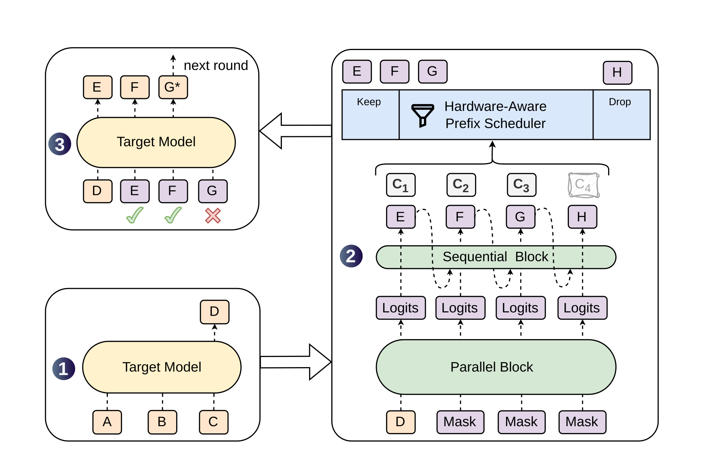
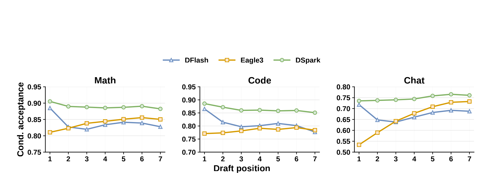
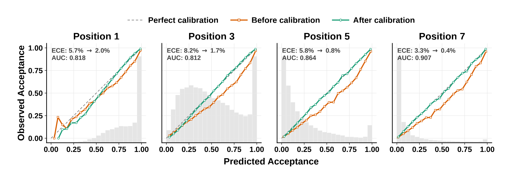
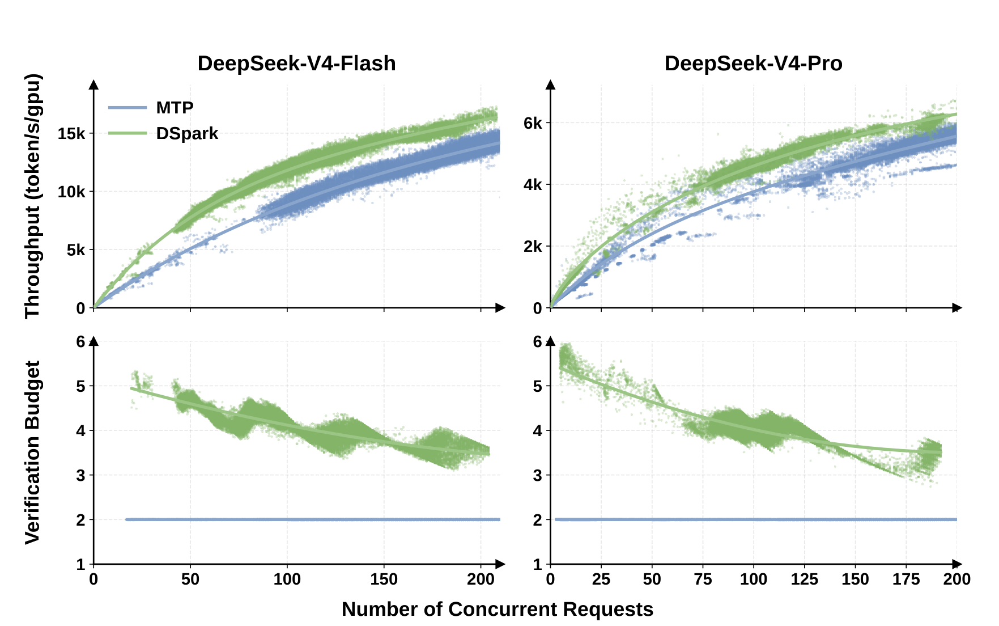

# DSpark：把“草稿更准”与“验证更聪明”统一起来

[DSpark](https://arxiv.org/abs/2607.05147v1) 不是一个新的基础模型，也不是
DeepSeek Sparse Attention。它是一套<strong>保持目标模型采样分布的推测解码框架</strong>：
以较深的并行骨干一次生成整块草稿，用极轻量的顺序头恢复块内依赖，再根据经过
校准的接受置信度和当前硬件成本，动态决定每个请求值得验证多长的前缀。

它回答的是推测解码中两个通常被分开处理的问题：

1. **draft better**：怎样在不把草稿延迟重新变成串行瓶颈的前提下，提高长草稿
   的接受长度；
2. **verify smarter**：怎样根据请求难度、并发和 GPU 的真实 step-rate 曲线，只把
   值得验证的候选送给目标模型。

这两个问题共同决定端到端收益。只提高 accepted length，可能被草稿计算、扩大后
的验证 batch、KV 状态和调度开销抵消；只缩短验证前缀，又可能浪费低负载时本来
空闲的目标算力。DSpark 的核心价值是把模型结构、概率校准和 serving 调度放进同
一条因果链。

> [!NOTE]
> 本页以 2026-07-06 提交的 arXiv v1、官方
> [DeepSpec](https://github.com/deepseek-ai/DeepSpec) 代码和截至
> 2026-07-28 的公开 serving 实现为边界。论文是作者报告而非同行评审定论；
> DeepSpec 公开的是训练与离线评测栈，不等于 DeepSeek 内部生产引擎的完整源码。

## 先分清对象：五层制品不是一回事 {#artifact-boundary}

| 名称 | 实际对象 | 可以证明什么 | 不能据此推出什么 |
| --- | --- | --- | --- |
| DSpark | 论文中的完整算法与系统 | 半自回归 drafter、confidence head、校准、硬件感知前缀调度与 V4 生产遥测 | 它是新基础模型，或 API 用户能直接选择它 |
| DeepSpec | DeepSeek 官方训练、数据准备和离线评测仓库 | Qwen3 / Gemma 4 的 DSpark、DFlash、EAGLE-3 可比训练与 rejection sampling | DeepSeek 内部生产异步调度、ZOS 集成和全部专用 kernel 已开源 |
| `dspark_qwen3_*_block7`、`dspark_gemma4_12b_block7` | 与指定 target 严格配套的草稿 checkpoint | 可以复现公开配置下的 block drafting | 它们能独立聊天，或能无条件迁移到微调后的 target |
| `DeepSeek-V4-Flash/Pro-DSpark` | 在原 V4 checkpoint 上附加 DSpark 模块的融合制品 | serving engine 可以从一个仓库取得 target 与 drafter 权重 | V4 基础模型能力或训练 checkpoint 被 DSpark 改写 |
| SGLang / vLLM | 承载 checkpoint 的推理引擎 | 具体版本支持哪些 draft、verify、graph 与调度路径 | “能加载 DSpark”就等于复现论文全部系统 |

论文和仓库都没有正式展开 `DSpark` 各字母的含义，因此不应自行补成
“DeepSeek Spark”或“Dynamic Spark”。官方代码仓库名是 **DeepSpec**，其中同时
包含 DSpark、DFlash 和 EAGLE-3。

还要排除三个同名干扰项：

- [DeepSeek Sparse Attention](https://arxiv.org/abs/2512.02556) 缩减目标模型长
  上下文注意力计算；DSpark 缩减生成阶段的 target 串行调用，两者可以共存但不是
  同一机制；
- [NVIDIA DGX Spark](https://www.nvidia.com/en-us/products/workstations/dgx-spark/)
  是 GB10 桌面 AI 计算机；
- [DeepSpark（2016）](https://arxiv.org/abs/1602.08191)是基于 Apache Spark 的
  分布式深度学习框架。

## 一分钟直觉：审稿人、起草者与容量规划员 {#intuition}

把昂贵的目标模型想成权威审稿人。普通自回归解码每轮只写并确认一个 token；
经典推测解码先让便宜的草稿模型写一串候选，再让目标模型在一次 forward 中并行
审阅。目标模型只接受从左到右连续通过的前缀，第一处拒绝之后的候选全部失效。

DSpark 把起草者拆成两部分：

1. **Parallel Block** 一次 forward 产生整个候选块的基础 logits。它可以做得较深，
   所以第一个位置很强，但各位置彼此独立；
2. **Sequential Block** 只做极便宜的低秩 Markov 或小 RNN 修正。它看到已经采样
   的前一个 token，避免把两条各自合理的表达路径拼成不连贯后缀。

随后 confidence head 估计每个位置的条件接受概率；prefix scheduler 像容量规划员
一样，把“多验证一个 token 可能带来的产出”与“当前 GPU batch 增大后的 step rate”
比较，为不同请求分配不同前缀长度。

<figure class="paper-figure paper-figure--wide" id="dspark-figure-01" data-paper-source="dspark" data-paper-asset="dspark-figure-01" markdown="1">
[{ width="1938" height="1250" loading="lazy" decoding="async" }](../../assets/papers/dspark/figure-01-architecture.png)
<figcaption><strong>一次 round 同时有“生成什么”和“验证多少”两条决策链。</strong>并行骨干负责高容量的一次性草拟，顺序头恢复块内条件依赖，confidence scheduler 只决定送入 target 的前缀长度；最终 token 的接受或纠正仍由目标模型完成。<span class="paper-figure__source">图源：<a href="https://arxiv.org/pdf/2607.05147v1#page=5">Cheng et al., DSpark, Figure 1, p. 5</a>；© 2026 Xin Cheng et al.，<a href="https://creativecommons.org/licenses/by/4.0/">CC BY 4.0</a>。</span></figcaption>
</figure>

## 前置知识：精确推测采样究竟保持什么 {#speculative-foundation}

设草稿分布为 $q$，目标分布为 $p$。草稿自回归或半自回归地提出
$x_1,\ldots,x_\gamma$，目标模型一次计算候选前缀各位置的分布。第 $i$ 个候选的
精确接受概率是

$$
\alpha_i
=
\min\left(1,\frac{p_i(x_i)}{q_i(x_i)}\right).
$$

若在第 $i$ 个位置拒绝，替代 token 不能直接从 $p_i$ 重采，而要从正残差分布

$$
p_i'(x)
=
\frac{[p_i(x)-q_i(x)]_+}
{\sum_y[p_i(y)-q_i(y)]_+}
$$

采样。若 $\gamma$ 个候选全部通过，则再从 target 的下一位置采一个 bonus token。
这套 rejection sampling 使最终输出仍服从 target 分布；加速器改变的是执行计划，
不是模型定义的概率分布。

“无损”需要同时满足四项契约：

- $p_i$ 必须就是普通 target 解码在该位置实际使用的分布，包含 temperature、
  top-$p$、penalty、grammar mask 等 processor 的最终效果；
- 公式中的 $q_i$ 必须精确对应候选的实际采样分布，并正确处理 tokenizer /
  vocabulary 映射；$p_i$ 与 $q_i$ 本来可以不同，官方 V4 recipe 中 target sampling
  配合 greedy draft 就是一个例子；
- 两个分布都要使用验收位置应有的条件历史，scheduler 是否提交候选则不能偷看会被
  该候选影响的未来随机量；
- 拒绝后，后续逻辑可见的 KV、grammar、流式游标与临时状态不能包含被拒 suffix。
  物理上残留但永不再引用的 KV 不影响证明；RNG 也不必复现普通 AR 的消耗轨迹，
  除非额外要求同 seed 逐字重放。

因此“lossless”不是要求两次随机生成逐字相同，而是要求输出分布保持不变。greedy
通常可以逐 token 对照；sampling 应做经验分布检验，并单独控制浮点并列、kernel
与 RNG 消耗差异。完整的一般机制见[推测解码](../../inference/speculative-decoding.md)。
它在 DeepSeek 发布物中的位置见[家族总览](../families/deepseek.md)与
[技术时间线](../deepseek-timeline.md)。

### 收益不是接受率的同义词

每轮平均延迟可粗略写成

$$
L_{\mathrm{token}}
=
\frac{T_{\mathrm{draft}}+T_{\mathrm{verify}}+T_{\mathrm{state}}}{\tau},
$$

其中 $\tau$ 是一轮平均产出的 token 数，包含全接受时的 target bonus token。
DSpark 同时操作分子和分母：

- 并行骨干使 $T_{\mathrm{draft}}$ 不随块长线性增长；
- 顺序头提高长前缀的存活率，从而提高 $\tau$；
- 动态调度防止低价值候选膨胀 $T_{\mathrm{verify}}$；
- ragged verify、CUDA Graph 与 KV 事务决定理论收益是否落到端到端。

accepted length 高但速度不升，通常不是概率公式失效，而是草稿、验证 shape、通信、
状态提交或高并发资源竞争成为新的关键路径。

## 为什么“深并行”与“浅自回归”各缺一半 {#drafter-tradeoff}

### EAGLE-3：后缀条件性强，草稿延迟随长度增长

EAGLE-3 一类 feature-level drafter 从 target 的中间特征出发，自回归地产生候选。
每个后续 token 都看到先前实际采样结果，因此长后缀的条件一致性较好；但 draft
串行深度为 $O(\gamma)$。为了不让 $T_{\mathrm{draft}}$ 抵消收益，网络通常需要保持
较浅，首位置预测容量受限。

### DFlash：第一步强，一次并行，但会 suffix decay

DFlash 选择相反方向：用较深的并行网络一次输出整块的 base logits。令 target
选定层的上下文特征为

$$
H_{\mathrm{ctx}}
=
\operatorname{RMSNorm}
\left(
W_c[H^{(\ell_1)};\ldots;H^{(\ell_m)}]
\right).
$$

每层 draft attention 把该上下文注入 key/value：

$$
K_i=[W_i^K H_{\mathrm{ctx}};\,W_i^K H_d],
\qquad
V_i=[W_i^V H_{\mathrm{ctx}};\,W_i^V H_d].
$$

块内 mask 位置可以双向交互，且 embedding 与 LM head 可与冻结 target 共享。这样
第一个 draft token 由较深网络产生，质量很强；但后面每个位置都在对“所有可能的
前缀”做边缘化，而不是条件于本轮真正抽到的 token。

若语境同时允许“of course”和“no problem”，独立位置可能组合出“of problem”。
这种 multi-modal collision 随位置积累，表现为 suffix decay：第一个位置很准，
越往后条件接受率越低。

<figure class="paper-figure paper-figure--wide" id="dspark-figure-02" data-paper-source="dspark" data-paper-asset="dspark-figure-02" markdown="1">
[{ width="1896" height="717" loading="lazy" decoding="async" }](../../assets/papers/dspark/figure-02-position-acceptance.png)
<figcaption><strong>这张图隔离的是位置本身的预测质量，而不是累计 prefix survival。</strong>每个点只在前面候选已通过的样本上统计当前位置，因此 DFlash 的下降揭示独立并行预测的后缀问题；DSpark 的曲线说明少量顺序依赖足以保留并行骨干的首位置容量。数值来自 Qwen3-4B、论文九个 benchmark 的域内平均，不应外推为任意 target 的固定接受率。<span class="paper-figure__source">图源：<a href="https://arxiv.org/pdf/2607.05147v1#page=12">Cheng et al., DSpark, Figure 2, p. 12</a>；© 2026 Xin Cheng et al.，<a href="https://creativecommons.org/licenses/by/4.0/">CC BY 4.0</a>。</span></figcaption>
</figure>

## 半自回归 drafter：大部分并行，少部分顺序 {#semi-autoregressive}

DSpark 保留 DFlash 式并行骨干产生 $U_1,\ldots,U_\gamma$，再让一个轻量 sequential
head 产生修正项 $B_k$：

$$
p_k(v)
=
\operatorname{softmax}\!\left(
U_k(v)+B_k(x_{1:k-1},v)
\right),
$$

从而恢复局部自回归分解

$$
P(X\mid x_0)
=
\prod_{k=1}^{\gamma}p_k(x_k\mid x_0,x_{1:k-1}).
$$

这里 $x_0$ 是 target 先生成的 anchor。与原 DFlash 略有不同，DSpark 把 anchor
自身作为第一个预测位置的输入：`anchor + (γ-1) masks` 直接得到 $\gamma$ 组 base
logits，减少一次无效 draft 计算。

### 默认 Markov head：一次低秩转移就能打破独立性

最简顺序头只看前一个已采样 token。令

$$
W_1\in\mathbb R^{|V|\times r},
\qquad
W_2\in\mathbb R^{r\times |V|},
$$

则第 $k$ 步的修正为

$$
B_k(v)
=
W_1[x_{k-1}]\,W_2[:,v].
$$

论文默认和公开 Qwen / Gemma、V4-Flash 制品使用 $r=256$；V4-Pro 制品实际为
$r=512$。实现上，$W_1$ 是 token embedding lookup，$W_2$ 是无 bias 的线性投影；
顺序采样只增加 $\gamma$ 次很小的低秩变换，而不重复运行 Transformer 骨干。它没有
试图承担完整语言建模，只负责回答“既然刚才实际选了这个 token，下一位置的哪些并行
候选应该上调或下调”。

### RNN head：更长记忆，收益与部署复杂度一起增加

RNN 变体把前一状态、前一 token 的低秩 embedding 和并行骨干的当前位置 hidden
state 合并，再通过 gated update 维护 $s_k$。它可以利用超过一阶的块内历史，但会
增加 recurrent state、kernel 和部署路径。论文消融显示它只在长块上取得边际改进，
因此生产 DSpark 与公开默认配置都选择更简单的 Markov head。

这是一条重要的建模经验：并行骨干已经承担绝大部分语义预测，顺序头的目标是消除
mode collision，而不是再造一个小型自回归 Transformer。论文中 2-layer DSpark
还能超过 5-layer DFlash，也说明“补上正确的依赖结构”可能比继续堆并行层更有效。

## Confidence head：预测的不是正确答案，而是验证价值 {#confidence}

对第 $k$ 个候选，confidence head 读取并行 hidden state 与前一 token 的 Markov
embedding：

$$
c_k
=
\sigma\!\left(
w^\top[h_k;W_1[x_{k-1}]]
\right).
$$

$c_k$ 的语义是：**在前 $k-1$ 个候选已经接受的条件下，第 $k$ 个候选能继续通过
验证的概率**。最终是否接受仍由 target rejection sampling 决定；confidence 只
控制值得送几个 token 去验证。

训练标签不必真的运行一次 Bernoulli 接受试验。对归一化的 draft / target 分布，
单步期望接受概率等于两分布的重叠质量：

$$
c_k^*
=
\sum_v \min(p_k^d(v),p_k^t(v))
=
1-\frac12\lVert p_k^d-p_k^t\rVert_1.
$$

第 $j$ 个 prefix 能完整存活的概率是条件概率连乘：

$$
a_{r,j}
=
\prod_{i=1}^{j}c_{r,i}.
$$

这解释了为什么 calibration 比只看 ROC-AUC 更重要：scheduler 使用的是累计概率的
绝对值，而不仅是高低排序。每个位置轻微过度自信，连乘后会系统性高估长前缀收益。

### Sequential Temperature Scaling

论文中的 raw confidence 有不错的区分能力，位置级 ROC-AUC 约为 0.81–0.90，
但 ECE 仍约 3%–8%，整体偏过度自信。Sequential Temperature Scaling
（STS）按位置从左到右，为累计 prefix survival 做一维温度网格搜索，使后一个位置
在已经校准的前缀概率上继续拟合。作者报告平均 ECE 降至约 1%。

<figure class="paper-figure paper-figure--wide" id="dspark-figure-06" data-paper-source="dspark" data-paper-asset="dspark-figure-06" markdown="1">
[{ width="1896" height="667" loading="lazy" decoding="async" }](../../assets/papers/dspark/figure-06-confidence-calibration.png)
<figcaption><strong>AUC 回答“会不会排对”，ECE 回答“这个概率能不能拿来算容量”。</strong>橙线的排序信息已经可用，但绝对值偏高；绿线校准后更接近理想对角线，才适合作为跨请求比较的预期收益。灰色直方图还显示不同位置面对的 confidence 分布不同，所以一个全局静态阈值不是硬件感知调度的等价替代。<span class="paper-figure__source">图源：<a href="https://arxiv.org/pdf/2607.05147v1#page=15">Cheng et al., DSpark, Figure 6, p. 15</a>；© 2026 Xin Cheng et al.，<a href="https://creativecommons.org/licenses/by/4.0/">CC BY 4.0</a>。</span></figcaption>
</figure>

## 硬件感知前缀调度：优化整批产出，不是单请求接受率 {#scheduler}

对当前 batch 中的 $R$ 个请求，令请求 $r$ 选择验证 $l_r$ 个 draft token。target
本轮实际处理的 token 数为

$$
B=\sum_{r=1}^{R}(1+l_r),
$$

其中每个请求的 `1` 是 anchor / target 基础步。期望产出为

$$
\tau
=
\sum_{r=1}^{R}
\left(
1+\sum_{j=1}^{l_r}a_{r,j}
\right).
$$

系统先在目标硬件、模型和并行配置上 profile 一条 step-rate 曲线
$\operatorname{SPS}(B)$，再最大化

$$
\Theta(l_1,\ldots,l_R)
=
\tau\cdot \operatorname{SPS}(B).
$$

这个目标自动表达两种相反情形：

- 低并发时，扩大 verify batch 对 step rate 影响小，长前缀的机会成本低；
- 高并发时，target 已接近容量边界，低置信候选会拖慢整个 batch，应更早裁掉。

更一般的 token、KV、deadline 与租户预算见[调度与 Goodput](../../inference/scheduling-goodput.md)；
DSpark 在其中增加的是 per-request speculative verify allocation。

由于 $a_{r,j}$ 随 $j$ 单调不增，把所有“再给请求 $r$ 增加一个位置”的候选按
$a_{r,j}$ 全局降序排列，天然满足 prefix dependency：一个更深位置不可能排在同一
请求的浅位置之前。理论 Algorithm 1 依次加入候选、记录最佳 $\Theta$，在目标首次
不再改善时 early stop，复杂度为 $O(R\gamma\log(R\gamma))$。

下面的 reference 只表达 Algorithm 1 的离散选择语义；`sps` 必须来自目标部署的
实测 cost table，不能用别的 GPU 或别的模型的曲线代替：

```python
def schedule_prefixes(prefix_survival, sps):
    lengths = [0] * len(prefix_survival)
    base_tokens = len(lengths)
    for row in prefix_survival:
        previous = 1.0
        for probability in row:
            if not 0.0 <= probability <= 1.0 or probability > previous:
                raise ValueError(
                    "prefix survival must be in [0, 1] and non-increasing"
                )
            previous = probability
    expected = float(base_tokens)
    best_score = expected * sps(base_tokens)
    best_lengths = lengths.copy()
    batch_tokens = base_tokens
    ranked = sorted(
        (
            (probability, request_id, position)
            for request_id, row in enumerate(prefix_survival)
            for position, probability in enumerate(row, start=1)
            if probability > 0.0
        ),
        key=lambda item: (-item[0], item[1], item[2]),
    )
    for probability, request_id, position in ranked:
        if position != lengths[request_id] + 1:
            raise AssertionError("prefix ordering invariant was broken")
        lengths[request_id] = position
        expected += probability
        batch_tokens += 1
        score = expected * sps(batch_tokens)
        if score <= best_score:
            break
        best_score = score
        best_lengths = lengths.copy()
    return best_lengths, best_score

def profiled_sps(batch_tokens):
    return {2: 1.00, 3: 0.92, 4: 0.84, 5: 0.68}[batch_tokens]

chosen, score = schedule_prefixes([[0.90, 0.72], [0.80]], profiled_sps)
assert chosen == [1, 1]
assert abs(score - 3.7 * 0.84) < 1e-9
tie_chosen, _ = schedule_prefixes([[0.90, 0.90]], lambda _: 1.0)
assert tie_chosen == [2]
```

reference 中的 early stop 不只是性能启发式，还与精确性有关。

### 为什么“看完整块再决定”可能破坏无损 {#non-anticipation}

若是否接纳第一个候选取决于观察到的第二个候选 confidence，而第二个 confidence 又
依赖于第一个实际采样 token，scheduler 就利用了未来信息做 selection。论文附录给
出二元反例：

- target 对 $A/B$ 的概率为 $0.7/0.3$，draft 为 $0.5/0.5$；
- 标准 rejection sampling 保持 $0.7/0.3$；
- 若只在“后续看起来很有希望”时才提交前一个候选，输出会偏成约 $0.85/0.15$。

因此，调度决策必须是 **non-anticipating**：决定当前候选是否进入验证时，不能使用
由该候选的随机实现所产生的未来信息。理论算法的 early stop 在收益已经下降时立刻
结束，不再观察更深位置。其“找到全局最优”的论证还依赖 $\Theta$ 近似单峰；真实
GPU step-rate 的 graph bucket、kernel 切换与异步流水会让曲线出现锯齿，所以生产
实现需要另一种因果屏障，而不是盲目照搬单峰假设。

## 从理论 scheduler 到 V4 生产路径 {#production-scheduler}

论文披露的 DeepSeek-V4 serving 并没有直接执行同步 Algorithm 1。生产引擎同时
存在 CUDA Graph bucket、Zero-Overhead Scheduler（ZOS）和跨 round 的异步流水，
实测 SPS 曲线也可能非单峰。作者做了三项关键改造：

1. **两步历史预测容量**：用两轮以前的 confidence 估计本轮可承受的全局候选容量
   $K$。容量决策与当前 token realization 隔开，形成历史因果屏障；
2. **当前请求做 top-$K$**：当前 round 的实际 confidence 只在既定容量内部给候选
   排序，不再反过来改变 $K$；
3. **允许越过局部低谷**：有了历史屏障后，可以取消理论算法的 early stop，在
   锯齿形成本曲线上继续搜索更好的 graph / kernel bucket。

这不是“early stop 可有可无”，而是用另一种 non-anticipating 机制替换了它。若
自行实现时既偷看当前未来 confidence，又取消 early stop / 历史屏障，就不能再沿用
论文的 lossless 结论。

不同请求最终具有不同逻辑 verify length。生产引擎把候选压成 ragged token buffer，
另用 marker / index tensor 表示每个 token 属于哪条前缀及其依赖；target 不应为被
裁掉的位置创建有效 KV。V4 原本已经使用稀疏 index attention，论文称只需修改
index-attention 与 compression kernel 的索引路径，而不是重写整个 backbone。

## 训练：冻结 target，把三种目标对齐起来 {#training}

DSpark 训练时冻结目标模型，使用与 target 同值且冻结的 embedding 和 LM head，只
更新并行 draft backbone、sequential head 与 confidence head。论文可把两者视为
共享权重；DeepSpec 训练代码则从 target 复制初始化后删除 target 对象，serving
实现还可以用参数别名避免重复存储。训练样本从 target 生成的序列中随机选择多个
anchor；每个 anchor 展开一个长度为 $\gamma$ 的监督块。

位置权重为指数衰减：

$$
w_k
=
\exp\left(-\frac{k-1}{\lambda}\right).
$$

论文正文把衰减尺度写作 $\gamma$；公开 Qwen3-4B 配置则明确使用
`loss_decay_gamma=4.0`、`block_size=7`，代码实际执行
`exp(-position / loss_decay_gamma)`。这是一处应保留的“论文默认口径—公开 recipe”
差异，不能把符号 $\gamma$ 机械地替换成所有 checkpoint 的实际超参数。

总损失由三部分构成：

$$
\mathcal L_{\mathrm{CE}}
=
-\sum_k w_k\log p_k^d(x_k^*),
$$

$$
\mathcal L_{\mathrm{TV}}
=
\sum_k w_k\lVert p_k^d-p_k^t\rVert_1,
$$

$$
\mathcal L_{\mathrm{conf}}
=
-\sum_k w_k
\left[
c_k^*\log c_k+(1-c_k^*)\log(1-c_k)
\right].
$$

论文和公开 DSpark 配置采用

$$
\mathcal L
=
0.1\mathcal L_{\mathrm{CE}}
+0.9\mathcal L_{\mathrm{TV}}
+1.0\mathcal L_{\mathrm{conf}}.
$$

CE 学习真实 target token；$L_1$/TV 蒸馏直接增大 draft 与 target 的分布重叠，也就
直接提高理论接受概率；BCE 让 confidence 逼近同一个重叠量。三者共享一个概率语义，
而不是三个彼此无关的辅助头。

顺序头训练使用真实前序 token 做 teacher forcing，推理则条件于自身刚采样的 token。
这保留了高效监督，也引入常见的 train–inference exposure gap；block 更长或领域偏移
更大时，应把它与 suffix acceptance 一起测，而不能只看 teacher-forced loss。

### DeepSpec 公开 Qwen3-4B recipe

| 配置 | 公开值 | 含义 |
| --- | ---: | --- |
| target | `Qwen/Qwen3-4B` | drafter 与这个 checkpoint / tokenizer 配套 |
| block size | 7 | 每轮最多提出 7 个 draft token |
| draft layers | 5 | 深并行骨干；不是 V4 生产的 3 层 MoE 配置 |
| target features | layers 1, 9, 17, 25, 33 | 融合多个深度的 target hidden states |
| anchors / sequence | 512 | 一条缓存序列抽取多个监督起点 |
| Markov | vanilla, rank 256 | 默认一阶低秩顺序修正 |
| confidence | enabled, with Markov feature | 同时读取并行与前 token 信息 |
| loss weights | CE 0.1、$L_1$ 0.9、confidence 1.0 | 与论文目标一致 |
| decay | 4.0 | 实现权重为 $\exp(-k/4)$ |
| precision / batch | BF16 / global 512 | 默认脚本假定单机 8 GPU |
| epochs / max length | 10 / 4096 | 公开训练 recipe 的边界 |
| learning rate | $6\times10^{-4}$ | 无 weight decay |

[DeepSpec 的固定 revision](https://github.com/deepseek-ai/DeepSpec/tree/005e03b81cec38b7da6399833d609ee89a2587f2)
能交叉核对这些字段、低秩 Markov 实现、TV 标签和标准 rejection sampling。官方默认
流程使用约 130 万条 Open-PerfectBlend prompts，让 target 在 **non-thinking mode**
重生成 response，再缓存选定层与最终 pre-LM-head hidden states；训练时仅在抽样
anchor 上通过冻结 LM head 本地重建 target logits / 分布。README 警告 Qwen3-4B
默认 target cache 约需 **38 TB**；这使“从头复现训练”与“直接加载已发布 drafter
评测”成为成本完全不同的任务。

若实际 workload 是领域文本或 thinking mode，官方明确建议重新训练 / 微调 drafter。
target 做了 LoRA、继续预训练、tokenizer 或 logit processor 变更后，原 drafter 的
分布匹配与 calibration 都可能漂移；“底座名称相同”不能替代 checkpoint-level
兼容性验证。

### V4 生产 recipe 与开源 recipe 不同

论文披露的 V4 DSpark 使用：

- 3 个带 mHC 的 MoE draft layers；
- sliding-window attention，窗口 128；
- 最大草稿长度 $\gamma=5$；
- 低秩 Markov head、confidence head 与 STS。

公开制品 config 进一步显示：Flash 读取 target layers `[40, 41, 42]`、Markov rank
256；Pro 读取 `[58, 59, 60]`、rank 512；两者的 `dspark_block_size` 都是 5。
这些是 checkpoint contract，不是可以跨 target 复制的通用层号。

训练运行在内部 HAI-LLM 栈。为了避免在训练并行组之间传输
$O(|V|)$、约十万维的完整 logits，target worker 只通信 $O(d)$ hidden state；接收端
只在采样到的 anchors 上本地应用共享 LM head。另以 anchor-bounded dense packing
把不规则监督块压紧，并用 token-level attention index 保持块间隔离。

这些系统优化没有完整进入 DeepSpec。公开仓库适合研究训练、标准拒绝采样、
confidence reliability 和 batch-size-1 的静态阈值评测；它不包含论文生产级 STS
拟合 / 应用、SPS 多请求调度、DeepSeek 内部生产 ZOS 集成或 V4 专用 ragged kernel
的完整实现。

### “轻量”不等于没有计算和参数

设上下文长 $S$、draft 层数 $L_d$、hidden size $d$、块长 $\gamma$、词表 $|V|$、
Markov rank $r$。通用全上下文 draft attention 的量级约为
$O(L_d\gamma(S+\gamma)d)$；V4 的 window 128 把远程范围换成
$O(L_d\gamma(128+\gamma)d)$。基础 LM head 仍有 $O(\gamma|V|d)$ 工作，Markov
修正有约 $O(\gamma|V|r)$ 工作和 $\gamma$ 个很短的顺序依赖。

vanilla Markov 的两个矩阵共有约 $2|V|r$ 参数。Qwen DSpark 在
$|V|=151{,}936,r=256$ 时约为 77.8M；V4-Flash 在
$|V|=129{,}280,r=256$ 时约为 66.2M，V4-Pro 的 $r=512$ 时约为 132.4M。它相对
数百亿至万亿参数 target 很小，但仍会消耗权重带宽和 kernel 时间。
“并行 drafter 对 $\gamma$ 的 latency 近似平坦”描述的是一定区间内的 GPU wall
time，不表示 FLOPs、LM-head 工作或 verify token 数不随 $\gamma$ 增长。

## 离线实验：先隔离 drafter，再分析 scheduler {#offline-results}

论文离线对照使用 Qwen3-4B / 8B / 14B 和 Gemma 4 12B，统一训练数据、target
feature layers 与训练框架，比对 EAGLE-3、DFlash 和 DSpark。九个 benchmark 分为：

- 数学：GSM8K、MATH500、AIME25；
- 代码：MBPP、HumanEval、LiveCodeBench；
- 对话：MT-Bench、Alpaca、Arena-Hard-v2。

所有模型在 temperature 1、non-thinking、chain-based speculative sampling 下评测。
主表关闭动态 scheduler、固定验证完整 block，因此首先测的是 drafter 本身，而不是
端到端 serving 吞吐。accepted length 包含全部 draft 通过时的 target bonus token。

### 主结果应该怎样读

| target | EAGLE-3 | DFlash | DSpark | DSpark 相对 EAGLE-3 | 相对 DFlash |
| --- | ---: | ---: | ---: | ---: | ---: |
| Qwen3-4B | 3.611 | 4.064 | 4.727 | +30.9% | +16.3% |
| Qwen3-8B | 3.798 | 4.067 | 4.813 | +26.7% | +18.4% |
| Qwen3-14B | 3.676 | 4.039 | 4.779 | +30.0% | +18.3% |
| Gemma 4 12B | 4.376 | 4.018 | 4.663 | +6.6% | +16.1% |

这些是九个 benchmark 的 macro accepted length，而不是 tokens/s。数学和代码通常比开放聊天有更长的 accepted prefix，
符合“低熵、结构化续写更容易被便宜 drafter 捕捉”的直觉，但不构成跨数据集的普遍
定律。Qwen 三组百分比由论文正文直接报告；Gemma 两个百分比由 Table 1 的 macro
值计算并四舍五入。

论文还给出五组机制证据：

1. position-wise conditional acceptance 显示 DFlash 首位置强、后缀衰减；
   EAGLE-3 首位置弱但后续稳定；DSpark 兼得两者；
2. 2-layer DSpark 超过 5-layer DFlash，支持“依赖建模比继续加并行深度更关键”；
3. proposal length 从 4、8、12 增至 16 时，DSpark 对 DFlash 的差距继续扩大；
4. RNN 只在长 block 上略优于 Markov，未抵消部署复杂度；
5. batch 128、context 512–4096 的论文环境中，block 由 4 增至 16 相比 DFlash
   只增加约 0.2%–1.3% full-round latency；这是特定硬件 / kernel 的作者测量，
   不是任意引擎的常数。

confidence threshold sweep 则是诊断实验：阈值升高时，被 target 最终拒绝的候选
先被裁掉，Math / Code / Chat 的验证接受率上升。它没有同时优化 SPS 成本，因此
不能把“最佳静态阈值”当作动态 scheduler 的替代品。

## V4 实时流量：看 Pareto frontier，不看孤立倍率 {#live-traffic}

论文把 DSpark-5 与 V4 先前的单 token 草稿基线 MTP-1 比较。作者称 DSpark 在
V4-preview 发布约两周后替代 MTP-1，并用真实用户请求采样绘出 per-user generation
speed 与 aggregate output throughput 的前沿。

| serving target | SLA 锚点 | aggregate throughput | 匹配实用吞吐时的 per-user speed |
| --- | ---: | ---: | ---: |
| V4-Flash | 80 tok/s/user | +51% | +60%–85% |
| V4-Flash | 120 tok/s/user | 名义 +661% | 应读作服务边界扩展 |
| V4-Pro | 35 tok/s/user | +52% | +57%–78% |
| V4-Pro | 50 tok/s/user | 名义 +406% | 应读作服务边界扩展 |

661% 与 406% 出现在 MTP-1 已接近并发塌陷、只能维持很小 batch 的严格 SLA 点。
论文正文也明确说，这些点主要证明 DSpark 把可行的 throughput–interactivity frontier
向外推，不是日常请求的稳定加速倍数。更稳健的容量比较是同一实际吞吐下的 per-user
speed，以及中等 SLA 下约 51% / 52% 的 aggregate gain。

<figure class="paper-figure paper-figure--portrait" id="dspark-figure-08" data-paper-source="dspark" data-paper-asset="dspark-figure-08" markdown="1">
[{ width="1763" height="1104" loading="lazy" decoding="async" }](../../assets/papers/dspark/figure-08-load-adaptation.png)
<figcaption><strong>动态预算把低负载的空闲验证能力转换为长前缀，又在拥塞时主动回收。</strong>V4-Flash 低于约 200 并发、V4-Pro 低于约 150 并发时，平均 verify budget 从 MTP-1 的静态 2 扩到约 4–6；负载继续上升后，scheduler 平滑缩短前缀，避免低置信候选占用关键 batch 容量。散点和拟合曲线来自 DeepSeek 内部生产流量与引擎配置，公开代码不能独立复刻其绝对吞吐。<span class="paper-figure__source">图源：<a href="https://arxiv.org/pdf/2607.05147v1#page=19">Cheng et al., DSpark, Figure 8, p. 19</a>；© 2026 Xin Cheng et al.，<a href="https://creativecommons.org/licenses/by/4.0/">CC BY 4.0</a>。</span></figcaption>
</figure>

负载自适应还揭示一个局限：并行骨干的固定成本在所有请求上都会支付。对特别复杂、
高熵、低接受率请求，即使 scheduler 最终只验证很短前缀，draft backbone 已经运行。
论文把 difficulty-aware early exit 列为后续方向；当前结果没有证明任何 workload
都能从 DSpark 获益。

## 2026-07-28 的公开实现状态 {#ecosystem}

### DeepSpec：训练和研究评测，不是生产 serving engine

[DeepSpec](https://github.com/deepseek-ai/DeepSpec) 公开了 Qwen3 4B / 8B / 14B、
Gemma 4 12B 的 EAGLE-3、DFlash、DSpark 对照 checkpoint，以及数据生成、target
cache、训练和九组 benchmark 评测。其关键代码可核对：

- [`markov_head.py`](https://github.com/deepseek-ai/DeepSpec/blob/005e03b81cec38b7da6399833d609ee89a2587f2/deepspec/modeling/dspark/markov_head.py)
  中的 low-rank vanilla / gated / RNN head；
- [`loss.py`](https://github.com/deepseek-ai/DeepSpec/blob/005e03b81cec38b7da6399833d609ee89a2587f2/deepspec/modeling/dspark/loss.py)
  中的 $1-\frac12L_1$ 接受标签、CE / $L_1$ / confidence loss；
- [`base_evaluator.py`](https://github.com/deepseek-ai/DeepSpec/blob/005e03b81cec38b7da6399833d609ee89a2587f2/deepspec/eval/base_evaluator.py)
  中的标准 rejection sampling、拒绝 suffix 与 bonus token；
- [`draft_ops.py`](https://github.com/deepseek-ai/DeepSpec/blob/005e03b81cec38b7da6399833d609ee89a2587f2/deepspec/eval/dspark/draft_ops.py)
  中 batch-size-1 的静态 confidence threshold。

DeepSpec 代码采用 MIT License，V4-Flash-DSpark 与 V4-Pro-DSpark 仓库也明确把仓库
和权重置于 MIT License 下。独立 Qwen / Gemma 草稿 checkpoint 当前缺少完整模型卡
和单独 license metadata；不能把 DeepSpec 的代码许可自动外推到这些 checkpoint，
引用、再分发时还应同时核对 target 模型及 checkpoint 的许可边界。

### SGLang：当前公开的 confidence-scheduled 生产路径

[SGLang v0.5.16](https://github.com/sgl-project/sglang/releases/tag/v0.5.16)
已经公开集成：

- Qwen3 dense 与 DeepSeek-V4 sparse DSpark；
- confidence-scheduled variable-length verify；
- `static`、`compact`、`cap-accept` 三种模式；
- ragged verify、按 packed token 总量分桶的 CUDA Graph；
- STS、SPS cost table、ZOS 两步 relay 和可观测指标。

这里的“生产路径”是指 v0.5.16 已支持的模型、backend 与 topology 组合，不是任意
配置的通用承诺。该版本的
[启动期检查](https://github.com/sgl-project/sglang/blob/v0.5.16/python/sglang/srt/arg_groups/speculative_hook.py)
要求 CUDA、`pp_size == 1`；DP attention 还要求 DP LM head、内置 TP MoE，且不能与
context parallel 叠加。dense draft 的 compact verify 与 DP attention 同用时，
[CUDA Graph 还有额外限制](https://github.com/sgl-project/sglang/blob/v0.5.16/python/sglang/srt/speculative/dspark_components/dspark_worker_v2.py)。
应锁定 release，按启动检查与目标版本测试矩阵选择 attention backend；下方 Qwen
示例只说明参数形态。

[SGLang 官方技术说明](https://www.lmsys.org/blog/2026-07-06-dspark-sglang)
把成本近似为

$$
T(bs,K)
=
\operatorname{bias}+\alpha(bs)+\theta(bs+K),
$$

其中 $bs$ 是请求数，$K$ 是额外候选总量。它复现的是机制和趋势，不声称逐数字复刻
DeepSeek 内部硬件、流量或绝对吞吐。

一个 Qwen3 接入形态是：

```bash
SGLANG_RAGGED_VERIFY_MODE=compact \
python -m sglang.launch_server \
  --model-path Qwen/Qwen3-14B \
  --speculative-algorithm DSPARK \
  --speculative-draft-model-path deepseek-ai/dspark_qwen3_14b_block7 \
  --speculative-dspark-sps-table-path /path/to/profiled-sps-table.json
```

参数名和可用后端应以目标 release 的 `--help` 为准。只有 `compact` 而没有在同一
模型、硬件、并行度和 graph 配置上 profile 的 SPS table，不能声称已经复现硬件
感知最优调度。

### vLLM：已经支持 DSpark drafter，但动态调度仍要看 PR 状态

[vLLM v0.25.0](https://github.com/vllm-project/vllm/releases/tag/v0.25.0)
首次发布 DSpark drafter 与 V4 融合 checkpoint 支持；
[v0.26.0](https://github.com/vllm-project/vllm/releases/tag/v0.26.0) 继续加入
Gemma 4、AMD 与 XPU 路径。已发布实现覆盖并行 backbone、Markov sampling、
Paged KV 和固定 `num_speculative_tokens` 验证。

截至 2026-07-28，v0.26.0 已发布 loader 仍会跳过 checkpoint 中的 confidence-head
权重。完整 confidence-scheduled verification 的
[PR #47808](https://github.com/vllm-project/vllm/pull/47808) 仍处于 WIP；该分支已经
构造、加载并使用 confidence head 做 adaptive verification，但尚未合并，不能视为
stable capability。因此：

> “vLLM 能运行 DSpark checkpoint”是已发布事实；“vLLM stable 已复现论文完整
> confidence scheduler”不是。

V4 checkpoint metadata 与论文生产实验使用 block 5，但当前 Flash 与 Pro 两张模型卡
给出的 vLLM recipe 都配置 `num_speculative_tokens=7`；现有 loader 只要求请求值不
小于 checkpoint block size。这里的 7 是 serving 配置边界，不应拿论文
$\gamma=5$ 的吞吐数字直接解释。

固定长度 Qwen3 示例为：

```bash
vllm serve Qwen/Qwen3-8B \
  --trust-remote-code \
  --speculative-config \
  '{"method":"dspark","model":"deepseek-ai/dspark_qwen3_8b_block7","num_speculative_tokens":7,"attention_backend":"FLASH_ATTN","draft_sample_method":"probabilistic"}'
```

部署前要按所装 vLLM 版本核对字段；开放 PR 的接口不能提前当作 stable contract。

### V4 模型卡、API 与 Mac

[V4-Flash-DSpark](https://huggingface.co/deepseek-ai/DeepSeek-V4-Flash-DSpark/blob/62af8fffb2f7030cac4de2f0169f5b8d1101b646/README.md) 和
[V4-Pro-DSpark](https://huggingface.co/deepseek-ai/DeepSeek-V4-Pro-DSpark/blob/7c09739fd136abfb70a49ec334157f65f45b52cd/README.md) 模型卡
明确说它们不是新模型，而是原 checkpoint 附加 speculative decoding module。仓库
中的极简 `generate.py` 仍是逐 token target 示例；真正启用 DSpark 需要 serving
engine 调用 speculative path。

截至 2026-07-28，DeepSeek 官方公开
[模型列表](https://api-docs.deepseek.com/api/list-models)与 API schema 暴露的是
`deepseek-v4-flash`、`deepseek-v4-pro`，没有 DSpark 独立模型 ID、开关、
confidence 或 verify-budget 指标。对 API 用户，它至多是服务端透明优化，不能仅凭
请求结果确认某个时刻、某个 endpoint 一定启用了 DSpark。

截至 2026-07-28，未在 DeepSeek 公开制品中验证到官方 MLX 路径。第三方
[`mlx-dspark`](https://github.com/ARahim3/mlx-dspark) 可以探索 Qwen / Gemma 草稿，
但不等于在 Mac 上运行 284B / 1.6T 的 V4 production stack；其性能需在本机、目标
模型和具体 prompt 分布上复测，不能外推论文的高并发结果。

## 与相邻方法的决策型比较 {#comparison}

| 方法 | 草稿生成 | 块内依赖 | verify 形态 | 强项 | 主要代价 / 失效点 |
| --- | --- | --- | --- | --- | --- |
| 普通 AR | 无 | 完整 | 每步 1 token | 实现和状态最简单 | target 串行深度等于输出长度 |
| 小模型 speculative | 小模型逐 token AR | 强 | 单链 rejection sampling | 通用、精确，易理解 | draft latency 随 $\gamma$ 线性增长；第二套权重/KV |
| prompt lookup / n-gram | 从已有文本匹配 | 只复制现成片段 | 单链 | 无训练，代码补全和重复片段便宜 | 开放生成命中率低 |
| Medusa / multi-head tree | 多个并行 future heads | 较弱 | tree attention | 一次覆盖多个候选分支 | tree 构造、mask、KV 分支和校准复杂 |
| MTP-1 | target 内置单步预测模块 | 一步 | 静态 2-token round | 固定开销小，生产稳定 | 无法充分利用低负载的大 verify 容量 |
| EAGLE-3 | feature-level AR drafter | 强 | 单链 / tree 变体 | 后缀一致、接受衰减小 | 草稿串行，深度与块长受 latency 约束 |
| DFlash | 深并行 block | 条件独立 | 固定 block | 首 token 强，长块 draft 成本低 | multi-modal collision、suffix decay |
| DSpark | 深并行 block + 低秩顺序头 | 局部 Markov / RNN | 动态 ragged prefix | 强首 token、稳定后缀、负载感知 | 配套训练、校准、cost table 与 engine 集成复杂 |

DSpark 不是最早做动态 speculative length 的工作，confidence threshold、dynamic
tree 和自适应 lookahead 早已有之；它的贡献应准确描述为：**把深并行 drafter 的
容量优势、廉价局部自回归、可校准 prefix survival，以及以硬件 SPS 曲线为目标的
多请求调度组合并部署到 V4 实时流量。**

它也不是把 MTP 的预测步数简单从 1 改成 5。MTP 是目标模型训练 / 附加模块的多步
预测接口；DSpark 还定义了独立的 draft 分布、标准 rejection sampling、confidence
语义和 batch-level verify allocation。

## 什么时候值得用，什么时候不值得 {#when-to-use}

### 更可能获益

- 输出较长、decode / TPOT 占主导，而不是 prompt prefill / TTFT 占主导；
- target 很大，draft backbone 相对便宜；
- 代码、数学、结构化文本或可预测模板等低熵任务；
- 低到中并发存在闲置 target verify 能力；
- 高并发时 engine 能按负载缩短 ragged prefix，而不是固定验证最长 block；
- target revision 稳定，能够维护一一匹配的 drafter、calibration 和 SPS profile；
- 不能接受近似质量下降，但可以承担额外权重、KV、训练和运行时复杂度。

### 应关闭或谨慎

- 输出很短，初始化与 draft 固定成本无法摊薄；
- 长 prompt 的主要问题是 prefill / TTFT：DSpark 优化 decode，不直接减少 prefill；
- 小 target 或 CPU / 未优化 backend，draft 本身已接近 target 成本；
- 高熵创作、开放聊天或与训练完全不同的 thinking trace 接受率很低；
- target 做过 LoRA、继续训练或 tokenizer / vocabulary 变化，而 drafter 未重新对齐；
- engine 无法重建各自 processor 之后的实际 $p/q$，或无法正确映射两者词表；
- 显存不足以容纳附加权重、draft KV 和 provisional target KV；
- 需要 beam search 或尚无精确事务语义的自定义 decode；
- 高并发仍固定长块验证，低置信 token 会挤占其他请求的 batch capacity。

一个保守 fallback 是按请求 / batch 降级到普通 AR。fallback 必须是独立正确路径，
而不是在已经污染 KV 或 RNG 状态后继续执行。

## 评测：把模型收益、系统收益和正确性分开 {#evaluation}

只报告平均 accepted length 无法回答“是否值得上线”。最小指标矩阵应包含：

| 层面 | 必测指标 | 常见误判 |
| --- | --- | --- |
| draft quality | 每位置 conditional acceptance、prefix survival、accepted length 分布 | 只看总体接受率，掩盖首位置与后缀差异 |
| confidence | AUC、ECE、Brier、position / domain / temperature 分桶 | AUC 高就认为概率绝对值可用于容量规划 |
| latency | draft、sequential head、schedule、verify、sample、state commit 分项 | accepted length 高就宣布 speedup |
| serving | TTFT、TPOT、tok/s/user、aggregate output tok/s、p50/p95/p99、goodput | 单请求 batch 1 外推高并发 |
| resource | verify tokens、拒绝 token、CUDA Graph hit、显存、功耗、通信 | 忽略附加权重、KV 与 graph fallback |
| exactness | greedy token 对照；sampling 的小词表枚举和经验分布检验 | 要求随机文本逐字相同，或只跑语义评分 |
| drift | domain、thinking、temperature、context、target revision、时间窗口 | 用 non-thinking 校准长期覆盖所有流量 |

线上 dashboard 至少应暴露 `proposal_length`、`accepted_draft_length`、
`verification_budget`、`rejected_verify_tokens`、已观测前缀上的 confidence
calibration、普通 AR fallback 比例和每个 CUDA Graph bucket 的命中率。compact
模式不会验证被裁尾部，因此这些观测有删失偏差；完整位置级 ECE / bias 需要
`cap-accept`、static companion run，或明确假设下的反事实估计器。accepted length
下降可能是数据漂移；calibration 漂移更危险，因为它会让 scheduler 对机会成本做
系统性错误估计。

### 七个递进实验

1. **分布无损**：在词表 $\{A,B\}$ 上枚举 / Monte Carlo 对比普通 target sampling
   与标准 rejection sampling，再复现附录的 retrospective scheduler，使
   $0.7/0.3$ 偏到约 $0.85/0.15$；
2. **同条件 drafter 对照**：Qwen3-4B、block 7、关闭动态调度，使用官方
   EAGLE-3 / DFlash / DSpark checkpoint，画 Math / Code / Chat 的逐位置曲线；
3. **领域与模式漂移**：固定 target，比对结构化任务、自由写作、thinking /
   non-thinking，验证是否需要重训 drafter；
4. **confidence 校准**：用 `cap-accept` 或 static companion run 记录完整位置的
   raw $c_k$ 与累计 $\prod_{i\le k}c_i$，画 reliability diagram，报告 STS 前后的
   ECE、AUC、Brier；compact 主流量只用于补充观察；
5. **serving ablation**：普通 AR、MTP、DSpark static、cap-accept、compact 分开
   扫 batch / concurrency，报告完整 Pareto frontier；
6. **长上下文**：prompt 512、4K、32K、128K 分开测 prefill 与 decode，检查只按
   $B$ 建模的 SPS table 是否遗漏 context-length cost；
7. **正确性与故障门**：覆盖 grammar、penalty、prefix cache、CUDA Graph on/off、
   attention backend、取消、抢占、OOM、fallback 与固定 seed replay。

论文的作者数字可作为预期方向，不能在本地实验完成前写成复现结果。

## 上线清单：从 checkpoint 到可回滚服务 {#deployment-checklist}

1. **锁定身份**：记录 target / drafter repo、revision、tokenizer、config、许可证；
2. **核对配对**：检查 hidden size、feature layers、LM head、mask token、block size、
   Markov rank 与 engine 支持范围；
3. **建立 correctness reference**：关闭 speculation 的普通 AR 路径保持可单独运行；
4. **核对分布契约**：target 的 $p$、draft 的 $q$ 都准确反映各自 tokenizer /
   vocabulary、processor 与已提交历史；两者不要求使用相同 temperature 或策略；
5. **profile 本机**：在实际 TP / DP、dtype、context、graph 和并发 bucket 上生成 SPS
   table，不复用博客或另一张 GPU 的 cost curve；
6. **校准目标流量**：STS validation set 覆盖真实 domain、模式和 temperature；
7. **验证状态事务**：拒绝 suffix 后，后续逻辑不再引用对应 target/draft KV、
   grammar 与 streaming 状态；如需同 seed 逐字重放，再单测 RNG 轨迹；
8. **扫完整 frontier**：同时看 tok/s/user、aggregate throughput、p95、显存和功耗；
9. **canary 与漂移监控**：按 workload 分桶观察 ECE、verify waste 和 fallback；
10. **定义回滚门**：正确性异常立即关闭；goodput 或 p99 恶化超过预设阈值时自动
    回退普通 decode。

“服务能启动”只验证 checkpoint loader；“输出看起来正常”只验证少量样本。完整
DSpark 验收必须贯穿分布、状态、成本表、并发与回滚。

## 高频误解与精确改写 {#misconceptions}

| 误解 | 精确说法 |
| --- | --- |
| DSpark 是 DeepSeek 新模型 | 它是附着在目标模型旁的推测解码框架；V4-DSpark 是原 checkpoint 加 draft 模块 |
| confidence 直接决定 token 正确 | confidence 只决定值得验证多长；target rejection sampling 才决定接受 / 纠正 |
| lossless 就是同 seed 文本逐字相同 | 数学保证是 target 分布不变；逐字重放还依赖 RNG、浮点与 kernel 契约 |
| 看完整块后选最优前缀仍然无损 | 若后部 confidence 依赖前 token realization，就会产生 selection bias |
| accepted length 越高就越快 | 还要减去 draft、verify shape、state、通信和调度成本 |
| 661% / 406% 是日常加速倍数 | 它们是 baseline 接近性能悬崖时的 frontier extension；实用 matched-throughput 比较更小 |
| DSpark block size 固定为 7 | 公开 Qwen / Gemma checkpoint 多为 7；V4 生产论文是 DSpark-5、$\gamma=5$ |
| DeepSpec 开源了全部生产栈 | 它公开训练和离线评测；DeepSeek 内部 HAI-LLM、生产 ZOS 集成与若干专用 kernel 未完整公开 |
| vLLM 能加载就等于完整 DSpark | stable 已有 drafter / fixed-length verify；confidence scheduler 截至核验日仍是 WIP |
| API 里应出现 `dspark` 模型名 | 它是服务端执行优化，不是能力模型 ID |
| DSpark 能改善百万 token TTFT | 它主要优化 decode；长 prompt prefill 需另一套架构与系统手段 |

## 论文覆盖账本与证据边界 {#coverage-ledger}

### 正文结构

| 部分 | 本页对应内容 |
| --- | --- |
| Section 1 Introduction | draft better + verify smarter 的联合问题 |
| Section 2 Background | 精确 speculative sampling、延迟式、AR / parallel drafter |
| Section 3 Architecture | 并行骨干、Markov / RNN、confidence、STS、Algorithm 1、训练 |
| Section 4 Experiments | 四个 target、九个 benchmark、主表与结构 / block / confidence 消融 |
| Section 5 Real-World Deployment | HAI-LLM 训练、异步 scheduler、ragged kernel、V4 实时流量 |
| Section 6 Related Work | speculative draft、parallel generation、系统调度的相邻路线 |
| Section 7 Conclusion | 联合优化结论与固定 draft cost 局限 |
| Appendix A | 取消 early stop 导致 selection bias 的构造性反例 |

### 表、图、公式与算法

- **Table 1，p. 11**：四个 target、三类任务、EAGLE-3 / DFlash / DSpark 的
  accepted length；主表关闭动态 scheduler；
- **Figures 1–2**：完整循环与逐位置条件接受；
- **Figures 3–4**：不同 layer / block size 下，少量顺序依赖与长 block 的收益；
- **Figures 5–6**：静态 threshold 诊断与 STS reliability；
- **Figures 7–8**：V4 throughput–TPS frontier 与负载自适应 verify budget；
- **Equations (1)–(3)**：每 token latency、target context fusion、draft KV 注入；
- **Equations (4)–(6)**：半自回归分解、低秩 Markov、RNN state update；
- **Equations (7)–(8)**：confidence 与 TV-overlap 软标签；
- **Equations (9)–(12)**：CE、TV、confidence 与总训练目标；
- **Algorithm 1，p. 8**：按 prefix survival 全局排序、SPS lookup 与 early stop；
- **Appendix A，pp. 32–33**：$R=1,\gamma=2$ 的非预期调度反例。

arXiv v1 HTML 含 110 个 bibliography 条目，正文引用目标覆盖 110 / 110。本页按
机制角色综合而不逐条重述；以下 Reference 只保留直接支撑身份、算法、公开代码和
当前实现边界的一手来源。

### 报告直接支持

- 半自回归架构、confidence / STS、SPS scheduler 的定义；
- 公开实验设置、accepted-length 表格和消融；
- V4 生产 recipe、两步调度、ragged kernel 接口与作者遥测；
- 论文明确陈述的局限与生产解释。

### 公开代码可交叉验证

- DeepSpec 的低秩 Markov / RNN、TV 标签、损失和 rejection sampling；
- Qwen3 / Gemma 4 公开 recipe 与 checkpoint 表；
- SGLang release 的 confidence-scheduled serving 功能；
- vLLM release 与开放 PR 所划定的 fixed-length / dynamic-scheduling 边界。

### 仍未知或不能独立复现

| 缺口 | 影响 |
| --- | --- |
| DeepSeek 内部硬件拓扑、并行度、绝对成本表和流量分布 | 无法逐数字复刻 V4 吞吐前沿 |
| STS held-out 数据、温度参数和线上重校准周期 | 无法复刻作者 calibration |
| HAI-LLM 训练实现、DeepSeek 内部生产 ZOS 集成与全部专用 kernel | DeepSpec 不是生产栈替代品；SGLang 有独立公开实现 |
| 各任务绝对 draft / verify / state latency | accepted length 不能转换成通用 speedup |
| 长上下文、temperature、thinking 和模型升级下的长期漂移 | 不能证明单次校准永久有效 |
| 独立第三方的 V4 生产规模复现 | 作者实时流量结果仍属于第一方遥测 |

DSpark 最值得迁移的方法论不是某个固定 block size，而是四层闭环：
**用结构提高 prefix survival，用概率校准把 survival 变成可用估计，用硬件 profile
把估计换成机会成本，再用 non-anticipating 调度保持目标分布。**少任何一层，都只
复现了 DSpark 名称下的一部分。

## Reference {#reference}

- [DSpark: Confidence-Scheduled Speculative Decoding with Semi-Autoregressive Generation](https://arxiv.org/abs/2607.05147v1)
- [DeepSpec: official draft-model training and evaluation repository](https://github.com/deepseek-ai/DeepSpec)
- [DeepSpec Qwen3-4B DSpark training configuration](https://github.com/deepseek-ai/DeepSpec/blob/005e03b81cec38b7da6399833d609ee89a2587f2/config/dspark/dspark_qwen3_4b.py)
- [DeepSeek-V4-Flash-DSpark model card, revision 62af8ff](https://huggingface.co/deepseek-ai/DeepSeek-V4-Flash-DSpark/blob/62af8fffb2f7030cac4de2f0169f5b8d1101b646/README.md)
- [DeepSeek-V4-Pro-DSpark model card, revision 7c09739](https://huggingface.co/deepseek-ai/DeepSeek-V4-Pro-DSpark/blob/7c09739fd136abfb70a49ec334157f65f45b52cd/README.md)
- [DSpark in SGLang: Speculative Decoding with Confidence-Driven, Variable-Length Verification](https://www.lmsys.org/blog/2026-07-06-dspark-sglang)
- [SGLang v0.5.16 release](https://github.com/sgl-project/sglang/releases/tag/v0.5.16)
- [vLLM v0.25.0 release with initial DSpark support](https://github.com/vllm-project/vllm/releases/tag/v0.25.0)
- [vLLM v0.26.0 release](https://github.com/vllm-project/vllm/releases/tag/v0.26.0)
- [vLLM confidence-based dynamic verification pull request 47808](https://github.com/vllm-project/vllm/pull/47808)
- [DeepSeek API model list](https://api-docs.deepseek.com/api/list-models)
- [mlx-dspark: third-party MLX implementation](https://github.com/ARahim3/mlx-dspark)
- [Fast Inference from Transformers via Speculative Decoding](https://proceedings.mlr.press/v202/leviathan23a.html)
- [Accelerating Large Language Model Decoding with Speculative Sampling](https://arxiv.org/abs/2302.01318)
- [DFlash: Block Diffusion for Efficient Speculative Decoding](https://arxiv.org/abs/2602.06036)
- [EAGLE-3: Scaling up Inference Acceleration of Large Language Models via Training-Time Test](https://arxiv.org/abs/2503.01840)
- [Medusa: Simple LLM Inference Acceleration Framework with Multiple Decoding Heads](https://arxiv.org/abs/2401.10774)
