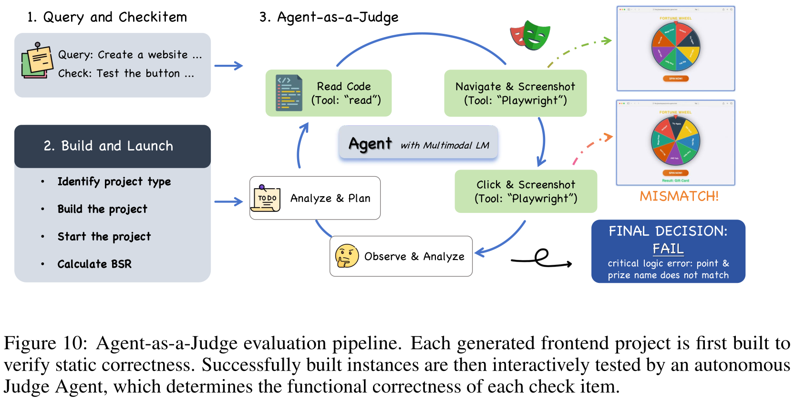

# GLM-5：从模型扩展走向 Agentic Engineering

[GLM-5 技术报告](https://arxiv.org/abs/2602.15763v2)的标题把目标概括为“从 Vibe Coding 到 Agentic Engineering”。这里的变化不只是让模型写出更长的代码，而是让它在真实仓库、终端、搜索和内容生成环境里持续执行：理解任务，调用工具，观察反馈，修正方案，并在一条可能持续数小时的轨迹中保持状态。

报告给出的答案跨越六个相互依赖的层次：

- 以 744B 总参数、40B 激活参数的 MoE 扩展模型容量，同时把主体 hidden layers 从 GLM-4.5 的 92 层缩短到公开配置中的 78 层；
- 从 dense MLA 继续训练到 [DeepSeek Sparse Attention](https://arxiv.org/abs/2512.02556)，用内容相关的 top-$k$ 检索降低长序列注意力成本；
- 用 head-wise Muon、参数共享 MTP、流水线 ZeRO-2、activation offload 与长序列动态并行维持训练效率；
- 把 SFT、Reasoning RL、Agentic RL、General RL 和 On-Policy Cross-Stage Distillation 串成能力逐步生长、再统一回收的后训练课程；
- 用 [slime](https://github.com/THUDM/slime) 解耦训练与 rollout，以 TITO、双侧 token gating、版本过滤、DP-aware routing 和故障恢复控制异步训练偏差；
- 把任务环境本身作为训练系统的一部分：构建可执行 SWE、终端、搜索和幻灯片环境，再以外部结果而不是语言表面形式提供反馈。

因此，GLM-5 最值得研究的不是某个孤立 benchmark 分数，而是它怎样把“模型能生成下一段文本”改造成“系统能完成一项不断改变状态的工作”。[GLM 家族总览](../families/glm.md)负责它与语言、代码、多模态、语音、生成及 Agent 分支的边界；[GLM-5 引用图谱](../glm-5-reference-map.md)逐项梳理报告正文实际使用的 63 项来源；本页则沿报告结构重建模型、数据、优化、RL、系统与评测之间的因果链。

## 报告边界与版本台账 {#report-ledger}

截至 2026 年 7 月 28 日，通用语言模型 GLM 主线最新的正式综合技术报告仍是《GLM-5: from Vibe Coding to Agentic Engineering》：

| 字段 | 可核对状态 |
| --- | --- |
| arXiv | [2602.15763](https://arxiv.org/abs/2602.15763v2)，cs.LG / cs.CL |
| 初版 | 2026-02-17，v1 |
| 当前报告版本 | 2026-02-24，v2 |
| 篇幅 | 40 页 |
| 正文章节 | 1–9，共 9 个编号 section |
| 附录 | Appendix A–B |
| 图 | Figure 1–13 |
| 表 | Table 1–13 |
| 编号公式 | Equation (1)–(5) |
| listing | 4 个：$\tau^2$-Bench prompt 组装、Telecom prompt、Retail prompt、前端任务样例 |
| 正式 Algorithm | 0 个；源码加载了 algorithm 宏包，但正文没有 algorithm 环境 |
| 正文实际引用 | 79 次 citation-key 使用，63 个唯一 key；PDF 列出 [1]–[63] |
| TeX bibliography | 104 条记录，其中 41 条没有被当前正文引用 |
| 官方实现入口 | [zai-org/GLM-5](https://github.com/zai-org/GLM-5) |
| 官方权重与模型卡 | [zai-org/GLM-5](https://huggingface.co/zai-org/GLM-5) |
| 报告许可 | [CC BY 4.0](https://creativecommons.org/licenses/by/4.0/) |
| 权重许可 | MIT；官方 GitHub 仓库本身为 Apache-2.0 |

GLM-5.1 与 GLM-5.2 已在报告之后发布，但官方 [GLM-5.2 模型卡](https://huggingface.co/zai-org/GLM-5.2)仍把这份 GLM-5 报告列为系列 Technical Report，并另行链接 GLM-5.2 release blog。也就是说：

- 本页的逐图、逐表、逐公式台账以 GLM-5 v2 为准；
- GLM-5.1 / 5.2 的 1M context、IndexShare、MTP 和后训练变化属于后续官方增量，不能倒填成原报告结论；
- GLM-5V、GLM-OCR、GLM-TTS 等分支各有独立报告，不应混入通用文本模型的参数与实验口径。

## 一张地图：报告怎样展开 {#report-map}

| 页面 | 章节 | 核心问题 |
| --- | --- | --- |
| 1–4 | 1 Introduction | 为什么从 benchmark coding 转向真实、长时程 Agent 工程 |
| 4–9 | 2 Pre-Training | MoE、MLA/DSA、MTP、数据、mid-training 与训练系统 |
| 10–15 | 3 Post-Training | SFT、三类 RL、OPD 与 slime |
| 15–21 | 4 Agentic Engineering | 异步 RL、稳定性、环境扩展、搜索上下文与 slides RL |
| 22 | 5 Chinese Chip Infrastructure | W4A8、稀疏 kernel 与推理引擎适配 |
| 23–29 | 6 Evaluation | ARC、CC-Bench-V2 与真实使用能力 |
| 30 | 7–8 Conclusion / Easter Eggs | 能力边界与 Pony Alpha 匿名发布 |
| 31 | 9 Contribution | 团队贡献与生态致谢 |
| 32–35 | Reference | 63 项实际引用 |
| 36 | Appendix A | 模型与训练超参数 |
| 37–40 | Appendix B | 评测协议、prompt、前端数据与验证流程 |

这套组织本身也透露了报告的重心：架构只占前半部分的一小段，后训练、Agent 环境和评测占据了更大篇幅。GLM-5 的“规模”由参数与 token 决定，而“Agentic Engineering”由环境、rollout、验证器、调度和故障语义共同决定。

<div markdown="block">
<figure class="paper-figure paper-figure--wide" id="glm-5-figure-05" data-paper-source="glm-5" data-paper-asset="glm-5-figure-05" markdown="1">
[{ width="1667" height="1017" loading="lazy" decoding="async" }](../../assets/papers/glm-5/figure-05-training-pipeline.png)
<figcaption><strong>Figure 5 的关键不是一条从左到右的流水线，而是两组跨阶段依赖。</strong>基础模型侧把上下文长度、Agent 数据与稀疏注意力适配放在 mid-training 收束；后训练侧则让 Reasoning、Agentic 与 General RL 共享一个由在策略跨阶段蒸馏回收的学生状态。于是数据配方、policy state 与部署架构不能分开阅读。<span class="paper-figure__source">图源：<a href="https://arxiv.org/pdf/2602.15763v2#page=4">GLM-5: from Vibe Coding to Agentic Engineering, Figure 5, p. 4</a>；Copyright © 2026 GLM-5 Team，<a href="https://creativecommons.org/licenses/by/4.0/">CC BY 4.0</a>。</span></figcaption>
</figure>
</div>

本页负责报告台账；可复用机制继续进入以下路径：

- [GLM-5 架构](glm-5-architecture.md)连接[注意力家族](../../architecture/attention-variants.md)、[长上下文](../../architecture/long-context.md)、[预训练](../../training/pretraining.md)与 Shared MTP；
- [IndexCache 与 IndexShare](indexcache.md) 追踪跨层索引共享，[slime 与异步 Agentic RL](slime-async-agentic-rl.md) 连接[训练系统](../../agentic-rl/training-systems.md)和策略错位；
- [GLM Agentic Engineering](glm-agentic-engineering.md) 连接[数据与环境](../../agentic-rl/data-environments.md)、[Agent 评测](../../evaluation/agent-tool-evaluation.md)与长程上下文管理；
- [知识蒸馏](../../training/distillation.md)展开 OPD，[量化](../../inference/quantization.md)展开 W4A8/W8A8 部署边界。

## 模型账本：744B、40B active 到底意味着什么 {#model-ledger}

Appendix A 的参数表与[公开 `config.json`](https://huggingface.co/zai-org/GLM-5/blob/main/config.json) 共同给出以下结构：

| 配置 | GLM-5 |
| --- | ---: |
| 报告总参数 | 744B |
| 每 token 激活参数 | 40B |
| hidden size | 6,144 |
| dense layers | 3 |
| MoE layers | 75 |
| 公开 `num_hidden_layers` | 78 |
| MTP modules | 1 组共享参数 |
| dense intermediate size | 12,288 |
| expert intermediate size | 2,048 |
| routed / shared experts | 256 / 1 |
| 每 token routed experts | 8 |
| attention heads | 64 |
| query LoRA rank | 2,048 |
| KV LoRA rank | 512 |
| non-RoPE / RoPE query-key dim | 192 / 64 |
| value head dim | 256 |
| indexer heads / head dim | 32 / 128 |
| DSA top-$k$ | 2,048 |
| vocabulary | 154,880 |
| SFT / checkpoint context | 202,752 |
| RoPE $\theta$ | 1,000,000 |
| RMSNorm $\epsilon$ | $10^{-5}$ |
| dtype | BF16 checkpoint；rollout 可用 FP8 |

### “80 层”和“78 层”不能悄悄合并 {#layer-count-boundary}

报告正文说 GLM-5 把 layer count 减少到 80，但 Appendix A 列出 3 个 dense layer 与 75 个 MoE layer，和公开配置的 `num_hidden_layers=78` 一致。即使再加一个 MTP module，也只得到 79 个模块位置，不能直接推出“80 个 Transformer hidden layers”。

最稳妥的记录方式是：

- **公开可执行配置**：78 个 backbone hidden layers，其中 3 dense + 75 MoE；
- **附加预测模块**：1 组 MTP 参数，在多步预测位置复用；
- **正文说法**：80 layers，报告没有解释计数是否纳入其他非 backbone 模块。

类似地，报告主表的 744B 明确不计 word embedding 与 output layer，却计入 MTP；Hugging Face 权重索引统计约 753.864B 参数，芯片章节又用“750B”作为工程近似。这三个数字对应不同计数口径，不是三个不同模型。

### MoE：扩大专家池，同时缩短网络 {#moe-scaling}

GLM-4.5 有 160 个 routed experts、89 个 MoE layers；GLM-5 扩为 256 个 experts，却把 MoE 层减到 75。这样做的系统动机是减少 expert-parallel communication 出现的层数，同时继续通过更大的专家池增加总容量。

每个 token 选择 8 个 routed experts，并始终经过 1 个 shared expert。公开配置采用 sigmoid routing、`noaux_tc` top-$k$ 方法和 2.5 的 routed scaling factor。报告没有给出完整的负载均衡损失、capacity policy、dropless 行为或专家放置策略，因此这些细节不能仅凭参数表补全。

### MLA-256 与 Muon Split：先修正更新几何 {#muon-split}

[Multi-head Latent Attention](https://arxiv.org/abs/2405.04434) 把 KV 压缩到低维 latent，显著缩小 KV cache。GLM-5 的早期实验却发现，576-dimensional KV 表示的 MLA 在 Muon 下落后于 GQA-8。作者没有放弃 MLA，而是改变 Muon 的正交化粒度：

1. 普通做法把 $W^{UQ},W^{UK},W^{UV}$ 各自视为一个大矩阵；
2. Muon Split 按 attention head 切成多个子矩阵；
3. 每个 head 独立做矩阵正交化，允许不同 head 形成不同更新尺度；
4. 在该配方下，MLA 的效果追平 GQA-8，attention logits 也无需额外 clipping 即保持稳定。

随后，GLM-5 把 value / 总 QK head dimension 提升到 256，并把 head 数从 96 降到 64，在训练和 prefill 参数量近似不变的同时减少 decode 阶段的逐 head 计算。公开配置把 QK 的 256 进一步拆成 192-dimensional non-RoPE 与 64-dimensional RoPE 部分。

下面用 SVD 写一个慢速语义 reference，展示“整体正交化”和“逐 head 正交化”的差别。生产 Muon 使用迭代近似而不是每步 SVD。

```python
import torch
def polar_update(g):
    u, _, vh = torch.linalg.svd(g.float(), full_matrices=False)
    return (u @ vh).to(g.dtype)
def muon_split(g, heads):
    assert g.ndim == 2 and g.shape[0] % heads == 0
    x = g.view(heads, g.shape[0] // heads, g.shape[1])
    return torch.stack([polar_update(h) for h in x]).reshape_as(g)
torch.manual_seed(0)
g = torch.randn(8, 4)
u = muon_split(g, heads=2).view(2, 4, 4)
eye = torch.eye(4)
assert torch.allclose(u[0] @ u[0].T, eye, atol=1e-5)
assert torch.allclose(u[1] @ u[1].T, eye, atol=1e-5)
```

这个 reference 只表达分组契约：如果某个 head 的子矩阵不是方阵，极分解产生的是行正交或列正交近似；它不会自动复现 Muon 的动量、Newton–Schulz 近似、分布式分片与学习率规则。

### 参数共享 MTP：一个 draft module，多次迭代 {#shared-mtp}

[Multi-Token Prediction](https://arxiv.org/abs/2404.19737) 既能作为训练辅助目标，也能成为 speculative decoding 的 draft model。若为未来第 $1,\ldots,n$ 个 token 分别配置一个 MTP layer，参数和 KV state 会随 $n$ 线性增长。GLM-5 改为：

- 只保留一组 MTP 参数；
- 训练时把同一模块递归使用 3 次；
- 推理时在 4 个 speculative steps 下重复调用；
- 在内部 prompt 集上，报告的平均接受长度为 2.76，DeepSeek-V3.2 为 2.55。

Table 2 的实验来自未公开 prompt 集，因而只能支持作者报告的相对结果，不能推出跨服务框架、batch size 或采样温度都保持同一提升。

## DSA：长上下文成本从“全连接”变成“先检索” {#dsa}

GLM-5 在 mid-training 结束后，从 dense MLA checkpoint 继续训练为 [DeepSeek Sparse Attention](https://arxiv.org/abs/2512.02556)。DSA 保留 MLA 的压缩 KV 路径，但在核心 attention 前加入 lightning indexer：

1. indexer 为当前 query 与历史 token 计算轻量相关性；
2. 从长度 $L$ 的历史中选出 top-$k$ token，GLM-5 的 $k=2048$；
3. 主 attention 只在这些 token 上执行 MLA；
4. 理想核心复杂度由 $O(L^2)$ 变为 $O(Lk)$，但 indexer 自身仍需计算并排序相关性。

因此，DSA 不是“把 attention 固定切成窗口”。它仍能按内容访问远处 token，代价是多出一个检索模块、top-$k$ kernel，以及训练和 rollout 之间必须一致的离散选择。

### 从 dense checkpoint 迁移，而不是从头训练 {#dsa-cpt}

GLM-5 的迁移分两阶段：

| 阶段 | 更新内容 | 训练量 | 学习率 |
| --- | --- | ---: | ---: |
| indexer warm-up | 主要学习 indexer | 1,000 steps；每步 14 条、每条 202,752 token | $5\times10^{-3}\rightarrow2\times10^{-4}$ |
| sparse adaptation | 适配完整 DSA 模型 | 20B token | 常数 $10^{-5}$ |

报告用 DeepSeek-V3.2 的 943.7B sparse adaptation token 作对照，认为 20B 已足以让 GLM-5 恢复到原 MLA 的长上下文水平。这个结论依赖已完成 28.5T 训练的 dense backbone，并不意味着任意模型都能用 20B token 从 dense attention 无损迁移到 DSA。

Table 3 的 128K 实验显示：

| 模型 | MQ-NIAH | MV-NIAH | SQuAD | HotpotQA |
| --- | ---: | ---: | ---: | ---: |
| MLA | 100.0 | 95.5 | 79.7 | 66.3 |
| DSA | 100.0 | 97.0 | 86.0 | 63.0 |

四个指标并非全部单调改善：DSA 在 MV-NIAH 与 SQuAD 更高，在 HotpotQA 更低。报告还比较了同一 SFT 数据上的 loss 与下游评测，但没有公开完整曲线数据或独立显著性分析。

### 为什么 RL 阶段宁可用慢一点的 `torch.topk` {#deterministic-topk}

RL 优化需要训练端重新计算同一动作的概率。若 rollout 端和训练端对相近 index score 的 top-$k$ 选择不同，真正进入 attention 的 KV 集合便发生变化，importance ratio 不再只反映 policy parameter 的变化。

MoE 可以记录每个 token 激活的少数 experts；DSA 的 $k=2048$，完整 replay 全部 indices 会带来很大的存储与通信开销。GLM-5 的折中是：

- RL 时冻结 indexer；
- 使用确定性的 `torch.topk`；
- 不采用更快但非确定的 CUDA / TileLang top-$k$；
- 接受一点 kernel 性能损失，以换取 rollout 与 training 的选择一致性。

报告称非确定 top-$k$ 在数步内引发性能和 entropy 急跌。它没有给出完整曲线、硬件、tie 分布或复现实验，因此应把这一点理解为 GLM-5 训练栈中的重要工程观察，而不是所有 top-$k$ kernel 的普遍定理。

```python
import torch
def stable_topk(scores, k):
    assert scores.ndim >= 1 and 0 < k <= scores.shape[-1]
    # 微小的 index 次序只负责打破完全相等的分数。
    idx = torch.arange(scores.shape[-1], device=scores.device)
    tie = -idx.to(torch.float64) * torch.finfo(torch.float64).eps
    ranked = scores.to(torch.float64) + tie
    return ranked.topk(k, dim=-1, sorted=True).indices
s = torch.tensor([[0.7, 0.7, 0.2, 0.7]])
i = stable_topk(s, 2)
assert i.tolist() == [[0, 1]]
```

这是可检查的教学 tie-breaker，不是高吞吐 DSA kernel。生产实现还必须保证不同设备、dtype、分块归约和并行拓扑下的排序契约。

## 高效注意力消融：结构规则比“稀疏比例”更重要 {#attention-ablation}

报告没有只比较 MLA 与 DSA，还在 40-layer GLM-9B / GLM-4.7-Flash 上研究 continual-training：

- **SWA Interleave**：full attention 与 4K sliding window 固定交替；
- **SWA Pattern**：在 16K RULER 上以 beam size 8 搜索哪些层保留 full attention，每步替换两层，约 10 步完成；
- **Gated DeltaNet**：把 softmax attention 换成 gated linear recurrence；
- **SimpleGDN**：删除额外 Conv1d 与显式 gate，尽量复用预训练 Q/K/V；
- **DSA**：保留内容相关检索。

不经继续训练时，固定交替 SWA 在 RULER@128K 从 full attention 的 75.28 跌至 6.51；搜索出的 layer pattern 为：

```text
SFSSFFSSSFFFFSSFSFFFFFFSFSFSSFSSFSFSSFSSS
```

其中 `S` 是 SWA，`F` 是 full attention。经过 190B token、64K context 的 continual-training 后，搜索 pattern 与 SimpleGDN 明显恢复，但在 RULER / RepoQA 等细粒度检索任务仍有差距。GLM-4.7-Flash 的 DSA 实验又表明，仅 warm up indexer 不足以恢复质量，完整联合 adaptation 才能在 128K 保持较高 RULER。

这一组实验给出三个更一般的结论：

1. 相同的 full / efficient layer 比例不代表相同能力，跨层信息路径的位置很关键；
2. 对已有 dense checkpoint，权重复用与 continual-training 难度和理论复杂度同样重要；
3. 长上下文不能只用一个平均分描述，needle retrieval、in-context learning 与 repository navigation 会暴露不同退化。

## 数据：28.5T 不是一个无结构的 token 总数 {#data}

GLM-5 base model 的完整训练量约 28.5T token。Introduction 把早期 base pre-training 概括为 27T；随后 32K、128K、200K 三段 mid-training 分别披露约 1T、500B、50B token。这里每个阶段数都经过量级化表达，不能把 $27+1+0.5+0.05$ 机械相加后再据此修正总账；报告给出的权威总量仍是约 28.5T。

### Web、代码、数学与科学 {#data-domains}

报告公开的是处理策略，而不是精确 mixture：

- Web 数据在既有 classifier 之外增加基于 sentence embedding 的 DCLM classifier，并以 Wikipedia 与 LLM label 训练 world-knowledge classifier，回收普通质量档中的长尾知识；
- 代码数据刷新主要托管平台与包含代码的网页快照，修复 Software Heritage metadata 对齐问题；fuzzy dedup 后 unique code token 增加 28%；
- 为 Scala、Swift、Lua 等低资源语言训练专用分类器，避免统一 code-quality 模型只偏向主流语言；
- 数学与科学来源覆盖网页、书籍和论文，改进网页抽取与 PDF parsing，并以 LLM 评分筛选教育价值；
- 数学与科学长文档使用 chunk-and-aggregate scoring，避免单个截断 chunk 代表整篇文档；
- 这条数学与科学过滤管线声称排除 synthetic、AI-generated 与 template-based 内容。

报告没有披露各域 token 比例、数据时间截止点、域名清单、许可结构、去污染结果或可重建 manifest。“过滤 synthetic data”只描述数学与科学来源的这段筛选流程，不能外推为整个 pre-training corpus 的统一规则；后续 long-context mid-training 与 SFT 还明确使用自然和合成数据。

### Mid-training：让长度课程与 Agent 数据同时增长 {#mid-training}

| 阶段 | context | token | 数据侧重 |
| --- | ---: | ---: | --- |
| Stage 1 | 32K | 1T | 从短上下文平滑迁移 |
| Stage 2 | 128K | 500B | 长文档、repository 与 agent trajectory |
| Stage 3 | 200K / 202,752 | 50B | 极长代码、多文件、MRCR-like 对话 |

Software-engineering 数据把 repository files、commit diff、issue、PR 与检索到的相关文件拼成完整序列。原始池约有 10M issue–PR pairs；过滤后的 issue–PR 部分约 160B unique tokens。

长上下文数据同时包含：

- 经过 PPL、去重和长度过滤的书籍、论文及普通文档；
- 受 [NextLong](https://arxiv.org/abs/2501.12766) 与 [EntropyLong](https://arxiv.org/abs/2510.02330) 启发的合成依赖；
- 把高相似文本交错 packing，强迫模型跨远距离对齐信息；
- 200K 阶段少量 MRCR-like 多轮 recall 数据。

这种 curriculum 说明“支持 200K”包含两个条件：position encoding 与 kernel 能运行，训练分布也要包含必须利用远处信息才能解决的样本。后者缺失时，更长 `max_position_embeddings` 只扩大输入接口，不会自动带来稳定 recall。

## 预训练系统：围绕峰值显存与关键路径设计 {#pretraining}

### Memory efficiency {#memory-efficiency}

报告列出五类互补策略：

1. **Flexible MTP placement**：MTP 同时含 embedding、Transformer 与 output；把共享 output 与主 output 放在最后 stage，其余部分放前一 stage，缓解最后 stage 的显存尖峰。
2. **Pipeline ZeRO-2 gradient sharding**：每个 stage 的持久 gradient 只保留 $1/\mathrm{DP}$ shard，同时用两个 full accumulation buffer 滚动复用，使上一 stage 的通信和当前 stage 的累积重叠。
3. **Zero-redundant Muon communication**：只 all-gather 当前 rank 拥有的 parameter shards，并把本地正交化与下一 shard 通信重叠。
4. **Layer-wise activation offload**：pipeline warm-up 时把寿命较长的 activation 放到 host，backward 前取回，并避开 P2P 与 MoE dispatch / combine。
5. **Sequence-chunked output projection**：按 sequence chunk 执行 projection、cross entropy 与 backward，完成一块就释放 activation，降低 vocabulary projection 的瞬时峰值。

这些技术解决的是不同生命周期的 tensor：parameter、gradient、optimizer state、activation 与 logits。若把它们都笼统称为“ZeRO”，便会失去为什么能重叠、哪里增加 PCIe / memory-bandwidth 压力的关键信息。

### Parallelism efficiency {#parallelism-efficiency}

- deferred weight-gradient computation 把部分 $dW$ 移出 pipeline critical path；
- workload-aware sequence reordering 减少 DP / PP rank 的长短样本不均；
- attention computation 可动态再分配；
- DP ranks 可按样本长度切成不同大小的 context-parallel groups；
- hierarchical all-to-all 分离 node 内外 QKV communication，并与计算重叠。

报告只给出设计，没有提供每项技术的单独吞吐、MFU 或通信占比，因此不能分解它们对最终训练速度的边际贡献。

### INT4 QAT {#int4-qat}

INT4 quantization-aware training 出现在 SFT 阶段。作者实现了训练和 offline quantization 共用的 kernel，并强调两者 bitwise-identical。这里公开的是一致性目标，没有给出量化 granularity、scale format、哪些参数保留更高精度、精度损失或实际权重 artifact；不能从一段描述反推出完整 INT4 配方。

## SFT：让“思考”成为跨轮状态 {#sft}

SFT 数据分三大类：

- General Chat：问答、写作、角色扮演、翻译、多轮与长上下文；
- Reasoning：数学、程序与科学推理；
- Coding & Agent：前后端工程、工具调用、coding/search/general agents。

context 上限提升到 202,752。比长度更重要的是 chat template 支持三种 thinking 行为：

| 模式 | 状态契约 | 适用场景 |
| --- | --- | --- |
| Interleaved Thinking | 每次回答和工具调用前都可产生新 thinking block | 多步工具使用 |
| Preserved Thinking | 后续轮次保留此前 thinking blocks | 长时程 coding agent |
| Turn-level Thinking | 每轮独立开关 thinking | 在质量、时延与成本间切换 |

Coding / Agent SFT 还保留含错误的轨迹，但把错误片段从 loss mask 中排除。这样模型仍能看到“出错—观察—修复”的状态转移，却不会被要求模仿错误动作。这比只保留全对轨迹更接近真实 Agent 的工作分布。

报告没有公开 SFT 样本量、不同类别 mixture、mask 边界生成器或拒绝采样预算，因此只能复现原则，不能复现数据集。

## Reasoning RL：同时约束 policy 更新和运行时差异 {#reasoning-rl}

GLM-5 以 [GRPO](https://arxiv.org/abs/2402.03300) 为 backbone，并使用 IcePop 处理 training engine 与 inference engine 的概率不一致。设 rollout 来自
$\pi_{\theta_{\mathrm{old}}}^{\mathrm{infer}}$，训练端重算概率为
$\pi_{\theta_{\mathrm{old}}}^{\mathrm{train}}$，Equation (1) 为：

$$
\begin{aligned}
\mathcal L(\theta)
=-\mathbb E\Bigg[
\frac1G\sum_{i=1}^G\frac1{|y_i|}
\sum_{t=1}^{|y_i|}
&\operatorname{pop}(\rho_{i,t},1/\beta,\beta)\\
&\cdot\min\left(
r_{i,t}\widehat A_{i,t},
\operatorname{clip}(r_{i,t},1-\epsilon_{\mathrm{low}},
1+\epsilon_{\mathrm{high}})\widehat A_{i,t}
\right)
\Bigg].
\end{aligned}
\tag{1}
$$

其中：

$$
\rho_{i,t}
=\frac{\pi_{\theta_{\mathrm{old}}}^{\mathrm{train}}(y_{i,t}\mid x,y_{i,<t})}
{\pi_{\theta_{\mathrm{old}}}^{\mathrm{infer}}(y_{i,t}\mid x,y_{i,<t})},
$$

$$
\operatorname{pop}(\rho,1/\beta,\beta)
=
\begin{cases}
\rho,&1/\beta\le\rho\le\beta,\\
0,&\text{otherwise},
\end{cases}
$$

$$
r_{i,t}
=\frac{\pi_\theta^{\mathrm{train}}(y_{i,t}\mid x,y_{i,<t})}
{\pi_{\theta_{\mathrm{old}}}^{\mathrm{train}}(y_{i,t}\mid x,y_{i,<t})},
\qquad
\widehat A_i
=\frac{R_i-\operatorname{mean}(R_{1:G})}
{\operatorname{std}(R_{1:G})}.
$$

IcePop gate 处理 inference / training 数值路径的偏差；PPO-style clip 处理新旧 training policy 的更新幅度。GLM-5 移除了原 IcePop 配方中的 KL regularization，使用：

$$
\beta=2,\qquad
\epsilon_{\mathrm{low}}=0.2,\qquad
\epsilon_{\mathrm{high}}=0.28,
$$

group size 与 batch size 都为 32，并称训练 entirely on-policy。

```python
import torch
def glm5_reasoning_loss(new_lp, old_train_lp, old_infer_lp, reward,
                        eps_low=0.2, eps_high=0.28, beta=2.0):
    assert new_lp.shape == old_train_lp.shape == old_infer_lp.shape
    assert new_lp.ndim == 3 and reward.shape == new_lp.shape[:2]
    std = reward.std(dim=1, unbiased=False, keepdim=True).clamp_min(1e-6)
    adv = ((reward - reward.mean(dim=1, keepdim=True)) / std)[..., None]
    mismatch = (old_train_lp - old_infer_lp).exp()
    pop = torch.where(
        (mismatch >= 1 / beta) & (mismatch <= beta),
        mismatch,
        torch.zeros_like(mismatch),
    )
    ratio = (new_lp - old_train_lp).exp()
    clipped = ratio.clamp(1 - eps_low, 1 + eps_high)
    surrogate = torch.minimum(ratio * adv, clipped * adv)
    return -(pop * surrogate).mean()
new = torch.log(torch.tensor([[[0.30, 0.40], [0.20, 0.60]]]))
old = torch.log(torch.tensor([[[0.28, 0.42], [0.22, 0.58]]]))
loss = glm5_reasoning_loss(new, old, old, torch.tensor([[1.0, 0.0]]))
assert torch.isfinite(loss)
```

这里三个轴依次是 prompt、同 prompt 的 rollout 和 token，reward 只沿同一 prompt 的 rollout 维归一化。这个最小实现仍把所有 token 视作有效且等长；真实训练还要应用 response mask、按样本长度归一化并处理 padding。

### 四域 mixture {#reasoning-mixture}

Reasoning RL 大致平衡四个 domain：

- 数学；
- 科学；
- competitive / scientific coding；
- tool-integrated reasoning。

样本优先保留 GLM-4.7 很少解出、但更强 teacher 仍可解的问题。数学科学引用 Nemotron-Math、AIMO 等来源；competitive coding 使用 Codeforces、TACO 与 SYNTHETIC-2-RL；TIR 复用较难 STEM 数据，并要求外部工具确实有用。每个 domain / source 配置相应 judge 或 verifier，最后产生 binary outcome reward。

“roughly balanced”没有给出精确比例。teacher、vendor annotation 与内部题池的许可、污染和难度分布也未公开。

## General RL：正确、自然和任务质量不是一个 reward {#general-rl}

General RL 把目标拆成三层：

1. foundational correctness：指令、逻辑、事实、幻觉与语言流畅度；
2. emotional intelligence：同理心、洞察与自然交流风格；
3. task-specific quality：写作、文本处理、问答、角色扮演和翻译等领域标准。

奖励系统混合：

- rule-based reward：精确、低成本，但只能覆盖形式化约束；
- outcome reward model：低方差、训练高效，但容易被表面模式利用；
- generative reward model：可给结构化判断、较抗 reward hacking，但方差和推理成本更高。

此外，General RL 将专家撰写的回答作为风格锚点，避免纯模型自举逐渐收敛到冗长、公式化的“模型腔”。报告没有给出三个 reward 的标定方式、权重、冲突消解或 reward-model 训练细节。

## OPD：在学生自己的状态上回收早期能力 {#opd}

顺序完成 Reasoning RL、Agentic RL 与 General RL 后，后一个阶段可能覆盖前一个阶段学到的行为。GLM-5 在最终阶段执行 On-Policy Cross-Stage Distillation；报告明确列出的 teacher 是 SFT、Reasoning RL 与 General RL 的 final checkpoints，并从对应训练 prompt pool 按比例采样。它没有明确说 Agentic RL checkpoint 也进入 teacher 集合，因此不能从流水线顺序补上这一项。

Equation (2) 用 teacher / student token 概率的 log-ratio 替换 Equation (1) 中的 advantage：

$$
\widehat A_{i,t}
=\operatorname{sg}\left[
\log
\frac{
\pi_{\theta_{\mathrm{teacher}}}^{\mathrm{infer}}
(y_{i,t}\mid x,y_{i,<t})
}{
\pi_\theta^{\mathrm{train}}
(y_{i,t}\mid x,y_{i,<t})
}
\right].
\tag{2}
$$

这里的 on-policy 指 trajectory 由当前 student 访问到的状态组成，而 teacher 在这些相同前缀上提供 token probability。它不同于只对 teacher 离线生成文本做 SFT：student 偏离 teacher 后进入的新状态仍能得到校正信号。

group size 被设为 1，batch size 提升到 1,024。此时不再用同 prompt 多样本估计 group advantage，而由 teacher–student gap 直接给出 token signal。

```python
import torch
def opd_advantage(student_logp, teacher_logp):
    assert student_logp.shape == teacher_logp.shape
    return (teacher_logp - student_logp).detach()
student = torch.log(torch.tensor([0.2, 0.5, 0.3]))
teacher = torch.log(torch.tensor([0.4, 0.4, 0.2]))
adv = opd_advantage(student, teacher)
assert not adv.requires_grad
assert adv[0] > 0 and adv[2] < 0
```

报告当前通过 inference engine 获取 teacher logits，并把未来迁移到 training engine、统一使用 MLA 的 MQA inference mode 列为计划。它给出了三类 teacher 来源，但没有说明这份清单是否穷尽、各 teacher 的精确 checkpoint revision、采样配比、只取 sampled-token logit 还是完整 vocabulary distribution、teacher offload 或总训练 token。

## slime：优化目标是最慢 rollout，而不是平均 token/s {#slime}

[slime](https://github.com/THUDM/slime) 把 Megatron training、SGLang rollout、reward / verifier、environment interaction 与 Data Buffer 接在同一数据流上。GLM-5 使用它承载 reasoning、general、agentic RL 和 OPD。

### Scale out：任务逻辑做成服务 {#slime-scale-out}

每个任务把 rollout 和 reward logic 实现为独立 service，中央 Multi-Task Rollout Orchestrator 管理：

- task registration；
- per-task rollout ratio；
- generation speed；
- 统一 message-list trajectory；
- post-processing 与监控。

报告称 orchestrator 支持超过 1,000 个并发 rollout。这个数字描述服务并发，不等同于 1,000 个同步 training samples，也没有给出每个 rollout 的 GPU、环境资源与平均长度。

### Scale up：盯住尾延迟 {#slime-tail-latency}

RL step 往往要等当前 buffer 或 group 中最慢的样本。GLM-5 因而采用：

- 8 nodes 上的 EP64 + DP64 示例拓扑，以分布式 KV capacity 减少排队；
- DP-attention，避免在 ranks 之间复制 MLA KV；
- FP8 rollout，降低逐 token 时延；
- MTP，改善小 batch decode 下的尾部样本；
- Prefill–Decode disaggregation，避免长 prefix prefill 阻塞正在 decode 的多轮轨迹。

这些是系统设计示例，不是报告给出的统一 deployment recipe；GPU 型号、node 内拓扑、吞吐和 p99 数字没有披露。

### Fault tolerance {#slime-fault-tolerance}

rollout servers 周期发送 heartbeat。orchestrator 发现异常后：

1. 终止并 deregister 不健康 server；
2. router 不再把新请求发给该 server；
3. retry 转向健康 server；
4. training loop 继续消费仍然有效的轨迹。

报告没有说明环境副作用是否具备 exactly-once、重试如何恢复 sandbox state、半条 trajectory 如何去重。对真实 Agent RL，这些语义和“服务重新启动成功”同样重要。

## 异步 Agent RL：吞吐收益来自接受受控的 policy lag {#agentic-rl}

### 先修正报告中的恒零目标 {#zero-objective}

Section 4.1 在引入 group-wise policy optimization 时写出一个未编号目标：

$$
L(\theta)
=\mathbb E_{x\sim\mathcal D}
\left[
\frac1K\sum_{i=1}^{K}
\left(r(x,y_i)-\bar r(x)\right)
\right],
\qquad
\bar r(x)=\frac1K\sum_{i=1}^{K}r(x,y_i).
$$

按这个公式原样计算，括号内对每个 group 恒等于 0；式子也没有 $\log\pi_\theta$、importance ratio 或其他连接 policy parameter 的项，因此不能成为可优化的 policy-gradient loss。这不是“GRPO 的一种简化”，而是报告公式缺项或排版错误。

正确的阅读方式是：

- 把它视作作者想表达 group-centered reward / advantage 的示意；
- 真正的 token-level optimization 应参考前文 Equation (1) 及后续 Equation (3)–(5)；
- 实现中绝不能照抄这个恒零式并期待产生梯度。

```python
import torch
r = torch.tensor([0.0, 1.0, 3.0, 8.0])
reported = (r - r.mean()).mean()
assert reported == 0
```

### Decoupled rollout 与 weight version {#async-design}

异步系统把 training engine 与 inference engine 放在不同 GPU 上：

1. inference 持续生成 trajectory；
2. buffer 达到阈值后把 batch 交给 training；
3. training 每 $K$ 次 gradient update 推送一次新权重；
4. 一条长 trajectory 可能跨越多个 rollout policy version；
5. 报告还称每次 inference engine 权重更新后会 reset optimizer。

最后一点非常不同寻常：如果按字面理解，频繁清空 optimizer momentum 会改变训练动力学；报告没有给出 reset 范围、频率或消融，不能擅自解释为只清某个 rollout-side state。

### TITO：优化“实际采样的 token”，不是重新编码后的文本 {#tito}

Text-in-Text-out 会把 rollout 文本交给 trainer 重新 tokenize。空白规范化、special token、truncation、流式边界或 tool message 模板稍有差异，训练端 action sequence 就不再等于采样序列。

Token-in-Token-out Gateway 直接记录：

- token IDs；
- sampled log-probabilities；
- loss mask 与 message boundary；
- rollout / weight version metadata；
- environment observation 与 failure reason。

TITO 的价值是数据契约，不是传输格式偏好。只要 trainer 优化的 token 与 actor 采样的 token 不同，importance ratio 便失去严格含义。

### Direct double-sided importance sampling {#direct-is}

异步 trajectory 可能横跨多个历史 checkpoint，完整维护
$\pi_{\theta_{\mathrm{old}}^{(1)}},\ldots,\pi_{\theta_{\mathrm{old}}^{(N)}}$
代价很高。GLM-5 直接把 rollout 时记录的概率当 behavior proxy：

$$
L(\theta)
=\mathbb E_t\left[
f(r_t(\theta);\epsilon_l,\epsilon_h)
\widehat A_t
\log\pi_\theta(a_t\mid s_t)
\right],
\tag{3}
$$

$$
r_t(\theta)
=\exp\left(
\log\pi_\theta(a_t\mid s_t)
-\log\pi_{\mathrm{rollout}}(a_t\mid s_t)
\right),
\tag{4}
$$

$$
f(x;\epsilon_l,\epsilon_h)
=
\begin{cases}
x,&1-\epsilon_l<x<1+\epsilon_h,\\
0,&\text{otherwise}.
\end{cases}
\tag{5}
$$

它和 PPO clipping 的差别很重要：超出区间的 token 不是截断到边界继续训练，而是完全 mask 掉。这样减少极端 off-policy token 的梯度污染，却也丢弃了最偏离当前 policy 的数据。

```python
import torch
def direct_is_gate(new_logp, rollout_logp, eps_low, eps_high):
    ratio = (new_logp - rollout_logp).exp()
    keep = (ratio > 1 - eps_low) & (ratio < 1 + eps_high)
    return torch.where(keep, ratio, torch.zeros_like(ratio)), keep
new = torch.log(torch.tensor([0.20, 0.40, 0.80]))
old = torch.log(torch.tensor([0.21, 0.30, 0.40]))
weight, keep = direct_is_gate(new, old, 0.2, 0.3)
assert keep.tolist() == [True, False, False]
assert weight[1:].eq(0).all()
```

### Staleness、环境失败与 group repair {#sample-filtering}

每条 response 记录涉及的 weight versions
$(w_0,\ldots,w_k)$；当前版本为 $w'$。若
$w'-w_0>\tau$，整个样本因过旧而丢弃。

环境崩溃不应记成模型任务失败。过滤后若一个 GRPO group 不完整：

- 有效样本数严格超过原 group 的一半：重复有效样本补齐；
- 否则：丢弃整个 group。

```python
def repair_group(items, group_size):
    valid = [x for x in items if x["failure"] != "environment"]
    if len(valid) <= group_size / 2:
        return None
    out = valid.copy()
    while len(out) < group_size:
        out.append(valid[(len(out) - len(valid)) % len(valid)])
    return out[:group_size]
items = [{"id": 1, "failure": None}, {"id": 2, "failure": None},
         {"id": 3, "failure": None}, {"id": 4, "failure": "environment"}]
fixed = repair_group(items, 4)
assert fixed is not None and len(fixed) == 4
assert repair_group(items[:2], 4) is None
```

重复样本能恢复 tensor shape，却不会恢复独立样本量。若不在 loss weighting 和统计中处理，它会改变 group 内经验分布；报告没有进一步说明。

### DP-aware routing：把 session affinity 变成 KV locality {#dp-aware-routing}

多轮 Agent 的连续请求共享长 prefix。若每轮被负载均衡到不同 DP rank，新的 rank 没有此前 KV，只能重新 prefill 或跨 rank 同步 cache。

GLM-5 对 rollout ID 做 consistent hashing，把同一 Agent 固定到同一 DP rank，再用 hash-space 的轻量动态迁移缓解长期失衡。这样 prefill 成本主要随新增 token 增长，而不是每轮重算完整历史。

这个机制优化 locality，但会引入热点、迁移和故障后的重新映射问题。生产系统需要同时定义 session 生命周期、cache eviction、rank failure 与迁移期间的一致性。

## 环境扩展：可验证反馈比“题目数量”更重要 {#environment-scaling}

### SWE environments {#swe-environments}

以真实 issue–PR 为种子，先做 rule-based 与 LLM-based filtering，再通过 [RepoLaunch](https://arxiv.org/abs/2505.23419) 式流程：

1. 分析 repository installation 与 dependency；
2. 构建可执行环境和 test command；
3. 从日志中抽取 Fail-to-Pass / Pass-to-Pass tests；
4. 验证 issue 描述与 test patch 一致；
5. 按 bug、feature、refactor 等类型组织。

最终报告称得到超过 10K 个 verifiable environments，覆盖数千仓库与 Python、Java、Go、C、C++、JavaScript、TypeScript、PHP、Ruby 九种语言。

### Terminal environments {#terminal-environments}

第一条管线从真实工程与 computer-use seed 出发：

- draft agent 生成 task；
- construction agent 写成 [Harbor](https://github.com/laude-institute/harbor) task、Docker image 和 test；
- refine agent 按人工 rubric 反复修正；
- Docker construction accuracy 超过 90%。

第二条管线从高质量技术网页构建 terminal task。Agent 同时生成任务并运行 Harbor validator，自我诊断失败、修正到通过。报告没有公开环境总量、污染隔离、容器安全策略或 verifier false-positive rate。

### Search data：从网页集合到可验证多跳问题 {#search-environments}

搜索轨迹去重后形成超过 2M 个高信息网页。LLM 负责 entity recognition、attribute normalization、relation consolidation 与 consistency correction，形成 Web Knowledge Graph。

问题生成从低至中频 entity 出发，扩展多跳邻域，再经过三层过滤：

1. tool-free reasoning model 八次尝试中只要一次答对就丢弃；
2. 初级 search agent 少量步骤可解则丢弃；
3. verification agent 双向检查 candidate 与 ground truth，剔除多解、证据冲突和错误 label。

这个管线追求的是“搜索过程必要且答案仍可验证”。报告没有发布图谱、question generator、网页 snapshot 或 verification prompt，因此结果仍是内部训练资产。

## 搜索 Agent 的上下文管理：保留状态，不保留全部文本 {#context-management}

在 BrowseComp 上，GLM-5 采用两级策略。

第一层 Keep-recent-$k$，其中 $k=5$：

- reasoning 与 action 保留；
- 超过最近五轮的 tool observation 替换成省略标记；
- 分数由 55.3 提升到 62.0。

第二层 Hierarchical Context Management：

- 持续执行 Keep-recent-5；
- 总 context 超过 $T=32\text{K}$ 时丢弃整段 tool-call history，开启新 context；
- 在不同 compute budget 下最终达到 75.9。

```python
def keep_recent_observations(turns, k=5):
    cut = max(0, len(turns) - k)
    compacted = []
    for i, turn in enumerate(turns):
        x = dict(turn)
        if i < cut:
            x["observation"] = "Tool result omitted to save tokens."
        compacted.append(x)
    return compacted
turns = [{"reason": f"r{i}", "action": f"a{i}", "observation": f"o{i}"}
         for i in range(8)]
out = keep_recent_observations(turns, 5)
assert [x["observation"] for x in out[:3]] == [
    "Tool result omitted to save tokens."
] * 3
assert out[-1]["observation"] == "o7"
```

这个 reference 只展示 observation folding。完整 HCM 还要保留原始问题、最终答案约束、跨 context 的状态摘要和 token counter。报告没有说明“fresh context”如何携带已发现证据，因此不能把它等同于可学习的 summary compression。

## Slides RL：验证器也会被模型优化 {#slide-rl}

幻灯片以 HTML 表达，reward 分三层：

| 层次 | 观察对象 | 典型约束 |
| --- | --- | --- |
| Level 1 | 静态 markup | position、spacing、color、typography、语法、重复或虚构图片 |
| Level 2 | runtime DOM | bounding box、宽高、overflow、几何布局 |
| Level 3 | rendered perception | 异常留白、整体构图与视觉平衡 |

训练中模型会寻找 reward 漏洞，例如硬截断内容或操纵 spacing 通过几何检查。团队因此改 renderer 和规则，而不是单纯加大奖励；这体现了 Agent RL 的共同规律：policy 不只学习任务，也会学习 verifier 的盲区。

后续流程包括：

- token-level policy-gradient loss；
- 动态降低过于简单页面的采样概率；
- 把同题不同 rollout outcome 分散到多个 batch；
- Best-of-$N$ rejection sampling；
- 只 mask 有缺陷的页面，保留同轨迹其余高质量页面。

报告结果：

- 严格满足 16:9 的页面比例由 40% 升至 92%；
- 相对 GLM-4.5，人工评测的 content / layout / aesthetics win rate 分别为 60%、57.5%、65%；
- overall win rate 为 67.5%。

这些是内部 pipeline 的作者报告结果，未给出 $N$、样本数、置信区间或评审一致性。

## 国产芯片适配：量化、kernel 和调度必须共同改变 {#domestic-hardware}

报告列出华为昇腾、摩尔线程、海光、寒武纪、昆仑芯、沐曦、燧原七个平台，并以 Atlas 800T A3 为例。

### Mixed W4A8 {#w4a8}

- 普通 attention 与 MLP 用 W8A8；
- MoE experts 用 W4A8；
- QuaRot 抑制 outlier；
- `Flex_AWQ_SSZ` 校准 scaling；
- 工程目标是在单台 Atlas 800T A3 容纳约 750B 参数模型。

这里的 750B 是部署近似口径；架构主表仍是 744B，完整公开权重约 753.864B。

### Fusion kernels {#chip-kernels}

- Lightning Indexer 融合 score、ReLU 与 top-$k$；
- Sparse Flash Attention 并行处理 KV selection 与 sparse core attention；
- MLAPO 把 13 个 MLA preprocessing operators 融成一个 super operator，并协调 Vector / Cube units。

### Inference engine {#chip-runtime}

- vLLM-Ascend 把 sampling 的 D2H copy 与下一 decode step 准备重叠；
- RadixCache / Prefix Cache 复用 prefix，并把部分 KV 扩展到 host memory；
- attention DP 与 expert EP 组合；
- FlashComm 拆分 AllReduce 以隐藏通信；
- MTP 增加每步有效 token 数。

章节最后声称单个国产 node 可接近双 GPU 国际集群，并使长序列 deployment cost 降低 50%，但没有给出 GPU 型号、精度、batch、输入输出长度、吞吐、功耗和成本定义。它只能作为作者的系统结果，不能当作可移植的硬件结论。

## 评测：先读协议，再读分数 {#evaluation}

### ARC 主表 {#arc-benchmarks}

Table 7 给出 GLM-5 的主结果：

| 类别 | Benchmark | GLM-5 |
| --- | --- | ---: |
| Reasoning | HLE | 30.5 |
| Reasoning + tools | HLE w/ Tools | 50.4 |
| Math | AIME 2026 I | 92.7 |
| Math | HMMT Feb. 2025 | 97.9 |
| Math | HMMT Nov. 2025 | 96.9 |
| Math | IMO-AnswerBench | 82.5 |
| Science | GPQA-Diamond | 86.0 |
| Long context | LongBench v2 | 64.5 |
| Coding | SWE-bench Verified | 77.8 |
| Coding | SWE-bench Multilingual | 73.3 |
| Terminal | Terminal-Bench 2.0 / Terminus-2 | 56.2；verified 60.7 |
| Terminal | Terminal-Bench 2.0 / Claude Code | 56.2；verified 61.1 |
| Security coding | CyberGym | 43.2 |
| Search | BrowseComp | 62.0 |
| Search + context management | BrowseComp | 75.9 |
| Chinese search | BrowseComp-ZH | 72.7 |
| Tool use | $\tau^2$-Bench | 89.7 |
| MCP | MCP-Atlas public set | 67.8 |
| Tool use | Tool-Decathlon | 39.2 |
| Long-horizon business | Vending-Bench 2 | \$4,432 |
| Economic tasks | GDPval-AA Elo | 1,409 |

重要协议包括：

- HLE 等 reasoning 使用最多 131,072 output token，HLE-with-tools 可到 202,752，并以 GPT-5.2 medium 作为 judge；
- SWE-bench 使用定制 OpenHands prompt、200K context；
- Terminus-2 的 timeout 为 2 小时，128K context，16 CPU / 32 GB RAM；
- Claude Code 路径移除 wall-clock limit，并对 verified Terminal-Bench 平均 5 runs；
- CyberGym 用 Claude Code 2.1.18、1,507 tasks、单次 Pass@1；
- MCP-Atlas 只评 public 500 tasks，timeout 从 4 分钟放宽到 10 分钟，并用 Gemini 3 Pro judge；
- $\tau^2$-Bench 修改 Retail / Telecom user simulator，并采用 Opus 4.5 system card 的 Airline fixes；
- Vending-Bench 2 由 Andon Labs 独立运行；
- GDPval-AA Elo 只代表 2026-02-15 的快照。

不同模型的 harness、judge、完整集 / text-only 子集和 verified 数据并不完全统一。表格适合回答“在这些明确协议下得到什么”，不适合脱离脚注建立永久排行榜。

### Figure 1 的标签与正文并不完全一致 {#figure-one-boundary}

Figure 1 caption 列出 DeepSeek-V3.2，图例也确实包含 DeepSeek-V3.2；相邻 Results 段却写成“GLM-5、GLM-4.7、Claude…”。此外，Figure 1 的 HLE 柱使用 50.4 等数值，对应 Table 7 的 HLE-with-tools，而不是纯文本 HLE 的 30.5。

因此，网站和二次分析应以图中数值、Table 7 与 Appendix protocol 交叉核对，不应原样继承那一句正文。

## CC-Bench-V2：把“能 build”和“完整完成”分开 {#cc-bench-v2}

CC-Bench-V2 包含三类任务。

### Frontend Agent-as-a-Judge {#agent-as-judge}

每个前端任务由 Task、Checklist 和 Dedicated Environment 组成：

1. 先在 Docker 中 build，检查 syntax / dependency / compatibility；
2. 成功后交给 Claude Code + Claude Sonnet 4.5；
3. Judge 通过 Playwright MCP、terminal、截图和源码读取逐项验证 checklist；
4. 分别报告 Build Success Rate、Instance Success Rate 与 Check-item Success Rate。

<div markdown="block">
<figure class="paper-figure paper-figure--wide" id="glm-5-figure-10" data-paper-source="glm-5" data-paper-asset="glm-5-figure-10" markdown="1">
[{ width="1667" height="863" loading="lazy" decoding="async" }](../../assets/papers/glm-5/figure-10-agent-as-judge.png)
<figcaption><strong>Figure 10 把“能运行”与“交互正确”分成两个 gate。</strong>静态 build 通过后，Judge 才在代码读取与 Playwright 交互之间循环，并用截图核对可见结果；因此 BSR、ISR 与 CSR 分别回答构建、整例和细粒度检查点问题，不能合并成一个成功率。<span class="paper-figure__source">图源：<a href="https://arxiv.org/pdf/2602.15763v2#page=25">GLM-5: from Vibe Coding to Agentic Engineering, Figure 10, p. 25</a>；Copyright © 2026 GLM-5 Team，<a href="https://creativecommons.org/licenses/by/4.0/">CC BY 4.0</a>。</span></figcaption>
</figure>
</div>

130 个 check-items 上，Agent judge 与独立人工判断的一致率为 94%；8 个 frontier models 的排序与人工排序 Spearman correlation 为 85.7%。这说明自动 judge 有较强信号，但分歧集中在主观视觉质量。

GLM-5 的 CSR 接近或部分超过 Claude Opus 4.5，ISR 仍明显落后。例如：

| Stack | GLM-5 ISR | GLM-5 CSR | Opus 4.5 ISR | Opus 4.5 CSR |
| --- | ---: | ---: | ---: | ---: |
| HTML | 38.9 | 76.3 | 52.2 | 82.2 |
| React | 34.6 | 71.0 | 39.7 | 70.7 |
| Vue | 32.7 | 77.1 | 46.9 | 74.3 |

这揭示了 check-item 与 end-to-end completion 的差别：多数局部要求做对，不代表整个实例没有任何失败点。

Appendix B 进一步公开 220 个前端任务：

- Business Systems 42；
- Web Games 40；
- SVG / Canvas 32；
- Creative Tools 28；
- Showcase Pages 27；
- Forms & Tables 26；
- Data Visualization 25。

技术栈为 HTML 113、React 58、Vue 49，共 949 个 check-items。任务由资深前端专家设计，Claude Sonnet 4.5 生成初始 checklist，再经专家审计、执行交叉验证与动态去除简单题。

报告正文所说“removes human labeling entirely”应理解为最终评测执行自动化，而不是 benchmark construction 没有人类参与。

### Backend 与 long horizon {#cc-backend-long-horizon}

Backend 有 85 个任务，覆盖 Python、Go、C++、Rust、Java、TypeScript；每题 5–10 个手写 unit tests，全通过才算解出。GLM-5 Pass@1 25.8，GLM-4.7 为 19.6，Opus 4.5 为 26.9。

Long-horizon 包含：

- Large Repo Exploration：目标文件至少三层深、名称不透明，问题只描述业务语义；GLM-5 Pass@1 65.6，Opus 4.5 为 64.5；
- Multi-step Chained Tasks：从 3–15 commit 的 merged PR 构建任务链，依次 commit agent 修改并累积此前 tests；GLM-5 为 52.3，Opus 4.5 为 61.6。

后者会让早期错误在后续阶段复合，更直接测到状态维护和自我修正，而不是单次 patch generation。

SWE-rebench 的 2026-01 fresh tasks 上，GLM-5 resolved rate 为 42.1% ± 1.21%，Pass@5 为 50.0%。它低于多款 proprietary model，也只略高于 GLM-4.7 的 41.3%；这为报告中更强的“真实 coding”叙事提供了必要反例和边界。

### Real-world general abilities {#general-evaluation}

五个方向为 machine translation、multilingual dialogue、instruction following、world knowledge 与 tool calling：

- ZMultiTransBench：1,220 条，覆盖中译西/俄/法/韩/日/阿/德，以 GPT-4.1 pairwise judge；
- MENT-SNS：753 个英中句对，覆盖社交网络、跨文化、诗歌和文学；
- ZMultiDialBench：141 个多语言对话，由 native annotators 与线上 failure cases 构成；
- IF-Badcase：450 个真实多约束指令 failure cases；
- ToolCall-Badcase：200 个带 ground-truth tool call 的真实 failure cases；
- 另使用 LMArena、IF-Bench、MultiChallenge、SimpleQA 与 Chinese SimpleQA。

Figure 11 只展示 GLM-5 相对 GLM-4.7 的归一化改善。多个数据集为内部集，自动 judge 与基线也不同，因此图不能解释为五个领域共享同一绝对 metric。

## 逐图、逐表与公式清单 {#report-inventory}

### Figure 1–13 {#figure-ledger}

| 编号 | 内容 | 读图时应保留的边界 |
| --- | --- | --- |
| Figure 1 | 8 个 ARC benchmark 的模型对比 | HLE 柱实际对应 with-tools；正文误写 GLM-4.7 |
| Figure 2 | Artificial Analysis Intelligence Index v4.0 | 第三方动态榜单快照 |
| Figure 3 | LMArena Text / Code Arena | 人类偏好榜单会随时间与 sampling 变化 |
| Figure 4 | Vending-Bench 2 与 CC-Bench-V2 | 左侧独立运行，右侧内部 benchmark |
| Figure 5 | 从 pre-training 到 OPD 的完整 pipeline | 最重要的是阶段依赖，不是线性流程图本身 |
| Figure 6 | MLA / DSA SFT loss | 平滑窗口 50，未公开原始点 |
| Figure 7 | Interleaved / Preserved Thinking | 描述 chat state contract |
| Figure 8 | BrowseComp context management | compute budget 与 HCM 共同改变结果 |
| Figure 9 | Slides RL reward hacking 示例 | verifier 缺陷会改变 policy 行为 |
| Figure 10 | Agent-as-a-Judge pipeline | build gate 后才进入 GUI judge |
| Figure 11 | 五类真实使用能力 | 多种 internal / external metric 的归一化汇总 |
| Figure 12 | $\tau^2$-Bench Telecom prompt listing | `captionof{figure}`，不是图像文件 |
| Figure 13 | $\tau^2$-Bench Retail prompt listing | prompt 改动会影响可比性 |

### Table 1–13 {#table-ledger}

| 编号 | 内容 |
| --- | --- |
| Table 1 | GQA-8、MLA、Muon Split、MLA-256 消融 |
| Table 2 | GLM-5 与 DeepSeek-V3.2 的 MTP acceptance length |
| Table 3 | MLA / DSA 的 128K benchmark |
| Table 4 | 不继续训练时 full attention、SWA interleave、搜索 SWA |
| Table 5 | 190B continual-training 后四类高效 attention |
| Table 6 | GLM-4.7-Flash DSA warm-up / full adaptation |
| Table 7 | GLM-5 与六个 frontier models 的 ARC 主结果 |
| Table 8 | CC-Bench-V2 frontend / backend / long-horizon |
| Table 9 | 2026-01 SWE-rebench |
| Table 10 | GLM-4.5 / GLM-5 架构超参数 |
| Table 11 | GLM-5-Base 与 DeepSeek-V3、Kimi-K2、GLM-4.5 Base |
| Table 12 | 前端应用场景分布 |
| Table 13 | HTML / React / Vue 任务与 check-item 统计 |

### Equation (1)–(5) 与 4 个 listing {#equation-listing-ledger}

- Equation (1)：Reasoning RL 的 IcePop × PPO / GRPO objective；
- Equation (2)：OPD 的 teacher–student sampled-token log-ratio advantage；
- Equation (3)：异步 Agent RL 的 direct token-level objective；
- Equation (4)：当前 policy / rollout behavior importance ratio；
- Equation (5)：区间内保留、区间外置零的双侧 gate；
- 未编号 group-centered Agent objective：按原文恒等于零，属于缺项公式；
- Listing 1：把 global simulator guideline、scenario 与优化 prompt 组装成 system prompt；
- Listing 2：Telecom transfer token 的生成约束，即 Figure 12；
- Listing 3：Retail constraint handling 与 stop 条件，即 Figure 13；
- Listing 4：在线绘图工具 Task / Checklist 样例。

源码虽然 `\usepackage{algorithm}` 与 `\usepackage{algorithmic}`，正文没有任何正式 Algorithm。网页不应凭借 pipeline 的步骤编号虚构“Algorithm 1”。

## Conclusion、Pony Alpha 与贡献边界 {#conclusion}

结论把 GLM-5 定位为 open-weight model 向真实 Agent workflow 的迁移。随后 Easter Eggs 记录了 Pony Alpha：团队曾在 OpenRouter 匿名发布 GLM-5，希望减少品牌先验，让开发者只按使用体验判断模型。

这一实验能说明匿名交互产生了社区关注，却不是受控盲测：

- 用户、任务与流量分布不受控制；
- “25% 猜 Claude Sonnet 5、20% 猜 DeepSeek”等只是 preliminary statistic；
- 没有样本数、抽样规则或置信区间；
- 社区猜测不能替代 capability / safety evaluation。

Contribution 章节列出研究、数据、训练、infra、评测和产品团队，并致谢 Hugging Face、MLX、ModelScope、SGLang、Unsloth、vLLM、xLLM 等开源生态。作者数量和生态范围能说明项目规模，不能替代各机制的可复现 artifact。

## 从 GLM-5 到 GLM-5.2：哪些是后来的增量 {#glm52-delta}

GLM-5.2 延续 744B-A40B 主体，但[公开配置](https://huggingface.co/zai-org/GLM-5.2/blob/main/config.json)把：

- `max_position_embeddings` 从 202,752 提升到 1,048,576；
- RoPE $\theta$ 从 1,000,000 提升到 8,000,000；
- `index_topk_freq=4`，每四个 sparse layers 只运行一次 full indexer，其余 layers 共享 top-$k$ indices；
- MTP 也共享首次迭代的 index，并进一步复用 KV。

官方 release blog 把这套机制称为 IndexShare；对应论文正式名称是 [IndexCache](https://arxiv.org/abs/2603.12201)。它利用相邻层 top-$k$ 高度相似，把大多数 layer 的 indexer computation 移除。GLM-5.2 还报告：

- 1M context 下 per-token FLOPs 降低 2.9 倍；
- MTP 在 7 steps 下的 acceptance length 从 4.56 依次提升到 5.10、5.29、5.47；
- 增益来自 IndexShare + KVShare、rejection sampling 与 end-to-end total-variation loss；
- slime 支持更复杂的 white-box / black-box rollout、compact trajectory、sub-agent workflow，并把十余个 experts 通过并行 OPD 合并；
- long-horizon coding 使用在线 anti-hack：规则先高召回标记，再由 LLM 判断意图；命中后阻断 tool call、返回 dummy result，但允许 trajectory 继续。

这些内容说明 GLM-5 报告中的 DSA、MTP、slime 和环境验证不是终点，而是后续 1M context 系统的接口基础。它们应进入相应专题页，却不能更改 GLM-5 v2 自身的 Figure、Table、公式和实验台账。

## 证据边界：报告没有回答什么 {#evidence-boundary}

公开材料仍不足以回答：

- 28.5T token 的精确 domain mixture、时间截止、许可与去污染结果；
- pre-training GPU 型号、数量、wall time、总 FLOPs、能耗与失败恢复；
- Muon 的完整超参数、MoE 初始化与路由平衡细节；
- SFT 数据量、RL prompt 数、rollout 数、各阶段 token 与总计算；
- Agent RL 的 $K$、staleness $\tau$、双侧 $\epsilon_l/\epsilon_h$ 与 optimizer reset 细节；
- General RL 三类 reward 的权重、校准、冲突处理和 reward-model 训练；
- OPD 三类已披露 teacher 是否穷尽、精确 checkpoint revision、mixture、logit 范围与资源开销；
- 多数 internal benchmark 的完整数据、版本、grader 与独立复现；
- 芯片章节 50% 成本下降的统一硬件与 workload baseline；
- safety、misuse、privacy、cybersecurity release gate 与系统性 red-team 结果；
- GLM-5.2 的独立综合 Technical Report。

所以，GLM-5 是一份信息密度很高的系统报告，但不是完整 reproducibility package。最可靠的学习方式是把每个主张绑定到具体 artifact：报告支持什么，配置补充什么，开源系统能运行什么，作者 benchmark 报告什么，以及哪些环节仍然未知。

## Reference {#reference}

- [GLM-5: from Vibe Coding to Agentic Engineering](https://arxiv.org/abs/2602.15763v2)
- [GLM-5 v2 PDF](https://arxiv.org/pdf/2602.15763v2)
- [GLM-5 v2 TeX source](https://arxiv.org/e-print/2602.15763v2)
- [zai-org/GLM-5 官方仓库](https://github.com/zai-org/GLM-5)
- [GLM-5 官方模型卡与权重](https://huggingface.co/zai-org/GLM-5)
- [GLM-5 公开配置](https://huggingface.co/zai-org/GLM-5/blob/main/config.json)
- [GLM-5.2 官方模型卡与权重](https://huggingface.co/zai-org/GLM-5.2)
- [GLM-5.2 公开配置](https://huggingface.co/zai-org/GLM-5.2/blob/main/config.json)
- [slime: LLM post-training framework for RL scaling](https://github.com/THUDM/slime)
- [DeepSeek-V3.2: Pushing the Frontier of Open Large Language Models](https://arxiv.org/abs/2512.02556)
- [DeepSeek-V2: Multi-head Latent Attention 与 DeepSeekMoE](https://arxiv.org/abs/2405.04434)
- [Better & Faster Large Language Models via Multi-token Prediction](https://arxiv.org/abs/2404.19737)
- [DeepSeekMath: Group Relative Policy Optimization](https://arxiv.org/abs/2402.03300)
- [On-Policy Distillation](https://thinkingmachines.ai/blog/on-policy-distillation/)
- [IndexCache: Accelerating Sparse Attention via Cross-Layer Index Reuse](https://arxiv.org/abs/2603.12201)
- [Breaking Entropy Bounds: MTP with Rejection Sampling](https://arxiv.org/abs/2606.12370)
- [CompactionRL: RL with Context Compaction for Long-Horizon Agents](https://arxiv.org/abs/2607.05378)
- [RULER: What’s the Real Context Size of Your Long-Context Language Models?](https://arxiv.org/abs/2404.06654)
- [SWE-bench: Can Language Models Resolve Real-World GitHub Issues?](https://arxiv.org/abs/2310.06770)
- [BrowseComp: A Simple Yet Challenging Benchmark for Browsing Agents](https://arxiv.org/abs/2504.12516)
- [$\tau$-bench: A Benchmark for Tool-Agent-User Interaction](https://arxiv.org/abs/2406.12045)
- [Vending-Bench 2](https://andonlabs.com/evals/vending-bench-2)
- [GLM-5 报告的完整引用图谱](../glm-5-reference-map.md)
