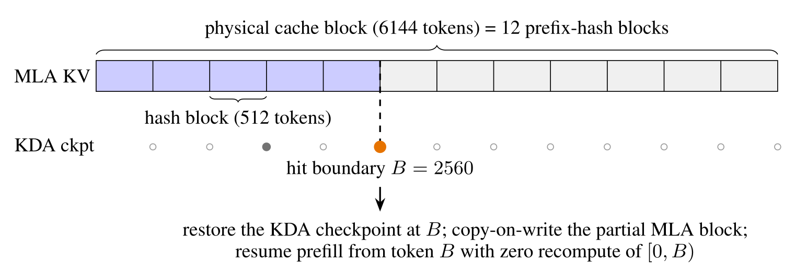

# IndexCache：跨层复用稀疏注意力的索引

稀疏注意力常被概括成“只看 top-k 个历史 token”，但这句话藏起了一个越来越重要的成本：谁来找出这 $k$ 个 token？DeepSeek Sparse Attention（DSA）用轻量 indexer 为每层、每个 query 扫描历史，再把候选交给核心注意力。当核心注意力已经从 $O(L^2)$ 降到 $O(Lk)$ 时，仍为 $O(L^2)$ 的逐层 indexer 会成为新的长上下文瓶颈。

[IndexCache](https://arxiv.org/abs/2603.12201) 的洞见是，相邻层找出的候选往往高度重叠，无需每层都重新运行 indexer。它让少数 Full 层计算并刷新 top-k index tensor，让后续 Shared 层复用最近的索引，直到下一个 Full 层覆盖缓存。GLM-5.2 模型卡把发布配置中的相关机制称为 IndexShare。两者处在同一技术谱系，但论文方法、发布命名与具体训练配方不能混为一谈。

DSA 在 GLM-5 中怎样接入持续训练，见 [GLM-5 总深读](glm-5.md#dsa)与 [GLM-5 架构](glm-5-architecture.md#dsa-continued-pretraining)；注意力家族中的统一位置见[稀疏索引器](../../architecture/attention-variants.md#glm-dsa)，KV 状态的另一条优化路线见 [KV cache](../../inference/kv-cache.md) 与 [缓存复用](../../inference/cache-reuse.md)。

## 从 DSA 的成本分解开始 {#indexcache-state}

设序列长度为 $L$，层数为 $N$，每个 query 保留 $k$ 个候选。标准 dense attention 的主要项为 $O(NL^2d)$。DSA 把高维核心注意力压到约 $O(NLkd)$，但轻量 indexer 若仍比较所有 query-key 对，其跨层成本仍是

$$
C_{\mathrm{indexer}}=O(NL^2d_I),
$$

其中 $d_I$ 是较小的 indexer 特征维度。随着核心注意力被稀疏化、上下文变长，$d_I$ 小并不保证这一项可以忽略。

IndexCache 给每层分配角色 $c_\ell\in\{F,S\}$：

- Full（F）层运行自己的 indexer，产生 $I_\ell=\operatorname{TopK}(s_\ell,k)$，并覆盖当前缓存；
- Shared（S）层不运行 indexer，直接使用最近前驱 Full 层的 index tensor；
- 第一层必须是 Full 层，保证任何 Shared 层之前已有合法索引。

下面的可执行参考固定了“刷新—共享—再刷新”的状态机。它不实现 indexer 网络或稀疏 attention kernel，只演示被缓存的是离散位置索引。

```python
import torch
def indexcache_schedule(scores, pattern, k):
    if len(scores) != len(pattern) or pattern[0] != "F":
        raise ValueError("the first layer must compute a full index")
    selected, cached, indexer_calls = [], None, 0
    for score, role in zip(scores, pattern):
        if role == "F":
            cached = torch.topk(score, k, dim=-1).indices
            indexer_calls += 1
        elif role != "S":
            raise ValueError("role must be F or S")
        selected.append(cached.clone())
    return selected, indexer_calls
layer_scores = [
    torch.tensor([[0.1, 0.9, 0.3, 0.2]]),
    torch.tensor([[0.2, 0.7, 0.4, 0.1]]),
    torch.tensor([[0.6, 0.1, 0.5, 0.3]]),
    torch.tensor([[0.8, 0.1, 0.2, 0.7]]),
]
indices, calls = indexcache_schedule(layer_scores, "FSSF", k=2)
assert calls == 2
torch.testing.assert_close(indices[1], indices[0])
torch.testing.assert_close(indices[2], indices[0])
assert not torch.equal(indices[3], indices[0])
```

如果 Full 层占比为 $r$，理想化的 indexer 计算约变为 $rNL^2d_I$。这只是算术上界：真实速度还受 top-k、张量并行、访存、kernel launch、batch 和核心注意力占比影响。

## 相邻层重叠很高，但“重叠率”不是搜索目标 {#cross-layer-overlap}

论文在 47 层、30B 参数的 DSA 模型上观察到：多数相邻层的 top-k overlap 位于 0.7–1.0，早期和晚期若干层则可低于 0.4，并呈现成块的相似结构。若

$$
\operatorname{Overlap}(\ell,j)=
\frac{|I_\ell\cap I_j|}{k},
$$

相邻层 overlap 高说明复用存在空间，却不说明该层可以安全删除 indexer。两个候选集合即使只差极少位置，被替换掉的也可能正是答案 token、变量定义或跨文件依赖；局部 attention output 的余弦相似同样可能遗漏这种稀有但关键的差异。

论文附录给出了一个重要负结果：基于局部 attention-output similarity 的动态规划搜索没有优于简单均匀模式。在三个长上下文基准的平均分中，标准 DSA 为 54.0，均匀复用为 50.7，相似度搜索为 49.8。它揭示了一个更一般的原则：用于“观察冗余”的指标未必适合“决定删哪一层”。跨层误差会被后续非线性、残差流和路由放大，搜索目标需要看模型最终分布。

## Training-free：直接用语言模型损失选择 Full 层 {#training-free-greedy}

training-free IndexCache 固定模型参数，只搜索二进制层模式。初始所有层都是 Full；每轮把一个尚未移除的层临时改为 Shared，在固定 calibration batch 上计算完整模型的逐 token LM loss，永久接受损失最低的候选，直到达到目标保留率。第一层始终不参与删除。

若需要删除 $K$ 个 indexer，朴素搜索要做

$$
\sum_{i=0}^{K-1}(N-1-i)
=K(N-1)-\frac{K(K-1)}{2}
$$

次完整前向。当 $K=N-1$ 时就是 $N(N-1)/2$。论文把层分为多个 pipeline block 并行评估候选，使墙钟时间近似按并行块数下降；这优化的是搜索过程，不改变最终推理图。

下面用一个可注入的 loss 函数表达贪心过程。真实 `evaluate_loss` 必须运行冻结的完整模型，且所有候选使用同一 calibration tokens。

```python
def greedy_full_layers(num_layers, removals, evaluate_loss):
    pattern = ["F"] * num_layers
    candidates = set(range(1, num_layers))
    for _ in range(removals):
        trials = []
        for layer in candidates:
            proposal = pattern.copy()
            proposal[layer] = "S"
            trials.append((evaluate_loss(proposal), layer))
        _, chosen = min(trials)
        pattern[chosen] = "S"
        candidates.remove(chosen)
    return "".join(pattern)
importance = [99.0, 3.0, 0.2, 2.0, 0.1]
def toy_loss(pattern):
    return sum(score for role, score in zip(pattern, importance) if role == "S")
searched = greedy_full_layers(5, removals=2, evaluate_loss=toy_loss)
assert searched == "FFSFS"
assert searched[0] == "F" and searched.count("F") == 3
```

这个搜索是任务分布相关的。calibration set 太短、领域过窄或含污染样本，都会让模式过拟合；每个候选的 loss 差异若接近数值噪声，还需要多 batch 重复与置信区间，而不是依赖一次排序。

### 不训练时，层位置比保留比例更重要

30B 模型的长上下文平均分显示了模式选择的价值：

| indexer 保留率 | 标准 DSA | 均匀模式 | LM-loss 搜索 |
| --- | ---: | ---: | ---: |
| 1/2 | 50.2 | 47.4 | 50.3 |
| 1/4 | 50.2 | 43.0 | 49.9 |
| 1/8 | 50.2 | 35.3 | 46.1 |

在 1/4 保留率下，搜索模式几乎保持标准 DSA，而均匀模式明显下降；到 1/8 时搜索也开始损失能力。这是“有冗余”与“可无限共享”的边界。

论文还在 744B GLM-5 上报告 training-free 结果：

| indexer 保留率 | 标准 DSA | 均匀模式 | LM-loss 搜索 |
| --- | ---: | ---: | ---: |
| 1/2 | 78.4 | 78.1 | 78.7 |
| 1/4 | 78.4 | 72.7 | 78.0 |

78.7 高于 78.4 的 0.3 分不应解释为复用必然提升能力；有限评测的采样波动、轻微正则化和实现噪声都可能造成小幅反超。更稳妥的结论是：在这组评测中，搜索到的 1/4 模式没有显示出显著质量坍塌。

## Training-aware：让一个 indexer 服务多层教师 {#multi-layer-distillation}

training-free 路线只能挑选“原本就适合复用”的层。training-aware 路线则改变 retained indexer 的训练目标：若第 $\ell$ 个 Full 层还要服务后续 $m$ 个 Shared 层，就让它同时逼近这些层各自的 dense attention 分布：

$$
\mathcal L_{\ell}^{I}
=\frac{1}{m+1}\sum_{j=0}^{m}
\sum_t \operatorname{KL}
\left(p_t^{\ell+j}\,\|\,q_t^\ell\right).
$$

$p_t^{\ell+j}$ 是被服务层的教师分布，$q_t^\ell$ 是 retained indexer 的预测分布。对 $q$ 而言，这个目标的梯度等价于以算术平均教师

$$
\bar p_t=\frac{1}{m+1}\sum_{j=0}^{m}p_t^{\ell+j}
$$

做一次交叉熵或 KL；两种写法的数值相差只依赖教师熵的常数项，但对 indexer logits 的梯度相同。下面直接验证这个容易被忽略的等价关系。

```python
import torch
import torch.nn.functional as F
torch.manual_seed(4)
teacher_logits = torch.randn(3, 7)
teachers = F.softmax(teacher_logits, dim=-1)
student_logits_a = torch.randn(7, requires_grad=True)
student_logits_b = student_logits_a.detach().clone().requires_grad_(True)
student_logp_a = F.log_softmax(student_logits_a, dim=-1)
loss_many = sum(
    F.kl_div(student_logp_a, teacher, reduction="sum")
    for teacher in teachers
) / len(teachers)
loss_many.backward()
mean_teacher = teachers.mean(dim=0)
loss_mean = F.kl_div(
    F.log_softmax(student_logits_b, dim=-1),
    mean_teacher,
    reduction="sum",
)
loss_mean.backward()
torch.testing.assert_close(student_logits_a.grad, student_logits_b.grad)
assert mean_teacher.shape == (7,)
```

论文的短训练流程从 GLM-4.7-Flash 出发，使用 200K context：先做 1000 步 dense warm-up，再进行 4000 步 sparse training。warm-up 阶段冻结主干、训练 retained indexers；sparse 阶段加入语言模型损失和所选 top-k 上的蒸馏约束，让主干适应复用产生的候选偏差。

| training-aware 方案 | Long-context Avg | General & Reasoning |
| --- | ---: | ---: |
| 每层 indexer baseline | 51.0 | 74.2 |
| 1/2 均匀复用 | 51.6 | 74.5 |
| 1/2 搜索模式 | 50.6 | 73.6 |
| 1/2 去掉跨层损失 | 49.8 | 74.5 |
| 1/4 均匀复用 | 50.6 | 74.1 |

训练后，均匀模式与搜索模式的差距明显缩小，说明多层教师可以主动塑造可共享的 indexer。消融中 AA-LCR 从 49.8 降至 44.0，进一步表明跨层蒸馏不是装饰项。不过这些结果来自一条特定的短适配流水线，不能推出任意模型都只需均匀保留 1/4 indexer。

## 从论文 IndexCache 到 GLM-5.2 IndexShare {#indexshare}

[GLM-5.2 模型卡](https://huggingface.co/zai-org/GLM-5.2) 使用 IndexShare 这个名称，并描述为每四个 sparse-attention layers 共享同一个 indexer；模型卡还报告在 1M context 下 attention per-token FLOPs 下降 2.9 倍。理解这段披露时需要分开三层含义：

1. IndexCache 是论文中的通用框架，包含 training-free 搜索和 training-aware 蒸馏；
2. IndexShare 是 GLM-5.2 发布配置的机制命名，说明索引跨层共享；
3. 2.9 倍针对 attention per-token FLOPs，不是整机端到端 latency，也不是 KV cache 容量缩减倍数。

论文对 744B GLM-5 披露的是 training-free 初步验证，并明确把 production-scale training-aware 实验留作后续；因此不能仅凭 GLM-5.2 的 IndexShare 名称断言它逐项复现了 30B 实验的训练配方。能够确认的是，发布模型采用了固定跨层共享粒度，并把论文中的核心思想带入生产尺度架构。

## 它缓存的不是 KV，也不是 prefix {#kv-cache-boundary}

| 机制 | 缓存对象 | 复用维度 | 主要避免的计算 | 不会自动减少 |
| --- | --- | --- | --- | --- |
| KV cache | 历史 token 的 key/value 状态 | 自回归时间步 | 已生成前缀的 K/V 重算 | 每个新 query 的 attention |
| prefix cache | 可共享前缀的 KV pages | 请求之间 | 相同前缀的 prefill | 不同后缀的计算 |
| IndexCache | top-k token 位置的 index tensor | 相邻网络层 | Shared 层的 indexer | KV bytes/token 与核心 attention |

IndexCache 的缓存只需保存当前最近 Full 层的索引，并在下一个 Full 层覆盖。论文据此称其相对标准 DSA 不引入额外 GPU memory allocation；更严格地说，实现仍需持有一个本来就会生成的 index tensor，但不需要为每个 Shared 层保留独立副本。若 serving runtime 为异步流水、张量并行或反向传播保存额外状态，峰值显存仍要以实现测量为准。

它也不会直接降低 [KV cache](../../inference/kv-cache.md) 的 bytes/token。要优化 KV 容量，需要 MLA、量化、分页、淘汰或跨请求 [prefix/cache reuse](../../inference/cache-reuse.md)；IndexCache 优化的是“沿网络深度重复选择候选”的计算。

<div markdown="block">
<figure class="paper-figure paper-figure--wide" id="k3-figure-12" data-paper-source="kimi-k3" data-paper-asset="k3-figure-12" markdown="1">
[{ width="1521" height="525" loading="lazy" decoding="async" }](../../assets/papers/kimi-k3/figure-12-prefix-cache.png)
<figcaption><strong>Figure 12 刻意放在这里作为反例边界：它缓存的是跨请求前缀状态，IndexCache 复用的是相邻网络层的 top-k 索引，两者的轴完全不同。</strong>前者受物理页、hash 粒度和 recurrent checkpoint 的最短共同前缀限制；后者受 Full/Shared 层布局和 indexer 质量限制。名字里都有 cache，不意味着能共享同一命中率或显存公式。<span class="paper-figure__source">图源：<a href="https://raw.githubusercontent.com/MoonshotAI/Kimi-K3/521359a5cae5e79d02e5a2102c2cea9ce3b9b79a/k3_tech_report.pdf#page=23">Kimi K3 Technical Report, Figure 12, p. 23</a>；Copyright (c) 2026 Moonshot AI，<a href="https://github.com/MoonshotAI/Kimi-K3/blob/521359a5cae5e79d02e5a2102c2cea9ce3b9b79a/LICENSE">Kimi K3 License</a>。</span></figcaption>
</figure>
</div>

## 速度数字应该怎样读

论文在一个 H100 节点上，用 SGLang、`dp_attention` 与 data-parallel size 8 测量 30B DSA 模型，覆盖 10K、60K、120K 与 200K 上下文。在 200K、保留 1/4 indexer 时报告：

| 指标 | 标准 DSA | IndexCache | 相对变化 |
| --- | ---: | ---: | ---: |
| prefill latency | 19.5 s | 10.7 s | 1.82× |
| 单请求 decode | 58 tok/s | 86 tok/s | 1.48× |
| full-KV throughput | 197 tok/s | 297 tok/s | 1.51× |

这些数字说明 indexer 在超长上下文中已占据足够大的执行比例，删除 75% 的逐层索引会转化为可观 wall-clock 收益。它们不保证短上下文、小 batch、不同 GPU 或不同稀疏 kernel 也有同样比例。报告对 GLM-5 的初步测量是在超过 100K context 时 prefill 与 decode 至少 1.3 倍；200K 之外的趋势以及 GLM-5.2 的公开端到端 serving 曲线仍需独立复现。

### 一个实用的测量顺序

实现 IndexCache 时，先逐层记录 indexer time、core sparse attention time、top-k overlap 与 LM loss；再比较 uniform、LM-loss searched 和 training-aware 三种模式；最后才测端到端 prefill、decode 与吞吐。若只报告 FLOPs，就看不到 top-k kernel 和不规则 gather；若只报告速度，就无法判断加速是否来自改变 batch、精度或评测长度。

建议至少固定：

- 模型 checkpoint、context tokens 与请求分布；
- $k$、Full 层位置、indexer head shape 与稀疏 kernel；
- KV cache dtype、并行策略、warm-up 次数和计时区间；
- 质量评测的 calibration / validation 隔离；
- loss 差异、长上下文任务、一般能力与 reasoning 的联合结果。

IndexCache 最有价值的地方不是一个固定的“每四层共享”口诀，而是把稀疏注意力再次拆成两层系统：候选选择器和候选内计算。前者也可以沿网络深度复用；但复用到什么程度，必须由全模型损失、适配训练和真实 runtime 一起回答。

## Reference {#reference}

- [IndexCache: Accelerating Sparse Attention via Cross-Layer Index Reuse：论文与完整实验](https://arxiv.org/abs/2603.12201)
- [GLM-5 Technical Report：DSA 与 744B 架构背景](https://arxiv.org/abs/2602.15763)
- [GLM-5.2 模型卡：IndexShare 发布配置与 1M-context FLOPs 披露](https://huggingface.co/zai-org/GLM-5.2)
- [DeepSeek-V3.2：DeepSeek Sparse Attention 的训练与系统背景](https://arxiv.org/abs/2512.02556)
- [SGLang：IndexCache 推理测量采用的 serving runtime](https://github.com/sgl-project/sglang)
- [FlashAttention：IO-aware exact attention 的硬件效率基线](https://arxiv.org/abs/2205.14135)
- [TidalDecode：利用层间选择规律加速长上下文解码](https://arxiv.org/abs/2410.05076)
- [Quest：query-aware 稀疏 KV 选择](https://arxiv.org/abs/2406.10774)
