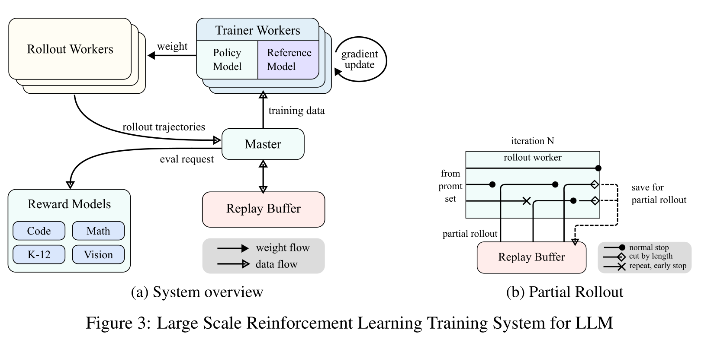

# Kimi k1.5：把长推理变成可扩展的强化学习

2025 年初，推理模型的讨论大多围绕两个问题：怎样让模型在回答前“想得更久”，以及怎样把更长的
test-time compute 重新变成训练信号。[Kimi k1.5](https://arxiv.org/abs/2501.12599)给出的答案并不是
在解码时外挂一棵显式搜索树，而是把搜索、回溯与纠错写进一条最长 128K token 的自回归轨迹，再让
强化学习直接优化最终结果。

这条路线随后成为 Kimi 技术谱系的训练主干；完整分支与公开产物先见
[Kimi 家族总览](../families/kimi.md)。partial rollout 被
[Kimi K2](kimi-k2.md)继承到长程 agent rollout，[Kimi K2.5](kimi-k2-5.md)进一步把单轨迹优化扩展到
并行 orchestrator，[Kimi K3](kimi-k3.md)则把可恢复 rollout、外置状态和百万 token context 放进更大的
系统闭环。本页先把 k1.5 自身讲清楚：它真正缩放的是什么，策略目标与长度控制怎样配合，partial
rollout 又为何不只是“把生成截断”。

## 先辨认公开对象

[官方技术报告](https://github.com/MoonshotAI/Kimi-k1.5/blob/cf9a8785730c7e59d788956e1e40dc9fc31ebf08/Kimi_k1.5.pdf)
描述的是一个经过多模态预训练、SFT、long-CoT SFT 与 RL 的模型族，并分别报告 long-CoT 与
short-CoT 结果。报告明确说明当时没有开放专有模型权重；官方仓库主要提供报告及配图。因此，公开材料
足以复原目标、数据类别、算法和系统接口，却不足以独立复现 checkpoint。

需要同时分开三个“长度”：

| 长度 | 它约束什么 | 增长时首先付出的代价 |
| --- | --- | --- |
| model context window | prompt、视觉 token、历史 reasoning 的总容量 | attention、activation 与位置外推 |
| rollout output budget | 单条训练轨迹最多生成多少 token | rollout GPU 时间与长尾等待 |
| useful reasoning depth | 真正改变答案的探索、验证与纠错 | verifier 稀疏性与信用分配 |

128K context 只提供容器；partial rollout 让这个容器在训练系统里可调度；结果奖励和策略优化才决定
其中的 token 是否学成有效推理。把三者合成“上下文越长，推理越强”会漏掉最关键的因果链。

## 长 CoT 是被压进上下文的隐式搜索

设问题为 $x$，中间推理步骤为 $z=(z_1,\ldots,z_m)$，最终答案为 $y$。普通自回归策略执行

$$
z_t\sim\pi_\theta(\cdot\mid x,z_{<t}),
\qquad
y\sim\pi_\theta(\cdot\mid x,z).
$$

显式 tree search 会保存多个部分解，用 critic 选择下一节点；k1.5 的视角是把已经尝试过的方向、错误、
反思和修正都线性化到上下文中，让同一个 policy 学习近似搜索控制器。训练目标保持简单：

$$
\max_\theta\;
\mathbb E_{(x,y^\star)\sim D,\,(z,y)\sim\pi_\theta}
\left[r(x,y,y^\star)\right].
$$

其中可验证任务使用规则、测试用例或答案匹配，开放式数学答案则依赖 reward model。最终答案正确时，
中途走过弯路仍可能得到正奖励；这正是报告不使用 value network 的动机之一：局部看来较差的分支，
可能教会模型发现错误并恢复。它不是对 value function 普遍无效的证明，而是对这套长轨迹、终局奖励
设定的设计选择。

类似地，“不使用 MCTS、process reward model 或显式 value function”不等于这些方法没有价值。
k1.5 说明的是：在作者的数据、verifier、context 和计算预算内，一条足够长的自回归 policy 也能学到
部分 planning behavior。

## Online mirror descent：每轮围绕旧策略解一个新问题

第 $i$ 轮以 $\pi_i$ 为 reference policy，优化 KL 正则化目标

$$
\max_\pi\;
\mathbb E_{\pi}\left[r(x,y,y^\star)\right]
-\tau D_{\mathrm{KL}}\!\left(\pi(\cdot\mid x)\,\|\,\pi_i(\cdot\mid x)\right),
$$

其非参数最优解满足

$$
\pi^\star(y,z\mid x)
=
\frac{\pi_i(y,z\mid x)\exp\!\left(r(x,y,y^\star)/\tau\right)}{Z(x)}.
$$

这条式子揭示了算法的几何：新策略不是脱离旧策略追逐高奖励，而是在旧策略分布上做指数倾斜。
取对数后，

$$
r-\tau\log Z
=
\tau\log\frac{\pi^\star(y,z\mid x)}{\pi_i(y,z\mid x)}.
$$

报告据此构造平方残差 surrogate。每个问题从 $\pi_i$ 采样 $k$ 条响应，以组内平均奖励
$\bar r$ 近似归一化基线；梯度可理解为一项带组内 baseline 的 policy gradient，再加一项约束
$\log\pi_\theta/\pi_i$ 的二次正则。样本来自冻结的 reference snapshot，而参数可在本轮内多步更新，
所以它不同于严格逐步 on-policy 的 REINFORCE；每个外层迭代又会更新 reference 并重置 optimizer。

这里至少有三条不能省略的边界：

- $\tau$ 同时改变奖励倾斜和 policy drift，不能只当成普通 loss coefficient；
- 组内平均 baseline 需要同题多样本，采样温度和 $k$ 会改变梯度分布；
- “可使用 off-policy data”并不等于任意陈旧轨迹都安全，behavior policy 与 loss mask 仍必须可追踪。

更一般的目标谱系见[在线强化学习](../../training/online-rl.md)与
[LLM 策略优化](../../practice/llm-policy-optimization.md)。

## Prompt 先决定奖励是否有意义

报告把 RL prompt 的质量压缩成三个条件：覆盖足够多样、难度适中、答案可可靠验证。其具体做法比口号
更有启发：

1. 用 SFT policy 对同一题高温采样十次，以 pass rate 作为当前模型视角下的难度代理；
2. 过滤过易和几乎无正样本的题，随后使用 curriculum sampling；
3. 训练中跟踪题目成功率 $s_i$，按近似 $1-s_i$ 提高薄弱题的采样概率；
4. 排除容易只猜最终答案的多选、判断和部分证明题，并让模型在无 CoT 时尝试猜答，八次内命中则视为
   容易被 reward hacking。

这些阈值是报告配方，不是跨模型常数。更深的原则是：verifier 只看最终字符串时，数据集必须主动压低
“错误过程碰巧命中答案”的概率。否则优化器学到的是 reward channel 的漏洞，而不是推理。

## 长度奖励：只在正确性语境里奖励简洁

对同一问题采样的 $k$ 条响应，令第 $i$ 条长度为 $\ell_i$。若
$\ell_{\max}\ne\ell_{\min}$，报告定义

$$
\lambda_i
=
\frac12-\frac{\ell_i-\ell_{\min}}{\ell_{\max}-\ell_{\min}},
$$

并令

$$
r_{\mathrm{len},i}
=
\begin{cases}
\lambda_i,&r_i=1,\\
\min(0,\lambda_i),&r_i=0.
\end{cases}
$$

正确响应越短，奖励越高；错误响应不会因为短而得到正奖励，较长的错误响应还会受罚。若组内长度完全
相同，长度奖励为零。这比直接优化 $-\ell_i$ 更稳妥，因为“极短但错误”不是目标。

报告的 preliminary experiments 只支持一个较窄的结论：length penalty 在训练初期<strong>可能</strong>拖慢进展。
作者因此先做无长度惩罚的标准优化，再切换到常量权重。一个合理但未经报告单独验证的机制解释是，过早
施加强简洁偏好可能压缩尚未成熟的搜索轨迹；因而“先学会找到答案，再学习删除无效路径”应理解为这套
配方的设计直觉，而不是已经隔离其他变量后得到的普遍因果结论。

## Partial rollout：暂停的是 episode，不是把它判成失败 {#partial-rollout}

长轨迹让同步 RL 出现 straggler：大多数样本已经结束，一条超长响应仍占着 rollout worker，整个
iteration 无法进入训练。k1.5 给每次生成分配固定 token budget；超出预算的 episode 保存到 replay
buffer，下一轮从已有 prefix 继续。worker 仍可异步处理其他短任务，长响应则跨多个 iteration 完成。

<div markdown="block">
<figure class="paper-figure paper-figure--wide" id="k15-figure-03" data-paper-source="kimi-k1-5" data-paper-asset="k15-figure-03" markdown="1">
[{ width="1650" height="808" loading="lazy" decoding="async" }](../../assets/papers/kimi-k1-5/figure-03-rl-system-partial-rollout.png)
<figcaption><strong>左图给出训练闭环，右图回答一条长 episode 怎样跨 iteration 存活。</strong>Figure 3(a) 中 trajectory 与 evaluation data 汇入 master / replay buffer，trainer 更新后的权重再流向 rollout workers；Figure 3(b) 用黑圆、空心菱形与叉号分别标记正常结束、因长度预算暂停和重复检测提前结束。虚线把长度截断的未完成轨迹送回 replay buffer，它不是失败样本，也不是已经终止的 episode。<span class="paper-figure__source">图源：<a href="https://raw.githubusercontent.com/MoonshotAI/Kimi-k1.5/cf9a8785730c7e59d788956e1e40dc9fc31ebf08/Kimi_k1.5.pdf#page=8">Kimi k1.5: Scaling Reinforcement Learning with LLMs, Figure 3, p. 8</a>；Kimi Team 等作者，<a href="https://creativecommons.org/licenses/by-nc-nd/4.0/">CC BY-NC-ND 4.0</a>。</span></figcaption>
</figure>
</div>

两幅子图需要连起来读。左图中的 replay buffer 不只是把完整 trajectory 打乱后供 trainer 取样，还承担
跨 iteration 保存未完成 prefix 的职责；右图则把调度语义显式化：黑圆对应真正的正常终止，叉号对应
重复检测触发的提前终止，只有空心菱形表示“本轮预算用完但 episode 尚未结束”。因此 length cut 改变的
是轨迹何时继续生成，而不是这条轨迹最终应得什么 reward。

图中没有展开恢复协议：虚线只表示未完成状态会回到 buffer，并不自动保证下一轮与连续生成等价。prefix
位置、sampling state、behavior policy 版本及 loss mask 仍需由实现显式保存；训练/推理引擎怎样释放
显存、转换权重并重新接管 GPU，则是后文的另一层生命周期问题。

下面的 reference 只锁定最容易写错的状态语义，并演示“只让最新 segment 参与 loss”的一种 mask：
旧 prefix 被复用，预算耗尽是 `paused`，只有看到 EOS 才是 `done`。生产系统还需要 KV cache、环境
状态、随机数状态和 behavior policy 版本。

```python
from dataclasses import dataclass

@dataclass(frozen=True)
class Partial:
    episode: str
    tokens: tuple[int, ...] = ()
    behavior_versions: tuple[int, ...] = ()

def append_segment(item, generated, budget, version, eos):
    segment = tuple(generated[:budget])
    if eos in segment:
        segment = segment[:segment.index(eos) + 1]
    tokens = item.tokens + segment
    loss_mask = (0,) * len(item.tokens) + (1,) * len(segment)
    versions = item.behavior_versions + (version,) * len(segment)
    done = eos in segment
    paused = None if done else Partial(item.episode, tokens, versions)
    return tokens, loss_mask, versions, paused

item = Partial("episode-7", (11, 12), (3, 3))
tokens, mask, versions, paused = append_segment(item, [21, 22, 23], 2, 4, 0)
assert tokens == (11, 12, 21, 22) and mask == (0, 0, 1, 1)
assert versions == (3, 3, 4, 4) and paused is not None
tokens, mask, versions, paused = append_segment(paused, [31, 0], 2, 5, 0)
assert tokens[-2:] == (31, 0) and mask == (0, 0, 0, 0, 1, 1)
assert versions[-2:] == (5, 5) and paused is None
```

报告还加入重复序列检测：发现循环输出便提前终止，并可追加惩罚。这个优化节省算力，却必须区分真正
重复与任务本身要求的枚举、表格或代码模式。

更重要的是，跨轮完成的 trajectory 天然混合多个 policy version。报告说明旧 segment 可从 buffer
复用、当前 segment 才需本轮生成，也允许部分 segment 不参与 loss；但没有公开完整的 staleness 修正、
token-level mask 与 sampling-state 恢复协议。实现 partial rollout 时，至少应持久化：

| 状态 | 缺失后的典型错误 |
| --- | --- |
| episode / prompt identity | prefix 接到错误任务 |
| token prefix 与位置 | 重复生成或 RoPE position 偏移 |
| behavior log-prob / policy version | importance ratio 无法解释 |
| loss mask | 旧 token 被重复训练 |
| RNG 与 sampling 参数 | 恢复轨迹不再等价 |
| tool / sandbox state | agent observation 与 action history 脱节 |

## 训练与推理引擎怎样轮换

k1.5 的外层 iteration 仍是 rollout 后训练的同步节奏，rollout workers 内部则异步生成。训练侧使用
Megatron，推理侧使用 vLLM，两者以 sidecar 形式共置于同一 Kubernetes pod，并轮流占用 GPU：

```text
Megatron train -> offload -> transfer weights -> vLLM rollout
      ^                                             |
      +--------------- terminate / onload <--------+
```

checkpoint engine 负责生命周期与权重格式转换，Mooncake 通过 RDMA 传输参数。报告给出的作者系统测量
是 train-to-inference 少于一分钟、反向切换约十秒；它依赖当时的集群、并行布局和实现，不能当成通用
SLA。代码与数学 verifier 则通过隔离 sandbox 执行，支持不同 judge image。

这套设计第一次把“长思考”明确变成调度问题：策略公式只告诉 learner 怎样更新，真正的上限还取决于
生成吞吐、尾延迟、权重同步、sandbox 可靠性与可恢复状态。后续 K2 的
[checkpoint engine](kimi-k2.md#checkpoint-engine)正是在 1T 模型规模上继续解决这个接口。

## 多模态不是末端适配

k1.5 的 base training 依次经历视觉语言预训练、cooldown 与长上下文激活。语言数据覆盖通用文本、
代码、数学推理与知识；多模态数据覆盖 caption、image-text interleaving、OCR、知识和 QA。vision
tower 先单独训练，再解冻语言模型，视觉文本比例最终提高到报告所述的 30%。

长上下文阶段把最大长度从 4,096 逐步扩到 32,768 和 131,072，RoPE base 设为 $10^6$；报告给出的
mixture 是 40% full-attention long data 与 60% 从 cooldown 数据均匀采样的 partial-attention data。
这里的 “partial attention data” 是预训练数据/attention 配方，不是 RL 的 partial rollout。

post-training 同时包含 text 与 image reasoning。Vision RL 数据分为真实图像问题、程序化合成视觉
推理和把文本/代码/结构化数据渲染成图像的任务。它把“同一知识换一种模态表示后仍应一致”变成训练
约束，也为后来的 [Kimi-VL](../../multimodal/kimi-vl.md)提供了直接前史。

## Long2short：把找到答案与压缩路径分成两步

长 CoT 提高上限，却不适合所有延迟预算。报告比较四种压缩路线：

| 方法 | 训练信号 | 主要风险 |
| --- | --- | --- |
| weight averaging | 直接平均 long-CoT 与 short-CoT checkpoint | 参数空间平均不保证功能线性 |
| shortest rejection sampling | 同题采样 8 次，选最短正确响应做 SFT | 只利用被选中的正样本 |
| DPO | 最短正确为 chosen，较长正确或错误响应为 rejected | preference 同时混合正确性与长度 |
| long2short RL | 从质量—长度折中 checkpoint 继续 RL，加入长度奖并缩短 rollout 上限 | 预算过紧会截断必要探索 |

报告的作者实验中，long2short RL 给出最好的性能—token 曲线；这不是说它在任意模型、任意 verifier
上都优于蒸馏或 preference optimization。真正可迁移的思想是把 **capability acquisition** 与
**trajectory compression** 分阶段：先让长预算发现策略，再把可靠策略压入短预算。

## 怎样阅读评测与消融

报告列出 AIME、MATH-500、Codeforces、LiveCodeBench、MathVista、MMMU 等结果，并展示 performance
随平均 response length 增长、长上下文 RL 持续改善，以及带负梯度的 policy optimization 相对 ReST
有更好的样本效率。这些数字均是作者在其 sampling 与 harness 下的结果。

比较时至少要固定：

- long-CoT 还是 short-CoT，最大 output tokens 与平均实际长度；
- pass@1、Avg@$k$、best-of-$N$ 或竞赛 percentile；
- 是否允许图片、代码执行、答案抽取与内部 verifier；
- benchmark 版本、污染检查和超时；
- 总生成 token，而不只看答对率。

报告也留下明确空白：没有公开模型规模、完整预训练 token 总量、RL batch 与 rollout 数、$\tau$、长度
奖励权重、训练总 FLOPs、完整训练代码和权重。因而目前最可复用的是算法—系统接口，而不是一份可照抄
的复现 recipe。

## 从 k1.5 留下的四条主线

1. **context 是 RL 的计算维度**：更长轨迹允许 policy 在单次自回归中探索、反思和恢复。
2. **verifier 决定可学内容**：prompt 难度与抗投机性先于 optimizer 名称。
3. **长尾是系统语义问题**：partial rollout 必须保存 episode、policy 与 loss 边界，不能等同于截断。
4. **能力与效率应分阶段优化**：long2short 把发现高质量轨迹和压缩 token budget 解耦。

沿时间线继续阅读时，[Kimi K2](kimi-k2.md)把这套 RL 主干接到 1T MoE、工具数据与大规模引擎切换，
[Kimi K2.5](kimi-k2-5.md)把 context 管理扩成 learned parallel orchestration，而
[Kimi K3](kimi-k3.md)进一步把长轨迹训练与 hybrid recurrent model 的状态管理合并。

## Reference {#reference}

- [Kimi k1.5: Scaling Reinforcement Learning with LLMs](https://arxiv.org/abs/2501.12599)
- [Moonshot AI Kimi k1.5 official technical report, pinned revision](https://github.com/MoonshotAI/Kimi-k1.5/blob/cf9a8785730c7e59d788956e1e40dc9fc31ebf08/Kimi_k1.5.pdf)
- [Mirror Descent Policy Optimization](https://arxiv.org/abs/2005.09814)
- [Direct Preference Optimization: Your Language Model is Secretly a Reward Model](https://arxiv.org/abs/2305.18290)
- [vLLM: Easy, Fast, and Cheap LLM Serving with PagedAttention](https://arxiv.org/abs/2309.06180)
- [Mooncake: A KVCache-centric Disaggregated Architecture for LLM Serving](https://arxiv.org/abs/2407.00079)
- [CYaRon test-data generation library](https://github.com/luogu-dev/cyaron)
