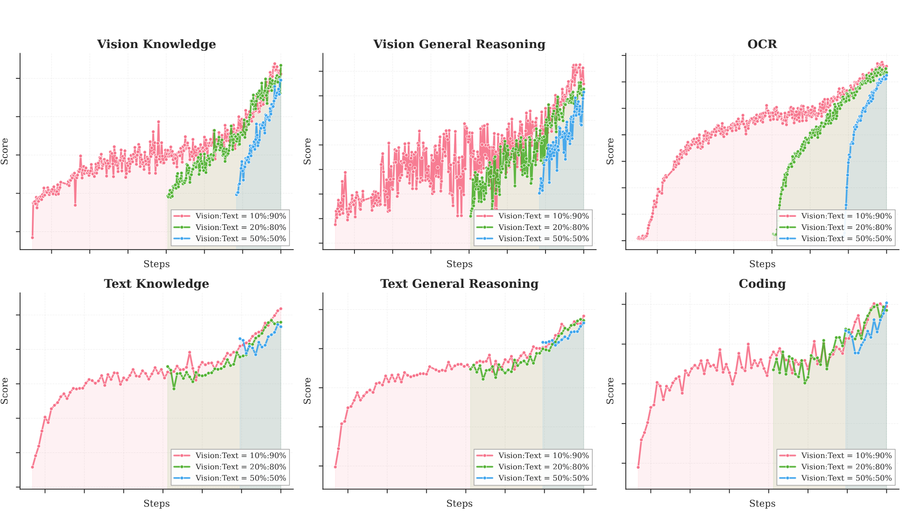
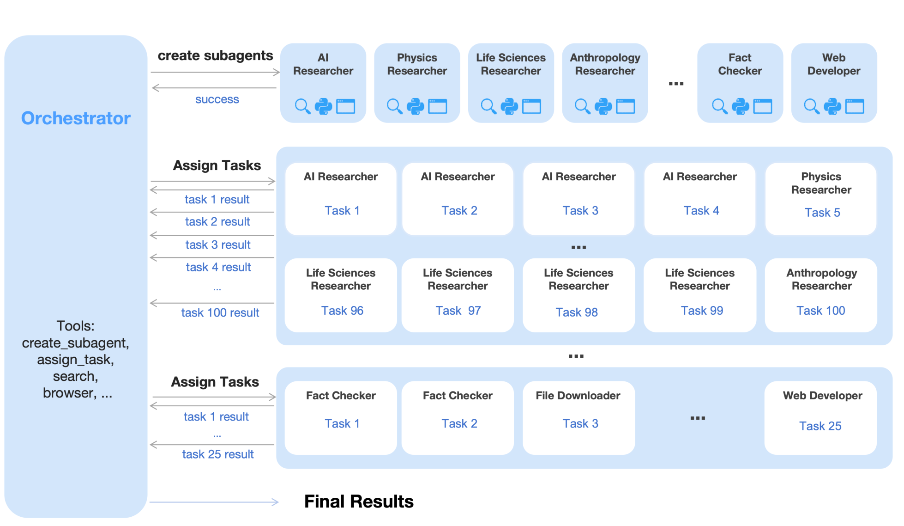
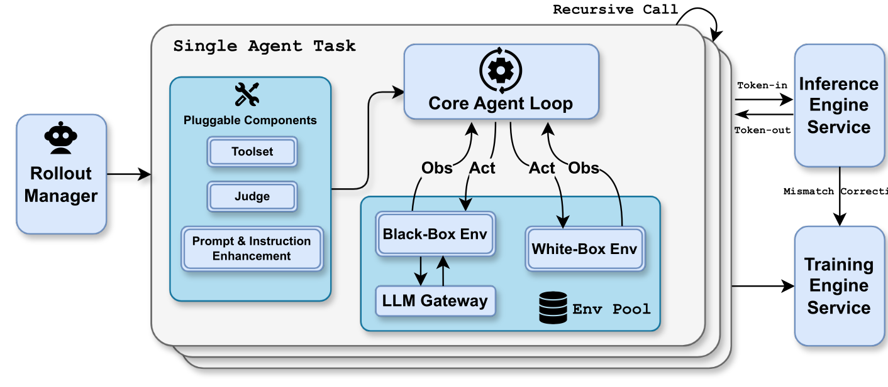

# Kimi K2.5：原生多模态、联合 RL 与 Agent Swarm

[Kimi K2.5](https://arxiv.org/abs/2602.02276)把两条此前相对独立的路线接到一起：一条从
[Kimi-VL](../../multimodal/kimi-vl.md)出发，研究视觉 token 怎样与语言共同预训练和强化学习；另一条
从 [Kimi K2](kimi-k2.md)出发，研究长程 agent 怎样在工具世界中行动。连接点不是“给 agent 多看一张
图”，而是让 text、vision、reasoning、tool use 与 parallel orchestration 共享训练主干和 outcome。

报告最值得保留的历史位置也在这里：Kimi k1.5 把搜索压进一条长 CoT，K2 把这条轨迹接入真实工具，
K2.5 则让一个可训练 orchestrator 动态创建多个 frozen subagent。test-time compute 从“时间轴上继续
生成”扩展到“空间轴上并行探索”。

## 先分开模型、训练阶段与系统模式

[官方技术报告](https://github.com/MoonshotAI/Kimi-K2.5/blob/3e60763b943e93c443287c383e0468ffe05b188f/tech_report.pdf)
公开的主体是建立在 K2 Base 上的 native multimodal model：

| 层面 | K2.5 的公开对象 |
| --- | --- |
| language backbone | K2 MoE：1.04T total / 32.6B activated，384 experts、top-8 |
| vision path | MoonViT-3D + MLP projector |
| context | 最长 256K；长上下文阶段从 32K 扩到 256K |
| interaction modes | instant / thinking、text / vision、chat / agent |
| swarm | trainable orchestrator + dynamically instantiated frozen subagents |
| weights | post-trained checkpoint 与官方 inference artifacts |

这里有两个常见错位。第一，Agent Swarm 是 post-training 与 inference system，不是 MoonViT-3D 的
结构组件；单模型 K2.5 与 swarm mode 的成本和评测也不同。第二，K2.5 以 K2 checkpoint 为 language
foundation，不应把 K2 的 15.5T text pretraining 与 K2.5 的后续 multimodal token 混成同一次从零训练。

官方 artifact 使用
[Modified MIT License](https://github.com/MoonshotAI/Kimi-K2.5/blob/3e60763b943e93c443287c383e0468ffe05b188f/LICENSE)：
超过 1 亿月活或月收入 2,000 万美元的商业产品 / 服务需要在界面显著展示 “Kimi K2.5”。这项附加条件
意味着它不应被简称为未修改的标准 MIT。

## 早融合的真正对照：固定总预算，改变何时看见视觉

多模态 continual pretraining 常见做法是先把语言模型训到后期，再以很高视觉比例快速“接入”图片。
K2.5 的受控实验固定 visual / text token 总预算，只改变视觉注入时点与比例：

| 注入策略 | vision injection timing | vision:text | 报告中的现象 |
| --- | ---: | ---: | --- |
| early | 0% | 10:90 | 六项 visual / text aggregate 中整体最好 |
| mid | 50% | 20:80 | 语言 reasoning 接近，但视觉指标下降 |
| late | 80% | 50:50 | visual 与 text 指标都更弱 |

更准确的结论不是“视觉比例越低越好”，而是：**在这组固定 token 预算的配方内，较早、较温和的长期
共适应优于末期高比例注入**。late injection 会让文本能力评测分数出现先下降再恢复的 dip-and-recover；
early fusion 给共享 backbone 更长时间调整 cross-modal representation。

<figure class="paper-figure paper-figure--wide" id="k25-figure-09" data-paper-source="kimi-k2-5" data-paper-asset="k25-figure-09" markdown="1">
[{ width="1942" height="1117" loading="lazy" decoding="async" }](../../assets/papers/kimi-k2-5/figure-09-early-fusion.png)
<figcaption><strong>真正有信息量的是六条能力曲线共同呈现的适应过程，而不只是最终排名。</strong>Figure 9 中 early 10:90 配方从训练开始持续接触视觉；mid 与 late 配方在视觉注入边界出现不同程度的跃迁与恢复。它支持固定预算下的长期共适应，却不能证明 10:90 是跨模型、跨数据的普适最优比例。<span class="paper-figure__source">图源：<a href="https://raw.githubusercontent.com/MoonshotAI/Kimi-K2.5/3e60763b943e93c443287c383e0468ffe05b188f/tech_report.pdf#page=21">Kimi K2.5: Visual Agentic Intelligence, Figure 9, p. 21</a>；Copyright (c) 2026 Moonshot AI，<a href="https://github.com/MoonshotAI/Kimi-K2.5/blob/3e60763b943e93c443287c383e0468ffe05b188f/LICENSE">Modified MIT License</a>。</span></figcaption>
</figure>

这项消融没有公开所有模型规模、seed、per-source mixture 与训练方差，因而不足以推出跨架构最优比例。
它提供的是一个实验设计原则：比较融合策略时必须固定总 visual tokens、总 text tokens 与总 compute，
不能把“更早注入”和“额外看了更多图”混在一起。

## MoonViT-3D：用同一空间理解图像与视频

K2.5 的视觉路径沿用 Kimi-VL 的 native-resolution 思想。图像按原始宽高 patchify，不做固定方形 resize
或多 crop 拼接；不同尺寸的 patch sequence 通过 NaViT-style packing 合并成 variable-length batch。

MoonViT-3D 将这个“patch n' pack”扩到时间轴：

1. 最多四个连续 frame 组成一个 spatiotemporal volume；
2. 每帧的 2D patches 一起 flatten / pack，由同一套 attention 参数处理；
3. 在 projector 前按相同空间位置做轻量 temporal pooling；
4. 四帧压成一组视觉表示，在相同 context budget 下可覆盖约 $4\times$ 更长视频。

图像与视频 encoder 完全共享参数和 embedding space，减少架构分叉，也让静态图像知识直接迁移到视频。
代价是 temporal pooling 会丢失组内的细粒度顺序；高速动作、瞬时事件与精确 timestamp 仍需用更密的
sampling 或专门评测检验。

它也不等于 [Kimi K3](kimi-k3.md)的 MoonViT-V2。K2.5 报告描述 MoonViT-3D 的 shared
image-video path；K3 则从 next-token objective 重新训练视觉塔并接入另一套 hybrid backbone。

## 约 15T 的后续训练应该怎样计数

报告表 3 将 K2.5 分为：

| stage | 主要数据 | sequence | token 口径 | trainable |
| --- | --- | ---: | ---: | --- |
| ViT training | alt text、caption、grounding、OCR、video | 4K | 1T | ViT |
| joint pretraining | text、knowledge、interleaving、video、OS screenshot | 4K | 15T | ViT + LLM |
| long-context mid-training | 高质量 text / multimodal、long video、reasoning / long-CoT | 32K→256K | 500B→200B | ViT + LLM |

正文同时把完整后续流程概括为“approximately 15T tokens across three stages”，又明确说 joint
pretraining 本身有 additional 15T vision-text tokens。最稳妥的读法是把“约 15T”视为 rounded
headline，把各 stage 表格保留为自己的披露口径；不能把 1T、15T、500B、200B 机械相加后宣称得到
官方精确总量。

ViT stage 使用 captioning / alignment 目标：先以 Moonlight-16B-A3B 辅助训练视觉塔，再短暂只更新
projector，使表示能平滑接到 1T LLM。joint stage 从接近训练末期的 K2 checkpoint 继续，加入视觉
token、调整 data proportions 并提高 code 权重；long-context stage 再用 YaRN 与高质量 mid-training
把窗口逐步扩长。

## Zero-vision SFT：迁移的是 action grammar

经过 joint pretraining 的模型已经把图像与文本对齐，却未必会自主调用 IPython、crop、threshold、
count 等视觉工具。常见 cold start 是人工编写 visual CoT；K2.5 报告反而发现，其早期 visual
trajectory 数据会损害泛化，于是提出 **zero-vision SFT**：SFT 阶段只用高质量 text instructions，
通过程序化工具调用学会通用 action / observation grammar，不提供视觉 SFT 样本。

这不表示“视觉数据不需要”。它成立的前提恰恰是此前已有大规模 vision-text joint pretraining；
zero-vision 只描述 post-training 的一个阶段。能力迁移链是

$$
\text{joint visual-text representation}
\longrightarrow
\text{text SFT learns tool protocol}
\longrightarrow
\text{vision RL grounds protocol in pixels}.
$$

仅靠 text SFT 的起始模型仍会忽视必要图像，后续 outcome-based visual RL 才在 grounding / counting、
chart / document、vision-critical STEM 上提供不可绕过的视觉结果奖励。

## Joint multimodal RL：按能力组织，而不是按输入模态分家

K2.5 不把 RL experts 简单拆成 “text expert” 与 “vision expert”，而按 knowledge、reasoning、coding、
agentic 等能力域组织；同一个域可同时接收 text-only 与 multimodal queries。视觉 verifier 也随任务
变化：

- bounding box 用 IoU，point grounding 用基于距离的 soft matching；
- polygon segmentation rasterize 后计算 mask IoU；
- OCR 使用 normalized edit distance；
- counting 根据预测与真值的绝对差；
- 更复杂视觉 puzzle 再用 model-based verifier。

报告在 visual RL 前后记录到 MMLU-Pro 84.7→86.4、GPQA-Diamond 84.3→86.4、LongBench v2
56.7→58.9。它支持“该训练 run 未观察到文本退化，并出现正迁移”，不能直接推广为视觉 RL 总会提升
语言能力；共同数据 replay、policy checkpoint 演化和评测方差都可能参与结果。

### 从 sequence-level 正则到 token-level clipped update

K2.5 仍从 previous policy $\pi_{\mathrm{old}}$ 对每题采样 $K$ 条响应，以组内平均奖励

$$
\bar r(x)=\frac1K\sum_{j=1}^K r(x,y_j)
$$

作为 baseline。相较 k1.5 / K2 的 sequence log-ratio surrogate，报告把 ratio 下沉到 token，并对其做
区间 clipping。若 $N=\sum_j |y_j|$，其核心形状可写为

$$
\mathcal L_{\mathrm{RL}}
=
\mathbb E_x\left[
\frac1N\sum_{j=1}^K\sum_{i=1}^{|y_j|}
\operatorname{Clip}
\left(
\frac{\pi_\theta(y_{j,i}\mid x,y_{j,<i})}
{\pi_{\mathrm{old}}(y_{j,i}\mid x,y_{j,<i})},
\alpha,\beta
\right)
\left(r_j-\bar r\right)
-\tau\log^2
\frac{\pi_\theta(y_{j,i}\mid x,y_{j,<i})}
{\pi_{\mathrm{old}}(y_{j,i}\mid x,y_{j,<i})}
\right].
$$

这条式子同时做三件事：组内相对优势、token-level credit broadcast、policy-drift regularization。
它仍把 sequence reward 广播给所有 token，并没有解决真正的 process-level credit assignment；clipping
也会引入 bias。实现时必须明确 reduction 是按 token 的 $1/N$，而不是先逐序列平均再对 $K$ 平均。

## Toggle：在“会用更多算力”和“愿意及时停下”之间来回训练

固定长度惩罚容易产生 length overfitting：模型学会短答，却在推理时给更多 token 也不会继续探索。
K2.5 的 Toggle 每 $m$ 个 iteration 交替两种 phase：

- budget-limited phase：只有当同题组内平均正确率达到阈值 $\lambda$ 时，才要求正确响应落在
  problem-dependent budget 内；
- standard-scaling phase：恢复最大生成长度，让模型继续学习利用更多 test-time compute。

每题预算从初始正确样本长度的 $\rho$ 分位数估计，并在训练中固定：

$$
B(x)
=
\operatorname{Percentile}_\rho
\left(
\{|y_j|:r(x,y_j)=1\}
\right).
$$

Toggle 不是 K2.5 的全部 RL 算法，而是一项在质量与 token efficiency 之间交替优化的 heuristic。
其作者消融首先在 K2 Thinking 上验证；把它迁移到新分布时需重新检查“初始正确样本太少”和
“固定 budget 随 policy 变强而过时”这两个边界。

## Agent Swarm：把并行本身变成 policy action

单 agent 的长程轨迹基本是串行的：

$$
o_0\to a_0\to o_1\to a_1\to\cdots.
$$

任务含大量独立检索、文件处理或多分支验证时，总 wall time 会近似随 tool steps 线性增长。Agent
Swarm 给 orchestrator 两类额外 action：创建带专门任务描述的 subagent，以及等待 / 调度一组已有
subagents。模型自己决定是否拆分、何时并行、最后怎样汇总，而不是执行固定 DAG。

训练架构刻意解耦：

- **orchestrator 可训练**，接收最终 outcome 与并行辅助奖励；
- **subagents 冻结**，由固定的中间 policy checkpoint 实例化；
- subagent trajectory 当作 environment observation，不进入 orchestrator 的 differentiable path；
- 先用较小 subagent 训练，再渐进换成较大模型，并动态调节两类 inference instance 的资源比例。

冻结 subagent 降低 non-stationarity 与 credit ambiguity，但也固定了 worker 能力上限。最终成功不证明
每个分支都正确，最终失败也不说明所有分支都错；PARL 学的是 orchestration policy，不是端到端地共同
训练一个多智能体社会。

<div markdown="block">
<figure class="paper-figure paper-figure--wide" id="k25-figure-03" data-paper-source="kimi-k2-5" data-paper-asset="k25-figure-03" markdown="1">
[{ width="1958" height="1138" loading="lazy" decoding="async" }](../../assets/papers/kimi-k2-5/figure-03-agent-swarm.png)
<figcaption><strong>Agent Swarm 的可学习对象是拆分、调度与汇总，而不是把同一个 prompt 复制很多份。</strong>Figure 3 展示 orchestrator 先创建不同角色，再把任务分批派发给专门化 subagent，最后收集结果；省下的是可并行分支的 wall time，总 token、工具调用和合并成本仍会增加。<span class="paper-figure__source">图源：<a href="https://raw.githubusercontent.com/MoonshotAI/Kimi-K2.5/3e60763b943e93c443287c383e0468ffe05b188f/tech_report.pdf#page=5">Kimi K2.5: Visual Agentic Intelligence, Figure 3, p. 5</a>；Copyright (c) 2026 Moonshot AI，<a href="https://github.com/MoonshotAI/Kimi-K2.5/blob/3e60763b943e93c443287c383e0468ffe05b188f/LICENSE">Modified MIT License</a>。</span></figcaption>
</figure>
</div>

## PARL reward：同时防止 serial collapse 与虚假并行

只给最终任务奖励时，orchestrator 可能收敛到最熟悉的单 agent 路线；只奖励 spawn 数又会创建大量无用
worker。报告定义

$$
r_{\mathrm{PARL}}(x,y)
=
\lambda_1 r_{\mathrm{parallel}}
+\lambda_2 r_{\mathrm{finish}}
+r_{\mathrm{perf}}(x,y).
$$

$r_{\mathrm{parallel}}$ 鼓励探索并发调度，避免 serial collapse；$r_{\mathrm{finish}}$ 奖励 subtask
真正完成，抑制“只创建不使用”的 reward hacking；$r_{\mathrm{perf}}$ 仍决定最终结果质量。
$\lambda_1,\lambda_2$ 在训练中退火到零，使最终 policy 回到主要 outcome，而不是永久追求表面并行度。

这种 shaping 仍不能直接奖励“拆得好”。两个 subagent 做重复工作也可能都完成，只有结合 wall time、
结果覆盖、重复率与最终 verifier 才能看出分解质量。

## Critical steps：parallel wall time 看最长分支

报告把一次 episode 分成 $T$ 个 stage。第 $t$ 阶段 main agent 用
$S_{\mathrm{main}}^{(t)}$ 步，并同时启动若干 subagent；阶段时长由最长分支决定：

$$
\operatorname{CriticalSteps}
=
\sum_{t=1}^{T}
\left(
S_{\mathrm{main}}^{(t)}
+\max_i S_{\mathrm{sub},i}^{(t)}
\right).
$$

下面的 reference 同时计算 critical path 与 total work，防止把低 latency 误写成低成本：

```python
def step_costs(stages):
    critical = 0
    total = 0
    for main_steps, subagent_steps in stages:
        assert main_steps >= 0 and all(x >= 0 for x in subagent_steps)
        critical += main_steps + max(subagent_steps, default=0)
        total += main_steps + sum(subagent_steps)
    return critical, total

stages = [
    (1, [4, 2, 3]),
    (1, [2, 2]),
    (1, []),
]
critical, total = step_costs(stages)
assert critical == (1 + 4) + (1 + 2) + 1
assert total == (1 + 4 + 2 + 3) + (1 + 2 + 2) + 1
assert critical < total
```

真实 wall time 还包含 queue、cold start、network、rate limit、merge 与 verification：

$$
T_{\mathrm{wall}}
\gtrsim
T_{\mathrm{critical\ path}}
+T_{\mathrm{dispatch}}
+T_{\mathrm{merge}}
+T_{\mathrm{verify}}.
$$

而 token、GPU-seconds 与 tool cost 更接近所有分支之和。报告在 WideSearch 的指定 Item-F1 target 上
给出相对 single-agent 的 $3\times$–$4.5\times$ execution-time 改善；它是作者 harness 内的
quality-matched latency 结果，不是任意任务的线性加速定律。

## Swarm 也是一种主动 context sharding

串行 agent 会把所有工具输出塞回一个越来越长的 history，再靠 summary、discard-all 或 hide-tool-result
被动压缩。Agent Swarm 在任务执行过程中主动把 history 分散到多个 bounded local context；subagent 独立读写
自己的 working memory，只把 task-relevant result 返回 orchestrator。

因此它可以看成

$$
\text{one global history}
\longrightarrow
\text{global plan}
+\sum_i \text{local context}_i
+\text{selective merge}.
$$

优点是并行、信息局部性与故障隔离；风险是跨分支依赖、重复搜索、conflicting writes、遗漏中间证据和
汇总瓶颈。若任务是一条强依赖链，spawn 只会增加成本。parallelism 是 policy 应学习的选择，而非默认
美德，正是报告比“固定多 agent 模板”更进一步的地方。

## Unified Agentic RL environment

K2.5 把不同任务接到一个 Gym-like contract：

```text
Rollout Manager
  -> prompt / instruction enhancer
  -> core agent loop
  -> pluggable toolset + judge
  -> white-box Env Pool or black-box LLM Gateway
  -> inference engine
  -> token/log-prob record + mismatch correction
  -> training engine
```

每个 agent task 是独立 async coroutine，并可递归触发 subtask rollout。报告称 Rollout Manager 在作者
系统中最多编排 100,000 个 concurrent tasks；这是系统容量披露，不等于始终同时执行 100,000 次模型
forward，也不说明每项任务的 tool latency 或 token throughput。

white-box environment 能使用定制 inference API、精确记录 log-prob 与环境状态；black-box
environment 只有标准 LLM API，LLM Gateway 代为记录 request / response。train-inference mismatch
correction 依赖 token-in-token-out 与 rollout log-prob，这也是 agent framework 不能只存最终文本的
原因。相关状态契约见[Agentic RL 训练系统](../../agentic-rl/training-systems.md)。

<figure class="paper-figure paper-figure--wide" id="k25-figure-10" data-paper-source="kimi-k2-5" data-paper-asset="k25-figure-10" markdown="1">
[{ width="1412" height="617" loading="lazy" decoding="async" }](../../assets/papers/kimi-k2-5/figure-10-agentic-rl-runtime.png)
<figcaption><strong>Figure 10 的重点是把任务语义、环境语义和模型服务拆成稳定接口。</strong>Rollout Manager 只编排任务；core loop 可以递归调用；black-box 与 white-box 环境分别经 gateway 或 env pool 返回 observation；推理与训练服务之间还需处理 token 和 log-prob mismatch。并发规模只有在这些状态边界可恢复时才有意义。<span class="paper-figure__source">图源：<a href="https://raw.githubusercontent.com/MoonshotAI/Kimi-K2.5/3e60763b943e93c443287c383e0468ffe05b188f/tech_report.pdf#page=23">Kimi K2.5: Visual Agentic Intelligence, Figure 10, p. 23</a>；Copyright (c) 2026 Moonshot AI，<a href="https://github.com/MoonshotAI/Kimi-K2.5/blob/3e60763b943e93c443287c383e0468ffe05b188f/LICENSE">Modified MIT License</a>。</span></figcaption>
</figure>

## 评测：单模型、context management 与 swarm 必须分列

报告同时评估 K2.5 单模型与 Agent Swarm。以 agentic search 为例，作者表格给出：

| benchmark | K2.5 Agent Swarm | K2.5 single agent | 口径 |
| --- | ---: | ---: | --- |
| BrowseComp | 78.4 | 60.6 | outcome accuracy；另有 context-management setting |
| WideSearch | 79.0 | 72.7 | Item-F1 |
| in-house Swarm Bench | 58.3 | 41.6 | 内部四域 aggregate |

内部 benchmark 对外不可独立复现；BrowseComp 的 discard-all 与 no-management 也应分开。Swarm
结果还取决于 orchestrator / subagent step limits、并发上限、工具、搜索 API、rate limit 与总成本。
可靠报告至少同时给：

- single-agent 同 checkpoint、同工具、同 quality target 的基线；
- critical steps、total steps、generated tokens、tool calls 与 wall time；
- subagent 数量分布、失败 / 重试、重复工作和 merge cost；
- external benchmark 的 exact version 与 scorer。

视觉评测同样要固定 image resize、frame sampling、最大 visual tokens、thinking mode 与 Python tools。
K2.5 的 image/video-to-code、视觉 reasoning 和长视频结果证明作者系统的广度，却不能仅凭一个 aggregate
分数定位是 encoder、joint data、RL 还是 tool harness 带来的提升。

## 公开证据的边界

报告公开了架构、stage token 口径、RL 目标、PARL reward、关键系统图和大量 benchmark protocol；
仍未公开完整 pretraining corpus、逐源 mixture、MuonClip 全部超参数、RL prompt set、GRM weights、
PARL $\lambda$ schedule、10 万任务的集群拓扑或完整训练栈。

官方 checkpoint 可下载也不等于报告每个实验都可复现。尤其需要保留：

- stage headline 与表格 token 总量存在 rounding / denominator 差异；
- cross-modal transfer 是单次作者 run 的观察；
- Agent Swarm speedup 是指定任务和 target quality 下的测量；
- frozen subagent 与 trainable orchestrator 的结论不能外推到 end-to-end multi-agent learning。

## K2.5 的持久价值

K2.5 把多模态与 multi-agent 从“额外模块”提升为优化问题：

1. early low-ratio fusion 说明模态共适应的时长可能比末期视觉浓度更重要；
2. zero-vision SFT 把 representation grounding 与 action grammar 分阶段；
3. joint RL 以能力域而非模态域组织训练，但仍需 task-specific verifier；
4. PARL 让是否并行成为 policy action，并用 finish reward 与退火抑制投机；
5. critical path 与 total work 双账本让 latency 改善不再伪装成成本下降。

继续向前，[Kimi K3](kimi-k3.md)把 K2/K2.5 的训练经验接到 KDA、Attention Residuals 与 Stable
LatentMoE；回看视觉前史，则应从[Kimi-VL](../../multimodal/kimi-vl.md)理解 native-resolution packing、
2D position 与 128K multimodal context。完整家族关系见[Kimi 技术谱系](../kimi-timeline.md)。

## Reference {#reference}

- [Kimi K2.5: Visual Agentic Intelligence](https://arxiv.org/abs/2602.02276)
- [Moonshot AI Kimi K2.5 official technical report, pinned revision](https://github.com/MoonshotAI/Kimi-K2.5/blob/3e60763b943e93c443287c383e0468ffe05b188f/tech_report.pdf)
- [Moonshot AI Kimi K2.5 official repository and weights](https://github.com/MoonshotAI/Kimi-K2.5)
- [Kimi K2: Open Agentic Intelligence](https://arxiv.org/abs/2507.20534)
- [Kimi-VL: Mixture-of-Experts Vision-Language Model](https://arxiv.org/abs/2504.07491)
- [Patch n' Pack: NaViT, a Vision Transformer for Any Aspect Ratio and Resolution](https://arxiv.org/abs/2307.06304)
- [YaRN: Efficient Context Window Extension of Large Language Models](https://arxiv.org/abs/2309.00071)
- [Gym: A Toolkit for Developing and Comparing Reinforcement Learning Algorithms](https://arxiv.org/abs/1606.01540)
