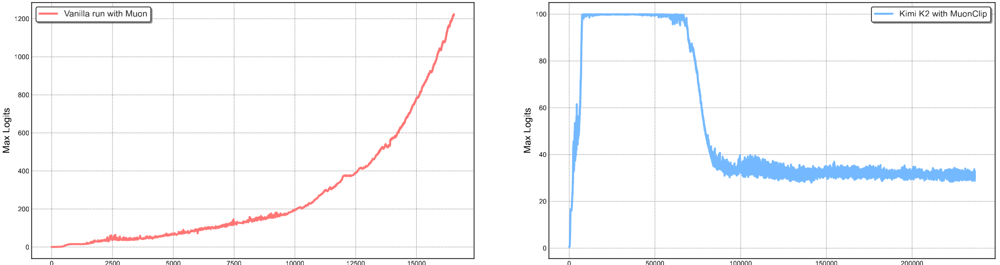
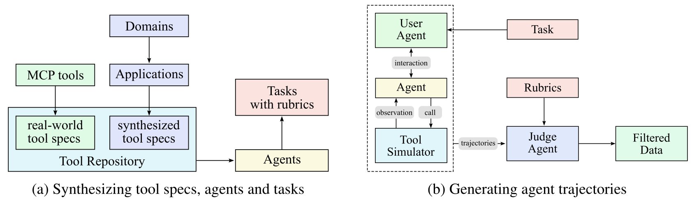
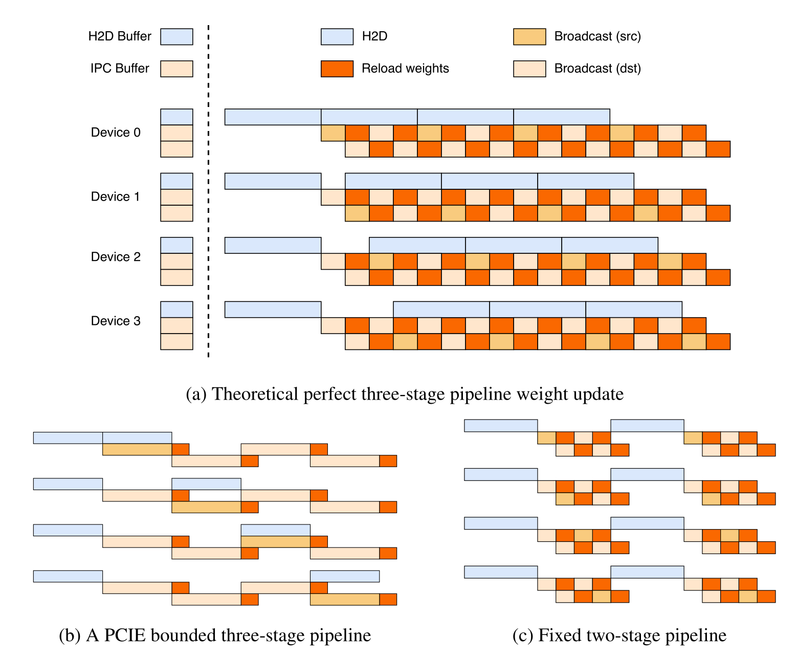

# Kimi K2：1T MoE、MuonClip 与 Agentic 训练系统

[Kimi K2](https://arxiv.org/abs/2507.20534)处在 Kimi 技术谱系的转折点；它与专门模型、机制论文、系统组件和 Agent 工具的关系见[Kimi 家族总览](../families/kimi.md)。它继承
[Kimi k1.5](kimi-k1-5.md)的长推理 RL，却把主要问题从“怎样生成更长的 reasoning”推进到“怎样训练
一个 1T 级稀疏模型，并让它在真实工具环境中持续行动”。因此报告的主线不是单个 benchmark，而是三个
闭环：

- Muon 的 token efficiency 如何在超大模型上不被 attention-logit 爆炸抵消；
- 15.5T token 如何借 rephrasing 与 sparsity scaling 提高单位 token 的用途；
- training engine、inference engine、工具环境和长尾 trajectory 如何在同一 RL iteration 内交接。

这些接口后来分别通向 [Kimi K2.5](kimi-k2-5.md)的原生多模态与 Agent Swarm，以及
[Kimi K3](kimi-k3.md)的 hybrid attention、Stable LatentMoE 与百万 token Agentic RL。

## 模型账本：大的是容量，不是每 token 计算

[官方报告](https://github.com/MoonshotAI/Kimi-K2/blob/1b4022bbb7187cf4011a8bdf0b4cd10e2daa26c4/tech_report.pdf)
给出的 K2 Base 主体如下：

| 字段 | Kimi K2 |
| --- | ---: |
| total / activated parameters | 1.04T / 32.6B |
| layers | 61；首层为 dense layer |
| hidden / expert hidden | 7,168 / 2,048 |
| attention | Multi-head Latent Attention（MLA），64 heads |
| routed experts | 384，top-8 |
| shared experts | 1 |
| sparsity ratio | $384/8=48$ |
| pretraining tokens | 15.5T |
| training / activated context | 4K 主训练，32K mid-training，YaRN 扩到 128K |
| optimizer | Muon + weight decay + RMS matching + QK-Clip |

“1T model”描述总容量；单 token 只激活 32.6B 参数。反过来，“32B activated”也不等于一个普通 32B
dense model：它还要读取、路由和通信 384 个专家的分片，并维护 1T 参数的 optimizer、checkpoint 与
权重同步。

K2 与 DeepSeek-V3 具有相近的 MLA + MoE 轮廓，但并非参数替换版：K2 把 routed experts 从 256 增到
384，把 attention heads 从 128 减到 64，并取消 expert grouping。作者的 sparsity scaling 决定了前者，
长上下文 inference cost 决定了后者。

官方代码与 checkpoint 使用
[Modified MIT License](https://github.com/MoonshotAI/Kimi-K2/blob/1b4022bbb7187cf4011a8bdf0b4cd10e2daa26c4/LICENSE)：
基础授权接近 MIT，但超过 1 亿月活或月收入 2,000 万美元的商业产品 / 服务需要在界面显著展示
“Kimi K2”。因此“权重公开”与“标准 MIT”应分开表述。

## Muon 为何在规模扩大后撞上 attention logit

Muon 对二维权重的动量更新做近似正交化，再匹配合适的 RMS。Moonlight 的受控实验表明，它在相同
token / compute 预算下比 AdamW 有更高的 token efficiency；但 K2 的放大实验也观察到一个新故障：
少数 attention head 的 $QK^\top$ 快速增长，softmax 输入可超过 $10^3$，造成 loss spike 甚至训练发散。

对 head $h$，令

$$
Q^h=XW_q^h,\qquad K^h=XW_k^h,
$$

报告从当前 batch $\mathcal B$ 记录最大 softmax logit

$$
S_{\max}^h
=
\frac{1}{\sqrt d}
\max_{X\in\mathcal B}\max_{i,j}
Q_i^h(K_j^h)^\top.
$$

如果它超过阈值 $\tau$，定义

$$
\gamma_h=\min\left(1,\frac{\tau}{S_{\max}^h}\right).
$$

普通 multi-head attention 可在 optimizer update 之后执行

$$
W_q^h\leftarrow\sqrt{\gamma_h}\,W_q^h,
\qquad
W_k^h\leftarrow\sqrt{\gamma_h}\,W_k^h.
$$

两侧各乘 $\sqrt{\gamma_h}$，下一次同输入上的 dot product 便整体乘 $\gamma_h$。下面是 MHA 的最小
语义 reference；它没有实现 Muon、distributed reduction 或 optimizer-state 变换，只验证 per-head
post-update clipping。

```python
import math
import torch

def max_logits(x, wq, wk):
    q = torch.einsum("btd,hdf->bhtf", x, wq)
    k = torch.einsum("btd,hdf->bhtf", x, wk)
    return torch.einsum("bhif,bhjf->bhij", q, k).amax((0, 2, 3)) / math.sqrt(q.size(-1))

def qk_clip_mha(x, wq, wk, tau):
    before = max_logits(x, wq, wk)
    ratio = torch.where(before > 0, tau / before, torch.ones_like(before))
    gamma = ratio.clamp(max=1)
    scale = gamma.sqrt()[:, None, None]
    return wq * scale, wk * scale, before, gamma

torch.manual_seed(7)
x = torch.randn(2, 5, 4)
wq = torch.randn(3, 4, 2) * 8
wk = torch.randn(3, 4, 2) * 8
wq2, wk2, before, gamma = qk_clip_mha(x, wq, wk, tau=10.)
after = max_logits(x, wq2, wk2)
torch.testing.assert_close(after, before * gamma)
assert torch.all(after <= 10.0001) and torch.all(gamma <= 1)
```

### 为什么不是 logit soft-cap 或 QK-Norm

logit soft-cap 修改 softmax 前的数值，却不阻止投影权重与未截断 dot product 继续增长；QK-Norm
则需要对显式 materialized 的 $Q/K$ 做归一化。K2 使用 MLA，压缩 latent 与共享 rotary key 让标准
QK-Norm 不再是无代价替换。

QK-Clip 因而选择 **用本步观测指导下一步权重**：当前 step 的 forward / backward 不被改写，
optimizer update 完成后才缩放权重。若实现把 clipping 放进当前 forward，它已经不再是报告所述算法。

### MLA 为什么要非对称缩放

MLA 的 rotary key component $k^R$ 跨 head 共享。若某个 head 爆炸时直接缩放它，其他健康 head 也会
被连带修改。K2 因而只动未共享部分：

| MLA component | 缩放 |
| --- | ---: |
| head-specific content query $q_C^h$ | $\sqrt{\gamma_h}$ |
| head-specific content key $k_C^h$ | $\sqrt{\gamma_h}$ |
| head-specific rotary query $q_R^h$ | $\gamma_h$ |
| shared rotary key $k_R$ | 不变 |

content dot product 两侧各贡献一次平方根，rotary dot product 只剩 query 一侧可调，所以直接乘
$\gamma_h$。K2 使用 $\tau=100$，并报告 15.5T-token 训练 loss 无 spike；这是作者在该架构、batch
与精度下的结果，不是 QK-Clip 的架构无关阈值保证。

Muon、weight decay、consistent update RMS matching 与这一步 QK-Clip 合在一起才是
**MuonClip**。只实现 clipping 不能声称复现 MuonClip。

<figure class="paper-figure paper-figure--wide" id="k2-figure-02" data-paper-source="kimi-k2" data-paper-asset="k2-figure-02" markdown="1">
[{ width="1946" height="517" loading="lazy" decoding="async" }](../../assets/papers/kimi-k2/figure-02-muonclip.png)
<figcaption><strong>MuonClip 处理的是会随训练继续积累的 logit 失稳，而不是把单次异常点抹平。</strong>Figure 2 左图显示普通 Muon 下最大 logit 近似持续加速增长；右图先在约 100 附近受控运行一段训练，再逐步下降到约 30 的区间。曲线支持这套配方的稳定性选择，但不能单独归因于 clipping 或外推一个架构无关阈值。<span class="paper-figure__source">图源：<a href="https://raw.githubusercontent.com/MoonshotAI/Kimi-K2/1b4022bbb7187cf4011a8bdf0b4cd10e2daa26c4/tech_report.pdf#page=4">Kimi K2: Open Agentic Intelligence, Figure 2, p. 4</a>；Copyright (c) 2025 Moonshot AI，<a href="https://github.com/MoonshotAI/Kimi-K2/blob/1b4022bbb7187cf4011a8bdf0b4cd10e2daa26c4/LICENSE">Modified MIT License</a>。</span></figcaption>
</figure>

## Rephrasing：增加的是表达覆盖，不是制造新事实

高质量知识文本存在两难：只见一次学不充分，原文多 epoch 重复又容易记住表面形式。K2 的 knowledge
rephrasing pipeline 把文档分块，保留完整输入作为上下文，按多种风格与视角逐块自回归改写，再拼回
长文并做 fidelity verification。

报告用 early K2 checkpoint 在 SimpleQA 上比较三种设置：

| 数据策略 | rephrasing 数 | epoch | SimpleQA |
| --- | ---: | ---: | ---: |
| 原始文本重复 | 0 | 10 | 23.76 |
| 一种改写重复 | 1 | 10 | 27.39 |
| 十种改写各见一次 | 10 | 1 | 28.94 |

这组受控结果支持“表达多样性优于机械重复”这一局部结论；它不证明改写产生了新知识，也不能消除
hallucination。报告在实际大规模 corpus 上限制每份语料最多改写两次，并把事实一致性检查作为进入训练
前的门。

数学语料则被改写成 learning-note 风格，并把其他语言的高质量材料翻译成英文。这里的理想变换应近似
保持语义：

$$
\operatorname{facts}(T(x))\approx\operatorname{facts}(x),
\qquad
\operatorname{surface}(T(x))\ne\operatorname{surface}(x).
$$

前一条依赖 verifier，后一条提供 augmentation。只检查 embedding similarity 容易放过数字、条件和
否定词错误；只做字符串 overlap 又会误杀真正多样的表达。可靠 pipeline 需要 claim extraction、
数值/实体一致性和抽样人工审计共同约束。

## Sparsity scaling：固定 FLOPs 时扩大可选容量

K2 的 scaling experiment 固定 activated parameters 和 top-8，只增加 total experts。若专家总数为
$E$，每 token 激活 $k$ 个，稀疏度定义为

$$
\rho=\frac{E}{k}.
$$

作者实验中，$\rho$ 从 8、16、32 增到 48 时，training / validation loss 继续下降；在其拟合的
compute-optimal 曲线上，达到 validation loss 1.5 时，sparsity 48 相对前三者分别减少
$1.69\times$、$1.39\times$、$1.15\times$ FLOPs。K2 最终选择 384 experts、top-8。

收益来自 conditional capacity，成本却主要落在系统侧：

- router 的负载不均会让最慢 expert 决定 step time；
- expert parallel all-to-all 的消息更碎，通信尾部更显著；
- checkpoint、容错与权重同步仍需处理全部参数；
- 每 expert token 数减少后，GEMM shape 可能失去硬件效率。

因此 scaling law 是“在作者系统与受控模型族内，质量怎样随 sparsity 变化”，不是只要继续增加专家就
必然免费变强。K3 后来用 [Stable LatentMoE](latentmoe-quantile-balancing.md)和
[Quantile Balancing](latentmoe-quantile-balancing.md#quantile-balancing)重新处理更高稀疏度下的
activation 与路由问题。

### 为什么只保留 64 个 attention heads

在 128K context 下，attention FLOPs 会随 heads 和序列长度显著增长。K2 的受控实验把 heads 从 64
加倍到 128，只带来约 0.5%–1.2% validation-loss 改善，却让报告设定下的 inference FLOPs 增加 83%。
于是模型把更多容量预算给 experts，而不是全局 attention heads。这是质量、长上下文成本与系统实现
共同做出的 Pareto 选择。

## 15.5T token 的训练 recipe

主训练使用 4,096 context、WSD schedule 与 MuonClip：

1. 500-step warmup 后，以 $2\times10^{-4}$ constant learning rate 训练前 10T token；
2. 后 5.5T token 做 cosine decay，从 $2\times10^{-4}$ 降到 $2\times10^{-5}$；
3. weight decay 为 0.1，global batch 固定为 67M token。

接近末期再做 annealing 与长上下文激活：报告列出 400B token 的 4K 阶段、60B token 的 32K 阶段，
并用 YaRN 把可用窗口扩到 128K。这里应把“15.5T 主预训练总量”和末端阶段的表述按报告口径保留，
不要在缺乏精确去重说明时擅自相加出一个新的总数。

训练集覆盖 Web Text、Code、Mathematics 与 Knowledge。报告公开了类别和关键配方，没有公开数据源
清单、逐源比例、去重阈值、synthetic model 版本或 contamination audit，因而无法从 token 数反推出
等价 corpus。

## 训练 1T 模型时，研究效率也是目标

K2 使用 H800 cluster；节点内 8 GPU 通过 NVLink / NVSwitch 互联，节点间为
$8\times400$ Gbps RoCE。并行布局组合 16-way pipeline parallelism（带 virtual stages）、
16-way expert parallelism 与 ZeRO-1 data parallelism，使可用节点数只要是 32 的倍数就能复用同一
model-parallel 形状。

报告估算 BF16 参数与 FP32 gradient-accumulation buffer 合计约 6 TB，分布在 256-GPU
model-parallel group。每卡约 30 GB 留给 states，其余用于 activation。为让 activation 放得下：

- 对 LayerNorm、SwiGLU、MLA up-projection 与部分 MoE down-projection 做 selective recomputation；
- 将不敏感的 MoE / SwiGLU 输入以 1×128 tile、FP32 scale 存成 FP8-E4M3，但不做 FP8 compute；
- 其余 activation 流式 offload 到 CPU，并把 offload/onload 与计算、PP/EP 通信重叠。

“FP8 storage”与“FP8 training”不是同一个结论。报告只宣称小规模实验未观察到这类 activation
压缩带来的 loss 退化，并明确没有把 FP8 用于计算。

interleaved 1F1B 通过增加 warmup micro-batches 覆盖 EP all-to-all；weight-gradient computation 又
从对应 micro-batch backward 中拆开，与 PP communication 并行。这里选择 EP=16 也不是越小越好：
它与 64-head attention 的计算时长、expert balance 和通信 overlap 共同匹配。

## 工具数据：先合成世界，再用真实环境校准

K2 的 SFT tool-use pipeline 从两端覆盖工具空间：

- 收集 3,000+ 个真实 MCP tool specification；
- 通过层级 domain generation 合成超过 20,000 个工具；
- 为不同 tool bundle 生成 agent persona、任务和可检查 rubric；
- 用 user simulator 与 stateful tool simulator 生成多轮 trajectory；
- 由 LLM judge 按 rubric 过滤；
- 对 coding / software engineering 等高保真要求场景，再用真实 sandbox 执行与测试。

synthetic environment 提供规模与边界案例，real execution 提供 grounded feedback。二者不是互相替代：
simulator 可能形成 self-consistent but false dynamics，纯真实环境又受成本、权限和可重置性限制。训练
agent 时应分别记录 tool spec 覆盖、environment fidelity、state persistence、judge error 与真实回放率。

<figure class="paper-figure paper-figure--wide" id="k2-figure-08" data-paper-source="kimi-k2" data-paper-asset="k2-figure-08" markdown="1">
[{ width="1683" height="504" loading="lazy" decoding="async" }](../../assets/papers/kimi-k2/figure-08-tool-synthesis.png)
<figcaption><strong>规模化的对象不是孤立答案，而是一套可以执行、观察和裁决的微型世界。</strong>Figure 8 左侧把 domain 逐步落成 tool specs、agents 与带 rubric 的 tasks；右侧再让 user agent 和 tool simulator 产生 stateful trajectory，并由 judge agent 过滤。真实执行仍是必要校准层，因为模拟器内部一致不等于外部世界正确。<span class="paper-figure__source">图源：<a href="https://raw.githubusercontent.com/MoonshotAI/Kimi-K2/1b4022bbb7187cf4011a8bdf0b4cd10e2daa26c4/tech_report.pdf#page=10">Kimi K2: Open Agentic Intelligence, Figure 8, p. 10</a>；Copyright (c) 2025 Moonshot AI，<a href="https://github.com/MoonshotAI/Kimi-K2/blob/1b4022bbb7187cf4011a8bdf0b4cd10e2daa26c4/LICENSE">Modified MIT License</a>。</span></figcaption>
</figure>

K2 的 RL 继续使用 k1.5 的组内 baseline + log-ratio 正则目标，并增加 task-dependent token budget、
高质量 PTX replay 与 temperature decay。开放式生成则使用 self-critique rubric reward，并以
verifiable task 继续校准 critic。算法细节见[推理后训练](../../training/reasoning-posttraining.md)与
[Agentic RL 数据环境](../../agentic-rl/data-environments.md)。

## Checkpoint engine：训练权重怎样进入不同分片的推理引擎 {#checkpoint-engine}

colocated RL 让 train engine 与 inference engine 共用 GPU：一个运行时，另一个 offload / 释放显存。
困难在于两者的 parallelism 与 shard layout 不同，1T 参数又不适合每轮写入共享文件系统再重读。

K2 的 distributed checkpoint engine 执行：

```text
train-local shard
      -> checkpoint worker local copy
      -> full-parameter broadcast across checkpoint workers
      -> inference worker reads only its required shard
```

“广播完整参数”比理论最小传输量更大，却解耦 train / inference 的 sharding，并减少细粒度
transfer-what-you-need 的同步开销。报告给出的作者测量是一次 K2 全量参数更新少于 30 秒。

appendix 进一步揭示一个很有价值的系统反例。每 GPU 预留三个等大 buffer：一个 H2D buffer 和两个
供 broadcast / inference reload 共享的 IPC buffer。纸面上可以做

$$
\text{H2D}\;\|\;\text{broadcast}\;\|\;\text{reload}
$$

三阶段流水；实际 H800 节点上 H2D 与 broadcast 争用同一 PCIe fabric，反而使流水退化。因此实现改成
两阶段：先同步 H2D，再让 broadcast 与 reload 重叠。更“并行”的 schedule 并不必然更快，瓶颈所在
的共享 fabric 才决定可重叠性。

<figure class="paper-figure paper-figure--portrait" id="k2-figure-13" data-paper-source="kimi-k2" data-paper-asset="k2-figure-13" markdown="1">
[{ width="1558" height="1288" loading="lazy" decoding="async" }](../../assets/papers/kimi-k2/figure-13-engine-switching.png)
<figcaption><strong>Figure 13 把“为什么少一个 stage 反而更快”画成了资源占用时间线。</strong>理论排程假设 H2D、broadcast 与 reload 可独立重叠；实际 PCIe 共享使前两者互相拖慢，于是固定两阶段先完成 H2D，再重叠 broadcast 与 reload。图中颜色是 buffer 与传输职责，不是三个可任意并发的逻辑算子。<span class="paper-figure__source">图源：<a href="https://raw.githubusercontent.com/MoonshotAI/Kimi-K2/1b4022bbb7187cf4011a8bdf0b4cd10e2daa26c4/tech_report.pdf#page=32">Kimi K2: Open Agentic Intelligence, Figure 13, p. 32</a>；Copyright (c) 2025 Moonshot AI，<a href="https://github.com/MoonshotAI/Kimi-K2/blob/1b4022bbb7187cf4011a8bdf0b4cd10e2daa26c4/LICENSE">Modified MIT License</a>。</span></figcaption>
</figure>

checkpoint engine 还用于启动与局部故障恢复：workers 集体只从磁盘读一份 checkpoint，再通过网络
分发；某个 inference replica 重启时无需让其他 replica 进入全局 barrier。官方同时开放了
[checkpoint-engine repository](https://github.com/MoonshotAI/checkpoint-engine)，但完整 K2 训练栈、
数据与调度配置仍未随报告公开。

## Agentic rollout 继承了 partial rollout 的状态语义

工具调用会阻塞在 VM、browser 或 code interpreter；K2 通过大量 concurrent rollouts 摊薄环境等待，
并把重型环境做成可独立扩缩的 service。单条 trajectory 过长时，沿用 k1.5 的
[partial rollout](kimi-k1-5.md#partial-rollout)：暂停 unfinished task，下一 RL iteration 恢复。

这时可恢复状态已经不只是 token prefix。可靠 trajectory contract 至少需要

$$
\mathcal T=
(x,\;a_{0:t},\;o_{0:t},\;s_t^{env},\;\log\pi_{\mathrm{beh}},\;m^{loss},\;r,\;v),
$$

其中 $s_t^{env}$ 是环境 snapshot，$v$ 是工具、judge 与 policy version。若只保存文本，恢复后的工具
世界可能已经变化；若只保存 environment，不保存 behavior log-prob，又无法解释 policy ratio。
更完整的接口见[轨迹契约](../../agentic-rl/trajectory-contract.md)。

## 评测应该比较模型，还是比较整套 agent harness

K2-Instruct 的报告评测覆盖 coding、SWE、tool use、数学、long context、factuality 与通用能力，并把
主要对照统一在 non-thinking 模式。多数任务 output cap 为 8,192，SWE-bench Verified 的
Agentless 设置提高到 16,384；长上下文输入以 128K 为界。部分高方差任务使用 Avg@$k$，部分 SWE
设置使用内部 verifier 做 best-of-$N$。

因此表格中的单个百分比同时依赖：

- checkpoint 与 mode；
- tool schema、agent loop、context management 和最大 step；
- sampling 次数、temperature、verifier 与 patch selection；
- benchmark commit、container、timeout 与失败重试。

作者结果可以说明该公开系统在报告协议下的能力位置，却不能把多次尝试或内部 verifier 的分数直接当成
bare-model pass@1。复测应同时报告 quality、总 generated tokens、tool calls、wall time 与成功率。

## K2 真正留下了什么

K2 的贡献不是简单把 MoE 扩到 1T。它显示了四个跨层耦合：

1. Muon 的 token efficiency 需要 QK-Clip 提供架构感知的稳定边界；
2. 更高 sparsity 只有在 router、EP communication 与硬件 shape 承受得住时才有价值；
3. synthetic tool diversity 必须由 rubric filtering 与真实 execution 校准；
4. on-policy RL 的迭代速度取决于 train/inference resharding 和可恢复 environment，而不只取决于
   policy loss。

下一步的 [Kimi K2.5](kimi-k2-5.md)保留 K2 backbone，却把视觉从适配层提升为 15T 级 joint training，
并让 orchestrator 学会并行拆分；[Kimi K3](kimi-k3.md)则进一步替换 token、depth 与 channel 三条
信息流。沿家族全局关系可回到[Kimi 技术谱系](../kimi-timeline.md)。

## Reference {#reference}

- [Kimi K2: Open Agentic Intelligence](https://arxiv.org/abs/2507.20534)
- [Moonshot AI Kimi K2 official technical report, pinned revision](https://github.com/MoonshotAI/Kimi-K2/blob/1b4022bbb7187cf4011a8bdf0b4cd10e2daa26c4/tech_report.pdf)
- [Moonshot AI Kimi K2 official repository and model release](https://github.com/MoonshotAI/Kimi-K2)
- [Muon is Scalable for LLM Training](https://arxiv.org/abs/2502.16982)
- [DeepSeek-V3 Technical Report](https://arxiv.org/abs/2412.19437)
- [YaRN: Efficient Context Window Extension of Large Language Models](https://arxiv.org/abs/2309.00071)
- [Moonshot AI distributed checkpoint engine](https://github.com/MoonshotAI/checkpoint-engine)
- [Model Context Protocol specification](https://modelcontextprotocol.io/specification/2025-06-18)
