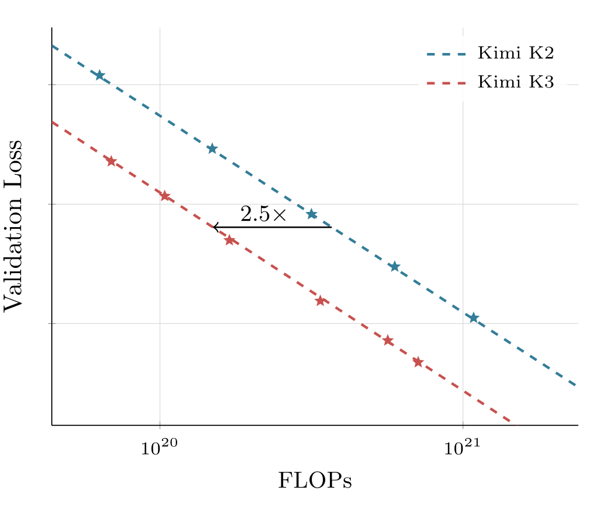
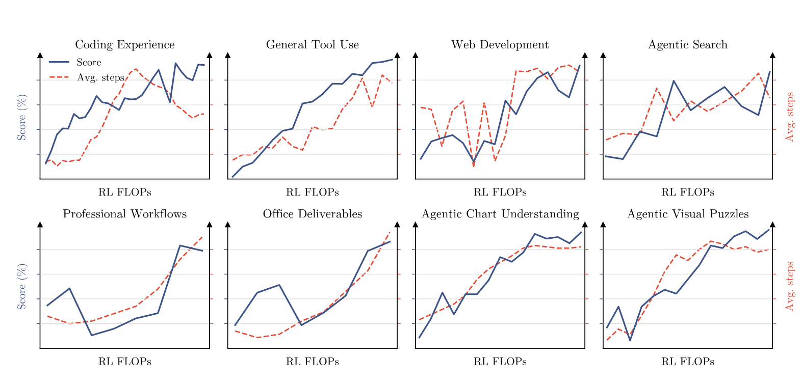
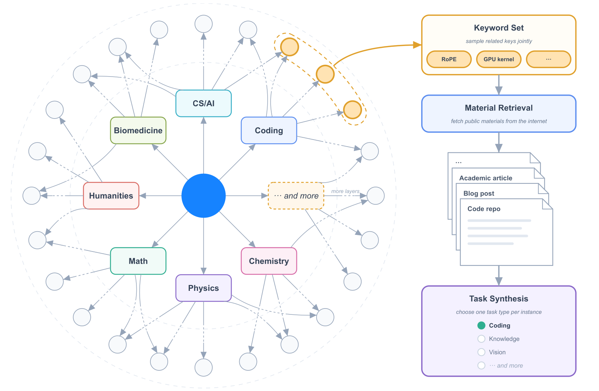
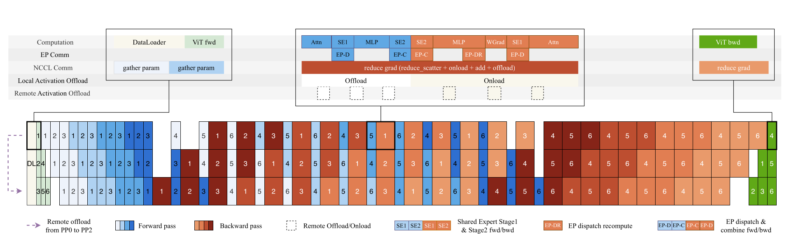
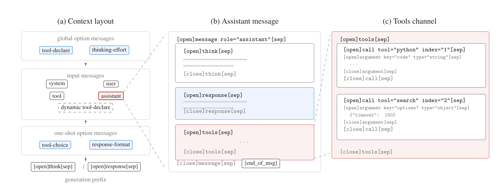

# Kimi K3：从三条信息流到完整系统

[Kimi K3](https://github.com/MoonshotAI/Kimi-K3)不是把一个已有 Transformer 单纯放大到 2.8T 参数。它把模型结构重新组织成三条相互配合的信息流：

- token 之间，由 Kimi Delta Attention（KDA）承担大部分有限状态混合，周期性 Gated MLA 保留全局内容寻址；
- layer 之间，由 Attention Residuals（AttnRes）把固定累加改成可学习的跨深度选择；
- channel 之间，由 Stable LatentMoE 在较窄的 latent space 中扩大专家池，同时保留全宽 shared path。

这三条结构线又被一套共同设计的训练与系统接住：原生视觉、Per-Head Muon、逐级长上下文训练，SFT → 多领域多 effort RL → Multi-Teacher On-Policy Distillation（MOPD），以及面向 3T 稀疏训练、百万 token rollout 和混合递推缓存的基础设施。[官方技术报告](https://github.com/MoonshotAI/Kimi-K3/blob/main/k3_tech_report.pdf)的真正价值，正是第一次把这些层面放进同一份系统叙事。

本页先重建整份报告的因果链；[Kimi 技术谱系](../kimi-timeline.md)解释各代工作怎样汇流，[Kimi k1.5](kimi-k1-5.md)、[Kimi K2](kimi-k2.md)、[Kimi K2.5](kimi-k2-5.md)与[Kimi-VL](../../multimodal/kimi-vl.md)分别展开长程 RL、稀疏预训练、原生多模态 agent 与视觉主干，[150 项引用图谱](../kimi-k3-reference-map.md)再逐项区分直接来源、技术前身、并行工作、benchmark 与比较对象。各个可复用机制分别进入[线性注意力](../../architecture/state-space-linear-attention.md)、[注意力与位置](../../architecture/attention-position.md)、[Mixture of Experts](../../architecture/moe.md)、[长上下文](../../architecture/long-context.md)、[Agentic RL 训练系统](../../agentic-rl/training-systems.md)和[推理缓存](../../inference/cache-reuse.md)等主干页面。

<figure class="paper-figure paper-figure--portrait" id="k3-figure-02" data-paper-source="kimi-k3" data-paper-asset="k3-figure-02" markdown="1">
[{ width="1967" height="1617" loading="lazy" decoding="async" }](../../assets/papers/kimi-k3/figure-02-architecture.png)
<figcaption><strong>三条信息流在同一个模型接口处合流。</strong>沿右侧主干自下而上看，视觉输入先进入共享 embedding；每个结构单元以三层 KDA 接一层 Gated MLA，再由 Stable LatentMoE 完成 channel mixing。红色支路不沿 token 展开，而是在不同深度的 block representation 之间重新分配权重。<span class="paper-figure__source">图源：<a href="https://raw.githubusercontent.com/MoonshotAI/Kimi-K3/521359a5cae5e79d02e5a2102c2cea9ce3b9b79a/k3_tech_report.pdf#page=3">Kimi K3 Technical Report, Figure 2, p. 3</a>；© 2026 Moonshot AI，<a href="https://github.com/MoonshotAI/Kimi-K3/blob/521359a5cae5e79d02e5a2102c2cea9ce3b9b79a/LICENSE">Kimi K3 License</a>。</span></figcaption>
</figure>

## 一张地图：K3 到底改变了什么

| 层面 | K3 的选择 | 直接解决的问题 | 新增代价或边界 |
| --- | --- | --- | --- |
| token mixing | 69 层 KDA + 24 层 Gated MLA | 大部分层用固定大小状态，周期性恢复全局寻址 | 两种状态、两套 kernel 与联合缓存语义 |
| depth mixing | 8 个 Block AttnRes block | 避免所有历史层只以单位权重累加 | 需要保存 block 表示并修改流水线通信 |
| channel mixing | 896 routed experts，top-16，2 shared experts | 在激活计算受控时扩大容量 | 路由均衡、all-to-all 与权重驻留更困难 |
| activation | RMSNorm + SiTU-GLU | 抑制 latent routed path 的内部爆炸 | 饱和区会压低大坐标梯度 |
| router | Quantile Balancing（QB） | 让近千专家更快接近目标负载 | 全局分位数估计成为系统原语 |
| vision | 从头训练 MoonViT-V2 | 让视觉表示直接服从 NTP，并改善联合训练稳定性 | “无需视觉预训练”只在作者配方内得到支持 |
| optimizer | Per-Head Muon | 不让大尺度 head 支配整块正交化 | 参数分组必须与真实 head layout 一致 |
| post-training | 3 domain × 3 effort experts → MOPD | 同时保留领域能力与推理预算控制 | teacher 路由、在线蒸馏和 rollout 成本上升 |
| 3T training | MoonEP + 细粒度内存策略 | 降低极端稀疏 MoE 的负载与显存压力 | 动态冗余 expert 与静态 buffer 增加复杂度 |
| 1M Agentic RL | partial rollout + external KV + AgentENV | 避免长尾轨迹卡住 learner，保存可恢复环境 | policy staleness、KV 一致性和环境隔离更难 |
| serving | hybrid prefix cache + recurrent replay | 同时复用 MLA KV 与 KDA state | 命中必须满足多状态的共同边界 |

这里最重要的不是任何一个缩写，而是接口闭环。只复制 KDA 公式而没有 FlashKDA/KCP，训练成本未必成立；只复制 896 个专家而没有 QB/MoonEP，通信尾部可能压垮吞吐；只把上下文长度改成 1M，而没有长数据、rollout 保存与混合缓存，也得不到报告中的长程系统。

## 模型账本与公开边界

[官方仓库](https://github.com/MoonshotAI/Kimi-K3)与[模型卡](https://huggingface.co/moonshotai/Kimi-K3)公开了以下主体：

| 字段 | Kimi K3 |
| --- | --- |
| 总参数 / 每 token 激活参数 | 2.78T / 104.2B |
| backbone 层数 | 93；首层为 dense layer |
| attention 组成 | 69 KDA + 24 Gated MLA；3:1 交错，末层为 MLA |
| hidden / heads / head dimension | 7168 / 96 / 128 |
| routed experts / top-$k$ / shared experts | 896 / 16 / 2 |
| latent width / 单 expert FFN width | 3584 / 3072 |
| context | 1,048,576 tokens |
| vision encoder | MoonViT-V2，401M，27 层，hidden 1024，12 heads，patch 14 |
| post-training quantization | expert weights MXFP4，expert activations MXFP8 |
| released vocabulary | config 为 163,840；报告表格以 160K 记述 |
| weights | 96 个 safetensors shard；模型库总量约 1.56 TB |

把 K2 放在旁边，才能看清参数增长之外的结构迁移：

| 字段 | Kimi K2 | Kimi K3 | 变化 |
| --- | ---: | ---: | --- |
| layers | 61 | 93 | $+52\%$ |
| total parameters | 1.04T | 2.78T | $+167\%$ |
| activated parameters | 32.6B | 104.2B | $+220\%$ |
| hidden | 7168 | 7168 | 不变 |
| latent MoE width | 无 | 3584 | 新增半宽 routed path |
| expert hidden | 2048 | 3072 | $+50\%$ |
| routed / active experts | 384 / 8 | 896 / 16 | expert pool 与 top-$k$ 同时扩大 |
| shared experts | 1 | 2 | 翻倍 |
| attention heads | 64 | 96 | $+50\%$ |
| training context | 128K | 1M | $8\times$ |
| attention | 61 MLA | 69 KDA + 24 MLA | 递推与全局寻址混合 |
| activation | SwiGLU | SiTU-GLU | 加入平滑有界分支 |
| MTP | 1 layer | 1 layer | 报告口径不变 |
| vision tower | 无 | 401M / 27 layers | 原生视觉路径 |

“2.8T”是四舍五入后的家族标签，报告表格给出 2.78T；“104B”同理，对应 104.2B。报告中的 160K vocabulary 是近似口径，[公开 config](https://huggingface.co/moonshotai/Kimi-K3/blob/main/config.json)给出精确值 163,840。规格比较必须保留这类“报告展示值”和“checkpoint 机器值”的差别。

config 还把若干论文叙述落成机器契约：`attn_res_block_size=12`、`short_conv_kernel_size=4`、Q/ KV latent rank 分别为 1536 / 512、`rms_norm_eps=1e-5`、KDA lower bound 为 $-5$，并显式列出 69 个 KDA layer 与 24 个 full-attention layer。`mla_use_nope=true`才是 released checkpoint 不使用 MLA RoPE 的直接证据；同一 config 中为兼容实现保留某个 RoPE-shaped 字段，不能反向推翻这项开关。

权重使用[Kimi K3 License](https://github.com/MoonshotAI/Kimi-K3/blob/main/LICENSE)，不是 Apache-2.0 或 MIT。许可证允许广泛使用、修改、分发和商业部署，但为达到特定收入门槛的 Model-as-a-Service 业务设置了另行协议要求，也为超大规模商业产品设置了显著标识义务。因此更准确的表述是 **open-weight under the Kimi K3 License**；“权重可下载”不自动等价于 OSI 意义上的开源软件。

报告没有公开预训练总 token、各数据源比例、训练 FLOPs、GPU 数量与训练时长，也没有给出完整 learning rate、batch size、tokens-per-parameter 搜索结果。后训练同样没有披露 RL 的完整优化公式、partial-rollout 完成比例 $\lambda$、per-token regularizer、阶段 token 预算、九个 expert 的训练量和主要消融原始数值。这些未知量决定了目前可以理解设计，却还不能从报告独立复现整套 K3。

## token 维：KDA 与周期性全局寻址

### KDA 是带逐通道遗忘的 delta rule {#kda-recurrence}

对单个 head，令

$$
q_t,k_t\in\mathbb R^{d_k},\qquad
v_t\in\mathbb R^{d_v},\qquad
S_t\in\mathbb R^{d_k\times d_v}.
$$

KDA 的递推为

$$
S_t=
\left(I-\beta_tk_tk_t^\top\right)
\operatorname{Diag}(\alpha_t)S_{t-1}
+\beta_tk_tv_t^\top,
\qquad
\widetilde o_t=S_t^\top q_t.
$$

$\alpha_t\in(0,1)^{d_k}$ 先按 key channel 衰减旧状态，$\beta_t\in(0,1)$ 再控制 delta-rule 写入。把第一项展开，更容易看见它在做什么：

$$
S_t=
\operatorname{Diag}(\alpha_t)S_{t-1}
+\beta_tk_t
\left(
v_t^\top-k_t^\top\operatorname{Diag}(\alpha_t)S_{t-1}
\right).
$$

当前 key 先读取衰减后的旧预测，再只写入预测残差。它比无条件累加更能纠正旧关联，又比完整 KV history 更早地把历史压进固定状态；有限状态的 key 冲突并没有消失。

下面的 reference 同时锁定“先 decay、再 delta correction”和当前 token 写后可读的语义：

```python
import torch
def kda_step(state, key, value, beta, alpha, query):
    decayed = alpha[:, None] * state
    error = value - key @ decayed
    state = decayed + beta * torch.outer(key, error)
    return state, query @ state
state = torch.tensor([[1., 2.], [3., 4.]])
key = torch.tensor([1., 0.])
value = torch.tensor([5., 6.])
state, out = kda_step(
    state, key, value, torch.tensor(1.), torch.tensor([.5, .25]), key
)
torch.testing.assert_close(state[0], value)
torch.testing.assert_close(state[1], torch.tensor([.75, 1.]))
torch.testing.assert_close(out, value)
```

### 从投影到 Chunkwise 的完整接口 {#kda-chunkwise}

报告式 (2)把单个 head 的输入链写成

$$
q_t^h,k_t^h
=
\operatorname{L2Norm}
\left(
\operatorname{Swish}
\left(
\operatorname{ShortConv}(W_{q/k}^h x_t)
\right)
\right),
$$

$$
v_t^h
=
\operatorname{Swish}
\left(
\operatorname{ShortConv}(W_v^h x_t)
\right),
\qquad
\beta_t^h=\operatorname{Sigmoid}(W_\beta^h x_t),
$$

$$
z_t^h
=
W_{\alpha}^{\uparrow}
W_{\alpha}^{\downarrow}x_t+b_\alpha^h.
$$

ShortConv 提供局部顺序信号，Q/K 的 L2 normalization 约束 delta update 的几何尺度，低秩投影与 head-specific bias 则生成逐 key-channel 的 decay logit。$z_t^h$ 到 retention $\alpha_t^h$ 的映射由后面的式 (5)完成；不能把 projection chain 与 decay parameterization 合成一个未注明版本的 “KDA gate”。

对一个长度为 $C$ 的 chunk $c$，报告式 (3)定义

$$
\gamma_{[c]}^{i\rightarrow j}
=
\prod_{r=i}^{j}\alpha_{r,[c]},
\qquad
\Gamma_{[c]}^{1\rightarrow C}
=
\begin{bmatrix}
\gamma_{[c]}^{1\rightarrow 1}\\
\vdots\\
\gamma_{[c]}^{1\rightarrow C}
\end{bmatrix}.
$$

UT transform 从当前 chunk 的 K、V、$\beta$ 产生 $U_{[c]}$ 与 $W_{[c]}$，并定义 pseudo-value

$$
\widetilde V_{[c]}=U_{[c]}-W_{[c]}S_{[c]}.
$$

于是式 (4)为

$$
A_{[c]}
=
\operatorname{Tril}
\left[
\left(Q_{[c]}\odot\Gamma_{[c]}^{1\rightarrow C}\right)
\left(K_{[c]}/\Gamma_{[c]}^{1\rightarrow C}\right)^\top
\right],
$$

$$
O_{[c]}
=
\underbrace{
\left(\Gamma_{[c]}^{1\rightarrow C}\odot Q_{[c]}\right)S_{[c]}
}_{\text{inter-chunk}}
+
\underbrace{
A_{[c]}\widetilde V_{[c]}
}_{\text{intra-chunk}}.
$$

`Tril` 保留对角线，因为当前位置读取的是完成当前 token update 后的 state。第一项携带进入 chunk 的历史，第二项并行计算 chunk 内的因果相互作用；UT transform 的完整递推推导属于 Kimi Linear，但 K3 的数值改动正作用在这里出现的累计 decay 除法上。

### 下界 log-decay 是一个 kernel 设计 {#bounded-decay}

[Kimi Linear](https://arxiv.org/abs/2510.26692)使用无下界的负 Softplus log-decay。K3 改成

$$
g_t=g_{\min}\operatorname{Sigmoid}\!\left(e^Az_t\right),
\qquad
\alpha_t=e^{g_t},
\qquad
g_{\min}=-5.
$$

因此 $g_t\in(-5,0)$，每步 retention 满足 $\alpha_t\in(e^{-5},1)$。KDA 的 chunkwise 形式需要除以 chunk 内累计 decay；若一个 Tensor Core tile 含 16 个 token，则

$$
-80<\sum_{r=1}^{16}g_r<0,
\qquad
1<\exp\!\left(-\sum_{r=1}^{16}g_r\right)<e^{80}.
$$

$e^{80}$ 仍在 BF16 指数范围内。于是 diagonal tile 不必再逐 position pair 处理，也能走 dense Tensor Core path。这个改动同时改变了函数族和硬件路径：模型不再能在一步里给某个 channel 任意强的遗忘，但换来一个可证明的 tile 数值界。

```python
import math
import torch
def bounded_decay(logit, log_scale, floor=-5.0):
    log_decay = floor * torch.sigmoid(log_scale.exp() * logit)
    return log_decay, log_decay.exp()
z = torch.tensor([-100., 0., 100.])
g, alpha = bounded_decay(z, torch.tensor(0.))
assert torch.all((g >= -5) & (g <= 0))
assert torch.all((alpha >= math.exp(-5)) & (alpha <= 1))
assert math.exp(80) < torch.finfo(torch.bfloat16).max
```

这解释了 KDA 中一个常见但危险的误读：`linear in sequence length` 只描述计算随 $T$ 的阶数，不代表状态很小、kernel 自动高效或任意长时都数值稳定。[下界与 diagonal tile 的对照图](kimi-linear-flashkda.md#k3-figure-03)把函数值域和执行路径放在同一视野中；KDA 从 fast weights、DeltaNet 到 Kimi Linear、FlashKDA 与 KCP 的完整演化也在该页展开，稳定机制定义见[状态空间与线性注意力](../../architecture/state-space-linear-attention.md)。

K3 还把 Kimi Linear 的低秩 output gate 换成输入相关的 full-rank channel projection。若 $\widetilde o_t$ 是 recurrent output，报告式 (6)为

$$
y_t
=
W_o\!\left[
\operatorname{Sigmoid}(W_gx_t)
\odot
\operatorname{RMSNorm}(\widetilde o_t)
\right].
$$

这里的 full-rank 说的是 $W_g$ 能直接产生逐 channel gate；它不是在改变 recurrent state 的秩，也不能与 KDA 的低秩状态更新混为一谈。

### 为什么仍保留 24 层 MLA

有限状态擅长压缩、流式更新和低成本 decode，却不能无损保存百万 token 中的任意细节。K3 因而每三层 KDA 插入一层 Gated MLA，最后再加一层 MLA：

```text
(KDA -> KDA -> KDA -> Gated MLA) × repeated blocks -> final Gated MLA
```

[Multi-head Latent Attention](https://arxiv.org/abs/2405.04434)把每个 token 的 K/V 内容压入低维 latent cache，再恢复各 head 的内容 key/value；它仍提供全局 token-to-token attention。K3 的所有 MLA layer 都采用 NoPE，由相邻 KDA 提供顺序与 recency signal，并在输出端加入 full-rank channel gate。

对未门控的 MLA 输出 $\widetilde o_t$，报告式 (7)为

$$
y_t
=
W_o\!\left[
\operatorname{Sigmoid}(W_gx_t)
\odot
\widetilde o_t
\right].
$$

KDA 版本在 gate 前先对 recurrent output 做 head-wise RMSNorm，MLA 版本没有这一项；两式共享 full-rank gate 的形状，却不是可以直接互换的同一条计算路径。

这种混合不是“线性注意力已经等价于 softmax attention”，而是明确承认二者信息能力不同：

- KDA 让大多数层以固定递推状态处理长序列；
- MLA 定期重新打开全局内容寻址；
- NoPE 避免 1M 扩展时另做 RoPE 插值，但有效长程利用仍要由训练数据和评测证明；
- 最后一层 MLA 让最终输出在离开 backbone 前再次拥有全局交互。

报告还披露 MLA 训练输出保留 FP32，以修正 flash attention 的偏置舍入误差；为容纳翻倍的 on-chip output tile，kernel 改为与 KV staging buffer 复用 shared memory。数值精度的选择因此直接反向塑造了流水线深度。

## depth 维：Attention Residuals {#attention-residuals}

### PreNorm 的隐藏问题

标准 PreNorm residual 写成

$$
h_{\ell+1}=h_\ell+f_\ell(\operatorname{Norm}(h_\ell)).
$$

递归展开后，所有历史层输出以固定单位权重累加。随着深度增加，单层更新在总残差流中的相对占比可能被稀释；而每一层只能接收已经压缩成一个向量的 $h_\ell$。这在 depth 维上很像 attention 出现前的时间递推瓶颈。

[Attention Residuals](https://arxiv.org/abs/2603.15031)让第 $\ell$ 层用一个可学习 pseudo-query $w_\ell$ 对 embedding 与此前 layer output 做 softmax：

$$
k_i=v_i=
\begin{cases}
h_1,&i=0,\\
f_i(h_i),&1\le i<\ell,
\end{cases}
$$

$$
\alpha_{i\rightarrow\ell}
=
\frac{
\exp\left(w_\ell^\top\operatorname{RMSNorm}(k_i)\right)
}{
\sum_{j<\ell}
\exp\left(w_\ell^\top\operatorname{RMSNorm}(k_j)\right)
},
\qquad
h_\ell=\sum_{i<\ell}\alpha_{i\rightarrow\ell}v_i.
$$

RMSNorm 用于避免大范数历史层仅凭尺度占据 softmax。pseudo-query 是 layer-specific、内容选择则来自 key；它不是 token 自注意力的又一层，而是对 depth sources 的动态选择。

```python
import torch
import torch.nn.functional as F
def attention_residual(sources, query, eps=1e-6):
    scale = sources.square().mean(-1, keepdim=True).add(eps).rsqrt()
    key = sources * scale
    weight = F.softmax(key @ query, dim=0)
    return weight @ sources, weight
sources = torch.tensor([[1., 0.], [0., 2.], [3., 1.]])
out, weight = attention_residual(sources, torch.tensor([1., 0.]))
torch.testing.assert_close(weight.sum(), torch.tensor(1.))
assert out.shape == (2,) and torch.all(weight > 0)
```

### Block AttnRes 为什么更像系统结构

Full AttnRes 只有 $L<100$ 时，$O(L^2d)$ 算术并不可怕；真正昂贵的是保存 $O(Ld)$ 历史输出，以及 pipeline parallel stage 之间搬运它们。Block AttnRes 把 $L$ 层分成 $N$ 个 block：

1. block 内的 layer output 逐步求和，形成当前 partial block state；
2. 跨 block 只对 embedding、已完成 block 与当前 partial block 做 depth attention；
3. 最终层聚合全部 block representation。

报告式 (10)把第 $n$ 个 block 内第 $i$ 层实际可读取的 value layout 写得更精确。令 $b_0=h_1$ 为 embedding，$b_1,\ldots,b_{n-1}$ 为已完成 block，$b_n^{i-1}$ 为当前 block 在进入第 $i$ 层前的 partial sum，则

$$
V_{n,i}
=
\begin{cases}
[b_0,b_1,\ldots,b_{n-1}]^\top,&i=1,\\
[b_0,b_1,\ldots,b_{n-1},b_n^{i-1}]^\top,&i\ge2.
\end{cases}
$$

因此“block summary”不是每层都已完成的一组固定向量：当前 block 只有一个随层推进的 partial source，最后的 output layer 才读取全部 $N$ 个完成 block。这个布局也决定 cache key 必须包含 block completion state。

这样 live state 从 $O(Ld)$ 降至 $O(Nd)$。K3 使用 8 个、每个 12 层的 block；93 层让最后一个 block 不满，加上 embedding 共有 9 个 depth source。在线 softmax 可把并行的 inter-block 项与顺序的 intra-block partial sum 合并。

其收益不能只归结为“更好的 residual”。它改变了：

- activation checkpoint 应保存哪些 block boundary；
- pipeline stage 如何增量传递 block cache；
- speculative draft 从哪些深度抽特征；
- prefill 和 decode 时 depth state 如何在 sequence parallel rank 间同步。

从 PreNorm dilution、Full/Block AttnRes 到 online softmax 与 pipeline cache 的完整推导见[Attention Residuals](attention-residuals.md)；稳定结构接口见[注意力与位置](../../architecture/attention-position.md)，训练期通信则见[模型并行](../../systems/model-parallelism.md)。

## channel 维：Stable LatentMoE

### latent path 让专家数和全宽通信解耦 {#latent-path}

普通 sparse MoE 让每个 routed expert 都处理 $d$ 维 token。K3 采用[LatentMoE](https://arxiv.org/abs/2601.18089)的宽窄分工：

$$
z=W_\downarrow x\in\mathbb R^\ell,
\qquad
u=\sum_{i\in T_k(x)}p_iE_i^{\text{routed}}(z),
$$

$$
y=
\sum_{j=1}^{N_s}E_j^{\text{shared}}(x)
+W_\uparrow\operatorname{RMSNorm}(u).
$$

shared experts 仍在完整宽度 $d=7168$ 上承担通用变换，896 个 routed experts 在 $\ell=3584$ 的 latent space 中分工。每 token 激活 16 routed + 2 shared experts；报告把 routed sparsity 记作 $896/16=56$。

K3 相比原始 LatentMoE 在 routed aggregation 和 up-projection 之间加入 RMSNorm。它不是给 router 归一化，而是稳定多个 expert 混合后的 latent activation，使 $W_\uparrow$ 不必同时追随路由组合造成的尺度漂移。

### SiTU-GLU 给乘法激活加上平滑上界 {#situ-glu}

SwiGLU 的 gate 和 up branch 都可能无界。K3 定义

$$
\operatorname{softcap}(x;\beta)=\beta\tanh(x/\beta),
$$

$$
\operatorname{SiTU\text{-}GLU}(a,b)
=
\left[
\beta_1\tanh(a/\beta_1)\odot\sigma(a)
\right]
\odot
\left[
\beta_2\tanh(b/\beta_2)
\right],
$$

并取 $\beta_1=4,\beta_2=25$。因为 $|\tanh|\le1$ 且 $0<\sigma<1$，

$$
\left\|
\operatorname{SiTU\text{-}GLU}(a,b)
\right\|_\infty
\le\beta_1\beta_2=100.
$$

又因为

$$
\beta\tanh(x/\beta)
=
x-\frac{x^3}{3\beta^2}
+O\!\left(\frac{x^5}{\beta^4}\right)
=
x+O\!\left(\frac{x^3}{\beta^2}\right),
$$

它在原点附近保留 SwiGLU 的一阶行为；偏离 identity 的速度还显式受 $\beta^{-2}$ 控制。与 hard clamp 相比，softcap 连续可微；代价是进入饱和区后梯度逐渐变小。

```python
import torch
def situ_glu(gate, up, beta_gate=4., beta_up=25.):
    gate = beta_gate * torch.tanh(gate / beta_gate) * torch.sigmoid(gate)
    up = beta_up * torch.tanh(up / beta_up)
    return gate * up
x = torch.linspace(-1000, 1000, 10001)
y = situ_glu(x, x)
assert y.abs().max() <= 100.0001
near = torch.tensor([1e-4])
silu_glu = near * torch.sigmoid(near) * near
torch.testing.assert_close(situ_glu(near, near), silu_glu, rtol=1e-4, atol=1e-10)
```

### Quantile Balancing 把路由均衡变成分位数问题 {#quantile-balancing}

router 先计算不含 bias 的 sigmoid score

$$
s_i=\operatorname{Sigmoid}(W_rx_i),
$$

用 $s_i+b$ 选择 top-$k$ expert，但 mixture weight 仍由原始 score 归一化：

$$
T_i=\operatorname{arg\,topk}(s_i+b),
\qquad
p_{i,j}=\frac{s_{i,j}}{\sum_{r\in T_i}s_{i,r}}.
$$

因此 bias 只改变 dispatch，不直接改变混合权重或 router 的任务梯度。早期 auxiliary-loss-free 方法按负载高低以固定步长更新 bias；近千 expert 下，步长太小追不上分布，太大又会来回震荡。

QB 在当前 biased score 上取 top-$(k+1)$，把第 $k+1$ 个值记为 token cutoff $\alpha_i^{(t)}$。对第 $j$ 个 expert 构造 margin

$$
m_{i,j}=s_{i,j}-\alpha_i^{(t)}.
$$

若 batch 有 $m$ 个 token、$n$ 个 expert，目标负载为 $q=mk/n$。下一步 bias 取

$$
\widehat b_j^{(t+1)}
=-\operatorname{quantile}_{1-k/n}(m_{:,j}),
\qquad
b^{(t+1)}
=\widehat b^{(t+1)}
-\operatorname{mean}(\widehat b^{(t+1)})\mathbf1.
$$

它等价于选择一个阈值，让无 tie 时恰有 $q$ 个 margin 越过 cutoff。新 bias 只能用于下一 batch，不能用当前 batch 的 margin 重新路由当前 batch；推理时冻结。

```python
import torch
def quantile_balance(raw_score, old_bias, top_k):
    biased = raw_score + old_bias
    cutoff = biased.topk(top_k + 1, dim=-1).values[:, -1]
    margin = raw_score - cutoff[:, None]
    q = 1 - top_k / raw_score.size(1)
    new_bias = -torch.quantile(margin, q, dim=0)
    return new_bias - new_bias.mean()
score = torch.tensor([[.9, .2], [.8, .1], [.7, .6], [.6, .7]])
bias = quantile_balance(score, torch.zeros(2), 1)
assert bias.shape == (2,)
torch.testing.assert_close(bias.mean(), torch.tensor(0.))
```

全局 batch 的 margin 数以百万计，实际实现不 gather 全量值，而为每个 expert 建直方图，all-reduce 各 bin 的整数 count，再从累计计数恢复 quantile。若 bin width 为 $\Delta$，未做 bin 内插值时阈值误差不超过一个 bin；count 的可加性保证结果对应全局 token 池，而不是 rank-wise quantile 的错误平均。[一次 coordinate update 的路由变化](latentmoe-quantile-balancing.md#k3-figure-05)给出直观读法；LatentMoE 原作与 K3 的 RMSNorm、SiTU、QB 增量也在该页展开，稳定路由几何见[Mixture of Experts](../../architecture/moe.md)，通信与负载尾部见[MoE 系统](../../systems/moe-systems.md)。

## 原生视觉与 Per-Head Muon

### MoonViT-V2 从 next-token prediction 开始

K3 不从 SigLIP checkpoint 初始化视觉塔，而把 401M 参数的 MoonViT-V2 与语言 backbone 从训练开始共同置于 next-token prediction（NTP）目标下。报告给出的直接证据是：在作者消融中，从头训练的 MoonViT-V2 比 SigLIP 初始化的 MoonViT-3D 有更低的 vision-tower gradient norm 和更少 spike，并在其视觉评测上达到相当结果。

这支持“在 K3 的规模、数据与目标下，从头训练是可行且更稳定的初始化”，并不证明所有 VLM 都应放弃对比预训练。小数据、冻结 backbone 或专业视觉领域仍可能依赖预训练表示。

视觉路径包括：

- 27-layer ViT、RMSNorm、linear/attention projection 无 bias；
- 图像与视频共享参数；
- spatial attention 与 temporal attention 分解；
- temporal pooling 压缩视频 token；
- 投影进 LLM 前做 $2\times2$ pixel shuffle，使视觉 token 数缩小为四分之一；
- 单张输入最高 3584×3584；
- 坐标监督同时使用绝对坐标与 $[0,1]$ 归一化坐标。

“native”在这里至少包括从训练初期共同优化与进入同一 token stream；它不意味着模型直接生成像素，K3 仍通过代码、工具和渲染结果完成视觉创作闭环。架构与数据边界见[多模态融合与训练](../../multimodal/architecture-training.md)。

### 为什么 Muon 要按 head 切块

K3 延续 K2：matrix parameter 使用 Muon，其他参数使用适合其形状的更新。对 Q/K/V projection，K3 不对完整 momentum matrix 一次 Newton–Schulz orthogonalization，而先沿 head dimension 切成 block，再逐 head 正交化。

若某些 head 的 momentum 范数远大于其他 head，整矩阵正交化会把它们耦合在同一个更新几何中；逐 head 处理使不同 head 获得更接近的尺度控制，且 tall head block 的迭代成本略低。这里的“per-head”是参数 layout 契约：GQA、MLA latent projection、fused QKV 或 tensor-parallel shard 都需要先说明哪一维真实对应 head，不能只按任意固定长度 reshape。

Muon 的矩阵更新、Newton–Schulz 近似与向量参数分流见[优化器家族](../../training/optimizer-families.md)。

## 预训练：结构收益必须在自己的最优配方上比较

### 数据不是一个统一池

文本分为 Web、Code、Mathematics、Knowledge 四个主要域；每个域分别经过规则过滤、classifier quality scoring 与去重，并用小模型消融确定 sampling rate。知识与数学材料沿用 K2 的 rephrasing 思路：改变风格和视角、按 chunk 自回归改写，并验证对 source 的 fidelity。

视觉数据包括 caption、interleaved image–text、OCR、perception、video 与 visual coding。尤其重要的是 programmatic multimodal data：代码与其渲染结果成对出现，覆盖 SVG、3D asset、webpage、game、CAD schematic。模型不仅看“图像对应什么文本”，也看“程序怎样产生可验证视觉状态”。

这些做法可分别归入[来源与溯源](../../data/sources-provenance.md)、[清洗与去重](../../data/filtering-dedup.md)、[混合与课程](../../data/mixtures-curricula.md)与[合成数据](../../data/synthetic-data.md)。报告没有给出各域比例、公开数据清单、许可构成或 contamination audit，因而无法从数据描述推断具体来源或 benchmark 洁净度。

### 2.5× 是整套 family 的拟合结果

K3 为新架构重新搜索 batch size、learning rate、tokens-per-parameter 与 model shape。作者在 held-out OOD validation 上拟合 scaling curve，并报告相对 K2 约 2.5× overall scaling efficiency。

<div markdown="block">
<figure class="paper-figure paper-figure--portrait" id="k3-figure-07" data-paper-source="kimi-k3" data-paper-asset="k3-figure-07" markdown="1">
[{ width="1033" height="879" loading="lazy" decoding="async" }](../../assets/papers/kimi-k3/figure-07-scaling.png)
<figcaption><strong>“2.5×”读的是同一 validation loss 上的横向 FLOPs 间距。</strong>它是 K2 与 K3 两套 family-level 拟合曲线之间的相对位移；纵轴不是 benchmark 分数，横轴也不是线上吞吐，因此不能把箭头拆给某一个模块或直接换算成服务成本。<span class="paper-figure__source">图源：<a href="https://raw.githubusercontent.com/MoonshotAI/Kimi-K3/521359a5cae5e79d02e5a2102c2cea9ce3b9b79a/k3_tech_report.pdf#page=11">Kimi K3 Technical Report, Figure 7, p. 11</a>；© 2026 Moonshot AI，<a href="https://github.com/MoonshotAI/Kimi-K3/blob/521359a5cae5e79d02e5a2102c2cea9ce3b9b79a/LICENSE">Kimi K3 License</a>。</span></figcaption>
</figure>
</div>

这个数字只支持“架构、数据、训练 recipe 的组合在该拟合口径下移动了 loss–FLOPs 曲线”，不能拆分成“KDA 单独带来 2.5×”或“同等线上成本快 2.5×”。报告没有公开拟合系数、置信区间、原始点或 component-wise attribution。

同一实验还给出一个很有普适性的教训：cosine 与 Warmup Stable Decay（WSD）要分别搜索 peak LR 和 batch size。作者在各自最优超参数下观察到 cosine 更低的 final loss；用一套共享超参数比较 schedule，测到的可能只是超参数偏爱，而不是 schedule 本身。实验设计见[缩放与实验设计](../../training/scaling-experiment-design.md)。

最终预训练 recipe 使用 Per-Head Muon、继承自 K2 的 weight clipping、cosine learning-rate schedule、前 1% step 做 linear warmup，并把 weight decay 固定为 $0.1$。报告没有公开 peak learning rate、batch size、clipping threshold 或 scheduler 的最低学习率；这些已披露常数不能替代完整 optimizer 配方。

### 一条逐渐变贵的长度课程

主预训练先从 8K 扩到 64K，cooldown 再从 256K 扩到 1M：

```text
pre-training: 8K -> 64K
cooldown:               256K -> 1M
```

长文档先做 exact/fuzzy dedup、binary/truncation/log 结构检查与质量过滤；视频再做 frame perceptual hashing。自然长文和长视频相对稀缺，因此 cooldown 中上采样。为了避免“序列很长、答案仍只依赖局部”，K3 还打乱并拼接多模态文档和子任务，让必要证据分散在完整窗口中。

长序列只集中在训练预算的一小部分，说明 1M 是逐级适配后的最大窗口，不是所有预训练 token 都以 1M 长度出现。NoPE 省去了 RoPE rescaling，却不能替代有效长度、retrieval depth、干扰鲁棒性和 long-horizon task success 的测量。详见[长上下文](../../architecture/long-context.md)。

## 后训练：九个专家如何重新合成一个模型

### 三阶段闭环

后训练主线是

```text
SFT cold start -> 3 domains × 3 efforts = 9 RL experts -> MOPD
      \_________________ QAT throughout _________________/
                                               -> draft fine-tuning
```

SFT 轨迹由此前 Kimi 系列的 domain-specialized model 生成，经过多阶段验证与人工标注，并统一序列化为 XTML。这个阶段建立 adaptive reasoning、tool calling 与长程执行的初始分布。QAT 不是 MOPD 之后才开始的收尾步骤：它贯穿整个 post-training，覆盖 SFT 与 RL；draft fine-tuning 则沿用同一量化配置。

RL 的三个 domain 是：

1. general：通用体验、视觉、推理、faithfulness、search、knowledge work；
2. general agent：长时 assistant、deep research、段落级写作；
3. coding agent：SWE、coding experience、kernel、web development。

每个 domain 训练 low、high、max 三档 effort，形成九个 teacher。effort 不是推理时随意截断：对问题 $x$ 先由 cold-start policy 估计预算 $b_0(x)$，若输出总量

$$
T(y)>\tau b_0(x),
$$

则 task reward 被覆盖为 $-1$。general task 的 $T$ 只数 thinking token；agentic task 则数累计 output，包括 reasoning 与 tool-call argument。训练从较大 $\tau$ 的 max 开始，再逐步减小得到 high 和 low；每个 domain 的阈值仍有人在回路中调整。

这种 hard budget curriculum 能形成可部署的 effort 档位，但会在阈值处产生不连续 reward，也可能把“更短”误当成“更高效”。报告没有给出各档 $\tau$、预算分布和质量–长度 Pareto curve。

<figure class="paper-figure paper-figure--wide" id="k3-figure-08" data-paper-source="kimi-k3" data-paper-asset="k3-figure-08" markdown="1">
[{ width="1571" height="758" loading="lazy" decoding="async" }](../../assets/papers/kimi-k3/figure-08-rl-scaling.png)
<figcaption><strong>更多 RL 计算常伴随更高分数，也常伴随更长轨迹。</strong>八个 panel 的趋势并不完全同步：有些任务平滑增长，有些明显波动或延迟起效。蓝线与红线共同提醒我们，能力 scaling 不能脱离 assistant steps、环境难度与采样协议来读；这些曲线也没有提供单个算法组件的因果归因。<span class="paper-figure__source">图源：<a href="https://raw.githubusercontent.com/MoonshotAI/Kimi-K3/521359a5cae5e79d02e5a2102c2cea9ce3b9b79a/k3_tech_report.pdf#page=13">Kimi K3 Technical Report, Figure 8, p. 13</a>；© 2026 Moonshot AI，<a href="https://github.com/MoonshotAI/Kimi-K3/blob/521359a5cae5e79d02e5a2102c2cea9ce3b9b79a/LICENSE">Kimi K3 License</a>。</span></figcaption>
</figure>

### partial rollout 不是 SAO

每轮对 $N$ 个 prompt 各采样 $K$ 条 completion，共维护 $NK$ 条 active trajectory。当完成比例达到 $\lambda$ 时，generation 暂停，learner 开始优化；未完成轨迹排队到下一轮优先恢复。只有同一 prompt 的 $K$ 条结果都完成，才形成可优化的 group。

它减少“每一轮必须等待最慢 trajectory”的 wall-clock barrier，却仍保留 group sampling。与[SAO](sao-compactionrl.md#sao)的 single-rollout、critic-based 更新不同，K3 partial rollout 是调度层的跨 iteration 暂停/恢复。长轨迹因此会跨越多个 policy version；报告只说一个未展开的 per-token regularization 能容忍 extreme off-policy，没有给出公式、系数和消融。不能把这句描述补写成 PPO clip、DIS 或任何已知算法。

### Agentic GRM 把评分过程也变成轨迹

非可验证 general task 使用 tournament-style binary comparison。judge 必须：

1. 阅读最终产品或文本；
2. 生成任务专属 rubric；
3. 逐候选按 rubric 打分；
4. 把 rubric 与分数写入 scorepad。

为抑制“越长越容易赢”，若候选长度超过 cold-start verbosity $\ell_0$ 的 $\sigma$ 倍，就自动输掉比较。这个机制限制一种 reward hacking，却不能保证 rubric 没有偏见、judge 不受 presentation style 影响或短答案不会漏掉关键内容。生成式裁判的校准与污染见[生成式裁判](../../evaluation/generative-judges.md)。

### MOPD：teacher 差异变成逐 token dense reward {#mopd}

对 domain $d$、effort $e$，student 自己 on-policy 采样 token $y_t$，对应 teacher 提供

$$
r_{\text{OPD}}^d(y_t\mid e,x,y_{<t})
=
\operatorname{clip}
\left(
\operatorname{sg}
\log
\frac{
\pi_{\text{teacher}}^{(d,e)}(y_t\mid x,y_{<t})
}{
\pi_\theta(y_t\mid e,x,y_{<t})
},
-R_{\max},R_{\max}
\right).
$$

它把 teacher 相对 student 更偏好的 sampled token 变成正 dense reward，反之为负；stop-gradient 防止 reward 自身参与反传，clip 抑制极端 log-ratio。因为 token 来自 student，而不是 teacher 离线数据，训练状态更贴近部署 policy。报告称 top-$k$ distillation 在其设置中没有改善收敛或最终性能，但未公开 $k$、teacher logits 传输成本和对照细节。

```python
import torch
def mopd_reward(teacher_logp, student_logp, limit):
    return (teacher_logp - student_logp).detach().clamp(-limit, limit)
teacher = torch.tensor([-1., -8., -2.])
student = torch.tensor([-3., -2., -2.])
reward = mopd_reward(teacher, student, 2.)
torch.testing.assert_close(reward, torch.tensor([2., -2., 0.]))
assert not reward.requires_grad
```

MOPD 的公式只定义 dense signal，并没有完整规定 return、advantage、KL、采样更新比或九个 teacher 的 mixture schedule。蒸馏的不同数据分布见[知识蒸馏](../../training/distillation.md)，RL 中 current/behavior/reference identity 见[训推分布与策略滞后](../../reinforcement-learning/training-inference-discrepancy.md)。

### QAT 与 EAGLE-3 都从部署路径倒推训练 {#deployment-aware}

expert weight 占据绝大部分参数内存，K3 只把 routed expert weight 量化为 MXFP4、activation 量化为 MXFP8；attention、latent projection、shared expert、router、vision/projector 和 LM head 保持更高精度。[公开 config](https://huggingface.co/moonshotai/Kimi-K3/blob/main/config.json)还给出 group size 32。QAT 从 SFT 持续到 RL，rollout 与 learner 使用同一量化路径，直接减少 policy engine mismatch。

预训练时的一层 MTP 被微调成 EAGLE-3 draft：

- target backbone 冻结；
- draft 只含一个与 backbone block 对齐的 decoder layer；
- 训练 unroll 7 步，后续步使用 draft 自身前序输出；
- 输入融合第 1、第 4 和最终 AttnRes block 的低、中、高层特征；
- projection 初始化为 $[0,0,I]$，初始只看高层特征，保持与 MTP 预训练输入一致；
- 不用普通 next-token CE，而直接最小化 lossless speculative sampling 的接受率损失。

若 target 分布为 $p$、draft 为 $q$，单步最大耦合接受率为

$$
A(p,q)=\sum_{x\in\mathcal V}\min(p(x),q(x)),
\qquad
\mathcal L_{\text{LK}}=-\log A(p,q).
$$

```python
import torch
def lk_loss(target_prob, draft_prob):
    overlap = torch.minimum(target_prob, draft_prob).sum(-1)
    return -overlap.clamp_min(1e-12).log()
p = torch.tensor([[.7, .2, .1]])
q = torch.tensor([[.6, .1, .3]], requires_grad=True)
loss = lk_loss(p, q)
torch.testing.assert_close((-loss).exp(), torch.tensor([.8]))
loss.sum().backward()
assert q.grad is not None
```

公开 backbone config 的 `num_nextn_predict_layers` 为 0，并不与报告必然矛盾：MTP 已被转成单独 draft 时，发布的 target checkpoint 无需继续带 next-token layer。部署时是否同时提供对应 draft，仍需按具体发布 artifact 核对。详见[推测解码](../../inference/speculative-decoding.md)。

## 任务生成：环境不是 prompt 的背景板

### white-box harness distribution

K3 把 agent harness 拆成可配置部件：tool schema、system instruction、context、skills、memory、subagent 和运行时策略。训练环境可实例化成 Kimi Code、Claude Code、Codex、OpenClaw、Hermes 等不同 scaffold，而不是只在一种产品模板中优化。

这样做的目标是让 policy 学到跨 harness 的稳定行为，但也引入新的评测自由度：相同 checkpoint 在不同 tool name、observation shape、context compaction 和 permission model 下可能得到显著不同结果。因此 benchmark 必须把 model 与 harness 绑定记录。

### 知识图谱驱动的任务合成

任务 taxonomy 被组织成分层 DAG。生成 agent 从已有节点出发做递归式、agent-driven expansion：

1. 在图中检索相近概念，避免重复节点；
2. 从粗能力向更细技能分解；
3. 到达不可再合理拆分的 atomic node 后停止；
4. 采样相关节点及其 ancestor；
5. 从公开来源检索任务材料；
6. 生成需要这些能力组合才能完成的任务与 verifier。

<figure class="paper-figure paper-figure--portrait" id="k3-figure-09" data-paper-source="kimi-k3" data-paper-asset="k3-figure-09" markdown="1">
[{ width="1625" height="1062" loading="lazy" decoding="async" }](../../assets/papers/kimi-k3/figure-09-task-synthesis.png)
<figcaption><strong>图谱控制覆盖，材料提供语境，任务在两者汇合后才生成。</strong>左侧 DAG 决定“去哪里找”以及能力应细到什么粒度；中间关键词把抽象节点落到公开材料；右侧再按 coding、knowledge、vision 等目标合成实例。<span class="paper-figure__source">图源：<a href="https://raw.githubusercontent.com/MoonshotAI/Kimi-K3/521359a5cae5e79d02e5a2102c2cea9ce3b9b79a/k3_tech_report.pdf#page=15">Kimi K3 Technical Report, Figure 9, p. 15</a>；© 2026 Moonshot AI，<a href="https://github.com/MoonshotAI/Kimi-K3/blob/521359a5cae5e79d02e5a2102c2cea9ce3b9b79a/LICENSE">Kimi K3 License</a>。</span></figcaption>
</figure>

图的作用不是给模型提供答案，而是给数据生产一个可查询的 coverage state。它让“已经有多少同质任务”“哪些技能只有父节点没有可验证叶子”变得可检查，也能把新失败重新写回 taxonomy。

### 代表性环境与验证方式

| 环境 | 状态或动作 | 主要验证 |
| --- | --- | --- |
| search / professional / visual | web、文档、图像工具 | 引用、事实、交付物与视觉判定 |
| kernel | CUDA、Triton、CuTe、Gluon、ThunderKittens、TileLang | correctness gate + latency/roofline reward |
| persistent assistant | mock Gmail、Notion、Slack、Canvas，多日事件 | 最终数据库状态、时间顺序与副作用 |
| Autonomous Execution Task（AET） | initial state、goal、action、budget | public/hidden verifier 与有限提交 |
| web development | editor、browser、build、视觉反馈 | deterministic build/function check + visual/model judge |
| personal workflow | 文件、表格、演示、消息 | artifact structure 与任务特定 rubric |
| long-horizon coding | repository、terminal、test、checkpoint | tests、oracle、性能门与防作弊 |

这张表是按状态与 verifier 做的归纳，不是报告定义的七类互斥 taxonomy。报告 §4.2.3–§4.2.7 实际展开了下面五组环境。

#### 可验证搜索、专业工作与视觉推理

search task 要求 agent 分步检索并给出可核验答案；investment banking、data analysis、legal 等专业任务要求在 sandbox 内操作领域工具、经过数十到数百步形成交付物。视觉推理环境把 isolated Python interpreter 放进 trajectory：模型可裁剪、缩放、变换图像，做精确计算或验证中间结果，执行输出与新生成图像会作为下一轮 observation 回写。于是分数测到的是 perception、代码、工具协议和多步状态共同形成的能力，不能与单步 VQA 混合。

#### Kernel optimization

kernel suite 从单算子延伸到 fused mega-kernel，覆盖 CUDA、Triton、CuTe DSL、Gluon、ThunderKittens 与 TileLang，并显式包含 BF16、FP8、FP4。每题都有 PyTorch reference；数值误差超过阈值时 reward 直接为 0，达到 expert implementation 约为 $0.5$，接近 hardware roofline 才趋近 $1$。防作弊系统还检查 CUDA graph replay、input caching 与降精度等“绕过真实优化”的策略，并随新 failure mode 扩展。

#### Persistent personal assistant

Gmail、Notion、Slack、Canvas 的 mock app 保留核心状态语义，却避免外部 API 与 rate limit。一次任务可跨多个模拟日、跨应用经历数十个相互依赖事件，单条 rollout 最长可达数千次 tool call 与数百万 context token；每个事件分别由 deterministic rule 或 LLM evaluator 检查。初始 workspace 也不是空模板，而由 agent 检索公开材料后合成为任务相关状态。训练对象因此是持续演化的 event stream 与 world-state transition，不只是最终回复。

#### Autonomous Execution Task

AET 明确给出 initial state、constrained goal、tool action space、budget 与独立 verifier，但不给 reference trajectory。agent 必须自己拆解、选工具、恢复错误并决定终止；reward 取自最终环境状态。public verifier 提供诊断反馈，hidden verifier 检查 held-out scenario，二者与执行 agent 隔离，并以有限 submission budget 和 penalty 抑制反复试探。报告列举 black-box system replication、quantitative factor discovery 与 tax auditing 作为实例。

#### Web development

任务从一句 scene description 到多段 specification，覆盖网站、互动游戏、3D/WebGL、数据可视化、SVG 与 full-stack app，并在多种 scaffold 的 containerized sandbox 中执行。deterministic check 测功能，以及需要复刻时的结构/像素相似度；构建失败、运行报错或伪造 artifact 会被直接置零。内部 reward model 再通过源码检查或实际查看、交互成品给出第二部分评价。

这些例子共同说明：Agentic RL 的可扩展单位不是“一条自然语言题目”，而是一个可复位、可观察、可执行、可验证、可审计副作用的 transition system。环境设计见[数据与环境](../../agentic-rl/data-environments.md)，轨迹字段见[轨迹与策略契约](../../agentic-rl/trajectory-contract.md)。

## 3T 预训练系统：让理论稀疏变成实际均衡

### FlashKDA 与 KCP {#flashkda-kcp}

训练 KDA 需要同时处理两个方向：

- chunk 内 token 可用矩阵化形式并行；
- chunk 间 recurrent state 仍有顺序依赖。

FlashKDA 以 CUTLASS kernel 重叠 token-parallel 的 intra-chunk 计算与 head-parallel 的 state propagation；[FLA](https://github.com/fla-org/flash-linear-attention)提供另一实现底座。单 GPU 内 context parallel 利用 segment transition 的结合性组合不同分段。

把一个 segment 抽象成仿射状态变换

$$
F(S)=MS+\widetilde S,
$$

两个相邻 segment 的组合为

$$
(M_2,\widetilde S_2)\circ(M_1,\widetilde S_1)
=
(M_2M_1,M_2\widetilde S_1+\widetilde S_2).
$$

该运算满足结合律，因此跨设备 KDA Context Parallelism（KCP）可以对每段只交换固定大小的 $(M,\widetilde S)$，再用 prefix scan 得到各 rank 的 entering state。

报告式 (17)还明确了“只交换 fragment”怎样重建任意 rank、任意 local prefix 的 state。若第 $j$ 个 rank 的完整 fragment 为 $(M_j,E_j)$，第 $i$ 个 rank 前 $t$ 个 local token 的 fragment 为 $(M_{i,t},E_{i,t})$，则

$$
S_{\mathrm{in}}^{(i)}
=
\sum_{j<i}
\left(
\prod_{\ell=j+1}^{i-1}M_\ell
\right)E_j,
\qquad
S_t^{(i)}
=
E_{i,t}+M_{i,t}S_{\mathrm{in}}^{(i)}.
$$

空乘积取 identity，矩阵乘积按 token/rank 的时间顺序作用。$E_j$ 是从零状态出发的 local contribution；后续 rank 的 $M_\ell$ 仍会继续变换它，所以这些 $E_j$ 不能直接求和。实现上每个 rank 先独立求 $(M_j,E_j)$，一次 all-gather 后按顺序 compose，或对同一个结合运算做 prefix scan。

```python
import torch
def compose(right, left):
    mr, sr = right
    ml, sl = left
    return mr @ ml, mr @ sl + sr
torch.manual_seed(0)
a = (torch.randn(2, 2), torch.randn(2, 1))
b = (torch.randn(2, 2), torch.randn(2, 1))
c = (torch.randn(2, 2), torch.randn(2, 1))
left = compose(compose(c, b), a)
right = compose(c, compose(b, a))
torch.testing.assert_close(left[0], right[0])
torch.testing.assert_close(left[1], right[1])
```

结合律提供的是并行前缀接口，不保证低精度下不同归约树逐 bit 相同。KCP 必须另外固定 accumulator dtype、segment reset、padding、ShortConv 边界和跨 rank error tolerance。

### MoonEP 的目标不是平均，而是精确固定负载

训练组合 pipeline parallel + virtual pipeline、expert parallel、ZeRO-1 / Pipeline ZeRO-2 与 context parallel。极端 expert pool 下，普通 dispatch 的每 rank token 数由 router 决定，最慢 rank 控制 step time。

[MoonEP](moonep.md)动态放置少量 redundant expert，使每个 rank 恰好处理 $S\!\times\!K$ 个 routed token。报告在附录 E 证明：若有 $E$ 个 expert、$R$ 个 rank，最坏只需每 rank 至多 $E/R$ 个冗余 expert，并给出近似 tight construction。

系统层还做了三件关键事：

1. 用代表性 case 的离线 ILP exact solution 作为质量参照；训练时则由 GPU kernel 在线给出 near-optimal placement，以 negligible overhead 始终遵守每 rank 至多 $E/R$ 个冗余 expert 的可行性上界；
2. dispatch 直接写入最终 destination 的 zero-copy buffer；
3. buffer 按固定 $S K$ 分配，而不是为最坏 $S K R$ 预留，静态 shape 也消除 host synchronization。

forward 会根据当前 micro-batch 与 layer 的 router output 规划并预取 redundant expert；backward 把副本梯度先放入 local reduce buffer，计算完成后再归还 home-rank gradient buffer。aggregate rank load 完全相同后，单 rank 内不同 expert 的 token 数仍可能倾斜，因此 routed-expert GEMM 使用 workload-aware scheduler：轻量 heuristic 结合离线校准的硬件 cost model 在 launch 前选择参数，执行时固定；shared-expert GEMM 则放入独立 stream 与其他 kernel 重叠。

“token 数精确相同”仍不保证 wall-clock 完全相同：expert shape、GEMM efficiency、节点拓扑和干扰都可能造成剩余尾部。因此需要同时看 token load、bytes、kernel time 与 slowest-rank latency。

### 内存管理按 tensor 选择，不按 layer 一刀切

统一 activation manager 可以逐 tensor 决定：

- 保留；
- 重计算；
- 以 FP8 保存；
- offload 到 CPU；
- remote-offload 到其他 pipeline rank。

它使用单一 memory pool 和主 stream 约束生命周期，避免多个异步 allocator 各自高估可用空间。MoE dispatch activation 可重算并在 backward 重新做 routing transform；Block AttnRes 只增量传递 block cache；[Mooncake](https://github.com/kvcache-ai/Mooncake)用于把 activation 临时放到其他 PP rank。

Pipeline ZeRO-2 把 gradient shard 转移到 CPU，并用双 GPU buffer 隐藏传输；Per-Head Muon 则以 P2P 拉取所需 matrix shard，避免对完整矩阵做全局 all-gather。视觉侧按每个样本的 patch 数动态组 context-parallel subgroup，并把 ViT forward/backward 尽量放进 LLM pipeline bubble。

<div markdown="block">
<figure class="paper-figure paper-figure--wide" id="k3-figure-11" data-paper-source="kimi-k3" data-paper-asset="k3-figure-11" markdown="1">
[{ width="1933" height="600" loading="lazy" decoding="async" }](../../assets/papers/kimi-k3/figure-11-training-pipeline.png)
<figcaption><strong>系统收益来自跨层次重叠，而不是某一个孤立 kernel。</strong>横向时间线上，蓝色前向、橙红色反向、EP dispatch、梯度归约与 activation 搬运被塞进不同 PP phase 的空隙；绿色 ViT 工作也进入语言模型 pipeline bubble。任何移植都要重新测目标拓扑上的关键路径，不能把图中的排布当成固定 schedule。<span class="paper-figure__source">图源：<a href="https://raw.githubusercontent.com/MoonshotAI/Kimi-K3/521359a5cae5e79d02e5a2102c2cea9ce3b9b79a/k3_tech_report.pdf#page=19">Kimi K3 Technical Report, Figure 11, p. 19</a>；© 2026 Moonshot AI，<a href="https://github.com/MoonshotAI/Kimi-K3/blob/521359a5cae5e79d02e5a2102c2cea9ce3b9b79a/LICENSE">Kimi K3 License</a>。</span></figcaption>
</figure>
</div>

这些选择都在做同一件事：把“必须同时驻留”的状态集合缩小，而不是只降低总字节。详见[集合通信与状态分片](../../systems/collectives-sharding.md)、[模型并行](../../systems/model-parallelism.md)与[检查点](../../systems/checkpointing.md)。

## 百万 token Agentic RL：保存的不只是文本

### co-located rollout 与 external KV

K3 在数百 GPU 规模内 co-locate rollout 与 training。rollout 阶段 GPU KV 不够时，把 MLA KV 与 KDA state 写回 CPU DRAM 的 external pool；切换到 training 前释放 rollout GPU cache。反过来，training weight/optimizer state 在训练结束后可落到 NVMe，为下一轮 generation 让出显存。

自动 throttler 观察 active request、queued request 与 KV utilization，动态限制新轨迹进入。报告只披露这些 runtime signal 与动态 admission 行为，没有说明是否显式预测剩余时间或未来字节，因此不能补写一个未公开的 predictor。

reference model forward 还会复用 policy 的 FP32 gradient buffer，以 chunk 双缓冲方式装载 reference weight；这是生命周期复用，不是把 reference 与 policy 参数混在同一语义对象里。

### AgentENV 把环境状态变成可恢复对象

[AgentENV](https://github.com/kvcache-ai/AgentENV)基于 Firecracker microVM，为长程任务提供 pause、resume、fork 与 snapshot。报告给出增量 checkpoint 133 ms、resume 49 ms 的内部测量；OverlayBD、ublk 与 P2P image distribution 用于快速启动与共享 image layer，copy-on-write 和 cache overcommit 报告达到 6.5×。

报告还给出 51,219,741 个 sandbox、1,505,678 个 image 的累计规模。这些是作者系统的运营统计，不是公开仓库一键复现的 benchmark。真正可迁移的设计原则是：

- rollout checkpoint 必须同时包含模型侧轨迹位置与环境侧文件/进程/服务状态；
- fork 不能让 sibling 写入彼此可见；
- verifier 的 secret 与 task VM 分离；
- snapshot identity 要绑定 environment image、tool version 与 policy observation；
- 恢复后的 wall clock、随机数和外部服务语义必须明确。

长时环境与安全边界见[长时任务](../../agentic-rl/long-horizon.md)和[Agent 安全](../../applications/agent-security.md)。

## 在线推理：两类记忆必须共同命中

### hybrid prefix cache

MLA cache 随 token 线性增长，KDA 则主要保存固定 recurrent state。K3 用统一 page pool 管理两者，但命中条件不能只看 text hash：

1. MLA 需要命中所有相关 prefix KV block；
2. 每个 KDA group 需要命中与同一 prefix endpoint 对齐的 state checkpoint；
3. 两类状态必须来自同一个 model/template/tool identity；
4. sibling copy-on-write 或失效必须原子传播。

KDA checkpoint 较大，使 physical page 取 1024–6144 token；为了不把复用粒度也变粗，逻辑 hash block 仍可约 512 token。系统在 hash endpoint 与 turn boundary 稀疏保存 KDA state，running state 保持私有；新分配或复制中的 block 不得提前宣布命中。

一个命中计划至少应取“所有状态可用边界”的交集，而不是最长的单侧命中：

```python
def hybrid_hit(mla_blocks, kda_checkpoints):
    mla_end = 0
    for end in sorted(mla_blocks):
        if end <= mla_end:
            continue
        mla_end = end
    valid = [end for end in kda_checkpoints if end <= mla_end]
    return max(valid, default=0)
assert hybrid_hit({512, 1024, 1536}, {0, 1024}) == 1024
assert hybrid_hit({512, 1024}, {0, 1536}) == 0
```

生产实现还要检查 MLA block 连续性、全部 KDA layer group、page generation、COW epoch 和 chat-template identity；这段代码只冻结“共同边界”这一不变量。详见[Cache 复用](../../inference/cache-reuse.md)。

### recurrent speculative decoding 不能复制整个状态

对 KDA 做 speculative decode 时，每个 draft branch 若复制所有 recurrent state，成本会抵消加速。K3 缓存 draft token 的 projection，target 验证后只对 accepted prefix replay state transition；未接受部分从未提交。不同 KDA group 的 replay 可与其他 kernel 并发。

Block AttnRes 在 prefill 中把 reduce-scatter / all-gather 插入 sequence-parallel 计算，decode 时则在 side stream 上重叠 depth aggregation，并融合 tensor-parallel all-reduce 与 RMSNorm。LatentMoE 把 down-projection 与 router 融合，latent weight 按 rank 分片，小 batch decode 使用 token-centric WarpDecode 以免 tiny expert GEMM 失去利用率。

### fleet scheduling 把 cache affinity 与故障域同时编码

请求按一致性哈希得到 primary cluster 与 secondary cluster：

- primary 尽量保持 prefix/cache affinity；
- primary 失败时 secondary 接管；
- 为避免双写和陈旧状态，secondary 不维持同一 cache 副本；
- failover 后由分布式 prefill 重建必要状态。

系统再按 long/short request class 分配独立 admission budget，避免少数 million-token job 吃掉全部显存和尾延迟。这个设计选择偏向故障时的一致性和运维清晰度，代价是 failover 不能直接热命中。调度目标见[调度与 Goodput](../../inference/scheduling-goodput.md)。

## 评测：先读协议，再读数字

### 公开评测的完整 K3 账本

除特别说明外，K3 使用 max effort、temperature 1.0；技术报告把单步推理/知识与无工具视觉的 top-$p$ 记为 0.95，agentic 任务记为 1.0。较早发布博客的脚注曾笼统写成 top-$p=1.0$，应以后出的报告分项口径为准。HLE-Full 与若干视觉任务同时报告无工具 / 有工具；agent benchmark 还可能使用 Kimi Code、Claude Code、Codex 等不同 harness。下表保留报告中的全部 K3 主表结果，而不把不同协议压成一个平均分。

| 类别 | Benchmark | K3 结果 | 关键协议 |
| --- | --- | ---: | --- |
| 推理 | GPQA Diamond | 93.5 | max effort |
| 推理 | CritPt | 23.4 | research-level gap 明显 |
| 推理 | AA-LCR | 74.7 | 第三方快照 |
| 推理 | HLE-Full | 43.5 / 56.0 | 无工具 / general tools |
| 编码 | DeepSWE | 67.5 | agent harness |
| 编码 | ProgramBench | 77.8 | 主表最高 |
| 编码 | Terminal-Bench 2.1 | 88.3 | terminal agent |
| 编码 | FrontierSWE | 81.2 | 2026-07-16 官方脚本重算 |
| 编码 | SWE-Marathon | 42.0 | 2026-07-09 pre-v1.1，H20 重校准 |
| 编码 | PostTrainBench | 36.6 | H20，3 runs |
| 编码 | MLS-Bench-Lite | 48.3 | max effort |
| 编码 | SciCode | 58.7 | Artificial Analysis 快照 |
| Agent | BrowseComp | 91.2 | 300K 触发 compaction；完整 1M 无管理为 90.4 |
| Agent | DeepSearchQA F1 | 95.0 | search agent |
| Agent | ResearchRubrics | 76.2 | rubric evaluation |
| Agent | GDPval-AA v2 | 1686 Elo | 第三方动态分 |
| Agent | Toolathlon-Verified | 76.5 | 官方榜单快照 |
| Agent | MCPMark-Verified | 94.5 | tool protocol |
| Agent | MCP-Atlas | 84.2 | public 500，100 turns，Gemini 3.1 Pro judge |
| Agent | AutomationBench | 30.8 | public 600 |
| Agent | JobBench | 54.3 | 官方榜单快照 |
| Agent | AA-Briefcase | 1548 Elo | 第三方动态分 |
| Agent | Agents' Last Exam | 28.3 | Kimi Code harness |
| Agent | APEX-Agents | 41.0 | 第三方 |
| Agent | OfficeQA Pro | 63.3 | PDF 全以图像提供 |
| Agent | SpreadsheetBench 2 | 34.8 | spreadsheet agent |
| Agent | OSWorld-Verified | 84.8 | computer use |
| Agent | OSWorld 2.0 | 58.3 | harder computer use |
| Agent | SaaS-Bench | 60.1 | SaaS environment |
| Agent | $\tau^3$-Banking | 33.4 | third-party |
| Agent | Harvey Lab-AA | 94.6 | criterion pass rate |
| Agent | CorpFin v2 | 71.6 | Vals AI |
| Agent | Finance Agent v2 | 54.4 | Vals AI |
| Agent | Legal Research Bench | 44.2 | Vals AI |
| 视觉 | WorldVQA ForceAnswer | 51.0 | prompt 强制回答 |
| 视觉 | OmniDocBench | 91.1 | document vision |
| 视觉 | PerceptionBench | 58.5 | perception |
| 视觉 | Video-MME with subtitles | 90.0 | video |
| 视觉 | MMVU | 82.1 | multimodal reasoning |
| 视觉 | BabyVision with Python | 85.7 | Python tool |
| 视觉 | MMMU-Pro | 81.6 / 83.4 | 无 Python / 有 Python |
| 视觉 | CharXiv RQ | 84.8 / 91.3 | 无 Python / 有 Python |
| 视觉 | Math-Vision | 94.3 / 97.8 | 无 Python / 有 Python |
| 视觉 | ZeroBench-main pass@5 | 23.0 / 41.0 | 5 runs；无 Python / 有 Python |

这些数字显示 K3 在 coding、search、document vision 与工具增强视觉上很强，但不能据此得出“全面超过所有闭源模型”：CritPt、HLE、部分长程 agent 与 computer-use 仍落后最强对照。工具带来的提升也属于 `checkpoint + harness + tool budget`，不是裸模型分数。

### 内部评测是诊断，不是独立复现

报告还给出全部内部套件：

| Benchmark | K3 | 主要对象 |
| --- | ---: | --- |
| Kimi Code Bench 2.0 | 73.7 Claude Code / 72.9 Kimi Code | 同 checkpoint 的 harness sensitivity |
| Coding Experience | 59.9 Claude Code / 56.6 Kimi Code | 实际协作体验 |
| 24/7 ClawBench 2.0 | 48.3 | 多日、并发事件与打断 |
| MIRA Bench | 64.1 | 多角色、多系统协作 |
| KAET | 83.5 | 长程自主执行 |
| CLIF Bench | 52.4 | context learning + instruction following |
| Agentic Vision Bench | 78.3 | 任务中主动利用视觉事实 |
| Swarm Bench | 76.3 | 多 agent 编排 |
| Online Experience | 77.9 | 真实交付物分布 |
| Deep Research Bench | 90.0 | 研究交付 |
| Finance Bench | 62.6 | 端到端财务工作 |
| KWV Bench | 64.7 | knowledge-work vision |
| DECK Bench | 73.5 | presentation deck |
| Agent Behavior Bench | 65.0 | 过程质量、效率与纪律 |
| Faithfulness | 85.5 | $1-\text{hallucination rate}$ |
| Chat All-in-One | 85.2 | 产品全流程会话 |

Webdev 内部盲评中，相对 Claude Opus 4.8，K3 在 game / 3D-WebGL-Shader / website-UI-clone 的 win–tie–lose 分别为 55.6–3.7–40.7、72.7–13.7–13.6、52.6–21.1–26.3，总体 58.6–13.8–27.6。它说明作者评审更偏好 K3 的特定 web deliverable，但样本数、prompt 分布、judge agreement 与原始输出没有完全公开。

内部 benchmark 会随失败模式更新，适合指导迭代，却缺少独立团队可运行的任务、oracle 与原始日志。因而应把它们标成 **author-reported diagnostic evidence**，不与固定公开 benchmark 混成同一复现等级。

### cyber 能力既是能力证据，也是风险信号

报告把安全评测分为：

- Tier 1：在当前 codebase 中发现新漏洞并给出可复现 PoC；
- Tier 2：把已给漏洞变成端到端 exploit。

Tier 1 中，数百 candidate 里已人工审阅部分约 70% 被确认，含 6 个项目中的 16 个此前未知漏洞；具体细节因修复与风险未公开。Tier 2 内部 36 题中，K3 完成 14 题，GLM-5.2 完成 8 题；K3 的 14 个成功有 10 个来自 user space，kernel track 为 $4/20$，即 $80\%$ 未解。

英国 AI Security Institute 与 NIST CAISI 的独立评估报告 K3 在 ExploitBench 为 32% 对 GLM-5.2 的 24%，在 32-step enterprise network 中完成 17 步对 11 步，但在 41 个 arbitrary-code-execution task 上为 0。它支持“能力明显增长但完整 exploit chain 仍有巨大缺口”，也意味着开放部署需要更严密的 tool permission、network isolation、audit 与 abuse monitoring。此处只讨论能力测量与治理，不展开攻击步骤。详见[安全评测](../../evaluation/safety-evaluation.md)与[Agentic RL 评测与安全](../../agentic-rl/evaluation-safety.md)。

### 第三方与成本都是日期快照

截至报告记录的 2026-07-23：

| 来源 | K3 | 排名口径 |
| --- | ---: | --- |
| Artificial Analysis Intelligence Index v4.1 | 57.1 | #4 / 580 |
| Vals Index | 74.7% | #2 / 39 |
| WebDev Arena | 1678 Elo | #1 / 99 |
| Text Arena | 1486 Elo | #8 / 200 |
| Agent Arena | 9.1 | #4 / 37 |

Arena Elo 会随新 vote 漂移，第三方 index 会改版本与权重，因此只能保留来源日期。Figure 13 的四个 cost–score panel 也绑定当时 API 价格、reasoning effort、harness 与 token 用量：

- Kimi Code Bench 2.0：K3 max 比 Claude Fable 5 低 4.0 分，成本为后者的 38%；K3 high 已以约三分之一成本达到 Claude Opus 4.8 max 的分数；
- BrowseComp：K3 max 为 91.2、每题 2.03 美元；报告称约为 GPT-5.6 Sol 成本的一半，并比 max-effort Claude 低一个数量级；
- GDPval-AA v2：K3 距 GPT-5.6 Sol 不到 50 Elo，成本低 13%，并比 Claude Fable 5 便宜 $2.6\times$；
- AA-Briefcase：K3 排在 Claude Fable 5 之后居第二，成本约为后者一半。

后三项中的比例是报告按 2026-07-23 pay-per-token 价格计算的相对量，不能反推一个长期固定的精确美元数。价格变化、cache discount、失败重试或第三方 routing 都会移动 frontier。

## case study：展示了上限，不等于受控 benchmark

报告的七组案例覆盖了从 kernel 到研究交付的长程工作：

1. **GPU kernel optimization**：每个模型在同配 sandbox 内最多工作 24 小时；K3 把 AttnRes 从 283.6 ms 降到 114.4 ms，DSA/KDA runtime 分别下降 55.1% / 73.6%，MLA 达到超过一半峰值 TFLOPS。
2. **MiniTriton**：构建 tile-level Python frontend、layout、MLIR/PTX pipeline、eager/compiled tensor library、autograd、NCCL 与 sparse/visualization primitives；[代码已公开](https://github.com/MoonshotAI/minitriton)。
3. **nano-kpu**：在一次 48 小时 autonomous run 中设计混合 KDA/MLA、Block AttnRes 与 INT4 MoE 的芯片原型；[仓库](https://github.com/MoonshotAI/nano-kpu)明确把它描述为 K3 设计的演示，并非 Moonshot 的正式硬件产品。
4. **I–Love–Q 研究复现**：阅读二十余篇论文、实现数值 pipeline、评估 300 多种 equation of state，并产生 dashboard。
5. **AI ASIC 历史网站**：120 余轮迭代，处理 87 份季报与 99 份原始 PDF，使用大量 web/terminal 查询。
6. **GWTC-5 分析**：以二十余并发 subagent 分析 391 个 gravitational-wave event，生成图表、表格与文献综合。
7. **视频与 motion design**：从 56 个 source clip 完成剪辑，并制作架构动画。

这些 author-reported case study 显示 checkpoint 与 agent system 能在较长预算内持续推进、使用视觉反馈并生成复杂 artifact；它们没有统一 baseline、公开任务集、独立盲测和等 token/等成本控制，所以不能代替 benchmark。尤其“自主 24/48 小时”还应报告人工介入、失败重启、tool permission、环境版本与最终 artifact audit。

## 图、表与编号公式的阅读索引

报告的 16 幅图不是同一种证据。把它们按所承担的论证角色重新排列，更容易发现哪些是机制图、作者消融、评测快照或案例展示：

| 图 | 内容 | 最窄可支持的结论 |
| ---: | --- | --- |
| 1 | 主结果总览 | 发布时若干 benchmark 的相对位置 |
| 2 | token / depth / channel 三轴架构 | KDA、AttnRes、LatentMoE 与视觉入口怎样连接 |
| 3 | lower-bounded decay 与 diagonal tile | decay 下界如何换来 BF16/Tensor Core 可行区间 |
| 4 | GLU、SwiGLU、SiTU-GLU 曲线 | SiTU 在原点附近相似且在大正值处饱和 |
| 5 | 8-token、4-expert 的 QB 示例 | margin quantile 如何把 $(4,3,1,0)$ 调向 $(2,2,2,2)$ |
| 6 | 两种 vision initialization 的梯度范数 | 作者消融中 from-scratch MoonViT-V2 更稳定 |
| 7 | K2 / K3 scaling curve | 整套 K3 family 在作者拟合上约 2.5× |
| 8 | RL FLOPs、分数与 tool steps | 训练过程中多类能力和步骤数随 RL 扩展的相关性 |
| 9 | KG-guided task synthesis | taxonomy、材料检索与 task type 的生产链 |
| 10 | black-box system replication completion curve | AET 中 verifier feedback 驱动的渐进完成 |
| 11 | pipeline 各阶段重叠图 | compute、communication 与 offload 的排程意图 |
| 12 | 6144-token physical page 内的 512-token hash | cache 存储粒度与复用粒度可解耦 |
| 13 | 四项任务的 score–cost 点 | 2026-07 价格和指定 harness 下的效率前沿 |
| 14 | AttnRes kernel 24 小时优化曲线 | 特定 sandbox/hardware/task 的长程优化过程 |
| 15 | MiniTriton roofline 与训练曲线 | 公开 artifact 的 kernel/编译/训练案例 |
| 16 | XTML context、assistant 与 tools channel | template grammar、option 生命周期与并行调用配对 |

五张正式表分别是 K2→K3 结构变化、完整公开 benchmark、内部 benchmark、内部 Webdev 盲评和第三方快照。本页已经逐项保留其 K3 数据与协议；基线模型的每一个分数仍应回到报告 Table 2–5 核对，因为排行榜会更新，而报告快照不会。

28 个编号公式形成四个连续推导段：

| 编号 | 对象 | 在本页的位置 |
| --- | --- | --- |
| (1) | KDA recurrent update 与 read | [KDA 是带逐通道遗忘的 delta rule](#kda-recurrence) |
| (2) | Q/K/V、$\beta$ 与低秩 decay logit 参数化 | [从投影到 Chunkwise 的完整接口](#kda-chunkwise) |
| (3)–(4) | cumulative decay、chunkwise inter/intra decomposition | [从投影到 Chunkwise 的完整接口](#kda-chunkwise) |
| (5) | $g_{\min}$ bounded log-decay | 同上 |
| (6)–(7) | KDA 与 MLA 的 full-rank output gate | KDA/MLA 两节 |
| (8)–(10) | Full / Block AttnRes 的 source、weight、value layout | [depth 维](#attention-residuals) |
| (11) | normalized Stable LatentMoE | [latent path](#latent-path) |
| (12) | SiTU-GLU | [SiTU-GLU](#situ-glu) |
| (13)–(14) | biased top-$k$ routing 与 QB update | [Quantile Balancing](#quantile-balancing) |
| (15) | MOPD clipped log-ratio reward | [MOPD](#mopd) |
| (16) | LK acceptance loss | [QAT 与 EAGLE-3](#deployment-aware) |
| (17) | KCP segment transition 与 prefix composition | [FlashKDA 与 KCP](#flashkda-kcp) |
| (18)–(19) | softcap 局部展开与 $\ell_\infty$ 上界 | [附录 B](#appendix-situ) |
| (20)–(23) | balanced assignment、LP relaxation 与 convex dual | [附录 C](#appendix-qb) |
| (24)–(26) | token / expert 坐标的 exact quantile minimizer | 同上 |
| (27) | 对偶梯度等于目标负载减实际负载 | 同上 |
| (28) | MoonEP 冗余 expert 的 $E/R$ 上界 | [附录 E](#appendix-moonep) |

式 (2)–(4)、(8)–(10)、(17) 和 (20)–(28) 含有实现约定，不能只凭公式复现：ShortConv 的 state、chunk diagonal、partial block、tie-breaking、integer target、quantile interpolation、rank placement 与低精度归约都必须另外固定。

## 附录 A–F 为什么不是边角料 {#appendices}

### A：贡献者表明这是一份系统团队报告

附录 A 用两页按姓氏排序记录大规模贡献者，并把 “Kimi K3” 本身列在 contributor 表的末尾。它没有新增算法，却说明报告横跨模型、数据、RL、kernel、分布式系统、推理、环境与评测，不应被误读成少数作者完成的一篇单点算法论文。引用时应使用报告给出的 Kimi Team 集体署名；贡献者名单则以官方 PDF 为准，不在正文复制一份容易失真的静态副本。

### B：SiTU-GLU 的四个性质 {#appendix-situ}

附录用 Taylor expansion 说明 softcap 在原点附近与 identity 一阶一致；当 $\beta_1,\beta_2\rightarrow\infty$ 时恢复 SwiGLU；有限 $\beta$ 给出 $\beta_1\beta_2$ 的逐坐标上界；相对 hard clipping，tanh softcap 保持光滑但进入饱和区。正文中的“稳定”因此至少有一个明确的 activation-bound 组成部分，而不是只靠经验命名。

### C：QB 来自 balanced assignment 的对偶 {#appendix-qb}

把 batch 路由写成二部图线性规划：每个 token 必须选 $k$ 个 expert，每个 expert 目标接收 $q=mk/n$ 个 token。报告式 (20)是

$$
\max_{x_{i,j}\in\{0,1\}}
\sum_{i,j}x_{i,j}s_{i,j}
\quad
\text{s.t.}\quad
\sum_jx_{i,j}=k,\qquad
\sum_ix_{i,j}=q.
$$

把 $x$ 放松到 $[0,1]$ 后，bipartite $b$-matching polytope 保证存在整数最优点。为 token 与 expert 等式分别引入自由变量 $\alpha_i,\beta_j$，式 (21)先把 relaxed primal 写成 max–min Lagrangian：

$$
\max_{0\le x\le1}\min_{\alpha,\beta}
\left[
\sum_{i,j}x_{i,j}s_{i,j}
-\sum_i\alpha_i\!\left(\sum_jx_{i,j}-k\right)
-\sum_j\beta_j\!\left(\sum_ix_{i,j}-q\right)
\right].
$$

目标对 $x,\alpha,\beta$ 都是线性的，约束集是凸集，因此式 (22)可交换优化次序并展开为

$$
\min_{\alpha,\beta}
\max_{0\le x\le1}
\sum_{i,j}x_{i,j}(s_{i,j}-\alpha_i-\beta_j)
+k\sum_i\alpha_i+q\sum_j\beta_j.
$$

对每个 $x_{i,j}$ 的内部最大化可独立完成：$s_{i,j}-\alpha_i-\beta_j>0$ 时取 1，小于 0 时取 0。于是式 (23)变成凸对偶

$$
\mathcal L(\alpha,\beta)
=
\sum_{i,j}\max(0,s_{i,j}-\alpha_i-\beta_j)
+k\sum_i\alpha_i+q\sum_j\beta_j.
$$

固定 $\beta$ 后，式 (24)的单 token 子问题为

$$
\min_{\alpha}
\left[
k\alpha+\sum_j\max(0,s_{i,j}-\beta_j-\alpha)
\right].
$$

其斜率等于 $k$ 减去越过阈值的 margin 数，因此任意落在第 $k$ 与第 $k+1$ 大 margin 之间的 $\alpha$ 都是最优；报告约定取第 $k+1$ 大值，即式 (25)

$$
\alpha_i^\star
=
\operatorname{quantile}_{1-k/n}(s_i-\beta).
$$

对 expert 坐标对称地得到式 (26)

$$
\beta_j^\star
=
\operatorname{quantile}_{1-k/n}(s_{:,j}-\alpha).
$$

Appendix C 的 Algorithm 1 因而只是交替执行这两个 closed-form coordinate minimizer：

```text
beta = 0
repeat T times:
    alpha = row-wise (k+1)-th largest of (score - beta)
    beta  = column-wise (q+1)-th largest of (score - alpha)
assignment = top-k(score - beta)
```

部署只需保存 expert threshold $\beta$，等价于正文中的 selection bias $b=-\beta$；随 batch 改变的 $\alpha$ 会被丢弃。式 (27)进一步给出

$$
\frac{\partial\mathcal L}{\partial\beta_j}
=
q-\sum_{i=1}^{m}
\mathbf1[s_{i,j}-\alpha_i-\beta_j>0],
$$

即目标负载减实际负载。sign-based auxiliary-loss-free update 只保留这个梯度的方向并走固定步长，QB 则跳到同一个 coordinate 的 exact minimizer；“exact”不表示一次交替就解完所有坐标，也不表示新 batch 必然严格均衡。更完整的结构、算法与可执行 tie 检查见[Stable LatentMoE 与 Quantile Balancing](latentmoe-quantile-balancing.md)。

这个推导依赖可行的整数目标、无 tie 或明确 tie-breaking；实际 microbatch 若 $mk$ 不能整除 $n$，还需要跨 accumulation window 处理余数或定义近似 target。

### D：直方图把 quantile 变成可通信统计量

实际统计 required bias

$$
r_{i,j}=\alpha_i-s_{i,j},
$$

它正好是让 expert $j$ 到达 token $i$ cutoff 所需的 bias。因为 $s_{i,j}\in(0,1)$、cutoff 是某个 biased score，若当前 bias 极值为 $b_{\min},b_{\max}$，则

$$
r_{i,j}\in[b_{\min}-1,b_{\max}+1].
$$

报告每 step 重新把这个区间切成 $B$ 个均匀 bin，宽度

$$
w=\frac{b_{\max}-b_{\min}+2}{B},
$$

并在每个 rank、每个 micro-batch 上 scatter-add 得到 $H\in\mathbb N^{n\times B}$。step 末只对 integer count 做一次 all-reduce。对 expert $j$，若目标累计 rank 为 $q$，选中的 bin index 为 $u_j$，该 bin 前累计数为 $c_j$、bin 内 count 为 $h_j$，线性插值给出

$$
\widehat b_j
=
b_{\min}-1+
\left[
u_j+
\operatorname{clip}
\left(
\frac{q-c_j}{h_j},0,1
\right)
\right]w.
$$

真实 quantile 与估计值落在同一个 bin，因而误差不超过 $w$。报告使用 $B=1000$，称这项整数 all-reduce 的成本低于每个 micro-batch 交换 raw margin 的 $1\%$，并在其设置中未观察到可测 residual imbalance；这些都是作者系统口径，不是任意拓扑的常数。EMA 可以进一步平滑 batch noise，却会增加 distribution shift 下的滞后。

关键不变量是 all-reduce **可加 count**：

$$
\operatorname{quantile}\!\left(\bigcup_rD_r\right)
\ne
\frac1R\sum_r\operatorname{quantile}(D_r).
$$

平均各 rank 的 local quantile 不是 global quantile。自适应 range、overflow bin、count dtype、插值约定与 step boundary 都必须一致，否则“通信量固定”会以统计偏差为代价。

### E：MoonEP 上界说明冗余不会无限增长 {#appendix-moonep}

令 $m_r(P)$ 是 placement plan $P$ 在 rank $r$ 上放置的 redundant expert 数，并定义某个 router output $I$ 的最优最坏值

$$
M(I)=\min_P\max_r m_r(P).
$$

Theorem 1 的构造从当前 home-rank load 出发，反复选择一个 underloaded rank 与一个 overloaded rank，从后者迁移 token，恰好填满前者。每次填充会永久完成一个 underloaded rank，所以至多 $R-1$ 次结束；一个被填充 rank 的 remote token 只来自一个 donor rank，而 donor 最多拥有 $E/R$ 个 home expert。因此式 (28)为

$$
M(I)
=
\min_P\max_r m_r(P)
\le
\max_r m_r(P^\star)
\le
\frac ER.
$$

Theorem 2 说明该上界的量级不能普遍改小：构造 rank 0 的 home expert 全部收到 0 token，其余 $R-1$ 个 rank 的 experts 均分全部 $SKR$ 条 routed record。rank 0 为填满 $SK$ 必须接触至少

$$
\left\lceil
\frac{E(R-1)}{R^2}
\right\rceil
$$

个 remote expert；按 expert 优先迁移的 filling plan 又能达到这个数，所以该构造上取等。$R$ 较大时它约为 $E/R$。证明控制的是每 rank 最多需要多少个冗余 expert placement，不是额外参数内存、复制带宽、planner latency 或最终 wall-clock；完整执行语义见[MoonEP](moonep.md)。

### F：XTML 把 chat、thinking 和 tool 变成同一语法

XTML 使用 `[open]`、`[sep]`、`[close]`、`[end_of_msg]` 等 special token，保持与 XML 同构但避免普通文本转义歧义。它区分 assistant 的 think / response / tool channel，给并行 tool call 分配 index，并为 argument 保留类型；不符合 typed schema 的调用可退回 JSON input，且对应 fallback token 不进入 loss。

released tokenizer config 中，BOS / EOS / PAD 分别为 163584 / 163586 / 163839，图像 placeholder 为 163605。ID 本身不是可移植协议：客户端应从对应 tokenizer/config 读取，而不是把这些数字硬编码到其他 checkpoint。

模板 option 有三种生命周期：

- global option 在 history 前声明，如 tools 与 thinking effort；
- one-shot option 在 history 后、下一次生成前声明，如 tool choice 与 response format。
- input option 插入历史中间，用于动态 tool declaration，补充或覆盖先前 global option。

<figure class="paper-figure paper-figure--wide" id="k3-figure-16" data-paper-source="kimi-k3" data-paper-asset="k3-figure-16" markdown="1">
[{ width="2050" height="762" loading="lazy" decoding="async" }](../../assets/papers/kimi-k3/figure-16-xtml.png)
<figcaption><strong>序列格式同时编码作用域、channel 与调用配对。</strong>左图决定 option 在哪段上下文生效；中图把 reasoning、response 与 tool call 放进同一 assistant message；右图再用 index 和 typed argument 维持并行调用的一一对应。因而 tokenizer、parser、loss mask、服务端与客户端必须共享同一组 round-trip 测试。<span class="paper-figure__source">图源：<a href="https://raw.githubusercontent.com/MoonshotAI/Kimi-K3/521359a5cae5e79d02e5a2102c2cea9ce3b9b79a/k3_tech_report.pdf#page=46">Kimi K3 Technical Report, Figure 16, p. 46</a>；© 2026 Moonshot AI，<a href="https://github.com/MoonshotAI/Kimi-K3/blob/521359a5cae5e79d02e5a2102c2cea9ce3b9b79a/LICENSE">Kimi K3 License</a>。</span></figcaption>
</figure>

thinking-effort schema 预留 low、medium、high、max 四级；K3 当前公开接口支持其中 low、high、max，不能把 schema 的预留集合误写成 checkpoint 的有效取值。preserved thinking history 会把上一轮 reasoning channel 原样放回后续 context；这有利于连续推理与 cache reuse，却可能携带敏感内容、过期假设或不该跨权限边界保存的内部状态。部署方必须明确 API 是否返回、客户端是否持久化、日志是否脱敏、修改 tool/effort 后哪些 prefix cache 失效。

XTML 不是“几枚 token”的细节。它共同决定 tokenizer special-token contract、loss mask、tool-call round trip、cache identity 和客户端互操作，见[序列构造与打包](../../data/sequence-construction.md)与[工具调用](../../applications/tool-use.md)。

## 报告最强的结论与最重要的空白

### 目前可以支持

- hybrid recurrent/global attention、depth attention 与 latent MoE 能被共同扩展到公开的 2.78T / 104.2B checkpoint；
- KDA lower-bounded decay、Block AttnRes、SiTU-GLU 与 QB 都有可检查的数学接口，并分别连接到 kernel、pipeline、数值和通信设计；
- 原生视觉、长上下文、多 effort RL 与长程环境被纳入同一训练系统，而不是上线时临时拼接；
- 公开 benchmark、内部诊断、第三方快照、cyber 与 case study 共同呈现了强项，也明确留下 research reasoning、复杂 agent behavior 和 exploit completion 的缺口；
- 权重、config、报告和若干系统/案例代码已经公开，足以开始独立 inference 与机制审计。

### 目前不能支持

- 不能从 2.5× 推出任一单组件的独立收益或线上成本倍数；
- 不能从 1M context 推出任意 1M 位置上的均匀 recall；
- 不能从 leaderboard 表格消除 harness、tool、effort、fallback、compaction 与硬件差异；
- 不能凭 partial rollout 的一句描述复原 RL optimizer；
- 不能从内部 benchmark 或单次长程案例推断总体成功率；
- 不能在缺少训练 token、data provenance、compute、污染审计和完整消融时独立复现预训练；
- 不能把 custom-license open weights 写成无附加条件的“开源全部训练系统”。

官方博客另列出 preserved thinking history 可能暴露敏感信息、agent 可能过度主动，以及整体用户体验仍与最强闭源系统存在差距。它们与报告中的能力增长应同时保留：越长的 autonomy、越丰富的工具和越完整的 reasoning history，也把权限、可中断性、隐私与验证推到模型质量的中心。

## 怎样继续验证 K3

一个可审计的独立研究计划应按层推进：

1. **checkpoint 层**：核对 config、tensor shape、量化 group、tokenizer/chat template 与 license；
2. **算子层**：把 recurrent KDA 与 chunk/FlashKDA、Full 与 Block AttnRes、exact 与 histogram QB 做数值对齐；
3. **模型层**：测试 recurrent/global layer 比例、depth route、expert load、vision token 与长上下文 recall；
4. **系统层**：报告 prefill/decode、state bytes、all-to-all、tail latency、cache hit 和 failover；
5. **agent 层**：固定 harness、tool、budget、environment image、compaction 与 verifier；
6. **评测层**：保留原始 trajectory、失败分类、重复运行、置信区间和价格日期；
7. **安全层**：在隔离环境中测越权、提示注入、secret retention、失控副作用与可中断性。

K3 最值得学习的不是“下一代模型应该照抄哪组数字”，而是结构选择如何一直传导到 optimizer、数据、训练调度、缓存、微虚拟机和评测协议。只有沿这条链逐层验证，才能区分真正的共同设计与发布时同时出现的相关改动。

## Reference {#reference}

- [Kimi K3 official technical report](https://github.com/MoonshotAI/Kimi-K3/blob/main/k3_tech_report.pdf)
- [MoonshotAI/Kimi-K3 official model repository](https://github.com/MoonshotAI/Kimi-K3)
- [Kimi K3 model card, configuration and weights](https://huggingface.co/moonshotai/Kimi-K3)
- [Kimi K3 official technical blog](https://www.kimi.com/blog/kimi-k3)
- [Kimi Linear: An Expressive, Efficient Attention Architecture](https://arxiv.org/abs/2510.26692)
- [MoonshotAI/Kimi-Linear reference implementation](https://github.com/MoonshotAI/Kimi-Linear)
- [Attention Residuals](https://arxiv.org/abs/2603.15031)
- [LatentMoE: Toward Optimal Accuracy per FLOP and Parameter in Mixture of Experts](https://arxiv.org/abs/2601.18089)
- [DeepSeek-V2: A Strong, Economical, and Efficient Mixture-of-Experts Language Model](https://arxiv.org/abs/2405.04434)
- [MoonshotAI/MoonEP expert-parallel communication library](https://github.com/MoonshotAI/MoonEP)
- [fla-org/flash-linear-attention](https://github.com/fla-org/flash-linear-attention)
- [kvcache-ai/AgentENV](https://github.com/kvcache-ai/AgentENV)
- [kvcache-ai/Mooncake distributed KVCache store](https://github.com/kvcache-ai/Mooncake)
- [MoonshotAI/MiniTriton](https://github.com/MoonshotAI/minitriton)
- [MoonshotAI/nano-kpu demonstration repository](https://github.com/MoonshotAI/nano-kpu)
