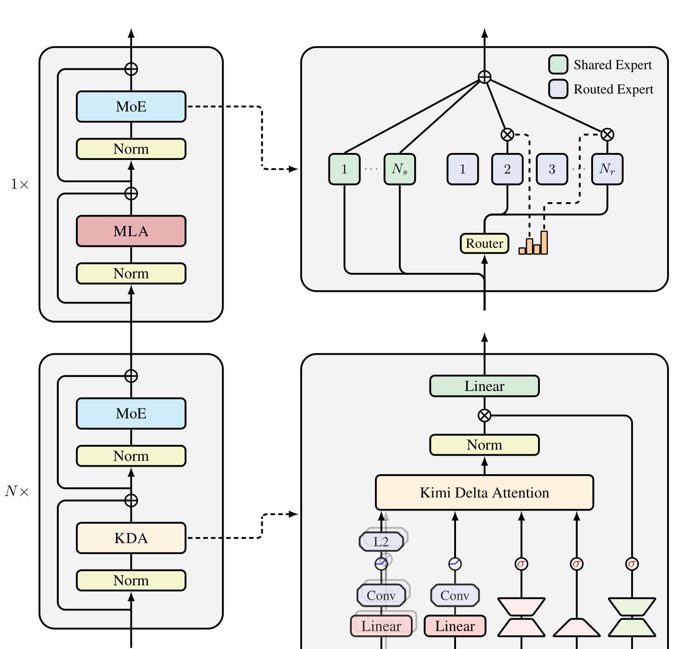
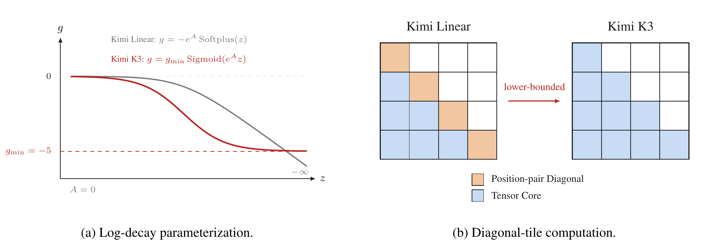

# Kimi Linear 与 FlashKDA：有限状态怎样真正跑上 GPU

线性注意力的故事常被压成一句“把 $O(T^2)$ 改成 $O(T)$”。这句话只说了序列长度的渐近阶数，没有回答
三个更难的问题：有限状态怎样改写而不被旧关联污染，训练怎样摆脱逐 token 串行，跨设备又怎样传递一个
会被后续 token 继续变换的状态。

[Kimi Linear](https://arxiv.org/abs/2510.26692) 把这三问连成一条路线：从 fast-weight memory 的
在线学习解释出发，以 Kimi Delta Attention（KDA）结合逐通道遗忘与 delta correction，再用专门的
chunkwise 算法落到矩阵乘。后续 [Kimi K3 技术报告](https://github.com/MoonshotAI/Kimi-K3/blob/main/k3_tech_report.pdf)
给 log-decay 加下界，使 diagonal tile 也能走 dense GEMM；[FlashKDA](https://github.com/MoonshotAI/FlashKDA)
与 KDA Context Parallelism（KCP）则分别解决单设备 kernel 和跨设备状态传播。

本页追踪的是这条算法—系统共同演化线。K3 的完整模型、训练与服务闭环见
[Kimi K3](kimi-k3.md)，稳定的机制定义见
[状态空间与线性注意力](../../architecture/state-space-linear-attention.md#kda-recurrence)。

## 从相关性累加到在线纠错

### Linear attention 是一张 fast-weight 表

最简单的 causal linear attention 保存矩阵状态

$$
S_t=S_{t-1}+k_tv_t^\top,
\qquad
o_t=S_t^\top q_t.
$$

每个 outer product 都向 $S$ 写入一条 $k_t\mapsto v_t$ 的关联。
[Linear Transformers Are Secretly Fast Weight Programmers](https://proceedings.mlr.press/v139/schlag21a.html)
把这种状态解释为由慢网络逐 token 编程的 fast weights。若从在线优化看，上式相当于沿相关性目标

$$
\mathcal L_t(S)=-\langle S^\top k_t,v_t\rangle
$$

下降：只要 $k_t$ 与 $v_t$ 对齐，状态范数就会继续增长。它没有“已经记对了就少写一点”的条件，也没有
擦除过期关联的机制；相似 key 会持续叠加并相互干扰。

### Delta rule 只写预测误差

把目标换成当前关联的重建误差

$$
\mathcal L_t(S)
=
\frac12\left\|S^\top k_t-v_t\right\|_2^2
$$

并以步长 $\beta_t$ 做一次梯度下降，可得

$$
S_t
=
S_{t-1}
+\beta_tk_t
\left(v_t-S_{t-1}^\top k_t\right)^\top.
$$

若状态已经把 $k_t$ 映射到 $v_t$，误差为零；若预测错误，只沿当前 key 方向纠正。这个 rank-1
Householder-style transition 让 associative memory 从无条件相关性累加变成在线回归。
[Parallelizing Linear Transformers with the Delta Rule](https://arxiv.org/abs/2406.06484) 进一步给出
sequence-parallel 的 WY representation，说明 delta rule 并不必然等于串行训练。

下面的小例子锁定 overwrite 与 chunk state 语义。对单位正交 key、$\beta=1$，第二次写同一 key
应覆盖旧 value；分段执行必须与整段一致。

```python
import torch

def delta_scan(keys, values, beta, state=None):
    state = values.new_zeros(keys.size(1), values.size(1)) if state is None else state
    output = []
    for key, value, rate in zip(keys, values, beta):
        state = state + rate * torch.outer(key, value - key @ state)
        output.append(key @ state)
    return torch.stack(output), state

keys = torch.tensor([[1., 0.], [0., 1.], [1., 0.]])
values = torch.tensor([[2., 3.], [-1., 4.], [7., 5.]])
whole, final = delta_scan(keys, values, torch.ones(3))
left, middle = delta_scan(keys[:2], values[:2], torch.ones(2))
right, chunked = delta_scan(keys[2:], values[2:], torch.ones(1), middle)
torch.testing.assert_close(torch.cat((left, right)), whole)
torch.testing.assert_close(chunked, final)
torch.testing.assert_close(final, torch.tensor([[7., 5.], [-1., 4.]]))
```

真实模型的 key 不正交，state 又只有有限 rank；delta correction 减少覆盖冲突，却不能把有限状态变成
无损 KV history。相似 key 压力测试仍是线性注意力评测的核心。

## 两条遗忘路线怎样在 KDA 汇合

只有纠错仍会让旧关联长期驻留。2024 年的
[Gated Linear Attention（GLA）](https://proceedings.mlr.press/v235/yang24ab.html)把逐通道门放进
state transition：

$$
S_t=\operatorname{Diag}(\alpha_t)S_{t-1}+k_tv_t^\top.
$$

每个 key channel 可以拥有不同的时间尺度，但写入仍是相关性累加。2025 年的
[Gated DeltaNet](https://proceedings.iclr.cc/paper_files/paper/2025/hash/4904fad153f6434a7bcf04465d4be2cc-Abstract-Conference.html)
把 scalar forget gate 与 delta rule 结合：

$$
S_t
=
\alpha_t\left(I-\beta_tk_tk_t^\top\right)S_{t-1}
+\beta_tk_tv_t^\top.
$$

它能整体快速遗忘，并对当前关联定向修正；所有 state channel 却仍共享一个 $\alpha_t$。

KDA 将两者的优点合并。先定义衰减后的状态

$$
\bar S_{t-1}
=
\operatorname{Diag}(\alpha_t)S_{t-1},
$$

再对它执行 delta update：

$$
S_t
=
\bar S_{t-1}
+\beta_tk_t
\left(v_t-k_t^\top\bar S_{t-1}\right)^\top.
$$

等价地，

$$
S_t
=
\left(I-\beta_tk_tk_t^\top\right)
\operatorname{Diag}(\alpha_t)S_{t-1}
+\beta_tk_tv_t^\top.
$$

顺序很重要：prediction 必须从 **已经衰减** 的状态读取。KDA 因而既有 GLA 的 channel-wise lifetime，
又保留 Gated DeltaNet 的 erase-and-write 几何。

## KDA 是一个受约束的 DPLR transition

一般 Diagonal-Plus-Low-Rank transition 写成

$$
S_t=(D_t-a_tb_t^\top)S_{t-1}+k_tv_t^\top.
$$

KDA 对它施加结构约束：

$$
D_t=\operatorname{Diag}(\alpha_t),
\qquad
a_t=\beta_tk_t,
\qquad
b_t=k_t\odot\alpha_t.
$$

也就是说，low-rank correction 的左右方向不再独立，而与当前 key 和同一份 channel decay 绑定。
这比一般 DPLR 少一些自由度，却带来更规整的 chunk algebra。
[Kimi Linear 论文](https://arxiv.org/abs/2510.26692)的对照伪代码显示，KDA 把二级 chunk
计算从四组降到两组，并在 inter-chunk/state update 中少掉约三次矩阵乘；论文给出的受控 kernel
实验中，其速度约为一般 DPLR 的两倍。这个结论针对论文实现和测试 shape，不是任意 DPLR kernel 的
普遍常数。

### chunkwise 形式在并行什么

设一个 chunk 有 $C$ 个 token。chunk 内先把逐 token 的 rank-1 transition 压成 UT/WY
representation，得到只依赖当前 chunk 的 $U,W$；进入 chunk 的 state 仍按顺序跨 chunk 传播。
输出可拆成

$$
O_{[c]}
=
\underbrace{(\Gamma_{[c]}\odot Q_{[c]})S_{[c]}}_{\text{此前 chunk}}
+
\underbrace{
\operatorname{Tril}
\left[
(\Gamma_{[c]}\odot Q_{[c]})
(K_{[c]}/\Gamma_{[c]})^\top
\right]
\left(U_{[c]}-W_{[c]}S_{[c]}\right)
}_{\text{当前 chunk}},
$$

其中 $\Gamma$ 是逐通道累计 retention。训练获得的是“chunk 内 dense、chunk 间 recurrent”，不是让
所有 token 完全独立。prefill 的并行度、临时矩阵和数值范围都由 $C,d_k,d_v$ 共同决定。

## Kimi Linear 为什么仍然是 hybrid

KDA 把无限历史压成每 head 的 $d_k\times d_v$ state，精确随机寻址能力仍弱于保存全部 K/V。
[Kimi Linear](https://arxiv.org/abs/2510.26692) 因此采用层间混合，而不是宣称有限状态已经替代
softmax attention：

```text
KDA -> KDA -> KDA -> NoPE MLA -> ...
```

论文选择 3:1 KDA/MLA，是在其消融中得到的质量—吞吐折中。KDA 的 $q,k$ 经过 ShortConv、Swish 与
L2 normalization，$v$ 经过 ShortConv 与 Swish；逐通道 decay 由 low-rank projection 生成，
recurrent output 再经过 head-wise RMSNorm 和低秩 sigmoid output gate。全局 MLA 使用 NoPE，
把顺序与 recency 的主要责任交给 KDA。

<figure class="paper-figure paper-figure--portrait" id="kimi-linear-figure-03" data-paper-source="kimi-linear" data-paper-asset="kimi-linear-figure-03" markdown="1">
[{ width="1492" height="1542" loading="lazy" decoding="async" }](../../assets/papers/kimi-linear/figure-03-hybrid-architecture.png)
<figcaption><strong>Figure 3 说明 3:1 不是一个只存在于配置表里的比例，而是两种记忆接口的周期性交接。</strong>KDA 层以固定状态承担大部分序列混合，MLA 层周期性恢复全局 token-to-token 寻址；两者之后都进入稀疏 MoE。右下角同时画出 decay、delta correction 与 output gate，正好对应正文中的递推公式。<span class="paper-figure__source">图源：<a href="https://raw.githubusercontent.com/MoonshotAI/Kimi-Linear/8c1d85eb6b5f8fcefb15758691b0ce50b0827ce3/tech_report.pdf#page=6">Kimi Linear: An Expressive, Efficient Attention Architecture, Figure 3, p. 6</a>；Copyright (c) 2025 Moonshot AI，<a href="https://github.com/MoonshotAI/Kimi-Linear/blob/8c1d85eb6b5f8fcefb15758691b0ce50b0827ce3/LICENSE">MIT License</a>。</span></figcaption>
</figure>

论文的 matched 1.4T-token 实验比较了 KDA hybrid、full MLA 与 hybrid GDN；公开
[Kimi-Linear 仓库](https://github.com/MoonshotAI/Kimi-Linear)另发布 48B total / 3B activated 的
Base 与 Instruct checkpoints，并说明 release checkpoints 训练到 5.7T tokens。两个数字对应不同
证据口径，不能把 5.7T checkpoint 的表现倒填成 1.4T matched comparison。

论文报告在其 1M-context 配置中，hybrid KDA 相对 full MLA 最多减少 75% KV cache，并给出最高
约 $6\times$ decode-throughput 增益；这些都是指定模型、batch、硬件与服务实现下的作者结果。
有限状态容量、周期性 MLA cache、并行切分和真实请求长度分布仍需进入端到端复测。

## 从 Kimi Linear 到 K3：给 decay 一个硬下界

Kimi Linear 使用无下界的 negative-Softplus log-decay：

$$
g_t=-e^A\operatorname{Softplus}(z_t),
\qquad
\alpha_t=e^{g_t}.
$$

chunk 矩阵化要用累计 decay 的倒数。若某步 $g_t$ 极负，tile 内的 reciprocal scaling 会迅速越界；
原实现需在 16-token secondary tile 的 diagonal 部分保留 position-pair 路径。

[Kimi K3 技术报告](https://github.com/MoonshotAI/Kimi-K3/blob/main/k3_tech_report.pdf)改成

$$
g_t
=
g_{\min}\operatorname{Sigmoid}(e^Az_t),
\qquad
\alpha_t=e^{g_t},
\qquad
g_{\min}=-5.
$$

于是 16-token tile 的累计 log-decay 位于 $(-80,0)$，倒数小于 $e^{80}$，在 BF16 的指数范围内。
diagonal 和 off-diagonal causal tiles 因而都能使用 dense Tensor Core GEMM。

<figure class="paper-figure paper-figure--wide" id="k3-figure-03" data-paper-source="kimi-k3" data-paper-asset="k3-figure-03" markdown="1">
[{ width="1967" height="683" loading="lazy" decoding="async" }](../../assets/papers/kimi-k3/figure-03-bounded-decay.png)
<figcaption><strong>左图看函数值域，右图看执行路径。</strong>关键不是把 Softplus 换成 Sigmoid 这一表面形式，而是有限下界把 16-token tile 的 reciprocal scaling 留在 BF16 指数范围内，使 diagonal tile 不再需要逐 position-pair 特判。<span class="paper-figure__source">图源：<a href="https://raw.githubusercontent.com/MoonshotAI/Kimi-K3/521359a5cae5e79d02e5a2102c2cea9ce3b9b79a/k3_tech_report.pdf#page=5">Kimi K3 Technical Report, Figure 3, p. 5</a>；© 2026 Moonshot AI，<a href="https://github.com/MoonshotAI/Kimi-K3/blob/521359a5cae5e79d02e5a2102c2cea9ce3b9b79a/LICENSE">Kimi K3 License</a>。</span></figcaption>
</figure>

这不只是“更稳定的激活函数”：它用函数族约束换取可证明的 kernel 数值边界。代价是模型不能在单步把某 channel 的 retention 压到 $e^{-5}$ 以下。

K3 还把 KDA output gate 从 Kimi Linear 的 low-rank projection 改为 full-rank $W_gx_t$。因此
“KDA”需要附带版本：核心 recurrence 相同，decay parameterization 与输出门并不完全相同。

## FlashKDA：算法拆成两种并行度

[FlashKDA v1 设计文档](https://github.com/MoonshotAI/FlashKDA/blob/master/docs/20260420-flashkda-v1-deep-dive.md)
选择 $C=16$，原因同时来自数值与硬件：

- lower bound $-5$ 让 16-token cumulative decay 可安全放进 BF16；
- $16\times16$ triangular inverse 可用短 Neumann expansion，远小于 $64\times64$ inverse；
- tile shape 能直接映射到 MMA，而无需更大的 secondary rescaling。

早期单 kernel 把 token-parallel 的预处理与 head-parallel 的跨 chunk recurrence 绑在一起，后者较低
的并行度会拖住前者。v1 因而拆成两段：

| kernel | grid | 主要工作 |
| --- | --- | --- |
| K1 | sequence × head × chunk | gate activation、Q/K L2 norm、decay、UT 矩阵与 inverse |
| K2 | sequence × head | 逐 chunk recurrence、输出、running state |

官方 deep dive 报告拆分比早期单 kernel 至少快 15%。它还记录 BF16 on-chip state + FP32 state-update
FMA、FP16 的 $16\times16$ inverse、`tanh.approx.f32` sigmoid、base-2 exponent，以及用寄存器
transpose 减少 K2 shared-memory round trip。这些是 FlashKDA v1 的实现选择，不是 KDA 数学定义。

[官方 H20 forward benchmark](https://github.com/MoonshotAI/FlashKDA/blob/master/BENCHMARK_H20.md)
固定 $T=8192,D=128$，在 $H=64/96$ 与 fixed/varlen cases 上报告相对 FLA Triton `chunk_kda`
约 $1.85\times$–$2.31\times$，相对 `chunk_gated_delta_rule` 约
$1.17\times$–$1.43\times$。它没有覆盖 backward、不同 GPU、不同 head dimension 或完整模型，
因此不能外推成“所有 KDA workload 快两倍”。

### 当前公开实现的硬边界

设计文档说内部数学使用 SM80 MMA instruction path，不能据此推断公开包支持 Ampere。
截至 2026-07-28，[FlashKDA README](https://github.com/MoonshotAI/FlashKDA#requirements) 给出的
实际支持合同更窄：

| 项目 | 当前公开合同 |
| --- | --- |
| GPU | SM90 及以上 |
| CUDA | 12.9 及以上 |
| PyTorch | 2.4 及以上 |
| dtype | Q/K/V/g/beta/output 为 BF16；部分参数和 state 支持 FP32 |
| head shape | 当前要求 $d_k=d_v=128$（README 记作 `K=V=128`） |
| batch | fixed length，或 `cu_seqlens` varlen |
| FLA 自动分派 | `flash-linear-attention >= 0.5.0`，README 示例位于 `inference_mode` |

公开 API 当前文档化的是 `flash_kda.fwd`，仓库 correctness test 也以 forward 为主；K3 报告所述
“服务训练和 prefill”是模型团队的系统陈述，不能自动等同于该公开仓库已经暴露完整 training backward。
不满足 dispatcher 条件时，FLA 会拒绝 FlashKDA backend 并回退；应打开 dispatch log 核对实际命中，
而不是仅凭安装成功判断 kernel 已生效。

## KCP：不能把局部状态直接相加

对 vanilla additive linear attention，一个 segment 从零生成的 state 可与前序 segment 直接求和。
KDA 不行，因为每个 token 都会继续变换传入 state。把一个 segment 写成 affine map：

$$
\mathcal F_i(S)
=
M_iS+E_i,
$$

其中 $M_i$ 是该 segment 内所有 token transition 的有序乘积，$E_i$ 是从 $S=0$ 出发生成的末态。
相邻 segments 的组合为

$$
(M_b,E_b)\circ(M_a,E_a)
=
\left(M_bM_a,\;M_bE_a+E_b\right).
$$

这个二元运算满足结合律，所以各 rank 可先独立计算 $(M_i,E_i)$，再用 prefix scan 恢复每个 rank
真正的 incoming state。[K3 报告](https://github.com/MoonshotAI/Kimi-K3/blob/main/k3_tech_report.pdf)
将其称为 KDA Context Parallelism；传输的是固定大小的 transition/state fragment，而不是随 local
sequence length 增长的 K/V blocks。

### Segment affine scan reference {#kcp-affine-scan}

下面直接从 KDA 的 $\alpha,\beta,k,v$ 构造 token fragments。两段 affine composition 必须与整段
逐 token 执行一致；简单相加两段的 zero-state outputs 则不一致。

```python
import torch
import torch.nn.functional as F

def kda_fragments(keys, values, beta, alpha):
    eye = torch.eye(keys.size(1))
    transition = torch.stack([
        (eye - rate * torch.outer(key, key)) @ torch.diag(decay)
        for key, rate, decay in zip(keys, beta, alpha)
    ])
    write = torch.stack([
        rate * torch.outer(key, value)
        for key, value, rate in zip(keys, values, beta)
    ])
    return transition, write

def summarize(transition, write):
    matrix, state = torch.eye(transition.size(-1)), torch.zeros_like(write[0])
    for current, update in zip(transition, write):
        matrix, state = current @ matrix, current @ state + update
    return matrix, state

def compose(right, left):
    return right[0] @ left[0], right[0] @ left[1] + right[1]

torch.manual_seed(0)
keys = F.normalize(torch.randn(8, 3), dim=-1)
values, beta = torch.randn(8, 2), torch.sigmoid(torch.randn(8))
alpha = torch.exp(-2 * torch.sigmoid(torch.randn(8, 3)))
transition, write = kda_fragments(keys, values, beta, alpha)
whole = summarize(transition, write)
left, right = summarize(transition[:3], write[:3]), summarize(transition[3:], write[3:])
merged = compose(right, left)
torch.testing.assert_close(merged[0], whole[0])
torch.testing.assert_close(merged[1], whole[1])
assert not torch.allclose(left[1] + right[1], whole[1])
```

实数代数中的 composition 是精确的；浮点实现还会受矩阵乘次序、state dtype 与 scan tree 影响。
[FLA PR #691](https://github.com/fla-org/flash-linear-attention/pull/691) 公开的跨设备实现用一次
all-gather 交换 transition 与 zero-state fragments；把 PR 中表示 head dimensions 的 $K,V$ 分别记作
$d_k,d_v$ 后，通信量约为 $\mathrm{CP}\times H\times d_k\times(d_k+d_v)$，并为 ShortConv 增加前一 rank 尾部 token 的 halo。
该 PR 的单组 H800、32K、CP=4 benchmark 优于其 all-to-all baseline，但 PR 同时明确列出 output
与 gradient 信息有损、通信随 CP degree 增长。论文级 affine 等价与当前实现的低精度/反向近似必须
分开验证。

K3 还描述了 **单 GPU 内** 的 automatic context-parallel planner：先并行求各 segment transition，
再在设备内合并 exact initial states。它没有跨设备通信，不应与上述 KCP 混为一谈。

## 应该怎样验证这条路线

| 层面 | 最小证据 |
| --- | --- |
| recurrence | decay-before-delta、当前 token 写后读、chunk 边界终态一致 |
| chunk algebra | recurrent、显式 causal matrix、UT/WY path 前后向对齐 |
| decay | tile 内累计 log-decay 上界、极端 logits、BF16/FP32 漂移 |
| finite memory | MQAR、相似 key、overwrite、stack 与 palindrome |
| hybrid | KDA/MLA 比例、NoPE/RoPE、最后一层是否 global attention |
| FlashKDA | dispatcher 命中、目标 SM/CUDA、fixed/varlen、state dtype |
| KCP | prefix composition、不同 CP degree、ShortConv halo、forward/backward |
| serving | prefill、single-token decode、speculative rollback、prefix state |

最容易犯的错误，是把四层结论互相替代：递推公式正确不证明 chunk kernel 正确，chunk kernel 快不证明
模型质量，单个 H20 benchmark 不证明其他 GPU，固定 state 也不证明模型能无损利用百万 token。

## Reference {#reference}

- [Linear Transformers Are Secretly Fast Weight Programmers](https://proceedings.mlr.press/v139/schlag21a.html)
- [Gated Linear Attention Transformers with Hardware-Efficient Training](https://proceedings.mlr.press/v235/yang24ab.html)
- [Parallelizing Linear Transformers with the Delta Rule over Sequence Length](https://arxiv.org/abs/2406.06484)
- [Gated Delta Networks: Improving Mamba2 with Delta Rule](https://proceedings.iclr.cc/paper_files/paper/2025/hash/4904fad153f6434a7bcf04465d4be2cc-Abstract-Conference.html)
- [Kimi Linear: An Expressive, Efficient Attention Architecture](https://arxiv.org/abs/2510.26692)
- [MoonshotAI/Kimi-Linear](https://github.com/MoonshotAI/Kimi-Linear)
- [Kimi K3 Technical Report](https://github.com/MoonshotAI/Kimi-K3/blob/main/k3_tech_report.pdf)
- [MoonshotAI/FlashKDA](https://github.com/MoonshotAI/FlashKDA)
- [FlashKDA v1: A Deep Dive](https://github.com/MoonshotAI/FlashKDA/blob/master/docs/20260420-flashkda-v1-deep-dive.md)
- [FlashKDA H20 Forward Benchmark](https://github.com/MoonshotAI/FlashKDA/blob/master/BENCHMARK_H20.md)
- [FLA KDA Context Parallelism PR #691](https://github.com/fla-org/flash-linear-attention/pull/691)
- [Flash Linear Attention](https://github.com/fla-org/flash-linear-attention)
