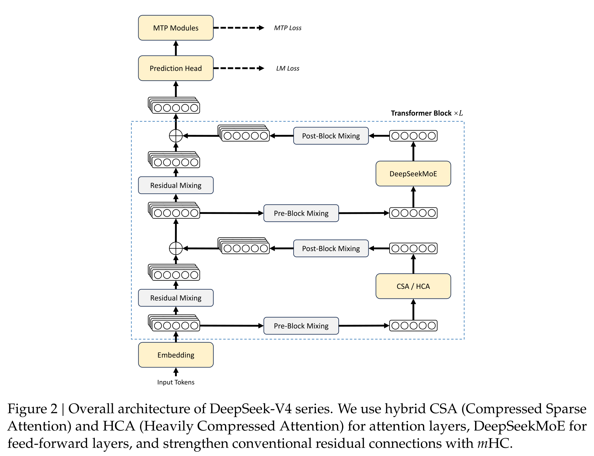

# mHC：把 residual stream 从一条路扩成可控的多路混合

标准 residual connection 把每层写成

$$
x_{l+1}=x_l+\mathcal F_l(x_l).
$$

它的力量不只来自“相加”，还来自一条系数恒为 1 的 identity path：即使
$\mathcal F_l$ 尚未学好，前向信号和反向梯度仍有一条不必连续穿过非线性变换的路径。
[Hyper-Connections](https://openreview.net/forum?id=9FqARW7dwB) 把这条单路 residual
扩成多路状态，并让每层动态决定从哪些路读取、怎样搬运旧状态、向哪些路写回。
表达空间更大了，但跨很多层反复相乘的动态 mixing matrix 也可能放大、衰减或相互抵消。

[Manifold-Constrained Hyper-Connections](https://arxiv.org/abs/2512.24880) 的回答不是退回
固定 identity，而是约束最关键的 residual mixing：让它保持非负、行和列都为 1。
[DeepSeek-V4](https://arxiv.org/abs/2606.19348) 随后把 mHC 放进每个 Transformer block。
本页完整展开报告公式 (1)–(8)，并区分矩阵约束真正保证了什么、完整非线性网络仍可能怎样失稳。

<div markdown="block">
<figure class="paper-figure paper-figure--portrait" id="deepseek-v4-figure-02" data-paper-source="deepseek-v4" data-paper-asset="deepseek-v4-figure-02" markdown="1">
[{ width="1938" height="1488" loading="lazy" decoding="async" }](../../assets/papers/deepseek-v4/figure-02-overall-architecture.png)
<figcaption><strong>Figure 2 显示 mHC 不是在 block 外追加一次门控，而是同时介入两个子层的读取、历史搬运与写回。</strong>注意力或 MoE 仍在普通 hidden space 中计算；扩展发生在跨层 residual state，因此参数开销、激活生命周期和 pipeline 边界都与“把 hidden size 乘四”不同。<span class="paper-figure__source">图源：<a href="https://huggingface.co/deepseek-ai/DeepSeek-V4-Pro/resolve/653b8ce97de7ed21df99e5f6bd49bacb3840df2b/DeepSeek_V4.pdf#page=6">DeepSeek-V4 Technical Report, Figure 2, p. 6</a>；Copyright (c) 2023 DeepSeek，<a href="https://huggingface.co/deepseek-ai/DeepSeek-V4-Pro/blob/653b8ce97de7ed21df99e5f6bd49bacb3840df2b/LICENSE">MIT License</a>。</span></figcaption>
</figure>
</div>

## 从 identity path 到 residual width

普通 residual stream 在每个 token 上只有一个 $d$ 维状态。HC 将其扩展为

$$
X_l=[x_{l,1};\ldots;x_{l,n_{\mathrm{hc}}}]^\mathsf T
\in\mathbb R^{n_{\mathrm{hc}}\times d}.
$$

内部 attention 或 MoE 子层 $\mathcal F_l$ 并未因此变成 $n_{\mathrm{hc}}$ 倍宽。三张小矩阵把
“多路状态”与“普通 $d$ 维子层”连接起来：

- $A_l\in\mathbb R^{1\times n_{\mathrm{hc}}}$：从多路 residual 读出一个 $d$ 维输入；
- $B_l\in\mathbb R^{n_{\mathrm{hc}}\times n_{\mathrm{hc}}}$：在多路之间搬运旧状态；
- $C_l\in\mathbb R^{n_{\mathrm{hc}}\times1}$：把子层输出写回多路 residual。

这给模型增加了一个与 hidden size、层数和 MoE 宽度不同的缩放轴：**residual width**。V4-Flash
和 V4-Pro 都取 $n_{\mathrm{hc}}=4$。每个 attention/MoE 仍接收一个 $d$ 维向量，但层与层之间
传递的是四条 $d$ 维状态。

## HC 更新：公式 (1) {#hyper-connections}

第 $l$ 层的完整更新是

$$
X_{l+1}
=B_lX_l+C_l\mathcal F_l(A_lX_l). \tag{1}
$$

可以把它按三个动词阅读：

1. `read`：$A_lX_l$ 混合多路状态，形成子层输入；
2. `transform`：$\mathcal F_l$ 仍在普通 hidden space 中计算；
3. `carry + write`：$B_lX_l$ 搬运历史，$C_l\mathcal F_l(\cdot)$ 分发新信息。

当 $n_{\mathrm{hc}}=1$ 且 $A_l=B_l=C_l=1$ 时，它退化为普通 residual block。对
$n_{\mathrm{hc}}>1$，$B_l$ 不再是一个无条件 identity；若每层都允许任意 $B_l$，跨 $L$ 层的
直接 residual 路径包含

$$
B_{L-1}B_{L-2}\cdots B_0.
$$

各矩阵奇异值略高于 1 会随深度放大，略低于 1 会衰减，正负混合还可能造成通道间抵消。这正是
naive HC 在扩大深度和规模时遇到的稳定性问题。

## Birkhoff 约束：公式 (2) {#birkhoff-polytope}

mHC 要求 residual mapping 位于 doubly stochastic matrices 的集合

$$
\mathcal M=
\left\{
M\in\mathbb R^{n_{\mathrm{hc}}\times n_{\mathrm{hc}}}
\ \middle|\
M\mathbf1=\mathbf1,\;
\mathbf1^\mathsf TM=\mathbf1^\mathsf T,\;
M\ge0
\right\}. \tag{2}
$$

三个条件分别表示每行和为 1、每列和为 1、所有元素非负。它带来三种互相联系、但不能混写的
解释。

### 每条输出路都是凸组合

行和为 1 且非负，所以 $(B_lX_l)_i$ 是输入 residual lanes 的凸组合。直接搬运旧状态时，不会
靠任意正负系数制造一次无界放大。

### 总“流量”在 lanes 间守恒

列和也为 1，所以没有某一输入 lane 在所有输出 lane 中被系统性重复放大或彻底遗漏。根据
Birkhoff–von Neumann 定理，任意 doubly stochastic matrix 都可写成 permutation matrices 的
凸组合；因此 $B_l$ 可以理解为多种“重排 residual lanes”方案的软混合。

### 直接 residual mapping 的谱范数受控

对 doubly stochastic $B_l$，

$$
\lVert B_l\rVert_1=\lVert B_l\rVert_\infty=1,
$$

从而

$$
\lVert B_l\rVert_2
\le\sqrt{\lVert B_l\rVert_1\lVert B_l\rVert_\infty}=1.
$$

另一方面 $B_l\mathbf1=\mathbf1$，所以 1 又是其奇异值下界，最终
$\lVert B_l\rVert_2=1$。此外，若 $B_1,B_2\in\mathcal M$，则 $B_1B_2$ 仍非负、行列和仍为
1，故 $\mathcal M$ 对矩阵乘法封闭。深层直接 carry path 因而不会仅由这些 $B_l$ 的乘积产生
谱范数爆炸。

论文沿用“manifold-constrained”这一名称；严格地说，Birkhoff polytope 含边界和顶点，并非
处处光滑的 manifold。实现上真正需要守住的是上述 doubly stochastic constraint，而不是名称
本身。

## 动态参数：公式 (3)–(5)

mHC 不是每层只学习三张静态小矩阵。它先把当前 residual state 展平并做 RMSNorm：

$$
\widehat X_l=
\operatorname{RMSNorm}(\operatorname{vec}(X_l))
\in\mathbb R^{1\times n_{\mathrm{hc}}d}.
$$

然后分别生成 input、residual 和 output mappings 的 raw parameters：

$$
\widetilde A_l
=\alpha_l^{\mathrm{pre}}
\left(\widehat X_lW_l^{\mathrm{pre}}\right)
+S_l^{\mathrm{pre}}, \tag{3}
$$

$$
\widetilde B_l
=\alpha_l^{\mathrm{res}}
\operatorname{Mat}\!\left(\widehat X_lW_l^{\mathrm{res}}\right)
+S_l^{\mathrm{res}}, \tag{4}
$$

$$
\widetilde C_l
=\alpha_l^{\mathrm{post}}
\left(\widehat X_lW_l^{\mathrm{post}}\right)^\mathsf T
+S_l^{\mathrm{post}}. \tag{5}
$$

$S^{\mathrm{pre/res/post}}$ 是 input-independent static component；
$W^{\mathrm{pre/res/post}}$ 产生 input-dependent component；三个标量
$\alpha^{\mathrm{pre/res/post}}$ 控制动态分量的强度，并以小值初始化。这样训练初期更接近稳定
的静态连接，随后才逐渐学会按 token 内容调整 residual topology。

形状账本能暴露很多静默错误：

| 对象 | 形状 |
| --- | --- |
| $\widehat X_l$ | $1\times n_{\mathrm{hc}}d$ |
| $W_l^{\mathrm{pre}},W_l^{\mathrm{post}}$ | $n_{\mathrm{hc}}d\times n_{\mathrm{hc}}$ |
| $W_l^{\mathrm{res}}$ | $n_{\mathrm{hc}}d\times n_{\mathrm{hc}}^2$ |
| $\widetilde A_l$ | $1\times n_{\mathrm{hc}}$ |
| $\widetilde B_l$ | $n_{\mathrm{hc}}\times n_{\mathrm{hc}}$ |
| $\widetilde C_l$ | $n_{\mathrm{hc}}\times1$ |

对 V4 的 $n_{\mathrm{hc}}=4$，每个 token、每个子层只需动态生成 $4+16+4=24$ 个 mixing
coefficients；但生成 projection 的输入宽度仍是 $4d$，而 residual state、pipeline 通信和保存的
activation 也都扩大。

## 对 $A$ 与 $C$ 的约束：公式 (6)–(7)

input mapping 使用

$$
A_l=\sigma(\widetilde A_l), \tag{6}
$$

output mapping 使用

$$
C_l=2\sigma(\widetilde C_l). \tag{7}
$$

所以 $A_l$ 的每个元素落在 $(0,1)$，$C_l$ 的每个元素落在 $(0,2)$。非负约束避免多路读取和
写回时发生正负抵消；$C$ 前的 2 又允许 identity 附近具有合适的写入尺度。

但 $A$ 和 $C$ **不是** stochastic vectors：报告没有要求它们的元素和为 1。因此
$A_lX_l$、$C_l\mathcal F_l(\cdot)$ 仍可能改变范数。mHC 的严格谱范数结论属于 $B_l$ 所描述的
直接 residual carry，不能自动扩展成“整层 Jacobian 范数不超过 1”。

## Sinkhorn-Knopp：公式 (8) {#sinkhorn-projection}

对 unconstrained $\widetilde B_l$，先取正数矩阵

$$
M^{(0)}=\exp(\widetilde B_l),
$$

再交替做列归一化 $\mathcal T_c$ 和行归一化 $\mathcal T_r$：

$$
M^{(t)}
=\mathcal T_r\!\left(\mathcal T_c(M^{(t-1)})\right). \tag{8}
$$

V4 使用 $t_{\max}=20$，并令 $B_l=M^{(20)}$。最后一步是行归一化，所以有限迭代后行和通常比
列和更接近 1；两者都必须用 tolerance 检查，不能把浮点结果当作数学上的精确约束。

“投影”在这里也需要精确理解：Sinkhorn scaling 通过对正矩阵交替缩放得到 doubly stochastic
matrix，它不是一般意义下寻找与 $\widetilde B$ 欧氏距离最近的点。若 raw logits 幅度很大，
直接 `exp` 还可能溢出；减去一个全局最大值不会改变最终缩放结果，可以作为稳定实现的第一步。

下面的最小实现同时覆盖公式 (1)–(8)。它保留动态/静态分解、20 次 Sinkhorn、$A/C$ 约束，
并验证行列和、谱范数和反向梯度。

```python
import torch
def rmsnorm(x, eps=1e-6):
    return x * torch.rsqrt(x.square().mean() + eps)
def sinkhorn(raw, steps=20):
    matrix = (raw - raw.amax()).exp()
    for _ in range(steps):
        matrix = matrix / matrix.sum(-2, keepdim=True)
        matrix = matrix / matrix.sum(-1, keepdim=True)
    return matrix
def mhc_step(x, fn, weights, static, alpha):
    n, d = x.shape
    flat = rmsnorm(x.reshape(-1))
    wa, wb, wc = weights
    sa, sb, sc = static
    raw_a = alpha[0] * (flat @ wa) + sa
    raw_b = alpha[1] * (flat @ wb).reshape(n, n) + sb
    raw_c = alpha[2] * (flat @ wc) + sc
    a = raw_a.sigmoid().reshape(1, n)
    b = sinkhorn(raw_b)
    c = (2 * raw_c.sigmoid()).reshape(n, 1)
    return b @ x + c @ fn(a @ x), (a, b, c)
torch.manual_seed(7)
n, d = 4, 6
x = torch.randn(n, d, requires_grad=True)
weights = tuple(torch.randn(n * d, size) * .01 for size in (n, n * n, n))
static = (torch.zeros(n), torch.zeros(n, n), torch.zeros(n))
y, (_, b, _) = mhc_step(x, torch.tanh, weights, static, torch.full((3,), .01))
torch.testing.assert_close(b.sum(0), torch.ones(n), atol=1e-5, rtol=1e-5)
torch.testing.assert_close(b.sum(1), torch.ones(n), atol=1e-5, rtol=1e-5)
assert torch.linalg.matrix_norm(b, 2) <= 1.00001
y.square().mean().backward()
assert x.grad is not None and torch.isfinite(x.grad).all()
```

这段实现用于核对公式语义，不是高性能 layer：它为每个 token 显式生成小矩阵，并让 autograd
保存全部 Sinkhorn 中间量。生产实现需要融合、重算或隐式梯度等系统设计。

## “不扩张”不等于完整网络绝对稳定

令

$$
G(X)=B(X)X+C(X)\mathcal F(A(X)X).
$$

即使对每个固定输入都有 $\lVert B(X)\rVert_2=1$，完整 Jacobian 仍包含

$$
\frac{\partial B(X)}{\partial X}X,\qquad
\frac{\partial C(X)}{\partial X}\mathcal F(\cdot),\qquad
C(X)J_{\mathcal F}\frac{\partial(A(X)X)}{\partial X}.
$$

所以 Birkhoff 约束控制的是一条关键的直接传播路径，不是对所有动态项和子层 Jacobian 的统一
上界。训练仍需关注初始化、$\alpha$、normalization、optimizer、激活异常和低精度误差。
把“$B$ 非扩张”简化成“mHC 不会 loss spike”会超过公式能够支持的结论。

同样，矩阵乘积闭包只适用于固定 realized $B_l$ 的直接乘积。由于每层 $B_l$ 由当前 $X_l$
动态生成，扰动输入还会改变后续 mixing matrix；稳定性分析必须把这条依赖纳入。

## 和其他 depth 路线的关系

### Residual scaling

[DeepNet](https://arxiv.org/abs/2203.00555) 等方法通过初始化或固定尺度控制 residual branch 与
identity branch 的相对强度。它们仍只有一条 residual stream；mHC 改变的是 residual topology，
让多条 lanes 可以动态重排与混合。

### Dense depth aggregation

DenseNet、DenseFormer 一类方法把多个历史层表示直接送给后层，通常增加随 depth 增长的可见状态
或聚合成本。mHC 保持固定 $n_{\mathrm{hc}}$ 条 lanes，把深度历史持续压进固定宽的 residual state。

### Attention Residuals

[Attention Residuals](attention-residuals.md) 也让模型学习 depth mixing，但它显式对历史
block outputs 做 attention；mHC 则在每个子层边界更新固定四路 residual state。前者的 key/value
来自不同深度位置，后者的 $A/B/C$ 在 lanes 间读、搬运和写回。两者都不是另一个方法的特例。

| 路线 | 保存的 depth 状态 | mixing 范围 | 主要系统压力 |
| --- | --- | --- | --- |
| 普通 residual | 1 条 | 当前层 identity + branch | 最低 |
| residual scaling | 1 条 | 当前层、固定或初始化尺度 | 参数化与深度稳定 |
| mHC | 固定 $n_{\mathrm{hc}}$ 条 | 当前 lanes 的动态受约束混合 | activation、PP 通信、小矩阵 kernel |
| Attention Residuals | 多个历史 block 表示 | 对历史 depth 做内容寻址 | 历史 cache、online merge、pipeline |

## V4 中的系统实现

mHC 的算术量相对大 Transformer block 很小，但它位于每个 attention/MoE 边界，且读写扩宽后的
residual state，因此容易受 memory traffic 和 pipeline communication 主导。V4 报告披露了四项
配套设计：

1. 训练和推理都使用融合 mHC kernel，避免把 24 个 mixing coefficients 拆成大量小算子。
2. 选择性保存中间 tensor：多数 layer-between hidden states 与 normalized inputs 在 backward
   重算，昂贵算子输出则保留。
3. 调整 DualPipe 的 1F1B overlap，让一部分 mHC 操作与增加的 pipeline 通信并发。
4. 小 batch 下动态参数 GEMM 的输出维仅 $4+16+4=24$，需要确定性 split-$k$ 路径：各 split
   分开输出，再做固定次序 reduction。

报告在其 overlapped 1F1B pipeline stage 上测得 mHC wall-time overhead 为 6.7%。这是作者特定
模型、并行网格、融合 kernel 和 overlap schedule 下的测量，不能外推为所有实现的固定开销。
activation、重算与 pipeline 的通用账本见[内存、数值与硬件](../../systems/memory-numerics-hardware.md)
和[模型并行](../../systems/model-parallelism.md)。

V4 还对 optimizer 做参数分流：mHC 的 static biases 与 gating factors 使用 AdamW，其他大部分
二维矩阵进入 Muon。复现时若把所有 mHC 参数送进同一种 optimizer，训练配方已经发生变化；
相关参数路由见[优化器家族](../../training/optimizer-families.md)。

## 初始化与监控

一套可审计的 mHC 训练至少记录：

- $n_{\mathrm{hc}}$、三个 dynamic projections 的 dtype 与初始化；
- $S^{\mathrm{pre/res/post}}$ 和 $\alpha^{\mathrm{pre/res/post}}$ 的初始化；
- Sinkhorn 次数、归一化顺序、epsilon、内部精度与最大 marginal error；
- $A/C$ 元素分布、$B$ 的行列和误差与奇异值；
- lanes 间 cosine similarity，防止四路状态实际坍缩成同一路；
- mHC activation、pipeline bytes、recompute FLOPs 与 step-time 占比；
- batch/sequence packing 改变后是否保持预期数值语义。

若 $B$ 很快退化到近 identity，额外 lanes 可能没有被使用；若接近均匀矩阵，lanes 又可能过早
平均化。只看 row/column sum 正确并不能判断表示是否有效分工。

## 验证顺序

### 局部不变量

1. 每个 $B$ 元素非负，行和、列和在 tolerance 内为 1。
2. $\lVert B\rVert_2$ 不超过 1 加数值误差。
3. 任取两个 projected matrices，其乘积仍满足 doubly stochastic constraints。
4. $A\in(0,1)$、$C\in(0,2)$，并确认实现没有误加 softmax。
5. $n_{\mathrm{hc}}=1$、$A=B=C=1$ 的静态构造应退化为普通 residual update。

### 梯度与数值

1. 小矩阵用 FP64 finite difference / `gradcheck` 对照 Sinkhorn backward。
2. 扩大 raw $\widetilde B$ 的幅度，测 exponent overflow 与 marginal convergence。
3. 比较 5、10、20、更多迭代的行列误差、梯度和端到端质量。
4. activation checkpoint 开关前后应保持同一前向值与梯度。
5. batch 切分、microbatch 顺序和 deterministic reduction 改变后做 bitwise 或 bounded-error
   对照。

### 端到端

1. 与等参数、等 token、等 optimizer budget 的普通 residual baseline 比较。
2. 分别消融 residual width、动态分量、Birkhoff constraint 与融合 kernel。
3. 报告 loss spike、gradient norm、lane diversity、吞吐和峰值显存，而不只报告最终 benchmark。
4. 在更深网络和更长训练中检查收益是否持续，避免只凭短代理实验断言 scalability。

## 证据边界

- mHC 论文和 V4 报告公开了公式、约束、训练配置与作者实验；V4 确实采用
  $n_{\mathrm{hc}}=4$、20 次 Sinkhorn。
- $\lVert B_l\rVert_2=1$ 与乘法闭包是 direct residual mapping 的性质，不是完整动态 block
  Jacobian 的统一上界。
- 有限次 Sinkhorn 产生近似 doubly stochastic matrix；误差依赖 raw logits、dtype、迭代次数和
  实现顺序。
- V4 的最终质量不能单独归因于 mHC。CSA/HCA、MoE、Muon、数据与后训练同时改变，报告不是
  单变量全规模因果实验。
- 6.7% 是作者系统中的 stage-level wall-time 开销；没有相同 fusion、recompute 与 PP overlap
  时，独立实现可能显著不同。
- 后续 Birkhoff solver、隐式梯度或其他约束是相关改进路线，不属于已发布 V4 的实现事实。

mHC 在完整模型中的位置见 [DeepSeek-V4 深读](deepseek-v4.md)，家族继承关系见
[DeepSeek 演化案例](../deepseek-timeline.md)。标准 residual、PreNorm 和激活路径见
[Decoder Block](../../architecture/decoder-block.md)。

## Reference {#reference}

- [Deep Residual Learning for Image Recognition](https://arxiv.org/abs/1512.03385)
- [DeepNet: Scaling Transformers to 1,000 Layers](https://arxiv.org/abs/2203.00555)
- [Hyper-Connections](https://openreview.net/forum?id=9FqARW7dwB)
- [mHC: Manifold-Constrained Hyper-Connections](https://arxiv.org/abs/2512.24880)
- [DeepSeek-V4: Towards Highly Efficient Million-Token Context Intelligence](https://arxiv.org/abs/2606.19348)
- [Concerning Nonnegative Matrices and Doubly Stochastic Matrices](https://doi.org/10.2140/pjm.1967.21.343)
- [Accelerating Birkhoff Projection for Manifold-Constrained Hyper-Connections](https://arxiv.org/abs/2606.07574)
- [Attention Residuals](https://arxiv.org/abs/2603.15031)
