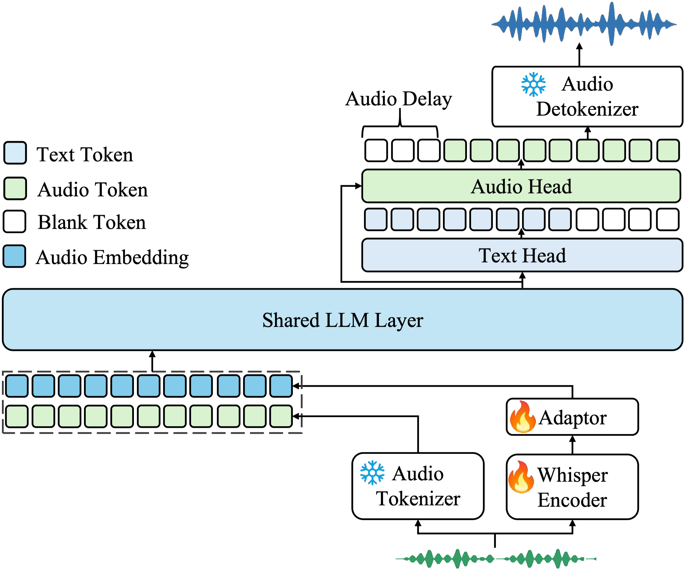

# 音频理解：从波形到事件、语言与场景

音频不是“没有画面的文本”。同一段波形同时携带语言内容、说话人、情绪、声源、空间、音乐结构和环境事件。不同任务依赖不同时间尺度：

- 音素可能持续几十毫秒；
- 一个词或声音事件持续数百毫秒到数秒；
- 对话轮次、音乐段落和环境变化跨越更长时间。

一个可靠的音频系统必须先说明它保留了哪一层信息，再讨论识别或推理能力。

<div markdown="block">
<figure class="paper-figure paper-figure--wide" id="kimi-audio-framework" data-paper-source="kimi-audio" data-paper-asset="kimi-audio-framework" markdown="1">
[{ width="2464" height="2055" loading="lazy" decoding="async" }](../../assets/papers/kimi-audio/kimi-audio-framework.png)
<figcaption><strong>理解与生成对表示的需求并不相同，混合前端因此不是重复编码。</strong>连续声学特征保留细粒度感知线索，12.5 Hz 离散 token 提供适合长序列建模和音频生成的语义接口；两者在共享 LLM 中汇合，说明“一个 tokenizer 统一所有任务”并不是必要条件。<span class="paper-figure__source">图源：<a href="https://raw.githubusercontent.com/MoonshotAI/Kimi-Audio/349251e1d8f4f98d58fda59246381faecd7392e0/assets/kimia_framework.png">Kimi-Audio architecture overview, standalone architecture diagram</a>；Moonshot AI，<a href="https://github.com/MoonshotAI/Kimi-Audio/blob/349251e1d8f4f98d58fda59246381faecd7392e0/README.md#license">MIT License（repository non-Qwen components）</a>。</span></figcaption>
</figure>
</div>

## 波形、频谱与可学习前端

离散波形 $x[n]$ 的采样率 $f_s$ 给出最高可表示频率约 $f_s/2$。把不同采样率音频直接混入 batch 会改变同一索引对应的真实时间，必须先统一或显式记录。

短时傅里叶变换：

$$
X(\tau,\omega)
=
\sum_n x[n]w[n-\tau]e^{-j\omega n}
$$

用局部窗口近似平稳信号。幅度或功率谱再经过 Mel filterbank 和对数压缩，得到更适合语音识别的 log-Mel 特征。窗口越长，频率分辨率越高、快速瞬态越模糊；hop 越小，时间帧越密、计算越大。

下面的最小实现保留复数 STFT，再返回稳定的 log-power。它没有实现 Mel 投影；真实系统还应固定 window、padding、归一化与采样率。

```python
import torch
def log_power_spectrogram(wave, n_fft=400, hop=160):
    if wave.ndim != 2:
        raise ValueError("wave must be [batch, sample]")
    window = torch.hann_window(n_fft, device=wave.device)
    spec = torch.stft(wave, n_fft, hop, n_fft, window, return_complex=True)
    return spec.abs().square().clamp_min(1e-10).log()
wave = torch.zeros(2, 16000)
feature = log_power_spectrogram(wave)
assert feature.shape[:2] == (2, 201)
assert torch.isfinite(feature).all()
```

可学习前端可以直接从波形训练卷积或 Transformer encoder。它减少手工假设，却仍然有有效感受野、stride 和带宽限制；“端到端”并不等于没有信号处理。

## 语音识别的三层结构

自动语音识别要把声学变化映射到文字。困难来自同一文本可以有不同说话人、语速、口音和噪声，而相邻音素又会共发音。

传统系统显式拆分声学模型、发音词典与语言模型。神经端到端系统常用三类目标：

### CTC

[CTC](https://www.cs.toronto.edu/~graves/icml_2006.pdf) 引入 blank，并对所有与目标文本一致的单调对齐求和：

$$
p(y\mid x)
=
\sum_{\pi\in\mathcal B^{-1}(y)}
\prod_t p(\pi_t\mid x).
$$

它适合流式和单调对齐，但输出间依赖通常需要外部语言模型或更强 encoder 补足。

### Encoder–decoder

自回归 decoder 建模

$$
p(y\mid x)
=
\prod_u p(y_u\mid y_{<u},H_x),
$$

可以直接融入语言上下文，但容易把语言先验当作声学证据，并需要处理长音频 memory。

### Transducer

RNN-T/Transducer 把声学时间与输出时间放在二维格上，适合在线识别。其延迟不仅由模型大小决定，还取决于 chunk、lookahead、endpoint 与 beam search。

[Whisper](https://arxiv.org/abs/2212.04356) 用大规模弱监督把多语言识别、翻译、语言识别和时间戳统一为序列任务。它说明数据规模与任务格式的重要性，也提醒我们：高层语言 decoder 可能生成声学输入中并不存在的词，尤其在静音、噪声与领域外输入上。

## 自监督语音表示

无标注音频远多于精确转写。自监督学习让 encoder 先掌握局部声学与长程上下文，再用少量标注适配。

[wav2vec 2.0](https://arxiv.org/abs/2006.11477) 遮蔽连续 latent，并从量化候选中识别正确目标；[HuBERT](https://arxiv.org/abs/2106.07447) 先对声学特征聚类，再预测被遮蔽位置的离散伪标签；[data2vec](https://arxiv.org/abs/2202.03555) 则预测教师网络的上下文表示。

三者共同面对 collapse 与目标粒度：

- 目标太接近局部声学，表示难以获得语义；
- 目标太粗，音素和说话人信息可能丢失；
- 聚类标签不是“真实音素”，其错误会进入下一轮训练；
- 数据中的语言、口音和录音条件决定迁移边界。

应按 ASR、speaker、emotion、keyword、retrieval 等不同任务评估表示，而不是把单个线性探针当作“通用听觉”证明。

## 非语音声音：事件、声景与空间

音频理解还包括：

- 声音事件分类与时间定位；
- 多声源重叠下的分离与识别；
- 场景分类与异常检测；
- 音乐标签、节拍、和声与结构；
- 音画对应和空间声源定位。

[AudioSet](https://research.google.com/audioset/) 提供大规模弱标注事件 ontology，但 clip-level 标签只说明一段时间内“可能出现”，不提供精确边界。模型若只学到场景共现，也可能在事件定位上失败。

[CLAP](https://arxiv.org/abs/2206.04769) 把音频与文本映射到共享空间，支持开放词汇检索和零样本分类。与 CLIP 一样，全局对齐不自动提供声源分离、精确时间 grounding 或因果解释。

当多个声源重叠时，理解任务可以先估计

$$
x(t)=\sum_{k=1}^{K}s_k(t)+n(t),
$$

再对目标 $s_k$ 识别；也可以端到端输出事件。分离有助于可解释性，却会引入伪影并改变下游分布。[SAM Audio](https://ai.meta.com/research/publications/sam-audio-segment-anything-in-audio/) 展示了文本、视觉和时间 span 共同提示通用音源分离的一种较新接口。

## 音频—语言对齐的粒度

“这段声音是什么”可以在不同粒度回答：

| 粒度 | 表示/监督 | 典型任务 |
| --- | --- | --- |
| clip | 整段 embedding | 检索、场景分类 |
| frame | 时间序列 | 事件检测、VAD |
| token | 语音/codec token | ASR、生成 |
| span | 起止时间 + 文本 | grounding、字幕 |
| source | 分离波形或 mask | 多声源理解 |

若训练只有 clip-caption 对，模型没有被要求知道每个词对应哪个时间片。音频问答中，正确最终答案也不能证明时间证据正确；应要求时间 span、声源或可播放片段作为中间证据。

## 音画共同理解 {#audio-visual-understanding}

视频中的声音可以消除视觉歧义：看不见的说话人、遮挡的碰撞、镜头外车辆或材质发声。反过来，视觉也可帮助分离目标声源。

音画对齐至少有三种时间关系：

- 同步：嘴形与语音、撞击与声响；
- 因果延迟：动作后才产生声音；
- 语义共现：背景音乐与场景相关，但不逐帧同步。

把所有正样本都强制逐帧对齐会伤害语义共现，完全只做 clip 对齐又学不到同步。训练和评测应分别覆盖毫秒级同步、事件级对应与场景级语义。

## 长音频与流式状态

长音频不能只切成独立窗口。跨 chunk 的说话人、语言上下文和未完成词需要状态：

$$
h_k
=
F(x_{k-L:k+R},h_{k-1}),
$$

其中 $L$ 是已到达历史，$R$ 是 lookahead。$R$ 越大，识别可能更稳，端到端延迟也越高。

流式系统需同时报告：

- chunk 与 hop；
- lookahead；
- real-time factor；
- 首个稳定 partial 的延迟；
- partial revision 次数；
- endpoint 与打断延迟；
- 丢包、噪声和回声条件。

离线整段识别准确率不能代表实时对话体验。语音到语音与全双工协议见[音频与语音模型](../audio-language-models.md#streaming-full-duplex)，生成侧的 codec、声码器和音色控制见[音频生成](generation-streaming.md)。

## 幻觉、缺失与不确定性

音频模型尤其容易在低信噪比和静音中补出合理文本。诊断时应区分：

- **漏听**：声学证据存在，但 encoder/decoder 丢失；
- **误听**：相近声学模式映射错误；
- **语言补全**：输出语法合理，但输入没有对应证据；
- **说话人混淆**：内容正确，归属错误；
- **时间错位**：文本正确，timestamp 不可靠；
- **非语音误判**：把音乐或噪声解释成语言。

校准不只是在 token probability 上画一条曲线。系统应提供语音活动、声学置信、语言置信和时间边界，并在证据不足时保留“不确定/未听清”的输出通道。

## 评测矩阵

| 能力 | 代表指标 | 必要切片 |
| --- | --- | --- |
| ASR | WER/CER | 语言、口音、噪声、说话人、领域 |
| 时间 | boundary error | 短事件、重叠、静音、长音频 |
| 事件 | mAP/F1 | clip 与 frame 两种粒度 |
| 检索 | Recall@K | 文本具体性、负样本难度 |
| Speaker | DER/EER | 重叠语音、人数变化 |
| 音频问答 | accuracy + evidence | 替换音频、时间 span、语言先验 |
| 流式 | latency + revision | 网络抖动、打断、endpoint |

最新榜单必须与输入协议、采样率、外部 ASR/语言模型、提示和解码配置一起读。一个系统若调用外部转写器再交给 LLM，应标为 cascade，而不是与直接音频推理混为一类。

频谱、RVQ 与时钟边界的组合测试见[多模态手撕实现](../../practice/multimodal.md)。

## Reference {#reference}

- [Graves et al., Connectionist Temporal Classification](https://www.cs.toronto.edu/~graves/icml_2006.pdf)
- [Baevski et al., wav2vec 2.0: A Framework for Self-Supervised Learning of Speech Representations](https://arxiv.org/abs/2006.11477)
- [Hsu et al., HuBERT: Self-Supervised Speech Representation Learning by Masked Prediction of Hidden Units](https://arxiv.org/abs/2106.07447)
- [Baevski et al., data2vec: A General Framework for Self-supervised Learning in Speech, Vision and Language](https://arxiv.org/abs/2202.03555)
- [Radford et al., Robust Speech Recognition via Large-Scale Weak Supervision](https://arxiv.org/abs/2212.04356)
- [Gemmeke et al., Audio Set: An ontology and human-labeled dataset for audio events](https://research.google.com/pubs/audio-set-an-ontology-and-human-labeled-dataset-for-audio-events/)
- [Elizalde et al., CLAP: Learning Audio Concepts From Natural Language Supervision](https://arxiv.org/abs/2206.04769)
- [Shi et al., SAM Audio: Segment Anything in Audio](https://ai.meta.com/research/publications/sam-audio-segment-anything-in-audio/)
