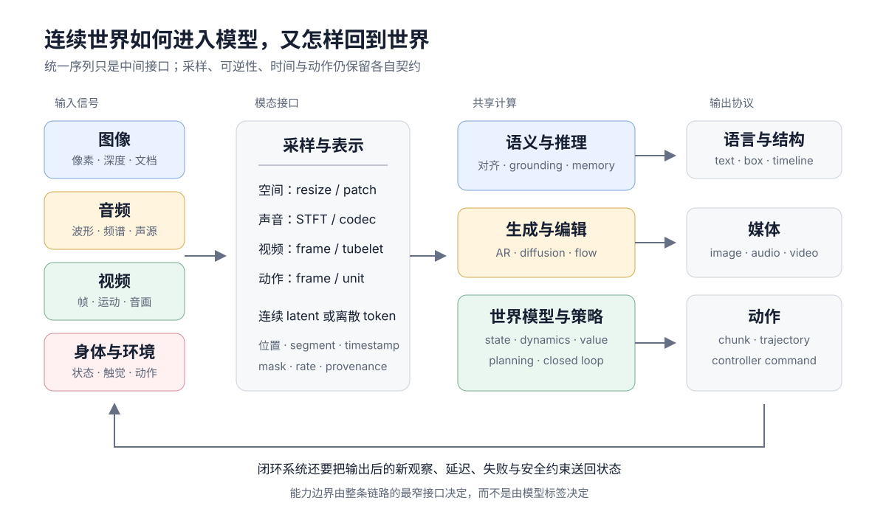

# 表示、采样与 Tokenization

多模态模型面对的是连续信号，Transformer 处理的却是有限长度的向量序列。两者之间的 encoder、采样器与 tokenizer 不是预处理细节，而是模型能看见什么、能重建什么以及计算花在哪里的第一层决定。

一个通用接口可写成

$$
x_m
\xrightarrow{\mathcal S_m}
\tilde x_m
\xrightarrow{E_m}
z_m
\xrightarrow{Q_m}
t_m
\xrightarrow{P_m}
h_m.
$$

- $\mathcal S_m$ 选择空间分辨率、音频采样率、视频帧和时间窗口；
- $E_m$ 提取连续 latent；
- $Q_m$ 可以是恒等映射、向量量化或语义 tokenizer；
- $P_m$ 把模态维度、位置和数量适配到共享主干。

任一阶段丢失的信息，后续语言模型都无法凭空恢复。它最多利用先验猜测，这正是许多多模态幻觉的来源。

<figure class="concept-figure" id="signal-to-token-map" markdown="1">



<figcaption>Token 是模态接口，不是原始世界本身。图中每一条进入共享计算的边都必须携带 shape、位置、时间、segment 与有效位置约定。</figcaption>

</figure>

## 两种充分性

表示是否“足够好”取决于目标。

### 任务充分

若 $z$ 保留完成任务 $y$ 所需的信息，即可用于分类、检索或问答。理想状态接近

$$
I(z;y)\ \text{大},\qquad I(z;x)\ \text{可被压缩}.
$$

对颜色、背景噪声或说话人音色的不变性可能提高任务泛化。

### 重建充分

生成模型还要从 $z$ 恢复 $\hat x$。它受 rate–distortion 权衡约束：

$$
\min_{E,D}\;
\mathbb E[d(x,D(E(x)))]
\lambda R(E(x)).
$$

$R$ 表示码率或 token 成本，$d$ 可以包含像素、感知、频谱或对抗距离。压缩越强，模型序列越短，但细字、纹理、瞬态声音和快速运动越容易消失。

因此，CLIP 表示适合语义比较，却不是天然的图像 codec；语音识别表示适合文字内容，却不必保留声线；机器人策略需要动作相关状态，也不要求逐像素重建背景。

## 图像：patch 是采样网格

对 $H\times W$ 图像使用 $P_h\times P_w$ patch，token 数为

$$
N_{\text{image}}
=
\left\lceil\frac{H}{P_h}\right\rceil
\left\lceil\frac{W}{P_w}\right\rceil
$$

的乘积。若直接裁掉不整除边界，坐标会悄悄改变；若 padding，则必须把无效区域传入 attention mask。

patch embedding 通常等价于 stride 等于 kernel 的卷积。它保留局部像素组合，却把 patch 内部结构压入单个向量。小字、细线和密集目标因此对 patch size 极其敏感。

动态分辨率系统常见三种策略：

- **缩放到固定画布**：batch 简单，几何形变和小字损失明显；
- **切片或 tiling**：保留局部细节，但引入重复区域、tile 顺序与全局关系；
- **原生分辨率打包**：几何最自然，序列长度与负载变化最大。

无论名称如何，都应记录原始尺寸、resize、crop、padding、patch 网格和最终 token 数。Grounding 还要保存从模型坐标返回原图坐标的可逆变换。

## 音频：时间与频率是两种坐标

波形 $x[n]$ 直接保留相位与瞬态，但采样率很高。短时傅里叶变换用滑动窗得到

$$
X(\tau,\omega)
=
\sum_n x[n]w[n-\tau]e^{-j\omega n},
$$

把一维时间信号变成时频图。Mel filterbank 再按人类听觉分辨率压缩频率轴。窗口长度、hop size 和采样率共同决定时间与频率分辨率，不存在同时无限精细的选择。

例如 16 kHz 音频、10 ms hop 每秒产生约 100 个 frame；若 encoder 再下采样 4 倍，则每秒约 25 个连续 token。codec 则可能并行输出多个码本：

$$
z\approx\sum_{q=1}^{Q} e_{q,k_q},
$$

总离散速率近似为 $Qf$ token/s，其中 $f$ 是每个码本帧率。多码本可以逐级补充声学细节，但若按普通序列完全展开，长度会迅速膨胀。

音频还必须区分三种时间：

- 原始采样时间；
- encoder/codec frame 时间；
- 模型生成与播放的墙钟时间。

流式系统中的首包、抖动、打断与回声消除都发生在第三种时间，不能仅由离线 loss 推断。

## 视频：空间网格乘以时间网格

视频可被看作帧序列，但独立编码每帧会重复计算静态背景。tubelet 把 $P_t\times P_h\times P_w$ 小立方体映射为 token：

$$
N_{\text{video}}
=
\left\lceil\frac{T}{P_t}\right\rceil
\left\lceil\frac{H}{P_h}\right\rceil
\left\lceil\frac{W}{P_w}\right\rceil
$$

的乘积。任何一轴加倍都会近似线性增加 token；全注意力成本则可能按总 token 数平方增长。

时间采样比空间 resize 更危险。若只均匀取少量帧：

- 短暂事件可能完全消失；
- 动作顺序可能被混淆；
- 周期运动可能发生 aliasing；
- 镜头切换会被误当作物体高速移动。

因此视频模型通常组合多尺度采样、局部 clip、全局摘要或分层时空 attention。生成模型还需要可逆的时空 latent，使运动与外观不在压缩阶段就被破坏。

## 离散量化的三项账

给定 encoder 输出 $z_e$ 与码本 $\{e_k\}_{k=1}^K$：

$$
k^\star=\arg\min_k\|z_e-e_k\|_2^2,
\qquad
z_q=e_{k^\star}.
$$

离散 token 让媒体可以使用交叉熵、自回归和 masked generation，但要同时核对三项：

1. **重建**：decoder 能否恢复关键细节；
2. **利用率**：码本是否大面积失活或塌缩；
3. **可建模性**：token 序列是否具有稳定局部结构和合理熵。

码本更大不一定更好。若 encoder 只使用少量 code，有效容量远低于 $K$；若 code 过于接近像素噪声，语言主干又难以学习长程规律。

[Residual Vector Quantization](../audio-language-models.md#residual-vector-quantization)通过多个码本逐级量化残差。前层往往承担粗结构，后层补充细节，但这种“语义在前、声学在后”是训练结果而非数学保证，需要用码本消融和重建验证。

## 连续 token 也在压缩

没有显式 $Q_m$ 不代表没有瓶颈。projector、pooling、resampler、token merge 和 fixed-query attention 都会改变信息容量。

设 encoder 产生 $N$ 个 token，而 resampler 输出 $M\ll N$ 个查询：

$$
H'=\operatorname{Attn}(Q_{\text{learned}},H,H).
$$

$M$ 给出固定系统成本，却把所有输入压进相同数量的槽位。对整体语义可能足够，对密集文字、多个小目标或长音频则可能过强。动态 token 策略把容量随输入复杂度调整，但会增加 batch 调度和服务尾延迟。

## 共享序列的四个标签

当不同模态进入同一主干，仅有 `token_id` 不够。每个位置至少需要四类元数据：

| 标签 | 回答的问题 |
| --- | --- |
| modality | 这是文本、图像、音频、视频还是动作？ |
| position | 它位于哪一维空间或时间坐标？ |
| segment | 它属于哪张图、哪个 clip 或哪轮对话？ |
| objective mask | 这个位置是条件、监督目标还是 padding？ |

下面的最小实现只负责把不同长度的连续 token 打包，并生成 segment、modality 与有效位置 mask。它不擅自定义 attention；因果、双向或 block mask 应由任务页单独给出。

```python
import torch
def pack_modalities(items, modality_ids):
    if len(items) != len(modality_ids) or not items:
        raise ValueError("items and modality ids must align")
    if any(x.ndim != 2 for x in items):
        raise ValueError("each item must be [token, dim]")
    if len({x.size(1) for x in items}) != 1:
        raise ValueError("embedding dimensions must match")
    values = torch.cat(items)
    segment = torch.cat([torch.full((x.size(0),), i) for i, x in enumerate(items)])
    modality = torch.cat([torch.full((x.size(0),), m) for x, m in zip(items, modality_ids)])
    valid = torch.ones(values.size(0), dtype=torch.bool)
    return values, segment, modality, valid
image = torch.randn(4, 8)
text = torch.randn(3, 8)
values, segment, modality, valid = pack_modalities([image, text], [1, 0])
assert values.shape == (7, 8)
assert segment.tolist() == [0, 0, 0, 0, 1, 1, 1]
assert modality.tolist() == [1, 1, 1, 1, 0, 0, 0]
assert valid.all()
```

生产实现还应保留原始 shape、坐标变换、timestamp、camera/view id 与样本边界；否则模型输出即使 token 对齐，也无法可靠映射回真实信号。

## 位置不是一个整数

文本序列天然有一维顺序，媒体通常需要多维位置：

$$
p_{\text{image}}=(r,c),\qquad
p_{\text{video}}=(t,r,c),\qquad
p_{\text{audio}}=(t,f).
$$

把多维网格展平成一维只是存储顺序，不应让模型误以为行尾与下一行行首是最近邻。常见方法包括：

- 分解式位置 embedding；
- 多轴 RoPE；
- 相对位置 bias；
- 由坐标生成连续位置特征；
- 局部窗口加全局 token。

序列中插入文本、多个图像或不同帧率 clip 后，还要区分<strong>媒体内部位置</strong>与<strong>对话序列位置</strong>。两者若复用同一计数器，长度外推和跨媒体关系都可能失真。

## token budget 应怎样报告

“支持一小时视频”或“支持高分辨率图像”不是充分的系统描述。至少应报告：

- 原始尺寸、时长、采样率或帧率；
- 每模态采样与压缩规则；
- 编码后 token 数分布，而不只是上限；
- 模态 token 与文本共享的上下文窗口；
- encoder、prefill、decode/生成各阶段延迟；
- 动态分辨率和动态 batch 对峰值显存与尾延迟的影响。

对于生成，还要增加 latent shape、码本数/码率、采样步数与 decoder 成本。对于机器人，还要增加观察频率、动作频率和控制闭环延迟。

## 一张表示审计表

| 问题 | 若缺失，最可能的误判 |
| --- | --- |
| 训练目标保留什么信息？ | 把任务表示当作可逆表示 |
| 原始信号如何采样？ | 把未观察到的事件当作推理失败 |
| token 数如何随输入增长？ | 忽略真实部署成本 |
| 坐标和时间怎样回映射？ | grounding 看似正确、实际错位 |
| codebook/token 利用率怎样？ | 把名义容量当作有效容量 |
| 条件与监督 mask 怎样定义？ | 信息泄漏或错误 loss 分母 |
| 缺失模态怎样表示？ | 把 padding 当作真实观察 |
| 训练与推理协议是否一致？ | 离线好、流式或闭环失效 |

理解这一层后，[融合与训练](../architecture-training.md)是在研究 token 怎样进入共享主干，[统一理解与生成](../unified-understanding-generation.md)是在研究不同充分性的表示怎样共存，[多模态评测](../../evaluation/multimodal-evaluation.md)则负责确认信息到底在哪一步丢失。

本页原语的组合、退化 shape 与 round-trip 测试见[多模态手撕实现](../../practice/multimodal.md)。

## Reference {#reference}

- [Dosovitskiy et al., An Image is Worth 16x16 Words](https://arxiv.org/abs/2010.11929)
- [van den Oord et al., Neural Discrete Representation Learning](https://arxiv.org/abs/1711.00937)
- [Esser et al., Taming Transformers for High-Resolution Image Synthesis](https://arxiv.org/abs/2012.09841)
- [Zeghidour et al., SoundStream: An End-to-End Neural Audio Codec](https://arxiv.org/abs/2107.03312)
- [Défossez et al., High Fidelity Neural Audio Compression](https://arxiv.org/abs/2210.13438)
- [Tong et al., VideoMAE: Masked Autoencoders are Data-Efficient Learners for Self-Supervised Video Pre-Training](https://arxiv.org/abs/2203.12602)
- [Yu et al., Language Model Beats Diffusion — Tokenizer Is Key to Visual Generation](https://arxiv.org/abs/2310.05737)
- [Team Chameleon, Chameleon: Mixed-Modal Early-Fusion Foundation Models](https://arxiv.org/abs/2405.09818)
- [Wu et al., Janus: Decoupling Visual Encoding for Unified Multimodal Understanding and Generation](https://arxiv.org/abs/2410.13848)
