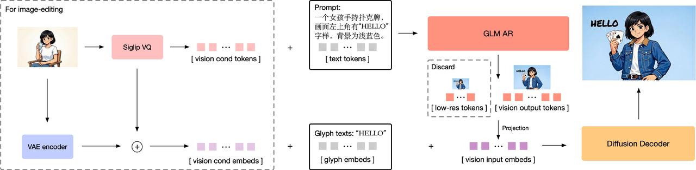

# 图像生成：离散 Token、Diffusion 与 Flow

图像生成模型需要把简单先验分布或离散序列变成高维像素。主要路线分别建模：

- 离散视觉 token 的条件概率；
- 加噪过程的反向去噪；
- 噪声到数据之间的连续向量场。

三者的训练目标、采样路径和失败模式不同，不能只按最终样例比较。

[DDPM、DiT 与 Flow Matching](../landscape/works/diffusion-dit-flow.md) 把去噪目标、Transformer backbone 和连续向量场放在同一组符号下比较；它们与视觉语言理解路线的汇合位置见[多模态理解与生成](../landscape/lineages/multimodal-generation.md)。

<div markdown="block">
<figure class="paper-figure paper-figure--wide" id="glm-image-hybrid-pipeline" data-paper-source="glm-image-hybrid-pipeline" data-paper-asset="glm-image-hybrid-pipeline" markdown="1">
[{ width="1280" height="314" loading="lazy" decoding="async" }](../assets/papers/glm-image-hybrid-pipeline/glm-image-hybrid-pipeline.png)
<figcaption><strong>standalone diagram 展示离散自回归与连续扩散并非互斥路线：AR 阶段负责语义和低分辨率视觉 token，diffusion decoder 负责高分辨率生成。</strong>编辑输入还通过 VQ 与 VAE 形成两种条件表示，文字 glyph 另设 embedding；这些接口解释了可控性来源，也增加 tokenizer、投影、mask 与 decoder 版本耦合。<span class="paper-figure__source">图源：<a href="https://raw.githubusercontent.com/zai-org/GLM-Image/69b87db2874f8b556417c03eedf2b8a1484f62e0/resources/architecture_1.jpeg">GLM-Image hybrid autoregressive and diffusion pipeline, standalone diagram</a>；Copyright 2026 Zhipu AI，<a href="https://github.com/zai-org/GLM-Image/blob/69b87db2874f8b556417c03eedf2b8a1484f62e0/LICENSE">Apache License 2.0</a>。</span></figcaption>
</figure>
</div>

## VQ 表示

Encoder 产生连续 latent：

$$
z_e=E(x).
$$

对每个位置选择最近码本向量：

$$
k^\star
=
\arg\min_j\|z_e-e_j\|_2^2,
\qquad
z_q=e_{k^\star}.
$$

[VQ-VAE](https://arxiv.org/abs/1711.00937) 的典型目标包含重建、码本和 commitment：

$$
L
=
L_{\mathrm{recon}}
+
\|\operatorname{sg}(z_e)-e\|_2^2
+
\beta
\|z_e-\operatorname{sg}(e)\|_2^2.
$$

Straight-through 路径可写为

$$
z_{\mathrm{st}}
=
z_e+\operatorname{sg}(z_q-z_e),
$$

前向使用 $z_q$，反向把 decoder 梯度传给 encoder。

VQ 的语义核是“最近邻用于前向，straight-through 用于 encoder 梯度”。下面把 flattened latent 写为 `[position, dim]`；空间 layout 应在外围显式展平并原样恢复。

```python
import torch
def vector_quantize(z_e, codebook, beta=.25):
    if z_e.ndim != 2 or codebook.ndim != 2 or z_e.size(1) != codebook.size(1):
        raise ValueError("expected [position, dim] and [code, dim]")
    distance = (z_e.square().sum(1, keepdim=True)
                + codebook.square().sum(1) - 2 * z_e @ codebook.T)
    index = distance.argmin(1)
    z_q = codebook[index]
    z_st = z_e + (z_q - z_e).detach()
    codebook_loss = (z_q - z_e.detach()).square().mean()
    commitment = beta * (z_e - z_q.detach()).square().mean()
    return z_st, index, codebook_loss + commitment
z = torch.tensor([[.9, .1], [.1, .8]], requires_grad=True)
codebook = torch.tensor([[1., 0.], [0., 1.]], requires_grad=True)
z_st, index, vq_loss = vector_quantize(z, codebook)
torch.testing.assert_close(z_st, codebook[index])
assert index.tolist() == [0, 1]
(z_st.sum() + vq_loss).backward()
assert z.grad is not None and codebook.grad is not None
```

`z_st` 的数值等于码本向量，但对 decoder loss 的局部导数按恒等映射流向 `z_e`；codebook 与 commitment 两项各自 detach，避免错误地互相追逐。生产 tokenizer 还要监控 code usage、dead code、EMA 更新约定和 padding/特殊 code。

[VQGAN](https://arxiv.org/abs/2012.09841) 加入感知与对抗目标，提高重建的感知质量。重建更锐利不一定意味着码本更适合语义建模；tokenizer 需同时评估 reconstruction、code usage 与下游生成。

## 离散自回归与 masked generation

量化后可建模

$$
p(z\mid c)
=
\prod_{t=1}^{N}
p(z_t\mid z_{<t},c).
$$

优点是与语言模型、交错图文和受约束解码统一；缺点是生成步数随视觉 token 数增长，且 raster 顺序对二维局部性不友好。

[MaskGIT](https://arxiv.org/abs/2202.04200) 并行预测被 mask 的图像 token，并迭代保留高置信位置。迭代 masked generation 需要明确每步 remask schedule、置信度和最终未填位置处理。

## Diffusion 前向过程

[DDPM](https://arxiv.org/abs/2006.11239) 定义逐步加噪。记

$$
\alpha_t=1-\beta_t,
\qquad
\bar\alpha_t=\prod_{s=1}^{t}\alpha_s,
$$

则可以直接采样任意时刻：

$$
x_t
=
\sqrt{\bar\alpha_t}x_0
+
\sqrt{1-\bar\alpha_t}\epsilon,
\qquad
\epsilon\sim\mathcal N(0,I).
$$

噪声预测目标：

$$
L_\epsilon
=
\mathbb E_{x_0,t,\epsilon}
\left[
w(t)
\|\epsilon-\epsilon_\theta(x_t,t,c)\|_2^2
\right].
$$

模型也可预测 $x_0$、score 或 velocity。Prediction type、noise schedule 与 sampler 必须成套匹配。

## DDIM 与采样

[DDIM](https://arxiv.org/abs/2010.02502) 构造与 DDPM 共享训练边缘分布的非马尔可夫采样路径，可减少采样步数并控制随机性。少步不自动保持质量；时间步子集、参数化和 discretization 都会改变误差。

## Latent diffusion

[Latent Diffusion](https://arxiv.org/abs/2112.10752) 先用 autoencoder 压缩图像：

$$
z=E(x),
\qquad
\hat x=D(z),
$$

再在 latent $z$ 上扩散。空间压缩降低计算，但 decoder 重建误差构成上限。实现必须固定 autoencoder 版本、latent scale、通道布局和像素归一化。

[DiT](https://arxiv.org/abs/2212.09748) 使用 Transformer 处理 latent patches，并通过时间和条件调制 block。其“Transformer”是去噪 backbone，不等于自回归语言模型。

<div markdown="block">
<figure class="paper-figure paper-figure--wide" id="dit-figure-03" data-paper-source="dit" data-paper-asset="dit-figure-03" markdown="1">
[{ width="2150" height="883" loading="lazy" decoding="async" }](../assets/papers/dit/figure-03-architecture-conditioning.png)
<figcaption><strong>Figure 3 把 DiT 的两个独立选择放在一起：latent 怎样切成序列，时间与类别条件怎样进入 Transformer block。</strong>adaLN-Zero、cross-attention 与条件 token 拼接具有不同参数、缓存和初始化契约；使用 Transformer backbone 并不会让这些条件接口自动等价。<span class="paper-figure__source">图源：<a href="https://arxiv.org/pdf/2212.09748v2#page=3">Scalable Diffusion Models with Transformers, Figure 3, p. 3</a>；Copyright © 2023 William Peebles and Saining Xie，<a href="https://creativecommons.org/licenses/by/4.0/">CC BY 4.0</a>。</span></figcaption>
</figure>
</div>

## Conditioning

常见条件接口包括：

- cross-attention；
- AdaLN/FiLM 尺度与偏置；
- 条件 token 拼接；
- control encoder；
- classifier-free guidance。

Classifier-free guidance：

$$
\hat\epsilon
=
\epsilon_{\varnothing}
+
w(\epsilon_c-\epsilon_{\varnothing}).
$$

$w$ 提高通常增强条件遵循，但可能降低多样性、产生过饱和和伪影。训练时条件 dropout、无条件分支定义与 batch 拼接顺序必须和推理一致。

## Flow matching

连续流满足

$$
\frac{dx_t}{dt}=v_\theta(x_t,t,c).
$$

[Flow Matching](https://arxiv.org/abs/2210.02747) 直接回归选定概率路径的条件向量场。对简单线性插值：

$$
x_t=(1-t)x_0+tx_1,
\qquad
u_t=x_1-x_0.
$$

目标：

$$
L_{\mathrm{FM}}
=
\mathbb E
\|v_\theta(x_t,t,c)-u_t\|_2^2.
$$

[Rectified Flow](https://arxiv.org/abs/2209.03003) 研究把耦合路径变直以减少积分误差。训练不需要完整解 ODE，推理仍需 solver：

$$
x_{t+\Delta t}
=
x_t+\Delta t\,v_\theta(x_t,t,c)
$$

是最简单 Euler 步。时间方向、边界分布和步长写反会生成完全错误的过程。

加噪、CFG 和 flow 积分很短，却最容易因 broadcast、条件对齐或时间方向产生静默错误。下面约定 `alpha_bar` 已按 batch 选好并可广播，flow 从 $t=0$ 的 noise 积分到 $t=1$ 的 data；模型函数只接收当前状态与标量时间。

<details class="code-disclosure">
<summary id="diffusion-flow-semantic-reference">Diffusion 加噪、CFG 与 Euler flow <span class="code-disclosure__meta">Python · 29 行</span></summary>
<div class="code-disclosure__body" markdown="1">

```python
import torch
def q_sample(x0, noise, alpha_bar):
    while alpha_bar.ndim < x0.ndim:
        alpha_bar = alpha_bar.unsqueeze(-1)
    return alpha_bar.sqrt() * x0 + (1 - alpha_bar).sqrt() * noise
def classifier_free_guidance(unconditional, conditional, scale):
    if unconditional.shape != conditional.shape:
        raise ValueError("conditional branches must align")
    return unconditional + scale * (conditional - unconditional)
@torch.no_grad()
def euler_flow(x, velocity, steps):
    if steps <= 0:
        raise ValueError("steps must be positive")
    dt = 1 / steps
    for step in range(steps):
        t = x.new_tensor(step * dt)
        x = x + dt * velocity(x, t)
    return x
x0 = torch.tensor([[1., -1.]])
noise = torch.tensor([[3., 5.]])
torch.testing.assert_close(q_sample(x0, noise, torch.tensor([1.])), x0)
torch.testing.assert_close(q_sample(x0, noise, torch.tensor([0.])), noise)
u, c = torch.zeros(2), torch.tensor([1., 2.])
torch.testing.assert_close(classifier_free_guidance(u, c, 0), u)
torch.testing.assert_close(classifier_free_guidance(u, c, 1), c)
start = torch.zeros(2)
end = euler_flow(start, lambda x, t: torch.ones_like(x), 4)
torch.testing.assert_close(end, torch.ones(2))
assert not end.requires_grad
```

</div>
</details>

这不是 DDPM/DDIM sampler：`q_sample` 只实现训练侧闭式前向边缘，Euler 只实现给定向量场的 ODE 积分。真实 sampler 必须把 prediction type、schedule、solver 与时间网格作为同一版本化契约；CFG 两个分支还需共享 latent、时间与 batch 顺序。

## 少步与一致性

[Consistency Models](https://arxiv.org/abs/2303.01469) 学习同一概率流轨迹上不同点映射到一致输出，可支持一步或少步生成。应分别报告：

- 是否从预训练 diffusion 蒸馏；
- 一步、少步和多步质量；
- 采样成本与训练额外成本；
- 新分布和强 guidance 下的稳定性。

## Shape 与实现契约

图像 latent 常写为

$$
z\in\mathbb R^{B\times C\times H'\times W'}.
$$

DiT patchify 后：

$$
z_{\mathrm{seq}}
\in
\mathbb R^{B\times N\times d},
\qquad
N=\frac{H'}P\frac{W'}P.
$$

实现应固定：

1. 像素范围与 channel order；
2. autoencoder latent scale；
3. $\beta_t,\alpha_t,\bar\alpha_t$ 的索引约定；
4. prediction type；
5. 时间 $t$ 的方向和离散网格；
6. conditional/unconditional batch 对齐；
7. solver、步数和随机性；
8. VQ codebook、特殊 token 与扫描顺序。

## 失效模式

- **Codebook collapse**：少数 code 占据大部分位置。
- **Dead codes**：部分 embedding 永远不被选择。
- **重建上限**：生成错误来自 tokenizer/autoencoder 而非 prior。
- **参数化错配**：模型预测 $v$，sampler 按 $\epsilon$ 解释。
- **Schedule 错位**：训练与推理时间索引不一致。
- **CFG 过强**：条件遵循提高但多样性和自然度下降。
- **Flow 方向错误**：从数据积分到噪声而非反向。
- **Solver 截断**：少步误差集中在细节或构图。
- **评测混淆**：只看感知质量，不测文字、计数和属性绑定。

## 验证矩阵

| 层级 | 测试 |
| --- | --- |
| VQ | 最近邻、STE 梯度、code usage、原图重建 |
| Forward noise | $t=0$、末端分布、经验均值与方差 |
| Prediction | $\epsilon/x_0/v$ 相互转换 |
| CFG | $w=0,1$ 与 batch 对齐 |
| Flow | 边界、方向、Euler 步与解析向量场 |
| Sampling | seed、步数、solver、guidance 网格 |
| 语义 | 文字、数量、空间、属性绑定与身份 |
| 系统 | 采样步数、延迟、峰值显存与吞吐 |

理解与生成怎样共享主干见[理解与生成统一](unified-understanding-generation.md)，音视频的离散表示见[音频与语音](audio-language-models.md)和[视频与世界模型](video-world-models.md)，最小 VQ、加噪、CFG 与 flow sampler 见[多模态手撕实现](../practice/multimodal.md)。

## 继续深入

本页保留三条生成路线的共同符号与稳定入口：

- [从像素概率到 GAN](image-generation/history-autoregressive-gan.md) 补齐 likelihood、adversarial game 与离散 AR 的历史；
- [Autoencoder 与视觉 Tokenizer](image-generation/autoencoders-tokenizers.md) 讨论压缩、码本和 decoder 上限；
- [Diffusion 与 Score](image-generation/diffusion-score.md) 统一离散加噪、score、SDE 与 prediction type；
- [Latent Diffusion、DiT 与 Flow](image-generation/latent-dit-flow.md) 连接生成空间、backbone、概率路径和少步采样；
- [条件控制、编辑与评测](image-generation/control-editing-evaluation.md)分开条件遵循、局部编辑、身份保持、质量与系统成本。

## Reference {#reference}

- [VQ-VAE](https://arxiv.org/abs/1711.00937)
- [VQGAN](https://arxiv.org/abs/2012.09841)
- [MaskGIT](https://arxiv.org/abs/2202.04200)
- [Denoising Diffusion Probabilistic Models](https://arxiv.org/abs/2006.11239)
- [DDIM](https://arxiv.org/abs/2010.02502)
- [High-Resolution Image Synthesis with Latent Diffusion Models](https://arxiv.org/abs/2112.10752)
- [Scalable Diffusion Models with Transformers](https://arxiv.org/abs/2212.09748)
- [Flow Matching for Generative Modeling](https://arxiv.org/abs/2210.02747)
