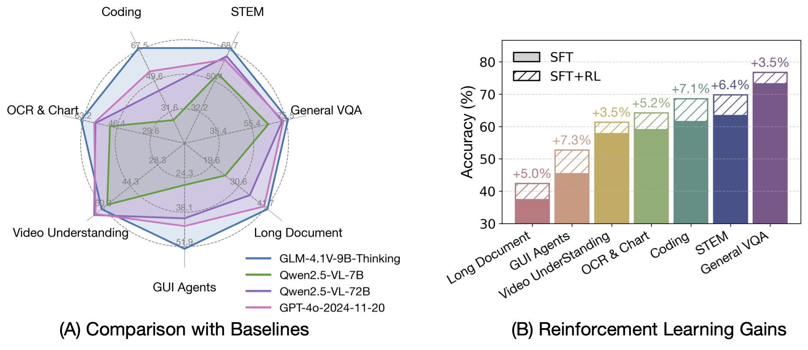
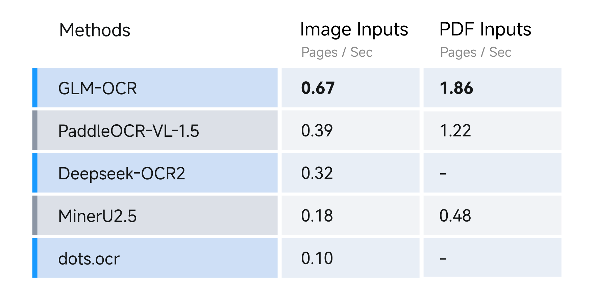
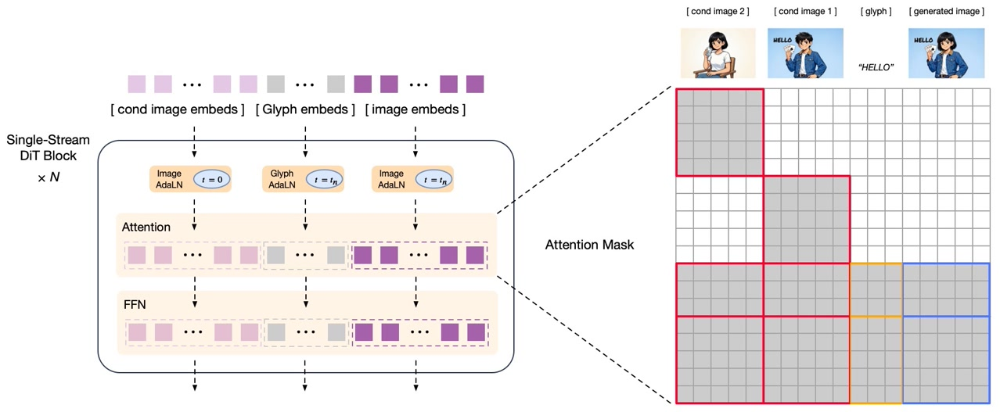

# GLM 多模态分支：从视觉桥接到媒体生成

GLM 生态里的“多模态”并不是一条把图像、语音和视频依次接入同一 checkpoint 的直线。它更像几次围绕共同问题的重新设计：视觉信息应该只在输入端对齐，还是进入语言模型的每一层；高分辨率页面应该由一个大模型整页读取，还是先分区再并行识别；媒体生成应该继续像语言一样自回归，还是把语义规划与连续信号重建拆开。

因此，本页不重复 [GLM 家族总览](../landscape/families/glm.md)中的发布日期和公开物账本，而是沿计算图追踪这些选择怎样演变。精确的 paper、weights、API 与产品事件边界见 [GLM 演化时间线](../landscape/glm-timeline.md)。

## 先把谱系边界画清楚

名称相近，不等于权重直接继承。下面三类关系应始终分开：

- **明确从 GLM 语言 checkpoint 派生**：VisualGLM-6B 使用 ChatGLM-6B；GLM-4V 使用 GLM-4-9B；GLM-4.1V 使用 GLM-4-9B-0414；GLM-4.5V 使用 GLM-4.5-Air；GLM-4-Voice 从 GLM-4-9B 继续 speech-text 训练；GLM-Image 的自回归部分由 GLM-4-9B-0414 初始化。
- **方法相邻、语言基座不同**：CogVLM-17B 使用 Vicuna-1.5-7B，CogVLM2 的公开主模型使用 Llama-3-8B。CogVLM2 与 GLM-4V 可以共享训练方法和数据，但不是同一组权重。
- **同一研究生态中的生成谱系**：CogView、CogVideo 与 CogVideoX 提供了重要的图像、视频生成技术积累，却不能仅凭 `Cog` 名称视为语言 GLM 的模态版本。CogView4 使用 GLM-4-9B 作为文本 encoder，仍不等于从 GLM-4 checkpoint 继续做语言建模。

CogAgent 横跨前两类：初代 18B 模型建立在 CogVLM 上；后来的 CogAgent-9B-20241220 才明确使用 GLM-4V-9B。GLM-5V-Turbo 与 CogVideoX-3 又属于服务对象；在没有同名开放权重和同粒度报告时，API 能力说明不能替代 checkpoint 结构。

## 一张机制账本 {#mechanism-ledger}

这张表只登记会改变计算路径的公开信息，不用型号名补写未披露的内部继承。

| 对象 | 主要问题 | 表示或感知 | 主干与桥接 | 训练或解码信号 | 证据边界 |
| --- | --- | --- | --- | --- | --- |
| VisualGLM-6B | 中英图文对话 | 视觉 encoder | BLIP-2 Q-Former 接入 ChatGLM-6B | 图文预训练、长 VQA 微调 | 明确是 ChatGLM 派生；输入仅 224×224 |
| CogVLM | 深层视觉—语言融合 | ViT + adapter | 每层 visual expert QKV / FFN，文本路径保留原 LLM 参数 | 1.5B 公开图文对预训练、SFT | 公开 17B 模型使用 Vicuna，不是 GLM checkpoint |
| CogVLM2 / Video | 高分辨率与视频理解 | 最高 1344×1344；多帧与时间戳 | 延续 visual expert；公开主干为 Llama-3-8B | 改进预训练、后训练与时序 grounding 数据 | GLM-4V 与它方法、数据相近，权重不同 |
| CogAgent | GUI 小字、定位与规划 | 224 低分辨率分支 + 1120 高分辨率分支 | 高分辨率 cross-attention 注入每层 decoder | OCR、grounding、网页和动作轨迹 | 初代基于 CogVLM；9B 后续版基于 GLM-4V |
| GLM-4.1V | 通用视觉推理 | AIMv2-Huge 初始化的 CogViT；原生分辨率、视频帧 | MLP projector + GLM-4-9B-0414；2D / 3D RoPE | 长 CoT SFT + RLCS | Base 与 Thinking 是不同 checkpoint |
| GLM-4.5V / 4.6V | 规模化推理、文档、GUI 与工具 | 与 4.1V 共享视觉框架 | GLM-4.5-Air 106B-A12B MoE；4.6V 另有 9B Flash | 多域 verifier、GRPO、长上下文继续训练 | 4.6V 报告是同一滚动稿中的增量披露 |
| GLM-5V-Turbo | 文件、图像、视频与视觉工具执行 | 服务端预处理未完整公开 | API 对象 | 产品接口与服务评测 | 没有同名开放权重和完整训练报告 |
| GLM-OCR | 文档结构化与高吞吐 | 0.4B CogViT | connector + 0.5B GLM decoder；0.9B 总计 | MTP、任务级 SFT、full-task RL | 完整 SDK 还包含 layout detector 与 merge |
| GLM-Edge-V | 端侧视觉理解 | 672×672 实机口径之一 | 2B / 5B 端侧模型 | 量化、投机解码与芯片 kernel | 部分优化方案未随仓库公开 |
| GLM-4-Voice | 端到端语音对话 | Whisper encoder + VQ，12.5 speech token/s | GLM-4-9B + 流式 flow decoder | speech-text 交错预训练与语音对话对齐 | 是语音对话模型，不等同于 ASR 或 TTS |
| GLM-ASR-Nano-2512 | 多语与低音量转写 | 公开材料未给完整 encoder 配方 | 1.5B speech-to-text 模型 | 自回归转写 | 仓库与模型卡没有同粒度技术报告 |
| GLM-TTS | 零样本克隆与可控合成 | 25 Hz、32K 词表 speech tokenizer | text-to-token AR + token-to-mel flow + vocoder | CER / SIM / Emotion / Laughter 多奖励 GRPO | 独立 1.5B TTS 系统，不是 Voice checkpoint 更新 |
| CogView → CogView2 | 图像离散生成与高分辨率 | VQ-VAE 图像 token | 4B AR；后续 6B CogLM 分层生成 | next-token、mask infilling、LoPAR 超分 | 与语言 GLM 无 checkpoint 继承 |
| CogView3 / 4 | 连续 latent 图像生成 | VAE latent | relay diffusion；后续 6B DiT | denoising / diffusion | CogView4 公开细节主要来自代码与模型卡 |
| GLM-Image | 知识密集与文字渲染 | 离散视觉语义 + latent | 9B AR 规划 + 7B 单流 DiT + Glyph Encoder | AR 与 decoder 解耦反馈、GRPO | 自回归部分明确由 GLM-4-9B-0414 初始化 |
| CogVideo | 低帧率语义到高帧率视频 | 离散帧 token | 继承 CogView2 的双通道 AR Transformer | 多帧率分层训练 | 9.4B 旧路线，与 CogVideoX 架构不同 |
| CogVideoX | 长视频 latent diffusion | 3D causal VAE，时空压缩 | Expert Transformer + 3D full attention | diffusion、渐进训练、多分辨率 frame packing | 1.5 是 checkpoint 更新；X-3 主要是 API 对象 |

## 视觉桥接：从输入适配走到深层专家

### VisualGLM：先让一个冻结接口说得通

VisualGLM 延续了 BLIP-2 的思路：视觉 encoder 产生 patch feature，有限个可学习 query 通过 Q-Former 从中抽取信息，再投影到语言模型可读的 embedding：

$$
Z_v=E_v(I),\qquad
H_v=\operatorname{QFormer}(Q,Z_v),\qquad
p(y\mid I,x)=\prod_t p(y_t\mid H_v,x,y_{<t}).
$$

这个设计的价值是复用已有 ChatGLM-6B，并把主要跨模态学习集中在一个窄接口。官方仓库披露的预训练数据包含约 3000 万中文图文对和 3 亿筛选后的英文图文对，随后再用长视觉问答数据微调。

瓶颈也恰好落在这个接口上：224×224 输入让小字和细粒度属性在进入 Q-Former 前就可能消失；少量 query 又必须把整图压成固定预算。官方局限说明列出的长描述幻觉、属性错配、细节不足和中文 OCR 缺失，并不是单靠扩大语言 decoder 就能修复的问题。视觉 token 的采样与压缩原理见[信号、表示与 Token 化](foundations/signals-tokenization.md)。

### CogVLM：给视觉 token 一套逐层参数

CogVLM 认为只在输入端做 shallow alignment 不足以弥合视觉特征与语言隐藏状态的差异，于是在每个 Transformer 层为视觉位置加入独立的 QKV 与 FFN 参数。将视觉与文本隐藏状态分别记为 $X_I,X_T$：

$$
Q=
\begin{bmatrix}
X_IW_I^Q\\
X_TW_T^Q
\end{bmatrix},
\quad
K=
\begin{bmatrix}
X_IW_I^K\\
X_TW_T^K
\end{bmatrix},
\quad
V=
\begin{bmatrix}
X_IW_I^V\\
X_TW_T^V
\end{bmatrix},
$$

$$
\operatorname{FFN}(X)=
\begin{bmatrix}
\operatorname{FFN}_I(X_I)\\
\operatorname{FFN}_T(X_T)
\end{bmatrix}.
$$

视觉位置因而能在每一层学习专门变换，纯文本位置仍走原语言模型参数。这不是“视觉和文本完全分开”：二者仍在同一 causal attention 中交换信息；分开的是产生 QKV 与经过 FFN 的参数路径。它用额外容量换取深层融合，同时尽量保持原 LLM 的文本能力。

<figure class="paper-figure paper-figure--wide" id="cogvlm-visual-expert-figure" data-paper-source="glm-cogvlm-visual-expert" data-paper-asset="cogvlm-visual-expert" markdown="1">

[{ width="1378" height="824" loading="lazy" decoding="async" }](../assets/papers/glm-cogvlm-visual-expert/cogvlm-visual-expert.png)

<figcaption><strong>visual expert 改的是逐层参数路径，不是把视觉 token 隔离在另一条网络里。</strong>左图先把图像特征与文本 embedding 拼成同一 causal 序列；右图中，紫色 QKV 与 FFN 只处理视觉位置，文本位置仍走冻结的原语言参数，而 attention 仍让两类位置交换信息。图源：<a href="https://raw.githubusercontent.com/zai-org/CogVLM/f7283b2c8d26cd7f932d9a5f7f5f9307f568195d/assets/method.png">CogVLM 官方仓库方法图，固定 revision <code>f7283b2</code>；对应论文 Figure 3</a>；Copyright 2024 CogVLM team @ Zhipu AI，<a href="https://github.com/zai-org/CogVLM/blob/f7283b2c8d26cd7f932d9a5f7f5f9307f568195d/LICENSE">Apache License 2.0</a>。</figcaption>

</figure>

这里最重要的谱系边界是：CogVLM-17B 的语言主干是 Vicuna-1.5-7B。它对 GLM-V 的贡献是一种桥接设计，而不是某个 GLM-4V 权重的前一版本。[对齐、桥接与融合](foundations/alignment-fusion.md)系统比较了 projector、resampler、cross-attention、deep fusion 与 early fusion。

### CogVLM2 与 GLM-4V：方法共享不等于模型共享

CogVLM2 保留 visual expert，把图像输入提高到最高 1344×1344，并把视频组织成多帧输入；CogVLM2-Video 显式加入时间戳，并构造时序 grounding 数据。公开的 CogVLM2 主模型使用 Llama-3-8B。

同期 GLM-4V-9B 使用 CogVLM2 的数据和训练方法，但把语言基座换成 GLM-4-9B。比较二者时，至少需要同时固定：

1. 图像 resize、tile 与视觉 token 上限；
2. 视频采样帧率、帧数与时间戳格式；
3. language backbone、chat template 与最大上下文；
4. visual expert 是否参与微调；
5. grounding 坐标词表与输出协议。

“同方法、不同基座”意味着能力差异不能简单归因于 visual expert；语言知识、tokenizer、对话模板与训练数据 mixture 都在变化。

## GLM-V：原生分辨率、时间与视觉推理

GLM-4.1V、GLM-4.5V 与 GLM-4.6V 共享一条更清晰的三段式计算图：

$$
I_{1:F}
\xrightarrow{\text{CogViT}}
Z_v
\xrightarrow{\text{MLP projector}}
H_v
\xrightarrow{\text{GLM decoder}}
y.
$$

视觉 encoder 由 AIMv2-Huge 初始化。视频输入把 2D patch embedding 的卷积替换成 3D 卷积，在时间轴下采样两倍；单图会复制成两个时间片，以保持相同接口。每帧之后插入用字符串表示的真实时间戳，使“第几个采样帧”和“视频中的实际时间”不再混为一谈。

### 任意分辨率需要两套位置线索

对于 $H_p\times W_p$ 的 patch 网格，GLM-V 一方面在 ViT attention 中加入 2D RoPE，另一方面保留视觉预训练得到的 absolute position embedding，并按输入尺寸做双三次插值。patch 坐标 $\mathbf g=(w,h)$ 先归一化为

$$
\mathbf g_{\text{norm}}
=2\left(
\frac{w+0.5}{W_p},
\frac{h+0.5}{H_p}
\right)-1,
$$

再得到

$$
P_{\text{adapted}}(\mathbf g)
=
\mathcal I_{\text{bicubic}}
\left(P_{\text{orig}},\mathbf g_{\text{norm}}\right).
$$

2D RoPE 表示 patch 之间的相对空间关系，插值后的 absolute embedding 则尽量保留原视觉 encoder 的位置先验。进入语言侧以后，3D RoPE 为文本与视觉 token 编码额外的空间轴。这里的“支持 4K”不等于所有 4K 像素逐点无损进入 LLM；真正成本仍由 patch、时空下采样和 token 上限决定。

### 语言主干决定规模与路由

- GLM-4.1V-9B 与 GLM-4.6V-Flash 使用 GLM-4-9B-0414 级别的 dense language backbone；
- GLM-4.5V 与 GLM-4.6V 使用 GLM-4.5-Air，公开规模为 106B-A12B；
- 同一视觉 preprocessing 不保证同一 chat template，官方实现特别要求区分各版本模板；
- GLM-4.6V 把多模态 function calling 和 128K context 纳入公开模型接口；
- GLM-5V-Turbo 进一步把图像、视频和文件接进线上工具链，但没有同名开放权重与完整结构报告，不能把服务能力反推到 GLM-5 语言 checkpoint。

视觉输入会增加 prefill、KV cache 和 MoE 路由负担。仅报告总参数或视觉 benchmark，无法回答一次多页文档请求的成本；还应记录视觉 token、激活 expert、context parallel、首 token 时延与长输出长度。

## 从预训练上界到 RLCS

GLM-V 的训练不是“先看懂图片，再加一层强化学习”，而是把可学习难度逐级提高。

### 预训练先决定可探索空间

官方报告披露的视觉语料从超过 100 亿图文候选开始，经过启发式过滤、CLIP 相关性过滤、概念重采样与 factual recaption；另包含交错网页与学术书籍、2.2 亿 OCR 图像、约 4000 万自然图像 grounding 标注、超过 1.4 亿 GUI referring-expression 问答，以及视频与纯文本数据。

训练先在 8192 序列长度进行 12 万步多模态预训练，再用视频和超过 8K 的交错数据做 32768 长度继续训练；报告为 GLM-4.6V 另披露了 131072 长度阶段。这里的关键不是数字本身，而是顺序：如果 base model 从未获得小字、时序、布局或坐标证据，RL 只能在贫弱表示上放大奖励捷径。

### SFT 教会输出协议

长 CoT SFT 把响应组织为思考与答案区域，并为可验证任务规定唯一的 boxed final answer。GLM-4.6V 又定义 XML 风格的 tool-call schema。它们让 verifier 和执行器能稳定解析输出，但也带来版本契约：改 chat template、特殊 token 或工具序列化方式，可能使同一权重表现显著变化。

### RLCS 选择“此刻刚好能学会”的样本

GLM-V 先按任务领域构造 verifier，再以 GRPO 优化。对一个 prompt 的 $G$ 条 rollout，若奖励全部相同，则组内标准化后几乎没有有效学习信号：

$$
\operatorname{Var}(r_1,\ldots,r_G)=0
\quad\Longrightarrow\quad
\hat A_1=\cdots=\hat A_G\approx0.
$$

RLCS 用多个模型的离线 pass@$k$、人工难度与在线 rollout 结果给样本分层，降低过易和当前过难样本，增加中等难度样本。报告没有给出一个可脱离完整系统复刻的唯一采样公式，因此更准确的理解是一个闭环：

$$
\text{rollout success}
\rightarrow
\text{online difficulty}
\rightarrow
\text{sampling reweight}
\rightarrow
\text{new policy}.
$$

当全对或全错的无效组比例为 $q_t$，系统用

$$
e_t=\frac{1}{1-q_t},
\qquad
\bar e_t=\beta\bar e_{t-1}+(1-\beta)e_t
$$

估计下一轮 oversampling 倍率，再挑选正确与错误响应更均衡的组。配方还包括 force answering、移除 KL loss、提高上侧 ratio clipping 边界和较大 batch。它们是这套 VLM 训练中的联动选择，不能拆成一张普适超参数表。

作者报告：跨任务 RL 增益与比较边界

<figure class="paper-figure paper-figure--wide" id="glmv-rl-multidomain-figure" data-paper-source="glm-v-multidomain-rl" data-paper-asset="glmv-rl-multidomain" markdown="1">

[{ width="1880" height="817" loading="lazy" decoding="async" }](../assets/papers/glm-v-multidomain-rl/glmv-rl-multidomain.png)

<figcaption><strong>右图支持“同一后训练阶段在多域都有增益”，却不能证明每项增益都由 RLCS 单独造成。</strong>柱体底部是 SFT，斜线段是作者报告的 SFT+RL 增量；左侧雷达图又混合不同基线和任务尺度。读图时应保留各 benchmark 的 verifier、采样预算与评测协议，不能把不同轴的面积当成统一总分。图源：<a href="https://raw.githubusercontent.com/zai-org/GLM-V/726dac56ddde6d33f72bd62967322e15f61a8471/resources/rl.jpeg">GLM-V 官方仓库 RL 对比图，固定 revision <code>726dac5</code>，standalone figure</a>；Copyright 2026 Z.AI Co., Ltd，<a href="https://github.com/zai-org/GLM-V/blob/726dac56ddde6d33f72bd62967322e15f61a8471/LICENSE">Apache License 2.0</a>。</figcaption>

</figure>

### 多域训练最脆弱的是 verifier

GLM-V 的公开 reward system 按任务改变判分：

| 领域 | 主信号 | 容易被忽略的边界 |
| --- | --- | --- |
| OCR | $1-d_{\text{edit}}/\max(\lvert y\rvert,\lvert y^\star\rvert)$ | `43` 与 `43.0` 未必等价 |
| Grounding | IoU 超阈值的目标比例 | resize、crop、坐标量化必须一致 |
| GUI Agent | action type、参数、IoU 与任务结果 | 点中元素不等于状态转移成功 |
| Chart / STEM | 数值、符号或语义等价 | 单位、容差与 answer extraction |
| 文档 / 视频 | 规则与 model judge 组合 | judge 版本、prompt 与开放答案偏差 |

报告中的重要反例是：某个多图 QA verifier 被利用以后，不仅对应领域的 reward 被抬高，STEM 等其他领域的实际指标也会下降。共享参数使一个弱 verifier 的偏差跨域传播。因此，reward 单元测试、错误切片和离线回放不是外围工程，而是多模态 RL 的一部分。通用推导见 [GRPO](../reinforcement-learning/grpo.md)与[验证器和奖励塑形](../reinforcement-learning/verifiers-reward-shaping.md)。

## 文档与 OCR：把整页问题拆成可并行子问题

通用 GLM-V 需要同时回答开放问题、读图表和处理 GUI；GLM-OCR 则把目标收窄到结构化文档理解。它由 0.4B CogViT、轻量 connector 与 0.5B GLM decoder 组成，总计约 0.9B。

### MTP 让结构输出不必逐字等待

OCR 的长 Markdown、LaTeX 与表格标签有强局部结构。GLM-OCR 为多个未来 offset 加入共享参数的 MTP 分支，可把训练目标概括为

$$
\mathcal L_{\text{MTP}}
=-\sum_t\sum_{j=1}^{k}
\lambda_j
\log p_\theta^{(j)}
\left(y_{t+j}\mid I,x,y_{\le t}\right).
$$

主 head 仍保证自回归语义，辅助 offset 让模型学习未来局部结构；推理时再由 serving engine 验证并接受多个候选 token。报告披露训练预测 10 个未来 token，推理平均每步生成 5.2 个 token。这个平均值依赖任务、接受率、实现与硬件，不能作为固定解码宽度。

MTP 不是单纯加速器。对于 `<table>...</table>` 或 LaTeX 环境，它还给出了“下一小段结构应怎样闭合”的训练信号；但若 draft 错误相关性很强，验证回退仍会损失收益。其一般原理见[推测解码](../inference/speculative-decoding.md)。

### 两种任务走两条输入路径

<strong>完整文档解析</strong>：先由 PP-DocLayout-V3 检测段落、表格、公式等区域，再并行送入 GLM-OCR，最后恢复阅读顺序并合并为 Markdown / JSON：

$$
I
\rightarrow
\{(I_r,b_r,\tau_r)\}_{r=1}^{R}
\xrightarrow{\text{parallel OCR}}
\{s_r\}_{r=1}^{R}
\rightarrow
\operatorname{merge}(\{s_r,b_r,\tau_r\}).
$$

资源充足时，墙钟时延近似

$$
T_{\text{page}}
\approx T_{\text{layout}}
+\max_r T_{\text{recognize},r}
+T_{\text{merge}},
$$

而不是所有区域识别时间之和。代价是 layout detector 漏掉的区域不会被 decoder 自动补回，跨栏、跨页关系也可能在 merge 阶段丢失。

<strong>Key Information Extraction</strong>：把整页与目标 JSON schema 直接送入核心模型，不先裁区域。它保留全局关系，却重新承受高分辨率压缩与开放生成的不确定性。严格 schema 应在输出后继续做 parser、字段类型、唯一性与业务规则校验；生成了合法 JSON 不等于字段正确。

### 四阶段训练把能力与格式逐步收紧

1. 视觉 encoder 用大规模图文、grounding / retrieval 数据学习表示；
2. 接入 GLM-0.5B，在图文、文档、grounding 与 VQA 上预训练，再加入 MTP；
3. 用文字、公式、表格与 KIE 数据做带 MTP 的 SFT；
4. 用任务级 reward 做 GRPO：文字看 normalized edit distance，公式看 CDM 与结构合法性，表格看 TEDS 与标签闭合，KIE 看 field F1 与 JSON 解析。

这种专门化解释了“小模型为何能在特定文档 benchmark 上很强”，却不能推出它已经替代通用 VLM。官方限制仍包括 layout 误差传播、极低分辨率、复杂公式与不规则表格、低资源语言、格式随机波动和含糊字段。结构、坐标与阅读顺序的完整问题见[文档、图表、GUI 与 Grounding](document-gui-grounding.md)。

作者报告：页面吞吐快照及其缺失条件

<figure class="paper-figure paper-figure--wide" id="glmocr-throughput-figure" data-paper-source="glm-ocr-throughput" data-paper-asset="glmocr-throughput" markdown="1">

[{ width="1758" height="903" loading="lazy" decoding="async" }](../assets/papers/glm-ocr-throughput/glmocr-throughput.png)

<figcaption><strong>这张表只能作为固定仓库版本的吞吐快照，不能脱离环境复用数字。</strong>它区分了 image 与 PDF 两条输入路径，并显示部分系统没有报告 PDF 结果；但图中没有给出 GPU、batch、页面尺寸、layout 并行度和解码长度。因而它提示“端到端管线必须单独计量”，而不是建立跨硬件速度排名。图源：<a href="https://raw.githubusercontent.com/zai-org/GLM-OCR/cef4d0ea120d1741f5cefe8985eee45f6c8eff1d/resources/speed.png">GLM-OCR 官方仓库吞吐表，固定 revision <code>cef4d0e</code>，standalone table</a>；Copyright 2026 Zhipu AI，<a href="https://github.com/zai-org/GLM-OCR/blob/cef4d0ea120d1741f5cefe8985eee45f6c8eff1d/LICENSE">Apache License 2.0</a>。</figcaption>

</figure>

## GUI 与工具：视觉答案只有落到状态转移才算完成

### CogAgent 的双分辨率取舍

GUI 小字需要高分辨率，但把 1120×1120 图像的全部 patch 送入大 decoder 会产生昂贵的二次 attention。CogAgent 保留 CogVLM 的 224 低分辨率主分支，再用较小的 EVA2-CLIP-L encoder 处理 1120 图像，并在每层加入高分辨率 cross-attention：

$$
\widetilde H_i
=H_i+
\operatorname{Attn}
\left(
H_iW_i^Q,\,
X_{\mathrm{hi}}W_i^K,\,
X_{\mathrm{hi}}W_i^V
\right).
$$

低分辨率分支负责整体语义和布局，高分辨率分支主要补充文字与小控件。预训练前段只更新新增 cross-module，随后再解冻 CogVLM visual expert。这比“所有 patch 都进入 LLM self-attention”便宜，却可能在 query 压缩和双分支融合中错过微小目标。

### Grounding 必须携带完整坐标链

GLM-V 的公开接口把 bbox 坐标按图像宽高归一化到 $[0,1000]$，并用特殊 box token 包裹。若原图经历 resize、tile、crop 和 viewport scroll，执行器必须保存逆变换：

$$
b_{\text{screen}}
=
T_{\text{scroll}}^{-1}
T_{\text{crop}}^{-1}
T_{\text{resize}}^{-1}
T_{\text{model}}^{-1}
(b_{\text{token}}).
$$

任何一步的尺寸、offset 或 tile ID 缺失，模型“答对坐标”也会点错位置。坐标格式还会随 GLM-4.1V、4.5V 与不同 GUI prompt 改变，不能跨版本复用 parser。

### Function calling 只是闭环的中间层

GLM-4.6V 把图像、截图、文档页和工具返回图像纳入 function calling context；GLM-5V-Turbo 的服务说明进一步强调视觉 coding 与工具执行。完整闭环仍是

$$
s_t=(I_t,\mathcal E_t,h_t)
\xrightarrow{\pi_\theta}
a_t
\xrightarrow{\text{executor}}
s_{t+1}
\xrightarrow{\text{observe}}
o_{t+1},
$$

其中 $\mathcal E_t$ 是 DOM / accessibility / app 状态，$h_t$ 是历史。模型输出合法工具 JSON 只证明协议可解析；任务成功还取决于权限、元素可点击性、动作后的重新观察、超时、回滚和高风险确认。[工具使用](../applications/tool-use.md)与 [Agent runtime](../applications/agent-runtime.md)给出了运行时契约。

## 端侧视觉：参数量之外还有一个硬件闭环

GLM-Edge 同时提供 1.5B / 4B 文本模型与 2B / 5B 视觉模型，分别面向手机、车机和 PC。端侧一次视觉请求的延迟可以拆为

$$
T_{\text{e2e}}
=
T_{\text{image encode}}
+T_{\text{prefill}}
+T_{\text{decode}}
+T_{\text{runtime}}.
$$

官方仓库给出的 Qualcomm 与 Intel 数据绑定具体芯片、量化方案、输入输出长度和框架；视觉模型还需另计单图处理时间与额外内存。仓库也明确说明部分混合量化和投机解码优化未同步公开。因此，不能把某台 NPU 的 token/s 外推到任意设备。

端侧评测至少要锁定模型 revision、视觉分辨率、量化范围、KV 精度、batch、温控、框架、kernel、首 token 与持续解码速率。单看“2B”既不能解释图像 encoder 成本，也不能证明精度损失可接受。[量化](../inference/quantization.md)应与设备实测一起阅读。

## 语音：对话、识别与合成是三条不同路径

这三条路径分别落在[音频语言模型](audio-language-models.md)谱系里的 spoken dialogue、speech recognition 与 speech generation：它们会共享离散表示、语言建模和流式推理等问题，但训练目标与系统契约不同，不能仅凭共同的 GLM 名称视为同一 checkpoint 的三个接口。

### GLM-4-Voice：离散语音进入同一对话序列

GLM-4-Voice 由三部分构成：

1. 在 Whisper encoder 上加入 Vector Quantization 并用 ASR 数据监督训练的 tokenizer，平均每秒约 12.5 个离散 speech token；
2. 从 GLM-4-9B 继续 speech-text 预训练与对齐的 9B 模型，读取和生成文本 / speech token；
3. 基于 CosyVoice flow-matching 结构的流式 speech decoder，把离散 token 还原为连续语音。

其序列可以交错为

$$
\langle s^{\text{user}}_{1:m}\rangle,\,
\langle y^{\text{text}}_{1:n}\rangle,\,
\langle s^{\text{assistant}}_{1:q}\rangle.
$$

文本回复提供语义锚点，speech token 承载音色、韵律和副语言信息。官方实现披露 decoder 收到至少 10 个 speech token 后可以开始合成，模型输出约 20 个 token 即可启动语音；这类首包门槛还要加 tokenizer、网络、音频缓冲和播放设备，不能直接等同于端到端交互延迟。

### GLM-ASR：公开能力多于公开配方

GLM-ASR-Nano-2512 是 1.5B speech-to-text 模型，仓库与模型卡给出多语、方言、低音量语音和若干 WER / CER 结果，也提供 Transformers 与 SGLang 推理接口。公开材料没有像 GLM-4-Voice 或 GLM-TTS 报告那样给出完整 encoder、数据 mixture 与训练阶段，因此更稳妥的定位是独立 ASR checkpoint，而不是从 Voice tokenizer 推断出来的“识别头”。

比较 ASR 时必须保留：

- 音频采样率、声道、切段与 VAD；
- streaming 与 offline 模式；
- 标点、数字正规化和语言识别规则；
- WER / CER 的文本正规化脚本；
- 噪声、重叠说话、方言与低音量切片；
- API `GLM-ASR-2512` 与开放权重 `GLM-ASR-Nano-2512` 的名称边界。

### GLM-TTS：自回归规划，flow 重建波形

GLM-TTS 是独立两阶段系统。AR 模型根据文本、参考音频 token 与 speaker embedding 生成 speech token；conditional flow model 再把 token 映射成 mel，最后由 vocoder 合成波形：

$$
p_\theta(s\mid x,s_{\text{ref}})
=\prod_t p_\theta(s_t\mid x,s_{\text{ref}},s_{<t}),
$$

$$
\frac{dz_t}{dt}
=v_\phi(z_t,t,c),
\qquad
c=(s,x,e_{\text{speaker}}).
$$

与 GLM-4-Voice tokenizer 相比，GLM-TTS 把 token rate 从 12.5 Hz 提高到 25 Hz、词表从 16K 扩到 32K，加入 pitch estimator，并取消 tokenizer 内的 causal 结构。这会增加 AR 序列长度，却为高速发音、笑声、呼吸和方言提供更细时间分辨率。它也说明“语音 token 越少越好”并不成立：压缩率、可懂度、韵律与实时性需要共同优化。

后训练把多个维度写成组合 reward：

$$
R
=w_{\text{cer}}R_{\text{cer}}
+w_{\text{sim}}R_{\text{sim}}
+w_{\text{emo}}R_{\text{emo}}
+w_{\text{laugh}}R_{\text{laugh}}.
$$

系统先规范各 reward 分布再加权；组内奖励同质时最多重采样若干次，并随训练阶段调整 clipping 范围。这里仍可能出现“发音指标提高但情绪夸张”“speaker similarity 提高但内容错误”等目标冲突，自动 reward 不能替代配对听测、MOS 与长文本稳定性。通用音频表示见[音频表示、Codec 与理解](audio/representations-understanding.md)，流式合成见[音频生成、语音交互与流式](audio/generation-streaming.md)。

## 图像生成：AR、diffusion 与混合分工

### CogView：把图像先变成词表

CogView 用 VQ-VAE 将图像映射为离散 code，再由 4B Transformer 按 raster order 生成：

$$
z=Q(E(I)),\qquad
p(z\mid x)=\prod_{i=1}^{N}p(z_i\mid x,z_{<i}),\qquad
\hat I=D(z).
$$

它的优势是文本与图像都能进入 next-token 框架；代价是高分辨率会把 $N$ 拉长，逐 token 解码慢，raster order 也不适合任意区域编辑。

### CogView2：先定全局，再局部并行补细节

CogView2 的 CogLM 通过不同 mask 同时覆盖 text-to-image、image infilling 与 captioning。生成时先得到 20×20 的低分辨率图像 token，再直接超分到 60×60，最后把大部分局部 token 重新 mask，用 local parallel autoregressive generation 细化。

这次设计把“全局语义依赖”和“高分辨率局部纹理”拆开：低分辨率阶段承担跨区域一致性，高分辨率阶段只需局部 attention。它比完整 raster AR 更快，也自然支持编辑；但粗阶段的对象缺失仍可能被后续超分固化。

### CogView3 / 4：转向 latent diffusion

CogView3 先在 512×512 latent 上生成，再用 relay diffusion 超分。令高分辨率 latent 为 $z_0$，低分辨率 latent 为 $z^L$，relay path 在二者间线性过渡：

$$
z_0^t
=
\frac{T_r-t}{T_r}z_0
+
\frac{t}{T_r}z^L,
$$

$$
q(z_t\mid z_0)
=
\mathcal N
\left(
z_t\mid z_0^t,\sigma_t^2I
\right).
$$

超分从加噪后的低分辨率结果出发，去噪器既补细节，也有机会修正上阶段伪影。CogView3 的公开模型仍是 UNet latent diffusion；CogView3-Plus 与 CogView4 转向 DiT。CogView4 是 6B 模型，使用 GLM-4-9B 作为文本 encoder 并支持更长中英文 prompt，但没有与 CogView3 同粒度的新总报告，架构细节应以公开实现和模型卡为准。

### GLM-Image：语言模型负责语义版式，DiT 负责像素细节

GLM-Image 重新引入自回归，却不让 AR 模型直接生成最终像素。9B 模块由 GLM-4-9B-0414 初始化，先生成约 256 个紧凑视觉语义 token，再扩展为 1K–4K token；7B 单流 DiT 在 latent 空间解码，Glyph Encoder 专门加强文字渲染：

$$
c\sim p_{\theta,\text{AR}}(c\mid x,I_{\text{ref}}),
\qquad
z_0\sim p_{\phi,\text{DiT}}(z_0\mid c,x,I_{\text{ref}}),
\qquad
\hat I=D(z_0).
$$

<figure class="paper-figure paper-figure--wide" id="glm-image-hybrid-pipeline-figure" data-paper-source="glm-image-hybrid-pipeline" data-paper-asset="glm-image-hybrid-pipeline" markdown="1">

[{ width="1280" height="314" loading="lazy" decoding="async" }](../assets/papers/glm-image-hybrid-pipeline/glm-image-hybrid-pipeline.png)

<figcaption><strong>混合架构保留了两种不同分辨率的条件。</strong>SigLIP-VQ 路径把参考图压成离散视觉条件，便于 AR 模块规划语义；VAE 路径保留连续 latent，供 diffusion decoder 恢复局部细节。图中的 low-res token 会被丢弃，投影后的视觉输出 embedding 与 glyph、参考图 latent 一起驱动最终重建。图源：<a href="https://raw.githubusercontent.com/zai-org/GLM-Image/69b87db2874f8b556417c03eedf2b8a1484f62e0/resources/architecture_1.jpeg">GLM-Image 官方仓库 Architecture 1，固定 revision <code>69b87db</code>，standalone diagram</a>；Copyright 2026 Zhipu AI，<a href="https://github.com/zai-org/GLM-Image/blob/69b87db2874f8b556417c03eedf2b8a1484f62e0/LICENSE">Apache License 2.0</a>。</figcaption>

</figure>

这种分工让 AR 模块利用语言知识规划对象、文字和版式，让 diffusion 模块处理纹理与高频细节。后训练也据此解耦：AR 接受审美与语义对齐的低频反馈，decoder 接受细节与文字准确性的高频反馈。

第二阶段并不是把所有条件 token 无差别地互相可见。单流 DiT 把视觉条件、glyph 与待生成图像 latent 拼接起来，再通过 block mask 规定各分块的信息流；模态专用 AdaLN 则保留它们在噪声时间与条件语义上的差异。

<figure class="paper-figure paper-figure--wide" id="glm-image-single-stream-dit-figure" data-paper-source="glm-image-single-stream-dit" data-paper-asset="glm-image-single-stream-dit" markdown="1">

[{ width="1278" height="527" loading="lazy" decoding="async" }](../assets/papers/glm-image-single-stream-dit/glm-image-single-stream-dit.png)

<figcaption><strong>“single-stream”描述共同计算空间，不代表条件之间完全对称。</strong>左侧三类 token 进入同一 DiT block，但各自使用对应的 AdaLN；右侧 mask 明确哪些条件块可互见、哪些图像位置遵守受限依赖。这个边界对图像编辑尤其重要：参考信息需要可读，待生成区域又不能获得不该出现的未来证据。图源：<a href="https://raw.githubusercontent.com/zai-org/GLM-Image/69b87db2874f8b556417c03eedf2b8a1484f62e0/resources/architecture_2.jpeg">GLM-Image 官方仓库 Architecture 2，固定 revision <code>69b87db</code>，standalone diagram</a>；Copyright 2026 Zhipu AI，<a href="https://github.com/zai-org/GLM-Image/blob/69b87db2874f8b556417c03eedf2b8a1484f62e0/LICENSE">Apache License 2.0</a>。</figcaption>

</figure>

边界同样明显：两个大模块叠加使显存与墙钟时延很高；AR 语义 token 一旦漏掉对象，DiT 很难凭细节 reward 恢复；Glyph Encoder 能改善字形，不保证长文本的内容、顺序和版式全部正确。AR、diffusion 与 flow 的共同坐标系见[生成建模总览](generative-modeling.md)、[自回归图像生成](image-generation/history-autoregressive-gan.md)和[潜空间、DiT 与 Flow](image-generation/latent-dit-flow.md)。

## 视频生成：从离散帧序列到时空 latent

### CogVideo：继承图像知识，再补时间通道

CogVideo 是从 CogView2 继承大量参数的 9.4B 自回归 Transformer。dual-channel attention 把空间与时间处理分开，同时共享携带图像知识的 FFN。训练分两级：

1. 低帧率 sequential generation 先覆盖完整动作语义；
2. recursive interpolation 在 2 / 4 / 8 fps 等帧率补中间帧。

把 frame-rate token 纳入条件，能区分“同样五帧表示五秒”与“表示半秒”。shifted-window causal attention 降低插帧阶段的时空成本。限制是离散图像 token 与自回归解码仍然昂贵，逐帧误差会沿序列传播。

### CogVideoX：一条架构断点

CogVideoX 不再沿用 CogVideo 的离散 AR 主干，而是采用 3D causal VAE 与 diffusion Transformer。对 $F\times H\times W$ 视频，VAE 大致压缩为

$$
F'\approx \left\lceil\frac{F}{4}\right\rceil,
\qquad
H'=\frac{H}{8},
\qquad
W'=\frac{W}{8}.
$$

时间因果卷积避免未来帧泄漏到过去表示；长视频 VAE 训练可沿时间做 context parallel。文本由 T5 编码，与 patchified video latent 拼成一条序列，Expert Transformer 用模态专属 adaptive LayerNorm 处理文本和视频，再通过 3D full attention 深度融合。

这条路线的三个系统要点是：

- **压缩器也是模型上限**：VAE 的运动模糊、闪烁或细节损失会被 diffusion 继承；
- **全时空 attention 很贵**：压缩、patchify、context parallel 与 frame packing 共同决定可训练长度；
- **数据管线决定运动语义**：高质量 caption、渐进分辨率 / 帧长训练与多分辨率 frame packing不是附属预处理。

CogVideoX 1.5 扩展分辨率、时长和 image-to-video，仍属于同一公开仓库中的 checkpoint 更新。CogVideoX-3 的公开入口主要是线上 API，不能据服务名称假定其 VAE、DiT 层数或训练配方与 1.5 完全相同。视频生成的一般评测与系统约束见[视频生成](video/generation.md)，长程事件证据见[视频理解与长程记忆](video/understanding-long-context.md)。

## 怎样比较：不要让一个总分掩盖计算图

| 能力 | 最小评测单元 | 必须固定 | 典型失效 |
| --- | --- | --- | --- |
| 单图理解 | 图像—答案对 | resize、tile、视觉 token、模板、thinking budget | 语言先验替代视觉证据 |
| 视频理解 | 帧采样—答案对 | fps、帧数、时间戳、video token 上限 | 动作顺序和时间定位错误 |
| 文档 OCR | 页—结构输出 | DPI、layout、crop、merge、正规化脚本 | 漏区、跨栏乱序、表格标签破损 |
| Grounding | 区域—坐标 | 原图尺寸、坐标词表、逆变换、IoU 阈值 | 框正确但点击坐标漂移 |
| GUI Agent | 完整任务轨迹 | OS / app 版本、动作空间、step budget、执行器 | 局部点击正确但任务未完成 |
| ASR | 音频—转写 | VAD、采样率、语言、文本正规化、streaming | 重叠说话、低音量与方言退化 |
| TTS | 文本 / prompt—波形 | reference 长度、speaker、采样率、sampling、听测协议 | 内容、音色、情绪目标互相冲突 |
| 图像生成 | prompt—多样本集合 | seed 数、分辨率、prompt rewrite、judge | 文字正确率、语义与审美不可兼得 |
| 视频生成 | prompt—视频集合 | 时长、fps、分辨率、VAE、采样步数 | 闪烁、身份漂移、运动停滞、物理错误 |
| 端侧部署 | 请求—SLO | 芯片、精度、batch、温控、框架、kernel | 实验吞吐无法迁移到目标设备 |

GLM-V 报告的 42 个 benchmark 覆盖八类任务，但模型表中混合了作者重跑值、第三方值与不同能力缺失项；GUI 还有 step budget，开放答案可能依赖固定 judge。GLM-OCR、GLM-TTS、GLM-Image 等报告也主要给出团队协议下的结果。正确读法是先核对数据集、split、metric、方向和 harness，再判断结果是否可比较，而不是把不同报告的加粗数字拼成统一排名。[多模态评测](../evaluation/multimodal-evaluation.md)给出更完整的注册表。

## 贯穿这些分支的五个判断

1. **桥接越深，模态专门容量越大，保存原语言能力越难。** Q-Former 把风险集中在窄接口；visual expert 把视觉参数扩到每一层；GLM-V 又通过强 base、长训练和多域 RL 共同平衡。
2. **高分辨率不是一个数字，而是一份 token 预算。** CogAgent 双分支、GLM-V 原生分辨率、GLM-OCR 先 layout crop、GLM-Edge 端侧缩放，都是在决定哪些像素值得进入昂贵主干。
3. **“理解后行动”需要协议和环境。** Grounding、function calling 与 GUI benchmark 只能覆盖闭环的一部分；可靠 Agent 还需要状态、执行、重新观察、权限与恢复。
4. **AR 擅长离散语义规划，diffusion / flow 擅长连续细节重建。** CogView 到 CogView3 是范式切换，GLM-Image 与 GLM-TTS 则显式把两者组合；组合减少单模块负担，也增加接口错误和系统成本。
5. **组织谱系可以解释思想迁移，不能证明 checkpoint 继承。** CogVLM、CogView、CogVideo 的方法确实影响 GLM-V、GLM-Image 等工作，但只有论文、模型卡或代码明确说明时，才能画出权重箭头。

继续沿概念阅读时，可从[视觉语言模型](vision-language.md)进入视觉桥接，从[多模态数据、训练与系统](foundations/data-training-systems.md)理解 variable shape 与 packing，从[理解与生成统一](unified-understanding-generation.md)比较共享主干与解耦表示。沿家族版本阅读则回到 [GLM 家族总览](../landscape/families/glm.md)和[演化时间线](../landscape/glm-timeline.md)。

## Reference {#reference}

- [VisualGLM-6B official repository](https://github.com/zai-org/VisualGLM-6B)
- [CogVLM: Visual Expert for Pretrained Language Models](https://arxiv.org/abs/2311.03079)
- [CogVLM official repository](https://github.com/zai-org/CogVLM)
- [CogVLM2: Visual Language Models for Image and Video Understanding](https://arxiv.org/abs/2408.16500)
- [CogVLM2 official repository](https://github.com/zai-org/CogVLM2)
- [CogAgent: A Visual Language Model for GUI Agents](https://arxiv.org/abs/2312.08914)
- [CogAgent official repository](https://github.com/zai-org/CogAgent)
- [GLM-4.1V-Thinking and GLM-4.5V: Towards Versatile Multimodal Reasoning with Scalable Reinforcement Learning](https://arxiv.org/abs/2507.01006)
- [GLM-V official repository](https://github.com/zai-org/GLM-V)
- [GLM-4.6V official release note](https://z.ai/blog/glm-4.6v)
- [GLM-5V-Turbo official API guide](https://docs.z.ai/guides/vlm/glm-5v-turbo)
- [GLM-OCR Technical Report](https://arxiv.org/abs/2603.10910)
- [GLM-OCR official repository](https://github.com/zai-org/GLM-OCR)
- [GLM-Edge official repository](https://github.com/zai-org/GLM-Edge)
- [GLM-4-Voice: Towards Intelligent and Human-Like End-to-End Spoken Chatbot](https://arxiv.org/abs/2412.02612)
- [GLM-4-Voice official repository](https://github.com/zai-org/GLM-4-Voice)
- [Scaling Speech-Text Pre-training with Synthetic Interleaved Data](https://arxiv.org/abs/2411.17607)
- [GLM-ASR official repository](https://github.com/zai-org/GLM-ASR)
- [GLM-ASR-Nano-2512 official model card](https://huggingface.co/zai-org/GLM-ASR-Nano-2512)
- [GLM-TTS Technical Report](https://arxiv.org/abs/2512.14291)
- [GLM-TTS official repository](https://github.com/zai-org/GLM-TTS)
- [CogView: Mastering Text-to-Image Generation via Transformers](https://arxiv.org/abs/2105.13290)
- [CogView official repository](https://github.com/zai-org/CogView)
- [CogView2: Faster and Better Text-to-Image Generation via Hierarchical Transformers](https://arxiv.org/abs/2204.14217)
- [CogView2 official repository](https://github.com/zai-org/CogView2)
- [CogView3: Finer and Faster Text-to-Image Generation via Relay Diffusion](https://arxiv.org/abs/2403.05121)
- [CogView4 official repository](https://github.com/zai-org/CogView4)
- [GLM-Image official repository and model card](https://github.com/zai-org/GLM-Image)
- [CogVideo: Large-scale Pretraining for Text-to-Video Generation via Transformers](https://arxiv.org/abs/2205.15868)
- [CogVideoX: Text-to-Video Diffusion Models with an Expert Transformer](https://arxiv.org/abs/2408.06072)
- [CogVideo and CogVideoX official repository](https://github.com/zai-org/CogVideo)
- [CogVideoX-3 official API guide](https://docs.z.ai/guides/video/cogvideox-3)
