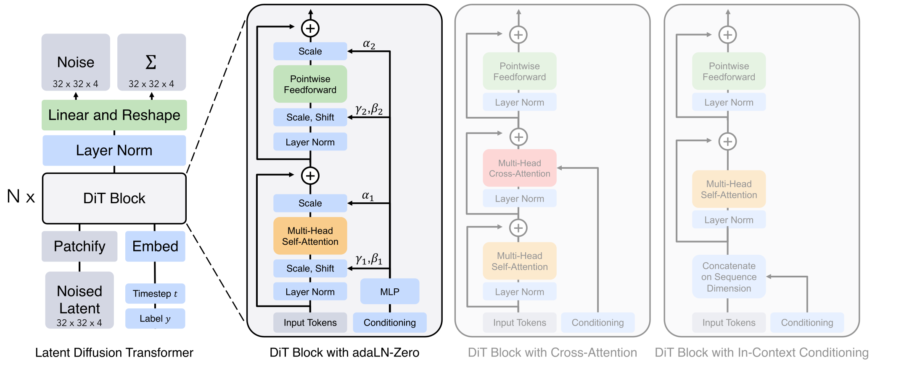

# Diffusion 与 Score：同一条概率路径的两种语言

Diffusion 的直觉常被压缩成“加噪，再去噪”。这句话没有错，却漏掉了最重要的统一关系：

> 去噪器、噪声预测器与 score estimator 都在估计同一时刻数据分布的局部几何；不同 parameterization 只是用不同坐标表达它。

这条路线并非突然出现。[Score Matching](https://www.jmlr.org/papers/v6/hyvarinen05a.html) 先研究不需要归一化常数的密度梯度，[Denoising Score Matching](https://doi.org/10.1162/NECO_a_00142) 把它化为加噪样本上的回归；扩散概率模型则构造一串逐渐变成简单先验的分布，并学习反向过程。把这些放在同一组符号中，DDPM、DDIM、score SDE 与许多 sampler 的差异会清楚得多。

<div markdown="block">
<figure class="paper-figure paper-figure--wide" id="dit-figure-03" data-paper-source="dit" data-paper-asset="dit-figure-03" markdown="1">
[{ width="2150" height="883" loading="lazy" decoding="async" }](../../assets/papers/dit/figure-03-architecture-conditioning.png)
<figcaption><strong>Figure 3 展示 score 或噪声预测目标落到网络时仍需三个工程接口：带噪状态怎样 token 化，时间变量怎样注入，外部条件怎样调制 denoiser。</strong>扩散方程规定训练目标与采样路径，却不唯一决定 backbone；DiT 只是把 U-Net 的空间计算改写为 latent patch sequence 与条件化 Transformer。<span class="paper-figure__source">图源：<a href="https://arxiv.org/pdf/2212.09748v2#page=3">Scalable Diffusion Models with Transformers, Figure 3, p. 3</a>；Copyright © 2023 William Peebles and Saining Xie，<a href="https://creativecommons.org/licenses/by/4.0/">CC BY 4.0</a>。</span></figcaption>
</figure>
</div>

## Score 是密度的局部指北针

分布 $p(x)$ 的 score 定义为

$$
s(x)=\nabla_x\log p(x).
$$

它指向 log-density 增长最快的方向，但不需要知道 $p(x)$ 的归一化常数。原始 score matching 通过分部积分把未知数据 score 从目标中消去；denoising score matching 则先用已知核扰动数据：

$$
\tilde x\sim q_\sigma(\tilde x\mid x),
$$

再回归条件核的 score：

$$
\mathcal L_{\mathrm{DSM}}
=
\mathbb E_{x,\tilde x}
\left\|
s_\theta(\tilde x,\sigma)
-
\nabla_{\tilde x}\log q_\sigma(\tilde x\mid x)
\right\|_2^2.
$$

对 Gaussian 扰动

$$
\tilde x=x+\sigma\epsilon,
\qquad
\epsilon\sim\mathcal N(0,I),
$$

有

$$
\nabla_{\tilde x}\log q_\sigma(\tilde x\mid x)
=
-\frac{\tilde x-x}{\sigma^2}
=
-\frac{\epsilon}{\sigma}.
$$

这已经包含了现代 diffusion 训练的核心：随机选择噪声尺度，从带噪样本预测一个已知目标。

## 离散扩散：把数据逐步推向 Gaussian

[Diffusion Probabilistic Models](https://arxiv.org/abs/1503.03585) 建立了逐步破坏与反向生成框架，[DDPM](https://arxiv.org/abs/2006.11239) 给出后来最常用的 Gaussian parameterization。前向 Markov 链为

$$
q(x_t\mid x_{t-1})
=
\mathcal N\!\left(
\sqrt{\alpha_t}x_{t-1},
(1-\alpha_t)I
\right),
\qquad
\alpha_t=1-\beta_t.
$$

定义

$$
\bar\alpha_t=\prod_{s=1}^{t}\alpha_s,
$$

便可越过中间步骤，直接采样任意时刻：

$$
q(x_t\mid x_0)
=
\mathcal N\!\left(
\sqrt{\bar\alpha_t}x_0,
(1-\bar\alpha_t)I
\right),
$$

即

$$
x_t
=
\sqrt{\bar\alpha_t}x_0
+
\sqrt{1-\bar\alpha_t}\epsilon.
$$

这条闭式边缘分布是训练可并行的原因。每个样本只需随机选 $t$，不必真的执行 $t$ 次加噪。

当 $\bar\alpha_T$ 足够接近 $0$，$x_T$ 近似标准 Gaussian。反向条件 $q(x_{t-1}\mid x_t,x_0)$ 也是 Gaussian；模型不知道 $x_0$，所以用神经网络预测其均值、噪声或等价变量。

## 为什么简单的噪声 MSE 能工作

反向模型写成

$$
p_\theta(x_{t-1}\mid x_t)
=
\mathcal N\!\left(
\mu_\theta(x_t,t),
\Sigma_\theta(x_t,t)
\right).
$$

对变分下界展开后，各时刻主要对应 Gaussian KL。[DDPM](https://arxiv.org/abs/2006.11239) 采用固定方差并重新加权，可得到常见的简化目标：

$$
\mathcal L_{\mathrm{simple}}
=
\mathbb E_{x_0,t,\epsilon}
\left[
\|\epsilon-\epsilon_\theta(x_t,t,c)\|_2^2
\right].
$$

它不是随意的 denoising regression。对 variance-preserving 路径，噪声预测与 marginal score 满足

$$
s_\theta(x_t,t)
\approx
-\frac{\epsilon_\theta(x_t,t)}
{\sqrt{1-\bar\alpha_t}}.
$$

因此网络在每个噪声层级都给出“朝更高数据密度移动”的局部方向。不同 timestep 的 signal-to-noise ratio 差别很大，uniform sampling 并不意味着各尺度对梯度贡献相等；loss weighting、schedule 与 parameterization 必须作为整体设计。

## $\epsilon$、$x_0$ 与 $v$ 只是坐标不同

记

$$
a_t=\sqrt{\bar\alpha_t},
\qquad
\sigma_t=\sqrt{1-\bar\alpha_t},
\qquad
x_t=a_tx_0+\sigma_t\epsilon.
$$

### 预测噪声

$$
\hat x_0
=
\frac{x_t-\sigma_t\hat\epsilon}{a_t}.
$$

在高噪声端 $a_t$ 很小，从 $\epsilon$ 恢复 $x_0$ 会放大误差。

### 预测干净样本

$$
\hat\epsilon
=
\frac{x_t-a_t\hat x_0}{\sigma_t}.
$$

在低噪声端 $\sigma_t$ 很小，反向转换同样病态。

### 预测 velocity

常见定义为

$$
v=a_t\epsilon-\sigma_tx_0.
$$

由于

$$
\begin{bmatrix}
x_t\\
v
\end{bmatrix}
=
\begin{bmatrix}
a_t&\sigma_t\\
-\sigma_t&a_t
\end{bmatrix}
\begin{bmatrix}
x_0\\
\epsilon
\end{bmatrix},
$$

逆变换为

$$
x_0=a_tx_t-\sigma_tv,
\qquad
\epsilon=\sigma_tx_t+a_tv.
$$

这里使用了 $a_t^2+\sigma_t^2=1$。Sampler 若把 $v$ 当成 $\epsilon$，shape 完全一致却会生成错误结果；checkpoint 必须显式记录 `prediction_type`。

## 从离散链到连续 SDE

[Score-Based Generative Modeling through SDEs](https://arxiv.org/abs/2011.13456) 把噪声层级写成连续时间过程：

$$
dx=f(x,t)\,dt+g(t)\,dW_t.
$$

若知道边缘分布 $p_t(x)$ 的 score，反向时间 SDE 为

$$
dx
=
\left[
f(x,t)-g(t)^2\nabla_x\log p_t(x)
\right]dt
+
g(t)\,d\bar W_t,
$$

其中积分方向从 $T$ 到 $0$。同一边缘分布还对应 deterministic probability-flow ODE：

$$
\frac{dx}{dt}
=
f(x,t)
-
\frac{1}{2}g(t)^2\nabla_x\log p_t(x).
$$

这解释了“随机 diffusion sampler”和“确定性 ODE sampler”为何能共享一个 score network：它们选择不同轨迹，却可以拥有相同的时间边缘分布。实现时最危险的是时间方向。公式常以 $dt<0$ 表示反向，代码也可用从大到小的时间网格和正差值；两种写法不能混用。

## DDIM：训练边缘不变，采样耦合可以改变

[DDIM](https://arxiv.org/abs/2010.02502) 构造与 DDPM 共享 $q(x_t\mid x_0)$ 的非 Markov 过程。给定 $\hat x_0$ 与 $\hat\epsilon$，一步可写为

$$
x_{t-1}
=
\sqrt{\bar\alpha_{t-1}}\hat x_0
+
\sqrt{1-\bar\alpha_{t-1}-\sigma_t^2}\hat\epsilon
+
\sigma_t z.
$$

$\sigma_t=0$ 时轨迹确定，可跳过大量训练 timestep。少步采样的误差并非只由“步数少”决定，还取决于时间网格、prediction type、模型在高曲率区间的误差和 guidance。

[DPM-Solver](https://arxiv.org/abs/2206.00927) 进一步利用 diffusion ODE 的半线性结构构造高阶 solver；[EDM](https://arxiv.org/abs/2206.00364) 系统化讨论数据预处理、噪声 parameterization、训练权重与 sampler。两者都提醒我们：模型与采样器不是可随意拼装的独立插件。

## Classifier guidance 与 classifier-free guidance

[ADM](https://arxiv.org/abs/2105.05233) 使用外部 classifier 梯度修改 conditional score：

$$
\nabla_x\log p(x\mid c)
=
\nabla_x\log p(x)
+
\nabla_x\log p(c\mid x).
$$

[Classifier-Free Guidance](https://arxiv.org/abs/2207.12598) 在同一个网络中训练条件与空条件分支：

$$
\hat\epsilon_{\mathrm{cfg}}
=
\epsilon_\varnothing
+
w(\epsilon_c-\epsilon_\varnothing).
$$

$w=0$ 是无条件预测，$w=1$ 是普通条件预测，$w>1$ 外推条件方向。更高的 $w$ 往往增强 prompt adherence，却也会降低多样性、放大饱和与解剖伪影。训练侧的 condition dropout、空 prompt 表示、负面条件与推理侧 batch 拼接顺序必须一致。

## 可执行的 parameterization 契约

下面只实现 forward marginal、三种 prediction 的互换和 CFG。`alpha_bar` 必须是按 batch 取出的累计乘积，而不是单步 $\alpha_t$；它会被扩展到 `[batch, 1, ...]`。

```python
import torch
def _batch_coeff(value, sample):
    if value.ndim != 1 or value.size(0) != sample.size(0):
        raise ValueError("coefficient must be [batch]")
    return value.reshape(value.size(0), *([1] * (sample.ndim - 1)))
def q_sample(x0, noise, alpha_bar):
    if x0.shape != noise.shape:
        raise ValueError("x0 and noise must align")
    ab = _batch_coeff(alpha_bar, x0)
    return ab.sqrt() * x0 + (1 - ab).sqrt() * noise
def targets_from_velocity(xt, velocity, alpha_bar):
    if xt.shape != velocity.shape:
        raise ValueError("xt and velocity must align")
    ab = _batch_coeff(alpha_bar, xt)
    a, sigma = ab.sqrt(), (1 - ab).sqrt()
    x0 = a * xt - sigma * velocity
    noise = sigma * xt + a * velocity
    return x0, noise
def classifier_free_guidance(unconditional, conditional, scale):
    if unconditional.shape != conditional.shape:
        raise ValueError("CFG branches must align")
    return unconditional + scale * (conditional - unconditional)
x0 = torch.tensor([[[[1., -1.]]], [[[.5, 2.]]]])
noise = torch.tensor([[[[3., 1.]]], [[[-1., .5]]]])
alpha_bar = torch.tensor([.8, .2])
xt = q_sample(x0, noise, alpha_bar)
a = _batch_coeff(alpha_bar, x0).sqrt()
sigma = _batch_coeff(1 - alpha_bar, x0).sqrt()
velocity = a * noise - sigma * x0
x0_hat, noise_hat = targets_from_velocity(xt, velocity, alpha_bar)
torch.testing.assert_close(x0_hat, x0)
torch.testing.assert_close(noise_hat, noise)
u, c = torch.zeros_like(x0), torch.ones_like(x0)
torch.testing.assert_close(classifier_free_guidance(u, c, 0), u)
torch.testing.assert_close(classifier_free_guidance(u, c, 1), c)
```

这不是完整 sampler。完整实现还要定义从网络输出到 $\hat x_0$ 的转换、variance、时间网格、随机噪声、clipping/dynamic thresholding 与最后一步。测试转换时应随机生成 $x_0,\epsilon,t$，验证所有 parameterization 的 round trip，而不是只看最终样图。

## 实现契约

| 部分 | 必须固定 |
| --- | --- |
| 数据 | 值域、mean/std、latent scale、channel layout |
| Forward path | $\beta_t$ 或连续 $\alpha(t),\sigma(t)$、端点、timestep 索引 |
| 训练 | prediction type、loss weighting、timestep sampling、condition dropout |
| 网络 | time embedding 单位、条件接口、self-conditioning、precision |
| Sampler | DDPM/DDIM/ODE/SDE、网格、阶数、$\eta$、随机 seed |
| Guidance | 条件/无条件定义、scale、rescale、negative condition |
| 输出 | $\hat x_0$ clipping、decoder 版本、色彩与安全后处理 |

训练使用整数 $t\in[0,T-1]$，推理库却可能使用降序 sigma 或归一化连续时间。边界转换应集中在 scheduler，不要让模型内部猜测时间单位。

## 失效模式

### Schedule 与 parameterization 错配

最隐蔽的 bug 是 checkpoint 预测 $v$，scheduler 按 $\epsilon$ 解读，或训练用 cosine schedule、推理读入另一组 $\bar\alpha_t$。固定 seed 仍会稳定地产生坏图，因此 reproducibility 不能替代语义检查。

### 端点数值病态

在 $a_t\approx0$ 时由 $\epsilon$ 除回 $x_0$，或在 $\sigma_t\approx0$ 时由 $x_0$ 除回 $\epsilon$，会放大半精度误差。优先使用无需除以接近零系数的转换，并明确 endpoint 特判。

### Guidance 过强

CFG 不是免费的条件控制。它把预测推到训练分布外，常造成过饱和、重复纹理、主体截断和多样性下降。应画 quality–adherence–diversity 随 scale 的曲线。

### 少步 solver 的局部误差

高阶 solver 在足够平滑的向量场上有效；强 guidance、离散条件切换或模型误差会降低阶数优势。比较 sampler 时必须固定 function evaluation 次数（NFE），而不只是名义 step。

### “去噪成功”但语义失败

低像素/感知误差不保证文字、数量、空间关系与 prompt binding 正确。Diffusion loss 是训练 surrogate，不是完整语义指标。

## 验证与评测矩阵

| 层级 | 最小测试 |
| --- | --- |
| Forward marginal | $\bar\alpha=1$ 返回 $x_0$，$\bar\alpha=0$ 返回 noise |
| Parameterization | $\epsilon/x_0/v$ 随机 round trip |
| Score | Gaussian toy distribution 的解析 score |
| Reverse step | posterior mean/variance 与小维度解析值 |
| CFG | $w=0,1$、batch/condition 对齐、单/双 batch 等价 |
| Solver | 常向量场、线性 ODE、误差随步长收敛 |
| Distribution | FID/KID、precision/recall、多 seed |
| Semantics | 文字、计数、空间、属性绑定、组合 prompt |
| System | NFE、端到端延迟、吞吐、峰值显存、decoder 成本 |

Diffusion 怎样进入压缩 latent 与 Transformer，见 [Latent Diffusion、DiT 与 Flow](latent-dit-flow.md)；表示层的重建上限见 [Autoencoder 与视觉 Tokenizer](autoencoders-tokenizers.md)；控制条件如何注入与怎样公平评测见[可控生成、编辑与评测](control-editing-evaluation.md)。

加噪、prediction type 与 sampler 端点测试见[多模态手撕实现](../../practice/multimodal.md)。

## Reference {#reference}

- [Hyvärinen, Estimation of Non-Normalized Statistical Models by Score Matching](https://www.jmlr.org/papers/v6/hyvarinen05a.html)
- [Vincent, A Connection Between Score Matching and Denoising Autoencoders](https://doi.org/10.1162/NECO_a_00142)
- [Sohl-Dickstein et al., Deep Unsupervised Learning using Nonequilibrium Thermodynamics](https://arxiv.org/abs/1503.03585)
- [Song and Ermon, Generative Modeling by Estimating Gradients of the Data Distribution](https://arxiv.org/abs/1907.05600)
- [Ho et al., Denoising Diffusion Probabilistic Models](https://arxiv.org/abs/2006.11239)
- [Song et al., Denoising Diffusion Implicit Models](https://arxiv.org/abs/2010.02502)
- [Song et al., Score-Based Generative Modeling through Stochastic Differential Equations](https://arxiv.org/abs/2011.13456)
- [Nichol and Dhariwal, Improved Denoising Diffusion Probabilistic Models](https://arxiv.org/abs/2102.09672)
- [Dhariwal and Nichol, Diffusion Models Beat GANs on Image Synthesis](https://arxiv.org/abs/2105.05233)
- [Karras et al., Elucidating the Design Space of Diffusion-Based Generative Models](https://arxiv.org/abs/2206.00364)
- [Lu et al., DPM-Solver: A Fast ODE Solver for Diffusion Probabilistic Model Sampling in Around 10 Steps](https://arxiv.org/abs/2206.00927)
- [Ho and Salimans, Classifier-Free Diffusion Guidance](https://arxiv.org/abs/2207.12598)
