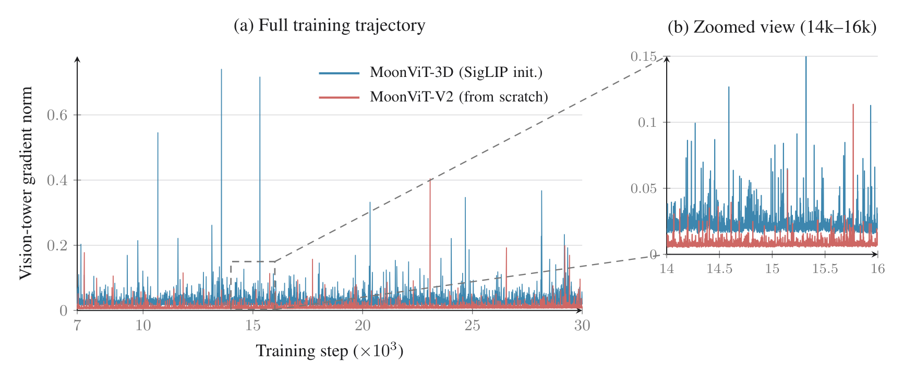

# Kimi 家族的多模态分支

Kimi 家族的多模态路线并不是“语言模型后来接上一个视觉 encoder”。[Kimi-VL](kimi-vl.md) 先独立探索视觉语言 MoE，[Kimi K2.5](../landscape/works/kimi-k2-5.md) 再把视觉 token、thinking、工具使用与 Agent Swarm 放进同一训练系统，[Kimi K3](../landscape/works/kimi-k3.md) 则让 MoonViT-V2 从 next-token prediction 开始与 3T 级 hybrid backbone 联合训练。音频仍由 Kimi-Audio 形成另一条分支。

本页只讨论家族与模态之间的关系。完整分支与公开产物见 [Kimi 家族总览](../landscape/families/kimi.md)，关键继承与发布日期见 [Kimi 技术谱系](../landscape/kimi-timeline.md)；K3 的 150 项引用及其归因边界见[引用图谱](../landscape/kimi-k3-reference-map.md)；K3 架构、训练、系统和评测的逐层解释见[工作深读](../landscape/works/kimi-k3.md)。

## 家族分叉而不是版本替换

```text
Kimi k1.5 ── 长上下文 reasoning RL
                  │
Kimi-VL ── 视觉语言 MoE ─┐
                         ├─ K2.5 ── native visual agent / thinking / swarm
K2 ── 1T MoE / agentic ─┘                         │
Kimi Linear ── KDA / hybrid attention ────────────┼─ K3
Attention Residuals ── depth retrieval ───────────┘

Kimi-Audio ── audio understanding / generation / conversation
```

Kimi-VL、K2.5 和 K3 有继承关系，却不是同一个 checkpoint 的连续小修订：

| 节点 | 多模态对象 | 训练或结构焦点 | 不应混淆的边界 |
| --- | --- | --- | --- |
| [Kimi-VL](kimi-vl.md) | 图像、视频、长文档与语言 | 轻量激活的视觉语言 MoE、视觉 reasoning 与长上下文 | 它的 vision encoder 不是 K3 MoonViT-V2 的同义词 |
| [Kimi K2.5](../landscape/works/kimi-k2-5.md) | text + vision 的原生联合模型 | continual pretraining、zero-vision SFT、joint text-vision RL、Agent Swarm | swarm 是 agent system，不是视觉 encoder 架构 |
| [Kimi K3](https://github.com/MoonshotAI/Kimi-K3/blob/main/k3_tech_report.pdf) | 报告与服务接口覆盖 text、image、video；开放模型卡与本地示例可确认 text、image | MoonViT-V2、1M context、KDA / MLA / AttnRes / MoE 联合训练 | 服务端视频处理不能外推为开放 checkpoint 已公开原始视频的本地 processor 路径；完整视觉数据配方也未公开 |
| [Kimi-Audio](https://github.com/MoonshotAI/Kimi-Audio) | speech、通用音频、音频生成与对话 | audio tokenizer / encoder、理解与生成闭环 | 它是并行分支，不是 K3 已披露的输入模态 |

K2 本身在这里主要扮演 shared language / MoE foundation：它提供大规模稀疏 backbone、MuonClip 与 agentic post-training 经验。Kimi Linear 和 Attention Residuals 则分别把 sequence 与 depth 信息流接入 K3。它们对多模态的重要性不是“专门看图”，而是决定视觉 token 进入 backbone 后怎样跨长序列、跨层和跨 expert 流动。

## Kimi-VL：先解决视觉语言桥与长视觉上下文

[Kimi-VL 深读](kimi-vl.md)从原生分辨率、MoonViT、projector、MoE language decoder、四阶段训练与 128K 激活逐层展开。这里先保留它对家族关系最重要的一点：图像和视频表示被映射到语言 token 所在的 embedding space，并让四类负载进入同一模型：

- 高分辨率图像带来大量局部 patch；
- 多图与长文档要求跨页、跨图建立关系；
- 视频同时增加空间和时间 token；
- visual agent 还会把 crop、zoom、OCR 或 Python 结果重新写回上下文。

因此“能输入图片”与“能在长程 agent 中持续利用视觉观察”是两种证据。前者可由静态 VQA 支持，后者需要保留工具轨迹、环境状态、观察顺序和总视觉 token 预算。

Kimi-VL 公开了 A3B-Instruct 与后续 Thinking checkpoint，并采用 MIT 许可证；它没有因此公开 K3 的 MoonViT-V2 训练数据或实现。

## K2.5：视觉与 reasoning 不再分阶段拼接

K2.5 在 K2-Base 上进行约 15T mixed visual-text token 的 continual pretraining。它强调三件相互制约的事：

1. 视觉数据进入主干继续预训练，而不是只在末端做小规模 adapter tuning；
2. text-only instruction 能力要在视觉 SFT 后保持，因而需要 zero-vision SFT 等平衡阶段；
3. joint text-vision RL 让视觉观察、thinking 与工具 action 进入同一 trajectory。

抽象地看，一个混合 batch 的贡献不只由样本概率决定：

$$
\mathbb E[\mathcal L]
=
\sum_m p(m)\,
\mathbb E_{x\sim D_m}
\left[
\frac{\sum_t w_{m,t}\ell_{m,t}}{\sum_t w_{m,t}}
\right].
$$

$m$ 可以是 text、image、video、reasoning 或 agent trajectory；长视频即使样本数少，也可能因 token 数和 loss mask 获得很大梯度权重。公开的“数据比例”如果没有 sequence length、packing 和 reduction 口径，仍不足以重建真实 mixture。

### Agent Swarm 位于系统层

K2.5 的 Agent Swarm 让一个 orchestrator 动态拆分任务并并行执行多个 subagent。其收益可写成

$$
T_{\text{wall}}
\approx
\max_i T_i
+T_{\text{dispatch}}
+T_{\text{merge}}
+T_{\text{verify}},
$$

而总成本更接近所有分支 token 与工具调用之和。只有子任务依赖弱、写冲突可控、结果容易验证时，并行 wall time 才可能下降。多模态让拆分更丰富，也增加共享图像、视频与 artifact state 的一致性问题。

因此评测 Agent Swarm 应同时记录并行度、总 token、tool calls、共享状态、失败重试、单 agent 等预算基线和尾延迟。它不是 K2.5 vision encoder 的组件，也不是 K3 white-box RL environment 的别名。

## K3：MoonViT-V2 进入三条信息流

K3 报告称 MoonViT-V2 约 401M 参数，从 next-token prediction 目标开始训练，再由轻量 projector 把视觉表示送入 shared embedding space。进入 backbone 后，视觉 token 与文本 token 共同经过：

- **sequence mixing**：大部分 KDA 层压缩历史状态，周期性 Gated MLA 恢复全局 token-to-token retrieval；
- **depth mixing**：Block AttnRes 选择 embedding 与早期 block output；
- **channel mixing**：Stable LatentMoE 在 latent space 中路由到 896 个 routed experts 中的 16 个，并保留 shared experts。

这比“视觉 encoder + LLM”多出一层关键问题：不同模态如何共同穿过有限状态、全局 attention、depth route 和 sparse experts。比如图像中的一个细节如果只短暂出现，KDA state 是否能保存它、何时由 MLA 重新读取、哪些 expert 接收该 token，都会影响后续长程行为。

### 从头 NTP 训练能支持什么结论

报告的消融显示，作者配方内从随机初始化开始的 vision encoder 优于先做视觉预训练再接语言模型的方案。最窄结论是：在其数据、backbone、优化器和预算下，end-to-end next-token objective 能形成更匹配语言主干的视觉表示。

<figure class="paper-figure paper-figure--wide" id="k3-figure-06" data-paper-source="kimi-k3" data-paper-asset="k3-figure-06" markdown="1">
[{ width="1733" height="733" loading="lazy" decoding="async" }](../assets/papers/kimi-k3/figure-06-vision-gradients.png)
<figcaption><strong>这里的证据是联合训练稳定性，而不是一条普适初始化定律。</strong>蓝线在完整轨迹上出现更多高梯度尖峰，局部放大后两条分布的基线差异也仍然可见；它支持作者配方中的从头 NTP 选择，却没有隔离数据、优化器或 backbone 的独立贡献。<span class="paper-figure__source">图源：<a href="https://raw.githubusercontent.com/MoonshotAI/Kimi-K3/521359a5cae5e79d02e5a2102c2cea9ce3b9b79a/k3_tech_report.pdf#page=9">Kimi K3 Technical Report, Figure 6, p. 9</a>；© 2026 Moonshot AI，<a href="https://github.com/MoonshotAI/Kimi-K3/blob/521359a5cae5e79d02e5a2102c2cea9ce3b9b79a/LICENSE">Kimi K3 License</a>。</span></figcaption>
</figure>

它不能推出：

- 独立视觉预训练普遍无用；
- 所有数据规模都适合从头训练 encoder；
- MoonViT-V2 的收益可与 backbone、数据或 post-training 完全分离；
- 公开 checkpoint 已给出可复现的视觉数据 provenance。

更一般的视觉语言桥与 early fusion 路线见[视觉语言模型](vision-language.md)和[统一理解与生成](unified-understanding-generation.md)。

## 视觉能力如何进入 Agent 闭环

K3 的视觉 RL 环境让模型在 isolated Python sandbox 中反复执行 crop、zoom、transform、计算和验证，再把生成图像或数值作为新 observation。一个视觉问题由此变成：

$$
o_0 \rightarrow a_0 \rightarrow o_1
\rightarrow a_1 \rightarrow \cdots
\rightarrow o_T \rightarrow \hat y,
$$

其中 observation 不只是一张初始图片，还包括工具产生的新视图。最终分数同时测量 perception、planning、代码、工具协议和 verifier。报告中 CharXiv、MATH-Vision、ZeroBench 等“无工具 / 有 Python”双分数正是在区分这两层能力。

这条路线与[文档与 GUI grounding](document-gui-grounding.md)、[工具调用](../applications/tool-use.md)和 [Agentic RL 轨迹契约](../agentic-rl/trajectory-contract.md)相连。比较模型时必须固定图像预处理、最大 patch / frame 数、工具、最大步数、reasoning effort 和采样次数。

## Kimi-Audio：另一条仍需单独追踪的模态路线

Kimi-Audio 同时覆盖 audio understanding、speech recognition、audio generation 与 conversation。与 K3 的关系是家族共享研究积累，而不是报告已证明的模态合并：

- K3 官方模型卡列出的主体模态是 text 与 image，报告还讨论 video 输入；
- Kimi-Audio 有自己的模型、代码、checkpoint 与评测工具；
- 除非后续一手材料明确说明，不能把 Kimi-Audio 能力写进 K3 checkpoint。

音频 codec、离散 token、流式生成和 duplex conversation 的通用机制见[音频语言模型](audio-language-models.md)。

## 一张可审计的多模态核对表

| 层面 | 最少需要记录的事实 |
| --- | --- |
| 公开物 | paper、checkpoint、inference code、training code、API 与 license 分列 |
| 视觉输入 | resize / crop、patch size、dynamic resolution、多图与视频帧预算 |
| 融合 | encoder、projector、token order、position、cross-attention 或 early fusion |
| 数据 | image / video / document 来源、比例、token 权重、去重与污染边界 |
| 训练 | 预训练、SFT、RL 各阶段是否包含视觉，loss mask 与 reduction 口径 |
| 工具 | Python / browser / GUI 工具、observation 回写、最大步骤与 sandbox |
| 评测 | 无工具与有工具分开，保留 sampling、pass@$k$、harness 和日期 |
| 安全 | 图像内指令、OCR 注入、跨模态权限、敏感视觉数据与持久化历史 |

沿家族阅读时，先用[时间线](../landscape/kimi-timeline.md)确认公开对象，再用 [K3 引用图谱](../landscape/kimi-k3-reference-map.md)追到方法与 benchmark 原作，最后回到 [K3 工作深读](../landscape/works/kimi-k3.md)检查公式、系统接口和证据边界。

## Reference {#reference}

- [Kimi-VL Technical Report](https://arxiv.org/abs/2504.07491)
- [Kimi K2: Open Agentic Intelligence](https://arxiv.org/abs/2507.20534)
- [Kimi K2.5: Visual Agentic Intelligence](https://arxiv.org/abs/2602.02276)
- [Kimi K3 official technical report](https://github.com/MoonshotAI/Kimi-K3/blob/main/k3_tech_report.pdf)
- [Kimi K3 model card and weights](https://huggingface.co/moonshotai/Kimi-K3)
- [Kimi-Audio Technical Report](https://arxiv.org/abs/2504.18425)
