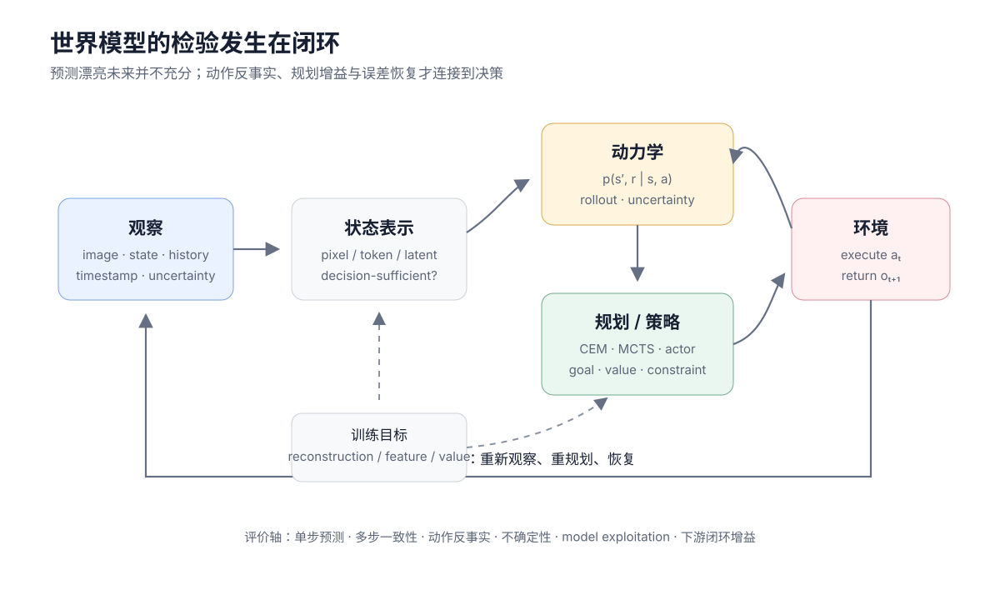

# 视频理解：时间证据与长程记忆

视频不是图片数量增加后的自然延伸。它多出一个不可交换的维度：时间。帧的顺序、持续时长、镜头切换和未被采样的间隔都会改变结论。

同一段视频至少包含四类问题：

1. **外观**：谁和什么出现在画面里；
2. **运动**：对象怎样移动或变化；
3. **事件**：什么在何时发生，先后关系是什么；
4. **叙事**：跨镜头的人物、目标与因果怎样持续。

只在均匀采样帧上做图像问答，通常只能覆盖第一类和部分第三类。

<figure class="concept-figure" id="video-to-world-model-boundary" markdown="1">



<figcaption>视频理解主要位于左侧“观察—状态”接口；只有当预测显式接收动作、进入规划并由真实反馈检验时，才开始构成决策意义上的世界模型。</figcaption>

</figure>

## 从运动特征到时空网络

早期视频识别常把 RGB 外观与 optical flow 运动分开。双流网络显式提供短期运动线索，3D CNN 则用时空卷积联合处理局部帧块：

$$
y_{t,i,j,c'}
=
\sum_{\Delta t,\Delta i,\Delta j,c}
K_{\Delta t,\Delta i,\Delta j,c,c'}
x_{t+\Delta t,i+\Delta i,j+\Delta j,c}.
$$

[I3D](https://arxiv.org/abs/1705.07750)把图像卷积核扩展到时间维；[SlowFast](https://arxiv.org/abs/1812.03982)用低帧率通道建模语义、用高帧率轻量通道捕捉快速运动。这里形成了一个持续至今的设计原则：外观和运动需要不同时间带宽。

Transformer 之后，视频可以被写成时空 token。[TimeSformer](https://arxiv.org/abs/2102.05095)比较了空间与时间 attention 的分解方式；[ViViT](https://arxiv.org/abs/2103.15691)系统化研究 tubelet 与 factorized encoder。全时空注意力表达直接，但 token 数为

$$
N
=
T_pH_pW_p,
$$

其二次复杂度很快成为瓶颈。

## 自监督视频表示在预测什么

视频标注昂贵，自监督学习主要利用时间连续性与遮蔽预测。

[VideoMAE](https://arxiv.org/abs/2203.12602)以很高的 tubelet 遮蔽率重建像素，迫使模型从可见时空上下文恢复缺失内容。高遮蔽率有效的一部分原因是相邻帧高度冗余；如果遮蔽策略让模型总能从相邻像素复制，预训练也可能只学到局部捷径。

[V-JEPA](https://arxiv.org/abs/2404.08471)不重建像素，而是在表示空间预测被遮蔽目标。它更关注可预测的语义与运动状态，避免花容量恢复难以预测的纹理。两类目标不能只凭预训练 loss 比较：

- 像素重建更容易检查重建内容，却可能过度关注低层细节；
- 表示预测更抽象，但目标 encoder、collapse 避免与下游可解释性成为新契约。

[V-JEPA 2](https://ai.meta.com/research/publications/v-jepa-2-self-supervised-video-models-enable-understanding-prediction-and-planning/)进一步把大规模视频表示学习与动作条件预测、机器人规划连接起来。这种连接是否构成“世界模型”，取决于动作介入、闭环规划和真实转移，而不是仅凭视频 backbone 名称。

## 采样决定模型能否看到事件

设原视频帧率为 $f$，均匀步长为 $s$，模型观察帧率为 $f/s$。若一个事件只持续 $\delta$ 秒，观察到它的概率与事件相位、采样网格和 $\delta f/s$ 有关。单次均匀采样可能完全错过短暂事件。

常用采样策略各有偏差：

| 策略 | 优点 | 主要盲区 |
| --- | --- | --- |
| 均匀稀疏采样 | 覆盖全局、成本稳定 | 短事件与快速运动 |
| 连续 clip | 保留局部运动 | 长程叙事 |
| 多尺度采样 | 同时看局部与全局 | 计算与去重复杂 |
| 事件/镜头驱动 | 把预算给变化位置 | detector 的漏检会前置 |
| 查询驱动检索 | 长视频效率高 | 检索器不理解问题时漏证据 |

评测视频模型时必须记录原始 fps、解码 fps、clip 长度、stride、镜头策略和最终视觉 token。只写“输入 64 帧”无法判断覆盖了 2 秒还是 20 分钟。

下面的实现从真实时间范围生成均匀采样索引，并保证最后一个采样点不越界。它显式接收原始 fps，避免把 frame id 当作秒。

```python
import torch
def sample_video_indices(frame_count, fps, samples):
    if frame_count <= 0 or fps <= 0 or samples <= 0:
        raise ValueError("invalid video metadata")
    duration = (frame_count - 1) / fps
    seconds = torch.linspace(0, duration, min(samples, frame_count))
    index = (seconds * fps).round().long().clamp_max(frame_count - 1)
    return torch.unique_consecutive(index), seconds
index, seconds = sample_video_indices(300, 30, 8)
assert index[0] == 0 and index[-1] == 299
assert torch.all(index[1:] > index[:-1])
```

生产系统还要处理 variable frame rate、损坏帧、音轨 offset 和镜头时间基。容器时间戳比“假定恒定 fps”更可靠。

## 时间位置不只是帧编号

若不同视频以不同 fps 编码，帧编号差相同并不代表真实时间差相同。时间位置应尽量由 timestamp 生成：

$$
p_t=\phi(\text{timestamp}_t),
$$

再与二维空间位置组合。多 clip 拼接时还要区分：

- clip 内相对时间；
- 原视频绝对时间；
- 对话中媒体出现顺序；
- 音频与视频共同的时钟。

位置编码只能告诉模型“何时”，不能替代缺失帧。把 1 fps 视频插值成 30 fps 不会恢复真实的快速动作。

## 事件定位与边界

视频问答常只要求最终文本，时间 grounding 则要求区间

$$
\hat s,\hat e
\in[0,T].
$$

常用 temporal IoU：

$$
\operatorname{tIoU}
=
\frac{\max(0,\min(e,\hat e)-\max(s,\hat s))}
{\max(e,\hat e)-\min(s,\hat s)}.
$$

边界具有标注歧义：一个动作从“伸手”开始，还是从“接触物体”开始？因此评测应报告不同 tIoU threshold、boundary error 与人工一致性，而不是只给单一命中率。

对自然语言问题，较可靠的中间协议是先返回候选时间段与证据帧，再基于这些片段回答。这样可以分别诊断检索失败和推理失败。

## 长视频需要层级记忆

把几小时视频全部展开成细粒度 token 通常不可行。更实用的架构是层级处理：

$$
\text{coarse scan}
\rightarrow
\text{candidate segments}
\rightarrow
\text{fine encoding}
\rightarrow
\text{evidence memory}
\rightarrow
\text{answer}.
$$

### 粗扫

用低 fps、镜头摘要、音频转写或轻量 embedding 建立全局索引。它追求召回率，不承担最终细节判断。

### 精读

根据问题检索相关片段，提高帧率和分辨率，必要时加入邻近上下文。精读窗口过窄会丢失事件前因，过宽又浪费预算。

### 证据记忆

保存人物、对象、事件、时间和来源片段。摘要应带 provenance；如果只保留自然语言摘要，早期识别错误会在后续被当作事实。

### 迭代检索

初次证据不足时，根据中间结论生成新查询。查询漂移可能让模型只寻找支持当前假设的片段，因此应保留反证检索与停止条件。

这种“检索式观看”与文本 RAG 相似，却多了时间连续性：命中一帧后，证据常位于其前后，而非另一个独立文档。

## 多模态视频：字幕、语音与环境声

视频理解中的文本至少来自三处：

- 画面内 OCR；
- 人工或自动字幕；
- 语音识别。

它们的可信度和时间粒度不同。字幕可能总结而非逐字转写，ASR 可能错位，OCR 可能只在少数帧可见。融合时应保留来源和 timestamp，避免把三者拼成一段无来源文本。

环境声又提供镜头外事件和同步线索。视觉—音频对齐既可以做 clip 级语义，也可以做毫秒级同步；详见[音频理解](../audio/representations-understanding.md#audio-visual-understanding)。

## 从视频语言模型到世界模型

视频语言模型可以回答“发生了什么”，视频生成模型可以合成“可能发生什么”，世界模型则要求“在动作 $a_t$ 下会发生什么，并能否据此改善决策”：

$$
p(s_{t+1},r_t\mid s_t,a_t).
$$

没有动作条件、奖励/价值或规划验证的视频模型，可以是强大的时序表示或生成器，但不能仅因预测未来帧就被视为可用控制模型。两者的边界见[世界模型总览](../../world-models/index.md)；生成侧的运动与长时一致性见[视频生成](generation.md)。

## 评测矩阵

| 能力 | 评测对象 | 关键切片 |
| --- | --- | --- |
| 外观 | 对象、属性、OCR | 分辨率、小目标、遮挡 |
| 运动 | 动作、方向、速度 | fps、快慢动作、相机运动 |
| 顺序 | before/after、步骤 | 打乱帧、反转视频 |
| 定位 | event span、证据帧 | 短事件、边界歧义 |
| 长程 | 人物与目标持续 | 视频长度、证据位置、中部遗忘 |
| 音画 | 同步、声源、字幕 | offset、静音、冲突模态 |
| 证据依赖 | 反事实与检索 | 替换片段、遮挡、无关字幕 |
| 系统 | decode/encode/prefill | 原始时长、token、延迟、显存 |

最重要的反事实包括：打乱顺序、反转时间、替换关键片段、静音、移动字幕和只保留静态帧。若分数几乎不变，数据集或模型可能没有真正要求时间理解。

tubelet、时间采样与 mask 的组合测试见[多模态手撕实现](../../practice/multimodal.md)。

## Reference {#reference}

- [Carreira and Zisserman, Quo Vadis, Action Recognition? A New Model and the Kinetics Dataset](https://arxiv.org/abs/1705.07750)
- [Feichtenhofer et al., SlowFast Networks for Video Recognition](https://arxiv.org/abs/1812.03982)
- [Bertasius et al., Is Space-Time Attention All You Need for Video Understanding?](https://arxiv.org/abs/2102.05095)
- [Arnab et al., ViViT: A Video Vision Transformer](https://arxiv.org/abs/2103.15691)
- [Tong et al., VideoMAE: Masked Autoencoders are Data-Efficient Learners for Self-Supervised Video Pre-Training](https://arxiv.org/abs/2203.12602)
- [Bardes et al., V-JEPA: Feature Prediction for Video Pre-Training](https://arxiv.org/abs/2404.08471)
- [Assran et al., V-JEPA 2: Self-Supervised Video Models Enable Understanding, Prediction and Planning](https://ai.meta.com/research/publications/v-jepa-2-self-supervised-video-models-enable-understanding-prediction-and-planning/)
