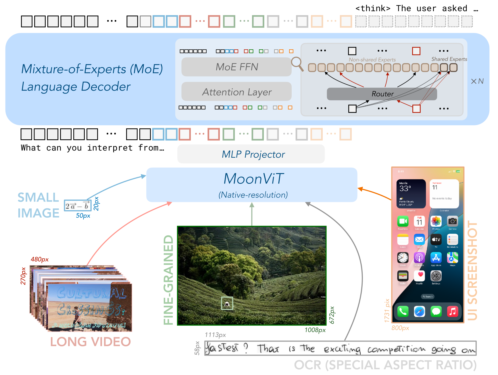

# 视觉语言模型

视觉语言模型需要解决三个独立问题：怎样把像素变成视觉 token，怎样与语言空间对齐，以及怎样在对话、定位与生成中保持空间信息。把 vision encoder 接到 LLM 只是接口起点。

这条路线可从 [CLIP](../landscape/works/clip.md) 的开放词表对齐开始，再比较 [Flamingo、BLIP-2 与 LLaVA](../landscape/works/visual-language-bridges.md) 怎样在冻结主干、视觉压缩和指令数据之间作出不同选择；完整脉络见[多模态理解与生成](../landscape/lineages/multimodal-generation.md)。

## Vision Transformer

给定图像 $I\in\mathbb{R}^{H\times W\times C}$，将其切成 $P\times P$ patch，可得到

$$
N=\frac{HW}{P^2}
$$

个 patch。每个 patch 展平并线性映射为

$$
z_i=W_px_i+e_i,
$$

其中 $e_i$ 是位置表示。[Vision Transformer](https://arxiv.org/abs/2010.11929) 展示了将 patch 序列交给 Transformer 编码的基本路线。

更小的 patch 或更高分辨率都会增加 $N$。若视觉 token 直接进入语言主干，prefill attention 与 KV 成本随 token 数增长，分辨率不能脱离系统预算讨论。

### 最小语义实现 {#vit-patchify}

`patchify` 把 `[B,C,H,W]` 图像变为按 row-major 排列的 `[B,N,C P^2]` token；`unpatchify` 用已知画布恢复原图。往返断言同时约束 patch 内通道顺序和二维网格顺序。

```python
import torch

def patchify(image, patch):
    batch, channels, height, width = image.shape
    assert height % patch == 0 and width % patch == 0
    grid_h, grid_w = height // patch, width // patch
    x = image.view(batch, channels, grid_h, patch, grid_w, patch)
    return x.permute(0, 2, 4, 1, 3, 5).reshape(batch, grid_h * grid_w, -1)

def unpatchify(tokens, channels, height, width, patch):
    batch = tokens.size(0)
    grid_h, grid_w = height // patch, width // patch
    x = tokens.view(batch, grid_h, grid_w, channels, patch, patch)
    return x.permute(0, 3, 1, 4, 2, 5).reshape(batch, channels, height, width)

image = torch.arange(2 * 3 * 8 * 12).view(2, 3, 8, 12)
tokens = patchify(image, 4)
assert tokens.shape == (2, 6, 48)
torch.testing.assert_close(unpatchify(tokens, 3, 8, 12, 4), image)
```

这个核不做 resize、padding、position embedding 或线性投影；dynamic tiling 还必须把原图坐标、tile 顺序与有效区域随 token 一起保存。可运行的分块实验见[多模态原语：ViT patchify](../practice/multimodal.md#vit-patchify)，固定 token 预算则见同页的 [Fixed-query resampler](../practice/multimodal.md#fixed-query-resampler)。

## 对比式视觉—文本对齐

[CLIP](https://arxiv.org/abs/2103.00020) 分别编码一批图像和文本，并使匹配 pair 的相似度高于不匹配 pair。归一化 embedding 为 $u_i,v_j$，温度为 $\tau$：

$$
s_{ij}=\frac{u_i^\top v_j}{\tau}.
$$

对称对比损失为

$$
\mathcal L
=\frac{1}{2}
\left[
\operatorname{CE}(s,\operatorname{diag})
+
\operatorname{CE}(s^\top,\operatorname{diag})
\right].
$$

batch 中其他样本充当 negatives，因此全局 batch、重复 caption 和跨设备 all-gather 会改变目标。图文检索对齐强，不自动提供细粒度 OCR、空间定位或多步视觉推理。

## 接入 LLM

### Projector

视觉 encoder 输出 $Z_v\in\mathbb{R}^{N\times d_v}$，线性层或 MLP 投到语言维度：

$$
H_v=P(Z_v)\in\mathbb{R}^{N\times d}.
$$

[LLaVA](https://arxiv.org/abs/2304.08485) 是 vision encoder、projector 与语言模型进行视觉指令微调的代表路线。接口简单，但所有视觉信息都要通过有限 token 和主干后续层解释。

### Resampler

用 $M$ 个可学习 query cross-attend 到 $N$ 个视觉特征，将可变长度压到固定 $M$。它控制成本，也可能丢失小字、计数和局部关系。

### Cross-attention

在语言层中加入对视觉 memory 的 cross-attention。视觉 token 不必与文本完全拼成同一序列，但主干结构和 checkpoint 接口会改变。

<div markdown="block">
<figure class="paper-figure paper-figure--wide" id="cogvlm-visual-expert" data-paper-source="glm-cogvlm-visual-expert" data-paper-asset="cogvlm-visual-expert" markdown="1">
[{ width="1378" height="824" loading="lazy" decoding="async" }](../assets/papers/glm-cogvlm-visual-expert/cogvlm-visual-expert.png)
<figcaption><strong>Figure 3 展示 projector 之外的另一层设计选择：视觉 token 与文本 token 共享序列和 attention 拓扑，但在 QKV 与 FFN 路径使用视觉专家参数。</strong>这种 visual expert 增加模态容量，同时保留语言路径；它既不同于只训练一个 MLP projector，也不同于把媒体 memory 放在独立 cross-attention 中。<span class="paper-figure__source">图源：<a href="https://raw.githubusercontent.com/zai-org/CogVLM/f7283b2c8d26cd7f932d9a5f7f5f9307f568195d/assets/method.png">CogVLM visual-expert architecture diagram, Figure 3</a>；Copyright 2024 CogVLM team @ Zhipu AI，<a href="https://github.com/zai-org/CogVLM/blob/f7283b2c8d26cd7f932d9a5f7f5f9307f568195d/LICENSE">Apache License 2.0</a>。</span></figcaption>
</figure>
</div>

## Token 合并

若将视觉 embedding 插入文本占位符，必须明确：

```text
text token before image
visual token range
text token after image
attention mask
position ids
labels and loss mask
```

占位符数量与实际视觉 token 不匹配会造成位置错位。padding 图像、不同 tile 数和多图 batch 还需要 per-sample offset，不能只按 batch 最大值盲目替换。

## 分辨率

常见策略包括：

- 固定缩放：shape 规则，可能丢细节或改变纵横比；
- letterbox：保留比例，引入 padding；
- 动态切片：全局缩略图加局部 tile；
- 多尺度特征：融合不同 encoder 层或分辨率；
- OCR/检测旁路：用结构化工具补充高密度信息。

动态切片的总视觉 token 可写为

$$
N_v=N_{\text{global}}+\sum_{j=1}^{m}N_{\text{tile},j}.
$$

tile 顺序与二维位置必须可恢复；否则模型看到的是一串局部图，却不知道它们在原图中的关系。

<div markdown="block">
<figure class="paper-figure paper-figure--wide" id="kimi-vl-figure-03" data-paper-source="kimi-vl" data-paper-asset="kimi-vl-figure-03" markdown="1">
[{ width="1733" height="1308" loading="lazy" decoding="async" }](../assets/papers/kimi-vl/figure-03-architecture.png)
<figcaption><strong>Figure 3 把输入分辨率、视觉 token 化和语言解码放到同一接口中：MoonViT 保留原生宽高比，projector 接入 MoE decoder。</strong>小图、长视频、OCR 和 GUI 截图的 token 数与纵横比差异很大；架构图能说明数据流，却不能替代对 dynamic tiling、position、mask 和批处理 padding 的逐项约定。<span class="paper-figure__source">图源：<a href="https://raw.githubusercontent.com/MoonshotAI/Kimi-VL/41d5ef072bc52a04524f94ab736ff9c29f125fda/Kimi-VL.pdf#page=3">Kimi-VL Technical Report, Figure 3, p. 3</a>；Copyright © 2025 Moonshot AI，<a href="https://github.com/MoonshotAI/Kimi-VL/blob/41d5ef072bc52a04524f94ab736ff9c29f125fda/LICENSE">MIT License</a>。</span></figcaption>
</figure>
</div>

## 训练阶段

1. **接口对齐**：冻结大部分主干，只训练 projector/resampler。
2. **联合预训练**：图文对、交错文档、OCR、grounding 与多图。
3. **视觉指令微调**：问答、图表、文档、GUI 和工具。
4. **偏好与安全**：幻觉、图像内注入、拒答与输出格式。

每阶段应报告冻结组件、分辨率、视觉 token、数据配比、loss mask 和可训练参数。视觉 encoder 是否更新会显著改变成本与遗忘风险。

## 失效诊断

### 语言先验

遮掉图像后答案仍不变，说明任务可能被文本模式猜中。可用反事实图像、属性交换和答案平衡检查。

### 空间信息丢失

改变 crop、tile 顺序或分辨率导致答案剧烈变化。需要检查位置编码、全局图与局部图的融合。

### OCR 幻觉

模型补全了“像是会出现”的文字。应分别评字符识别、阅读顺序、表格结构和基于识别结果的推理。

### 模态注入

图像中的文字属于输入数据，不应自动获得控制系统或工具权限。需要与[可靠性与安全](../evaluation/reliability-safety.md)中的指令层级共同设计。

## 评测

同时记录任务质量、输入分辨率、tile 数、视觉 token、TTFT、显存和语言-only baseline。caption、VQA、OCR、grounding、图表、多图与视觉 agent 是不同能力，不应压成一个总分。

更一般的融合方式见[多模态融合与训练](architecture-training.md)，生成式目标见[多模态生成模型](generative-modeling.md)。

## 继续深入

- [信号、表示与 Token 化](foundations/signals-tokenization.md)固定 patch、动态分辨率与 token budget；
- [对齐、桥接与融合](foundations/alignment-fusion.md)比较 projector、resampler、cross-attention 与 early fusion；
- [视觉表示、感知与 Grounding](vision/representation-grounding.md) 把全局语义推进到区域、坐标和证据；
- [空间智能与三维表示](vision/spatial-3d.md)继续处理深度、多视角、坐标系和场景记忆。

## Reference {#reference}

- [An Image is Worth 16x16 Words](https://arxiv.org/abs/2010.11929)
- [Learning Transferable Visual Models From Natural Language Supervision](https://arxiv.org/abs/2103.00020)
- [Visual Instruction Tuning / LLaVA](https://arxiv.org/abs/2304.08485)
