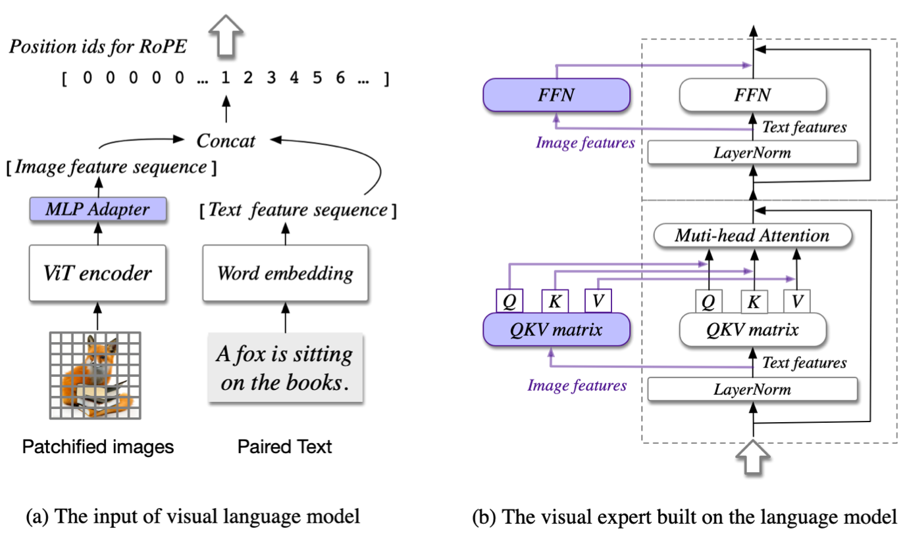

# 图像理解：从识别到空间证据

图像理解并不是把图片整体压成一句描述。真实任务沿空间粒度逐步展开：

$$
\text{global semantics}
\rightarrow
\text{objects}
\rightarrow
\text{regions and relations}
\rightarrow
\text{pixels and text}
\rightarrow
\text{evidence-grounded reasoning}.
$$

模型在前一层表现好，不代表后一层也可靠。图像分类可以忽略物体精确位置，caption 可以省略小字，VQA 甚至可能靠语言先验猜中；grounding、OCR 与几何推理才会暴露视觉证据是否真正进入计算。

## 从局部归纳偏置到全局注意力

卷积网络把平移等变性和局部连接写进结构：

$$
y_{i,j,c'}
=
\sum_{\Delta i,\Delta j,c}
K_{\Delta i,\Delta j,c,c'}x_{i+\Delta i,j+\Delta j,c}.
$$

堆叠卷积逐渐扩大感受野，适合密集视觉和多尺度特征。[AlexNet](https://papers.nips.cc/paper/4824-imagenet-classification-with-deep-convolutional-neural-networks)、ResNet 与特征金字塔共同奠定了现代视觉感知骨架。

[Vision Transformer](https://arxiv.org/abs/2010.11929) 改用 patch token 与全局 self-attention。它减少了手工视觉结构，使架构更容易与语言主干复用，但二维局部性需要从数据、位置编码或层级结构中重新学得。CNN 与 ViT 不是简单的“旧—新”替代关系：小数据、密集预测、分辨率外推和部署成本会改变选择。

## 监督信号决定表示看见什么

### 封闭标签监督

分类交叉熵让表示区分类别：

$$
L_{\mathrm{cls}}
=
-\log p_\theta(y\mid x).
$$

标签提供清晰边界，却把同一图像中未标注的属性、关系和背景压到次要位置。分类 backbone 可以迁移，但开放词汇能力受标签集限制。

### 自监督重建与不变性

自监督视觉主要沿两条思路发展：

- 通过增强后的多视图一致性学习不变表示；
- 遮蔽部分图像，在像素或表示空间预测缺失区域。

[MAE](https://arxiv.org/abs/2111.06377) 用高遮蔽率重建像素 patch；[DINO](https://arxiv.org/abs/2104.14294) 与 [DINOv2](https://arxiv.org/abs/2304.07193) 通过教师—学生自蒸馏学习具有较强密集结构的表示；[I-JEPA](https://arxiv.org/abs/2301.08243) 则在表示空间预测目标区域，减少对低层像素细节的执着。

这些目标都叫“自监督”，但充分统计量不同。像素重建更关注局部外观，跨视图一致性强调增强不变性，表示预测追求可预测的语义结构；应按下游任务比较，而不是只看预训练 loss。

### 语言监督

[CLIP](../../landscape/works/clip.md) 用图文对比学习开放语义空间。对 batch 中图像 $i$ 与文本 $j$：

$$
s_{ij}
=
\frac{f_i^\top g_j}{\tau\|f_i\|\,\|g_j\|}.
$$

对称对比目标让匹配图文靠近、其他组合远离。它把自然语言变成分类、检索和过滤接口，却主要约束全局相似度。若训练 caption 只描述主体，模型不必精确编码计数、方位和小物体。

[SigLIP](https://arxiv.org/abs/2303.15343) 把 batch 内配对改为 pairwise sigmoid 目标，降低全局 softmax 对 batch 规模和跨设备归一化的依赖。目标变化影响优化与负样本语义，不意味着空间 grounding 自动解决。

<div markdown="block">
<figure class="paper-figure paper-figure--wide" id="cogvlm-visual-expert" data-paper-source="glm-cogvlm-visual-expert" data-paper-asset="cogvlm-visual-expert" markdown="1">
[{ width="1378" height="824" loading="lazy" decoding="async" }](../../assets/papers/glm-cogvlm-visual-expert/cogvlm-visual-expert.png)
<figcaption><strong>Figure 3 展示一种保留视觉表示容量的融合办法：视觉 token 与文本 token 共同参与序列计算，却不被迫共享全部 attention / FFN 参数。</strong>独立 visual expert 可以减少语言主干对局部视觉特征的挤压，但它仍不自动产生 box、mask 或可追溯证据；grounding 能力最终取决于视觉分辨率、位置表示、监督粒度和输出 contract。<span class="paper-figure__source">图源：<a href="https://raw.githubusercontent.com/zai-org/CogVLM/f7283b2c8d26cd7f932d9a5f7f5f9307f568195d/assets/method.png">CogVLM visual-expert architecture, Figure 3</a>；Copyright 2024 CogVLM team @ Zhipu AI，<a href="https://github.com/zai-org/CogVLM/blob/f7283b2c8d26cd7f932d9a5f7f5f9307f568195d/LICENSE">Apache License 2.0</a>。</span></figcaption>
</figure>
</div>

## 从图像级 token 到区域证据

一个 pooled `CLS` token 适合全局语义，密集任务需要保留二维网格：

$$
H\in\mathbb R^{H_p\times W_p\times d}.
$$

检测、分割和 referring expression 可以分别输出 box、mask 或坐标 token。它们的监督粒度不同：

| 输出 | 适合回答 | 关键误差 |
| --- | --- | --- |
| class/logit | 图中是否有某类对象 | 忽略位置与数量 |
| box | 对象大致在哪里 | 不能描述复杂轮廓 |
| mask | 哪些像素属于目标 | 标注成本与边界歧义 |
| point | 应点击或关注哪里 | 对尺度与坐标变换敏感 |
| text span + region | 哪段答案来自哪里 | 需要语言与空间共同对齐 |

[DETR](https://arxiv.org/abs/2005.12872) 用一组 object query 与二分匹配做集合预测；[Segment Anything](https://arxiv.org/abs/2304.02643) 把点、框和 mask 作为可提示分割接口。开放词表检测与分割进一步把语言表示带入密集预测，但语言相似不等于像素边界准确。

## 多图与交错图文

现实输入往往不是单张图：

- 比较两张产品图；
- 从多页截图追踪状态变化；
- 在教程文字与示意图之间对应；
- 用多视角恢复空间关系。

模型必须显式区分 image id、图内位置和对话位置。若把所有视觉 token 简单串接而不标注 segment，模型可能把一张图的局部与另一张图的区域混合。

多图能力还受到 token budget 约束。单图分辨率不变时，图片数增加会线性扩大视觉 token；强制固定总预算则意味着每张图更粗。评测应同时报告图片数、每图分辨率、压缩策略和最终 token 数。

## 空间关系不能只靠语言先验

“左边”“遮挡”“位于桌下”包含坐标与关系。设 box 为

$$
b=(x_1,y_1,x_2,y_2),
$$

则面积、中心和相对方位可直接验证。模型若只输出自然语言，可能给出流畅但不可核对的空间描述。更可靠的流程是：

1. 先输出区域、点或结构化关系；
2. 把它映射回原图；
3. 验证几何约束；
4. 再组织自然语言解释。

下面的最小实现把归一化 box 映射回原图，并验证合法性。真实系统还要逆转 resize、letterbox、crop 与 tile offset。

```python
def denormalize_box(box, width, height):
    if width <= 0 or height <= 0 or len(box) != 4:
        raise ValueError("invalid image or box")
    x1, y1, x2, y2 = box
    if not (0 <= x1 <= x2 <= 1 and 0 <= y1 <= y2 <= 1):
        raise ValueError("box must be normalized xyxy")
    return x1 * width, y1 * height, x2 * width, y2 * height
box = denormalize_box((.25, .2, .75, .8), 640, 480)
assert box == (160., 96., 480., 384.)
```

完整的 resize/crop 往返实现与 IoU 检查见[文档、GUI 与 Grounding](../document-gui-grounding.md#box-coordinate-roundtrip)。

## OCR、图表与界面为什么更难

自然图像中的主体通常占较大区域；文档、图表和 GUI 则把意义编码在小字、线条、对齐与层级中。常见失败包括：

- resize 后字高不足；
- tile 切断表格或段落；
- OCR 正确但阅读顺序错误；
- 图例与曲线颜色绑定错误；
- 点击坐标停留在模型画布而非真实窗口；
- 界面已变化，模型仍根据旧截图行动。

因此这些任务需要独立的结构表示和验证协议，详见[文档、图表、GUI 与 Grounding](../document-gui-grounding.md)。它们也是检验模型是否“真的看见”的高强度切片。

## 视觉语言模型怎样接入证据

视觉 encoder 之后常见三种桥：

- projector：逐 token 映射到语言维度；
- resampler/Q-Former：用少量查询压缩视觉；
- cross-attention：在语言层中反复读取视觉 memory。

详细计算图见[视觉语言模型](../vision-language.md)与[融合、位置和训练](../architecture-training.md)。这里最重要的诊断是：当图像被遮挡、替换或打乱时，答案是否按预期改变。

一个简单反事实基线是比较

$$
\Delta
=
S(y\mid x_{\text{text}},x_{\text{image}})
-
S(y\mid x_{\text{text}},\tilde x_{\text{image}}),
$$

其中 $\tilde x_{\text{image}}$ 是空白、无关或局部遮挡图像。若视觉题目上 $\Delta\approx0$，高准确率可能主要来自文本先验。

## 评测要沿错误位置切片

| 层级 | 代表任务 | 不能被什么替代 |
| --- | --- | --- |
| 感知 | 属性、计数、小目标、OCR | 只看通用 VQA |
| 定位 | box、point、mask、referring | 只看 caption |
| 关系 | 相对位置、遮挡、多对象组合 | 单对象识别 |
| 跨图 | 对比、变化检测、多视角 | 单图平均分 |
| 证据推理 | 图表、文档、科学图像 | 无定位的最终答案 |
| 鲁棒性 | resize、crop、压缩、对抗文字 | 干净输入准确率 |

每项还应记录原图尺寸、采样策略、提示模板和输出解析。对需要精确答案的任务，结构化中间结果与可视化回映射比单一综合分数更能定位问题。

## 从二维到空间智能

单张 RGB 图像把三维世界投影到二维，深度、尺度和遮挡关系并不唯一。多视角、深度、点云和相机位姿提供额外约束；NeRF、3D Gaussian Splatting 等表示则从多视角重建可渲染场景。它们与视觉语言模型的交叉点包括：

- 3D referring 与空间问答；
- 跨视角对象恒常性；
- 相机坐标、世界坐标和机器人坐标变换；
- 持续场景记忆；
- 面向规划的可行动表示。

空间智能因此是[世界模型](../../world-models/index.md)与[具身智能](../../embodied/index.md)的入口，而不是普通图像问答的自然外推。

patch、坐标和模态依赖的组合测试见[多模态手撕实现](../../practice/multimodal.md)。

## Reference {#reference}

- [Krizhevsky et al., ImageNet Classification with Deep Convolutional Neural Networks](https://papers.nips.cc/paper/4824-imagenet-classification-with-deep-convolutional-neural-networks)
- [Dosovitskiy et al., An Image is Worth 16x16 Words](https://arxiv.org/abs/2010.11929)
- [He et al., Masked Autoencoders Are Scalable Vision Learners](https://arxiv.org/abs/2111.06377)
- [Caron et al., Emerging Properties in Self-Supervised Vision Transformers](https://arxiv.org/abs/2104.14294)
- [Oquab et al., DINOv2: Learning Robust Visual Features without Supervision](https://arxiv.org/abs/2304.07193)
- [Radford et al., Learning Transferable Visual Models From Natural Language Supervision](https://arxiv.org/abs/2103.00020)
- [Zhai et al., Sigmoid Loss for Language Image Pre-Training](https://arxiv.org/abs/2303.15343)
- [Carion et al., End-to-End Object Detection with Transformers](https://arxiv.org/abs/2005.12872)
- [Kirillov et al., Segment Anything](https://arxiv.org/abs/2304.02643)
