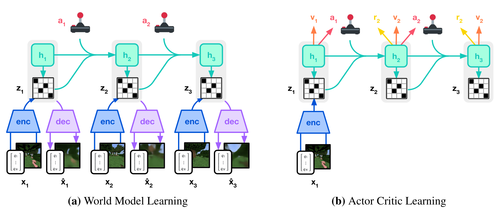

# 模型、规划与层级决策

强化学习不只是在 model-free value 与 policy gradient 之间选择。Agent 可以学习环境模型、在模型中规划，也可以把长任务压成持续多步的 option。对语言智能体而言，“写计划”“搜索候选”和“学习环境动力学”是不同对象，不能都叫 model-based RL。

## 什么是环境模型

MDP 的动力学与 reward 模型为

$$
P(s'\mid s,a),
\qquad
r(s,a,s').
$$

model-based 方法已知或学习这些对象，再用 rollout、dynamic programming 或 search 改进决策。model-free 方法不显式用可查询的动力学做规划，但仍可能学习包含世界结构的表示；“model-free”不等于网络内部没有环境知识。

## Planning 与 learning

- **Planning**：用已有模型计算 value 或选择动作；
- **Model learning**：从真实 transition 拟合动力学；
- **Policy/value learning**：改变行为或价值估计。

<div markdown="block">
<figure class="paper-figure paper-figure--wide" id="dreamerv3-figure-03" data-paper-source="dreamerv3" data-paper-asset="dreamerv3-figure-03" markdown="1">
[{ width="2008" height="875" loading="lazy" decoding="async" }](../assets/papers/dreamerv3/figure-03-training-process.png)
<figcaption><strong>Figure 3 是区分 model learning、planning 与 policy learning 的具体例子。</strong>encoder / dynamics 从真实观察形成可滚动状态，actor / critic 则把模型当作可查询环境；模型误差会先改变 imagined state distribution，再通过 value 和 policy 放大，所以规划长度、真实状态重置和闭环校验都是算法的一部分。<span class="paper-figure__source">图源：<a href="https://arxiv.org/pdf/2301.04104v2#page=3">Hafner et al., Mastering Diverse Domains through World Models, Figure 3, p. 3</a>；Copyright © 2024 Danijar Hafner, Jurgis Pasukonis, Jimmy Ba, and Timothy Lillicrap，<a href="https://creativecommons.org/licenses/by/4.0/">CC BY 4.0</a>；已裁去原始 caption 与周围正文。</span></figcaption>
</figure>
</div>

它们可以交替：

```text
real transition
  -> update dynamics model
  -> sample imagined transitions
  -> update value / policy
  -> act in the real environment
```

若 imagined data 的误差被 policy 主动利用，更多 model rollout 反而会放大偏差。

## Dyna：真实经验与规划更新共享接口

[Dyna](https://doi.org/10.1016/B978-1-55860-141-3.50030-4) 把一次真实 transition 同时用于：

1. 更新 value/policy；
2. 更新环境模型；
3. 从模型采样额外 transition 再更新。

对 tabular Q-learning，可写成

$$
Q(s,a)\leftarrow Q(s,a)+\alpha
\left[
r+\gamma\max_{a'}Q(s',a')-Q(s,a)
\right],
$$

真实与 imagined transition 使用同一 update。差别在于数据来源，而不是 target 形式。

## Model bias

设 learned model 为 $\widehat P$。短期 prediction error 很小，不保证长 rollout 可靠：状态分布每一步都由前一步预测决定，误差会累积。常见控制手段包括：

- 短 horizon model rollout；
- uncertainty ensemble；
- pessimistic value；
- 只在数据支持区域规划；
- 用真实 observation 周期性重置；
- 对 model exploitation 做 adversarial audit。

语言模型模拟环境时尤其要谨慎：能生成合理文本，不等于能忠实预测文件、网页、物理或用户状态。

## Search 不是自动的 model-based RL

树搜索需要一个可扩展状态、transition 或生成模型，以及 value/verifier：

$$
s_{t+1}\sim\widehat P(\cdot\mid s_t,a_t).
$$

对语言推理，policy 自己可以产生下一步候选，verifier 排序节点。这是 inference-time planning；若搜索结果只用于当前答案，模型参数没有学习。将搜索轨迹做 SFT、value training 或 RL，才形成学习闭环。

相关边界见[推理时搜索](../reasoning/search-verification.md)与[推理后训练](../training/reasoning-posttraining.md)。

## Options 与时间抽象

一个 option $o$ 通常包含：

$$
o=(\mathcal I_o,\pi_o,\beta_o),
$$

其中 $\mathcal I_o$ 是可启动状态集合，$\pi_o$ 是 option 内策略，$\beta_o(s)$ 是终止概率。option 从 $s_t$ 启动并持续 $k$ 个 primitive step 后，先把期间 reward 聚合为

$$
\bar r_t^{(o)}
=\sum_{j=0}^{k-1}\gamma^jr_{t+j}
$$

若在终点继续按 target policy 选 option，one-step SMDP Q backup target 为

$$
y_t^{\mathrm{SMDP}}
=\bar r_t^{(o)}
+\gamma^k(1-d_{t+k})
\mathbb E_{o'\sim\pi(\cdot\mid s_{t+k})}
\left[Q_{\bar\theta}(s_{t+k},o')\right].
$$

做最优控制时，可把期望替换为

$$
\max_{o'\in\mathcal O(s_{t+k})}
Q_{\bar\theta}(s_{t+k},o').
$$

若 option 在 terminal 结束，$d_{t+k}=1$，不再 bootstrap。这里的 $\gamma^k$ 假设 $\gamma$ 是按同一种 primitive time unit 定义的折扣。

wall-clock duration $\Delta t$ 不是天然的 primitive step。若目标确实按连续时间贴现，应先定义时间尺度，例如

$$
\Gamma(\Delta t)
=e^{-\beta\Delta t}
=\gamma_0^{\Delta t/\Delta t_0},
$$

其中 $\gamma_0=e^{-\beta\Delta t_0}$ 是参考时长 $\Delta t_0$ 上的折扣。若第 $j$ 个 reward 在 option 启动后的 $\tau_j$ 到达，应把 reward 项的 $\gamma^j$ 换成 $\Gamma(\tau_j)$，并把 bootstrap 的 $\gamma^k$ 换成 $\Gamma(\Delta t)$。如果目标是 undiscounted episode success，等待时间更适合作为显式 cost、deadline 或约束；不能把 token-step 的 $\gamma$ 直接对秒数取幂。rollout 变慢还会增加系统 staleness，但这属于训练数据陈旧度，不必然改变任务效用。

## 层级策略

高层选择子目标或 skill：

$$
z_k\sim\pi_H(z\mid h_{t_k}),
$$

低层执行：

$$
a_t\sim\pi_L(a\mid h_t,z_k).
$$

层级结构可以缩短信号路径、复用 skill，并让规划在更粗粒度上进行。它也引入新的信用问题：

- 子目标由谁定义或发现；
- option 何时终止；
- 高低层 reward 是否一致；
- 失败恢复是继续、重选还是回滚；
- 训练数据是否来自同一层级 policy。

只在 prompt 中写“先规划再执行”并不构成层级 RL；必须存在可训练的层级动作、状态与终止语义。

## 语言 Agent 中的映射

| RL 对象 | 可能的 Agent 实例 | 需要额外证明 |
| --- | --- | --- |
| Dynamics model | 世界模型、环境模拟器、用户模型 | 是否预测真实 transition |
| Planning | tree search、候选计划、rollout simulation | 状态是否可恢复、verifier 是否可信 |
| Option | 子任务、工具 skill、工作流 | initiation/termination 是否明确 |
| High-level policy | 选择子目标或工具链 | 是否真的接受独立信用 |
| Low-level policy | 生成参数、代码或操作 | observation 与权限怎样进入 state |

工具调用通常有不同持续时间、成本和失败率，SMDP 比“每个 token 一步”更自然。但 duration 可按 environment transition、wall-clock 或其他明确时间单位定义；token 数和成本是另外两种量，除非目标显式如此建模，不应混作同一个 $k$。

## Context model 与 environment model

LLM context 记录观察历史；它不是动力学模型。摘要、memory 或 retrieval 改善可见状态，不自动预测动作后果。反过来，一个 world model 可以预测状态，却不能替代权限、真实工具执行或最新外部事实。

这一区分连接[语言模型作为策略](language-model-policy.md)、[Agent 运行时](../applications/agent-runtime.md)和[长时任务](../agentic-rl/long-horizon.md)。

## 失败与验证

1. model rollout horizon 增大时，分别测 one-step 与 multi-step error。
2. 让 policy 在 learned model 中优化后，再用真实环境检查 model exploitation。
3. option backup 使用与 primitive time unit 一致的 $\gamma^k$，测试 $k=1$、terminal 与 variable-duration transition。
4. 高低层分别记录 action、reward、behavior policy 与终止。
5. 搜索预算与 policy 能力分开报告。
6. 环境不可逆或高风险时，model prediction 不授权真实执行。
7. imagined data 与真实 data 分开统计，不用混合 loss 掩盖来源。

最小 Dyna 与 option backup 见[手撕强化学习](../practice/reinforcement-learning.md)；多轮环境契约见 [Agentic RL](../agentic-rl/index.md)。

## Reference {#reference}

- Sutton, [Integrated Architectures for Learning, Planning, and Reacting Based on Approximating Dynamic Programming](https://doi.org/10.1016/B978-1-55860-141-3.50030-4)
- Sutton, Precup, and Singh, [Between MDPs and Semi-MDPs: A Framework for Temporal Abstraction in Reinforcement Learning](https://doi.org/10.1016/S0004-3702(99)00052-1)
- Kocsis and Szepesvári, [Bandit Based Monte-Carlo Planning](https://doi.org/10.1007/11871842_29)
- Schrittwieser et al., [Mastering Atari, Go, Chess and Shogi by Planning with a Learned Model](https://arxiv.org/abs/1911.08265)
