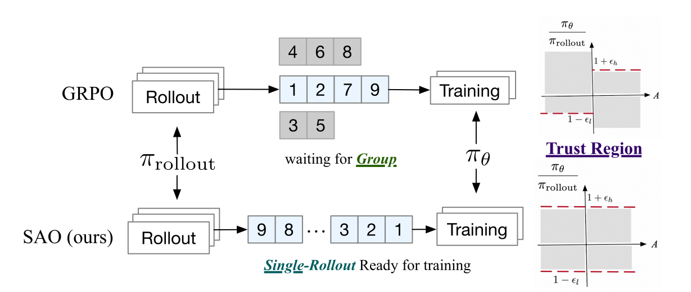

# Ratio、Clipping 与 Gate：从 PPO 到 DIS

LLM 强化学习近年的许多缩写，都在回答一个共同问题：<strong>rollout 不是由当前训练分布即时采出时，哪些梯度还值得相信？</strong>但它们修改的 ratio、粒度和梯度几何并不相同。把所有方法都概括为“换一种 clip”，会同时丢失统计目标与系统动机。

<div markdown="block">
<figure class="paper-figure paper-figure--wide" id="sao-figure-02" data-paper-source="sao" data-paper-asset="sao-figure-02" markdown="1">
[{ width="1229" height="521" loading="lazy" decoding="async" }](../assets/papers/sao/figure-02-single-rollout.png)
<figcaption><strong>Figure 2 把系统 barrier 与梯度 gate 放在同一张图里。</strong>取消同 prompt 的 group 等待会提高轨迹就绪速度，却让 behavior policy 更容易陈旧；DIS 因而直接按 rollout-relative token ratio 拒绝区间外梯度，而不是把 PPO clipping 当作通用补丁。<span class="paper-figure__source">图源：<a href="https://arxiv.org/pdf/2607.07508v1#page=3">Hou et al., Single-Rollout Asynchronous Optimization, Figure 2, p. 3</a>；Copyright © 2026 Zhenyu Hou, Yujiang Li, Jie Tang, and Yuxiao Dong，<a href="https://creativecommons.org/licenses/by/4.0/">CC BY 4.0</a>；已裁去论文页眉、正文与原始 caption。</span></figcaption>
</figure>
</div>

本页先固定三个坐标：

$$
\rho_{i,t}
=
\exp\left(
\ell^{\mathrm{cur}}_{i,t}
-\ell^{\mathrm{old}}_{i,t}
\right),
$$

$$
\kappa_{i,t}
=
\exp\left(
\ell^{\mathrm{old}}_{i,t}
-\ell^{\mathrm{roll}}_{i,t}
\right),
$$

$$
d_{i,t}
=
\exp\left(
\ell^{\mathrm{cur}}_{i,t}
-\ell^{\mathrm{roll}}_{i,t}
\right)
=\rho_{i,t}\kappa_{i,t}.
$$

$\rho$ 是 current 相对 old training policy 的 **policy-update ratio**；$\kappa$ 是同一 old checkpoint 在 train 与 rollout engine 间的 **engine-mismatch ratio**；$d$ 是 current 相对真实 rollout behavior 的 **direct ratio**。只有 token、prefix 与 checkpoint 版本完全对齐时，最后一个因式分解才成立。四种 policy 身份的完整契约见[策略身份、训推分布与策略滞后](training-inference-discrepancy.md)。

## 先区分 loss 值与真实梯度

设 $\widehat A$ 已 stop-gradient。一个 surrogate $j(\rho,\widehat A)$ 的标量值，不等于它对 $\log\pi_\theta$ 的有效梯度系数。因为

$$
\frac{\partial \rho}{\partial\log\pi_\theta}=\rho.
$$

同样，一个用 `stop_gradient(weight) * A * logp` 写出的直接 policy-gradient loss，其 forward 数值未必像论文中的 surrogate，但梯度系数就是冻结后的 `weight * A`。

阅读任何新方法时应逐项问：

1. ratio 的分母是 old training policy 还是真实 rollout behavior；
2. ratio 是 token product、token mean、几何平均还是逐 token；
3. gate 放在 surrogate 值、importance coefficient 还是梯度上；
4. gate 内的 ratio 是否 detach；
5. 越界后是饱和、平滑衰减还是直接归零；
6. loss 最后按 token、response 还是固定预算归约。

## PPO：有利方向越界后不再奖励 {#ppo}

PPO-Clip 最大化

$$
j_{\mathrm{PPO}}(\rho,A)
=
\min\left(
\rho A,\,
\operatorname{clip}(\rho,1-\epsilon,1+\epsilon)A
\right).
$$

按 advantage 符号展开：

$$
j_{\mathrm{PPO}}(\rho,A)
=
\begin{cases}
A\min(\rho,1+\epsilon),&A\ge0,\\
A\max(\rho,1-\epsilon),&A<0.
\end{cases}
$$

于是对 $\log\pi_\theta$ 的活动区梯度系数是

$$
g_{\mathrm{PPO}}
=
\rho A\,
\mathbf 1
\left[
(A\ge0\land \rho\le1+\epsilon)
\lor
(A<0\land \rho\ge1-\epsilon)
\right].
$$

这揭示三个经常被说反的事实：

- 正 advantage 且 $\rho<1-\epsilon$ 时仍有梯度，因为还需要把好动作概率提起来；
- 负 advantage 且 $\rho>1+\epsilon$ 时仍有梯度，因为还需要压低坏动作概率；
- 只有沿“有利方向”越过对应边界后，该样本才停止提供额外收益。

因此 PPO 不是把所有 ratio 数值夹进区间，也不是双侧丢样本。共享参数、其他 token 与 optimizer momentum 仍可能让某个已饱和 token 继续移动；PPO 也不保证全分布 KL 满足硬 trust region。完整推导见 [PPO 与训练契约](trust-region-ppo.md)。

下面直接对 `new_logp` 求导，因而同时检验 forward surrogate 与真正的梯度 gate。`advantage` 在进入 objective 前冻结；action mask 与 token/response reduction 属于外层 batch 契约。

```python
import torch
def ppo_term(new_logp, old_logp, advantage, eps=.2):
    ratio = (new_logp - old_logp).exp()
    raw = ratio * advantage.detach()
    clipped = ratio.clamp(1 - eps, 1 + eps) * advantage.detach()
    return torch.minimum(raw, clipped), ratio
ratio = torch.tensor([1.3, .7, 1.3, .7])
new_logp = ratio.log().requires_grad_()
advantage = torch.tensor([1., 1., -1., -1.])
objective, observed = ppo_term(new_logp, torch.zeros(4), advantage)
torch.testing.assert_close(objective, torch.tensor([1.2, .7, -1.3, -.8]))
(-objective.mean()).backward()
torch.testing.assert_close(new_logp.grad[[0, 3]], torch.zeros(2))
assert new_logp.grad[1] < 0 and new_logp.grad[2] > 0
```

第 0 个正 advantage 样本已经越过上界，第 3 个负 advantage 样本已经越过下界，所以二者梯度为零；另外两侧仍保留纠正方向。生产实现应在乘 action mask 后同时从分子、分母排除 padding，并记录正负样本各自的 saturation fraction。

## Clip-Higher：不对称地抬高上界 {#clip-higher}

DAPO 把 PPO 区间改为

$$
[1-\epsilon_{\mathrm{low}},\,
1+\epsilon_{\mathrm{high}}],
\qquad
\epsilon_{\mathrm{high}}>\epsilon_{\mathrm{low}}.
$$

其动机是：相对变化相同的上界，对低概率探索 token 只允许很小的绝对概率增加，而高概率 token 的绝对增长空间更大。提高 upper clip 让正 advantage 的低概率 token 在更宽区域内保留梯度。

它仍是符号相关的 PPO surrogate：

$$
j_{\mathrm{asym}}(\rho,A)
=
\min\left(
\rho A,\,
\operatorname{clip}
(\rho,1-\epsilon_{\mathrm{low}},1+\epsilon_{\mathrm{high}})A
\right).
$$

Clip-Higher 改变的是局部更新几何，不自动保证 entropy、探索或最终性能。DAPO 的动态采样、global token reduction 与 overlong reward 是另外三项改动，见 [DAPO 深读](../landscape/works/dapo.md)。

## CISPO：越界后保留饱和梯度 {#cispo}

CISPO（Clipped IS-weight Policy Optimization）先裁剪 update ratio，

$$
\bar\rho
=
\operatorname{clip}
\left(
\rho,\,
1-\epsilon_{\mathrm{low}}^{\mathrm{IS}},\,
1+\epsilon_{\mathrm{high}}^{\mathrm{IS}}
\right),
$$

再把它作为 detached coefficient：

$$
j_{\mathrm{CISPO}}
=
\operatorname{sg}(\bar\rho)\,
A\log\pi_\theta(a\mid h).
$$

因此对 $\log\pi_\theta$ 的系数始终是

$$
g_{\mathrm{CISPO}}
=
\operatorname{sg}(\bar\rho)A.
$$

PPO 在有利方向越界后让该样本梯度归零；CISPO 则让梯度幅度在边界处饱和，但继续保持正确符号。MiniMax-M1 报告的实验配置主要限制 upper weight，不能把任意对称 clamp 都称作论文原配方。

CISPO 没有消除 off-policy bias；它在“极端 weight 方差”与“越界样本仍有信号”之间选择另一种折中。其余 group advantage、动态采样与长度处理仍来自更大的训练 recipe。

## GSPO：整条 response 共用一个 clip 决策 {#gspo}

GSPO 先构造长度归一化 sequence ratio：

$$
s_i
=
\left[
\frac{
\pi_\theta(y_i\mid x)
}{
\pi_{\mathrm{old}}(y_i\mid x)
}
\right]^{1/|y_i|}
=
\exp\left(
\frac1{|y_i|}
\sum_t\log\rho_{i,t}
\right).
$$

这是 token ratio 的几何平均，不是经典未归一化 trajectory importance ratio

$$
\exp\left(\sum_t\log\rho_{i,t}\right).
$$

GSPO surrogate 为

$$
j_{\mathrm{GSPO}}(s_i,A_i)
=
\min\left(
s_iA_i,\,
\operatorname{clip}
(s_i,1-\epsilon_{\mathrm{low}},1+\epsilon_{\mathrm{high}})A_i
\right).
$$

同一 response 的 token 共享 $s_i$、advantage 与 clip decision。未饱和时，每个 token log-prob 的梯度系数为

$$
\frac{s_iA_i}{|y_i|}.
$$

sequence coherence 避免同一回答中一部分 token 被保留、另一部分被 PPO clip；代价是少量异常 token 可能让整条 response 饱和。几何平均缓和了长度造成的数值爆炸，也意味着它不是对原 sequence distribution 的普通无偏 IS。

## SAPO：把硬边界改成平滑衰减 {#sapo}

SAPO 使用符号相关温度

$$
\tau_i
=
\begin{cases}
\tau_{\mathrm{pos}},&A_i>0,\\
\tau_{\mathrm{neg}},&A_i\le0,
\end{cases}
$$

以及平滑 surrogate

$$
f_{\tau}(\rho)
=
\frac4{\tau}
\sigma\bigl(\tau(\rho-1)\bigr),
\qquad
j_{\mathrm{SAPO}}=f_{\tau_i}(\rho_{i,t})A_i.
$$

其对 $\log\pi_\theta$ 的梯度系数不是 $f_\tau(\rho)A$，而是

$$
g_{\mathrm{SAPO}}
=
\rho f_\tau'(\rho)A
=
\rho\,
\operatorname{sech}^2
\left(
\frac{\tau(\rho-1)}2
\right)A.
$$

离 $\rho=1$ 越远，梯度越平滑地衰减，而不是在阈值处突然归零。论文选择 $\tau_{\mathrm{neg}}>\tau_{\mathrm{pos}}$，使负 advantage 一侧更快衰减。

SAPO 的“sequence coherence”来自小步更新且序列内 log-ratio 方差较小时，对 token gate 平均行为的近似解释；它本身仍是 token-level smooth surrogate，不应写成 sequence-level clipping。平滑也不会自动消除 policy lag 或 engine mismatch。

## TIS 与 IcePop：校正的是 engine ratio {#tis-icepop}

TIS 处理 engine-mismatch ratio：

$$
\kappa
=
\frac{\pi_{\mathrm{old}}^{\mathrm{train}}}
{\mu_{\mathrm{old}}^{\mathrm{rollout}}}.
$$

$$
\widetilde\kappa=\min(\kappa,C).
$$

该 coefficient 乘在用 $\rho$ 构造的 PPO/GRPO 梯度外。它与 PPO clip 正交：一个修同版本 train–rollout mismatch，一个限制 current–old update。

IcePop 同样使用 $\kappa$，但做校正加双侧拒绝：

$$
M(\kappa)
=
\kappa\,
\mathbf 1[\alpha\le\kappa\le\beta].
$$

区间内仍进行 importance weighting，区间外才置零。TIS 会保留大 ratio 的封顶权重；IcePop 会完全排除两侧 mismatch tail。二者的详细系统边界见[训推分布与策略滞后](training-inference-discrepancy.md#tis)。

## DIS：直接对 current 与 rollout behavior 开门 {#dis}

SAO 的 Direct Double-Sided Importance Sampling（DIS）跳过 old training policy，直接计算

$$
d
=
\frac{\pi_\theta^{\mathrm{train}}(a\mid h)}
{\mu^{\mathrm{rollout}}(a\mid h)}.
$$

论文定义双侧 gate

$$
f(d)
=
\begin{cases}
d,&1-\epsilon_{\mathrm{low}}<d<1+\epsilon_{\mathrm{high}},\\
0,&\text{otherwise},
\end{cases}
$$

并写出

$$
\mathcal L_{\mathrm{DIS}}
=
\mathbb E
\left[
f(d)\widehat A\log\pi_\theta(a\mid h)
\right].
$$

它与 PPO 有三个本质差异：

1. 分母是真实 rollout behavior，而不是 old training policy；
2. 越界 token 双侧都直接失去信号；
3. ratio 同时吸收 engine mismatch 与 policy lag。

这里有一个重要的实现证据边界：论文公式没有显式写 $\operatorname{sg}[f(d)]$，当前也没有可用于核对的完整官方训练代码。若不 detach，$f(d)$ 对 $\theta$ 的导数会产生额外项；若 detach，它才是常见的直接 importance-weighted log-policy gradient。严谨实现必须固定这一选择，不能仅凭名称擅自补语义。

DIS 只是 SAO recipe 的一部分；single-rollout 队列、critic 更新、Skip-Observation GAE 与 value 初始化共同决定最终系统，见 [SAO 深读](../landscape/works/sao-compactionrl.md#sao)。

## 一张不能省略的对照表

| 方法 | 使用的 ratio | 粒度 | 越界行为 | advantage / value |
| --- | --- | --- | --- | --- |
| [PPO](trust-region-ppo.md) | $\rho$ | token | 有利方向饱和为零梯度 | 通常 critic + GAE |
| [GRPO](grpo.md) | $\rho$ | token | PPO gate | group-normalized reward |
| [DAPO](../landscape/works/dapo.md) | $\rho$ | token | 非对称 PPO gate | GRPO advantage |
| [VAPO](../landscape/works/vapo.md) | $\rho$ | token | 非对称 PPO gate | critic + adaptive GAE |
| [CISPO](#cispo) | $\rho$ | token | detached weight 饱和，梯度保留 | 常配 group advantage |
| [GSPO](#gspo) | $s=\exp(\mathrm{mean}\log\rho)$ | response | 整条 response 饱和 | group advantage |
| [SAPO](#sapo) | $\rho$ | token | 平滑衰减 | group advantage |
| [TIS](training-inference-discrepancy.md#tis) | $\kappa$ | token | 上截断后保留 | 叠加在原 optimizer 外 |
| [IcePop](training-inference-discrepancy.md#icepop) | $\kappa$ | token | 双侧拒绝，区间内校正 | 叠加在原 optimizer 外 |
| [DIS](#dis) | $d$ | token | 双侧拒绝 | critic advantage |

表中的方法不处在同一抽象层。GAE 是 estimator；PPO、GRPO、GSPO、SAPO、CISPO 是 objective 或算法层；DAPO、VAPO、SAO 是多组件 recipe；TIS、IcePop、DIS 处理 rollout/training distribution。它们也都不等于 RLHF、RLAIF 或 RLVR 这种[反馈制度](feedback-regimes.md)。

下面把几种容易混淆的 coefficient 放在同一份可执行对照中。`ratio` 的来源仍由调用方负责：CISPO/GSPO/SAPO 读 current–old update ratio，TIS/IcePop 读 engine ratio，DIS 读 current–behavior direct ratio。所有 hard coefficient 都显式 detach；这只冻结 gate，不冻结真正提供梯度的 policy log-probability。

<details class="code-disclosure">
<summary id="ratio-gates-semantic-reference">Ratio gate、sequence ratio 与平滑 surrogate <span class="code-disclosure__meta">Python · 52 行</span></summary>
<div class="code-disclosure__body" markdown="1">

```python
import torch
def geometric_sequence_ratio(new_logp, old_logp, mask):
    if new_logp.shape != old_logp.shape or new_logp.shape != mask.shape or new_logp.ndim != 2:
        raise ValueError("expected aligned [response, token] tensors")
    valid = mask.bool()
    length = valid.sum(-1)
    if torch.any(length == 0):
        raise ValueError("every response needs at least one action")
    if not torch.isfinite(new_logp[valid]).all() or not torch.isfinite(old_logp[valid]).all():
        raise ValueError("selected action log-probabilities must be finite")
    delta = torch.where(valid, new_logp - old_logp, 0.)
    return (delta.sum(-1) / length).exp()
def hard_coefficient(ratio, mode, low=.8, high=1.2, cap=2.):
    if mode == "cispo":
        weight = ratio.clamp(low, high)
    elif mode == "tis":
        weight = ratio.clamp(max=cap)
    elif mode == "icepop":
        weight = torch.where((ratio >= low) & (ratio <= high), ratio, 0.)
    elif mode == "dis":
        weight = torch.where((ratio > low) & (ratio < high), ratio, 0.)
    else:
        raise ValueError(mode)
    return weight.detach()
def sapo_term(new_logp, old_logp, advantage, tau_pos=1., tau_neg=2.):
    ratio = (new_logp - old_logp).exp()
    tau = torch.where(advantage >= 0, tau_pos, tau_neg)
    term = 4 / tau * torch.sigmoid(tau * (ratio - 1)) * advantage.detach()
    return term, ratio, tau
old = torch.tensor([[-1., -2., float("nan")], [-1., -2., -3.]])
new = old + torch.tensor([[.1, .3, 9.], [.1, .3, .2]])
mask = torch.tensor([[1, 1, 0], [1, 1, 1]])
seq_ratio = geometric_sequence_ratio(new, old, mask)
torch.testing.assert_close(seq_ratio, torch.tensor([.2, .2]).exp())
ratio = torch.tensor([.5, 1., 3.], requires_grad=True)
assert hard_coefficient(ratio, "tis").tolist() == [.5, 1., 2.]
assert hard_coefficient(ratio, "icepop").tolist() == [0., 1., 0.]
boundary = torch.tensor([.8, 1., 1.2])
assert hard_coefficient(boundary, "icepop").tolist() == boundary.tolist()
assert hard_coefficient(boundary, "dis").tolist() == [0., 1., 0.]
try:
    geometric_sequence_ratio(new, old, torch.tensor([[0, 0, 0], [1, 1, 1]]))
except ValueError:
    pass
else:
    raise AssertionError("empty action rows must be rejected")
logp = torch.tensor([-.7, 0., .7], requires_grad=True)
term, observed, tau = sapo_term(logp, torch.zeros(3), torch.tensor([1., -1., 1.]))
term.sum().backward()
gate = torch.cosh(tau * (observed - 1) / 2).reciprocal().square()
torch.testing.assert_close(logp.grad, observed * gate * torch.tensor([1., -1., 1.]))
assert not hard_coefficient(ratio, "cispo").requires_grad
```

</div>
</details>

这份代码刻意不提供统一的 `loss(mode=...)`：这些方法的 forward 目标、梯度语义和 ratio 身份并不统一。生产实现还要在 mask 后归约，分别记录越界的上下尾、保留 token 的任务/长度分布，并为 `DIS` 的 ratio 是否进入 autograd 图固定可审计约定。

## 训练时怎样看 gate

只报告总 clip fraction 不够。至少分别画：

- 正、负 advantage 的 ratio 分位数与有效梯度比例；
- $\rho$、$\kappa$、$d$ 三种 log-ratio；
- token、response 与 sequence-level accepted fraction；
- accepted/rejected token 的长度、reward、任务与语言分布；
- gate 前后的 gradient norm、entropy 与 KL；
- 每条 response 保留 token 的比例；
- 随 checkpoint age 变化的 mismatch tail；
- global token、per-response 与 fixed-budget denominator；
- 训练 reward 与 held-out 能力。

若某 gate 通过丢弃长轨迹或困难任务获得更平滑的曲线，它可能只是在改变有效课程。完整可执行小例见[手撕 LLM 策略优化](../practice/llm-policy-optimization.md)；方法如何组成 recipe 见[推理 RL 配方地图](reasoning-rl-recipes.md)。

## Reference {#reference}

- Schulman et al., [Proximal Policy Optimization Algorithms](https://arxiv.org/abs/1707.06347)
- Yu et al., [DAPO: An Open-Source LLM Reinforcement Learning System at Scale](https://arxiv.org/abs/2503.14476)
- MiniMax Team, [MiniMax-M1: Scaling Test-Time Compute Efficiently with Lightning Attention](https://arxiv.org/abs/2506.13585)
- Zheng et al., [Group Sequence Policy Optimization](https://arxiv.org/abs/2507.18071)
- Gao et al., [Soft Adaptive Policy Optimization](https://arxiv.org/abs/2511.20347)
- Yao et al., [On the Rollout-Training Mismatch in Modern RL Systems](https://www.opt-ml.org/papers/2025/paper116.pdf)
- Ling Team, [Every Step Evolves: Scaling Reinforcement Learning for Trillion-Scale Thinking Model](https://arxiv.org/abs/2510.18855)
- Hou et al., [Single-Rollout Asynchronous Optimization for Agentic Reinforcement Learning](https://arxiv.org/abs/2607.07508)
