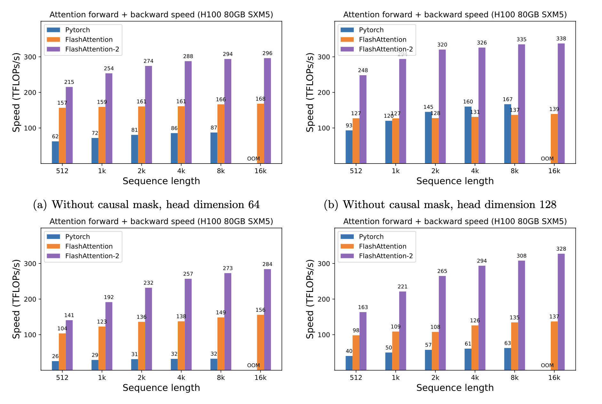

# Kernel 与性能

大模型性能优化的核心是减少关键路径上的无效计算、数据搬运、同步和 launch。FLOPs 相同的两个实现可能相差很大；理论复杂度更低的方法也可能因 kernel 粒度差而更慢。

<div markdown="block">
<figure class="paper-figure paper-figure--wide" id="flashattention-h100-benchmark" data-paper-source="flash-attention-h100" data-paper-asset="flashattention-h100-benchmark" markdown="1">
[{ width="1882" height="1262" loading="lazy" decoding="async" }](../assets/papers/flash-attention-h100/flashattention-h100-benchmark.png)
<figcaption><strong>算法名并不决定性能，shape、causal 语义、head dimension、forward/backward 与硬件共同决定可达吞吐。</strong>这组 H100 数据适合说明 kernel 专门化的收益，也提醒我们不能把单一 TFLOPs/s 图表写成跨硬件、跨版本的永久排名。<span class="paper-figure__source">图源：<a href="https://raw.githubusercontent.com/Dao-AILab/flash-attention/14c377950125c70b7a9dabf9c561fca53715ac7d/assets/flash2_h100_fwd_bwd_benchmark.png">FlashAttention-2 H100 forward and backward benchmark, standalone benchmark figure</a>；FlashAttention contributors，<a href="https://github.com/Dao-AILab/flash-attention/blob/14c377950125c70b7a9dabf9c561fca53715ac7d/LICENSE">BSD 3-Clause License</a>。</span></figcaption>
</figure>
</div>

## Roofline

算术强度定义为

$$
I=\frac{\text{FLOPs}}{\text{bytes moved}}.
$$

若硬件峰值计算为 $F_{\max}$、内存带宽为 $B_{\max}$，可达到的性能受

$$
F\le\min(F_{\max},I B_{\max})
$$

约束。大矩阵 prefill 更可能 compute-bound；小 batch decode、norm、采样与 KV 读取更容易 bandwidth-bound 或 launch-bound。

## GEMM 形状

矩阵乘法性能不仅由 $MNK$ 决定，还取决于：

- 维度是否对齐 tensor core tile；
- batch 与序列展平后的 $M$ 是否足够大；
- 权重 layout 与 transpose；
- dtype、累加精度和 scale；
- fusion 前后的中间 tensor；
- TP/EP 分片是否把 GEMM 切得过小。

MoE 小专家和 decode 小 batch 常造成 skinny GEMM。提高理论并行度可能反而降低单 kernel 利用率。

## Online softmax

分块 attention 不能先保存完整 score 矩阵。对已处理元素维护最大值 $m$ 与指数和 $\ell$。加入新 block、其局部最大值为 $m_b$、局部指数和为 $\ell_b$ 时：

$$
m'=\max(m,m_b),
$$

$$
\ell'
=e^{m-m'}\ell+e^{m_b-m'}\ell_b.
$$

加权输出累加器也按相同 scale 重标定。这个 recurrence 使不同 score block 能在不物化完整矩阵的情况下得到与标准 softmax 等价的结果。

## FlashAttention

[FlashAttention](https://arxiv.org/abs/2205.14135) 通过 tiling 将 Q/K/V block 放入片上存储，使用 online softmax 累加，减少 HBM 往返；它是 exact attention 的 IO 优化，不是近似线性 attention。[FlashAttention-2](https://arxiv.org/abs/2307.08691) 进一步调整 thread block 与 warp 的工作划分。

实现仍要正确处理：

- causal、padding、window 与 packed mask；
- 不同 Q/K 长度；
- dropout 随机数可重放；
- GQA/MQA 的 head 映射；
- backward 中重算统计；
- FP16/BF16 输入与 FP32 累加；
- head dimension 和硬件支持范围。

## Fusion

融合可减少中间 tensor 和 launch，例如：

- bias + activation；
- gated MLP 的两分支与逐元素乘；
- residual + dropout + norm；
- dequantize + GEMM；
- sampling 的 temperature、mask 与 top-$k$。

但融合越大，动态 shape、调试、编译时间和寄存器压力越难控制。若寄存器溢出到 local memory，融合可能变慢。始终保留可比较的 reference path。

## Reduction、scan 与 permutation

norm、softmax、router top-$k$、MoE token permutation、prefix scan 和采样都不是 GEMM。它们常受：

- 非连续访问；
- 多阶段归约；
- 原子操作争用；
- 动态输出大小；
- host-device 同步；
- 小 tensor launch。

优化时先测有效带宽与 occupancy，再决定融合、分块或使用专门库。不要用 GEMM 的峰值利用率评价所有算子。

## CUDA Graph 与编译

CUDA Graph 可复用一组稳定 kernel launch，降低 CPU 调度开销；它要求可复用的地址和形状管理。在线推理 batch 持续变化时，通常需要按 shape bucket 捕获多个 graph，并为 KV block、采样状态和 adapter 设计稳定 buffer。

编译器生成 kernel 能做算子融合和布局优化，但 graph break、动态控制流和版本变化会造成重新编译。报告性能时说明 warmup 与 compile time 是否计入。

## TileLang：把 host tax 与静态证明纳入编译

[TileLang](tilelang.md) 以 tile-level DSL 表达数据移动、layout、计算和流水线；语言、编译器、JIT、后端与验证的完整机制见专题页。[DeepSeek-V4](../landscape/works/deepseek-v4.md#mega-moe) 强调的增量不只在 device kernel：

- 由 IR 生成 host-side shape/layout validation 与 launch code，并通过 TVM-FFI 连接 runtime；报告把原本几十到数百微秒的动态检查降到低于 $1\,\mu s$；
- 把 layout、越界、barrier 和 hazard 约束转成 Z3 QF_NIA，允许数秒编译换取运行前验证；
- fast math 显式 opt-in，并提供 IEEE-style intrinsic、rounding 与 layout annotation，使数值路径可审计；
- 同一 DSL 覆盖压缩 attention、mHC、Muon、MegaMoE 与 OPD KL 等异形 kernel。

SMT 只能证明被编码的约束，不能替代端到端数值 reference；host codegen 的收益也只在短 kernel / decode 中可能占显著比例。V4 特有背景见 [MegaMoE、TileLang 与 DSec](../landscape/works/tilelang-mega-moe.md#host-codegen)。

## 正确性阶梯

1. 高精度标量或框架 reference；
2. 向量化未融合实现；
3. 单个自定义 kernel；
4. 融合 forward；
5. backward 与 gradient check；
6. 混合精度；
7. 分布式与真实调度。

比较指标包括最大绝对/相对误差、任务质量和梯度误差。softmax 尾部概率接近零时，相对误差可能失真；需要按输出语义选择容差。

## Benchmark 纪律

```text
hardware, clocks and power state
driver, runtime, compiler and library versions
tensor shapes, strides and dtypes
warmup and repetitions
quantiles, not only the minimum
allocation and data transfer boundaries
numerical tolerance and output quality
profiler trace and critical path
```

微基准变快不等于端到端变快。若该 kernel 原本只占 step time 的 5%，即使速度翻倍，上限收益也很小。应配合[系统资源模型](index.md)和[推理运行时](../inference/runtime.md)定位真正瓶颈。

## Reference {#reference}

- [Roofline: An Insightful Visual Performance Model for Multicore Architectures](https://doi.org/10.1145/1498765.1498785)
- [CUDA C++ Programming Guide](https://docs.nvidia.com/cuda/cuda-c-programming-guide/)
- [FlashAttention](https://arxiv.org/abs/2205.14135)
- [FlashAttention-2](https://arxiv.org/abs/2307.08691)
- [TileLang: Bridge Programmability and Performance in Modern Neural Kernels](https://iclr.cc/virtual/2026/poster/10010186)
- [Z3: An Efficient SMT Solver](https://doi.org/10.1007/978-3-540-78800-3_24)
- [DeepSeek-V4: Towards Highly Efficient Million-Token Context Intelligence](https://arxiv.org/abs/2606.19348)
