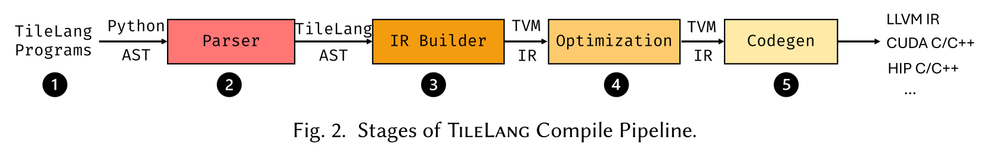

# TileLang：从 Tile 数据流到可控 AI Kernel

TileLang 是一个面向高性能 AI kernel 的 Python 风格领域专用语言与编译系统。它把
tile、内存层次、数据搬运、并行划分和流水线暴露为可组合对象，再让编译器补全
layout、同步、指令选择与目标代码。它试图填补两端之间的空白：

- 一端是 PyTorch、图编译器与高层算子，开发快，但单个异形融合 kernel 的控制有限；
- 另一端是 CUDA/HIP、CUTLASS/CuTe 与手写汇编，控制充分，但代码量、验证和移植成本高；
- TileLang 位于中间：开发者显式给出影响性能的少数结构，编译器推断剩余细节。

本文覆盖语言语义、GPU 基础、layout、流水线、编译器、JIT/ABI、自动调优、后端、
性能模型、数值与正确性、论文证据、生态比较和上线方法。它不把“支持某个 target”
等同于“各后端已达到同等成熟度”，也不把单个 microbenchmark 外推为端到端收益。

## 版本与证据边界

截至 2026 年 7 月 28 日，公开材料存在四个必须分开的边界：

| 对象 | 边界 | 能支持的结论 |
| --- | --- | --- |
| arXiv 初稿 | 2025 年 4 月，[《A Composable Tiled Programming Model》](https://arxiv.org/abs/2504.17577) | 初始系统设计、早期算子和 H100/A100/MI300X 实验 |
| ICLR 最终论文 | ICLR 2026 Oral，[《Bridge Programmability and Performance》](https://openreview.net/forum?id=Jb1WkNSfUB) | FTG、tile recommendation/inference、跨平台优化和最终论文实验 |
| 稳定软件 | [TileLang 0.1.12](https://github.com/tile-ai/tilelang/releases/tag/v0.1.12)，2026 年 7 月 8 日 | 可安装 API、源码 pass、后端、JIT、缓存与已发布修复 |
| 开发主线 | [GitHub 主分支](https://github.com/tile-ai/tilelang)，核对至 2026 年 7 月 28 日 | 稳定版之后仍在演进的功能与修复，不能反向声称已进入 0.1.12 |

ICLR 展示页采用“不到 80 行、最多减少约 90% 代码、相对 Triton 最多约
$5\times$（H100）和 $6\times$（AMD）”的摘要口径；最终论文正文与 2025 年初稿又按
具体 workload、shape 和 baseline 给出不同区间。它们是不同修订版和聚合口径，不应
拼成一个脱离上下文的“TileLang 固定加速比”。[0.2 路线图 issue](https://github.com/tile-ai/tilelang/issues/79)
已经关闭且仍有未勾选项目，README 中的链接只是一份历史规划，不是当前发布承诺。

### 公开演化线索

| 时间 | 公开里程碑 | 说明 |
| --- | --- | --- |
| 2025-01-20 | 仓库公开 | 项目开始以独立 tile-level DSL 公开演进 |
| 2025-02-12 | v0.1.0 | 首个 0.1 稳定发布 |
| 2025-02 至 07 | WebGPU、NVRTC、`T.gemm_sp` | 扩展 codegen、编译路径和 2:4 sparse tensor core |
| 2025-09 至 10 | Ascend preview、Metal、`apache-tvm-ffi` | 扩展设备覆盖并重做 runtime ABI |
| 2025-12 | Z3 analyzer、CuTeDSL backend | 增强静态推理并增加 NVIDIA CuTeDSL 路径 |
| 2026-02 | TileLang Puzzles | 增加由浅入深的交互式练习仓库 |
| 2026-07-08 | v0.1.12 | LLVM、backend registry、tile scheduler、pass visualizer、TMA/layout 与大批 correctness 修复 |

仓库 `LICENSE` 是 MIT License，并保留一段 2024 年 12 月 1 日至 2025 年 3 月 14 日
与 Microsoft Corporation 额外协作条款的历史说明。使用代码时应以所固定 tag 中的
原始 license 文本为准；论文、网站、第三方 backend 和 benchmark artifact 可能有各自
许可，不能用主仓库 MIT 许可证代替逐项核对。

## 一句话心智模型

传统 thread DSL 常先问“每个 program/thread 处理哪些元素”；TileLang 先问：

> 这个 block/warp 拥有哪些逻辑 tile，它们放在哪一层存储，如何搬运、计算和重叠？

随后再把逻辑 tile 分解到 warp、lane、寄存器和具体指令。它不是“不用懂 GPU”，而是
把硬件知识提升到较稳定的 tile 决策层。0.1.12 文档也明确说明，面向初学者的
hardware-unaware 接口尚未完全实现；当前主力仍是 hardware-aware 的 developer/expert
接口。

这条编译路径可拆成六个边界：

1. PyTorch、JAX 或推理引擎识别需要定制的融合算子；
2. TileLang 程序声明 tile、placement 与 dataflow；
3. 前端把程序降到 TIR / FTG，并补齐 shape、dtype 与作用域约束；
4. 编译 pass 推断 layout、pipeline 与 tensorization；
5. 后端生成 CUDA、HIP、Metal、LLVM、WebGPU 或 C 代码；
6. host stub、device kernel 与 runtime cache 一起接回上层框架。

<div markdown="block">
<figure class="paper-figure paper-figure--wide" id="tilelang-figure-02" data-paper-source="tilelang" data-paper-asset="tilelang-figure-02" markdown="1">
[{ width="1675" height="271" loading="lazy" decoding="async" }](../assets/papers/tilelang/figure-02-compile-pipeline.png)
<figcaption><strong>Figure 2 把“Python 写 kernel”拆成一条可审计的 lowering 链：前端先形成 TileLang AST，随后进入 TVM IR、调度优化与多后端 codegen。</strong>真正决定性能与正确性的工作发生在中间表示、layout、同步和指令选择上；Python 只是入口，不是运行时逐行解释。<span class="paper-figure__source">图源：<a href="https://arxiv.org/pdf/2504.17577v2#page=5">TileLang: A Composable Tiled Programming Model for AI Systems, Figure 2, p. 5</a>；Copyright © 2025 Lei Wang et al.，<a href="https://creativecommons.org/licenses/by/4.0/">CC BY 4.0</a>。</span></figcaption>
</figure>
</div>

TileLang 通常负责一个或一组性能关键 kernel，而不是替代训练框架、分布式运行时、
内存分配器或完整图编译器。若标准库已经覆盖 shape 和语义，直接调用 cuBLAS、
cuDNN、FlashAttention 或框架算子往往更省维护成本。

## 先补齐 GPU 基础

### 执行与存储层次

以 GPU 为例，一个 `T.Kernel` launch 形成 grid；每个 program instance 通常对应一个
thread block/CTA。block 内有若干 warp/wave，每个 warp 再由 lane/thread 执行。

| TileLang 对象 | 常见硬件含义 | 可见范围 | 主要代价 |
| --- | --- | --- | --- |
| 输入/输出 `T.Tensor` | global memory/HBM | 全设备 | 容量大、延迟高 |
| `T.alloc_shared` | NVIDIA shared memory、AMD LDS | block | 容量有限、需处理 bank conflict 与同步 |
| `T.alloc_fragment` | 分布在各 thread 的寄存器 fragment | thread；逻辑上组成 block tile | 最快但会增加寄存器压力 |
| `T.alloc_var`/`T.alloc_local` | 标量或 thread-local storage | thread | 可能驻留寄存器，也可能 spill |
| barrier/descriptor/TMEM | 架构专用状态 | block、cluster 或 warp group | 依赖 target 与架构 |

| 阶段 | 数据所在层次 | 关键操作 | 必须守住的约束 |
| --- | --- | --- | --- |
| 输入 | HBM / global memory 中的完整张量 | `T.copy`、TMA 或 async copy | 对齐、合并访存与搬运粒度 |
| Block 工作集 | shared memory / LDS 中的 tile | layout 变换与 tensor-core load | 容量、bank conflict、barrier |
| 计算片段 | 各 lane 的 register fragment | `T.gemm`、reduce、elementwise | 指令 shape、寄存器压力与依赖 |
| 写回 | 从 fragment 回到 global memory | store 或 `T.copy` | 合并写回、边界条件与同步 |

关键不是“越靠近计算越好”，而是容量、复用和并行度的平衡。更多 shared memory
buffer 或流水级数可提高重叠，却可能让每个 SM 同时驻留的 block 数下降；过多寄存器
会降低 occupancy，严重时还会 spill 到 local memory。

### Coalescing、bank conflict 与 tensor core

- **Coalescing**：同一 warp 的 global-memory 地址应尽量落入少数对齐事务。若 lane
  沿连续维访问，通常比大步长或随机访问有效。
- **Bank conflict**：shared memory 被划分为 bank。若多个 lane 在同一指令访问同一
  bank 的不同地址，请求可能串行化。layout swizzle 通过重排地址降低冲突。
- **Tensorization**：GEMM tile 最终要匹配 MMA/WGMMA/Matrix Core 等指令支持的
  micro-tile、dtype、转置和对齐约束。逻辑 shape 合法不代表有高效指令映射。
- **Warp partition**：多个 warp 如何分担 tile 决定数据复用、寄存器布局和负载均衡。
  `FullRow`、`FullCol` 等策略不是纯语法偏好，而是硬件与算子 shape 的共同结果。

shared memory 的简化 bank 模型可写为

$$
\operatorname{bank}(a)
=
\left\lfloor\frac{a}{w}\right\rfloor\bmod N_{\mathrm{bank}},
$$

其中 $a$ 是 byte address，$w$ 是 bank word 宽度。真实参数与广播规则依架构而异，
所以应以 profiler 和目标硬件文档为准。

## TileLang 程序由什么组成

### 两种前端写法

0.1.12 同时保留两种常见入口：

1. 现代 `@tilelang.jit` 外层函数：用 `T.const` 声明编译期 shape，用类型注解描述输入，
   用 `T.empty` 创建输出，可在一个函数中顺序写多个 `T.Kernel`；
2. `@T.prim_func`：直接构造一个 TIR `PrimFunc`，再交给 `@tilelang.jit` 或
   `tilelang.compile`。

前者更接近普通 tensor 函数，后者更适合显式查看和操纵 IR。二者最终都进入
TileLang/TVM lowering。

### 最小但完整的 GEMM 骨架

```python
import torch
import tilelang
import tilelang.language as T

@tilelang.jit
def matmul(A, B, BM: int = 64, BN: int = 64, BK: int = 32):
    M, N, K = T.const("M, N, K")
    A: T.Tensor[[M, K], T.float16]
    B: T.Tensor[[K, N], T.float16]
    C = T.empty([M, N], T.float16)

    with T.Kernel(T.ceildiv(N, BN), T.ceildiv(M, BM), threads=128) as (bx, by):
        A_s = T.alloc_shared((BM, BK), T.float16)
        B_s = T.alloc_shared((BK, BN), T.float16)
        C_f = T.alloc_fragment((BM, BN), T.float32)
        T.clear(C_f)

        for ko in T.Pipelined(T.ceildiv(K, BK), num_stages=3):
            T.copy(A[by * BM, ko * BK], A_s)
            T.copy(B[ko * BK, bx * BN], B_s)
            T.gemm(A_s, B_s, C_f)

        T.copy(C_f, C[by * BM, bx * BN])
    return C

a = torch.randn(1024, 1024, device="cuda", dtype=torch.float16)
b = torch.randn(1024, 1024, device="cuda", dtype=torch.float16)
c = matmul(a, b)
torch.testing.assert_close(c, a @ b, rtol=1e-2, atol=1e-2)
```

这段代码包含六个核心决策：

1. `BM × BN × BK` 决定 block tile；
2. grid 把输出矩阵切给不同 block；
3. A、B tile 进入 shared memory，C 累加 tile 进入寄存器 fragment；
4. K 维循环按 `BK` 分块；
5. `T.Pipelined` 尝试重叠下一 tile 的搬运与当前 tile 的计算；
6. FP16 输入用 FP32 累加，最后转回输出 dtype。

它仍不是“所有 shape 都最优”的 GEMM：边界保护、转置、warp policy、swizzle、
architecture、流水级数与资源占用都要验证或调优。

### 编译期参数与运行期参数

Tile size、线程数、dtype、流水级数和 target 通常是编译期参数；tensor 数据、可由
shape 绑定的动态维度与显式标量可以是运行期参数。修改编译期参数会产生新 kernel，
因此 shape 爆炸可能带来编译与缓存压力。

动态维度有两类写法：

- `T.dyn["K"]`：用于 tensor 签名的命名符号，推荐从 `buffer.shape` 读取绑定值；
- `T.dynamic("K", "int32")`：直接得到可在循环和表达式中使用的 TIR 变量；
- `T.symbolic` 是已弃用别名，不应出现在新代码中。

host stub 能绑定常量和跨 tensor 的线性 shape 关系；在某个检查点只有一个未知量时，
还可求解该线性关系。它不是任意非线性动态 shape 求解器。内置 autotuner 的自动
输入生成也要求静态 shape；动态 shape 应提供真实输入或自定义 supplier。

### Python 只是表面语法

kernel body 不是完整 Python 运行时：

| 能力 | 状态与替代 |
| --- | --- |
| `if`/`else`、三元表达式、`break`/`continue` | 支持 |
| `T.serial`、`T.unroll`、`T.Parallel`、`T.Pipelined` | 支持并携带 lowering 语义 |
| tensor 索引与 slice | 支持；slice 产生 `BufferRegion` |
| 普通函数和 class | kernel 内不支持；复用代码用 `@T.macro` |
| `enumerate`、`zip`、`len` | 不支持；用显式索引和 `buffer.shape` |
| `with` | 只支持 DSL 定义的上下文，如 `T.Kernel`、`T.ws` |
| Python `print`、`assert` | 设备侧分别用 `T.print`、`T.device_assert` |

理解这一点可避免把动态 Python 对象、异常、容器和反射误带进编译期 IR。

## 核心语言能力全景

### 程序、循环与调度

| 类别 | 代表接口 | 作用 |
| --- | --- | --- |
| launch | `T.Kernel`、`T.ClusterKernel` | 定义 grid、线程和可选 cluster |
| 顺序循环 | `T.serial`、`T.unroll`、`T.vectorized` | 表达标量循环、展开和向量化意图 |
| 并行循环 | `T.Parallel`、`T.Persistent` | 把迭代映射到线程或持久 tile 调度 |
| 流水循环 | `T.Pipelined` | 生成 producer/consumer 软件流水线 |
| warp specialization | `T.ws`、barrier | 分离搬运与计算 warp group |
| L2 调度 | `T.use_swizzle`、tile scheduler | 改变 block 遍历顺序以提高 cache locality |

`T.Parallel` 不等价于“无限并行”；编译器仍需结合线程数、向量宽度和 layout 分配
迭代。`T.Persistent` 会改变 tile 到常驻 block 的映射，尤其需要覆盖尾 tile 测试。

### 内存与数据移动

| 类别 | 代表接口 | 关键语义 |
| --- | --- | --- |
| 分配 | `T.alloc_shared`、`T.alloc_fragment`、`T.alloc_local`、`T.alloc_var` | 显式 placement |
| 初始化 | `T.clear`、`T.fill` | 清零或填充 tile |
| 普通搬运 | `T.copy`、`T.transpose`、`T.im2col` | 以同步源语义表达，编译器可选择高效 lowering |
| 显式异步 | `T.async_copy` | 不自动插入消费前的 async wait；生命周期由开发者负责 |
| 架构搬运 | `T.tma_copy`、gather/scatter、cluster copy | 对应 TMA 或其他 target 特性 |
| 视图 | `T.reshape`、`T.view` | 改变逻辑解释；不应假设总是发生物理搬运 |

`T.copy` 即使最终使用 `cp.async` 或 TMA，程序员观察到的仍是“消费前数据可用”的
高层语义，编译器负责适当的 commit、wait 和同步。直接使用 `T.async_copy` 时则不能
依赖这一保证；必须按后端协议安排 wait，并在跨 thread 消费 shared tile 前保证 block
级可见性。

### 计算、归约与 scan

| 类别 | 代表接口 | 典型用途 |
| --- | --- | --- |
| 矩阵计算 | `T.gemm`、`T.gemm_sp` | dense GEMM、2:4 structured sparse GEMM |
| 新架构矩阵指令 | `T.wgmma_gemm`、`T.tcgen05_gemm` | Hopper/Blackwell 专用路径 |
| 归约 | `T.reduce_sum/max/min`、warp reduce | softmax、norm、统计量 |
| scan | `T.cumsum`、`T.cummax` | prefix 算法、线性 attention 状态 |
| 原子操作 | `T.atomic_add/max/min/or` 等 | 跨线程或跨 block 聚合 |
| 逐元素数学 | exp、log、rsqrt、clamp 等 | activation、normalization、softmax |
| 随机数 | `T.rng_init`、`T.rng_rand` | dropout、sampling 等 |

API 出现在语言层不表示每个 dtype、shape 和 target 都有同等高效 lowering。例如
`T.gemm_sp` 依赖具体稀疏 tensor-core 能力，Blackwell 的 TMEM/TCGEN05 接口也不能
用于旧架构。

### 类型系统

dtype 可写成字符串、TileLang dtype 对象或可识别的 framework dtype，前端会做归一化：

| 家族 | 代表类型 | 注意点 |
| --- | --- | --- |
| bool | `bool` | host ABI 对 bool 有独立类型检查 |
| signed integer | `int8/16/32/64` | 索引、计数、量化与 packed decode 要区分符号扩展 |
| unsigned integer | `uint8/16/32/64` | 与 signed reinterpret、atomic 支持不可混淆 |
| standard float | `float16`、`bfloat16`、`float32`、`float64` | storage、compute、accumulator 应分别声明 |
| Float8 | E3M4、E4M3、E5M2、E8M0 等变体 | exponent/mantissa、finite/unsigned-zero 语义不同 |
| Float6/Float4 | E2M3、E3M2、E2M1 等 | 常依赖 packing、scale 与新架构指令 |
| vector pack | 多数基型的 `x2/x4/.../x64` | 是 lane-packed element type，不等同自动 coalescing |

低位类型名称很精确：`float8_e4m3fn`、`float8_e4m3fnuz` 与
`float8_e5m2fnuz` 不是可随意互换的“FP8”。实际可用性取决于 backend、architecture、
cast lowering 和上层 framework 对应 dtype。host stub 对部分兼容的 FP8 DLPack 编码
有容忍集合，但 kernel 的数值含义仍由编译 dtype 决定。

### 同步、通信与诊断

TileLang 覆盖 block/warp/cluster 同步、named barrier/mbarrier、warp shuffle/ballot、
programmatic dependent launch、cluster multicast、原子操作和设备断言。选择原则是：

- 先使用结构化 `T.copy`、`T.Pipelined` 与 tile op，让 compiler 生成同步；
- 只有结构化推断无法表达时，才直接操作 async group、barrier 或 warp-group 协议；
- 一旦进入手动协议，正确性责任也随之下移，必须验证到每个 producer/consumer 边。

调试可使用 `T.print`、`T.device_assert`、layout plotter、生成源码、
pass visualizer 与 pass diff。生产代码不应依赖 device print 作为验证手段。

## Layout：从逻辑 tile 到 lane 和寄存器

### `Layout` 与 `Fragment`

一个二维 tile 的 shape 只说明有多少元素，不说明谁持有它们。TileLang 的 layout
补充这种映射：

$$
L(i,j)
\longmapsto
\begin{cases}
\operatorname{offset}, & \text{shared/global layout},\\
(\operatorname{thread},\operatorname{local}), & \text{fragment layout}.
\end{cases}
$$

- `T.Layout` 描述逻辑索引到物理索引/offset 的映射；
- `T.Fragment` 描述 block 级逻辑 tile 如何分布到各 thread 的寄存器；
- `T.annotate_layout` 为 buffer 提供显式提示；
- `T.make_swizzled_layout` 等 helper 构造适合 shared-memory 访问的布局；
- layout inference 沿 copy、GEMM、reduce 和逐元素依赖传播约束。

因此 `T.alloc_fragment((BM, BN), ...)` 不是让每个 thread 都私有地分配完整
`BM × BN` 数组。它先声明一个逻辑 fragment，编译器再根据 thread 数、算子和 layout
把元素分摊到各 lane 的寄存器。

### Layout 同时决定四件事

1. **global transaction**：lane 是否读取连续、对齐的地址；
2. **shared bank**：并发访问是否产生 bank conflict；
3. **寄存器持有关系**：某个元素在哪个 lane、哪个 local slot；
4. **指令兼容性**：fragment 是否匹配 MMA/WGMMA/Matrix Core 的 operand/result
   约定。

某个 layout 对 global load 友好，不代表它也适合 tensor core；copy 前后经常需要
不同布局。最好的情况是 compiler 通过 copy 或 tile op 的等价映射完成转换，而不是
显式物化 transpose。

### 推断、注解和验证

layout inference 的价值是把局部提示传播为全图一致约束。例如 GEMM 的 accumulator
fragment 已确定后，输入 copy 和输出 store 可以反推 lane 协作方式。显式注解仍有三种
用途：

- 打破多个合法 layout 之间的歧义；
- 利用目标架构的 swizzle 或 tensor-core 特性；
- 固定跨算子 fusion 的生产者—消费者契约。

但注解越多，移植性越弱。安全流程是：先让 inference 得到可工作的 layout，检查
layout 可视化和生成代码，再只锁定 profiler 能证明有价值的部分。

## 软件流水线与异步执行

### 为什么流水

K 维分块 GEMM 的朴素单级循环近似为

$$
T_{\mathrm{serial}}
\approx
K_t(T_{\mathrm{copy}}+T_{\mathrm{compute}}),
$$

其中 $K_t=\lceil K/BK\rceil$。若搬运和计算可以重叠，理想稳态接近

$$
T_{\mathrm{pipe}}
\approx
T_{\mathrm{prologue}}
+(K_t-1)\max(T_{\mathrm{copy}},T_{\mathrm{compute}})
+T_{\mathrm{epilogue}}.
$$

实际收益还受依赖、队列深度、barrier、shared memory 和寄存器容量限制。

| 拍次 | 搬运单元 | 计算单元 |
| --- | --- | --- |
| Prologue | 加载 tile 0 | 等待首个 tile |
| Steady 0 | 加载 tile 1 | 计算 tile 0 |
| Steady 1 | 加载 tile 2 | 计算 tile 1 |
| … | 加载 tile $k+1$ | 计算 tile $k$ |
| Epilogue | 无后续搬运 | 计算最后一个 tile |

### `T.Pipelined` 的两种模式

常规 producer/consumer 循环只设置 `num_stages`：

```python
for ko in T.Pipelined(num_k_tiles, num_stages=3):
    T.copy(A[ko * BK], A_s)
    T.copy(B[ko * BK], B_s)
    T.gemm(A_s, B_s, C_f)
```

编译器识别依赖，生成 prologue、steady state 和 epilogue，并对 shared buffer
multi-version。若循环含异常顺序、额外后处理或手动 async group，可显式写
`stage=[...]` 和 `order=[...]`：

```python
for ko in T.Pipelined(
    num_k_tiles,
    stage=[0, 0, 1],
    order=[0, 1, 2],
):
    T.copy(A[ko * BK], A_s)
    T.copy(B[ko * BK], B_s)
    T.gemm(A_s, B_s, C_f)
```

通常不要同时提供 `num_stages` 与手动 `stage/order`。编译器会检查 producer 不得被
排到 consumer 之后，但这不替代对架构特定 async/barrier 语义的测试。

### 级数不是越多越好

对于双输入 GEMM，shared memory 的一阶估算是

$$
S_{\mathrm{block}}
\approx
n_{\mathrm{stage}}
\left(BM\cdot BK\cdot s_A+BK\cdot BN\cdot s_B\right)
+S_{\mathrm{other}},
$$

其中 $s_A,s_B$ 是元素 bytes。提高 `num_stages` 可能隐藏 latency，也会线性放大
staging 容量，并增加 descriptor、barrier 和寄存器存活区间。常见现象是从 1 到 2 或
3 级明显变快，再增加反而因 occupancy 下降而变慢。

### Warp specialization

Hopper 及更新 NVIDIA 架构可让 producer warp group 负责 TMA 搬运，consumer warp
group 负责 WGMMA 计算，再以 mbarrier 交接。它能减少同一 warp 在 copy/compute
之间切换，但会引入：

- producer/consumer warp 数量选择；
- register reallocation；
- barrier transaction count；
- shared buffer 多版本；
- 架构最低版本约束。

0.1.12 的 CUDA pipeline 会在支持 TMA 的 target 上考虑 warp specialization，并在
lowering 中处理 mbarrier、TMA fence 与 warp-group register allocation。旧架构或
其他后端不能照搬同一计划。

## FTG、tile recommendation 与 tile inference

ICLR 2026 论文把 tile 程序表示为 **Fused Tile-level Dataflow Graph（FTG）**：
node 是 copy、GEMM、reduce 等 tile op，edge 是数据依赖。优化空间包含六个维度：

1. tile size；
2. memory placement；
3. warp partition；
4. memory layout；
5. software pipeline；
6. tensorization/instruction selection。

两阶段方法并不是“recommendation 和 inference 是同义词”：

| 阶段 | 输入 | 主要职责 | 输出 |
| --- | --- | --- | --- |
| tile recommendation | FTG、硬件 profile、已有注解 | 用启发式/成本信息推荐 tile、placement、warp partition 起点 | 缩小后的高质量候选 |
| tile inference | 候选与局部约束 | 沿 FTG 传播 shape、layout、placement、pipeline 和 tensorization 约束 | 完整且内部一致的配置 |

开发者仍可覆盖推荐；inference 的目标是完成配置和保证已建模约束的一致性，不是证明
所得计划是全局最优。

### H100 与 MI300X 的论文示例

最终论文用 MLA 说明同一 FTG 如何产生不同计划：

| 决策 | H100 倾向 | MI300X 倾向 | 原因 |
| --- | --- | --- | --- |
| Q/中间量 placement | 更多放 shared memory | Q、部分 accumulator 放寄存器 | 论文列出的每 SM/CU shared/LDS 与 register 容量不同 |
| software pipeline | 启用以重叠 TMA 与计算 | 可能禁用，以容纳更大 tile 并减轻压力 | 资源瓶颈不同 |
| GEMM warp policy | `FullCol` | `FullRow` | 适配 tensor-core/matrix-core shape 与 partition |
| tile shape | 适配 Hopper 资源与 WGMMA | 适配 MI300X LDS、寄存器与 wavefront | 不能只改 target 名称 |

这说明 portability 的正确含义是“共享算法与 tile dataflow，再为不同硬件重新完成
placement/layout/schedule”，而不是“一份二进制或一组参数到处最优”。

需要注意，论文中的完整 two-stage 框架、0.1.12 的公开 API、`carver` 成本模型、
autotuner 和新 tile scheduler 不一定是一一同名映射。工程上应以目标版本实际暴露的
API、生成 IR 和测试为准，不能只凭论文图推断某项自动化已覆盖所有算子。

## 编译器内部

### 从 Python 到 host/device 二进制

| 降级阶段 | 输入与输出 | 主要责任 |
| --- | --- | --- |
| 前端 | Python DSL / eager AST / `T.prim_func` → TIR `IRModule` | 建立显式循环、缓冲区、作用域和 launch 语义 |
| 语义检查 | TIR → 合法的 backend-independent IR | 检查 shape、索引、作用域与目标无关约束 |
| 目标流水线 | IR + target registry → 目标专用 IR | materialize kernel launch，注入 assume，简化并检查竞争 |
| 调度与布局 | 目标专用 IR → 已规划的数据流 | pipeline planning、layout inference 与 tile op lowering |
| 低层合法化 | 数据流 IR → intrinsic-ready IR | safe memory、vectorize、storage rewrite 与 target intrinsic |
| 主机/设备拆分 | intrinsic-ready IR → host stub + device source / binary | 生成调用边界、编译设备代码并通过 TVM FFI / DLPack 启动 |

0.1.12 源码的 `lower_to_host_device_ir` 先做 backend-independent semantic check，再按
target registry 选择 pass pipeline。CUDA 与 HIP 共享大部分结构化 pass，但 CUDA
额外处理 warp specialization、TMA、Hopper/Blackwell intrinsic、fence proxy、
programmatic launch 和 persistent thread block 等。

典型 pass 责任包括：

- materialize `T.Kernel` launch；
- 合法化负索引、向量循环和 safe memory access；
- 注入 assume、简化符号表达式；
- 规划并注入软件流水线；
- 推断 layout，lower tile op；
- 规划 buffer allocation、合并 shared memory；
- flatten buffer、vectorize、unroll、storage rewrite；
- 验证内存、插入 thread sync；
- 拆分 host/device，并生成目标源码或二进制。

pass 顺序是语义的一部分。例如 layout inference 要看到最终流水结构，TMA fence 要在
相关 lowering 之后，shared allocation 合并要在 host/device split 后。自定义 pass
不能只看名称随意重排。

### TVM 是基础，不是等号

TileLang 依赖定制 TVM/TIR：

- Python DSL 生成或扩展 TIR；
- 使用 TVM 的 target、IRModule、arith analyzer、pass 与 codegen 基础；
- 通过 TileLang pass 增加 tile op、layout、pipeline 和架构 lowering；
- 通过 `apache-tvm-ffi` 与 DLPack 连接框架 tensor。

所以“TileLang 基于 TVM”不等于“写普通 TVM schedule 就等于 TileLang”，也不表示可
随意换成任意系统 TVM。源码安装说明明确提示其使用定制 TVM submodule。

### Z3 与静态正确性

项目在 2025 年 12 月把 Z3 接入 TVM arithmetic analyzer，用于更强的符号整数推理。
它可帮助证明边界、整除、layout 和某些 schedule 约束，从而消除冗余 guard 或拒绝
不安全变换。但 SMT 证明有严格边界：

- 只能证明被编码的变量、约束和内存模型；
- 不能自动证明浮点算法与高精度 reference 数值等价；
- 不能覆盖驱动、硬件、外部库和未建模的数据竞争；
- `unknown`、timeout 或错误假设不能被解释为“正确”；
- DeepSeek‑V4 报告的 QF_NIA/hazard 体系是其披露的扩展语境，不应无条件归因于每个
  上游 TileLang 0.1.12 kernel。

正确用法是“静态证明 + 编译器 verifier + 差分测试 + sanitizer/profiler + 端到端质量”
的多层证据，而不是用 Z3 替代测试。

## JIT、host stub 与运行时

### 编译、调用和源码检查

`@tilelang.jit` 将 Python 参数分成编译期常量与 tensor/scalar 运行期参数。常用对象
关系是：

```text
JIT function
  ├─ compile(...)          -> JITKernel
  ├─ direct call(...)      -> compile/cache + execute
  └─ par_compile(configs)  -> multiple JITKernel objects

JITKernel
  ├─ get_kernel_source()
  ├─ get_host_source()
  ├─ get_profiler(...)
  └─ __call__(tensors...)
```

先检查生成源码，再看 profiler，通常比盲调 DSL 更快。`get_kernel_source()` 可确认
是否真的出现目标 vector load、MMA/TMA、wait 和边界分支；`get_host_source()` 可查看
ABI 检查与 launch 参数。

0.1.12 的[工具入口](https://tilelang.com/tools/index.html)还把不同问题分开处理：

| 工具 | 适合回答的问题 | 边界 |
| --- | --- | --- |
| `tilelang.tools.Analyzer` | TIR 的 compute/memory cost 粗估 | 是 roofline-style 静态估算，不是实测 latency |
| layout visualization | 逻辑索引怎样映射到 thread/local index | 展示 mapping，不自动证明性能最优 |
| `python -m tilelang.autodd` | 把稳定复现的失败程序缩减成更小 case | 需要先定义可靠 failure signature |
| `TL_LOWER_TRACE` | 全 lowering 流程中每个 pass 如何改变 IR | 官方推荐的新路径，输出可能很大 |
| `TILELANG_PASS_DIFF` | 对比 pass 前后的 IR | legacy workflow |
| IKET | CUDA kernel marker、range、payload 与 timeline | 需要外部 IKET runtime，且是 CUDA 专用 |

设备侧 `T.print`/`T.device_assert`、生成源码、IR trace、timeline 和 framework profiler
提供的是不同层证据；不能用其中任意一层代替其余层。

### 自动生成的 host 检查

通过 TVM FFI/DLPack 调用时，0.1.12 host stub 会验证：

- 参数数量与 tensor/scalar 类型；
- tensor 是否允许为空、data pointer 是否为空；
- rank、dtype code/bits/lanes；
- 常量与符号 shape 关系；
- stride、连续性假设和 `byte_offset`；
- device type，以及多个 tensor 的 device ID 是否一致；
- integer/bool scalar 的运行期类型。

这把原本散落在 Python wrapper 的检查放进生成 host code，降低解释器属性访问，并让
错误更靠近 ABI 边界。但它不验证 tensor 的业务内容，也不会发现满足 shape/dtype
契约却数值错误的输入。

### 缓存

TileLang 同时存在进程内 JIT cache、磁盘 kernel/autotune cache 和 CUDA binary cache。
默认缓存根目录由 `TILELANG_CACHE_DIR` 控制；稳定版默认位于用户目录下的
`.tilelang/cache`。可靠 cache key 至少要区分：

- TileLang/TVM 版本与函数源码；
- closure free variables 和编译期参数；
- target、architecture、codegen 与 compiler flags；
- pass config、dtype、shape 与调优配置；
- ABI 和 runtime/backend。

0.1.12 将 CUDA compile options 纳入 binary-cache key，并加入 cross-host CUDA
binary cache。即便如此，升级 driver/toolchain、改变 target 或怀疑 silent
miscompilation 时仍应提供可关闭 cache 的复现路径。不要把“cache hit”当成 binary
与当前硬件兼容的证明。

### 编译成本与 shape 特化

JIT 的总请求成本可拆为

$$
T_{\mathrm{request}}
=
\mathbb{1}_{\mathrm{miss}}T_{\mathrm{compile}}
+T_{\mathrm{host}}
+T_{\mathrm{launch}}
+T_{\mathrm{device}}.
$$

离线批处理常可摊薄 compile；在线短 decode kernel 则可能被 host/launch 和 cache miss
主导。应通过 shape bucket、预编译、cache warmup 和稳定的编译期参数集合限制 variant
数量，而不是为每个偶然 shape 生成新 binary。

## 自动调优

TileLang 的 autotuner 可以并行编译候选、生成或接收输入、运行正确性检查、benchmark
并缓存最佳 artifact。两种入口是：

- decorator：`@tilelang.autotune(configs=...)` 叠在 `@tilelang.jit` 上；
- programmatic：`AutoTuner.from_kernel(...).set_*().run()`。

典型搜索维度包括 `block_M/N/K`、`num_stages`、threads、warp policy、swizzle、
persistent schedule 和少量 epilogue 选择。搜索空间设计应遵守：

1. 从一个已通过 reference 的 baseline 开始；
2. 先按 shared/register/thread/指令约束剪掉不可能候选；
3. 固定真实输入或自定义 supplier，保证候选看到相同数据；
4. 每个候选先查正确性，再测性能；
5. 用 warmup、重复测量与 timeout，记录分布而非只取偶然 minimum；
6. 把最佳 config 与硬件、版本、shape bucket、精度容差一起保存。

默认 `rtol=atol=10^{-2}` 和允许一定 mismatch ratio 只是工具默认值，不是所有算子的
科学容差。softmax 概率、量化、累加、gradient 和离散 top-$k$ 输出需要分别定义契约。
`skip_check=True` 只适合已有外层验证的受控实验。

自动调优找的是候选空间中的最好结果：

$$
\hat c=\arg\min_{c\in\mathcal C_{\mathrm{valid}}}
\widehat T(c),
$$

它不证明 $\mathcal C$ 外没有更好 schedule，也可能过拟合某一组输入、温度/频率状态
或 cache 热度。上线前应在 shape 分布而非单点上复测。

## 后端与可移植性

0.1.12 target 文档列出 `auto`、`cuda`、`cutedsl`、`hip`、`metal`、`llvm`、
`webgpu` 和 `c`。`auto` 的检测顺序是 CUDA → HIP → Metal，不会自动把 CPU 当成
最后 fallback。

| 后端 | 公开状态 | 应保留的边界 |
| --- | --- | --- |
| CUDA | 最深的功能与测试覆盖；README 列出 H100、A100、V100、RTX 4090/3090/A6000 | TMA/WGMMA、cluster、TCGEN05 等依赖具体 SM |
| HIP/ROCm | README 列出 MI250、MI300X；有 Matrix Core 与 async-copy 路径 | NVIDIA 的 warp/TMA 计划不能原样搬用；wave/LDS 约束不同 |
| CuTeDSL | 2025 年 12 月加入；需 `nvidia-cutlass-dsl` | 是独立 codegen/backend 路径，不等同普通 CUDA backend |
| Metal | 有 Apple Silicon target，PyPI 0.1.12 提供 macOS arm64 wheel | 公开历史更短，不能从“可安装”推断与 CUDA 功能、性能等价 |
| LLVM/CPU | 0.1.12 新增 LLVM backend | 适合功能、可移植或特定 CPU kernel；AI GPU primitive 未必有对等 lowering |
| WebGPU | 有 codegen 与 runtime 路径 | 浏览器能力、dtype、workgroup 和性能限制明显 |
| C | 可生成 plain C | 主要用于检查或接自定义 toolchain，不是自动高性能保证 |
| Ascend | 单独的 `tilelang-ascend` preview 仓库 | 不属于同一个 0.1.12 stable package 能力边界 |

“同一 DSL 支持多个 target”通常意味着算法 dataflow 可复用，而 tile、placement、
warp/wave partition、pipeline、intrinsic 与最佳参数仍要按平台生成和验证。

## 性能模型：为什么快或为什么不快

### Roofline 与算术强度

理论上限仍受

$$
P\le \min(P_{\mathrm{peak}},I B_{\mathrm{mem}})
$$

约束。对 $M\times K$ 与 $K\times N$ GEMM，一次读写且不计 cache 的粗略算术强度为

$$
I
\approx
\frac{2MNK}
{s_A MK+s_B KN+s_C MN}.
$$

TileLang 能通过 tiling、fusion 和片上复用减少 denominator，但不能消除必要 IO。
稀疏 attention、scan、top-$k$ 和 permutation 还会受不规则地址、分支、metadata 与
同步限制，不能只按 tensor-core 峰值评价。

### Occupancy 的资源上界

每个 SM/CU 可驻留 block 数粗略受

$$
B_{\mathrm{active}}
\le
\min\left(
B_{\mathrm{hw}},
\left\lfloor\frac{S_{\mathrm{SM}}}{S_{\mathrm{block}}}\right\rfloor,
\left\lfloor\frac{R_{\mathrm{SM}}}{R_{\mathrm{block}}}\right\rfloor,
\left\lfloor\frac{T_{\mathrm{SM}}}{T_{\mathrm{block}}}\right\rfloor
\right)
$$

约束，真实值还受 allocation granularity、warp/wave、cluster 和架构规则影响。
occupancy 足以隐藏 latency 后，更高 occupancy 不一定更快；为追求 occupancy 而减小
tile 可能损失数据复用或 tensor-core 效率。

### Fusion 的收益与反作用

融合可减少：

- global intermediate；
- kernel launch；
- framework dispatch；
- 重复读取和格式转换。

融合也会增加：

- live range 与寄存器压力；
- shared-memory footprint；
- 控制流和边界 case；
- 编译时间与 variant 数；
- 单个 bug 的影响范围。

因此融合边界应由 bytes、launch tax 和资源占用共同决定。若 producer 的中间量只被
一次消费且能留在 fragment/shared，收益通常较大；若融合导致 spill 或阻塞并行执行，
拆开可能更快。

### Amdahl 定律与端到端收益

若 kernel 原占总时间比例 $p$，单 kernel 加速 $s$，端到端上限为

$$
S_{\mathrm{e2e}}
\le
\frac{1}{(1-p)+p/s}.
$$

这也是为什么论文 microbenchmark 不能直接等同 serving goodput。需要同时观察
batching、KV cache、通信、CPU scheduler、graph capture、内存分配和尾延迟。

## 代表性算子与各自难点

| 算子 | TileLang 主要表达 | 真正难点 |
| --- | --- | --- |
| dense GEMM | shared tile、fragment、`T.gemm`、pipeline | 指令 shape、layout、occupancy |
| dequant GEMM | load packed weights、scale/zero、转换后 GEMM | bit unpack、scale reuse、寄存器压力 |
| FlashAttention/MHA | QK GEMM、online softmax、PV GEMM 融合 | 数值稳定、mask、ragged、backward |
| MLA | 压缩 KV、position component、多 GEMM/softmax | 异形 shape、warp partition、TMA mapping |
| linear attention/Mamba | chunk state、scan、GEMM/elementwise 融合 | recurrence、跨 chunk state、scan |
| sparse attention | index/metadata 驱动的 tile gather | 不规则访存、负载不均、空 tile |
| convolution | `im2col`/tile copy + GEMM | padding、stride、dilation、layout |
| norm/softmax | reduce + broadcast + elementwise | FP32 accumulator、极值、跨 warp reduce |
| MoE route/top-$k$ | reduce、scan、atomic、permutation | 动态 token 数、稳定排序、争用 |
| persistent kernel | `T.Persistent`、tile scheduler | 尾 tile、fairness、cache locality |

复杂 attention 是 TileLang 的优势展示区，因为它既含矩阵计算，又含 softmax、
逐元素逻辑、不规则 mask 和多个 fusion 点；但也因此最需要完整语义与 backward 测试。

## 数值、正确性与安全

### 精度是三层契约

每个 kernel 至少要分别记录：

1. **storage dtype**：HBM/shared 中如何保存；
2. **compute dtype**：指令以什么格式乘、加、转换；
3. **accumulator dtype**：长归约累加采用什么精度。

FP16/BF16 输入配 FP32 accumulator 是常见选择，但 FP8/FP6/FP4 还涉及 scale、
饱和、subnormal、NaN/Inf 与目标指令支持。TileLang 类型系统暴露多种低位格式和
packed vector type；“类型能表示”不等于某个后端已有同等实现。

### Fast math 必须显式核对

fast intrinsic 或 compiler fast-math flag 可能使用近似 exp/reciprocal、融合运算或更弱
的 IEEE 保证。TileLang 也提供 IEEE 风格的 add/sub/mul/FMA 与 rounding 控制。选择
标准不是“训练都能容忍”：

- softmax、logsumexp、normalization 要检查极端输入；
- 概率尾部接近零时，相对误差会失真；
- top-$k$、routing 和 threshold 在边界处会因微小误差改变离散结果；
- backward 需要单独与高精度 reference/finite difference 比较；
- fused 与 unfused 的运算顺序不同，允许的误差必须由任务定义。

### 并发正确性

最危险的 bug 常不是明显越界，而是只在特定 schedule、stride 或边界出现的 silent
miscomputation。检查项包括：

- producer 写 shared 后，所有 consumer 是否在正确 barrier 之后读取；
- async wait 的 group/count 是否匹配物理流水级；
- buffer multi-version 是否避免前后迭代覆盖；
- fragment 的每个元素是否有唯一或合法 reduction writer；
- 原子操作的 dtype、对齐、scope 与内存序是否正确；
- partial tile 是否以 neutral/safe value 填充；
- persistent scheduler 是否覆盖且只覆盖每个 tile 一次；
- 非连续 tensor 的 stride 是否被正确接收或明确拒绝；
- 多 stream、graph capture、不同 device ID 下的生命周期是否成立。

0.1.12 release note 本身包含 pipeline wait count、layout inference、
`T.Persistent` 尾 tile、packed integer sign extension、atomics 和 varlen attention NaN
等 correctness 修复。这不是否定系统，而是提醒 kernel 编译器必须锁版本并建立
regression suite。稳定版之后主分支仍修复过二维 scan 未传入 source/destination row
stride 导致的 silent miscomputation；使用主线 bugfix 时应明确它是否已进入下一稳定版。

### 建议的正确性阶梯

1. 高精度 CPU/框架 reference；
2. 未融合、易读的 GPU reference；
3. 单一静态 shape 的 TileLang kernel；
4. 边界、非整除、最小/最大 shape；
5. contiguous 与契约允许的 stride；
6. 全 dtype、转置、mask、causal、ragged 分支；
7. fast math 开/关与不同累加精度；
8. backward、gradient check 与训练 step；
9. 多 stream、graph、cache miss/hit、不同 device；
10. 真实 shape 分布和端到端质量。

推荐同时记录最大绝对误差、相对误差、mismatch ratio、NaN/Inf、离散输出一致性和任务
质量。只比较一次随机 `torch.allclose` 不足以验证稀有边界。

## 如何读论文中的性能数字

### 2025 年初稿

初稿报告的环境包括 H100、A100、MI300X，CUDA 12.4/ROCm 6.1 与 Ubuntu 20.04，
workload 覆盖 MHA、linear attention、GEMM、dequant GEMM 和 MLA。其代表性结论包括：

- H100 FlashAttention 相对 FlashAttention‑3、Triton、PyTorch 的特定测试分别约
  $1.36\times$、$1.41\times$、$1.70\times$；
- Mamba‑2 chunk scan/state 相对 Triton 的平均速度约 $1.77\times$、$2.10\times$；
- GEMM 在 RTX 4090/A100/H100/MI300X 上相对 vendor library 的汇总约为
  $1.10\times$、$0.97\times$、$1.00\times$、$1.04\times$；
- MLA 在 H100 上接近当时 FlashMLA 的 98%，在 MI300X 上接近当时 AITER 的 95%。

这些是初稿中指定软件栈和 shape 的 microbenchmark，不是 0.1.12 的持续性能保证。

### ICLR 2026 最终论文

最终论文扩大到 dense/quantized GEMM、Conv2d、MHA、MLA、block-sparse attention、
Chunk Gated Delta Net、Vertical-Slash Sparse Attention 和 Attention Sinks，并强调
性能—代码量的联合比较。ICLR 官方摘要采用“不到 80 行、最多约 90% 代码缩减、
相对 Triton 最多约 $5\times$/$6\times$”的总体表述。

正文中的单算子区间可能更大，例如 FlashMLA 的特定配置、相对 PyTorch 的大规模
fusion，不能与摘要上限直接互换。ablation 还显示最重要的优化因平台而异：论文中
H100 的 MLA 例子主要受 warp partition 改善，MI300X 则主要受 placement 改善。这比
一个总平均数更有迁移价值。

### 可信 benchmark 最少要报告

```text
TileLang commit/release, TVM/FFI version
GPU model, architecture, clocks/power, driver, CUDA/ROCm
framework/compiler/library versions and exact baseline
shape distribution, dtype, layout, strides, mask/sparsity
warmup, repetitions, synchronization and statistic
compile/cache hit boundary, allocation and data-transfer boundary
correctness reference, tolerances and task-level quality
kernel latency plus end-to-end latency/goodput
```

速度比必须以“baseline 在同一环境也经过合理调优”为前提。用未融合 PyTorch
reference 展示 fusion 的上界有价值，但不能替代与成熟专用 kernel 的比较。

## 与相邻系统怎么选

| 系统 | 主要抽象 | 开发者控制 | 适合情形 | 主要代价 |
| --- | --- | --- | --- | --- |
| PyTorch/图编译器 | tensor op 与 graph | 最少 | 标准模型、快速迭代、已有 fusion | 异形单 kernel 控制有限 |
| Triton | program/block + tensor value | 中等 | 通用自定义 GPU kernel、成熟工具链 | 极细 layout/warp/新指令控制可能受限 |
| TileLang | tile dataflow + placement/layout/pipeline | 中高，可逐层下沉 | 复杂融合 attention、量化、scan、跨 NVIDIA/AMD tile 复用 | 仍需 GPU 知识，API/后端快速演进 |
| CUTLASS/CuTe | C++ template、layout algebra、collective | 高 | NVIDIA 极致 GEMM/attention、可接受复杂 C++ | 学习、编译和维护成本高 |
| ThunderKittens | 显式 tile/warp C++ primitives | 高 | 追求简洁的 NVIDIA 手工 tile kernel | 跨后端与自动推断范围不同 |
| TVM | tensor IR、schedule、target compiler stack | 很宽 | 编译器研究、图与算子生成、定制 pass | 直接完成现代异形 kernel 需要更多编译工程 |
| vendor/专用库 | 固定 API 与预调优实现 | 最少 | 标准 shape/语义已覆盖 | 难表达新融合、稀疏或模型特有算法 |

这张表是抽象与工程责任的比较，不是固定性能排名。实践中的优先级通常是：

1. 先测 vendor/框架已有实现；
2. Triton 足够表达且性能满足时，优先更成熟、简单的维护路径；
3. 当 layout、跨 tile fusion、warp specialization、异形 tensor-core mapping 或跨
   NVIDIA/AMD 计划成为瓶颈时，再引入 TileLang；
4. TileLang 仍无法提供所需控制或稳定性时，才进一步下沉到 CuTe/CUDA/HIP。

## 安装与可复现起点

若目标是复现实验而不是追随主线，先固定稳定版：

```bash
python -m pip install "tilelang==0.1.12"
python -c "import tilelang; print(tilelang.__version__)"
```

PyPI 0.1.12 要求 Python 3.10 或更新版本，并提供 Linux x86_64/aarch64、Windows
x86_64 和 macOS arm64 wheel。包能安装不代表本机已有对应 device/toolchain。
CUDA wheel 文档还给出 glibc 与 CUDA/toolchain 前置条件；ROCm、源码编译和 Docker
应分别遵循目标版本安装页。

从源码构建时必须：

- `git clone --recursive` 获取定制 TVM 等 submodule；
- 明确 `USE_CUDA`、`USE_ROCM`、`USE_LLVM` 或 `USE_METAL`；
- 保存 compiler、driver、CMake option 与 target architecture；
- 对 nightly/main 使用独立环境，不覆盖稳定生产环境。

Apple Silicon 可见 Metal target 和 macOS arm64 wheel，但学习 GPU kernel 时应先用
小算子验证当前 Metal lowering 的 dtype、同步与性能范围，不能直接照搬 CUDA 的
TMA/WGMMA 示例。

## 一条可执行的学习路线

### 第一阶段：正确地运行

1. vector add：理解 `T.Kernel`、`T.Parallel`、边界和 JIT；
2. reduction：理解 fragment、warp/block reduce 和 FP32 累加；
3. tiled GEMM：理解 shared、fragment、`T.copy`、`T.gemm`；
4. 对每一步打印生成 kernel/host source，并与框架 reference 比较。

### 第二阶段：解释性能

1. 用 profiler 区分 memory-bound、compute-bound 与 launch-bound；
2. 改 `BM/BN/BK`，计算 shared/register/threads 资源；
3. 观察 coalescing、bank conflict、occupancy 与 tensor-core 指令；
4. 加 `T.Pipelined`，比较 1/2/3/4 级并解释拐点；
5. 检查 layout 可视化，而不是只保留最快黑盒参数。

### 第三阶段：复杂融合

1. online softmax；
2. FlashAttention forward，再覆盖 mask/ragged；
3. dequant GEMM 或 scan；
4. 自动调优与 shape bucket；
5. backward、persistent schedule、warp specialization；
6. 跨 CUDA/HIP 重做 placement/layout/partition，而不是只换 target。

### 第四阶段：工程化

- 冻结版本与配置 manifest；
- 预编译或预热常用 variant；
- 建 correctness/performance regression；
- 监控 cache、compile latency、fallback 和端到端 SLO；
- 保留框架或 vendor fallback；
- 升级时逐个重放 shape/dtype/backend 矩阵。

## 上线前检查表

### 语义

- 输入/输出 shape、stride、dtype、device 和 alias 契约是否写清；
- 边界、空维、非整除、ragged、mask 和异常值是否覆盖；
- storage/compute/accumulator dtype 与 fast-math 策略是否可审计；
- backward、随机数、determinism 和离散选择是否满足业务语义。

### 编译与运行时

- stable release/commit、submodule、toolchain 和 target 是否锁定；
- host/device source 是否检查到预期指令和 guard；
- compile/cache miss 是否在 SLO 内，cache key 是否含关键选项；
- DLPack/FFI、stream、graph capture 与多 GPU device ID 是否验证；
- 不支持的 target/shape 是否明确 fallback，而不是 silent fallback。

### 性能

- benchmark 是否覆盖真实 shape 分布而非单点；
- baseline 是否同环境、同精度、同语义；
- 是否记录 warmup、分位数、时钟/功耗和 cache 状态；
- 是否解释 roofline、occupancy、shared/register 与 launch tax；
- microbenchmark 收益是否转化为端到端 latency、throughput 或 goodput。

### 可靠性

- 是否有高精度 reference 和自动回归；
- 是否覆盖 release note 中同类历史 bug；
- 是否有 NaN/Inf、stride、边界、并发和长时间 stress；
- 是否能快速关闭新 kernel 并回退；
- 论文、stable、nightly/main 的能力是否始终分开陈述。

## 仍然开放的问题

- hardware-unaware 高层接口尚未完全实现，开发者需要多少 annotation 仍因算子而异；
- paper-level recommendation/inference 如何稳定映射到公开 API 和更多 target，仍在演进；
- CUDA 之外后端的算子、dtype、诊断与持续性能覆盖并不对称；
- 自动调优、编译时间和 binary cache 在大规模 shape/硬件矩阵上的成本需要系统评估；
- SMT/static analysis 能覆盖的 hazard 与数值语义边界需要更正式的公开规格；
- 与 PyTorch Inductor、推理 runtime、distributed collective 的端到端集成仍比单 kernel
  更复杂；
- 快速 release 节奏带来新特性，也要求更强的 version pin 与 regression discipline。

TileLang 的真正价值不是“Python 写出 CUDA 峰值”这一句口号，而是建立一个可审计的
developer–compiler 合作边界：开发者声明算法 dataflow 和关键资源决策，编译器完成
大量重复且易错的 layout、pipeline、lowering 与 host glue；任何未被模型、证明和测试
覆盖的部分，仍由工程验证负责。

通用 GPU 定量背景见 [GPU 执行模型](gpu-execution.md)与
[Kernel 与性能](kernels-performance.md)；DeepSeek‑V4 披露的 host codegen、SMT
hazard 和模型特有 kernel 见
[TileLang、MegaMoE 与 DSec](../landscape/works/tilelang-mega-moe.md)。

## Reference {#reference}

- [TileLang 官方仓库与源码](https://github.com/tile-ai/tilelang)
- [TileLang 0.1.12 Release Notes](https://github.com/tile-ai/tilelang/releases/tag/v0.1.12)
- [TileLang 0.1.12 文档](https://tilelang.com/)
- [TileLang PyPI 发布页](https://pypi.org/project/tilelang/)
- [TileLang: Bridge Programmability and Performance in Modern Neural Kernels](https://openreview.net/forum?id=Jb1WkNSfUB)
- [ICLR 2026 TileLang Oral/Poster 页面](https://iclr.cc/virtual/2026/poster/10010186)
- [TileLang: A Composable Tiled Programming Model for AI Systems](https://arxiv.org/abs/2504.17577)
- [TileLang 0.2.0 历史路线图](https://github.com/tile-ai/tilelang/issues/79)
- [TileLang Ascend Preview](https://github.com/tile-ai/tilelang-ascend)
- [Apache TVM 官方文档](https://tvm.apache.org/docs/)
- [DLPack 规范](https://dmlc.github.io/dlpack/latest/)
- [Triton: An Intermediate Language and Compiler for Tiled Neural Network Computations](https://doi.org/10.1145/3315508.3329973)
- [CUTLASS 与 CuTe 官方文档](https://docs.nvidia.com/cutlass/)
- [ThunderKittens 官方仓库](https://github.com/HazyResearch/ThunderKittens)
- [CUDA C++ Programming Guide](https://docs.nvidia.com/cuda/cuda-c-programming-guide/)
- [AMD Instinct MI300X Accelerator 架构白皮书](https://www.amd.com/content/dam/amd/en/documents/instinct-tech-docs/white-papers/amd-cdna-3-white-paper.pdf)
- [Z3: An Efficient SMT Solver](https://doi.org/10.1007/978-3-540-78800-3_24)
